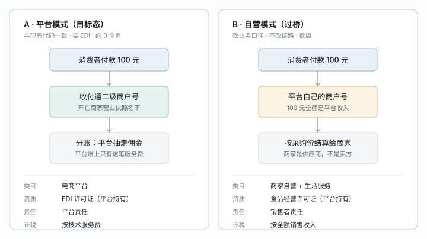

# ADR-012 小程序类目与经营模式选择（平台 / 自营）

> 2026-08-11 提案 · **待决策**，卡在「股权结构是否含外资」这一条上（见 §6.1）
> 优先级：P0 —— 类目定不下来小程序发不了版，`mch_payment_merchant` 那条链路也不知道该不该接真通道
> 相关：ADR-002（分账）· ADR-011（主体与门店）· [入驻进件建店](../../requirements/入驻进件建店-需求与四层对齐.md) · [交付计划-商家侧](../../requirements/交付计划-商家侧.md) E3

---

## 1. 一句话

小程序注册要选服务类目，而**类目由「钱先落到谁名下」决定**：钱进商家的二级商户号就是「电商平台」类目（要 EDI 许可证，约 3 个月），钱进平台自己的商户号就是「商家自营」类目（要平台自己持有食品经营许可证，数周）。本 ADR 提议**按 A 定型、按 B 过桥**：现在启动 EDI 申请，一期以自营模式报「商家自营」上线，拿证后再切回。

## 2. 为什么是这个方案

### 2.1 先说清判据：微信怎么区分自营和平台

只看一条——**交易的卖方是谁**。三个可观察的信号，任意一条成立就判为平台：

| 信号 | 本仓库现状 |
|---|---|
| 钱直接进第三方商家账户 | `mch_payment_merchant.pay_merchant_no` 是收付通二级商户号，商家名下 |
| 商家自己上架、自己定价 | B 端建品、改价全在商家侧 |
| 平台按比例抽成 | 费率 + 分账，且有争议裁决 |

所以**按现有代码原样提交，只能选「电商平台」**。选「商家自营」提交必被驳回，且驳回后重提要重走类目审核，是净损失。

### 2.2 三个选项

| | A 平台模式 | B 自营模式 | C 找有证主体挂靠 |
|---|---|---|---|
| 类目 | 电商平台 | 商家自营 + 生活服务 | 借用对方类目 |
| 硬门槛 | EDI 许可证 | 平台自持食品经营许可证 | 无 |
| 周期 | 约 3 个月 | 数周 | 最快 |
| 与代码一致 | ✅ 完全一致 | ⚠️ 链路不改，业务口径改 | ✅ |
| 结论 | **目标态** | **一期过桥** | ❌ 否掉 |

**C 否掉的理由**：小程序主体与实际经营主体不一致，属于微信明令禁止的「主体不符」，被举报即封禁且不可申诉；更要命的是收款进的是挂靠方账户，一旦对方翻脸，钱和用户数据都不在你们手里。这个选项在早期项目里很常见，所以专门写在这里——**不是没人提，是提了被否**。

**为什么不是「等 EDI 下来再上线」**：EDI 申请材料里要求域名已备案、网站可访问，且审查时会实际打开看。没有已上线的东西，申请本身就推不动。B 不只是过桥，它还是 A 的前置条件。

## 3. 结构

图上看不出来的两件事：

- **左右两边的代码链路是同一条**。差别只在 `mch_payment_merchant` 有没有激活的 `pay_merchant_no`——没有就走平台自己的商户号收款。所以切换不是重构，是开关。
- **右边那条「按采购价结算给商家」在系统里是空白**。自营模式下商家从「分账接收方」变成「供应商」，这笔钱怎么结、按什么周期、走不走线上，现在一行代码都没有（见 §6.3）。

| 模式 | 微信类目 | 平台需持有的证 | 代码状态 |
|---|---|---|---|
| A 平台 | 电商平台 → 综合电商平台 | EDI 许可证（B11） | 已实现，进件是 stub |
| B 自营 | 商家自营 → 日用百货（主营） 商家自营 → 生鲜果蔬 生活服务 → 家政 | 营业执照 + 食品经营许可证（含网络经营） | 进件停在未激活态即可 |

## 4. 详细设计

### 4.1 类目与品类的对应

`CATEGORY_TYPE` 五档到微信类目的映射：

| 品类 | 微信类目 | 一期 | 说明 |
|---|---|---|---|
| `NORMAL` 日用 | 商家自营 → 日用百货 | ✅ 主营 | 零资质，先靠它过审上线 |
| `FRESH` 生鲜 | 商家自营 → 生鲜果蔬 | ✅ | 食品资质见 §4.2 |
| `SERVICE` 服务 | 生活服务 → 家政 / 维修 | ✅ | 对应 `SERVICE_SCOPE=CITY` 那档 |
| `CARD` 卡券 | 商家自营 → 其他 | ⏸ 缓 | 见 §4.3 |
| `VIRTUAL` 虚拟 | —— | ⏸ 缓 | iOS 端小程序虚拟支付有政策限制 |

类目最多加 5 个，每加一个过一轮审核，**主营类目定错后面改动静大**。一期只提前三个。

### 4.2 食品资质分三档，别按最重的准备

| 卖什么 | 要什么 | 周期 |
|---|---|---|
| 初级农产品（未加工蔬果、蛋、活鲜） | 营业执照经营范围含「食用农产品销售」 | 随执照变更 |
| 预包装食品（粮油、调味品、包装零食） | 「仅销售预包装食品」**备案**，线上办 | 数天 |
| 散装、需冷藏冷冻、现制现售 | 《食品经营许可证》，经营项目须勾**「网络经营」**，要有实际场所并接受现场核查 | 数周至两个月 |

词典里生鲜是「按标称重量预扣、称重后多退少补」（`nominalGram`），**这说明卖的是散装称重品，落在第三档**。这是 B 方案里最长的一根钉子，要和小程序类目申请同时启动，不能等类目审核被打回才发现。

### 4.3 卡券要分清是不是预付卡

- **优惠券**（满减、折扣、`mkt` 域现有的那些）：不是预付卡，不用备案，一期可留
- **储值卡**（充 100 送 20）：触发《单用途商业预付卡管理办法》，要在商务主管部门备案，企业还有资金存管要求

自营模式下储值形成的负债直接记在平台公司账上，比平台模式重得多。**一期关掉储值形态**。

### 4.4 切换点：代码上就一个开关

| 切换项 | A → B（上线时） | B → A（拿证后） |
|---|---|---|
| 收款 | `mch_payment_merchant` 全部停在未激活，走平台商户号 | 逐个商家进件、激活 |
| 分账 | 不调用 | 恢复 |
| 商家结算 | 走线下采购结算（§6.3 未做） | 回到分账 |
| 微信类目 | 商家自营 | 提类目变更，重审 |
| 开票主体 | 平台 | 商家 |

**一期只有一个店时这条链路完全等价**，和 ADR-011 里 `store_no` 的处理是同一个手法：让新旧形态在数据上共存，切换靠开关而不是迁移。

## 5. 取舍记录

**让掉的是财务口径的干净，换来的是上线时间。** 自营期的全部 GMV 会记成平台的销售收入，而不是技术服务费。这意味着：

1. 平台承担**销售者责任**而非平台责任——食品安全出问题直接找平台，不找菜摊
2. 收入、成本、税负三本账都按自营做，切回平台模式后**前后两段账不可比**
3. 营业执照经营范围要补齐（食用农产品销售、食品销售、日用百货零售、家政服务）

第 2 条是最容易被忽略、也最难回头的。**所以 B 是过桥不是形态**：应控制在 EDI 拿证周期内（约 3 个月），且最好限制 GMV 规模。要把自营当长期形态跑，得先让财务算一遍税负——这是另一个决策，不在本 ADR 范围。

**防住什么**：不写这一节的话，半年后有人会看着「反正现在自营跑得挺好」而放弃 EDI 申请，等到 GMV 起来再切，那时候的追溯成本比现在高一个量级。

## 6. 待确认

### 6.1 ⚠️ 阻塞项：股权结构是否含外资

EDI 走普通流程的前提是**纯内资**。有任何外资股权就要报商务部 + 工信部的外商投资电信企业审批，实操上基本办不下来（港澳台有 CEPA 例外通道）。

`neargo.ai` 这个域名，加上代码里的 `priceByMarket`（多市场定价）与多语言，都指向可能有海外背景。**这条不确认，A 方案的三个月周期就是假的**——如果卡住，B 就不是过桥而是唯一选项，§5 的取舍要整个重算。

### 6.2 EDI 其余条件的自查

| 条件 | 要求 | 现状 |
|---|---|---|
| 注册资本 | ≥ 100 万（省内）/ ≥ 1000 万（跨省），认缴即可 | ❓ |
| 社保 | 3 名员工，连续 1 个月以上（部分省要 3 个月），主体须是申请公司 | ❓ |
| 域名与备案 | 域名归申请公司、已 ICP 备案、网站可访问 | ❓ |
| 服务器 | 境内，托管商有 IDC 资质，需出具协议 | ❓ |

材料里的**可行性研究报告与技术方案**是主要工作量，`docs/technical/` 现有内容可直接改写。流程：工信部电信业务综合管理平台线上提交 → 省通信管理局受理（约 5 工作日）→ 审查（法定 60 工作日，实际 30–90 天，常有 1–2 轮补正）→ 发证，有效期 5 年，每年 1–3 月报年报。

### 6.3 自营期的商家结算没有实现

B 模式下商家从分账接收方变成供应商，这笔采购结算**系统里是空白**：按什么周期、按什么价、线上还是线下、要不要在 B 端可见。一期若走 B，这是必须补的一块，不是可以拖的。

### 6.4 本文档的信息来源

**类目名称与法规条款均未在本次会话中联网核实。** 微信服务类目表的二级名称一年内改过多次，提交前请以 mp.weixin.qq.com → 设置 → 基本设置 → 服务类目里的实际列表和「类目详情」中列的资质为准；EDI 的地方性要求（尤其社保月数）各省通信管理局口径不一，以属地为准。

---

> 决策后请回来把抬头的「待决策」改掉，并同步 [交付计划-商家侧](../../requirements/交付计划-商家侧.md) 的 E3。
