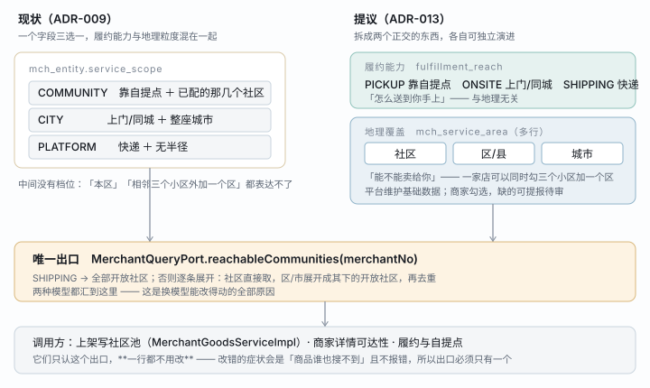

# ADR-013 经营范围：从三档枚举改为「履约能力 × 多级地理覆盖」

> 2026-08-11 提案 · **已决策**（§6 三条全部拍板，见各节）· 阶段一、二已落地
> 修订：[ADR-009](./ADR-009-商家经营范围三档模型.md)（三档模型）· 影响 [ADR-005](./ADR-005-履约方式与自提点模型.md)
> 相关：[TDD-一期主数据收敛](../design/TDD-一期主数据收敛.md)（一期把三档收敛到两档，本 ADR 换的是模型本身）

---

## 1. 一句话

商家的经营范围要能表达「这三个小区 + 整个西湖区」，而不是只能在三个档位里选一个；平台维护行政区划与社区两级基础数据，商家在其上勾选，缺的可以提报、由运营审核后成为平台数据。

## 2. 为什么是这个方案

### 2.1 现状的问题不是「档位太少」，是**两件事被压进了一个字段**

`service_scope` 的三档是这样定义的（ADR-009）：

| 档 | 它其实同时说了两件事 |
|---|---|
| `COMMUNITY` | 履约=靠自提点 · 地理=已配的那几个社区 |
| `CITY` | 履约=上门或同城配送 · 地理=整座城市 |
| `PLATFORM` | 履约=快递 · 地理=无半径 |

而[项目词典](../../requirements/项目词典.md)自己写着：

> **Scope ≠ Fulfilment**：范围管「能不能卖给你」，履约管「怎么送到你手上」。

**这条规矩从第一天起就没成立过** —— 三档正是按履约能力切的。于是想表达「我有同城配送能力，但只做这三个区」就无处可填：选 `CITY` 会卖到送不到的地方，选 `COMMUNITY` 又被绑死在自提点上。

所以本 ADR 的第一件事不是加档位，是**把这两件事拆开**。拆开之后「更详细的地理」才有地方放。

### 2.2 为什么现在能改

`reachableCommunities` 是**唯一出口**：全仓库只有 `MerchantGoodsServiceImpl`（上架写社区池）和商家域内部各一处调用它。ADR-009 当初把可见性收敛到这一个 Port 方法，正是为了这一天。

换模型只改这个方法的实现，调用方一行不动。**如果当初没收敛，这个 ADR 现在写不出来。**

### 2.3 被否掉的两个做法

| 做法 | 否掉的理由 |
|---|---|
| 给 `service_scope` 加档位（如 `DISTRICT`） | 治标。它仍然是「一个字段选一个」，表达不了「三个小区 + 一个区」这种组合，而那恰恰是最常见的诉求 |
| 用经纬度 + 半径画覆盖圈 | 半径不是商家的心智——他说的是「我送阳光花园和翡翠城」，不是「我送 2.4 公里」。而且社区已经是 C 端绑定的基本单位，圆和它对不齐时，「圈里但不在任何社区」的用户看到的是空列表 |

## 3. 结构



图上看不出来的三件事：

- **左右两侧最终汇到同一个出口**，所以这次换模型不是重写可见性，是换 `reachableCommunities` 的实现
- **社区不是行政层级**，是平台的运营单元（一个小区）。它必须挂在区划下，否则「按区覆盖」命中不了它
- **`SHIPPING` 那条捷径是有意的**：无履约半径的商家不该被要求逐个勾社区，那既是无谓劳动，也会在新开城时漏掉

### 3.1 三张表

| 表 | 归谁 | 说明 |
|---|---|---|
| `sys_region` 行政区划 | 平台 | 国标码，省/市/区县/**街道**四级（2/4/6/9 位），带 `enabled`（开城开关）。**已落地**，见 §6.3 |
| `cmt_community` 社区 | 平台（可由商家提报） | 现有表，`city_code`（自由文本）换成 `region_code` 外键 |
| `mch_service_area` 商家覆盖 | 商家勾选 + 运营审核 | 替代 `mch_entity_community`，一行一条覆盖项 |

**为什么区划用国标码而不是自造**：地址、快递单、发票、通道进件全都按国标走。自造一套迟早要在对外接口上做一次映射，而映射永远有对不上的那天 —— 那时症状是「这个地址快递下不了单」，没人会想到根因在区划表。

### 3.2 `mch_service_area`

| 列 | 说明 |
|---|---|
| `entity_no` | 商家主体 |
| `level` | `COMMUNITY` / `STREET` / `DISTRICT` / `CITY` |
| `ref_code` | `level=COMMUNITY` 时是 `community_no`，否则是 `region_code` |
| `source` | `SELF` 商家自选 / `OPS` 运营指定（入驻审核时定的） |
| `status` | `ACTIVE` 已生效 / `PENDING` 待审 |

> ⚠️ 唯一键要**带上 `deleted`**，或者干脆用物理删除。
> `mch_entity_community` 的 `uk_entity_community(entity_no, community_no)` 不含 `deleted`，
> 于是「移除某社区、之后又加回来」直接撞唯一键，商家看到的是「系统开小差了」——
> 2026-08-11 的 E2E 实测撞到过。新表不要重复这个。

### 3.3 履约能力字段

`mch_entity` 新增 `fulfillment_reach`：`PICKUP` / `ONSITE` / `SHIPPING`。

原三档的迁移映射：

| 原 `service_scope` | → `fulfillment_reach` | → `mch_service_area` |
|---|---|---|
| `COMMUNITY` | `PICKUP` | 原 `mch_entity_community` 的每一行，`level=COMMUNITY` |
| `CITY` | `ONSITE` | 一行 `level=CITY`，`ref_code` 取 `service_city_code` |
| `PLATFORM` | `SHIPPING` | 无行（`SHIPPING` 走捷径，不需要覆盖项） |

`service_scope` 列**保留一个版本再删**：改错的症状是「商品谁也搜不到」且不报错，留着它才能在出事时对照回滚。

## 4. 详细设计

### 4.1 `reachableCommunities` 的新实现

```
if reach == SHIPPING            → 全部开放社区（现有 openCommunityNos）
else
    for area in ACTIVE areas:
        COMMUNITY → 直接取 ref_code
        DISTRICT  → 该区划下全部开放社区
        CITY      → 该市下全部开放社区（含其下各区）
    去重
```

**空集合的含义不变**：这家店对谁都不可见。现有代码已经在写入口拦「选了 `COMMUNITY` 却一个社区都没配」，这条规则要跟着搬到新模型上 —— 它防的是「保存成功、商品在架、订单为零」这种无报错故障。

### 4.2 什么要审、什么不用审

| 动作 | 是否审核 | 为什么 |
|---|---|---|
| 勾选**已有社区** | ❌ 自助 | 就是今天的行为，加一层审只会把入驻拖长 |
| 勾选**区/市** | ✅ 需审 | 一家菜摊声称覆盖整个西湖区，得有履约能力佐证。影响面差一个量级 |
| **提报新社区** | ✅ 需审 | 见 §4.3 |

### 4.3 商家提报新社区：走独立申请单

商家知道自己送哪个小区，而平台还没开 —— 这是真实需求，也是「商家可以自定义」的正解。

但**商家不能直接创建生效的社区**。理由是硬的：社区是 **C 端绑定的基本单位**，消费者绑的是平台社区。商家自造一个「阳光花园二期」而消费者绑的是平台的「阳光花园」，两边对不上 —— 商家以为覆盖了，实际谁也看不到，**且不报错**。这正是本仓库反复记录的那类故障。

所以：新建 `cmt_community_apply` 独立申请单，通过后才创建 `cmt_community`。

**为什么用独立申请单而不是在 `cmt_community` 里留 `PENDING` 行**：与 ADR-011 的入驻申请完全同一条理由 —— 驳回的行留在主表就是「僵尸社区」，它会出现在按社区聚合的每一处（自提点、商品池、报表），而它从来没有开过。

### 4.4 运营端要有的面

| 页面 | 内容 |
|---|---|
| 区划主数据 | 导入国标；按区/市启停（**开城开关**）；带「该区划下有几个社区、几家商家」 |
| 社区 | 现有页面加 `region_code`；新增「商家提报」待审队列 |
| 商家覆盖 | 入驻审核时可改；单独可查「这家店覆盖了哪些地方、哪几条待审」 |

计数不是装饰：停用一个区划会让它下面所有商家的覆盖失效，不带计数就是盲操作 —— 与行业页同一个标准。

### 4.5 与一期开关的关系

[TDD-一期主数据收敛](../design/TDD-一期主数据收敛.md) 做的 `merchant.service-scope-enabled` 白名单，在新模型下改为**按 `level` 控制**：一期只开 `COMMUNITY` 级，`DISTRICT`/`CITY` 待 EDI 后放开。语义一致，运营端那个开关页只需换数据源。

## 5. 取舍记录

**让掉的是「一个字段看懂一家店」。** 现在看一眼 `service_scope` 就知道这家店什么形态；之后要看两个字段加一张关联表。代价是真实的：排查问题时多一次 join，运营培训多一页。

换来的是三件今天做不到的事：跨粒度组合覆盖、开城时不必逐个改商家、履约能力与地理各自演进（加「同城即时配」不再需要动地理模型）。

**没让的是出口的唯一性。** 模型复杂了，但 `reachableCommunities` 仍然是唯一出口，调用方仍然只认它。复杂度被关在商家域里 —— 这是这次敢改的前提，也是下次还敢改的前提。

## 6. 待确认（三条都必须先拍）

### 6.1 ✅ 已定：自由组合 ＋ 可提报待审，**否掉「自建即生效」**

| 读法 | 结论 |
|---|---|
| (a) 在平台基础数据上**自由组合**覆盖范围 | ✅ 做（阶段二） |
| (b) 自己**新建社区**并立即生效 | ❌ 否掉，理由见 §4.3 |
| (c) 自己**提报**新社区，运营审核后生效 | ✅ 做（阶段三） |

### 6.2 ✅ 已定：**拆**（阶段二已落地）

拆成 `fulfillment_reach`（履约能力）× `mch_service_area`（地理覆盖）。不拆的话，
「有同城配送能力但只做三个区」仍然无处可填 —— 改完还是表达不了。

这是整个 ADR 里风险最高的一步：C 端可见性是主链路，改错的症状是
「商品谁也搜不到」且**不报错**。所以迁移的第一原则是**逐字保持今天的行为**，
新能力只在商家主动去框范围之后才生效。

#### 「没框地理范围」的含义由履约能力决定

这是迁移能保持行为的关键一条，也是新模型里最容易看错的一格：

| `fulfillment_reach` | 没有任何覆盖项时 | 为什么 |
|---|---|---|
| `PICKUP` 靠自提点 | **谁也看不到** | 自提必须有落点。今天 `scope=COMMUNITY` 却没配社区就是这个结果，写入口也一直拦着 |
| `ONSITE` 上门/同城 | **全部开放社区** | 上门没有落点约束，没框 = 不限。今天 `scope=CITY` 就是这个结果 |
| `SHIPPING` 快递 | **全部开放社区** | 同上。今天 `scope=PLATFORM` 就是这个结果 |

原三档到新模型是一一对应的，所以**迁移之后每一家店可达的社区集合完全不变**：

| 原 `service_scope` | → `fulfillment_reach` | → 覆盖项 | 展开结果 |
|---|---|---|---|
| `COMMUNITY` | `PICKUP` | 原关联表每行一条 `level=COMMUNITY` | 与原来同一批社区 |
| `CITY` | `ONSITE` | 无（`service_city_code` 存量全是 NULL，造不出来也不该瞎造） | 全部开放社区，与原来相同 |
| `PLATFORM` | `SHIPPING` | 无 | 全部开放社区，与原来相同 |

### 6.3 ✅ 已定：到**街道**，数据已入库（2026-08-11）

我原先建议只到区县，理由是「街道那层没有履约意义、数据量大一个量级」。**已被否决，按街道做。**

落地情况：

| 层级 | 条数 | 码长 |
|---|---|---|
| 省 | 31 | 2 |
| 市 | 342 | 4 |
| 区县 | 2978 | 6 |
| 街道 | 41352 | 9 |
| **合计** | **44703** | |

- 表：`sys_region`（`V30__sys_region.sql`，只建表）
- 数据：`V31__seed_regions.java`（Java 迁移）读 `db/data/regions.csv.gz`（399 KB）

**为什么数据不写进 .sql 迁移**：`gen-test-schema.py` 会把非 SELECT 的 INSERT 原样抄进
`schema-test.sql` 当种子 —— 4 万行会让那份生成物涨到几 MB，且每个 Spring 测试上下文
都要灌一遍。参考数据不是 schema：写成 4 万行字面量之后，以后每次看 schema diff
都得先翻过它们。实测拆开之后 `schema-test.sql` 只涨了 674 字节（一张建表）。

Java 迁移同样受 Flyway 版本管理，只是不落在 `V*.sql` 的 glob 里 —— 正好是要的效果。
真库上 V31 执行耗时 2.4 秒。

#### 这份数据的三个已知边界

1. **不会再更新**。来源是国家统计局统计用区划代码（经
   [modood/Administrative-divisions-of-China](https://github.com/modood/Administrative-divisions-of-China)
   整理，截至 2023-06-30），而统计局自 2024-10 起不再公开具体代码。
   要更新的口径得换源（如 `xiangyuecn/AreaCity-JsSpider-StatsGov`，综合民政部与地名库）。
2. **不含港澳台** —— 31 个省级单位，不是 34。
3. **直辖市多一层「市辖区」**：北京市 → 市辖区 → 东城区。这是统计局的官方结构，
   数据按原样入库没有捏造。但选择器上直接展示会读着别扭，端上要不要折叠这一层
   是个界面决定，**别在数据里改** —— 改了就与国标对不上，而对外接口按国标走。

## 7. 分期建议

| 期 | 内容 | 能不能独立上线 |
|---|---|---|
| **一** | `sys_region` + 社区挂 `region_code` + 运营端区划页 | ✅ 纯增量，不动现有逻辑 |
| **二** | `fulfillment_reach` + `mch_service_area` + `reachableCommunities` 换实现 + 数据迁移 | ⚠️ 主链路，要灰度 |
| **三** | 商家提报社区 + 审核队列 | ✅ 独立功能 |

一期做完就已经能回答「这个社区在哪个区」，而那是后面两期的地基。**不建议一二期一起上** —— 二期改的是可见性，出事的症状是「商品谁也搜不到」，要能单独回滚。

---
> 决策后：拍板 §6 三条 → 补 TDD（按分期各一份）→ 编码。
> 现有 `mch_entity_community` 的唯一键缺陷（§3.2 ⚠️）与本 ADR 独立，可以先修。

---

## 9. `service_scope` 怎么拆除（2026-08-12 盘点）

V33 的注释写着「确认线上稳定之后另起一版删掉」。**盘完发现它不是删一列，是拆一条写入路径** ——
删列之前先看这份清单，否则会在改到一半时才发现入驻审核链还在写它。

### 9.1 它现在还在哪儿

| 位置 | 处数 | 做什么 |
|---|---:|---|
| `shop-core` | 72 | 大头在**入驻审核链**：`OpsServiceImpl.activate` 用它给新商家定范围、`OpsPlatformController` 的入驻审核入参、`MchEntityApply` 申请单上存着商家自己填的值 |
| `shop-merchant` | 24 | 老写入口（`MerchantStoreServiceImpl` 只在 `cmd.serviceAreas() == null` 时写）、`countByServiceScope`（运营改档位前看影响面） |
| `shop-base` | 10 | `MerchantAdminPort` / `MerchantQueryPort` 的签名与注释 |
| `shop-app` | 6 | B 端与小程序端的请求体字段 |
| 三端 | 55 | `MasterData.serviceScopes` 仍在下发（一期开放档位白名单），b-app 已改读 `fulfillmentReach`，c-app 与 ops-web 还在用 |

### 9.2 拆除顺序（每步都能单独上线）

1. **先断入驻审核这条**：`activate` 改成写 `fulfillment_reach` + `mch_service_area`，
   不再写 `service_scope`。**这一步最容易出事** —— 审核通过却没配可达范围的话，
   商家登录 B 端会发现自己的货谁也看不到（M9a 里有一条回归专门守这个）
2. **停掉老写入口**：`MerchantStoreServiceImpl` 里那个 `else if` 分支删掉，
   端上一律传 `serviceAreas`。此时 `service_scope` 变成只读
3. **改计数口径**：`countByServiceScope` → 按 `fulfillment_reach` 计。
   运营端「关掉某一档前看影响面」那个功能跟着改文案
4. **端上下线**：`MasterData.serviceScopes` 不再下发，c-app / ops-web 跟着改
5. **最后删列**：`ALTER TABLE mch_entity DROP COLUMN service_scope`

### 9.3 为什么不趁现在一起做

阶段二收尾时评估过：74 处引用横跨四个模块，而其中**入驻审核那条链的行为最难验证** ——
它只在「新商家审核通过」这一个时刻跑一次，跑错了不报错，症状要等商家上架商品之后才出现。
一期上线在即，此刻动它的风险大于收益。**留着一列冗余数据不会出错，改错了会让新商家整店隐身。**
