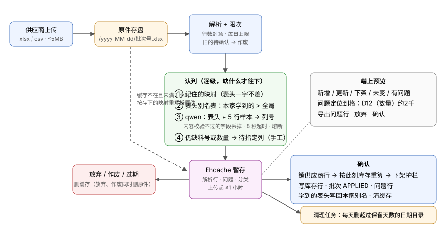

# TDD-元器件 · 库存上传二期（别名表与大模型认列 · 定位到格 · 内存暂存 · 原件存盘 · 护栏与记录）

> 2026-09-30 · 状态：**草稿 v2**（v1 只有分级报错 / 导出 / 护栏 / 记录 / 限次；v2 加入认列、暂存、存盘，并改掉了「上传即写原样行」）
> 档位：1（1 张新表 · 2 张表加列 · 8 个新端点 · 2 个端点改入参 · 3 个错误码 · 11 个配置项 · elec-core 加 ehcache 依赖）
> 依据：[PRD-元器件-库存表上传](../requirements/PRD-元器件-库存表上传.md) §三 AC1–AC24
> 前置：[独立服务与第一步](./TDD-元器件-独立服务与第一步.md)（上传主链路）· [运营端接口](./TDD-元器件-运营端接口.md)（`ElecOpsGuard`）

---

## 一句话（L1）

上传的原件先落盘；认列按 **记住的映射 → 表头别名表 → qwen → 手工** 逐级兜底；解析结果**只放 Ehcache**、
上传起最多 1 小时，缓存丢了就从原件重建；确认时加锁重算、过护栏，才把库存行、批次、问题行写进库。



图上最要紧的是两条虚线：**缓存不是数据的唯一住处** —— 原件在盘上、映射在批次行里，
所以缓存被挤出、服务重启都只是「慢一点」，不是「数据没了」。这让我们敢把缓存容量压得很小（堆只有 768MB）。

---

## §0 对账一 · 需求 → 设计

| AC | 需求（一句话） | 落点 |
|---|---|---|
| AC1 | 别名表命中不调大模型 | 新表 `elc_header_alias`（种子 = 现 `Columns.NAMES`）· `HeaderAliases` · `Columns.guess(rows, aliases)` |
| AC2 | 认不出调 qwen，来源标 AI | 端口 `gateway/ElecColumnAi` · 实现 `elec-svc/QwenColumnAi` · `ColumnResolver` · `BatchPreview.columnSource` |
| AC3 | 大模型结果内容校验 | `ColumnResolver#verify`（样本行 ≥60% 像料号 / 能读成数量） |
| AC4 | 大模型不可用 → 待指定列 | `ColumnResolver` 失败返回空；批次状态 `NEED_MAPPING`；`remap` 出口 |
| AC5 | 确认后学成本家别名 | `apply` 末尾 `HeaderAliases#learn(supplierNo, …)`；查找顺序本家 > 全局 |
| AC6 | 错误定位到格、一行多处 | `Issue(row, col, header, value, code, level)`；`plan` 逐字段收集不再 `continue` |
| AC7 | 错误 / 警告分级 | `Issue.level`；`BatchPreview.rowWarn` |
| AC8 | 导出问题行（标红、全文本） | `support/SheetWriter` · `GET …/batch/{no}/problems` |
| AC9 | 合并补传不动已上架 | 无新代码（MERGE 语义），测试钉住 + 端上入口默认 MERGE |
| AC10 | 预览返回解析后的数据 | `GET …/batch/{no}/rows?view=` · `PendingBatch.rows` 带分类 |
| AC11 | 预览期库里只有元数据 | `upload` 不再写 `elc_stock_batch_row` |
| AC12 | 放弃即删 | `DELETE …/batch/{no}` · 状态 `CANCELLED` · `PendingBatchCache#evict` · `UploadFileStore#delete` |
| AC13 | 1 小时失效 | `PendingBatchCache` 的到期时刻 = `created_at + ttl`；`requirePending` 同一个式子 |
| AC14 | 重启后从原件重建、不重调大模型、不延寿 | `PendingBatchCache#getOrRebuild` · 自定义 `ExpiryPolicy` 按到期时刻算剩余 |
| AC15 | 一家一张待确认 | `upload` 开头把本家 `PARSED/NEED_MAPPING` 置 `SUPERSEDED` 并清理 |
| AC16 AC17 | 下架护栏，比重算后的数 | `apply(…, expectDelist)` · `ELEC_DELIST_CONFIRM` · `elec.upload.delist-confirm-bp` |
| AC18 | 确认串行 | `SupplierMapper#lockBySupplierNo`（`FOR UPDATE`） |
| AC19 | 原件按日期存、定期删 | `support/UploadFileStore` · `elec-svc/ElecUploadCleaner`（`@Scheduled`） |
| AC20 | 每日上限，只数上传 | `StockBatchMapper#countSince` · `ELEC_UPLOAD_DAILY_LIMIT` |
| AC21 | 上传记录；原件清掉仍能导出 | `ElecStockBatchService` · 问题行在 `apply` 时写入 `elc_stock_batch_row` |
| AC22 | 运营查记录 | `GET /elec/ops/supplier/{no}/batch` · `PERM_SUPPLIER_READ` |
| AC23 | 运营提升别名为全局 | `/elec/ops/header-alias` 三条 · `PERM_BASE_MANAGE` |
| AC24 | 别人的批次 404 | `ElecStockBatchService#own` / `requirePending` 都按 supplier_no 取 |

**孤立项**：没落点的 AC 无；挂不上 AC 的设计无。PRD 二期各行本篇不碰。

---

## §1 现状与影响面

**直接复用**：

| 复用 | 在哪 |
|---|---|
| 解析、zip 炸弹 / XXE 防线、GBK 回退 | `SheetReader`（不改） |
| 阶梯价列、含税提示、表头行探测 | `Columns`（改：别名从参数传入，不再读常量） |
| 先算后做、空格子不改、全量替换 | `ElecStockImportServiceImpl#plan / #apply`（改：数据源从库换成缓存） |
| 调 cdw qwen 的写法 | `shop-channel/…/GoodsVisionGateway`：**钉死 HTTP/1.1**（sglang 不认 h2c，会丢请求体）、**关 thinking**（否则 content 是空串）、**不用 response_format**（这台部署上无效）。elec 不依赖 shop-channel，照这三条另写一个 |
| 每天一次的任务 | `ElecExpiryReminder` 的形状（`@Scheduled` + cron 配置，`-` 关掉） |
| ehcache 版本 | 根 POM 走 Boot BOM（`backend/pom.xml` 注释：别在模块里另钉版本，jakarta classifier） |

**实测依据**（2026-09-30，从生产机 `soukmind-tx` 发出）：

- 生产机 → `cdw.near3.ai:8003/v1/models`：200，0.34s。
- 表头 `序 / Item / Maker / Stk / 年份 / Pkg / 含税价 / 备注` + 3 行样本，连发三次，三次都回
  `{"MPN":1,"MFR":2,"QTY":3,"DC":4,"PACKAGE":5,"PRICE":6}`，0.73–1.04s，29 个输出 token。
  这张表头里 `Item`、`Stk` 不在现有同义词表里 —— **正是规则认不出、大模型能认出的那一类**。
- elec-svc：`-Xmx768m`；systemd `ProtectSystem=full`、`ReadWritePaths` 只有日志目录；`/data` 余 38G。

**会被改到的已在跑的功能**：

| 改动 | 对老端上的影响 |
|---|---|
| 上传不再写 `elc_stock_batch_row`，数据进缓存 | 无（端上从不读这张表）。**表的语义变成「确认时的问题行」**；生产里已有的旧批次原样行留着，不迁移 |
| 预览有效期 24 小时 → 1 小时 | 老端上开着预览超过 1 小时会拿到「已失效」—— 本来就有这个错误码与文案 |
| 认不出表头：报错 → 回 `NEED_MAPPING` 状态 | **老端上会拿到一个没有映射的预览**。端上同批改好（列映射页本来就能选列）；发布顺序见 §2.9 |
| 确认过线要 `expectDelist` | 老端上全量替换过线时被拒 —— 正是护栏要的 |
| 再传一张会作废前一张 | 老端上无感（它一次只拿一个 batchNo） |
| `Columns.NAMES` 常量删掉，换成表 | 行为不变：种子逐条等于原常量（测试比对） |

**明确不受影响的**：买家搜索与 `elc_part_market`；「仍有货」续期；到期提醒；询价与派单；已上架库存行的字段。

---

## §2 方案

### 2.1 认列：四级递进

```
① 记住的映射   本家上次确认过的批次，表头一字不差 → 直接用（现有逻辑，保留）
② 别名表       HeaderAliases.lookup(supplierNo)：本家 LEARNED 覆盖全局 SEED/OPS
               → Columns.guess(rows, aliases)：表头行探测、同义词、阶梯价列
③ qwen         仅当 ② 之后「缺料号 / 缺数量 / 缺厂牌 / 两列抢同一字段 / 没找到表头行」之一成立
④ 手工         ③ 之后仍缺料号或数量 → status = NEED_MAPPING，端上逐列选
```

每个字段记来源：`REMEMBERED / ALIAS / AI / MANUAL`，存 `elc_stock_batch.column_source`（JSON），回给端上。
端上对 `AI` 来源的字段加「AI 识别，请核对」角标。

**③ 的合并规则**：**大模型只填 ② 没认出的字段**，② 认出的不让它改 —— 规则认出来的是确定的，
大模型的是概率的，反过来会让一张本来认得好好的表被模型「纠正」错。例外：② 里两列抢同一字段时，以模型为准并校验。

**③ 的输入**（`ElecColumnAi.guess(List<List<String>> head10, List<FieldSpec> fields)`）：

- 前 10 行（找表头行用），每格截 40 字符，最多 40 列；**数据行最多 5 行**（PRD 待拍板 #4：样本会经公网）
- 字段清单：码 + 中文说明 + 一两个例子（`MPN 料号/型号，如 STM32F103C8T6`）
- 输出要求：`{"headerRow":0,"columns":{"MPN":1,"QTY":3}}`，只输出 JSON

**③ 的校验**（`ColumnResolver#verify`，防住：模型认错了列，而一个错的料号列会让整张表作废或错上架）：

| 字段 | 样本行（表头下 ≤20 行非空）里至少 60% 满足 | 否则 |
|---|---|---|
| MPN | `Mpn.looksLikeMpn(Mpn.norm(v))` | 丢掉 |
| QTY | `Cells.qty(v) != null` | 丢掉 |
| MFR | 不是纯数字 | 丢掉 |
| PRICE / MOQ / SPQ | `Cells.priceE6` / `Cells.moq` 能读 | 丢掉 |
| 其余 | 不校验 | — |

另外：`headerRow` 必须在 0..9；列号在范围内；同一列不许给两个字段；字段码不认识的丢掉。

**③ 的保护**：超时 8 秒；**熔断** —— 连续 3 次失败后 5 分钟内不再调，直接走 ④（防住：cdw 挂了时每次上传都白等 8 秒）；
`elec.ai.enabled=false` 时整级跳过。失败一律记 WARN 日志并回空，**不让上传失败**。

**学习**（AC5）：`apply` 成功后，对来源是 `AI` 或 `MANUAL` 的字段，把那一列的表头原文规范化后写成
`(supplier_no=本家, alias_norm, field, source=LEARNED)`。跳过：表头为空、规范化后不足 2 字符、是阶梯价表头。
**只写本家、不写全局** —— 防住：一家把「规格」当料号，全平台跟着认错。全局要运营提升（AC23）。

### 2.2 问题定位到格

```java
/** 一处问题。row 与 Excel 左边的行号一致；col 从 0 起，端上显示成字母 */
public record Issue(int row, int col, String header, String value, String code, String level) {}
```

- `plan()` 逐字段收集，**一行多处全记**（现在是遇到第一处就 `continue`）；有 ERROR 的行不进 `valid`。
- `value` 截 64 字符；`col = -1` 表示整行级问题（如 `DUPLICATE`，`arg` 里给「与第 N 行重复」）。
- 预览回包带：各问题码计数 + 前 100 条；全部走 `rows?view=PROBLEM` 分页。
- 人话在端上拼：`D12（数量）读不出：约2千`。列字母用现有 `colLetter`。

问题码：

| 码 | 级别 | 位置 |
|---|---|---|
| `MPN_MISSING` / `MPN_INVALID` | ERROR | 料号列 |
| `QTY_INVALID` | ERROR | 数量列 |
| `DUPLICATE` | ERROR | 整行（`col=-1`） |
| `MFR_MISSING` / `MFR_UNKNOWN` | WARN | 厂牌列（没映射厂牌列时 `col=-1`） |
| `QTY_ZERO` | WARN | 数量列 |
| `DC_UNPARSED` | WARN | 批号列 |

### 2.3 内存暂存（Ehcache）

**放什么**：`PendingBatch`（不可变）—— `batchNo`、`supplierNo`、`deadline`、映射、`List<ParsedRow>`（解析后的值 + 分类 INSERT/UPDATE/UNCHANGED）、
`List<Issue>`、下架行的 `lineKey` 列表、计数。**不放原始单元格**（重建与导出从原件读，省一半内存）。

**容量**（堆 768MB）：一行解析结果约 0.6KB，2 万行 ≈ 12MB。上限 `elec.upload.cache-max-batches=10` 条，最坏约 120MB。
超了按 LRU 挤出 —— **挤出无害**，下次访问从原件重建（AC14）。一家只留一张待确认（AC15），10 条 ≈ 10 家同时在看预览。

**到期**：Ehcache 3 原生 API（不走 JCache、不走 Spring Cache 注解 —— 要的是自定义到期策略）：

```java
ExpiryPolicy<String, PendingBatch> byDeadline = new ExpiryPolicy<>() {
    public Duration getExpiryForCreation(String k, PendingBatch v) {
        return Duration.between(Instant.now(), v.deadline()).isNegative() ? Duration.ZERO
                : Duration.between(Instant.now(), v.deadline());
    }
    public Duration getExpiryForAccess(String k, Supplier<? extends PendingBatch> v) { return null; } // 不因访问延长
    public Duration getExpiryForUpdate(String k, Supplier<? extends PendingBatch> o, PendingBatch v) { return null; }
};
```

- `deadline = batch.created_at + elec.upload.pending-ttl-minutes`（默认 60）。**重建出来的条目沿用同一个 deadline** ——
  防住：重建一次续一小时，内存里的数据实际能活好几个小时。
- 访问不延长（`getExpiryForAccess` 回 null）：用户要求的是「最多 1 小时」，不是「1 小时没人碰」。
- 判定是否过期**不信缓存**：`requirePending()` 先看库里批次 `status ∈ {PARSED, NEED_MAPPING}` 且 `now < deadline`，
  再去缓存取。缓存只是加速，状态以库为准。

**重建**（`PendingBatchCache#getOrRebuild`）：缓存未命中且库里判定仍有效 → `UploadFileStore.read(path)` →
`SheetReader.read` → 用**存下的** `header_row` / `column_map` / `tier_cols` 重解析 → 放回缓存。
**不重调大模型**（映射已在库里）。原件不在（被人手删了）→ 置 `EXPIRED`、回 `ELEC_BATCH_EXPIRED`。

**清理**：确认 / 放弃 / 作废 都 `evict`；过期交给 Ehcache 自己丢。**没有需要人去关的后台线程**，
这是用 Ehcache 而不是自己写 `ConcurrentHashMap` + 定时器的理由（防内存泄露的那一半由它负责）。

**多实例**：elec-svc 现在单实例。将来多实例时，缓存是各实例本地的，但**重建路径让它仍然正确**
（打到另一台就从原件重建）—— 前提是上传目录是共享盘。写进 §4 风险。

### 2.4 原件存盘

`UploadFileStore`（elec-core `support/`，纯文件操作，无 Spring 依赖便于单测）：

| 规则 | 防住什么 |
|---|---|
| 路径 = `<dir>/<yyyy-MM-dd>/<batchNo>.<xlsx\|csv>`，**文件名不取用户给的** | 路径穿越；中文 / 空格文件名在各种工具里的转义问题 |
| 扩展名按魔数判（`PK` → xlsx，否则 csv） | 用户把 csv 改名成 xlsx |
| 先写 `.part` 再原子 `move` | 半个文件被重建读到 |
| 库里存相对路径 `yyyy-MM-dd/B…xlsx` + `sha256` + 字节数 | 换目录只改配置；sha256 给二期去重用 |
| 日期按 `Asia/Shanghai` | 与库里 `created_at` 同一个日子，排查时对得上 |

**清理任务** `ElecUploadCleaner`（elec-svc，`@Scheduled(cron = "${elec.upload.clean-cron:0 30 3 * * *}")`）：

- 列 `<dir>` 下的子目录，**只认名字能解析成日期的**，早于 `today - retentionDays` 的整目录删。
- **按目录名判断，不看 mtime** —— mtime 会被拷贝、`touch`、备份恢复改掉，按它删会删错。
- 名字不像日期的目录、散落的文件一律不动，记一条 WARN。
- 删完记 INFO：删了几个目录、多少字节。

**启动自检**：`elec.enabled=true` 时，启动即 `createDirectories` + 写一个探针文件再删掉；失败**直接启动失败**，报出目录与运行用户。
防住：目录没权限时服务照常起来，第一个供应商上传才炸 —— 而那时看到的只是一个 500。
（生产上 elec-svc 以 `deploy` 身份跑，目录归属要对，见 §2.9。）

### 2.5 确认

`apply(userNo, batchNo, expectDelist)`，一个事务：

1. `requireActive` → `supplierMapper.lockBySupplierNo(no)`（`SELECT id FROM elc_supplier WHERE supplier_no=? FOR UPDATE`）
   —— 锁供应商行不锁批次行：冲突在两个**不同**批次之间（AC18）。
2. `requirePending` → `getOrRebuild` 拿 `PendingBatch`。
3. **按此刻库存重算分类与下架集**（缓存里的分类只给预览看）。
4. 护栏：`onSale = 本家 STATUS_ON 行数`；
   `needConfirm = toDelist > 0 && toDelist*10000 >= onSale*delistConfirmBp`；
   `needConfirm && !Objects.equals(expectDelist, toDelist)` → `ELEC_DELIST_CONFIRM(toDelist)`（AC16 AC17）。
5. `valid` 为空 → `ELEC_BATCH_EMPTY`（现有）。
6. 写库存行（现有逻辑）→ `market.refresh`。
7. 问题行入库：每个有问题的行一条 `elc_stock_batch_row`（`cells` 从原件取、`issues` JSON）。
   **在确认时入库而不是导出时读原件** —— 原件 7 天后被清掉，记录里的「导出问题行」仍要能用（AC21）。
8. 批次 → `APPLIED`，计数写回；`HeaderAliases#learn`；**事务提交后** `evict`（提交前清了，回滚时缓存已空，只能重建，无害但多一次 IO）。

### 2.6 契约变更

**端点**（供应商面走 `ctk_`；运营面走运营令牌 + `ElecOpsGuard`）：

| 方法 路径 | 新 / 改 | 入参 | 出参 | AC |
|---|---|---|---|---|
| `POST /elec/b/stock/upload` | 改 | + `name`（可选，≤128） | `BatchPreview` | AC1–AC4 AC15 AC20 |
| `POST /elec/b/stock/batch/{no}/remap` | 改（语义） | 不变 | `BatchPreview`；`NEED_MAPPING` 在这里转 `PARSED` | AC4 |
| `GET /elec/b/stock/batch/{no}/rows` | 新 | `view=INSERT\|UPDATE\|DELIST\|UNCHANGED\|PROBLEM`、`page`、`size≤100` | `List<PreviewRow>` | AC6 AC10 |
| `POST /elec/b/stock/batch/{no}/apply` | 改 | + body `{expectDelist?}` | `BatchPreview` | AC16–AC18 |
| `DELETE /elec/b/stock/batch/{no}` | 新 | — | `BatchPreview`（状态 CANCELLED） | AC12 |
| `GET /elec/b/stock/batch` | 新 | `page`、`size≤50` | `List<BatchSummary>` | AC21 |
| `GET /elec/b/stock/batch/{no}` | 新 | — | `BatchPreview` | AC21 AC24 |
| `GET /elec/b/stock/batch/{no}/problems` | 新 | — | xlsx 字节，**不套信封** | AC8 AC21 |
| `GET /elec/ops/supplier/{no}/batch` | 新 | `page`、`size` | `List<BatchSummary>` | AC22 |
| `GET /elec/ops/header-alias` | 新 | `scope=GLOBAL\|LEARNED`、`keyword`、分页 | `List<HeaderAliasRow>`（LEARNED 按写法聚合，带「几家在用」） | AC23 |
| `POST /elec/ops/header-alias` | 新 | `{alias, field}` → 全局 | `HeaderAliasRow` | AC23 |
| `PUT /elec/ops/header-alias/{id}` | 新 | `{field?, status?}` | `HeaderAliasRow` | AC23 |

运营别名三条用 `PERM_BASE_MANAGE`（与厂牌别名同一个码，放在 `ElecOpsBaseController`）。

**DTO**（`SupplierDtos`）：

```java
public record Issue(int row, int col, String header, String value, String code, String level) {}

// 原 RowProblem 由 Issue 取代。加：rowWarn、columnSource、issueCounts、delistConfirm、deadline、createdAt、appliedAt
// status：NEED_MAPPING / PARSED / APPLIED / CANCELLED / SUPERSEDED / EXPIRED（EXPIRED 读时算）
public record BatchPreview(String batchNo, String fileName, String mode, boolean taxIncluded,
        List<String> headers, int headerRow, Map<String, Integer> columns, Map<String, String> columnSource,
        int rowTotal, int rowValid, int rowInvalid, int rowWarn,
        int toInsert, int toUpdate, int toDelist, int unchanged,
        Map<String, Integer> issueCounts, List<Issue> issues, List<String> delistSample,
        boolean delistConfirm, String status, LocalDateTime deadline,
        LocalDateTime createdAt, LocalDateTime appliedAt) {}

/** 预览里的一行：解析后的值；UPDATE 带 before（只含变了的字段） */
public record PreviewRow(int row, String kind, String mpn, String mfr, String mfrCode, Long qty, String dateCode,
        String pkg, Integer moq, Integer spq, List<PriceTier> tiers, String currency, String packing,
        String cond, Integer leadDays, String region, Map<String, Object> before, List<Issue> issues) {}

public record BatchSummary(String batchNo, String fileName, String mode, String status,
        int rowTotal, int rowValid, int rowInvalid, int rowWarn,
        int toInsert, int toUpdate, int toDelist, int unchanged, boolean aiUsed,
        LocalDateTime createdAt, LocalDateTime appliedAt) {}

public record ApplyReq(Integer expectDelist) {}
```

`RowProblem` 删掉前，端上 `ElecRowProblem` 类型与 `stock-preview` 同批改（同一个提交里前后端一起，否则 vue-tsc 红）。

**库表**：`db/elec/V3__elec_upload_v2.sql`。V1、V2 已在生产执行，一个字节都不改（`ElecAppliedMigrationsFrozenTest`）。
写之前再 `ls db/elec/`：并行会话可能已占了 V3。

```sql
-- 表头别名。supplier_no='' 表示全局；不用 NULL —— MySQL 的唯一键不管 NULL，会让同一写法插进好几条全局别名
CREATE TABLE IF NOT EXISTS elc_header_alias
(
    id          BIGINT      NOT NULL AUTO_INCREMENT,
    supplier_no VARCHAR(32) NOT NULL DEFAULT '' COMMENT '空串 = 全局；否则只对这家生效',
    alias_norm  VARCHAR(64) NOT NULL COMMENT '规范化后的表头写法（大写、去空白与标点，保留 /）',
    alias_raw   VARCHAR(64) NOT NULL COMMENT '第一次见到时的原文，给运营看',
    field       VARCHAR(16) NOT NULL COMMENT 'MPN / MFR / QTY / DC / PACKAGE / PRICE / MOQ / SPQ / PACKING / CONDITION / CURRENCY / LEAD / REGION',
    source      VARCHAR(16) NOT NULL COMMENT 'SEED 种子 / OPS 运营加的 / LEARNED 供应商确认过的',
    status      VARCHAR(16) NOT NULL DEFAULT 'ACTIVE' COMMENT 'ACTIVE / DISABLED',
    created_at  DATETIME    NOT NULL DEFAULT CURRENT_TIMESTAMP,
    created_by  VARCHAR(64) DEFAULT NULL,
    updated_at  DATETIME    NOT NULL DEFAULT CURRENT_TIMESTAMP ON UPDATE CURRENT_TIMESTAMP,
    updated_by  VARCHAR(64) DEFAULT NULL,
    PRIMARY KEY (id),
    UNIQUE KEY uk_elc_header_alias (supplier_no, alias_norm)
) ENGINE=InnoDB DEFAULT CHARSET=utf8mb4 COMMENT='库存表表头别名';

INSERT IGNORE INTO elc_header_alias (supplier_no, alias_norm, alias_raw, field, source) VALUES
('', '型号', '型号', 'MPN', 'SEED'), ('', '料号', '料号', 'MPN', 'SEED'), ...;   -- 逐条等于现 Columns.NAMES

ALTER TABLE elc_stock_batch ADD COLUMN row_warn      INT          NOT NULL DEFAULT 0;
ALTER TABLE elc_stock_batch ADD COLUMN header_row    INT          DEFAULT NULL COMMENT '表头在第几行（从 0 起）；重建时按它解析';
ALTER TABLE elc_stock_batch ADD COLUMN column_source VARCHAR(512) DEFAULT NULL COMMENT '字段 → REMEMBERED/ALIAS/AI/MANUAL，JSON';
ALTER TABLE elc_stock_batch ADD COLUMN ai_used       TINYINT      NOT NULL DEFAULT 0 COMMENT '这次调过大模型没有';
ALTER TABLE elc_stock_batch ADD COLUMN file_path     VARCHAR(255) DEFAULT NULL COMMENT '原件相对路径 yyyy-MM-dd/批次号.xlsx；清理后文件不在，这里不改';
ALTER TABLE elc_stock_batch ADD COLUMN file_sha256   CHAR(64)     DEFAULT NULL;
ALTER TABLE elc_stock_batch ADD COLUMN file_size     INT          DEFAULT NULL;
ALTER TABLE elc_stock_batch_row ADD COLUMN issues      VARCHAR(1024) DEFAULT NULL COMMENT '这一行的问题 JSON：[{c,l,col,v}]';
ALTER TABLE elc_stock_batch_row ADD COLUMN issue_level VARCHAR(8)    DEFAULT NULL COMMENT '这一行最重的级别：ERROR / WARN';
```

- 一列一条 `ALTER`：H2 与 MySQL 对一条加多列的写法不同。
- `status` 列是 `VARCHAR(16)`，新取值不用改表；V1 里它的 COMMENT 只写了两个取值，**不去改 V1**，取值域以本篇与实体常量为准。
- **加列三处**：迁移 + 实体（`ElcStockBatch`、`ElcStockBatchRow`、新 `ElcHeaderAlias`）+ 重跑
  `backend/scripts/gen-test-schema.py` 生成 `elec-svc/src/test/resources/db/elec-h2/V1__elec_baseline.sql`。
- **新表进 ER 图与表清单**：`scripts/gen-elec-erd.mjs`，在当下 HEAD 的干净副本里跑。
- 种子是 `INSERT IGNORE … VALUES`（不用 `INSERT … SELECT`：表结构生成器会静默丢掉那种写法）。

**错误码**（`shop-base` `ErrorCode` 9xxxx 段，写之前再看一次末号）：

| 码 | 键 | 占位 |
|---|---|---|
| `ELEC_UPLOAD_DAILY_LIMIT(90015)` | `err.elec.upload_daily_limit` | `{0}` = 每天上限 |
| `ELEC_DELIST_CONFIRM(90016)` | `err.elec.delist_confirm` | `{0}` = 此刻将下架行数 |
| `ELEC_UPLOAD_STORE(90017)` | `err.elec.upload_store` | — 原件写盘失败（盘满、权限）。不吞：写不进盘就没法重建，预览不可靠 |

三语文案进 `shop-app/src/main/resources/i18n/messages{,_en,_ar}.properties`；
`ELEC_UPLOAD_NO_HEADER(90006)` **保留**（没有一行像表头、且大模型也给不出时仍会用到 —— 例如整张表只有一列），
但常规路径改为 `NEED_MAPPING`。导出 xlsx 的「问题」列人话进 `elec-core/…/i18n/elec/messages*.properties`
（`ElecMessagesParityTest` 管三语一致）；端上 `ROW_PROBLEM` 补 4 个警告码。

**配置项**（`ElecProperties`，env `ELEC_*`）：

| 键 | 默认 | 说明 |
|---|---|---|
| `elec.upload.dir` | `${java.io.tmpdir}/elec-upload`；生产 `ELEC_UPLOAD_DIR=/data/cache/elec-upload` | 原件目录 |
| `elec.upload.retention-days` | 7 | 原件保留天数 |
| `elec.upload.clean-cron` | `0 30 3 * * *` | 清理时刻；`-` 关 |
| `elec.upload.pending-ttl-minutes` | 60 | 预览有效期（取代 `batchTtlHours`） |
| `elec.upload.cache-max-batches` | 10 | 缓存条数上限 |
| `elec.upload.daily-max` | 20 | 每家每天上传次数；0 = 不限 |
| `elec.upload.delist-confirm-bp` | 3000 | 下架确认线（万分比）；0 = 凡有下架都须确认 |
| `elec.ai.enabled` | **false** | 大模型认列。默认关：开是一次配置改动 |
| `elec.ai.base-url` | 空；生产 `ELEC_AI_BASE_URL=http://cdw.near3.ai:8003/v1` | OpenAI 兼容地址 |
| `elec.ai.model` | `qwen3.6` | served name |
| `elec.ai.timeout-seconds` | 8 | 超时；熔断阈值 3 次 / 5 分钟写死为常量 |

`batchTtlHours` 删掉（只有上传用）。配置键一律 kebab-case 进 `ElecProperties`（`@ConfigurationProperties` 认它；`@Value` 不认，别混用）。

### 2.7 问题行导出（`SheetWriter`）

手写最小 xlsx：`[Content_Types].xml`、`_rels/.rels`、`xl/workbook.xml`、`xl/_rels/workbook.xml.rels`、
`xl/styles.xml`（两个样式：默认、红底）、`xl/worksheets/sheet1.xml`。单元格一律 `t="inlineStr"`。

- 列 = 原表头 + 「原行号」+「问题」；行 = 问题行按原行号升序；出错的格用红底样式。
- **一律文本**：写成数字的话 Excel 一打开 `0805` 就成了 `805`，他改完回传料号已经坏了。
- **不引 POI**（同 `SheetReader`）；**不导 CSV**（小程序 `openDocument` 不认 csv）。
- 数据来源：`PARSED` 批次从缓存 + 原件；`APPLIED` 批次从 `elc_stock_batch_row`（原件可能已清）。

端上下载不走 `uni.downloadFile`（要另配 downloadFile 合法域名）：`uni.request({responseType:'arraybuffer'})`
→ `FileSystemManager.writeFile(USER_DATA_PATH)` → `uni.openDocument({fileType:'xlsx', showMenu:true})`；H5 走 Blob。
封在 `elec-app/src/api/index.ts#downloadProblems`。

**不套信封**：出参 `ResponseEntity<byte[]>`。**第 0 步先确认 elec-svc 的全局信封放行它**；测试断言 `Content-Type` 与魔数 `PK`，不只断言 200。

### 2.8 模块设计

后端（`backend/elec/`，`…` = `src/main/java/ai/neargo/shop/elec`）：

| 动作 | 路径 | 说明 | AC |
|---|---|---|---|
| 新增 | `elec-core/src/main/resources/db/elec/V3__elec_upload_v2.sql` | 2.6 | 全部 |
| 新增 | `elec-core/…/entity/ElcHeaderAlias.java` | | AC1 AC5 AC23 |
| 修改 | `elec-core/…/entity/ElcStockBatch.java`、`ElcStockBatchRow.java` | 加列；状态常量补 4 个 | |
| 修改 | `elec-core/…/mapper/ElecMappers.java` | `HeaderAliasMapper`；`SupplierMapper#lockBySupplierNo`；`StockBatchMapper#countSince`、`#supersedePending` | AC15 AC18 AC20 |
| 修改 | `elec-core/pom.xml` | + `org.ehcache:ehcache`（jakarta classifier，版本随 BOM） | AC13 |
| 修改 | `elec-core/…/config/ElecProperties.java` | 2.6 配置项 | |
| 修改 | `elec-core/…/dto/SupplierDtos.java`、`OpsDtos.java` | 2.6 DTO | |
| 修改 | `elec-core/…/support/Columns.java` | 删 `NAMES` 常量；`guess(rows, aliases)` | AC1 |
| 新增 | `elec-core/…/support/HeaderNames.java` | 表头规范化（从 `Columns#key` 抽出，别名表与学习共用一把尺） | AC1 AC5 |
| 新增 | `elec-core/…/support/UploadFileStore.java` | 2.4 | AC19 |
| 新增 | `elec-core/…/support/SheetWriter.java` | 2.7 | AC8 |
| 新增 | `elec-core/…/gateway/ElecColumnAi.java` | 端口：`Optional<AiGuess> guess(head, fields)` | AC2 |
| 新增 | `elec-core/…/service/impl/HeaderAliases.java` | 别名查找（本家 > 全局，进程内缓存 5 分钟）与学习 | AC1 AC5 |
| 新增 | `elec-core/…/service/impl/ColumnResolver.java` | 四级递进 + 校验 + 熔断 | AC1–AC4 |
| 新增 | `elec-core/…/service/impl/PendingBatchCache.java` | 2.3 | AC13 AC14 |
| 修改 | `elec-core/…/service/ElecStockImportService.java` + `impl/ElecStockImportServiceImpl.java` | 上传（存盘、限次、作废旧的、认列、进缓存）、remap、rows、apply、cancel | AC6 AC7 AC10–AC18 AC20 |
| 新增 | `elec-core/…/service/ElecStockBatchService.java` + `impl/…Impl.java` | 记录列表、详情、导出 | AC8 AC21 AC24 |
| 新增 | `elec-core/…/service/ElecOpsHeaderAliasService.java` + `impl/…Impl.java` | 运营别名 | AC23 |
| 修改 | `elec-core/…/api/b/ElecSupplierController.java` | 2 改 5 新 | |
| 修改 | `elec-core/…/api/ops/ElecOpsSupplierController.java` | 上传记录 | AC22 |
| 修改 | `elec-core/…/api/ops/ElecOpsBaseController.java` | 别名三条 | AC23 |
| 新增 | `elec-svc/…/svc/QwenColumnAi.java` | 实现端口：HTTP/1.1、关 thinking、剥 ``` | AC2 |
| 新增 | `elec-svc/…/svc/ElecUploadCleaner.java` | 清理任务 | AC19 |
| 修改 | `elec-svc/src/main/resources/application.yml` | `elec.upload.*`、`elec.ai.*` 带 env 占位 | |
| 修改 | `shop-base/…/common/ErrorCode.java` + `shop-app/…/i18n/messages*.properties` | 3 码三语 | |
| 修改 | `elec-core/…/i18n/elec/messages*.properties` | 问题码人话 | AC8 |
| 重新生成 | `elec-svc/src/test/resources/db/elec-h2/V1__elec_baseline.sql` | `gen-test-schema.py` | |
| 新增 | `elec-core/src/test/…/ColumnResolverTest.java`、`UploadFileStoreTest.java`、`SheetWriterTest.java`、`HeaderAliasSeedTest.java` | 单元 | AC1–AC4 AC8 AC19 |
| 新增 | `elec-svc/src/test/…/ElecUploadFlowTest.java` + `FakeColumnAi.java` | 端到端 | AC5–AC21 AC24 |
| 修改 | `elec-svc/src/test/…/ElecOpsFlowTest.java`、`ElecEndpointAuthTest.java` | 运营两组、新端点匿名探测 | AC22 AC23 AC24 |

前端与生成物：

| 动作 | 路径 | 说明 |
|---|---|---|
| 修改 | `packages/shared/src/types/elec.ts` | `ElecIssue`、`ElecBatchPreview`、`ElecPreviewRow`、`ElecBatchSummary` |
| 修改 | `elec-app/src/api/index.ts` | `uploadStock(+name)`、`batchRows`、`applyBatch(+expectDelist)`、`cancelBatch`、`batches`、`batch`、`downloadProblems` |
| 修改 | `elec-app/src/shared/format.ts` | `ROW_PROBLEM` → `ISSUE`（8 码）；`issueText(issue)` 拼 `D12（数量）读不出：约2千` |
| 修改 | `elec-app/src/pages/stock-upload/index.vue` | 传 `name`；字段旁来源角标（AI 橙色「请核对」）；`NEED_MAPPING` 时顶部说明「没认出料号和数量是哪一列，请选一下」 |
| 修改 | `elec-app/src/pages/stock-preview/index.vue` | 五个页签分页拉 `rows`；更新行显示旧 → 新；问题行显示定位；「放弃」「导出问题行」；剩余时间；过线弹窗；只读态（从记录进来） |
| 新增 | `elec-app/src/pages/stock-batches/index.vue` + `pages.json` | 上传记录 |
| 修改 | `elec-app/src/pages/supplier/index.vue` | 工作台入口「上传记录」 |
| 修改 | `prototypes/elec-rfq.html` + `prototypes/registry.json` | e15 加来源角标与待指定列态；e16 改五页签；新屏「上传记录」挂锚点 |
| 重新生成 | `prototypes/index.html`、`docs/technical/design/ui-catalog.json` | `gen-proto-index.py`、`gen-ui-catalog.py` |
| 重新生成 | `docs/api/openapi*.yaml`、元器件表清单与 ER 图、`docs/technical/README.md` | 在当下 HEAD 的干净副本里跑 |

### 2.9 部署

| 步 | 动作 | 验 |
|---|---|---|
| 1 | 生产 `mkdir -p /data/cache/elec-upload && chown deploy:deploy` | `sudo -u deploy touch` 一个探针 |
| 2 | `ai-shop-elec.service` 的 `ReadWritePaths` 加 `/data/cache/elec-upload`（仓库里 `deploy/tencent/systemd/` 同步改） | `ProtectSystem=full` 本不挡 `/data`，但将来收紧成 `strict` 时不会静默断 |
| 3 | `elec.env` 加 `ELEC_UPLOAD_DIR`、`ELEC_AI_BASE_URL`、`ELEC_AI_ENABLED=true`（只核键名，不打印值） | 启动日志里「上传目录 …可写」「AI 认列 已开」 |
| 4 | V3 先在生产库副本上跑一遍 | `elc_flyway_history` 成功；种子条数 = 常量条数 |
| 5 | 本地按生产 profile 冒烟（不带测试装配） | 起得来、上传一张 `Item/Maker/Stk` 表走到 AI |
| 6 | **后端先发、端上后发**：后端对不带 `name` / `expectDelist` 的老端上兼容；`NEED_MAPPING` 老端上会显示一个空映射页，可以手工选，不会卡死 | 发完 health 200 再走开 |
| 7 | 端上发布（小程序走服务器上传） | 真机：传一张规则认得的表、一张要 AI 的表、一张有错的表，各走一遍 |

---

## §4 风险

| 风险 | 影响 | 缓解 |
|---|---|---|
| cdw 8003 公网明文、无鉴权 | 样本（含价格）可被链路上看见；别人也能用这个端点 | 只发 5 行；PRD 待拍板 #4；二期加 key 或隧道 |
| 8003 是 soukmind 的生产端点 | 它忙时我们变慢 | 8 秒超时 + 熔断；失败走手工，不阻断 |
| 大模型认错且校验没拦住（如把「封装」当料号，而封装值恰好像料号） | 整张表按错列上架 | AI 字段在端上强提示核对；预览是解析后的数据，一眼能看出料号列不对；确认前一行不动 |
| 缓存容量估算偏小 | 挤出频繁，每次访问都重建（解析 2 万行约 1 秒） | 挤出无害；日志记重建次数，频繁就调 `cache-max-batches` |
| 将来多实例 | 本地缓存不共享 | 重建路径保证正确；上传目录要换共享盘（写进部署文档） |
| H2 的 `FOR UPDATE` 与 MySQL 行为不同 | AC18 的测试在 H2 下消融不变红 | 第 0 步先验；不变红就写明，并在生产库副本上手工并发验一次 |
| 老端上遇到 `NEED_MAPPING` | 看到一个没选好列的映射页 | 页面本来就能选列；端上紧跟着发 |

---

## §5 对账三 · 实现 → 需求（测试）

| AC | 测试方法 | 跑过 | 消融验证 |
|---|---|---|---|
| AC1 | `ColumnResolverTest#aliasHitSkipsAi` + `HeaderAliasSeedTest#seedEqualsFormerConstants` | | `FakeColumnAi` 记调用次数；别名查询返回空 → 红 |
| AC2 | `ColumnResolverTest#aiFillsOnlyMissingFields` | | 合并改成「模型覆盖规则」→ 红 |
| AC3 | `ColumnResolverTest#aiColumnFailingContentCheckIsDropped` | | 注掉 `verify` → 红 |
| AC4 | `ElecUploadFlowTest#ac4_aiDownGivesNeedMapping` | | 失败时改回抛 `ELEC_UPLOAD_NO_HEADER` → 红 |
| AC5 | `ElecUploadFlowTest#ac5_confirmedMappingLearnedForThisSupplierOnly` | | `learn` 写成全局 → 红在「别家不受影响」 |
| AC6 | `ElecUploadFlowTest#ac6_issuesPinpointCellAndCollectAllPerRow` | | 恢复遇错 `continue` → 红 |
| AC7 | `ElecUploadFlowTest#ac7_warningsListedButStillListed` | | 警告当错误 → 红 |
| AC8 | `SheetWriterTest#allCellsTextAndErrorCellsRed` + `ElecUploadFlowTest#ac8_exportOnlyProblemRows` | | 写成数字单元格 → 红在「0805」 |
| AC9 | `ElecUploadFlowTest#ac9_fixedRowsMergeWithoutTouchingOthers` | | 补传用 REPLACE → 红 |
| AC10 | `ElecUploadFlowTest#ac10_rowsViewReturnsParsedValuesWithBefore` | | `before` 不填 → 红 |
| AC11 | `ElecUploadFlowTest#ac11_noRowsInDbBeforeApply` | | 恢复上传写原样行 → 红 |
| AC12 | `ElecUploadFlowTest#ac12_cancelEvictsAndDeletesFile` | | 放弃不删文件 → 红 |
| AC13 | `ElecUploadFlowTest#ac13_expiresOneHourAfterUpload`（可注入时钟） | | TTL 改成按访问 → 红 |
| AC14 | `ElecUploadFlowTest#ac14_rebuildFromFileKeepsMappingAndDeadline` | | 重建时 deadline 用 now+ttl → 红；重建调了 `FakeColumnAi` → 红 |
| AC15 | `ElecUploadFlowTest#ac15_newUploadSupersedesPending` | | 注掉 `supersedePending` → 红 |
| AC16 AC17 | `ElecUploadFlowTest#ac16_delistOverLineNeedsExpectDelist`、`#ac17_expectDelistComparedWithRecomputed` | | 注掉护栏 / 改成与存下的 `to_delist` 比 → 红 |
| AC18 | `ElecUploadFlowTest#ac18_concurrentApplySerialized` | | 注掉加锁 → 红（见 §4 H2 一行） |
| AC19 | `UploadFileStoreTest#datedPathAndCleanupByDirName` | | 清理改按 mtime → 红（测试里 touch 旧目录） |
| AC20 | `ElecUploadFlowTest#ac20_dailyLimitCountsUploadsOnly` | | remap 也计次 → 红 |
| AC21 | `ElecUploadFlowTest#ac21_historyStatusesAndExportAfterFileCleaned` | | 导出改读原件 → 红（测试里先删原件） |
| AC22 | `ElecOpsFlowTest#ac22_opsSeesSupplierBatches` | | 去掉鉴权 → 红 |
| AC23 | `ElecOpsFlowTest#ac23_promoteLearnedAliasToGlobal` | | 提升不写 `supplier_no=''` → 红 |
| AC24 | `ElecUploadFlowTest#ac24_othersBatchIs404`（详情 / rows / 导出 / 放弃四条） | | `own()` 去掉 supplier_no → 红 |

另：`QwenColumnAi` 一条**默认跳过**的真连测试（`ELEC_AI_LIVE_URL` 有值才跑），发 §1 那张表头，断言 MPN=1、QTY=3。
不进 pre-push（依赖外网）；上线前手工跑一次、贴输出。`elec.ai.enabled=false` 那一半由 AC4 覆盖（默认关的那一半要有测试）。

---

## §6 执行顺序

每步一个提交，**每步结束时后端全绿**（`mvn -o -pl elec/elec-svc -am test`），前端步骤另跑 `vue-tsc`。

| 步 | 内容 | 覆盖 AC | 估时 |
|---|---|---|---|
| 0 | 预检：V3 号与 ErrorCode 末号没被占；elec-svc 信封是否放行 `ResponseEntity<byte[]>`；H2 `FOR UPDATE` 能否让并发测试在消融时变红 | — | 0.5 天 |
| 1 | V3 + 实体 + H2 基线重生成；`HeaderNames` 抽出；`Columns` 改读别名表；种子等价测试 | AC1 | 0.5 天 |
| 2 | `Issue` 模型：定位到格、一行多处、分级 | AC6 AC7 | 0.5 天 |
| 3 | `UploadFileStore` + 清理任务 + 启动自检 | AC19 | 0.5 天 |
| 4 | `PendingBatchCache` + 上传 / remap / rows / cancel / 作废改走缓存；上传不再写行；apply 时写问题行 | AC10–AC15 | 1.5 天 |
| 5 | 护栏、加锁、限次 | AC16–AC18 AC20 | 0.5 天 |
| 6 | `ElecColumnAi` + `QwenColumnAi` + `ColumnResolver`（校验、熔断）+ 学习 | AC2–AC5 | 1 天 |
| 7 | `SheetWriter`、记录列表 / 详情 / 导出、运营两组端点 | AC8 AC9 AC21–AC24 | 1 天 |
| 8 | 前端：类型、api、三页一入口；原型与界面清单 | 端上 | 2 天 |
| 9 | 生成物（openapi、ER、表清单、文档索引）在干净 HEAD 副本里跑；整套 `pre-push` | — | 0.5 天 |
| 10 | 部署 §2.9；真机三张表走一遍；回填 §5「跑过」与 §7 | — | 0.5 天 |

合计约 9 个工作日。步 1–7 可以不等前端单独上线：后端对老端上兼容（§1 表）。

---

## §7 对账二 · 设计 → 实现（实现完再填）

```
（待填 git diff --stat）
```

### 偏差说明

（待填）

---

## §8 确认与完成

| 日期 | 事件 |
|---|---|
| 2026-09-30 | v1 草稿（分级报错、导出、护栏、记录、限次） |
| 2026-09-30 | v2 草稿：加入别名表 + qwen 认列、定位到格、Ehcache 暂存、原件存盘；上传不再写原样行。PRD §四 七条待拍板 |
