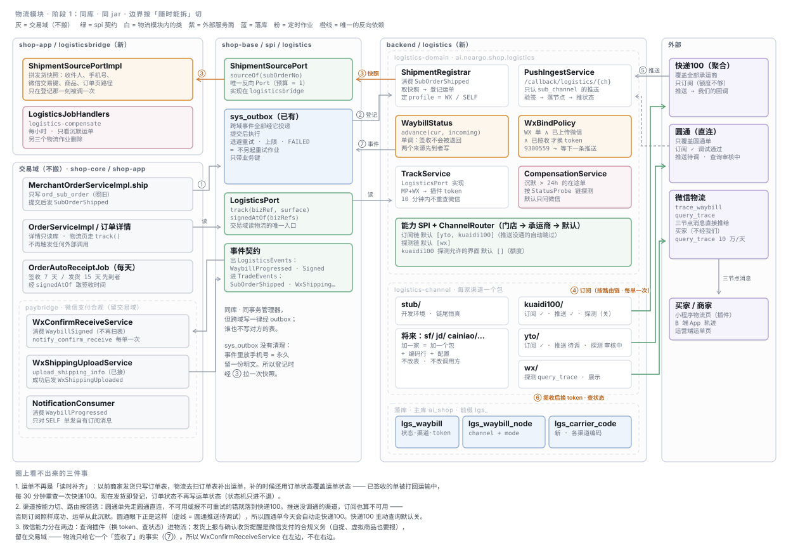
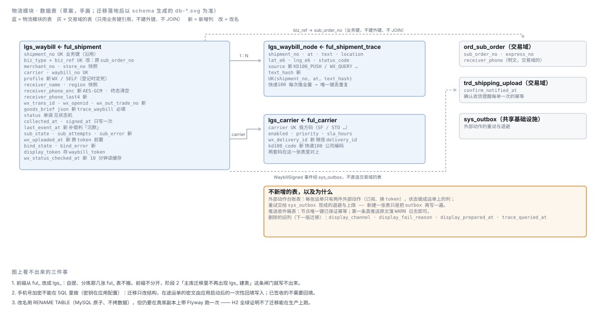
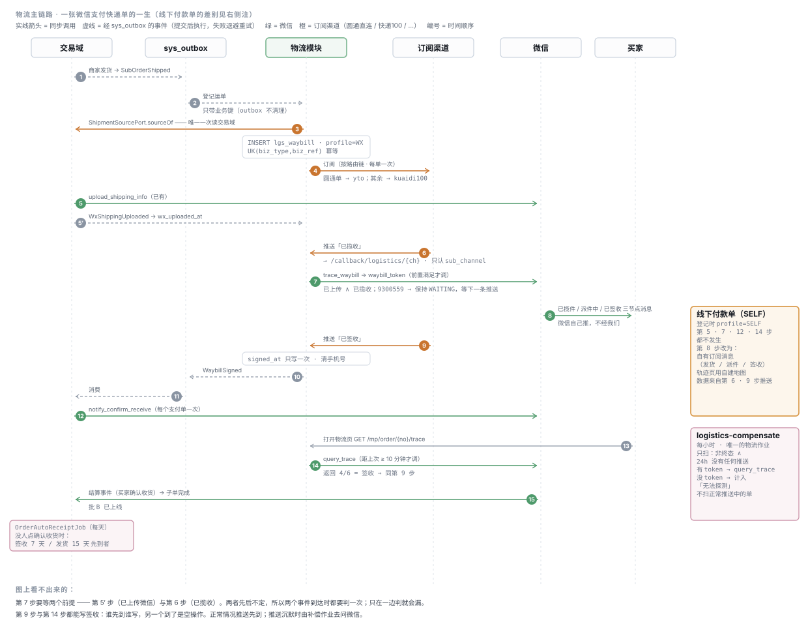

# TDD-物流模块

状态：草稿（待确认）
档位：2 · 依据：用户 2026-10-09 口头需求（§0.1 补 AC）· 产出：本文 + [ADR-032](ADR/ADR-032-物流独立为模块-先内嵌后可拆.md)
关联：[TDD-物流域-完整方案](design/TDD-物流域-完整方案.md)（**本文取代其 §3.5 作业、§5.4 批 D/F**；§4 微信能力清单、§5.5 签收闭环实现记录继续有效）·
[TDD-快递100轨迹查询](TDD-快递100轨迹查询.md)（主动查询改为默认关，见 §2.5）·
[TDD-物流轨迹多渠道](TDD-物流轨迹多渠道.md)（展示轴保留，数据源轴改为推送）·
[ADR-021](ADR/ADR-021-支付域独立为服务与独立库.md)（四阶段拆分，本文照它的形状走）
创建：2026-10-09 · 最后更新：2026-10-09

---

## L1 一句话

**物流是一个只产出「运单事实」的模块**：商家发货时登记一张运单，此后由订阅渠道（圆通直连 / 快递100 / 将来更多）**推**轨迹、由微信**补**状态，
签收时发一个事件给交易域 —— 它不持有订单状态，也不读写订单的表。
现在集成在主服务里一起部署；数据和依赖按「随时能拆出去」的标准切干净。

三条约束是这份设计的出发点（用户 2026-10-09 定）：

| # | 约束 | 落在哪 |
|---|---|---|
| 1 | 快递100 额度不够，**只做订阅**，不做主动查询 | §2.5 策略默认值；AC1 |
| 2 | 状态**尽量找微信要**，但要**策略模式、可配置** | §2.5 四个策略点 |
| 3 | **job 能不用就不用**；只给「订阅失败 / 推送沉默」这类明确场景兜底 | §2.6；AC8 |
| 4 | **多渠道**：圆通直连正在对接，将来接更多（顺丰、京东、菜鸟……）—— **加一家渠道不改表、不改调用方** | §2.1.1 渠道能力矩阵；AC13 AC14 |

---

## §0 对账一 · 需求 → 设计

### 0.1 验收标准（需求没有现成 PRD，按模板补）

- **AC1** 快递100 只订阅：默认配置下，系统对快递100 **主动查询**的调用次数为 0；每张运单**订阅恰好一次**（重复登记不重复订阅）。
- **AC2** 揽收前不调微信：发货信息未上传微信、或还没收到「已揽收」推送的运单，`trace_waybill` 调用 0 次。
- **AC3** 收到揽收推送 → 换 `waybill_token`；微信回 `9300559`（还没收录）时**等下一条推送再试**，不进任何定时作业。
- **AC4** 签收（推送或微信查询，任一先到）→ `signed_at` 只写一次、**状态只进不退**、发出 `WaybillSigned`；微信支付单据此提醒确认收货，**每个支付单一次**。
- **AC5** 线下付款单（及一切没有微信交易单号的单）：**不调任何微信物流接口**；轨迹照常落库；发货、派件、签收用我们自己的订阅消息通知买家。
- **AC6** 买家打开物流页：同一运单 **10 分钟内**重复打开，不重复调微信 `query_trace`。
- **AC7** 失败分类：可重试的失败自动重试（有上限、有退避）；不可重试的失败**不重试**、原因落在运单上、运营端可见、可手动重放。
- **AC8** 定时作业只剩一个物流补偿作业，**每小时**，只处理「订阅成功但 24 小时没有任何推送」的在途运单。
- **AC9** 策略可配置：状态探测链、快递100 主动查询开关（按界面）、换 token 时机 —— 改配置不改代码。
- **AC10** 模块边界：物流模块不依赖订单/支付/用户域的代码，不读写 `ord_*` / `trd_*` / `pmt_*` 表；反向 Port 至多 1 个。由守卫看住。
- **AC11** B 端 App 能看轨迹（来自推送落库的数据，不额外调快递100）。
- **AC12** 现有缺陷：运单状态被订单状态**来回覆盖**（已签收被打回运输中，每轮重查快递100）—— 修掉，状态单调。
- **AC13** 渠道路由：订阅按「门店 → 承运商 → 默认」三级选一条渠道链（沿用 2026-10-05「按门店路由、默认圆通」的决定）；
  链上逐个试，**不覆盖该承运商、未启用、或返回不可重试失败**的渠道自动让给下一个。默认链 `[yto, kuaidi100]`：圆通单走圆通直连，其余走快递100。
- **AC14** 加一家渠道：只新增 channel 模块里的实现类、`lgs_carrier_code` 的编码行、配置 —— **不改表结构、不改调用方、不改作业**。
  以测试证明：注册一个测试渠道，不动任何既有代码即可被路由选中并收到推送。

### 0.2 AC → 落点

| AC | 落点 |
|---|---|
| AC1 | 订阅链（`ChannelRouter`）；探测链默认不含 `kuaidi100`、`probe-surfaces.kuaidi100=[]`；UK(`biz_type`,`biz_ref`) 幂等 |
| AC2 | `WxBindPolicy.ready()`：`wx_uploaded_at` 非空 ∧ `status ≥ COLLECTED` 才放行 |
| AC3 | `PushIngestService` 每次推送后调 `WxBindPolicy`；`9300559` → `bind_state=WAITING`，无作业 |
| AC4 | `WaybillStatus.advance()` 单调合并；`signed_at` 只在首次进入 SIGNED 时写；`LogisticsEvents.WaybillSigned` → `paybridge` 消费 |
| AC5 | `lgs_waybill.profile = SELF`；`WxBindPolicy` 对 SELF 恒 false；`NotificationConsumer` 订阅 `WaybillProgressed` 只对 SELF 发 |
| AC6 | `TrackService.track()` 用 `wx_status_checked_at` 判 10 分钟缓存 |
| AC7 | 外部动作走 `sys_outbox` 重试（退避、上限）；不可重试 → `*_state=FATAL` + `*_error`；`/ops/shipments` 筛选 + 重放端点 |
| AC8 | `LogisticsCompensationJob`（`0 15 * * * *`）；删 `logistics-trace` / `wx-waybill-bind` / `wx-confirm-receive` 三个作业 |
| AC9 | `LogisticsProperties`（`shop.logistics.*`）+ 四个策略 SPI |
| AC10 | `ArchitectureTest` 登记域 `logistics`；新守卫 `LogisticsBoundaryTest`（禁 import / 禁表名 / 反向 Port 预算） |
| AC11 | `GET /biz/order/{subOrderNo}/trace` → `TrackService.track(BIZ)` 读库 |
| AC12 | 读时补齐 `ensureShipments` 整个删除（改为发货登记）；`WaybillStatus.advance()` 不允许降级 |
| AC13 | `ChannelRouter`（门店 → 承运商 → 默认，链式回退）；`lgs_waybill.sub_channel` 记下实际受理的渠道 |
| AC14 | 能力 SPI（§2.1.1）+ `lgs_carrier_code` 映射表 + 通用回调 `/callback/logistics/{channel}` |

**孤立项**：
- 没落点的 AC：无。
- 挂不上 AC 的设计：无。（上一版的 `lgs_carrier` 加两列已改为 `lgs_carrier_code` 映射表，挂 AC14。）

---

## §1 现状与影响面

### 1.1 物流现在散在五个模块

| 位置 | 内容 |
|---|---|
| `shop-base/spi/logistics`、`spi/fulfillment`、`spi/trade` | 轨迹查询/展示 Port、运费 Port、发货上报 Port、`ShipmentTraceQueryPort` |
| `shop-channel/channel/express/**` | 快递100 查询、圆通、微信插件换 token、寄件网关；`notify/port/WxShippingGateway`（发货上报） |
| `shop-core/fulfillment/**` | `LogisticsServiceImpl`（运单读时补齐、轮询、换单号、模板、运力）、轮询作业、运营端 Controller |
| `shop-core/trade/**` | 发货写 `ord_sub_order.express_no`、代下单、快递100 寄件回调、订单详情读轨迹、自动确认收货 |
| `shop-app/paybridge/**` | 换 token 作业、确认收货提醒作业、微信消息推送、发货上报台账 |

### 1.2 两个决定设计形状的事实

1. **`ful_shipment` 不是发货时写的，是「读时补齐」出来的投影**（`LogisticsServiceImpl.ensureShipments:126`）。
   商家发货只写 `ord_sub_order`，运单行要等轮询作业或运营打开列表才补出来。
   独立之后物流不能再去扫订单表 —— **这条线必须改成发货时登记**。
2. **补齐时用订单状态覆盖运单状态**（`:153-157` + `statusOf:211`）。子单还在履约中，状态就被改回 `IN_TRANSIT`，
   于是已签收的单**每轮又被查一次快递100**，直到买家确认收货（最长 7 天）。这就是 AC12。
3. **圆通直连已经在接**（[TDD-圆通物流直连](design/TDD-圆通物流直连.md)，`YtoTraceProvider`），而且它**有订阅也有推送**：

   | 圆通接口 | 状态（2026-10-08 控制台） |
   |---|---|
   | 物流轨迹订阅 `subscribe_adapter` | **调试通过** ✅ |
   | 物流轨迹推送服务 | 待调试 |
   | 物流轨迹查询 `track_query_adapter` | 审核中 |
   | 订单创建 `privacy_create_adapter`（返回运单号 + 三段码） | 待调试 |

   两条约束会直接进设计：**凭据按接口分发**（每个接口各有一组客户编码/密钥，不是账号一把）；**IP 白名单**（只有生产机 `106.55.27.246` 能调）。
   另外 2026-10-05 已定「**按门店路由，默认圆通**」—— 路由维度不能只有承运商。

### 1.3 会被改到的

`MerchantOrderServiceImpl.ship`（只多发一个事件，已有 `SubOrderShipped`）· `OrderServiceImpl.traceOf / signedAtOf 调用点` ·
`MerchantOrderServiceImpl.traceOf` · `WxConfirmReceiveService`（从作业改为事件消费）· `WxShippingUploadService`（成功后发事件）·
`OrderAutoReceiptJob`（读 `signedAtOf` 改走新 Port）· 运营端 `/ops/shipments` 页（加两个筛选列）· c-app 物流页（改调新端点）· b-app 订单详情（加轨迹入口）。

### 1.4 明确不受影响的

- **运费模板**（`ful_freight_template`、`FreightPort`）—— 下单算价走同步调用，ADR-031 刚落地，这期不搬，见 §L4。
- **快递代下单**（`ord_express_pickup`、`ExpressPickupPort`）—— 与商家欠款、结算判运费耦合，这期不搬。
- **自提 / 分拣 / 调度**（`ful_batch`、`ful_group_pickup`、`ful_verify_log`…）—— 那是门店履约，不是物流，**永远不搬**。
- **微信发货信息上报与确认收货提醒本身**（`upload_shipping_info`、`notify_confirm_receive`、`trd_shipping_upload`）——
  它们是**微信支付的合规义务**（自提、虚拟商品也要报），属交易域；物流只提供触发它们的事实（签收）。
- **微信结算事件**（`/mp/wx/callback`）—— 属交易域，批 B 已上线，不动。

---

## §2 方案

### 2.1 整体架构（L2）



| 层 | 模块 / 包 | 放什么 | 防住什么 |
|---|---|---|---|
| 契约 | `shop-base/spi/logistics` | `LogisticsPort`（读）、`LogisticsEvents`（出）、`ShipmentSourcePort`（唯一反向 Port） | 别的域只依赖这一层；直接 import 物流实现 = 拆分那天编译不过 |
| 领域 | **`backend/logistics/logistics-domain`**（新） | 运单、轨迹、状态机、四个策略 SPI、推送接收、补偿逻辑、`/callback/logistics/**` | 不依赖任何业务域、不依赖 HTTP 客户端 |
| 通道 | **`backend/logistics/logistics-channel`**（新） | 每家渠道一个包：`kuaidi100`、`yto`、`wx`、`stub`；将来 `sf`、`jd`… | 加一家渠道只在这一层加一个包；领域层不知道任何一家的报文 |
| 桥 | `shop-app/logisticsbridge`（新） | `ShipmentSourcePortImpl`（拼发货快照）、补偿作业的 `JobHandler`、事件消费适配 | 跨域拼装只许出现在这里（同 `invbridge` / `paybridge`） |
| 独立形态 | `logistics-svc`（**阶段 3 才建**） | 自己的 jar、`/internal/logistics/**`、`/callback/logistics/**` | — |

**为什么是这个形状**：照 [ADR-021](ADR/ADR-021-支付域独立为服务与独立库.md) 的四阶段走，这次只做**阶段 1（收拢）**，
同库、同 jar、同事务管理器。理由与取舍见 §3 和 ADR-032。

**依赖方向只有三条线，全部经过 `spi`**：

| 方向 | 线 | 形态 |
|---|---|---|
| 交易 → 物流（写） | 发货 | 已有事件 `OrderEvents.SubOrderShipped`（经 `sys_outbox`），物流消费后登记运单 |
| 物流 → 交易（取一次） | 登记那一刻要收件人、微信交易键、商品 | `ShipmentSourcePort.sourceOf(subOrderNo)`，**只在登记时调一次** |
| 物流 → 交易（出） | 揽收 / 派件 / 签收 / 异常 | `LogisticsEvents.*`（经 `sys_outbox`），交易与通知各自消费 |
| 交易 → 物流（读） | 订单详情、物流页、自动确认收货 | `LogisticsPort.track / signedAtOf` |
| 交易 → 物流（写） | 微信发货信息已上传 | 事件 `WxShippingUploaded`（换 token 的前置条件） |

> **为什么登记不用「事件里带全量数据」**：事件走 `sys_outbox`，而 `sys_outbox` **没有任何清理**，投递过的行永久留着。
> 把收件人手机号放进 payload，等于多存一份永久的明文。所以事件只带业务键，物流在登记那一刻拉一次快照，
> 之后再不读交易域。代价是一条反向 Port —— 支付域拆分卡在 11 条反向 Port 上，所以这里**定预算 = 1**，守卫看住。

### 2.1.1 渠道：按「能力」切，不按「哪一家」切

一家物流渠道能做的事不一样：快递100 是聚合（什么承运商都覆盖），圆通直连只覆盖圆通单，微信只能查状态、不给我们轨迹节点。
所以抽象的单位是**能力**，每家渠道实现自己支持的那几个；路由按能力分别选渠道。

| 能力 SPI（`logistics-domain`） | 做什么 | kuaidi100（聚合） | yto（直连） | wx（微信物流） | 将来：顺丰 / 京东 / 菜鸟… |
|---|---|---|---|---|---|
| `TrackingSubscriber` | 订阅一张运单，此后对方推给我们 | ✅ `/poll` | ✅ `subscribe_adapter`（调试通过） | — | 按各家 |
| `PushReceiver` | 验签、解析推送、给对方回执 | ✅ | ⏳ 推送服务待调试 | —（三节点消息直接推买家，不给我们） | 按各家 |
| `StatusProbe` | 主动查一次状态 / 节点 | ✅（**默认关**，额度） | ⏳ `track_query_adapter`（审核中） | ✅ `query_trace`（只给状态） | 按各家 |
| `TraceDisplay` | 给某个界面怎么展示 | — | — | ✅ 插件（`trace_waybill` 换 token） | — |
| `WaybillCreator` | 平台直连下单，拿运单号 | 寄件（已有，在交易域） | ⏳ `privacy_create_adapter` | — | 按各家 |

- 每个实现声明三样：`name()`、`covers(carrier)`（圆通直连只认 `YTO`）、`available()`（凭据没配就是不可用）。
- **订阅可用 ⇔ 同一渠道的推送接收也可用**（`ChannelRouter` 判，不靠各实现自觉）。订阅了却收不到推送，
  订阅接口照样返回成功、运单就此沉默、不报任何错 —— 圆通眼下正是这个状态（订阅调试通过、推送待调试）。
  有了这条，圆通推送调通之前，圆通单会**自动**落到快递100，不需要有人记得先别把 `yto` 配进链里。
- `WaybillCreator` 这期**只定义接口、不搬实现**：快递100 寄件留在交易域，圆通下单（Y6）还没开工。
  它在这里是为了把「运单号的三个来源」（平台直连下单 / 网点回传 / 商家自填）都收口到同一个登记入口 —— 见 §L4 待决。
- `stub` 渠道覆盖全部承运商、什么都不做：开发环境与「一家都没配」时链尾恒真，不白屏。

**路由**（`ChannelRouter`，沿用现有 `LogisticsTraceRouter` 的三级模型）：

```
链 = 门店路由[storeNo] ?: 承运商路由[carrier] ?: 默认链        ← 每种能力各配一套
对链上每个渠道：未启用 / 不覆盖该承运商 / 不可用 → 跳过
               调用 → 成功：停；可重试失败：交 outbox 重试（同一渠道）；不可重试失败：记下原因，换链上下一个
链走完都没成 → FATAL（运单上记最后一个渠道的原因）
```

默认订阅链 `[yto, kuaidi100]`：圆通单先走圆通直连（不占快递100 额度），圆通不可用或回不可重试的错，自动落到快递100；
其余承运商圆通不覆盖，直接走快递100。**同一张运单只订阅在一个渠道上**（`lgs_waybill.sub_channel`），推送也只认那个渠道来的。

**加一家渠道要做的事**（AC14 的验收清单）：

| # | 做什么 | 不用做什么 |
|---|---|---|
| 1 | `logistics-channel` 里加一个包，实现它支持的能力 SPI | 不改领域层、不改调用方 |
| 2 | 状态码映射（对方码 → `TraceStatus`）与失败码分类（可重试 / 不可重试），各一张表一组测试 | — |
| 3 | `lgs_carrier_code` 插它的承运商编码行 | **不改表结构** |
| 4 | 配置 `shop.logistics.channels.<name>` + 把名字放进需要的路由链 | 不改代码 |
| 5 | 有推送的：回调地址就是 `/callback/logistics/<name>`，同一个 Controller 按名字分派 | 不加 Controller、nginx 不改 |
| 6 | 有 IP 白名单 / 按接口分发凭据的：配置里按能力分组给 | — |

### 2.2 数据库



> 这张图是**草案，手画**。迁移落地后 `db-*.svg` 会从 schema 重新生成，以生成的为准。

**表前缀从 `ful_` 改为 `lgs_`**：`ful_` 同时被留下的自提/分拣表使用（`ful_batch`、`ful_verify_log`…），
阶段 2 切库的闸门是「主库迁移里不再出现 `lgs_*` 建表」—— 前缀不分开，这条闸门写不出来。

| 表 | 来源 | 行的含义 |
|---|---|---|
| `lgs_waybill` | `RENAME ful_shipment` + 加列 | 一张运单 |
| `lgs_waybill_node` | `RENAME ful_shipment_trace` + 加列 | 一个轨迹节点 |
| `lgs_carrier` | `RENAME ful_carrier` | 一家承运商（我方码） |
| `lgs_carrier_code` | **新** | 一家承运商在某个渠道那里叫什么 |

**只新增一张映射表**，为的是 AC14：承运商编码如果按渠道加列（`kd100_code`、`wx_delivery_id`、`yto_code`…），
每接一家渠道就要改一次表。外部动作的状态（订阅、换 token）仍作为运单上的列，不另建台账表 ——
每张运单只有两件外部动作，台账表换来的只是多一次 JOIN；重试交给已有的 `sys_outbox`（§2.6）。

#### `lgs_waybill`（运单）

| 列 | 类型 | 说明 · 防住什么 |
|---|---|---|
| `shipment_no` | varchar(32) UK | 业务键，沿用原值（不重编，外部已引用） |
| `biz_type` | varchar(16) | `SUB_ORDER`（今天唯一值）/ 将来 `RETURN`（售后寄回）—— 不写死「子单」，退货物流接进来不用改表 |
| `biz_ref` | varchar(32) | 原 `sub_order_no` 改名。**UK(`biz_type`,`biz_ref`)** —— 重复的发货事件只登记一次（AC1 幂等的根） |
| `merchant_no` / `store_no` | varchar(32) | **快照**：运营筛选用；不回查商家表（ADR-021 §3.3 跨库只存业务键+快照） |
| `carrier` | varchar(16) | 我方承运商码（`lgs_carrier.carrier`） |
| `waybill_no` | varchar(64) | UK(`carrier`,`waybill_no`) 沿用 |
| `profile` | varchar(8) | **`WX`**：有微信交易单号与付款人 openid，可用微信全套能力；**`SELF`**：其余（线下付款、APP 单）。**登记时定死** —— 不让每个调用点各自判断「这单能不能调微信」 |
| `receiver_name` / `region` | 原列 | 快照 |
| `receiver_phone_enc` | varchar(128) | 收件人手机号 **AES-GCM 密文**。订阅（顺丰等必填）与换 token（申通/中通必填）要完整号码。**进入终态（SIGNED / CANCELLED）后清空** —— 用完就删 |
| `receiver_phone_last4` | char(4) | 展示与排查用 |
| `wx_trans_id` / `wx_openid` / `wx_out_trade_no` | varchar(64) | **快照**：仅 `profile=WX` 有值；`trace_waybill` 与确认收货提醒要用 |
| `goods_brief` | json | 商品名、图（≤3 件）：`trace_waybill` 必填 |
| `status` | varchar(16) | 状态机见 §2.4.5，**单调** |
| `collected_at` / `signed_at` | bigint | 首次进入 COLLECTED / SIGNED 的时刻（毫秒），**只写一次** |
| `last_event_at` | bigint | 最近一次收到推送或查询有新进展的时刻 —— 补偿作业判「沉默」用 |
| `sub_state` | varchar(12) | 订阅：`PENDING` / `DONE` / `FATAL` / `ENDED`（渠道停止跟踪） |
| `sub_channel` | varchar(16) | **实际受理订阅的渠道**（`yto` / `kuaidi100` / …）。推送只认这个渠道来的 —— 否则换渠道重订阅后，旧渠道迟到的推送会和新渠道的打架 |
| `sub_ref` | varchar(64) | 渠道返回的订阅号（有的渠道给，有的不给） |
| `sub_attempts` / `sub_error` | int / varchar(200) | 链上最后一次失败的渠道、码与原文 |
| `wx_uploaded_at` | bigint | 微信发货信息上传成功的时刻（来自交易域事件）—— 换 token 的前置条件 |
| `bind_state` | varchar(12) | 微信换 token：`NA`（SELF 单）/ `WAITING`（前置未满足或微信还没收录）/ `DONE` / `FATAL` |
| `bind_error` | varchar(200) | |
| `display_token` | varchar(256) | 原列，存 `waybill_token` |
| `wx_status_checked_at` | bigint | 最近一次调 `query_trace` 的时刻 —— 10 分钟读缓存（AC6） |
| 删除 | | `display_channel`、`display_fail_reason`、`display_prepared_at`、`trace_queried_at` —— 被上面的状态列取代 |

#### `lgs_waybill_node`（轨迹节点）

| 列 | 说明 |
|---|---|
| `shipment_no`, `at`, `text`, `location`, `lat_e6`, `lng_e6`, `status_code` | 原列 |
| `channel` + `mode` | 哪个渠道（`kuaidi100` / `yto` / …）、怎么来的（`PUSH` / `QUERY`）—— 两列而不是一个枚举，加渠道不改枚举 |
| `text_hash` | char(16)；**UK(`shipment_no`,`at`,`text_hash`)** —— 快递100 每次推送是**全量**轨迹，重复节点靠唯一键丢弃，不靠比对 |

> 微信 `query_trace` **只返回状态、不返回节点**。所以 `WX_QUERY` 不产生节点，只推进 `lgs_waybill.status`。

#### `lgs_carrier`（承运商）与 `lgs_carrier_code`（各渠道编码）

`lgs_carrier` 只改名，`carrier` 是**我方码**（`SF` / `STO` / `YTO` …），全系统只认它。

`lgs_carrier_code`：

| 列 | 说明 |
|---|---|
| `carrier` | 我方码 |
| `channel` | `kuaidi100` / `yto` / `wx` / … |
| `code` | 该渠道里的叫法（快递100 `shentong`、微信 `STO`、圆通直连 `YTO`） |
| UK(`carrier`,`channel`) | 一家承运商在一个渠道里只有一个叫法 |

渠道实现的 `covers(carrier)` 默认就是「这张表里有没有我这一行」—— 圆通直连只有 `YTO` 一行，所以只覆盖圆通单。
**它取代两份互不对应的码表**：`ExpressCompanies`（代码常量，微信码）与 `ful_carrier`（库，SF/JD/YTO）；
迁移里按现有 `ExpressCompanies` 与快递100 公司编码表种一份初始数据。

#### 迁移（`V387__logistics_module.sql`，一条）

1. `RENAME TABLE ful_shipment TO lgs_waybill`（另两张同）—— MySQL 原子、不拷数据；建 `lgs_carrier_code` 并种初始编码。
2. 加列；`sub_order_no` 改名 `biz_ref`，补 `biz_type='SUB_ORDER'`。
3. 回填：`profile`（按 `ord_order.pay_trade_no` 是否非空）、`wx_*`、`receiver_phone_enc`（在途单）—— **迁移里只回填在途运单**，已签收的不需要手机号。
4. 删掉 §2.2 列出的四个旧列 —— **放到下一个版本**：先上线一版两套列并存，确认没有读者再删（已应用的迁移不可改，删列只能新开一条）。

> ⚠️ 手机号加密不能在 SQL 里做（密钥在应用配置）。第 3 步的 `receiver_phone_enc` 由**应用启动后的一次性回填**完成
> （`LogisticsBackfillRunner`，跑完落一条标记，再启动不重跑），不放进 Flyway。

### 2.3 API

#### 2.3.1 模块契约（`shop-base/spi/logistics`）

```java
/** 交易域读物流。只读，不触发外部调用 —— 除了 track() 按策略可能调一次微信 query_trace */
public interface LogisticsPort {
    Optional<TrackView> track(TrackQuery q);                 // q: bizType, bizRef, surface(MP/APP/H5/BIZ/OPS), refresh
    Map<String, Long> signedAtOf(Collection<String> bizRefs); // 自动确认收货用
}

/** 唯一的反向 Port：登记那一刻向交易域取一次快照（实现在 shop-app/logisticsbridge） */
public interface ShipmentSourcePort {
    Optional<ShipmentSource> sourceOf(String subOrderNo);
    record ShipmentSource(String subOrderNo, String merchantNo, String storeNo,
                          String carrier, String waybillNo,
                          String receiverName, String receiverPhone, String region,
                          WxKey wx,                    // 没有微信交易单号 → null → profile=SELF
                          List<GoodsBrief> goods, String orderPath, long shippedAt) { }
    record WxKey(String transId, String outTradeNo, String openid) { }
}

public final class LogisticsEvents {
    record WaybillProgressed(String bizRef, String shipmentNo, String profile, String status, long at) { }  // COLLECTED / DELIVERING / EXCEPTION
    record WaybillSigned(String bizRef, String shipmentNo, String profile, long signedAt, String source) { }
}

// 交易域发出、物流消费
// 已有：OrderEvents.SubOrderShipped
// 新增：TradeEvents.WxShippingUploaded(String orderNo, List<String> subOrderNos, long at)
```

`TrackView`：`status`、`signedAt`、`nodes[]`、`display{mode: WX_PLUGIN|SELF_MAP, waybillToken}`、`freshAt`、`refreshable`。
比现在的 `OrderVO.Trace` **只加字段不改字段**，老端不受影响。

#### 2.3.2 HTTP 端点

| 方法 · 路径 | 状态 | 调用方 | 说明 |
|---|---|---|---|
| `POST /callback/logistics/{channel}` | **新** | 各渠道 | 轨迹推送的**唯一入口**。按 `{channel}` 找 `PushReceiver`：验签、解析、并由它决定给对方回什么（快递100 要 `{"result":true,"returnCode":"200"}`，圆通是另一种）。找不到该渠道 → 404。**入库失败也要回成功并记 ERROR**：回失败对方会重推，而重推的报文不会让入库变成功；靠补偿作业兜底。今天落地 `kuaidi100`，圆通推送调通后是 `yto` |
| `GET /mp/order/{orderNo}/trace` | **新** | C 端物流页 | 物流页专用。`WX` 单返回 token 走插件，并按 10 分钟缓存调一次 `query_trace` 校正状态；`SELF` 单返回库里的节点 |
| `GET /mp/order/{orderNo}` | 改 | C 端订单详情 | `trace` 只读库、**不再触发任何外部调用** —— 详情页每天被打开的次数远多于物流页 |
| `GET /biz/order/{subOrderNo}/trace` | **新** | B 端 App | AC11。读库；`refresh=true` 仅当策略允许 BIZ 界面现查快递100 时生效，否则返回 `refreshable=false` |
| `GET /biz/order/{subOrderNo}` | 不变 | B 端 | `trace` 只读库 |
| `GET /ops/shipments` | 改 | 运营 | 加筛选 `subState`、`bindState`（看 FATAL）；路径不变，ops-web 改动最小 |
| `POST /ops/shipments/{shipmentNo}/replay` | **新** | 运营 | 重放 `SUBSCRIBE`（可指定渠道，否则重走路由链）或 `WX_BIND`；新权限码 `logistics.shipment.replay`（/ops 五处登记） |
| `POST /ops/shipments/{shipmentNo}/waybill` | 不变 | 运营 | 换单号；换了之后重新订阅 |
| `GET/PUT /ops/fulfillment/carriers…` | 改 | 运营 | 多一个 `codes: {channel: code}`（读写 `lgs_carrier_code`） |
| `GET /ops/logistics/channels` | **新** | 运营 | 各渠道启用 / 可用 / 支持哪些能力 / 覆盖哪些承运商（只读，排查「为什么这单走了快递100」用） |
| `/internal/logistics/**` | 阶段 3 | 主服务 → logistics-svc | `@HttpExchange` 镜像 `LogisticsPort`（ADR-025） |

**回调放在物流模块里，不放主服务的 portal**：阶段 3 拆出去时 nginx 只要按前缀 `/callback/logistics/` 转发一行；
放在 portal 里就得先改代码再拆。**一个 Controller、路径带渠道名**：加渠道不加 Controller、不改 nginx、不改安全配置
（`/callback/**` 已经放行）。它不复用现有 `/callback/express/kuaidi100`（寄件回调，属代下单）——
两个产品、两种报文，混在一个路径下要靠报文猜是哪一种。

### 2.4 核心流程



#### 2.4.1 发货登记（取代读时补齐）

```
商家发货 → MerchantOrderServiceImpl.ship（只写 ord_sub_order，照旧）
        → sys_outbox: SubOrderShipped
        → [物流] ShipmentRegistrar.onShipped
              EXPRESS 且有单号才继续
              ShipmentSourcePort.sourceOf(sub)          ← 唯一一次读交易域
              INSERT lgs_waybill（UK(biz_type,biz_ref) 冲突 = 已登记，直接返回）
              profile = wx==null ? SELF : WX；bind_state = SELF ? NA : WAITING
              sys_outbox: 内部事件 SubscribeRequested
        → [物流] SubscribeExecutor（outbox 消费）
              链 = ChannelRouter.subscribeChain(storeNo, carrier)      ← 默认 [yto, kuaidi100]
              对链上每个可用且覆盖该承运商的渠道 ch：
                  ch.subscribe(lgs_carrier_code[carrier,ch], waybillNo, phone, /callback/logistics/{ch})
                  成功（含快递100 501 重复订阅）→ sub_state=DONE, sub_channel=ch；停
                  可重试失败 → 抛异常，outbox 退避重试**同一个渠道**（上限见 §2.6）
                  不可重试 → 记 sub_error，换链上下一个
              链走完都不成 → sub_state=FATAL, ERROR 日志；不抛
```

**为什么订阅不在登记的同一个事务里做**：外部调用不该占着数据库事务；而且订阅失败要重试时，
不该把「登记」也一起回滚重来。

#### 2.4.2 推送接收（渠道 → 我们）

```
POST /callback/logistics/{channel}
  PushReceiver[channel] 不存在 → 404
  验签失败 → 回成功 + WARN（回失败会被无限重推；验签失败的报文重推也不会变对）
  receiver.parse → (承运商编码, 单号, 节点[], 渠道状态)；经 lgs_carrier_code 反查我方承运商码，找运单
  找不到运单，或运单的 sub_channel ≠ channel（换过渠道，旧渠道迟到的推送）→ 回成功 + WARN，不入库
  渠道说「停止跟踪」（快递100 abort：如 3 天无记录）→ sub_state=ENDED；在途的交给补偿作业
  落节点（UK 去重）、last_event_at=now
  WaybillStatus.advance(当前, 推送状态) → 进了新阶段：
      COLLECTED 首次 → collected_at；WxBindPolicy 判换 token（2.4.3）
      SIGNED 首次 → signed_at；发 WaybillSigned（2.4.4）
      其余 → 发 WaybillProgressed（SELF 单的自有通知用）
  每次推送后都再判一次 WxBindPolicy —— 上次 9300559 的，这次自然重试
```

#### 2.4.3 换 token（微信，**前置条件满足才调**）

```
WxBindPolicy.ready(w) = profile==WX ∧ bind_state==WAITING ∧ wx_uploaded_at!=null ∧ status≥COLLECTED
触发点：① 推送进入 COLLECTED 或之后任一推送  ② 收到 WxShippingUploaded（两者先后不定，两边都要判）
调 trace_waybill：
  成功 → display_token, bind_state=DONE
  9300559（微信还没收录）→ 保持 WAITING，什么都不做，等下一条推送
  9300561 手机号错 / 9300534 配置错 → bind_state=FATAL + bind_error，不重试
  取 access_token 失败 / 9300513 超限 / 网络 → 交给 outbox 退避重试
```

`trigger=on-ship` 时（策略可切）退化成发货即调，供以后验证「微信收录是否其实很快」。

#### 2.4.4 签收

两个来源，**谁先到谁算，另一个到了是空操作**：快递100 推送里的签收；微信 `query_trace` 返回 4（已签收）/ 6（代签收）。

```
signed_at 首次写入 → sys_outbox: WaybillSigned
  ├─ [交易/paybridge] profile==WX → notify_confirm_receive（每支付单一次，trd_shipping_upload.confirm_notified_at 幂等）
  ├─ [通知] profile==SELF → 自有订阅消息「已签收」
  └─ 自动确认收货：OrderAutoReceiptJob 照旧每天跑，经 LogisticsPort.signedAtOf 取签收时间（批 C 规则不变）
receiver_phone_enc 清空
```

现在的 `wx-confirm-receive` 作业（每 30 分钟扫一次）删除：签收那一刻就触发，失败的由 outbox 重试。

#### 2.4.5 状态机（单调）

```
CREATED → COLLECTED → IN_TRANSIT → DELIVERING → SIGNED
   任一非终态 ⇄ EXCEPTION（疑难、退回、拒签；恢复后回到原阶段）
   任一非终态 → CANCELLED（发货撤回、换单号作废旧号）
```

`advance(cur, incoming)`：incoming 的阶段序号 ≤ cur 的 → 不变。**没有任何路径能把 SIGNED 改回去** —— 这就是 AC12 的修法；
旧代码的问题不是映射错，是「另一个数据源（订单状态）也能写这个字段」。新设计里订单状态**不再写**运单状态。

**每个渠道自带一张映射表**（对方码 → 统一的 `TraceStatus`），状态机只认统一状态 —— 加渠道不改状态机。

| 统一状态 | 快递100 | 微信 `query_trace` | 圆通 |
|---|---|---|---|
| COLLECTED | `1` 揽收 | `1` | 沿用 `YtoTraceProvider.mapStatus`（Y3.1 已按官方文档校准） |
| IN_TRANSIT | `0` 在途 / `7` 转投 / `8` 清关 | `2` | 同上 |
| DELIVERING | `5` 派件 | `3` | 同上 |
| SIGNED | `3` 签收 | `4` 已签收 / `6` 代签收 | 同上 |
| EXCEPTION | `2` 疑难 / `4` 退签 / `6` 退回 / `14` 拒签 | `5` | 同上 |

> 快递100 与圆通的推送状态码都以**第一条真实推送**为准（快递100 `resultv2=1` 时还有子状态；圆通推送服务还没调试）；上表是官方文档口径。

#### 2.4.6 查看

```
TrackService.track(q)
  读 lgs_waybill + 节点
  surface==MP ∧ profile==WX ∧ display_token 有：
      display = WX_PLUGIN(token)
      若 now - wx_status_checked_at ≥ 10 分钟 ∧ 状态非终态：调 query_trace → advance（可能触发签收）
  其余：display = SELF_MAP(nodes)
  refresh=true：按 StatusProbe 链问一次（链与界面白名单都由配置给；快递100 默认不在任何界面的白名单里）
```

### 2.5 策略与配置（AC9）

四个策略点。前两个是**按能力的路由链**（§2.1.1 的 `ChannelRouter`，门店 → 承运商 → 默认），后两个是开关。
链尾恒有 `stub`（什么都不做）—— 沿用现有 `LogisticsTraceRouter` 的模型。

| 策略点 | 决定什么 | 可选 | 默认 |
|---|---|---|---|
| 订阅链 | 谁把轨迹推给我们 | `yto`、`kuaidi100`、将来的渠道 | `[yto, kuaidi100]` |
| 探测链 | 补偿与读时找谁问状态 | `wx`、`yto`、`kuaidi100`、将来的渠道 | `[wx]`；圆通查询审核通过后 `YTO: [wx, yto]` |
| 探测允许的界面 | 哪些界面的「刷新」能真的去问渠道 | `MP` `APP` `H5` `BIZ` `OPS`，按渠道给 | `kuaidi100: []`（额度不够，一个都不允许） |
| 换 token 时机 | 微信 | `on-collected`、`on-ship` | `on-collected` |

```yaml
shop:
  logistics:
    routes:
      subscribe:
        default: [yto, kuaidi100]     # yto 只覆盖圆通单；其余承运商直接落到 kuaidi100
        by-carrier: {}                # 例：{ SF: [sf, kuaidi100] }  —— 接顺丰直连那天
        by-store: {}                  # 例：{ ST-xxx: [kuaidi100] } —— 沿用 2026-10-05「按门店路由」
      probe:
        default: [wx]
        by-carrier: {}                # 圆通查询审核通过后：{ YTO: [wx, yto] }
    probe-surfaces:
      kuaidi100: []
    read-cache-minutes: 10
    wx-bind:
      trigger: on-collected
    compensation:
      cron: "0 15 * * * *"
      silent-hours: 24
    phone-key: ${LOGISTICS_PHONE_KEY:}   # 空 → 不存密文（同 PhoneCrypto 的失败方式），订阅不带手机号
    callback-base: ${LOGISTICS_CALLBACK_BASE:https://www.hxmall.top/callback/logistics}
    channels:
      kuaidi100:
        enabled: true                 # 账号凭据仍用 shop.express.kuaidi100.*（与寄件同一账号；阶段 3 再拆）
      yto:
        enabled: true
        host: ${SHOP_EXPRESS_YTO_HOST:https://openapi.yto.net.cn}
        subscribe: { customer-code: ${YTO_SUBSCRIBE_CODE:}, secret: ${YTO_SUBSCRIBE_SECRET:} }
        query:     { customer-code: ${YTO_QUERY_CODE:},     secret: ${YTO_QUERY_SECRET:} }
        push:      { secret: ${YTO_PUSH_SECRET:} }
```

- **圆通凭据按能力分组**：圆通是每个接口一组客户编码/密钥（§1.2-3）。现在的 `shop.express.yto.app-key/secret` 是「一个账号一把」的形状，
  接第二个接口时就装不下 —— 改成 `channels.yto.<能力>.*`。哪个能力没配，那个能力的 `available()=false`，不影响别的能力。
- **不是每家渠道都要配 `channels.<name>`**：没配的渠道不启用，路由链里写了也会被跳过（启动时 WARN 一次）。
- `shop.express.trace.*`（旧数据源链）与 `shop.express.trace.cache-ttl-minutes`、`shop.express.yto.*` 删除；删之前 grep 生产 env 是否在用，
  且**生产 env 的键名同步改**（旧键留着不报错，只是静默不生效）。
- ⚠️ 写 yml 前先 grep `shop:` 下是否已有 `logistics:` —— YAML 重复键让**整个上下文起不来**，2026-10-09 刚出过一次。
- 绑定用 `@ConfigurationProperties` 记录类；List 字段给字段默认值，**不挂 `${ENV:}`**（空串绑不进集合，上下文起不来）。

### 2.6 失败分类与重试（AC7）

| 类 | 例子 | 处理 | 去哪看 |
|---|---|---|---|
| **前置未满足** | 没上传微信、还没揽收 | **不调**。不是失败 | — |
| **还没准备好** | `9300559` 微信未收录 | 保持 WAITING，**下一条推送自然重试**，无作业 | `bind_state=WAITING` |
| **不该调** | SELF 单 | 登记时 `bind_state=NA`，任何路径都不调微信 | — |
| **可重试** | 网络、5xx、取 token 失败、`9300513`、快递100 `500` | 抛异常 → `sys_outbox` 退避重试**同一渠道**，到上限转 FAILED | outbox FAILED + ERROR 日志 |
| **不可重试** | `9300561` 手机号、`9300534` 配置、快递100 `600`/`601`（key/余额）/`700`（不支持的公司）、圆通凭据或白名单错 | 订阅：**换链上下一个渠道**；链走完 → `FATAL` + 码与原文；ERROR | `/ops/shipments?subState=FATAL`，修好后点重放 |
| **认不出的码** | 渠道返回了映射表里没有的错误码 | **按不可重试处理**并落原文 —— 盲目重试会烧额度，而原文就是补映射表的依据 | 同上 |
| **成功的一种** | 快递100 `501` 重复订阅 | 按成功处理 —— 不然重试一次反而记成失败 | — |

**失败码分类是每个渠道自己的一张表**（`logistics-channel/<name>/` 里，与状态映射放一起），领域层只认三种结局：
成功 / 可重试 / 不可重试。圆通订单创建的失败码官方给了「是否可重试」一列（[TDD-圆通物流直连 §11.4](design/TDD-圆通物流直连.md)），订阅与推送的码等调通时补。

**重试用 `sys_outbox`，不另起作业**：它已经有退避（`next_retry_at`）、上限、FAILED 终态。
理论上 FATAL 与 outbox FAILED 都应长期为 0；补偿作业每轮把这两个数报出来（§2.7），不为 0 就是缺陷或配置问题。

### 2.7 定时作业（AC8）

| 作业 | 频率 | 做什么 | 调谁 |
|---|---|---|---|
| **`logistics-compensate`**（新） | 每小时（`0 15`） | 只扫 **沉默运单**：非终态 ∧ `sub_state ∈ {DONE, ENDED}` ∧ `last_event_at < now-24h`。走 `StatusProbe` 链（默认只有微信，需有 token）。没 token 又不许查快递100 的，计入「无法探测」 | 微信 `query_trace` |
| `order-auto-receipt` | 每天 | 不变（时间驱动，本来就是明确场景） | 不调外部 |
| ~~`logistics-trace`~~ | 删 | 被订阅推送取代 | |
| ~~`wx-waybill-bind`~~ | 删 | 被推送触发取代 | |
| ~~`wx-confirm-receive`~~ | 删 | 被 `WaybillSigned` 事件取代 | |
| `wx-shipping-upload` | 不变 | 交易域的发货上报补报 | |

补偿作业每轮的 detail 固定五个数：`扫描 / 探测成功 / 推进 / 无法探测 / FATAL 与 outbox FAILED 合计`。

**调用量**（按一天 100 单在途、平均 3 天签收估）：

| | 现在 | 之后 |
|---|---|---|
| 快递100 | 约 4800 次/天（每 30 分钟查一遍，已签收的也在查） | **≤ 100 次/天**（每单订阅一次；圆通单走圆通直连，不占快递100） |
| 圆通直连 | 0（查询接口还在审核） | 圆通单每单订阅一次 |
| 微信 `trace_waybill` | 每 30 分钟扫一遍在途 | 每单约 1 次 |
| 微信 `query_trace` | 0 | 物流页打开（10 分钟缓存）+ 沉默运单每小时一次；额度 10 万/天 |
| 定时作业 | 3 个，每 30 分钟 | 1 个，每小时，只看沉默运单 |

### 2.8 模块设计

| 动作 | 路径 | 说明 |
|---|---|---|
| 新增 | `backend/logistics/pom.xml`、`logistics-domain/`、`logistics-channel/` | 根 pom 登记 |
| 新增 | `logistics-domain/…/logistics/{service,entity,mapper,policy,spi,api/callback,job}` | 包 `ai.neargo.shop.logistics` |
| 迁入 | `LogisticsServiceImpl`（运单与轨迹部分）、`ShipmentTraceQueryPortImpl`、`FulShipment*`、`FulCarrier` → `logistics-domain` | 运费模板、自提相关**留在原处** |
| 迁入 | `channel/express/trace/**`、`channel/express/display/WxPluginDisplay` → `logistics-channel/{kuaidi100,yto,wx,stub}/` | 寄件网关**留在原处** |
| 新增 | `logistics-domain/…/channel/{TrackingSubscriber,PushReceiver,StatusProbe,TraceDisplay,WaybillCreator,ChannelRouter}` | 能力 SPI + 路由；`LogisticsTraceRouter` 并入 `ChannelRouter` |
| 新增 | `logistics-channel/yto/{YtoSubscriber,YtoPushReceiver}`；`YtoTraceProvider` 改为 `YtoStatusProbe` | 订阅已调试通过；推送待调试；查询审核中 |
| 新增 | `logistics-channel/kuaidi100/{Kuaidi100Subscriber,Kuaidi100PushReceiver}`；`Kuaidi100TraceProvider` 改为 `Kuaidi100StatusProbe` | |
| 新增 | `logistics-domain/…/api/callback/LogisticsCallbackController` | `/callback/logistics/{channel}`，按名字分派 |
| 删除 | `LogisticsServiceImpl.ensureShipments`、`refreshInTransitTraces`、`LogisticsTracePollingJob`、`WxWaybillBind*`、`WxConfirmReceiveJob` | |
| 新增 | `shop-base/spi/logistics/{LogisticsPort,ShipmentSourcePort,LogisticsEvents}` | 取代 `ShipmentTraceQueryPort`、`LogisticsTracePort`、`TraceDisplayPort` |
| 新增 | `shop-app/logisticsbridge/{ShipmentSourcePortImpl,LogisticsJobHandlers}` | |
| 修改 | `WxConfirmReceiveService` | 从扫表改为消费 `WaybillSigned` |
| 修改 | `WxShippingUploadService` | 上传成功后发 `WxShippingUploaded` |
| 修改 | `OrderServiceImpl` / `MerchantOrderServiceImpl` 的 `traceOf`、`OrderAutoReceiptJob` | 改走 `LogisticsPort` |
| 新增 | `V387__logistics_module.sql`、`LogisticsBackfillRunner` | |
| 新增 | 守卫 `LogisticsBoundaryTest`；`ArchitectureTest.DOMAINS` 加 `logistics` | AC10 |
| 修改 | c-app 物流页、b-app 订单详情、ops-web 运单页 | 改调新端点 / 加筛选 |

### 2.9 分批（每批单独可上线、可停）

| 批 | 内容 | 上线后能看到什么 | 前置 |
|---|---|---|---|
| **0 止血** | `logistics-trace` 降到每小时；`ensureShipments` 状态只进不退（两行） | 快递100 调用量立刻减半以上；已签收单不再被重查 | 无，可立刻做 |
| **1 收拢** | 建模块、搬类、改表名 + `lgs_carrier_code`（V387）、能力 SPI 与 `ChannelRouter`、新 Port、守卫。**行为不变** | 无外部可见变化；守卫开始挡越界 import | 0 |
| **2 订阅与推送** | 发货登记、订阅链（快递100 + 圆通订阅）、通用推送回调（先落快递100 的 `PushReceiver`）、状态单调、删读时补齐与 `logistics-trace` | 快递100 降到每单一次；圆通单走圆通订阅；轨迹由推送更新 | **两家各用一张真运单实测订阅**：快递100 订阅是另一个产品、余额单独算（600=key 不属该账号、601=该产品余额 0）；圆通要正式客户编码 + 白名单 |
| **2b 圆通推送** | `YtoPushReceiver`；圆通推送服务在控制台调通 | 圆通单的轨迹由圆通推送 | 圆通「轨迹推送服务」调试通过。没调通前 `yto` 的推送接收不可用 → 订阅也算不可用 → 圆通单**自动**落到快递100（§2.1.1）；调通当天配上推送密钥即生效，不改链 |
| **3 微信** | 揽收触发换 token、`query_trace` 读时校正（10 分钟）、`WaybillSigned` 事件化、删两个微信作业 | 换 token 不再盲调；签收提醒即时 | 2 |
| **4 线下付款单** | SELF 单的自有订阅消息；**先修 `requestSubscribe` 在 await 之后调用、手势失效导致授权从未收集成功**的缺陷 | 线下付款买家能收到发货/签收通知 | 2 |
| **5 补偿与运营** | `logistics-compensate`、运营端 FATAL 筛选与重放、B 端轨迹端点、旧配置键清理、删旧列（V388） | 只剩一个物流作业 | 2、3 |

---

## §3 选型

### 3.1 模块形状

| 方案 | 优点 | 缺点 | 结论 |
|---|---|---|---|
| A 一个模块（同 `shop-inventory`） | 最简单 | 快递100、微信的 HTTP 客户端与领域逻辑混在一起；ArchitectureTest「领域不得依赖 channel」在模块内看不住 | ❌ |
| **B `logistics-domain` + `logistics-channel`，阶段 3 再加 `-svc`**（同 `pay` 实际落地的形状） | 换服务商只动 channel；与 pay 同形，守卫可照抄 | 多一个 pom | ✅ |
| C api/domain/store/channel/svc 五模块（支付域文档规划的形状） | 分层最细 | **支付域规划了七个、落地了三个** —— 规划了没人用的层只是空壳 | ❌ |

### 3.2 数据放哪

| 方案 | 结论 |
|---|---|
| **同库、`lgs_` 前缀、同事务管理器（阶段 1）** | ✅ 跨域写已经全部经 outbox（发货事件、签收事件），先把「延后」做实，再谈「隔离」 |
| 现在就独立库 / 独立事务管理器 | ❌ 支付域的教训：**先上独立事务管理器会造出孤儿数据** —— 跨域调用还没改成提交后执行时，两个事务各提交各的。顺序反了，中间态比现状更糟 |

### 3.3 运单从哪来

| 方案 | 结论 |
|---|---|
| 读时补齐（现状） | ❌ 物流要扫订单表；且补齐时用订单状态覆盖运单状态，造成 AC12 |
| 事件带全量数据 | ❌ `sys_outbox` 不清理，手机号会永久留一份明文 |
| **事件带键 + 登记时拉一次快照** | ✅ 代价是一条反向 Port，定预算 1 |

### 3.4 重试靠什么

| 方案 | 结论 |
|---|---|
| 外部动作台账表 + 补偿作业扫 | ❌ 用户要求「job 能不用就不用」；而且是在重写 outbox 已有的退避与上限 |
| **`sys_outbox` 退避重试 + 运单上的状态列** | ✅ 零新作业；FATAL 落在运单上，运营可见可重放 |

### 3.5 多渠道按什么切

| 方案 | 结论 |
|---|---|
| 按「哪一家」切：每家一个大 Provider 接口，什么都实现 | ❌ 微信给不了节点、圆通直连只覆盖一家承运商 —— 大接口里一半方法是「不支持」，调用方要逐个判 |
| **按「能力」切：订阅 / 推送 / 探测 / 展示 / 下单 各一个 SPI，每家实现自己会的** | ✅ 路由按能力各配一条链；加一家渠道 = 加几个实现类 |
| 只按承运商路由 | ❌ 2026-10-05 已定「按门店路由、默认圆通」；门店维度要保留 |
| **门店 → 承运商 → 默认 三级，每级是一条链** | ✅ 沿用现有 `LogisticsTraceRouter`；链能表达「圆通单先圆通、不行再快递100」 |
| 承运商编码按渠道加列 | ❌ 每接一家改一次表 |
| **`lgs_carrier_code` 映射表** | ✅ 加一家 = 插几行 |

### 3.6 签收以谁为准

| 方案 | 结论 |
|---|---|
| 只信快递100 推送 | ❌ 推送丢了就永远不签收 |
| 只信微信查询 | ❌ SELF 单查不了；而且需要轮询 |
| **两个来源单调合并，先到者写，后到者空操作** | ✅ 正常情况推送先到；推送沉默时补偿作业去问微信 |

---

## §4 风险

| 风险 | 影响 | 缓解 |
|---|---|---|
| 快递100 订阅产品没开 / 没余额 | 批 2 整个不成立 | 批 2 第一步**用一张真运单实测**，看返回码再写代码 |
| 推送报文与文档不符 | 字段取不到、什么都没发生（和没接一样） | 第一条真推送原文整条落 WARN（同微信结算事件的做法）；按字段名找、不赌层级 |
| 回调地址收不到推送 | 全部运单沉默 | 回调用 `https://www.hxmall.top/callback/logistics/{channel}`（与微信回调同域，已验证公网可达）；补偿作业「沉默数」是第一个报警指标 |
| `RENAME TABLE` 在生产出错 | 物流全停 | 在**真库副本**上带 Flyway 跑一遍（H2 全绿证明不了迁移）；MySQL 9.7 下 RENAME 原子 |
| 在途运单在切换那一刻没有订阅 | 切换前发货的单收不到推送 | 批 2 上线后跑一次：对所有在途运单发订阅（约几十单，一次性） |
| 手机号密钥没配 | 顺丰等订阅失败、申通换 token 失败 | 启动告警；失败归入 FATAL，运营可见 |
| `WxShippingUploaded` 与揽收推送先后不定 | 只在一边判前置会漏 | 两个触发点都判 `WxBindPolicy`（§2.4.3） |
| YAML 新增 `shop.logistics` 撞已有键 | 整个上下文起不来 | 写之前 grep；`check-head-compiles.sh` 全量会抓到 |
| 圆通 IP 白名单只放了生产机 | 本机与测试环境调不通圆通，容易误判成「代码不对」 | 圆通的实测只在生产机上做；单测走样例报文 |
| 圆通凭据改键名（`shop.express.yto.*` → `channels.yto.<能力>.*`） | 生产 env 旧键静默不生效，圆通整条不可用 | 上线前回读生产 env 键名；`GET /ops/logistics/channels` 看 `yto` 各能力是否可用 |
| 换渠道重订阅后，旧渠道还在推 | 两家的节点混进同一张运单 | 推送只认 `sub_channel`（§2.4.2） |

---

## §5 对账三 · 实现 → 需求（实现后填）

| AC | 测试方法 | 跑过 | 消融验证 |
|---|---|---|---|
| AC1 | `ShipmentRegistrarTest#duplicateShippedEventSubscribesOnce`；`StatusProbeChainTest#kuaidi100QueryOffByDefault` | | |
| AC2 | `WxBindPolicyTest#notReadyBeforeUploadOrCollected` | | |
| AC3 | `PushIngestServiceTest#collectedTriggersBind` / `#notYetIndexedWaitsForNextPush` | | |
| AC4 | `WaybillStatusTest#neverGoesBackFromSigned`；`PushIngestServiceTest#signedOnceEmitsOnce` | | |
| AC5 | `ShipmentRegistrarTest#noWxKeyMeansSelfProfile`；`WxBindPolicyTest#selfNeverBinds` | | |
| AC6 | `TrackServiceTest#wxQueryCachedTenMinutes` | | |
| AC7 | `SubscribeExecutorTest#fatalCodesAreNotRetried` / `#501IsSuccess` | | |
| AC8 | `LogisticsCompensationTest#onlySilentWaybillsAreProbed` | | |
| AC9 | `LogisticsPropertiesTest#chainOrderFromConfig` | | |
| AC10 | `LogisticsBoundaryTest`（三条） | | |
| AC11 | `BizTraceEndpointTest#merchantSeesPushedNodes` | | |
| AC12 | `WaybillStatusTest#orderStatusNoLongerWritesWaybill` | | |
| AC13 | `ChannelRouterTest#ytoWaybillPrefersYto` / `#otherCarrierSkipsYto` / `#fatalFallsToNext` / `#subscribeUnavailableWithoutPush` / `#storeRouteOverridesCarrier` | | |
| AC14 | `ChannelExtensibilityTest#testChannelRoutedAndReceivesPushWithoutCodeChange` | | |

## §6 对账二 · 设计 → 实现（实现后填）

## §7 确认与完成

| 日期 | 事件 |
|---|---|
| 2026-10-09 | 草稿 |

---

## L4 边界

### 待决

| # | 问题 | 卡住谁 |
|---|---|---|
| 1 | B 端「立即刷新」要不要允许现查快递100（默认不允许，配置可开） | 批 5 的 B 端端点行为 |
| 2 | 运费模板什么时候搬进来：它在下单的同步路径上，阶段 3 拆出去后每次算运费多一跳网络 | 阶段 3 之前要定 |
| 3 | 快递代下单什么时候搬进来：它与商家欠款、结算判「运费谁付」耦合 | 同上 |
| 4 | 售后寄回的运单（`biz_type=RETURN`）要不要也订阅 | 表结构已留口，业务未提 |
| 5 | **平台直连下单**（圆通订单创建 Y6、快递100 寄件）何时收进 `WaybillCreator`：运单号三个来源（直连下单 / 网点回传 / 商家自填）今天分散在交易域与运营端 | Y6 开工前要定；接口这期已定义 |
| 6 | 商家自填单号的**存在性校验**（[TDD-圆通物流直连 §10](design/TDD-圆通物流直连.md) 路径 C）：快递100 查询默认关，只能等圆通查询审核通过后对圆通单做 | 圆通查询审核 |
| 7 | 门店路由从 yml 挪到门店设置（运营 / 商家可配、运行时切） | 门店数多起来之后 |

### 取舍记录

- **不新建外部动作台账表**：每单只有两件外部动作，列比表便宜；重试复用 outbox。若以后外部动作超过四五种，再抽表。
- **订单详情不再触发任何外部调用**，只有物流页会 —— 详情页的打开次数是物流页的数倍，读时校正放在详情页等于把 10 分钟缓存的意义打折。
- **微信能力分属两个模块**：查询插件（`trace_waybill`、`query_trace`）进物流；发货上报与确认收货提醒（`upload_shipping_info`、`notify_confirm_receive`）留交易域 —— 后者是支付合规，自提和虚拟商品也要报，与运单无关。
- **无忧退货、同城配送不做**（用户 2026-10-09 定；无忧退货微信已于 2025-09-15 停止新接入）。
