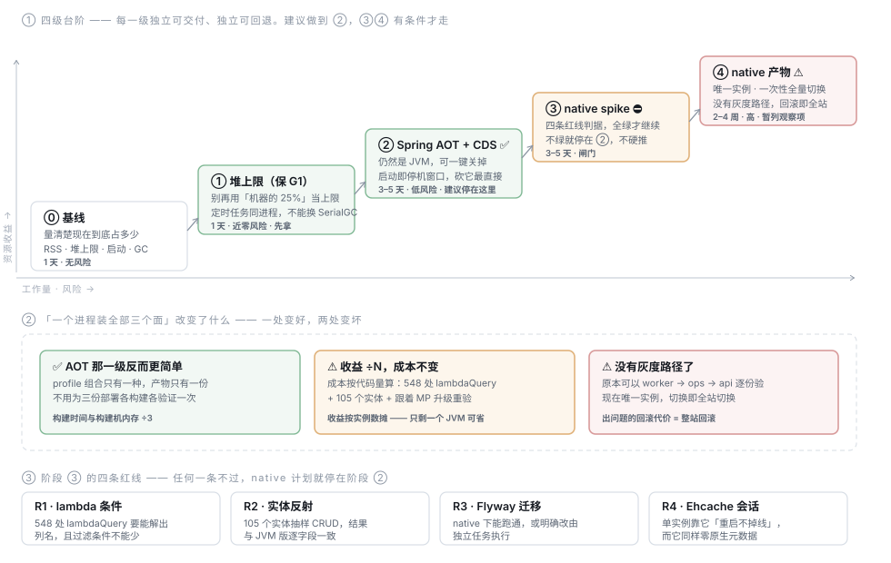

# TDD-GraalVM 与资源占用优化

状态：草稿（待确认）
关联需求：无 PRD —— 这是一条工程侧诉求（「提升资源使用率」）
关联：[TDD-backend](TDD-backend.md) · [部署拓扑](../diagrams/deploy-topology.svg) ·
[小程序上线指南](小程序上线指南.md) ·
**[资源需求评估-JDK21与native](资源需求评估-JDK21与native.md)（2026-08-14 实测，本文的收益估算已按它修正）** ·
[ADR-016 后端暂不拆构建产物](../ADR/ADR-016-后端暂不拆构建产物-边界在数据不在jar.md)
创建日期：2026-08-14

---

## L1 · 这份文档回答什么

**「上不上 GraalVM」不是一个是非题，是一段有闸门的路。而本项目的部署形态，把闸门的位置往前挪了。**

前提（2026-08-14 确认）：**实际部署只起一个进程，同时装 api / ops / worker 三个面。**
这与 [部署拓扑图](../diagrams/deploy-topology.svg) 画的三份部署不一致 —— 图是目标形态，不是现状。
本文按**现状**推演；形态一旦变回三份，第 §L4-2 节的结论要重算。

结论先给：

> **建议做到阶段 ②（Spring AOT + CDS）为止，native 暂列观察项。**

三条理由，都建立在本次核查的实测事实上：

1. **成本按代码量算，收益按实例数算。** native 的主要成本是给 MyBatis-Plus 补一份原生镜像元数据
   —— 548 处 `lambdaQuery` + 105 个实体 + 每次升 MP 重验一遍 —— 这份成本与起几个进程无关。
   而收益是「每个 JVM 省下的几百 MB」×实例数。**只有一个实例时，分母最小的那种情况。**
2. **没有灰度路径。** 唯一实例意味着 native 切换是一次性全量切换，出问题的回滚代价是整站回滚。
   三份部署时本可以 worker → ops → api 逐份验证，现在这条路不存在。
3. **内存根本不是瓶颈，CPU 才是。**（2026-08-14 实测补充，见
   [资源需求评估](资源需求评估-JDK21与native.md)）单个 JVM 稳态约 400 MB，
   2C4G 的机器装下「应用 + MariaDB + 系统」还剩一半余量。
   而 native 是**省内存、费 CPU**的方案 —— 在 CPU 紧的小机型上，它拿紧缺资源换宽裕资源，方向反了。

单实例也带来一处**变好**：AOT 的 profile 组合只有一种、产物只有一份，
不用为三份部署各构建各验证一次 —— 阶段 ② 的成本因此比通常情况低。

---

## L2 · 结构



图上看不出来的三件事：

**第一，台阶不是「native 的准备工作」，每一级自己就是交付物。** 阶段 ① 只改运行参数，
阶段 ② 产物仍然是 JVM 上跑的 jar、一个开关就能关掉。native 最终不做，这两级的收益也留在手里。

**第二，阶段 ② 在单实例下比通常情况更值钱。** 没有别的副本接管，**启动时间就等于停机窗口**。
AOT + CDS 能把它砍掉三到四成，成本低、可回退 —— 这是可用性收益，不只是资源收益。

**第三，阶段 ④ 的框是红的，不是因为技术做不到，是因为回滚代价。** 唯一实例上做一次性全量切换，
而这次切换要动的是持久层最底下那一层（列名解析、实体反射）—— 出问题的形态是「200 但结果不对」，
不是「起不来」。**起不来反而是好事，怕的是起来了、跑通了、少了一个过滤条件。**

| 阶段 | 做什么 | 产物 | 收益（估算，待阶段 ⓪ 校准） | 风险 | 工期 |
|---|---|---|---|:--|---|
| ⓪ 基线 | 量清楚现在占多少 | 一张数据表 | **已完成**，见[资源需求评估](资源需求评估-JDK21与native.md) | 无 | 1 天 |
| ① 堆上限 + 虚拟线程 | 收紧上限求可预测，保 G1 | 启动参数 | RSS **−10~20%**（实测修正，见下） | 近零 | 1 天 |
| ② Spring AOT + CDS | 仍是 JVM，AOT 产物 + 类数据共享 | 同一个 jar | 启动 **−30~40%** = 停机窗口同比缩短 | 低（可关） | 3–5 天 |
| ③ native spike | 四条红线判据 | 一个能跑的最小 native 二进制 | —— | 闸门 | 3–5 天 |
| ④ native 产物 | 一次性全量切换 | 一份原生二进制 | RSS **−50~70%**，启动 **<0.5s** | **高** | 2–4 周 |

> ⚠️ 收益列全部是**行业经验区间，不是本项目实测**。阶段 ⓪ 存在的唯一理由就是把这一列换成真数字。

---

## L3 · 详情

### 1. 当前架构：已核实的事实

全部经本次核查得出，不是推断：

| 事实 | 值 | 对本方案的意义 |
|---|---|---|
| 技术栈 | Spring Boot 4.0.7 + Java 21（enforcer 锁 `[21,22)`） | ✅ Boot 4 的 AOT 支持成熟；GraalVM for JDK 21 报告 `java.version=21`，**enforcer 不用改** |
| 规模 | 6 模块 / 593 个 main 源文件 / fat jar 59 MB | 单次 native 编译需 8–16 GB 构建内存 |
| 持久层 | 105 个 `extends BaseMapper` · 105 个 `@TableName` 实体 · **0 个 Mapper XML** | 无 XML 是好事（少一类资源扫描），但实体信息全靠运行期反射 |
| 查询写法 | **548 处** `lambdaQuery` / `LambdaQueryWrapper`，分布在 94 个文件 | ⛔ 最大风险，见 §L3-2 |
| 条件装配 | **86 处** `@Profile` · **20 处** `@ConditionalOnProperty` | AOT 在构建期冻结这些条件，见 §L3-3 |
| **部署形态** | **一个进程装 api + ops + worker 三个面，单实例** | 决定了本文的核心结论，见 §L1 |
| 混合负载 | **17 个 `@Scheduled`** 与 HTTP 请求同进程 | ⚠️ GC 不能换 SerialGC，见 §L3-5、§L3-6 |
| 会话存储 | `token-store` 三选一，单实例下用 `ehcache`（重启不掉线） | ⚠️ Ehcache 3 零原生元数据 → 红线 R4 |
| 发布链路 | 仓库里**没有** Dockerfile / Jenkinsfile | ⚠️ 构建侧改造在仓库外 |

### 2. 核心障碍：MyBatis-Plus 没有原生镜像元数据

逐个 jar 查过 `META-INF/spring/aot.factories`、`META-INF/native-image/**`、`RuntimeHints` 实现类：

| 依赖 | 原生元数据 |
|---|:--|
| `mybatis-plus` 3.5.16（含 `-spring`、`-spring-boot4-starter`、`-autoconfigure`、`-jsqlparser`） | ❌ 全部为零 |
| `mybatis` 3.5.19 / `mybatis-spring` 4.0.0 | ❌ 零 |
| `ehcache` 3.x | ❌ 零 |
| `flyway-core` / `flyway-mysql` 11.14.1 | ❌ 零 |
| `neargo-common-*`（自家地基） | ❌ 零 |
| `lettuce-core` | ✅ 有 |
| `spring-boot-autoconfigure` 4.0.7 | ✅ 有 |

**Spring 那一半是免费的，持久层那一半要自己写并长期维护。** 而且它不是一次性成本 ——
每次升 MyBatis-Plus 都要重验一遍。这份成本与实例数无关，是本文建议停在阶段 ② 的首要理由。

具体到三个机制：

1. **`SFunction` 的字段名解析**：`lambdaQuery().eq(SysOpsStaff::getUsername, x)` 靠
   `SerializedLambda`（反射调 `writeReplace`）反推出列名。native 下 lambda 序列化需要显式注册，
   **548 处**意味着漏一个就是运行期才发作的错 —— 而且症状往往是「查得出数据但少了个条件」。
2. **`TableInfoHelper` 建表信息**：105 个实体的字段、主键、逻辑删除标记全在运行期反射扫出来，
   需要为这 105 个类注册完整的反射 hints。
3. **Mapper 的 JDK 动态代理**：`@MapperScan` 扫出的 105 个接口在运行期生成代理。
   动态代理在 native 下**是支持的**，但每个接口都要登记 —— 这一条可以靠一个
   `BeanFactoryInitializationAotProcessor` 自动生成，是三条里最好解决的。

另外 `MybatisPlusConfig` 装了三个拦截器（数据权限 → 分页 → 乐观锁），
其中 `DataPermissionInterceptor` 走 jsqlparser 改写 SQL —— 这条链路必须进 spike 的验证范围，
不能只测「能查出数据」。

### 3. AOT 的条件冻结：单实例反而是最有利的形态

Spring AOT 在**构建期**求值 `@Profile` 与 `@ConditionalOn*`，运行期不再重算。
一般项目会被这条约束咬到；本项目只有一个进程、一种 profile 组合（`api,ops,worker`），
于是**只需要一次 AOT 构建、一份产物**，也不牵动
[ADR-016（后端暂不拆构建产物）](../ADR/ADR-016-后端暂不拆构建产物-边界在数据不在jar.md)。

真正需要逐条审的是那 20 处 `@ConditionalOnProperty` —— 它们里有多少是「部署时定死」、
多少是「运行时要能切」。前者随便冻，后者冻了就是功能丢失。`token-store` 属于后者（见 §L4-1）。

### 4. 阶段 ⓪：基线怎么量

在做任何优化之前，跑一次生产形态的进程，记这几个数：

```bash
jcmd <pid> GC.heap_info               # 实际用了多少堆，而不是上限是多少
jcmd <pid> VM.native_memory summary   # 需带 -XX:NativeMemoryTracking=summary 启动
ps -o rss= -p <pid>                   # 进程实际驻留内存
jcmd <pid> VM.flags -all | grep -E "MaxHeapSize|UseG1GC|MaxRAMPercentage"
```

**2026-08-14 已在本机的两个运行中实例上量过一轮，结果见
[资源需求评估 §L3-1](资源需求评估-JDK21与native.md)。** 一条要点前置到这里：

> 堆上限 4 GB（`MaxRAMPercentage=25`），而 G1 实际 committed 只有 208 MB。
> **「JVM 会占满堆上限」这个常见担心，在本项目不成立** —— G1 归还得很干净。
> 所以阶段 ① 的价值是**可预测性**（容器 limit 下不会突然膨胀），不是立刻省几百 MB，
> 收益估算已据此从 −30~50% 下调到 −10~20%。

仍待补的是 **Linux 生产环境**上的同一组数：macOS 的 `ps` RSS 因内存压缩偏低，
容器里的 `MaxRAMPercentage` 又按 cgroup limit 算，两边不能互相代入。

还要同时量**定时任务运行期间**的一组数：17 个 `@Scheduled` 与 HTTP 请求同进程，
批量任务跑起来时的堆占用与 GC 停顿才是真正的峰值，按空闲期定堆上限会在半夜 OOM。

### 5. 阶段 ①：堆上限收紧、试虚拟线程，但 GC 保持 G1

三个动作，**加起来 1 天**：

1. **收紧堆上限**：`-Xmx1g -Xms512m -XX:MaxMetaspaceSize=256m -XX:ReservedCodeCacheSize=128m`。
   目的是可预测性 —— 容器 limit 下不被 OOM Killer 误伤，而不是立刻省内存（见 §L3-4 的实测修正）。
2. **试虚拟线程**：JDK 21 上 `spring.threads.virtual.enabled=true` 是 GA 的，
   能省掉 200 个平台线程的栈与调度开销（40–80 MB 量级），一行配置、随时可关。
   ⚠️ 必须用 `-Djdk.tracePinnedThreads=full` 验 pinning —— JDK 21 上 `synchronized` 会钉住载体线程，
   而 HikariCP 与 MyBatis 内部都有 `synchronized` 路径。
   **这件事和 native 在解同一块问题（线程与并发开销），性价比却高一个数量级。**
3. **顺手把 `innodb_buffer_pool_size` 从默认 128 MB 调大**（见
   [资源需求评估 §L3-3](资源需求评估-JDK21与native.md)）——
   它不在应用侧，但对体感的影响比这里任何一项都大。

**不要换 SerialGC。** 17 个 `@Scheduled` 和 API 请求跑在同一个进程里，
SerialGC 的 STW 会直接打到接口响应上。低流量进程用 SerialGC 省内存是成立的，
但那个前提是「进程只干一件事」，本项目的单实例恰恰相反。

参数落在部署侧（启动脚本 / 容器 env），不进 `application.yml`：它是部署决策，不是应用配置。

### 6. 阶段 ②：Spring AOT + CDS（仍然是 JVM）

```bash
# AOT 产物在构建期生成，运行期用同一个 JVM 跑
mvn -pl shop-app -am spring-boot:process-aot
java -Dspring.aot.enabled=true -jar shop-app.jar
```

这一级的价值有三层：

1. **停机窗口**：单实例没有副本接管，启动时间就是停机时间。AOT 把条件求值与 Bean 定义扫描
   搬到构建期，叠加 AppCDS（Boot 4 支持 `-XX:ArchiveClassesAtExit` 归档）后还能再降一截。
2. **内存**：类加载量与元空间下降。
3. **它是 native 的照妖镜**：86 个 `@Profile` + 20 个 `@ConditionalOnProperty` 一旦有问题，
   **在这一级就会暴露**，而此刻回退只是去掉一个 `-D` 开关，不是回退一次全站发布。

**跳过这一级直接做 native 是本方案明确反对的做法** —— 那等于把两类问题
（条件冻结 / 反射元数据）搅在一起排查，而它们的症状都是「启动时 NoSuchBeanDefinitionException」。

### 7. 阶段 ③：spike 的四条红线

只做一件事：出一个**能跑的最小 native 二进制**，然后拿四条判据卡它。全绿才进阶段 ④。

| # | 判据 | 怎么算过 |
|---|---|---|
| **R1** | 带 `lambdaQuery` + 分页 + 数据权限拦截器的读链路正确 | 取 `GET /mp/goods`，**逐字段比对** native 与 JVM 两版的响应体。⚠️ 返回 200 不算过 —— 列名解析错时最常见的症状恰恰是「200 但少了个过滤条件」 |
| **R2** | 实体反射元数据完整 | 105 个实体随机抽 10 个做 CRUD，含逻辑删除与乐观锁字段，结果逐字段比对 |
| **R3** | Flyway 能迁移 | native 下 `flyway.migrate` 跑通；**或**明确改为「迁移由独立 JVM 任务执行，应用只校验版本」 |
| **R4** | Ehcache 会话可用 | 单实例靠 `ehcache` 做到「重启不掉线」，而它零原生元数据。跑不通就只剩 §L4-1 那两个都不好的选项 |

R3 的两个选项里，**推荐第二个**：让应用自己 migrate 在 native 下多一整类失败面
（资源扫描 + JDBC 元数据反射），而把迁移拆成发布流水线里独立一步，本来就是更稳的做法。
这是一个**设计决定，不是技术妥协**。

**还要先选发行版**：GraalVM CE 的原生镜像**只有 SerialGC**，G1 要 Oracle GraalVM
（JDK 21 下 GFTC 许可免费）或 Liberica NIK。§L3-5 已经说明本项目不能用 SerialGC，
所以「用 CE 做 native」这条路在混合负载下是走不通的 —— **这一条要在 spike 开始前定，不是之后**。

spike 的产出物不只是「行 / 不行」，还要带一份 **hints 工作量清单**：
到底要手写多少条、能自动生成多少条。阶段 ④ 的两到四周估算靠它校准。

### 8. 阶段 ④：单实例下怎么降风险

顺序不存在了 —— 唯一实例，一次性全量切换。能做的只有把验证前移：

1. **产物必须跑一遍真实链路 smoke，不能只看 JVM 上的测试全绿。**
   现有 20+ 个测试（ArchUnit、场景测试、E2E）全部跑在 JVM 上，
   它们对 native 的反射缺失**完全无感** —— 测试全绿而线上出错，是这类迁移最典型的翻车方式。
2. **预发环境长期挂着 native 产物跑**，用它换掉「多副本灰度」这条不存在的路。
   时长按发版节奏定，至少覆盖一个完整的定时任务周期（含结算生成、超时关单、逾期核销）。
3. **保留 JVM 产物作为回滚目标**，同一个 tag 同时出两份产物，回滚就是换启动命令。

---

## L4 · 边界：必须先拍板的取舍

### 1. `token-store` 在 native 下会被冻死，而单实例正好依赖它

单实例形态下 [backend/README](../../../backend/README.md) 的推荐是 `ehcache`：零依赖、本地磁盘持久化、
**进程重启不掉线**。native 下 `@ConditionalOnProperty` 在构建期求值，`SHOP_TOKEN_STORE` 将不再起作用，
而 Ehcache 3 本身零原生元数据（`CacheManagerBuilder` + 磁盘持久化 + 序列化）。

| 若 R4 不通过 | 代价 |
|---|---|
| 退回 `memory` | **每次发版全员掉线** —— 单实例本来就没有副本接管，这是雪上加霜 |
| 上 `redis` | 单机上多一个中间件，又来抢那几百 MB —— 而省内存正是做 native 的初衷 |

**两个都不好，这就是 R4 被列为红线的原因。**（上一版基于「多副本」建议统一 redis，
在单实例下不成立，已作废。）

### 2. 形态一变，结论要重算

本文的核心结论建立在「单实例」这一个事实上。以下任一情况发生，第 §L1 节要整个重来：

- 部署拆回 [拓扑图](../diagrams/deploy-topology.svg) 的三份（api / ops / worker）
- api 面扩到多副本
- MyBatis-Plus 官方提供原生镜像元数据（成本项最大的一块消失）

前两条会让分母变大、灰度路径重新出现；第三条会让成本项塌掉一半。
**这三条就是 native 从「观察项」转回「待办」的触发条件**，不用定期复议，出现了再说。

#### ⚠️ 2026-09-02：触发条件里漏了一条，而它已经发生

上面三条都是「主应用自己的形态变了」。**漏掉的第四条是「多出一个进程」** ——
`pay-svc`（支付域独立形态）在 2026-09-01 落地，它不是主应用的副本，是另一个产物。

它恰好是 native 最合适的形状，而且三条「暂不做」的理由**在它身上一条都不成立**：

| 原理由 | 在 pay-svc 上 |
|---|---|
| 收益按实例数算，只有一个实例时分母最小 | 它是**第二个**产物，与主应用各算各的 |
| 没有灰度路径，切换即全站 | 它今天**接不了流量**（依赖 11 个业务侧 Port），停用它不影响主站 |
| 内存不是瓶颈、CPU 才是 | 同上：它的 CPU 占用趋近于零，省下的内存是净收益 |

形状上也更有利：**没有 controller、不认用户身份**（排掉五条安全自动配置）、
只暴露 `/internal` 与 `/callback`，条件装配面窄，AOT 要冻结的组合少。

**但成本项一条没少**：它经 `pay-domain → shop-store-mybatis` 拖进
**12 条 MyBatis 依赖**（2026-09-02 数的依赖树）。
所以对它而言 native 的前置仍然是 §C2c 换持久层，与主应用同一个障碍。

---

### 2b. 拍板（2026-09-02）：pay-svc 先跑 JVM，native 与切 MySQL 同批

> **暂时 pay-svc 基于 JDK 21 跑（JVM 形态）。将来稳定后，切 MySQL 与 native 部署一起做。**

「一起做」不是凑批次，是这三件事**共用同一个前置**：

```
C2c 换持久层（MyBatis → Spring Data JDBC + JdbcClient）
        │
        ├──→ native 成立     （MyBatis 的原生镜像元数据成本消失）
        └──→ 切 MySQL 变便宜 （Data JDBC 的 dialect 生成 CRUD，
                              方言差异从 113 处收敛到 4 处手写 CAS）
```

分开做要把持久层这一层动两次，而**换持久层丢的是隐式行为** ——
不报错、不影响编译，要等某条真实路径被真实数据走到才现形（见
[实施方案 §C2c](TDD-支付域-实施方案与排期.md)）。动两次就要承担两次这种风险。

**「稳定后」的判据**（不是感觉，是三条可查的事实）：

1. `pay-svc` 真的在接流量 —— 11 个业务侧 Port 有了 HTTP 实现，不再是「装得起来但用不了」；
2. 收款主链路跑通 —— 通道凭证到位、`ChannelClient` 生产实现上线（S3/S4）；
3. 支付域的表结构不再频繁变动 —— 换持久层期间加列改列，两边都要跟。

在那之前 pay-svc 维持 JVM 形态，**不为 native 做任何提前投入**：
补一半的原生镜像元数据会在 C2c 那天整份作废。

### 3. 构建侧的资源账

native 单次编译需 **8–16 GB 内存、5–15 分钟**。单实例的好处是只出一份产物，不用 ×3。
仓库里没有 Dockerfile / Jenkinsfile，这块改造完全在仓库外 —— **先确认构建机规格**，
否则就是「省了运行资源、卡死了构建机」。若构建机吃不下，阶段 ④ 应当延后，而不是压着构建资源硬上。

### 4. 一个超出本方案范围、但必须记一笔的发现

一个进程同时装 `api` 与 `ops` 两个面，意味着 **`/ops/**` 与 `/biz` `/mp` 暴露在同一个网络位置上**。
而 [拓扑图](../diagrams/deploy-topology.svg) 标的是「平台运营 · 仅内网可达 · VPN」，
`DeploymentProfileTest` 那条守卫要证明的也正是「C/B 端的面不会与 ops 面同时存在」。

**这是部署形态与安全设计之间的漂移，不是 GraalVM 方案的一部分**，
但它比本文讨论的任何一件事都更该先处理。已单独记录，不在本文的任务清单内。

### 未定项

| # | 待决 | 说明 |
|---|---|---|
| Q1 | 优化目标是「省机器钱」还是「同机器扛更多请求」 | 前者阶段 ① 大概率就够；后者要看阶段 ⓪ 的 GC 数据 |
| Q2 | Flyway 迁移是否拆成流水线独立一步（§L3-7 R3） | 推荐拆，与 native 无关也值得做 |
| Q3 | 构建机规格（§L4-3） | 只在决定走阶段 ③④ 时才需要 |
| Q4 | 若走阶段 ③，用 Oracle GraalVM 还是 Liberica NIK（§L3-7） | CE 因只有 SerialGC 而出局 |
| ~~Q5~~ | ~~pay-svc 要不要单独走 native~~ | **2026-09-02 定：要，但等「稳定后」，与切 MySQL 同批。判据见 §L4-2b** |

---

## 测试策略

| 阶段 | 验证方式 | 通过判据 |
|---|---|---|
| ⓪ | 空闲期 + 定时任务运行期各量一次内存与启动 | 数据表填满，无空格 |
| ① | 参数调整后回归现有 20+ 测试 + 压测 | 测试全绿；P99 不劣化；定时任务运行期不 OOM |
| ② | 加 `-Dspring.aot.enabled=true` 跑全量测试 + 生产 profile 组合启动一次 | 能起、端点齐全、17 个定时任务都注册上 |
| ③ | R1 / R2 / R3 / R4 四条红线 | 逐字段比对通过，不看状态码 |
| ④ | native 产物跑 E2E 子集（登录→逛→下单→履约）+ 预发长跑一个定时任务周期 | 全通过才切 |

**新增一条守卫**：阶段 ② 之后，CI 里要有一条「AOT 模式下生产 profile 组合能启动且端点齐全」的检查。
条件冻结的错误只在启动时暴露，而现有测试用的是 `test` profile 组，**照不到生产的那一种组合**。

---

## 实现任务

- [ ] T0 阶段 ⓪：量基线（空闲期 + 定时任务运行期各一次），填 §L2 的收益列
      —— **先做这个，它可能改变整个方案的性价比结论**
- [ ] T1 阶段 ①：收紧堆上限，保持 G1，落在部署侧
- [ ] T2 审计 20 处 `@ConditionalOnProperty`，分「部署时定死」与「运行时要能切」两类
- [ ] T3 阶段 ②：接 `process-aot` + AppCDS，生产 profile 组合验证启动
- [ ] T4 CI 增加「AOT 模式下生产 profile 组合启动且端点齐全」守卫
- [ ] T5 **【决策点】** 依 T0–T4 的实测结果决定是否启动阶段 ③
      —— 默认答案是**不启动**，native 留在观察项，触发条件见 §L4-2
- [ ] T6 （仅当 T5 决定走）阶段 ③ spike：选发行版 → 最小 native 二进制 → R1/R2/R3/R4 → hints 工作量清单
- [ ] T7 （仅当 T6 全绿）阶段 ④：双产物发布 + 预发长跑 + 一次性切换

---

确认记录：待确认
