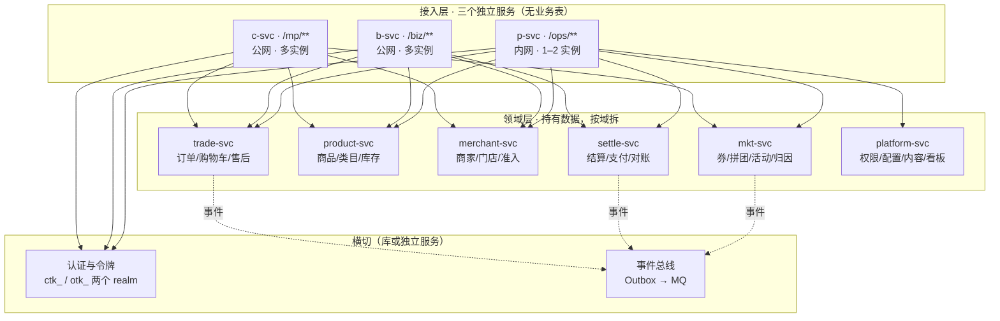

# TDD-三端服务拆分 · 架构与服务依赖规划

状态：**待确认**
关联决策：[ADR-016](../ADR/ADR-016-后端暂不拆构建产物-边界在数据不在jar.md)（本方案是它的执行路线：
ADR-016 的结论是「暂不拆，且第一刀切在数据」，本方案给出**怎么切**）
关联架构：[TDD-backend](TDD-backend.md) §4 · ADR-017 双形态（拆分 = 改依赖列表）
创建日期：2026-08-13

---

## 1. 目标

按 **C 端 / B 端 / 平台端三个独立服务** 规划架构与服务依赖，
并给出从今天的模块化单体走过去的路线。

「独立服务」在本方案里的定义（三条都要满足，缺一条就不算）：

1. **独立构建产物**：各自的 jar 与流水线
2. **独立发布**：改 C 端不需要 B 端和平台端跟着发版
3. **独立故障域**：一个挂了，另外两个照常服务

---

## 2. 实测：今天的耦合在哪

三组数字，都是从代码量出来的（不是估计）：

### 2.1 Controller 分布

| 端 | Controller 数 |
|---|---|
| C（`/mp/**`） | 10 |
| B（`/biz/**`） | 15 |
| 平台（`/ops/**`） | 27 |

### 2.2 领域服务被几端使用（共 50 个）

| 归属 | 数量 | 说明 |
|---|---|---|
| 只有 C | 8 | 购物车、地址、收藏、归因… |
| 只有 B | 6 | 门店管理、核销、商家角色… |
| 只有平台 | 15 | 权限配置、对账、内容治理、看板… |
| **C+B** | 6 | 认证、用户、社区、商家、积分、门店码 |
| **C+平台** | 2 | 券、消息 |
| **B+平台** | 8 | 准入、活动、商品、订单、结算、员工… |
| **三端共用** | 5 | 售后、类目、拼团、评价、OpsService |

**29 个服务（58%）被两端以上使用。**

### 2.3 ★ 决定性的一组：表被几端碰（共 64 张）

| 归属 | 数量 |
|---|---|
| **三端共用** | **29（45%）** |
| C+B | 5 |
| C+平台 | 5 |
| B+平台 | 8 |
| 只有 C | 5 |
| 只有 B | 1 |
| 只有平台 | 11 |

三端共用的 29 张里包含**全部核心表**：

```
ord_order  ord_sub_order  ord_item  ord_after_sale  ord_status_log
prd_goods  prd_sku  prd_category   mch_entity  mch_store
mkt_coupon  mkt_group_buy  rvw_review  stl_bill  cmt_community …
```

**这一组数字决定了架构形态**：`ord_order` 同时被 C 端（我的订单）、
B 端（商家接单）、平台端（跨商家订单管理）读写。
三个端服务不可能各自拥有它——**所以「三端」不能是持有数据的那一层**。

---

## 3. 目标架构

### 3.1 形态：端服务是接入层，域服务持数据



**为什么端服务不持数据**：见 §2.3。45% 的表被三端同时碰，
让 C 端服务拥有 `ord_order` 就意味着平台端查跨商家订单要调 C 端服务——
一个面向消费者的公网服务成了平台报表的上游，故障域反而更差了。

**端服务做什么**：路由、鉴权、端专属编排与裁剪（VO 按端裁字段）、端专属缓存。
它们**天然满足「独立发布」**——改 C 端的展示逻辑不碰任何域服务。

**这个形态没有背离「三个独立服务」**：三个端服务确实是独立构建、独立发布、
独立故障域的。只是数据的边界不在端上，而在域上。

### 3.2 依赖规则（四条，是这套架构能立住的原因）

1. **端服务之间绝不互相调用。** C 端要商家信息就调 `merchant-svc`，
   不调 `b-svc`。破了这条，三个端就重新耦合成一个环。
2. **数据只有 owner 写。** 每张表有且只有一个域服务能写；
   其他服务读走接口，不直连别人的表。
3. **跨域调用走 `shop-spi` 的 Port 接口。** 单体内是本地调用，
   拆开后换 RPC 实现，**调用方一行不改**——这条今天已经在执行。
4. **跨域一致性走 Outbox 事件，不做分布式事务。**
   写入侧「业务与事件同事务落库」今天已经兑现，投递侧换 MQ 即可。

### 3.3 数据归属（64 张表 → 6 个域服务）

| 域服务 | 拥有的表（前缀） | 张数 |
|---|---|---|
| `trade-svc` | `ord_*` `trd_*` | 6 |
| `product-svc` | `prd_*` | 5 |
| `merchant-svc` | `mch_*` `cmt_*` `ful_*` | 12 |
| `settle-svc` | `stl_*` `pts_*` | 8 |
| `mkt-svc` | `mkt_*` `rvw_*` | 14 |
| `platform-svc` | `sys_*` `cnt_*` `msg_*` `usr_*` | 19 |

`usr_*`（账号/身份/地址/收藏）暂归 `platform-svc` 是**权宜**：
它其实该有自己的 `user-svc`，但一期用户域改动少，先不多拆一个部署单元。
包边界保留，将来随时可拆（沿用 TDD-backend §4 「模块数 = 未来可能的部署单元数」）。

---

## 4. 拆分会打破的三件事（必须先有答案）

这三件今天靠「同一个进程」成立，拆开就不成立了。

### 4.1 令牌存储：进程内 → 共享

C 端与 B 端**共用 `ctk_` 令牌池**（[ADR-001](../ADR/ADR-001-商家端形态与拆分时机.md)：
共用令牌池、分开前缀，拆端时后端零改动）。
今天令牌存在 `EhcacheTokenStore`（**进程内**，磁盘持久化）。

`c-svc` 与 `b-svc` 一拆成两个进程，B 端签发的令牌 C 端就不认识了。

**好消息：缝已经留好了。** `TokenStore` 是接口，`RedisTokenStore` 已经存在。
换实现是配置，不是重写。

### 4.2 行级数据域：MyBatis 拦截器 → 每服务各自装配

DataScope 是 MyBatis 拦截器（商家只能看自己的数据）。
拆开后每个域服务各自装配它，而**主体身份要随调用传过去**——
今天靠 `SecurityUtils.currentUserNo()` 从线程上下文取，跨进程就断了。

需要一个显式的调用上下文（主体 + 数据域）随 RPC 传递。
这是拆分里最容易漏、且漏了会**越权**的一处。

### 4.3 跨域事务：一个事务 → Outbox + 幂等

下单今天在一个事务里跨 trade / product（锁库存）/ settle。
拆开后要改成 Outbox 事件 + 消费者幂等（`msg_message.dedup_key` 的做法已经在用）。

**前置条件**：Outbox 投递任务今天**根本没有在跑**
（见 [定时任务清单与调度方案](定时任务清单与调度方案.md) §1.2，
`dispatchPending()` 只有测试在调）。
拆分之前必须先把这条链路真的跑起来——否则第一个跨服务写就丢事件。

---

## 5. 分阶段路线

每一阶段都可独立上线，且上线后系统是完整可用的。

### S1 — 三个端服务先拆出来（拿到「独立发布」）

- `shop-app` 拆成 `shop-app-c` / `shop-app-b` / `shop-app-p` 三个启动模块，
  **各自只依赖自己需要的域模块**（ADR-017 双形态：拆分 = 改依赖列表）
- 域层仍是一个进程内的库，三个端服务各自内嵌——**此时还是三份「胖」服务**
- 令牌存储换 `RedisTokenStore`（§4.1）

**拿到**：独立构建、独立发布、独立故障域（三条全满足）。
**没拿到**：数据仍共享，域代码还在三份产物里各带一份。

> S1 是**收益最大、代价最小**的一步：改的主要是依赖列表与打包，不动业务代码。

### S2 — 把事件链路跑起来（拆域的前置）

- 补 Outbox 投递定时任务（今天缺）
- 投递侧从进程内分发换成 MQ
- 建立调用上下文透传（§4.2）

**这一步不产生新服务**，但没有它，S3 的第一个跨服务写就会丢数据。

### S3 — 按价值切域服务

顺序按「变更节奏 + 外部依赖」，不按代码量：

1. `settle-svc`（已独立成工程；外部依赖最重：支付通道、分账）
2. `merchant-svc`（已独立成工程；变更节奏与核心域不同）
3. `trade-svc`（最核心，最后动）

`product-svc` / `mkt-svc` / `platform-svc` 视届时诉求再定，**包边界先保留**。

### S4 — 数据库按域拆

最后一步，也是最贵的一步。在此之前是**一个库、多个服务**——
这是有意的过渡态，不是终点，但它比「先拆库再拆服务」安全得多。

---

## 6. 每阶段的验收与守卫

拆分最大的风险是**「拆了但没真拆」**：产物分开了，依赖还缠在一起，
而没有任何东西报错。所以每阶段配一条机器可查的守卫：

| 阶段 | 守卫 |
|---|---|
| S1 | `shop-app-c` 的依赖树里**不出现** ops 侧的域模块（ArchUnit / Maven `dependency:tree` 断言） |
| S1 | 三个端服务各自启动，`/mp/**` 在 `b-svc` 上返回 404（沿用今天「路由不存在」的隔离口径） |
| S2 | `sys_outbox` 里 `PENDING` 超过 N 分钟的行数为 0（可观测指标，不是测试） |
| S3 | 域服务之间**没有直接的表访问**：`grep` 别的域的 Mapper = 红 |
| S3 | 端服务之间零调用（依赖树里互不出现） |
| 全程 | `module-graph.py`（TDD-backend §4 规划、**至今未建**）——判断「能不能拆」的唯一客观依据 |

最后一条是前置：本方案的所有数字都是我临时写脚本量的，
**这种度量应该常驻**，否则每次讨论都要重新量一遍，而量的口径还可能不一致。

---

## 7. 实现任务

- [ ] T0 建 `module-graph.py` + `split-readiness.py`（度量常驻，是后续所有判断的依据）
- [ ] T1 S1：`shop-app` 拆三个启动模块 + 依赖列表收敛
- [ ] T2 S1：令牌存储换 `RedisTokenStore` + 三端共用验证
- [ ] T3 S1：依赖树守卫 + 三端路由隔离验证
- [ ] T4 S2：Outbox 投递任务（见[定时任务方案](定时任务清单与调度方案.md) J1）
- [ ] T5 S2：调用上下文透传（主体 + 数据域）
- [ ] T6 S2：投递侧接 MQ
- [ ] T7 S3：按 §5 顺序切域服务，每切一个补一条守卫

---

## 8. 需要确认的三件

1. **端服务不持数据**这个形态是否接受（§3.1）——
   它是 §2.3 那 45% 共用表推出来的，但它意味着服务总数最终会多于 3 个
2. **S1 先行**是否接受：先拿「独立构建/发布/故障域」，数据库拆分留到最后
3. `usr_*` 暂归 `platform-svc`（§3.3）是否可接受，还是一期就单开 `user-svc`

---

确认记录：待确认
