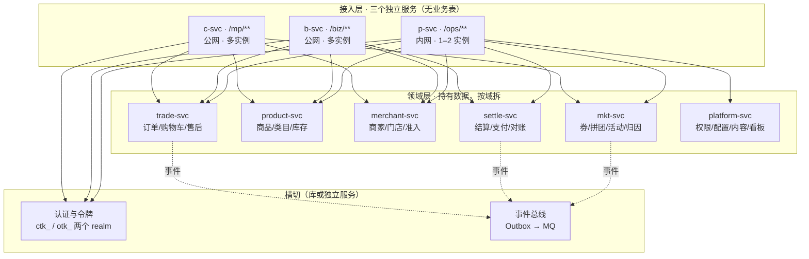
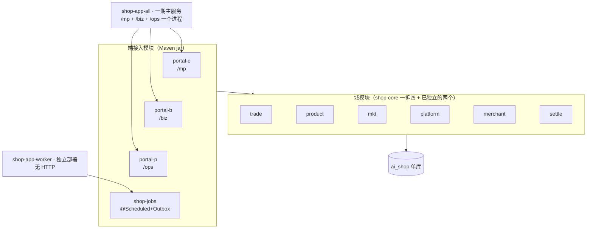

# TDD-三端服务拆分 · 架构与服务依赖规划

状态：**待确认**
> 📌 **落地看 [§10 定稿](#10-定稿2026-08-13-落地以本节为准)**：一期 1 个项目 · 13 个模块 · 2 个部署产物。
> §2–§9 是推导过程与实测依据（含 §9 自审），保留备查，与 §10 冲突时以 §10 为准。
关联决策：[ADR-016](../ADR/ADR-016-后端暂不拆构建产物-边界在数据不在jar.md)（本方案是它的执行路线：
ADR-016 的结论是「暂不拆，且第一刀切在数据」，本方案给出**怎么切**）
关联架构：[TDD-backend](TDD-backend.md) §4 · ADR-017 双形态（拆分 = 改依赖列表）
创建日期：2026-08-13

---

## 1. 目标

按 **C 端 / B 端 / 平台端三个独立服务** 规划架构与服务依赖，
并给出从今天的模块化单体走过去的路线。

「独立服务」在本方案里的定义（三条都要满足，缺一条就不算）：

1. **独立构建产物**：各自的 jar 与流水线
2. **独立发布**：改 C 端不需要 B 端和平台端跟着发版
3. **独立故障域**：一个挂了，另外两个照常服务

---

## 2. 实测：今天的耦合在哪

三组数字，都是从代码量出来的（不是估计）：

### 2.1 Controller 分布

| 端 | Controller 数 |
|---|---|
| C（`/mp/**`） | 10 |
| B（`/biz/**`） | 15 |
| 平台（`/ops/**`） | 27 |

### 2.2 领域服务被几端使用（共 50 个）

| 归属 | 数量 | 说明 |
|---|---|---|
| 只有 C | 8 | 购物车、地址、收藏、归因… |
| 只有 B | 6 | 门店管理、核销、商家角色… |
| 只有平台 | 15 | 权限配置、对账、内容治理、看板… |
| **C+B** | 6 | 认证、用户、社区、商家、积分、门店码 |
| **C+平台** | 2 | 券、消息 |
| **B+平台** | 8 | 准入、活动、商品、订单、结算、员工… |
| **三端共用** | 5 | 售后、类目、拼团、评价、OpsService |

**29 个服务（58%）被两端以上使用。**

### 2.3 ★ 决定性的一组：表被几端碰（共 64 张）

| 归属 | 数量 |
|---|---|
| **三端共用** | **29（45%）** |
| C+B | 5 |
| C+平台 | 5 |
| B+平台 | 8 |
| 只有 C | 5 |
| 只有 B | 1 |
| 只有平台 | 11 |

三端共用的 29 张里包含**全部核心表**：

```
ord_order  ord_sub_order  ord_item  ord_after_sale  ord_status_log
prd_goods  prd_sku  prd_category   mch_entity  mch_store
mkt_coupon  mkt_group_buy  rvw_review  stl_bill  cmt_community …
```

**这一组数字决定了架构形态**：`ord_order` 同时被 C 端（我的订单）、
B 端（商家接单）、平台端（跨商家订单管理）读写。
三个端服务不可能各自拥有它——**所以「三端」不能是持有数据的那一层**。

---

## 3. 目标架构

### 3.1 形态：端服务是接入层，域服务持数据



**为什么端服务不持数据**：见 §2.3。45% 的表被三端同时碰，
让 C 端服务拥有 `ord_order` 就意味着平台端查跨商家订单要调 C 端服务——
一个面向消费者的公网服务成了平台报表的上游，故障域反而更差了。

**端服务做什么**：路由、鉴权、端专属编排与裁剪（VO 按端裁字段）、端专属缓存。
它们**天然满足「独立发布」**——改 C 端的展示逻辑不碰任何域服务。

**这个形态没有背离「三个独立服务」**：三个端服务确实是独立构建、独立发布、
独立故障域的。只是数据的边界不在端上，而在域上。

### 3.2 依赖规则（四条，是这套架构能立住的原因）

1. **端服务之间绝不互相调用。** C 端要商家信息就调 `merchant-svc`，
   不调 `b-svc`。破了这条，三个端就重新耦合成一个环。
2. **数据只有 owner 写。** 每张表有且只有一个域服务能写；
   其他服务读走接口，不直连别人的表。
3. **跨域调用走 `shop-spi` 的 Port 接口。** 单体内是本地调用，
   拆开后换 RPC 实现，**调用方一行不改**——这条今天已经在执行。
4. **跨域一致性走 Outbox 事件，不做分布式事务。**
   写入侧「业务与事件同事务落库」今天已经兑现，投递侧换 MQ 即可。

### 3.3 数据归属（64 张表 → 6 个域服务）

**逐张归属见 [迁移后-项目模块与数据归属清单](../reference/迁移后-项目模块与数据归属清单.md) §5**
（88 张全表实测，下表是按前缀的概览）：

| 域服务 | 拥有的表（前缀） | 张数 |
|---|---|---|
| `trade-svc` | `ord_*` `trd_*` | 6 |
| `product-svc` | `prd_*` **`rvw_*`** | 11 |
| `merchant-svc` | `mch_*`（除 `_apply`）`cmt_*` `ful_*` `sys_auth_code` | 22 |
| `settle-svc` | `stl_*` `pts_*` | 9 |
| `mkt-svc` | `mkt_*` | 12 |
| `platform-svc` | `sys_*` `cnt_*` `msg_*` `usr_*` `mch_entity_apply` | 26 |
| （`shop-base`） | `sys_idempotent` `sys_outbox` | 2 |

⚠️ 两处与直觉相反、但**符合代码现状**：`rvw_*`（评价）在 **product** 不在 mkt
（评价挂商品上，实体住 `product` 包）；`mch_entity_apply`（入驻申请）在 **platform** 不在 merchant
（申请发生在**成为商家之前**，与审核同侧）。

`usr_*`（账号/身份/地址/收藏）暂归 `platform-svc` 是**权宜**：
它其实该有自己的 `user-svc`，但一期用户域改动少，先不多拆一个部署单元。
包边界保留，将来随时可拆（沿用 TDD-backend §4 「模块数 = 未来可能的部署单元数」）。

---

### 3.4 一期形态：C+B+P 合一部署，worker 独立（2026-08-13 确认）

一期**不按端拆部署**：C+B+P 是一个大服务，worker 独立部署——两个构建产物。
但**模块与项目现在就按目标形态拆开**，让二期的 c/b/p 拆分收缩成
「新增一个启动模块、挑一份依赖列表」（ADR-017：拆分 = 改依赖列表）。



⚠️ **一个要点名的回退**：今天 api 与 ops 是**两个进程**（平台面不上公网）；
合一部署后 `/ops` 与公网流量同进程。缓解（两道都要）：
① `@Profile` 机制**保留**——同一个 all 产物仍可按 profile 只开某一面，部署自由度不丢；
② 反代层 `/ops/**` 只对内网放行。

#### 3.4.1 三端认证各自独立（2026-08-13 决定，**推翻 ADR-001 的共用令牌池**）

现状：`Realm` **只有两个**（`CONSUMER` / `OPERATOR`），`ctk_` 被 C 与 B 共用，
`consumerChain` 一条链同时匹配 `/mp/**` 与 `/biz/**`。
B 端身份靠 `BizContextFilter` 在 C 端令牌之上再解析一层。

ADR-001 当初共用的理由是「一期商家专区**内嵌 C 端小程序**，店主用自己的微信号」——
**这个前提已经不成立**：[ADR-014](../ADR/ADR-014-小程序打包边界.md) §5 起商家端是独立的 `b-app`。
代码里也已经写下同向的判断（`/biz/auth/otp/send` 注释：
「这两个端的鉴权链、限流策略**将来会分开**」）。

**改为三个 realm，各自独立**：

| Realm | 前缀 | 链 | 登录入口 |
|---|---|---|---|
| `CONSUMER` | `ctk_` | `/mp/**` | `/mp/user/login` |
| `MERCHANT` | `btk_` | `/biz/**` | `/biz/auth/login`（老板）· `/biz/auth/staff-login`（店员） |
| `OPERATOR` | `otk_` | `/ops/**` | `/ops/auth/login` |

**四条后果，都要点名**：

1. **一个人两个身份 = 两个令牌。** 同一手机号既是消费者又是店主时，
   两端各自登录。这正是解耦要的，但 `b-app` **不能再复用 `c-app` 的登录态**。
2. `/biz/auth/login` 仍可**用 C 端账号校验身份**（老板从 C 端发起入驻，账号在那边），
   但**签发的是 `btk_`**——校验源与令牌池是两件事，分开后才能各自演进。
3. `BizContextFilter` 从「在 C 端令牌上再解析一层」变成 **B 端链的组成部分**；
   `BizIdentityResolver.resolve(userNo)` 签名不变，改的是谁在什么链上调它。
4. **换 Redis 的理由变了**：不再是「C/B 共用池要跨进程」，而是
   「**同一端多实例**要共享会话」。`api` 今天就多实例——所以 Redis 的优先级
   与端拆分**解耦**，按各端自己的实例数决定。

> 副作用是好的：三端各自的**会话时长、限流、踢人策略、密码策略**从此可以不同。
> 今天 B 端只能跟着 C 端走，而商家的会话诉求（长在线、多设备）与消费者本就不同。

#### 3.4.2 模块与项目拆分方案

现状对拆分友好：Controller 已按 `api/{mp,biz,ops}` 子包组织在各域内
（core 7/6/16 · merchant 0/1/6 · settle 1/2/4，另有 4 个特例），迁移是机械的。

**关键设计：认证随端下沉到 portal 模块。**
今天三条 `SecurityFilterChain` 挤在 `shop-app/config/SecurityConfig` 一个文件里；
拆开后**每个 portal 自带自己那条链的 `@Configuration`**——
于是「二期 `shop-app-c` 只依赖 `portal-c`」天然意味着「它只有 consumerChain」，
不需要任何开关或 profile 判断。**装配即隔离。**

**目标模块树**（模块数 = 未来可能的部署单元数，原则不变）：

```
backend/
├── shop-base                      # 地基：TokenStore/LoginUser/Perms/Realm 等三端通用件
├── shop-spi                       # 跨域契约 Port（今天在 base 内，建议随本次独立）
├── shop-channel                   # 通道适配（BizUploadController 迁出到 portal-b）
│
├── 域模块 —— shop-core 一拆四 + 归位
│   ├── shop-domain-trade          # trade 包
│   ├── shop-domain-product        # product 包
│   ├── shop-domain-mkt            # marketing 包
│   ├── shop-domain-platform       # platform + user + content + message 包
│   ├── shop-merchant              # 已独立；community、fulfillment 从 core 迁入（§3.3 归属）
│   └── shop-settle                # 已独立
│
├── 端接入模块 —— Controller + 该端的认证链，一起搬
│   ├── shop-portal-c              # /mp · ConsumerTokenAuthFilter + consumerChain
│   │                              #   ＋ api/mp 全部 + portal/mp + PayCallbackController
│   ├── shop-portal-b              # /biz · MerchantTokenAuthFilter + merchantChain
│   │                              #   ＋ BizContextFilter/BizIdentityResolver（B 端专有）
│   │                              #   ＋ api/biz 全部 + portal/biz + BizUploadController
│   ├── shop-portal-p              # /ops · OperatorTokenAuthFilter + operatorChain
│   │                              #   ＋ api/ops 全部 + OpsPermConfigController
│   └── shop-portal-common         # publicChain：/common + /actuator + CommonMetaController
│                                  #   三个启动模块都依赖它
│
├── shop-jobs                      # 全部 @Scheduled + Outbox 投递任务（补上缺的那个）
│
└── 启动模块 —— 只有 pom + 装配（DataScope/Mybatis/I18n/Upload/TokenStore），零业务代码
    ├── shop-app-all               # 一期：portal-c + portal-b + portal-p + common
    └── shop-app-worker            # 一期：jobs
    （二期：shop-app-c / -b / -p —— 各自一个新 pom 挑一个 portal，代码零改动）
```

**一期到二期的差异只有 pom**：

| 启动模块 | 一期 | 二期 |
|---|---|---|
| `shop-app-all` | portal-c + b + p + common | 退役 |
| `shop-app-c` | — | portal-c + common |
| `shop-app-b` | — | portal-b + common |
| `shop-app-p` | — | portal-p + common |
| `shop-app-worker` | jobs | jobs（不变） |

**依赖规则（六条，ArchUnit 落地）**：

1. `portal-*` → 域模块，只经 Service 接口；**portal 之间互不依赖**
2. 域 ↔ 域只经 `shop-spi` 的 Port（现状已如此，升格为守卫）
3. `shop-jobs` → 域模块；**不依赖任何 portal**
4. 启动模块只有 pom 与装配；**域模块反向不得依赖 portal / jobs / 启动**
5. `@RestController` 只出现在 `shop-portal-*`；`@Scheduled` 只出现在 `shop-jobs`
6. **`SecurityFilterChain` 只出现在 `shop-portal-*`**，且一个 portal 只有一条链
   ——这条是三端认证独立的守卫：装配了谁才有谁的链

### 3.5 Spring Gateway 聚合的评估

| 用它做什么 | 结论 |
|---|---|
| 统一入口 / 按前缀路由 | ✅ 本职。`/mp`→c-svc、`/biz`→b-svc、`/ops`→p-svc（仍限内网），与今天三条 SecurityFilterChain 同口径。**但一期不需要**：HTTP 服务只有一个，nginx 一条 location 就是路由 |
| **认证 authN**（令牌有效性 + 是谁） | ✅ **可以统一到网关**（2026-08-13 确认）。前提三条：① 令牌先进 Redis（S1-next 已排，网关才查得到）；② 身份用**签名头**下传 `userNo/realm/dataScope`，服务只认带签名的身份头、拒绝裸流量——否则内网被穿一层全体裸奔；③ 它与 §4.2 的「调用上下文透传」是**同一件工程**，网关→服务与服务→服务用同一个上下文格式 |
| **鉴权 authZ**（能不能干这件事） | ❌ 留在各服务。`@PreAuthorize` 权限码 + DataScope 绑着业务语义（68 个码、角色矩阵、商家数据域），搬进网关等于把半个权限系统抄过去，`LivePermResolver` 的「改权限即时生效」也断了 |
| 响应聚合（BFF） | ❌ **编排是端服务自己的职责**（§3.1）。把聚合塞进网关，网关会长成一个没有测试的隐形端服务 |
| 限流 / 灰度 / 统一域名 | ✅ 真价值——但要等拆出多个公网服务之后才有对象 |

**结论：网关是 S1-next（按端拆开）那一步的配套，终态职责四样：路由、认证、限流、灰度。**
认证与鉴权在这里是生死线：**认证可以上收，鉴权永远下沉**。
一期不上——给一个服务配网关，多一个必须活着的进程，换不回任何东西。

#### 3.4.3 Java 项目清单（项目 = 一次独立构建；模块 = 项目内的 Maven module）

**一期 2 个项目，二期 5 个**——这是**本仓**的；上面还压着一层不属本仓的公共地基。
项目边界的唯一判据是**要不要独立构建与版本化**：分成项目就要跨项目发版，
所以一期只切一刀：**库**与**服务**。

##### L0 · 公共地基（仓库 `ai-neargo`，**本仓只消费不维护**）

`ai-shop` 的父 POM 就是 `ai.neargo:neargo-parent`（`relativePath` 留空，走本机 `~/.m2`），
它管 Java 21 + Spring Boot 4.0.x + MyBatis-Plus BOM + commons 版本。
`ai-neargo/commons/` 共 9 个库模块，**本仓当前只引 3 个**：

| 模块 | 提供什么 | 本仓 |
|---|---|---|
| `neargo-parent` | 父 POM：JDK/Boot/BOM/enforcer | ✅ 继承 |
| `neargo-common-core` | L1 纯库：IdGenerator / ErrorCode | ✅ 引 |
| `neargo-common-security` | RBAC：`@perm` / PermissionCarrier | ✅ 引（其 autoconfig 在 app 层 exclude） |
| `neargo-common-data` | 数据权限引擎：DataScopeSpec/Handler/TableRegistry | ✅ 引（同上 exclude） |
| `neargo-common-mq` | `DomainEventPublisher` / `DomainEvent` / MqAutoConfiguration | ⚠️ **S2 接 MQ 时先评估这个**，别另起一套 |
| `neargo-auth-core` | `TokenIssuer` / `RevokeService`（21 个文件） | ⚠️ **三端 realm 拆分（T2）时先评估** |
| `neargo-common-web` | 统一异常处理 / OperateLog | ○ 未引 |
| `neargo-common-i18n` | CurrencyUtil / LocaleContextHolder | ○ 未引（本仓有自己的 `I18nConfig`） |
| `neargo-common-api` | 216 个跨业务线 DTO | ✗ 不引：那是 neargo 其它业务线的契约 |
| `neargo-common-config` | Nacos 配置导入 | ○ 未引 |

> 两个 ⚠️ 是本方案新暴露的：**S2 的 MQ 与 T2 的令牌签发，commons 里都已有现成件**。
> 不评估就自己写，等于在同一个地基上造第二套——**决定引或不引都行，但要写下理由**。

##### L1–L2 · 本仓一期

| 项目 | 产物 | 含模块 | 文件数 |
|---|---|---|---|
| **`shop-kernel`** | 内部库 jar（版本化，发内部仓） | `shop-base` `shop-spi` `shop-channel`<br/>`shop-domain-{trade,product,mkt,platform}`<br/>`shop-merchant` `shop-settle` | 396 |
| **`shop-service`** | 两个可执行 jar | `shop-portal-{c,b,p,common}` `shop-jobs`<br/>`shop-app-all` `shop-app-worker` | 60 |

`shop-kernel` 单独成项目的收益是**编译期强制**：服务项目只能看见 kernel 发布的接口，
想反向依赖 portal 连编译都过不了——比 ArchUnit 早一步，且不依赖有人去写守卫。

##### 二期（`shop-service` 一分为四，kernel 不动）

| 项目 | 产物 | 含模块 |
|---|---|---|
| `shop-kernel` | 库 | 同上，**零改动** |
| `shop-svc-c` | `shop-app-c` | `shop-portal-c` `shop-portal-common` `shop-app-c` |
| `shop-svc-b` | `shop-app-b` | `shop-portal-b` `shop-portal-common` `shop-app-b` |
| `shop-svc-p` | `shop-app-p` | `shop-portal-p` `shop-portal-common` `shop-app-p` |
| `shop-svc-worker` | `shop-app-worker` | `shop-jobs` `shop-app-worker` |

> `shop-portal-common`（publicChain + CommonMeta）三个服务项目共用 →
> 二期它要么升进 `shop-kernel`，要么单独成一个小库项目。**二期再定，一期不预判。**

##### 四层全景

| 层 | 项目 | 归属 | 变更节奏 |
|---|---|---|---|
| **L0 公共地基** | `neargo-parent` ＋ `commons/*`（9 模块，本仓引 3） | 仓库 `ai-neargo` | 跨业务线，最慢 |
| **L1 本仓内核** | `shop-kernel`（9 模块 · 396 文件） | `ai-shop/backend` | 随业务域 |
| **L2 本仓服务** | 一期 `shop-service`；二期 `svc-c/-b/-p/-worker` | `ai-shop/backend` | 随端，最快 |
| **L3 前端** | `c-app` `b-app` `ops-web` `packages/*` | `ai-shop` | 随端 |

**依赖只能自下而上**：L2 → L1 → L0。
L1 反向依赖 L2 编译期就过不去（跨项目），这正是把 kernel 单独成项目的收益。

##### 目录（一期就按项目分好，二期把目录拿走即独立）

```
backend/
├── pom.xml                     # 聚合，一期同时构建两个项目
├── shop-kernel/                # ← 项目 1
│   ├── pom.xml
│   ├── shop-base/  shop-spi/  shop-channel/
│   └── shop-domain-trade/  -product/  -mkt/  -platform/
│       shop-merchant/  shop-settle/
└── shop-service/               # ← 项目 2（二期一分为四）
    ├── pom.xml
    ├── shop-portal-c/  -b/  -p/  -common/
    ├── shop-jobs/
    └── shop-app-all/  shop-app-worker/
```

##### 模块来源（全部 `git mv` + pom，不改业务代码）

| 模块 | 来源 | 文件数 |
|---|---|---|
| `shop-base` | 不动；`auth` 19 个里各端的 Filter/Chain 迁出，`Realm`/`TokenStore`/`LoginUser`/`Perms` 留下 | 78 |
| `shop-spi` | 从 `shop-base` 抽出 Port 接口 | — |
| `shop-channel` | 不动（`BizUploadController` 迁出） | 10 |
| `shop-domain-trade` | `core/trade` 减 5 个 Controller | 35 |
| `shop-domain-product` | `core/product` 减 6 | 38 |
| `shop-domain-mkt` | `core/marketing` 减 7 | 39 |
| `shop-domain-platform` | `core/platform`+`user`+`content`+`message` 减 10 | 86 |
| `shop-merchant` | 现有 62 ＋ `core/community` 12 ＋ `core/fulfillment` 12，减 7 | 79 |
| `shop-settle` | 现有 38 减 7 | 31 |
| `shop-portal-c` | `api/mp` 8 ＋ `app/portal/mp` 2 ＋ 支付回调 ＋ **consumerChain** | 11 |
| `shop-portal-b` | `api/biz` 9 ＋ `app/portal/biz` 5 ＋ Upload ＋ **merchantChain（新）+ BizContext** | 15 |
| `shop-portal-p` | `api/ops` 26 ＋ `OpsPermConfigController` ＋ **operatorChain** | 27 |
| `shop-portal-common` | `CommonMetaController` ＋ **publicChain** | 1 |
| `shop-jobs` | 2 个既有 Job ＋ **新增 Outbox 投递任务** | 3 |
| `shop-app-all` | 现 `shop-app/config` 7 个 ＋ pom | 8 |
| `shop-app-worker` | pom ＋ `SchedulingConfig` | 2 |

**`shop-core` 消失**——它今天 250 个文件、9 个域包，是「一依赖就全背上」的根源。
`neargo-common-{core,data,security}` 是 `shop-base` 引入的**外部依赖**，不属本仓。

**只有两处需要判断，其余都是机械搬运**：

1. `PayCallbackController`（支付回调）归 `portal-c`：它是**公网**入口，
   二期随 `shop-svc-c` 走，**回调域名不变**（改域名要向支付通道报备）。
2. `core/user` 归 `shop-domain-platform` 而非独立 `user-svc`：见 §3.3，
   包边界保留，将来要拆随时可拆。

## 4. 拆分会打破的三件事（必须先有答案）

这三件今天靠「同一个进程」成立，拆开就不成立了。

### 4.1 令牌存储：进程内 → 共享（理由已随 §3.4.1 改变）

~~C 端与 B 端共用 `ctk_` 令牌池，拆成两个进程后 B 端签发的令牌 C 端不认识。~~
**三端认证独立后这条不成立了**：三个 realm 各自的令牌**本就不需要跨端共享**。

真正的理由变成一条，且**与端拆分无关**：**同一端多实例要共享会话**。
`api` 今天就多实例水平扩，`EhcacheTokenStore` 是**进程内**存储——
两个实例各存各的，用户被 LB 换一个实例就掉登录。

**好消息：缝已经留好了。** `TokenStore` 是接口，`RedisTokenStore` 已经存在。
换实现是配置，不是重写。**优先级按各端自己的实例数定**，不必等端拆分。

### 4.2 行级数据域：MyBatis 拦截器 → 每服务各自装配

DataScope 是 MyBatis 拦截器（商家只能看自己的数据）。
拆开后每个域服务各自装配它，而**主体身份要随调用传过去**——
今天靠 `SecurityUtils.currentUserNo()` 从线程上下文取，跨进程就断了。

需要一个显式的调用上下文（主体 + 数据域）随 RPC 传递。
这是拆分里最容易漏、且漏了会**越权**的一处。

### 4.3 跨域事务：一个事务 → Outbox + 幂等

下单今天在一个事务里跨 trade / product（锁库存）/ settle。
拆开后要改成 Outbox 事件 + 消费者幂等（`msg_message.dedup_key` 的做法已经在用）。

**前置条件**：Outbox 投递任务今天**根本没有在跑**
（见 [定时任务清单与调度方案](定时任务清单与调度方案.md) §1.2，
`dispatchPending()` 只有测试在调）。
拆分之前必须先把这条链路真的跑起来——否则第一个跨服务写就丢事件。

---

## 5. 分阶段路线

每一阶段都可独立上线，且上线后系统是完整可用的。

### S1 — 模块拆分 + 两产物部署（一期形态，§3.4）

四步，每步结束时全量测试绿：

1. `shop-core` 一拆四（`git mv` + pom，纯移动）；community、fulfillment 迁入 `shop-merchant`
2. **`Realm` 加 `MERCHANT`（`btk_`）+ `MerchantTokenAuthFilter` + `merchantChain`**
   （§3.4.1；先在现结构里落地并跑绿，再做模块迁移，免得两件事绞在一起）
3. Controller 与**各端认证链**迁出到 `shop-portal-c/b/p/common`
4. 新建 `shop-jobs`：迁两个既有 Job，**并补上 Outbox 投递任务**
   （正好是[定时任务方案](定时任务清单与调度方案.md)的 J1——同一次动手）
5. 启动模块收敛：`shop-app-all`（一期主服务）+ `shop-app-worker`；
   `worker` profile 退役，`api`/`ops` profile **保留**作 all 产物的运行时第二道锁

**拿到**：worker 独立发布与故障域；所有模块边界从「包约定」升级为**构建期事实**；
令牌存储不用动（C/B/P 仍同进程，Ehcache 成立）。
**没拿到**：端与端仍绑在一起发版——那是二期。

### S1-next — 二期按端拆开（触发条件到了再做）

- 新增 `shop-app-c` / `-b` / `-p` 三个启动 pom，**代码零改动**；
  **此时才做**：令牌换 `RedisTokenStore`（§4.1）、网关上线（§3.5）
- 触发条件：B 端独立小程序上线（ADR-001 二期）、或各端发版节奏互相拖累

### S2 — 把事件链路跑起来（拆域的前置）

- 补 Outbox 投递定时任务（今天缺）
- 投递侧从进程内分发换成 MQ
- 建立调用上下文透传（§4.2）

**这一步不产生新服务**，但没有它，S3 的第一个跨服务写就会丢数据。

### S3 — 按价值切域服务

顺序按「变更节奏 + 外部依赖」，不按代码量：

1. `settle-svc`（已独立成工程；外部依赖最重：支付通道、分账）
2. `merchant-svc`（已独立成工程；变更节奏与核心域不同）
3. `trade-svc`（最核心，最后动）

`product-svc` / `mkt-svc` / `platform-svc` 视届时诉求再定，**包边界先保留**。

### S4 — 数据库按域拆

最后一步，也是最贵的一步。在此之前是**一个库、多个服务**——
这是有意的过渡态，不是终点，但它比「先拆库再拆服务」安全得多。

---

## 6. 每阶段的验收与守卫

拆分最大的风险是**「拆了但没真拆」**：产物分开了，依赖还缠在一起，
而没有任何东西报错。所以每阶段配一条机器可查的守卫：

| 阶段 | 守卫 |
|---|---|
| S1 | `@RestController` 只在 `shop-portal-*`，`@Scheduled` 只在 `shop-jobs`（ArchUnit） |
| S1 | 域模块依赖树里不出现 portal / jobs / 启动模块；portal 之间互不依赖 |
| S1 | `shop-app-worker` 起来无 HTTP；二期起 `shop-app-c` 依赖树不出现 `portal-p` |
| S2 | `sys_outbox` 里 `PENDING` 超过 N 分钟的行数为 0（可观测指标，不是测试） |
| S3 | 域服务之间**没有直接的表访问**：`grep` 别的域的 Mapper = 红 |
| S3 | 端服务之间零调用（依赖树里互不出现） |
| 全程 | `module-graph.py`（TDD-backend §4 规划、**至今未建**）——判断「能不能拆」的唯一客观依据 |

最后一条是前置：本方案的所有数字都是我临时写脚本量的，
**这种度量应该常驻**，否则每次讨论都要重新量一遍，而量的口径还可能不一致。

---

## 7. 实现任务

- [ ] T0 建 `module-graph.py` + `split-readiness.py`（度量常驻，是后续所有判断的依据）
> ⚠️ **任务序已被 §9.3 重排为 S1a / S1b / S1c 三段**（各自可发布、可暂停）。
> 下表按原序保留编号，执行时按 §9.3 分段；§9.2 新增的三项列在末尾。

- [ ] T1 S1：`shop-core` 一拆四 + community/fulfillment 归位 `shop-merchant`（纯移动）
- [ ] T2 S1：**三端认证独立**——`Realm.MERCHANT` + `btk_` + `merchantChain`（§3.4.1）
      · 动手前先评估 `neargo-auth-core` 的 `TokenIssuer`/`RevokeService`（§3.4.3 L0）
- [ ] T3 S1：Controller 与各端认证链迁出到 `shop-portal-c/b/p/common`（含 4 个特例）
- [ ] T4 S1：新建 `shop-jobs`（迁 2 个 Job + 补 Outbox 投递任务）
- [ ] T5 S1：启动模块收敛为 `shop-app-all` + `shop-app-worker`；profile 保留作运行时锁
- [ ] T6 S1：六条依赖规则落 ArchUnit（§3.4.2）
- [ ] T7 独立：`TokenStore` 换 Redis（**按各端实例数定优先级，不必等端拆分**，§4.1）
- [ ] （网关等 S1-next 触发条件，见 §5）
- [ ] T6 S2：调用上下文透传（主体 + 数据域）
- [ ] T7 S2：Outbox 投递侧接 MQ
      · 动手前先评估 `neargo-common-mq` 的 `DomainEventPublisher`（§3.4.3 L0）
- [ ] T8 S3：按 §5 顺序切域服务，每切一个补一条守卫

**§9.2 复盘补出的三项（前两项是 S1a 的阻塞项，不是可选）**：

- [ ] T9 `shop-migration` 模块：迁移脚本 ＋ H2 夹具；服务侧 `flyway.enabled=false`
- [ ] T10 `shop-test-e2e` 模块：承载 `scenario`(61) 与 `e2e`(6)；`arch`(7) 上提聚合层
- [ ] T11 清理仓库根的孤儿目录 `shop-svc-fulfillment/`（6 个文件与 core 重复，无 pom）

---

## 8. 需要确认的三件

1. **端服务不持数据**这个形态是否接受（§3.1）——
   它是 §2.3 那 45% 共用表推出来的，但它意味着服务总数最终会多于 3 个
2. **S1 先行**是否接受：先拿「独立构建/发布/故障域」，数据库拆分留到最后
3. `usr_*` 暂归 `platform-svc`（§3.3）是否可接受，还是一期就单开 `user-svc`

---

## 10. 定稿（2026-08-13）· 落地以本节为准

> §2–§9 是推导过程与实测依据，保留备查。**执行看本节。**

三条定稿原则：**① 二期兼容一期**（一期铺的每一块，二期都不用撬）·
**② 一期可为二期目标做优化**（但只做不返工的那些）· **③ 简洁优先，允许适度耦合**。

### 10.1 一期：1 个项目 · 13 个模块 · 2 个部署产物

```
backend/                         ← 仍是唯一的 Java 项目（不切两个项目）
├── pom.xml
├── kernel/                      ← 目录先分好，二期切项目就是加一个 pom
│   ├── shop-base                # ＋ spi（Port 接口不独立成模块，反正谁都依赖 base）
│   ├── shop-channel             # 外部通道适配（带第三方 SDK，不并入 base）
│   ├── shop-domain-trade
│   ├── shop-domain-product
│   ├── shop-domain-mkt
│   ├── shop-domain-platform     # 最大的一块（86 文件），user/message 是将来的裂点
│   ├── shop-merchant            # ＋ community ＋ fulfillment
│   └── shop-settle
└── service/
    ├── shop-portal-c            # /mp ＋ 回调 ＋ consumerChain
    ├── shop-portal-b            # /biz ＋ merchantChain ＋ BizContext
    ├── shop-portal-p            # /ops ＋ operatorChain
    ├── shop-app-all             # 一期主服务：装配三 portal ＋ publicChain
    │                            #   ＋ Flyway 迁移 ＋ 全部 82 个测试
    └── shop-app-worker          # 独立部署：jobs（含新增 Outbox 投递）＋ 装配
```

**相比探索版（16 模块 / 2 项目）砍掉的五处，以及为什么二期不用撬**：

| 砍掉 | 一期怎么办 | 二期兼容性 |
|---|---|---|
| `shop-spi` 独立模块 | Port 接口留在 `shop-base` | 要独立随时抽，不影响服务边界 |
| `shop-jobs` 独立模块 | 并入 `shop-app-worker` | worker 一期二期都是同一个服务，**永远不会拆** |
| `shop-portal-common` | `publicChain` 装在 `app-all` | 二期抽出时 `app-all` 正好退役，**不算返工** |
| `shop-migration` | 迁移留 `app-all`（今天就这样） | 同上：二期抽走时 `app-all` 退役 |
| `shop-test-e2e` | 82 个测试留 `app-all` | 同上 |
| 切成 2 个 Maven 项目 | 一个聚合 pom，**目录已按项目分好** | 二期把目录拿走 ＋ 加 pom |

> 后三项是同一个道理：**它们都挂在 `app-all` 上，而 `app-all` 二期本来就要退役。**
> 挂在一个注定要拆掉的东西上，不构成技术债——这正是原则③「适度耦合」该用的地方。

**一期唯一为二期多做的是 `portal-c/b/p` 三个模块**：它对一期部署零影响
（都装在 `app-all` 里），但它是二期拆服务的前提，且**做了不返工**——符合原则②。

### 10.2 二期：加 3 个启动模块 ＋ 抽 3 个模块 ＋ 切项目

| 动作 | 产物 |
|---|---|
| 新增 `shop-app-c` / `-b` / `-p` | 各挑一个 portal ＋ common |
| 从 `app-all` 抽出 | `shop-portal-common` · `shop-migration` · `shop-test-e2e` |
| `app-all` 退役 | — |
| `kernel/` `service/` 各加一个 pom | 切成 2 个项目，kernel 零改动 |

**二期不动 kernel 的任何一个模块**——这是「二期兼容一期」的验收标准。

### 10.3 执行顺序：三段，各自可发布可暂停

| 段 | 内容 | 一期兑现的收益 |
|---|---|---|
| **S1a** | `shop-core` 一拆四 ＋ community/fulfillment 归位 ＋ `app-worker`（含 Outbox 投递） | **worker 独立部署** · 打断「一依赖全背上」· **站内信终于发得出去** |
| **S1b** | 三端认证独立（`btk_` ＋ `merchantChain`） | B 端会话/限流可独立于 C 端 |
| **S1c** | `portal-c/b/p` 拆出 ＋ 目录归位 `kernel/` `service/` | 无部署收益，为二期铺路（可延后） |

顺序内的两条硬约束：**Controller 先迁、域后拆**（否则同一批文件动两次）；
**每段结束全量测试绿**（708 个）。

### 10.4 依赖规则（六条不变，落进已有的 `ArchitectureTest`，不新建类）

1. `portal-*` → 域模块，只经 Service 接口；**portal 之间互不依赖**
2. 域 ↔ 域只经 `shop-base` 里的 Port（**实测今天已 100% 满足**，升格为守卫）
3. 任务代码不依赖任何 portal
4. 启动模块只有装配；**域模块反向不得依赖 portal / 启动**
5. `@RestController` 只在 `shop-portal-*` 与 `shop-app-all`（`publicChain` 的那 1 个）
6. `SecurityFilterChain` 只在 `shop-portal-*` 与 `shop-app-all`，**一个 portal 一条链**

规则 5、6 的「与 `shop-app-all`」是一期的例外，二期随 `portal-common` 抽出后自动消失。

### 10.5 一期不做的

网关（只有一个 HTTP 服务，没有聚合对象）· `TokenStore` 换 Redis
（**按各端实例数定，与拆分解耦**）· 拆库 · 域服务化 · MQ。

---

## 9. 方案自审与优化（2026-08-13，基于实测复盘）

写完之后回头量了三件本该先量的事。结论是**方案该改**：一处风险被高估，
三处成本被漏算，任务序也不是最优。

### 9.1 一个被高估的风险：域间耦合

**实测：`shop-core` 九个域之间的直接 `import` 是零。** 全部跨域调用走 `shop-spi` 的 Port
（两种方法互相印证：AST 式扫描与 `grep -rl` 逐对交叉）。`shop-core` 的 pom 也只依赖 `shop-base`。

这意味着 **`shop-core` 一拆四不会撞循环依赖，编译期风险接近零**——
它今天已经是一张干净的 DAG，只是被装在一个 jar 里。

> 方案原先把「拆域」当成动手术的一步，实测说明它更接近**机械切分**。
> 反倒是下面三件被我漏掉的，才是真成本。

### 9.2 三处漏算的成本

**① 82 个测试文件全在 `shop-app`，而 `shop-app` 要被拆散。**

| 目录 | 文件 | 性质 |
|---|---|---|
| `scenario` | 61 | 全链路集成（跨域、带真实 Spring 上下文） |
| `arch` | 7 | ArchUnit 守卫（**已有 13 条断言**） |
| `e2e` | 6 | 真库真迁移 |
| `infra`/`portal`/`contract`/`support` | 8 | 基础设施与契约 |

这 708 个测试是这个仓库最值钱的资产，而方案里**一个字没提它们怎么搬**。
`scenario` 天然属于「装配了所有东西的地方」——二期 `app-all` 退役后它们无处安放。

**处置（补进任务）**：新增 `shop-test-e2e` 模块，依赖全部 portal 与域，
承载 `scenario`/`e2e`；`arch` 守卫上提到聚合层扫全仓；域单测随域走（今天几乎没有，正好新建）。

**② Flyway 迁移住在 `shop-app/src/main/resources/db/migration`**，同样随 `shop-app` 拆散。
二期四个服务共用一个库，**谁跑迁移**没有答案。

**处置**：独立 `shop-migration` 模块（迁移脚本 ＋ H2 夹具 `schema-test.sql`），
所有服务 `flyway.enabled=false`，由部署流水线单独跑一次。
——比「指定某个服务跑」好：那样别的服务启动时库可能还没迁完。

**③ `shop-domain-platform` 86 文件是杂物袋**，比 `shop-merchant` 还大，
装着 `platform`＋`user`＋`content`＋`message` 四个彼此无关的包。

**处置**：一期**不拆**（模块数已 16），但在清单里标注它是"待观察的最大块"。
`user`（将来 `user-svc` 的种子）与 `message`（S2 接 MQ 后会长大）是两个天然的裂点。

### 9.3 任务序重排：让每一步都能独立停下来

原序把「模块拆分」与「认证三分」绑在一起，而**它们完全正交**。
且 `portal` 拆分对一期部署**没有任何影响**（都装在 `app-all` 里）——
它是纯粹为二期铺路，不该和一期的真收益混在一条关键路径上。

| 新阶段 | 内容 | 一期就兑现的收益 | 能独立停下 |
|---|---|---|---|
| **S1a** | `shop-core` 一拆四 ＋ `shop-jobs` ＋ `shop-app-worker` ＋ `shop-migration` | **worker 独立部署**；`shop-core` 250 文件「一依赖全背上」被打断；Outbox 投递终于有人调 | ✅ |
| **S1b** | 三端认证独立（`btk_` ＋ `merchantChain`） | B 端会话/限流策略可独立于 C 端 | ✅ |
| **S1c** | `portal-*` 拆分 ＋ `shop-kernel`/`shop-service` 两项目切分 | 无部署收益，**纯为二期铺路** | ✅ |

**建议按 S1a → S1b → S1c 走，三段各自可发布、可暂停。**
若二期没有明确时间表，**S1c 可以先不做**——16 个模块的构建复杂度是先付的成本，
而它买的东西要到二期才兑现。

### 9.4 两处小修正

- **ArchUnit 是扩展不是新建**：`arch/ArchitectureTest.java` 已有 13 条断言，
  §4 那六条依赖规则往里加，别另起一个类
- **顺序细节**：`portal` 迁移应**先于**域拆分——Controller 是叶子，
  迁走后域模块才是纯的；反过来做要把同一批文件动两次

### 9.5 复审后仍然成立的

- 端服务不持数据（§3.1）——45% 表被三端共用这个约束没有变
- 一个库多个服务是**有意的过渡态**（§5 S4）
- 认证可以上收、鉴权永远下沉（§3.5）
- 网关等 S1-next（一期只有一个 HTTP 服务，没有聚合对象）

---

确认记录：待确认
