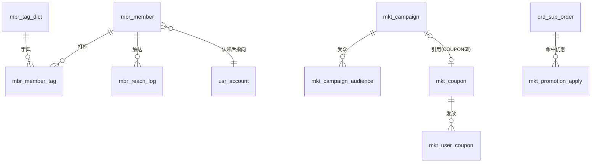

# TDD-会员与营销 · 数据库与 UI 设计

状态：**已被取代**（表结构部分）—— 2026-08-24 改走「新建表」路线，
库表以 [TDD-会员与营销-表结构与对象模型](./TDD-会员与营销-表结构与对象模型.md) 为准。
本文的 **§三 UI 设计仍然有效**。
关联：[会员体系与活动联动 · 需求](../../requirements/会员体系与活动联动-需求.md) ·
[活动体系 · 产品方案](../../requirements/活动体系-需求.md) ·
[TDD-会员体系](./TDD-会员体系.md) · [TDD-券与活动模型](./TDD-券与活动模型.md)
创建日期：2026-08-24

---

## 一、总览：三块数据，五张新表

```
会员域 mbr_*                          营销域 mkt_*（扩展为主）
├─ mbr_member         关系（主体级）  ├─ mkt_coupon            券模板（+12 列）
├─ mbr_member_store   门店往来        ├─ mkt_user_coupon       用户券（+5 列）
├─ mbr_member_source  来源明细        ├─ mkt_campaign          活动（+6 列）
├─ mbr_member_tag     标签关系        ├─ mkt_campaign_audience 活动受众（新）
├─ mbr_tag_dict       标签字典        └─ mkt_promotion_apply   一单用了哪些优惠（新）
└─ mbr_reach_log      触达
```

**为什么营销侧以扩展为主**：`mkt_coupon` 的五段模型今天已经有三段（权益/门槛/时间），
`discountFor()` 是唯一算优惠处；重建一张表要迁移已上线的算价链路，收益不抵风险
（见 [TDD-券与活动模型](./TDD-券与活动模型.md) §5）。

**唯一必须新增的营销表是 `mkt_promotion_apply`**：今天订单上只有 `discount_amount`
（以及按出资方拆的 platform/merchant 两列），**没有记是哪张券、哪个活动**。
没有它，活动效果、券的核销对账、「这个人因为哪场活动第一次下单」三件事都做不了。

---

## 二、DDL

### 2.1 `mbr_member` —— 一个人 × 一家主体

```sql
CREATE TABLE IF NOT EXISTS mbr_member
(
    id BIGINT(20) NOT NULL AUTO_INCREMENT,
    member_no VARCHAR(64) NOT NULL,
    entity_no VARCHAR(64) NOT NULL COMMENT '商家主体。会员属主体不属门店 —— 同一个人在总店买米、南门店买油是同一个人',
    user_no VARCHAR(64) DEFAULT NULL COMMENT '平台用户。线索会员为空，认领后回填',
    phone VARCHAR(32) DEFAULT NULL COMMENT '手工录入时的手机号。线索去重靠它；有 user_no 后仍保留，用于二次认领核对',
    status VARCHAR(16) NOT NULL DEFAULT 'ACTIVE' COMMENT 'LEAD 线索（不可触达/不进受众）/ ACTIVE / BLOCKED 被商家拉黑',
    source VARCHAR(16) NOT NULL COMMENT '首次来源 ORDER/SHARE/SCAN/MANUAL/FAVORITE/SEARCH。首次即定；每一次来源的明细在 mbr_member_source',
    first_store_no VARCHAR(64) DEFAULT NULL COMMENT '第一次在哪家门店发生关系。冗余自 mbr_member_source，为了列表不回表',
    first_order_at BIGINT(20) DEFAULT NULL,
    last_order_at BIGINT(20) DEFAULT NULL,
    order_count INT(11) NOT NULL DEFAULT 0,
    total_spent_minor BIGINT(20) NOT NULL DEFAULT 0,
    d90_order_count INT(11) NOT NULL DEFAULT 0 COMMENT '近 90 天单数，每日重算。分层与筛选都读它，不要每次现算',
    d90_spent_minor BIGINT(20) NOT NULL DEFAULT 0,
    level VARCHAR(16) DEFAULT NULL COMMENT 'NEW/REGULAR/LOYAL/SLEEPING，由系统按 sys_setting 的口径算，商家不可改',
    reach_opt_out TINYINT(4) NOT NULL DEFAULT 0 COMMENT '买家在店铺页关掉了这家店的消息。商家看得到「已关闭」，看不到原因',
    remark VARCHAR(255) DEFAULT NULL COMMENT '商家备注。手工录入时常用（「三单元张阿姨」）',
    claimed_at BIGINT(20) DEFAULT NULL COMMENT '线索被本人认领的时刻',
    joined_at BIGINT(20) NOT NULL COMMENT '关系建立时刻',
    tenant_no VARCHAR(32) NOT NULL DEFAULT 'MAIN',
    created_at DATETIME NOT NULL,
    created_by VARCHAR(64) DEFAULT NULL,
    updated_at DATETIME NOT NULL,
    updated_by VARCHAR(64) DEFAULT NULL,
    version BIGINT(20) NOT NULL DEFAULT 0,
    deleted TINYINT(4) NOT NULL DEFAULT 0,
    PRIMARY KEY (id),
    UNIQUE KEY uk_member_no (member_no),
    UNIQUE KEY uk_member_entity_user (tenant_no, entity_no, user_no),
    UNIQUE KEY uk_member_entity_phone (tenant_no, entity_no, phone),
    KEY idx_member_entity_last (entity_no, last_order_at),
    KEY idx_member_entity_level (entity_no, level)
) ENGINE=InnoDB DEFAULT CHARSET=utf8mb4 COLLATE=utf8mb4_uca1400_ai_ci COMMENT='会员：一个人与一家商家主体的关系';
```

> **两个唯一键都要**：正式会员按 `user_no` 去重，线索按 `phone` 去重。
> MySQL 的唯一键允许多行 NULL，所以两者并存不会互相挡住。
> 认领时把线索行的 `user_no` 补上；若该 `user_no` 已有一行（他自己下过单），
> 则**合并**：保留更早的 `joined_at` 与 `source`，标签与备注并入，另一行软删。

### 2.1b `mbr_member_store` —— 会员 × 门店的往来（回答「他是哪家店的客人」）

会员关系挂在**主体**上（标签跨门店共享、同一个人不该在三家店各算一次），
但**每家门店的往来必须分开记**：多店商家问的是「南门店有多少熟客」「文三店谁在沉睡」。
两者都要，所以是一主一从两张表，不是二选一。

```sql
CREATE TABLE IF NOT EXISTS mbr_member_store
(
    id BIGINT(20) NOT NULL AUTO_INCREMENT,
    member_no VARCHAR(64) NOT NULL,
    entity_no VARCHAR(64) NOT NULL COMMENT '冗余：按主体+门店筛时不回表',
    store_no VARCHAR(64) NOT NULL,
    first_order_at BIGINT(20) DEFAULT NULL,
    last_order_at BIGINT(20) DEFAULT NULL,
    order_count INT(11) NOT NULL DEFAULT 0,
    total_spent_minor BIGINT(20) NOT NULL DEFAULT 0,
    d90_order_count INT(11) NOT NULL DEFAULT 0,
    d90_spent_minor BIGINT(20) NOT NULL DEFAULT 0,
    level VARCHAR(16) DEFAULT NULL COMMENT '这家店自己的分层。只有主体开了「按门店经营会员」时才展示（见 §2.1d）',
    is_first_store TINYINT(4) NOT NULL DEFAULT 0 COMMENT '他是从这家店进来的（来源门店）',
    tenant_no VARCHAR(32) NOT NULL DEFAULT 'MAIN',
    created_at DATETIME NOT NULL,
    created_by VARCHAR(64) DEFAULT NULL,
    updated_at DATETIME NOT NULL,
    updated_by VARCHAR(64) DEFAULT NULL,
    version BIGINT(20) NOT NULL DEFAULT 0,
    deleted TINYINT(4) NOT NULL DEFAULT 0,
    PRIMARY KEY (id),
    UNIQUE KEY uk_member_store (tenant_no, member_no, store_no),
    KEY idx_member_store_last (entity_no, store_no, last_order_at)
) ENGINE=InnoDB DEFAULT CHARSET=utf8mb4 COLLATE=utf8mb4_uca1400_ai_ci COMMENT='会员在某家门店的往来。主体级的总数在 mbr_member';
```

**两级分层都算、按开关展示**（见 §2.1d）：`mbr_member.level` 是主体级，
`mbr_member_store.level` 是门店级，两份都由每日任务算好落库。
展示哪一份由主体的「会员经营口径」决定 —— 底层不因这个开关而变，
所以商家随时可以切换，不需要迁移任何数据。

### 2.1d 会员经营口径：按主体，还是按门店

**同一个模型要装下两种真实情况。**

| 情况 | 例子 | 商家要的 |
|---|---|---|
| **按主体**（默认，多数） | 一条街上的两家小店、总店 + 分店 | 会员是"这个商家的会员"，在哪家买都算数；一份名单、一套标签 |
| **按门店** | 城东城西各一家、相隔十公里 | **另一家店的会员对这家没用** —— 他不会跑十公里来买菜。名单、分层、活动都要按店各算各的 |

所以在主体上开一个开关，而不是二选一地写死模型：

```sql
ALTER TABLE mch_entity
    ADD COLUMN member_scope VARCHAR(16) NOT NULL DEFAULT 'ENTITY' COMMENT '会员经营口径：ENTITY 按主体（默认）/ STORE 按门店。只影响展示与分层口径，不影响底层存储';
```

**开关影响什么、不影响什么**（这是它能随时切的原因）：

| | ENTITY（默认） | STORE |
|---|---|---|
| 存储 | `mbr_member` + `mbr_member_store` 两张表都写 | **完全相同** |
| 会员列表默认视角 | 全部门店合并 | 默认当前门店，门店选择器**不可为空** |
| 顶部四层数字 | 按主体累计 | 按所选门店 |
| 分层用哪一份 | `mbr_member.level` | `mbr_member_store.level` |
| 「新客」的含义 | 对这个商家第一次买 | **对这家店第一次买**（在别的店买过也算新客 —— 这正是十公里外那家店要的） |
| 标签 | 主体级共享 | **仍是主体级共享** |
| 触达频次闸 | 按 (主体, 人) | **仍按 (主体, 人)** |
| 活动受众 | 主体全部会员 | 自动限定在活动所属门店的会员 |

两条**刻意不跟着开关变**的：

1. **标签仍属主体**。「爱囤货」是这个人的属性，不因他在哪家店买而不同；
   按门店各存一份的话，多店商家要重打一遍，而两份很快就不一致（8-24 已拍板，这里不改）。
   门店维度体现在**筛选**上：「南门店的会员里，打了爱囤货的」。
2. **频次闸仍按人**。若按门店算，三家店就是三倍轰炸 —— 而挨骂的是平台的通知权限，
   不是某一家店。界面上要直说：「他 5 天前收到过总店的消息，本次跳过」。

### 2.1c `mbr_member_source` —— 每一次来源都留痕

```sql
CREATE TABLE IF NOT EXISTS mbr_member_source
(
    id BIGINT(20) NOT NULL AUTO_INCREMENT,
    source_no VARCHAR(64) NOT NULL,
    member_no VARCHAR(64) NOT NULL,
    entity_no VARCHAR(64) NOT NULL,
    source_type VARCHAR(16) NOT NULL COMMENT 'ORDER/SHARE/SCAN/MANUAL/FAVORITE/SEARCH',
    store_no VARCHAR(64) DEFAULT NULL COMMENT '从哪家门店进来的',
    link_no VARCHAR(64) DEFAULT NULL COMMENT '哪一条分享链接/店铺码（可回查落地页与投放位）',
    inviter_user_no VARCHAR(64) DEFAULT NULL COMMENT '谁发的这条链接。分享激励结算读它',
    inviter_role VARCHAR(16) DEFAULT NULL COMMENT 'MERCHANT 商家自己发的 / STAFF 员工 / CUSTOMER 老客转发',
    operator_no VARCHAR(64) DEFAULT NULL COMMENT 'MANUAL 时哪个员工录的。录错了要找得到人',
    campaign_no VARCHAR(64) DEFAULT NULL COMMENT '因为哪场活动进来的',
    is_first TINYINT(4) NOT NULL DEFAULT 0 COMMENT '这条是不是首次来源',
    occurred_at BIGINT(20) NOT NULL,
    tenant_no VARCHAR(32) NOT NULL DEFAULT 'MAIN',
    created_at DATETIME NOT NULL,
    created_by VARCHAR(64) DEFAULT NULL,
    updated_at DATETIME NOT NULL,
    updated_by VARCHAR(64) DEFAULT NULL,
    version BIGINT(20) NOT NULL DEFAULT 0,
    deleted TINYINT(4) NOT NULL DEFAULT 0,
    PRIMARY KEY (id),
    UNIQUE KEY uk_member_source_no (source_no),
    KEY idx_source_member (member_no, occurred_at),
    KEY idx_source_inviter (entity_no, inviter_user_no, occurred_at),
    KEY idx_source_campaign (campaign_no)
) ENGINE=InnoDB DEFAULT CHARSET=utf8mb4 COLLATE=utf8mb4_uca1400_ai_ci COMMENT='会员来源明细：哪家店、哪条链接、谁发的、谁录的、因哪场活动';
```

> **为什么不塞 JSON**：「李姐帮我拉来多少人」「上个月的店铺码带来几个会员」
> 「小王录的那批人有几个真的来消费了」—— 这三个问题都是按列聚合，
> JSON 里只能全表扫。而第一个问题正是分享激励要结算的那个数。

### 2.2 `mbr_member_tag` —— 关系存 `tag_no`，不存文本

```sql
CREATE TABLE IF NOT EXISTS mbr_member_tag
(
    id BIGINT(20) NOT NULL AUTO_INCREMENT,
    entity_no VARCHAR(64) NOT NULL COMMENT '冗余主体号：按标签筛人时不必回表',
    member_no VARCHAR(64) NOT NULL,
    tag_no VARCHAR(64) NOT NULL COMMENT '指向 mbr_tag_dict。**不存标签文本** —— 改名要改成千上万行，且历史统计会断',
    tag_type VARCHAR(8) NOT NULL COMMENT 'SYS 系统算的（只读）/ MCH 商家打的',
    tagged_by VARCHAR(64) DEFAULT NULL COMMENT '谁打的。SYS 为空',
    tagged_at BIGINT(20) NOT NULL,
    tenant_no VARCHAR(32) NOT NULL DEFAULT 'MAIN',
    created_at DATETIME NOT NULL,
    created_by VARCHAR(64) DEFAULT NULL,
    updated_at DATETIME NOT NULL,
    updated_by VARCHAR(64) DEFAULT NULL,
    version BIGINT(20) NOT NULL DEFAULT 0,
    deleted TINYINT(4) NOT NULL DEFAULT 0,
    PRIMARY KEY (id),
    UNIQUE KEY uk_member_tag (tenant_no, member_no, tag_no),
    KEY idx_tag_entity_tag (entity_no, tag_no)
) ENGINE=InnoDB DEFAULT CHARSET=utf8mb4 COLLATE=utf8mb4_uca1400_ai_ci COMMENT='会员标签关系：只存标签号，文本在字典里';
```

### 2.3 `mbr_tag_dict` —— 标签字典（改名、停用、合并都在这里）

```sql
CREATE TABLE IF NOT EXISTS mbr_tag_dict
(
    id BIGINT(20) NOT NULL AUTO_INCREMENT,
    tag_no VARCHAR(64) NOT NULL COMMENT '不可变。改名改的是 name，关系行一行都不用动',
    entity_no VARCHAR(64) NOT NULL COMMENT '属主体：跨门店共享（2026-08-24 拍板）',
    name VARCHAR(32) NOT NULL,
    tag_type VARCHAR(8) NOT NULL DEFAULT 'MCH' COMMENT 'SYS 系统标签也进字典，便于统一展示与统计',
    status VARCHAR(16) NOT NULL DEFAULT 'ACTIVE' COMMENT 'ACTIVE / DISABLED 停用（老的还在、新的打不了）/ MERGED 已并入别的标签',
    merged_into VARCHAR(64) DEFAULT NULL COMMENT 'MERGED 时指向目标 tag_no。留着不删 —— 活动受众与筛选快照可能还引用它',
    usage_count INT(11) NOT NULL DEFAULT 0 COMMENT '打了多少人。改名/停用/合并前要让商家看见影响面',
    tenant_no VARCHAR(32) NOT NULL DEFAULT 'MAIN',
    created_at DATETIME NOT NULL,
    created_by VARCHAR(64) DEFAULT NULL,
    updated_at DATETIME NOT NULL,
    updated_by VARCHAR(64) DEFAULT NULL,
    version BIGINT(20) NOT NULL DEFAULT 0,
    deleted TINYINT(4) NOT NULL DEFAULT 0,
    PRIMARY KEY (id),
    UNIQUE KEY uk_tag_no (tag_no),
    UNIQUE KEY uk_tag_name (tenant_no, entity_no, name),
    KEY idx_tag_dict_entity (entity_no, status)
) ENGINE=InnoDB DEFAULT CHARSET=utf8mb4 COLLATE=utf8mb4_uca1400_ai_ci COMMENT='标签字典：tag_no 不可变，name 可改';
```

#### 2.3.1 改名 / 停用 / 合并 / 删除，四件事四种处理

| 动作 | 做什么 | 为什么 |
|---|---|---|
| **改名** | 只改 `mbr_tag_dict.name` | 关系行存的是 `tag_no`，一行都不用动；历史统计不断（同一个标签换了个叫法，还是同一个标签） |
| **停用** | `status=DISABLED` | 新的打不上去，已经打的照常显示与可筛 —— 直接删会让商家的历史筛选条件突然少一半人 |
| **合并** | 见下 | 「爱囤货」与「囤货党」是同一批人，商家迟早会想合 |
| **删除** | **不提供物理删** | 引用它的活动受众、筛选快照、发券记录都会变成悬空 |

**合并的执行顺序**（一个事务，幂等）：

1. 把源标签的关系行改指目标：`UPDATE mbr_member_tag SET tag_no = 目标 WHERE tag_no = 源`；
   与目标已有的行冲突时（这个人两个标签都有）删掉重复的那一行 —— 唯一键 `uk_member_tag` 会挡住。
2. 源标签 `status=MERGED`、`merged_into=目标`，**保留**。
3. 改写所有引用：`mkt_campaign_audience` 中 `audience_type=TAG` 且值为源的行改成目标；
   会员筛选的保存条件同理。
4. 重算两个标签的 `usage_count`。
5. 落一条 `mbr_tag_merge_log`（谁在什么时候把谁并进了谁、影响多少人）——
   合并是不可逆的批量操作，没有日志就没法回答「上周那批人的标签为什么变了」。

```sql
CREATE TABLE IF NOT EXISTS mbr_tag_merge_log
(
    id BIGINT(20) NOT NULL AUTO_INCREMENT,
    entity_no VARCHAR(64) NOT NULL,
    from_tag_no VARCHAR(64) NOT NULL,
    to_tag_no VARCHAR(64) NOT NULL,
    affected_count INT(11) NOT NULL DEFAULT 0,
    operator_no VARCHAR(64) DEFAULT NULL,
    merged_at BIGINT(20) NOT NULL,
    tenant_no VARCHAR(32) NOT NULL DEFAULT 'MAIN',
    created_at DATETIME NOT NULL,
    created_by VARCHAR(64) DEFAULT NULL,
    updated_at DATETIME NOT NULL,
    updated_by VARCHAR(64) DEFAULT NULL,
    version BIGINT(20) NOT NULL DEFAULT 0,
    deleted TINYINT(4) NOT NULL DEFAULT 0,
    PRIMARY KEY (id),
    KEY idx_tag_merge_entity (entity_no, merged_at)
) ENGINE=InnoDB DEFAULT CHARSET=utf8mb4 COLLATE=utf8mb4_uca1400_ai_ci COMMENT='标签合并留痕：合并不可逆，要能回答「这批人的标签为什么变了」';
```

**系统标签不参与改名与合并**：它的名字就是口径（「沉睡」= 60 天没来），
改名会让两个商家对同一个词的理解不同。

### 2.4 `mbr_reach_log` —— 触达记录（频次闸与效果都靠它）

```sql
CREATE TABLE IF NOT EXISTS mbr_reach_log
(
    id BIGINT(20) NOT NULL AUTO_INCREMENT,
    reach_no VARCHAR(64) NOT NULL,
    entity_no VARCHAR(64) NOT NULL,
    member_no VARCHAR(64) NOT NULL,
    task_no VARCHAR(64) DEFAULT NULL COMMENT '一次群发的批次号，对应 notify_push_task',
    channel VARCHAR(16) NOT NULL DEFAULT 'PUSH',
    scene VARCHAR(24) NOT NULL COMMENT 'NOTICE 公告 / WAKEUP 沉睡唤回 / COUPON 发券通知。频次闸按场景分档',
    sent_at BIGINT(20) NOT NULL,
    opened_at BIGINT(20) DEFAULT NULL,
    ordered_at BIGINT(20) DEFAULT NULL COMMENT '收到后 7 天内是否下单。效果只认这个数',
    tenant_no VARCHAR(32) NOT NULL DEFAULT 'MAIN',
    created_at DATETIME NOT NULL,
    created_by VARCHAR(64) DEFAULT NULL,
    updated_at DATETIME NOT NULL,
    updated_by VARCHAR(64) DEFAULT NULL,
    version BIGINT(20) NOT NULL DEFAULT 0,
    deleted TINYINT(4) NOT NULL DEFAULT 0,
    PRIMARY KEY (id),
    UNIQUE KEY uk_reach_no (reach_no),
    KEY idx_reach_gate (entity_no, member_no, scene, sent_at)
) ENGINE=InnoDB DEFAULT CHARSET=utf8mb4 COLLATE=utf8mb4_uca1400_ai_ci COMMENT='触达记录：频次闸查它，效果也算它';
```

> `idx_reach_gate` 就是频次闸的查询形状：「这家店给这个人这个场景，最近一次是什么时候」。

### 2.5 `mkt_coupon` 扩展（券的五段）

```sql
ALTER TABLE mkt_coupon
    ADD COLUMN benefit_mode VARCHAR(16) DEFAULT NULL COMMENT 'CASH 现金 / PERCENT 折扣 / GIFT 兑换 / FREE_SHIP 免运费。空 = 按 type 推导，语义与今天一致',
    ADD COLUMN benefit_ref VARCHAR(64) DEFAULT NULL COMMENT 'GIFT 时兑换哪件商品',
    ADD COLUMN min_qty INT(11) DEFAULT NULL COMMENT '件数门槛。空 = 不限',
    ADD COLUMN scope_type VARCHAR(16) DEFAULT NULL COMMENT 'ALL / STORE / CATEGORY / GOODS。空或 ALL = 全店，与今天一致',
    ADD COLUMN scope_refs TEXT DEFAULT NULL COMMENT 'JSON 数组：门店号 / 类目号 / 商品号',
    ADD COLUMN validity_mode VARCHAR(16) DEFAULT NULL COMMENT 'ABSOLUTE 绝对起止（默认）/ RELATIVE 领取后 N 天',
    ADD COLUMN valid_days INT(11) DEFAULT NULL COMMENT 'RELATIVE 时的天数',
    ADD COLUMN issue_mode VARCHAR(16) DEFAULT NULL COMMENT 'CENTER 领券中心 / TARGETED 定向 / CAMPAIGN 活动发 / CODE 发码。空 = CENTER',
    ADD COLUMN redeem_mode VARCHAR(16) DEFAULT NULL COMMENT 'ORDER 下单抵扣（默认）/ STORE_CODE 到店出示核销 / AUTO 自动生效。STORE_CODE 不参与下单算价',
    ADD COLUMN times_total INT(11) DEFAULT NULL COMMENT '一张券能用几次。空或 1 = 一次性；N = 次卡（豆浆 5 杯）。次卡只多这一列，不新建表';
```

> `scope_desc` 保留但降级为**展示文案**：规则以 `scope_type/scope_refs` 为准。
> 两者不一致的券在运营端要标出来 —— 今天写「仅限粮油」的券买猫粮照样能用。

### 2.6 `mkt_user_coupon` 扩展（到店核销与相对有效期）

```sql
ALTER TABLE mkt_user_coupon
    ADD COLUMN expire_at BIGINT(20) DEFAULT NULL COMMENT '这一张的失效时刻。RELATIVE 券领取时算出来落库 —— 不能每次读时现算，券模板改了会把已领的券一起改掉',
    ADD COLUMN redeem_code VARCHAR(32) DEFAULT NULL COMMENT '到店核销码。只有 STORE_CODE 券有',
    ADD COLUMN verified_by VARCHAR(64) DEFAULT NULL COMMENT '哪个店员核销的',
    ADD COLUMN verified_store_no VARCHAR(64) DEFAULT NULL COMMENT '在哪家门店核销的',
    ADD COLUMN times_used INT(11) NOT NULL DEFAULT 0 COMMENT '次卡已核销几次。用满才转 USED';
```

### 2.7 `mkt_campaign` 扩展（目的 / 排期 / 限量 / 引用券）

```sql
ALTER TABLE mkt_campaign
    ADD COLUMN goal VARCHAR(16) DEFAULT NULL COMMENT 'ACQUIRE 拉新 / WAKEUP 唤回 / CLEAR 清库存 / BASKET 提客单。只是入口与默认值，落库仍是四类 type',
    ADD COLUMN schedule_type VARCHAR(16) DEFAULT NULL COMMENT 'ONE_OFF 短期（默认，=今天）/ ALWAYS_ON 长期 / RECURRING 周期',
    ADD COLUMN schedule_rule VARCHAR(128) DEFAULT NULL COMMENT 'RECURRING 时：JSON {weekdays:[3],dayOfMonth:null,from:"08:00",to:"20:00"}',
    ADD COLUMN quota INT(11) DEFAULT NULL COMMENT '限量（件）。FLASH/BUY_GIFT 必填 —— 没有结束时间又没有上限等于永久敞口',
    ADD COLUMN quota_used INT(11) NOT NULL DEFAULT 0,
    ADD COLUMN coupon_no VARCHAR(64) DEFAULT NULL COMMENT 'COUPON 型活动引用的券。存量 CU@ 桥接券保持原样，新建走引用';
```

### 2.8 `mkt_campaign_audience` —— 活动受众（新）

```sql
CREATE TABLE IF NOT EXISTS mkt_campaign_audience
(
    id BIGINT(20) NOT NULL AUTO_INCREMENT,
    campaign_no VARCHAR(64) NOT NULL,
    entity_no VARCHAR(64) NOT NULL,
    audience_type VARCHAR(16) NOT NULL COMMENT 'TAG 标签 / LEVEL 会员层 / SOURCE 来源 / NON_MEMBER 非本店会员',
    audience_value VARCHAR(64) NOT NULL,
    tenant_no VARCHAR(32) NOT NULL DEFAULT 'MAIN',
    created_at DATETIME NOT NULL,
    created_by VARCHAR(64) DEFAULT NULL,
    updated_at DATETIME NOT NULL,
    updated_by VARCHAR(64) DEFAULT NULL,
    version BIGINT(20) NOT NULL DEFAULT 0,
    deleted TINYINT(4) NOT NULL DEFAULT 0,
    PRIMARY KEY (id),
    UNIQUE KEY uk_campaign_audience (tenant_no, campaign_no, audience_type, audience_value),
    KEY idx_audience_campaign (campaign_no)
) ENGINE=InnoDB DEFAULT CHARSET=utf8mb4 COLLATE=utf8mb4_uca1400_ai_ci COMMENT='活动受众：没有任何一行 = 对所有人生效（与今天一致）';
```

> **一个活动的多行之间是「或」**：勾了「熟客」和「沉睡」就是这两类人都能享。
> 需要「且」的场景（熟客且爱囤货）留到有真实需求再说 —— 现在做出来没人用得对。

### 2.9 `mkt_promotion_apply` —— 一单用了哪些优惠（新，效果与对账的地基）

```sql
CREATE TABLE IF NOT EXISTS mkt_promotion_apply
(
    id BIGINT(20) NOT NULL AUTO_INCREMENT,
    apply_no VARCHAR(64) NOT NULL,
    order_no VARCHAR(64) NOT NULL,
    sub_order_no VARCHAR(64) DEFAULT NULL COMMENT '按商家拆的那一单。跨商家的平台券会有多行',
    entity_no VARCHAR(64) DEFAULT NULL,
    user_no VARCHAR(64) NOT NULL,
    promo_type VARCHAR(16) NOT NULL COMMENT 'CAMPAIGN 活动 / COUPON 券 / POINTS 积分',
    promo_no VARCHAR(64) NOT NULL COMMENT '活动号 / 券号 / 积分流水号',
    amount_minor BIGINT(20) NOT NULL DEFAULT 0 COMMENT '这一项减了多少',
    funder VARCHAR(16) NOT NULL DEFAULT 'MERCHANT' COMMENT 'PLATFORM / MERCHANT。与结算拆分同一口径',
    applied_at BIGINT(20) NOT NULL,
    reverted_at BIGINT(20) DEFAULT NULL COMMENT '订单取消/退款时置。效果统计要排除它',
    tenant_no VARCHAR(32) NOT NULL DEFAULT 'MAIN',
    created_at DATETIME NOT NULL,
    created_by VARCHAR(64) DEFAULT NULL,
    updated_at DATETIME NOT NULL,
    updated_by VARCHAR(64) DEFAULT NULL,
    version BIGINT(20) NOT NULL DEFAULT 0,
    deleted TINYINT(4) NOT NULL DEFAULT 0,
    PRIMARY KEY (id),
    UNIQUE KEY uk_promotion_apply (apply_no),
    KEY idx_promo_apply_order (order_no),
    KEY idx_promo_apply_promo (promo_type, promo_no, applied_at)
) ENGINE=InnoDB DEFAULT CHARSET=utf8mb4 COLLATE=utf8mb4_uca1400_ai_ci COMMENT='一单命中了哪些优惠：活动效果、券对账、会员来源归因都读它';
```

> **写入方是 trade（下单算价成功后），但表属 marketing**：跨域走 Port
> （`PromotionApplyPort.record(...)`），与今天 `CampaignPort` / `CouponPort` 同一个形状。
> 同事务写 —— 异步会让「减了钱但没记录」在对账时无解。

### 2.10 关系图



---

## 三、UI 设计

### 3.1 B 端 · 会员（替换现「我的客户」页，路由保留）

```
┌─ 会员 ────────────────────────────┐
│  ┌─────┬─────┬─────┬─────┐        │   顶部四格是数字即入口
│  │ 新客│ 常客│ 熟客│ 沉睡│        │   点一下 = 按该层筛选
│  │  38 │  62 │  17 │  24 │        │   沉睡用警示色（唯一能立刻行动的信号）
│  └─────┴─────┴─────┴─────┘        │
│  本月新增 12 · 可触达 118          │
│                                    │
│  门店 [全部 ▾]              [⚙]    │   ← 多店才出现。按主体经营时可选「全部」；
│                                    │      按门店经营时必须选一家，默认当前门店
│                                    │      ⚙ 里切换「会员按主体 / 按门店经营」
│  [🔍 手机号完整匹配        ] [筛选]│   ← 只认完整号码，输一半不给结果
│  标签: (爱囤货) (只要土鸡蛋) (+)   │   ← 点标签即筛选，可多选（或）
│                                    │
│  ┌────────────────────────────┐    │
│  │ 张阿姨  ···1234    〔沉睡〕│    │   来源徽标：分享/扫码/录入/自然
│  │ 近90天 0 单 · 累计 23 单   │    │   手机号只出后四位
│  │ 上次 68 天前 · 来自 分享   │    │
│  │ (爱囤货)(不要辣)           │    │
│  └────────────────────────────┘    │
│  … 列表按「最近下单」倒序，沉睡置顶 │
│                                    │
│  [ 批量打标 ] [ 发券 ] [ 发消息 ]  │   ← 选中若干人后出现的操作条
└────────────────────────────────────┘
```

**交互规则**

- 筛选面板：来源 / 层级 / 标签 / 末单区间 / 累计消费区间。筛完顶部显示「命中 37 人」，
  三个动作都作用在这 37 人上。
- **发消息**受频次闸：不满足时按钮置灰并直说「其中 12 人 7 天内已收到过，本次只发 25 人」——
  不要静默少发。
- 线索会员整行淡色 + 「线索」标，**不出现在发消息/发券的可选范围**里，点进去只有备注和标签。

### 3.2 B 端 · 会员详情

```
┌─ 张阿姨 ─────────────────────────┐
│ ···1234   来自 分享（李姐）       │   来源写清「谁发的链接」
│ 加入 2026-03-12 · 首单 03-12      │
│ 首次进店：南门店                  │   ← 从哪家门店进来的
│ ┌ 各店往来 ─────────────────┐    │
│ │ 南门店  18 单 / ¥1,420     │    │   ← mbr_member_store，多店才显示
│ │ 总店     5 单 / ¥422       │    │
│ └────────────────────────────┘    │
│ 来源轨迹                          │   ← mbr_member_source，按时间倒序
│  03-12 分享 · 李姐转发 · 南门店   │
│  05-02 扫码 · 总店门口码          │
│ 近90天 0 单 / ¥0 · 累计 23 单/¥1,842│
│ 标签 (爱囤货)(不要辣) [＋ 打标]    │   系统标签是灰的、不可删
│ 备注 三单元，晚上来               │
│ ─────────────────────────────    │
│ 最近的单                          │
│  08-02  ¥68   自提                │
│  07-19  ¥120  自送                │
│ ─────────────────────────────    │
│ [ 发一张券 ]   [ 发条消息 ]       │
└───────────────────────────────────┘
```

### 3.3 B 端 · 手工录入（批次二）

```
┌─ 添加会员 ───────────────────────┐
│ 手机号 [            ] 必填        │
│ 备注   [            ]             │
│ 标签   (爱囤货)(+)                │
│                                   │
│ ⓘ 他还不是平台用户时，这条记为    │   ← 合规提示必须在保存前出现
│   「线索」：不会收到任何消息，     │
│   等他自己注册后自动认领。        │
│                        [ 保存 ]   │
└───────────────────────────────────┘
```

### 3.3b B 端 · 标签管理（改名 / 停用 / 合并）

```
┌─ 标签 ───────────────────────────┐
│ 系统标签（不可改）                │
│  新客 38 · 常客 62 · 熟客 17      │
│  沉睡 24 · 高客单 9               │
│ ─────────────────────────────    │
│ 我的标签                    [新建]│
│  爱囤货      41 人   [改名][合并] │
│  囤货党      12 人   [改名][合并] │
│  不要辣       7 人   [停用]       │
└───────────────────────────────────┘

合并对话框
┌───────────────────────────────────┐
│ 把「囤货党」并入 [爱囤货 ▾]        │
│ 12 人会改成「爱囤货」，其中 5 人   │   ← 必须先算出影响面再让他按
│ 两个标签都有，合并后只保留一个。   │
│ ⓘ 合并不可撤销；引用了「囤货党」的 │
│   1 个活动会自动改为「爱囤货」。   │   ← 引用方一起改写，别留悬空
│              [取消]  [确认合并]   │
└───────────────────────────────────┘
```

### 3.4 B 端 · 新建活动（目的引导，四步）

```
第 1 步 目的            第 2 步 参数              第 3 步 给谁            第 4 步 预览
┌──────────────┐      ┌──────────────┐        ┌──────────────┐      ┌──────────────┐
│ ○ 拉新客     │      │ 满 [50] 减[5]│        │ ● 所有人     │      │ 每周三 8-20  │
│ ○ 唤回老客   │  →   │ 商品 全部    │   →    │ ○ 沉睡会员24 │  →   │ 满50减5      │
│ ● 清库存     │      │ 限量 [100]件 │        │ ○ 熟客 17    │      │ 限量100件    │
│ ○ 提客单     │      │ 排期:        │        │ ○ 标签…      │      │ 覆盖 24 人   │
└──────────────┘      │ ○短期 ●长期  │        └──────────────┘      │ [ 发布 ]     │
                      │ ○每周三      │                              └──────────────┘
                      └──────────────┘
```

**规则**

- 目的只预填参数，落库仍是四类 `type`。
- **限量对 FLASH/BUY_GIFT 必填**，长期活动更必须（没有结束时间又没上限 = 永久敞口）。
- 第 3 步默认「所有人」；选了会员条件时预览页要显示**覆盖人数**，0 人时拦下来。
- 冲突提示：所选商品已在别的活动里时，这一步直说「同类取最优，实际生效的可能是那个」。

### 3.5 B 端 · 活动列表与效果

```
┌─ 营销 ──────────────────────────┐
│ [进行中] [长期] [周期] [已结束]  │   ← 长期/周期单独分组，否则被"快到期"排序埋掉
│ ┌──────────────────────────┐    │
│ │ 周三特价 · 每周三 8-20    │    │
│ │ 限量 100 · 已用 63        │    │   限量进度是这一行最要紧的数
│ │ 带来 41 单 / ¥2,180       │    │   ← 效果直接长在列表上，不用点进去
│ │ 新客 12 · 唤回 5          │    │
│ │            [暂停] [再来一次]│   │
│ └──────────────────────────┘    │
└──────────────────────────────────┘
```

### 3.6 B 端 · 券（新建券的五段式表单）

```
┌─ 新建券 ─────────────────────────┐
│ 名称   [满50减5]                  │
│ 权益   ● 现金 [5] 元              │   四选一：现金/折扣/兑换/免运费
│        ○ 折扣 [8.5]折 封顶[10]元  │   折扣必须填封顶（预算前置的结论）
│        ○ 兑换 [选商品]            │
│ 门槛   满 [50] 元 · 满 [ ] 件     │
│ 范围   ● 全店 ○ 指定门店          │   ← 范围是规则，不再只是一句文案
│        ○ 指定类目 ○ 指定商品      │
│ 有效期 ○ 固定 [8/24]–[8/31]       │
│        ● 领取后 [7] 天            │   ← 唤回券的标准形态
│ 发放   ● 领券中心 ○ 定向 ○ 活动发 │
│ 核销   ● 下单抵扣 ○ 到店出示      │   ← 到店券不参与下单算价
│ 数量   [200] 张 · 每人 [1] 张     │
│ 预算   ¥1,000（自动算：200×5）    │   ← 敞口在保存这一刻就是确定的
└───────────────────────────────────┘
```

### 3.7 C 端 · 店铺页会员卡 + 加入

```
┌─ 张记粮油 ───────────────────────┐
│ 公告：今天到了新米…  今天 07:20更新│
│ ┌──────────────────────────┐    │
│ │ 常客 · 近90天 4 单        │    │   没加入时这里是 [ 加入会员 ]
│ │ 你的券 2 张  >            │    │
│ │ 接收这家店的消息  [开/关] │    │   ← 退订入口必须在这里，不藏在设置里
│ └──────────────────────────┘    │
└───────────────────────────────────┘
```

### 3.8 C 端 · 券包（到店券要能出示）

```
┌─ 我的券 ─────────────────────────┐
│ [可用 3] [已用] [过期]            │
│ ┌──────────────────────────┐    │
│ │ ¥5   满50减5   张记粮油    │    │
│ │ 7天后过期 · 全店可用       │    │
│ │                  [去使用] │    │
│ ├──────────────────────────┤    │
│ │ 🎁  兑换一份土鸡蛋         │    │
│ │ 到店出示 · 南门店          │    │
│ │        [ 出示核销码 ] ▣    │    │   ← 点开是大号码 + 二维码
│ └──────────────────────────┘    │
└───────────────────────────────────┘
```

### 3.9 B 端 · 到店核销（复用现有核销页，加一个 tab）

```
┌─ 核销 ───────────────────────────┐
│ [取货核销] [券核销]               │   ← 两个「核销」在一处，但分 tab
│ 扫码 或 输入 8 位券码 [        ]  │
│ ┌──────────────────────────┐    │
│ │ 兑换一份土鸡蛋            │    │
│ │ 张阿姨 ···1234            │    │
│ │ 南门店 · 有效期至 08-31   │    │
│ │        [ 确认核销 ]       │    │   ← 确认后不可撤销，按钮上写明
│ └──────────────────────────┘    │
└───────────────────────────────────┘
```

### 3.10 运营端

| 页面 | 内容 |
|---|---|
| 会员口径 | 分层门槛、沉睡天数（默认 60）、标签上限 —— 全部读 `sys_setting` |
| 触达闸 | 每场景的窗口与条数；全平台触达量与退订率排行（哪家店发得最凶） |
| 券审计 | `scope_desc` 与 `scope_type/refs` **不一致**的券；无封顶的存量折扣券；长期活动缺限量的 |

### 3.11 C 端 · 加入会员与手机号授权

会员必须有已验证手机号，所以「加入会员」这个动作会分岔：

```
未登录/未绑号                        已绑号
┌──────────────────────┐           ┌──────────────────────┐
│ 张记粮油              │           │ 张记粮油              │
│ ┌──────────────────┐ │           │ ┌──────────────────┐ │
│ │ 加入会员          │ │  ──►      │ │ 常客 · 近90天4单  │ │
│ │ 成为会员看得到专属价│ │           │ │ 你的券 2 张   >   │ │
│ └──────────────────┘ │           │ │ 接收消息   [开]   │ │
└──────────────────────┘           │ └──────────────────┘ │
        │ 点击                      └──────────────────────┘
        ▼
┌──────────────────────────────┐
│  使用手机号加入                │   小程序里是一次点击（getPhoneNumber）
│  会员权益与券需要手机号识别你   │   App 走验证码
│                               │
│   [ 微信手机号一键授权 ]       │
│   [ 用验证码 ]  [ 以后再说 ]   │   ← 「以后再说」照常能逛能下单
└──────────────────────────────┘
```

**拒绝之后**：卡片恢复成「加入会员」，不再自动弹（同一店 7 天内不重复弹）。
下单流程**一次都不弹** —— 交易页面上任何一个额外弹层都是流失。

### 3.12 B 端 · 会员页顶部的「未计入」提示

```
┌─ 会员 ────────────────────────────┐
│ ┌─────┬─────┬─────┬─────┐        │
│ │ 新客│ 常客│ 熟客│ 沉睡│        │
│ │  38 │  62 │  17 │  24 │        │
│ └─────┴─────┴─────┴─────┘        │
│ 本月新增 12 · 可触达 118          │
│ ⓘ 另有 3 位买家未绑手机号，未计入  │   ← 把差额说出来。点开看这 3 单
└────────────────────────────────────┘
```

商家一定会拿订单数与会员数对，对不上时他会认为数据丢了。**先说，比等他问强。**

### 3.13 B 端 · 人群（筛完存下来，反复用）

```
筛选结果                            人群列表
┌──────────────────────────┐      ┌──────────────────────────┐
│ 命中 37 人                │      │ 南门店沉睡老客   37 人    │
│ 沉睡 · 南门店 · 爱囤货    │      │  上次算 08-24 21:10       │
│ [存为人群] [发券] [发消息] │      │  [发券] [用于活动] [编辑] │
└──────────────────────────┘      │ 高客单熟客       9 人     │
                                   └──────────────────────────┘
```

**人群存的是条件不是名单**：列表里的人数标着「上次算于 X 时」，
发券与发消息前会**当场重算** —— 名单每天都在变，按两周前的快照发券是错的。

### 3.14 B 端 · 发券/发消息的结果页（不静默少发）

```
┌─ 发放结果 ───────────────────────┐
│ 满50减5 · 南门店沉睡老客          │
│                                   │
│ 已发出        25 人               │
│ 跳过          12 人   [查看]      │
│   ├ 7 天内已收到过消息   9 人     │   ← 逐条说明为什么跳过
│   ├ 线索会员（未绑手机号） 2 人   │
│   └ 已关闭本店消息       1 人     │
│                                   │
│ 本次最大敞口 ¥125                 │
└───────────────────────────────────┘
```

### 3.15 C 端 · 次卡与到店核销

```
券包里的次卡                        点开出示
┌──────────────────────────┐      ┌──────────────────────────┐
│ 🥛 豆浆次卡               │      │      8 4 2 1 5 9 3 7      │
│ 还剩 3 次 / 共 5 次       │  ──► │      ▣▣▣ 二维码 ▣▣▣       │
│ 南门店 · 有效期至 09-30   │      │  豆浆次卡 · 还剩 3 次      │
│        [ 出示核销码 ]     │      │  出示给店员，核销后自动扣一次│
└──────────────────────────┘      └──────────────────────────┘
```

**核销后**：C 端这张卡当场变成「还剩 2 次」，B 端核销页显示「已核销，剩余 2 次」。
用完最后一次才转「已用完」。

### 3.16 B 端 · 券列表

```
┌─ 券 ─────────────────────────────┐
│ [在发] [已停] [已结束]     [新建] │
│ ┌──────────────────────────┐    │
│ │ 满50减5      现金 ¥5      │    │
│ │ 领 128/200 · 用 76        │    │   领取与核销两个数分开
│ │ 全店 · 领取后 7 天        │    │
│ │              [停发] [发放] │    │   停发不影响已领到手的券
│ ├──────────────────────────┤    │
│ │ 豆浆次卡     兑换 ×5      │    │
│ │ 发 30 · 已核销 62 次      │    │   次卡看的是核销次数不是张数
│ │ 南门店 · 到店核销         │    │
│ └──────────────────────────┘    │
└───────────────────────────────────┘
```

**「停发」旁边要有一句**：「已经领走的 128 张不受影响，仍可用到各自的有效期」——
这是券与活动解耦的直接体现，也是商家最容易误解的地方。

### 3.17 B 端 · 活动效果详情

```
┌─ 周三特价 ───────────────────────┐
│ 每周三 8:00–20:00 · 限量 100      │
│ 已用 63 / 100                     │
│ ────────────────────────────     │
│ 带来                              │
│  订单 41 单     成交 ¥2,180       │
│  新客 12 人     唤回 5 人         │   ← 拆开看才知道钱花在谁身上
│  优惠支出 ¥315                    │
│ ────────────────────────────     │
│ 覆盖 24 人（沉睡会员）            │
│ 统计自 08-24 起                   │   ← 新表只记新单，说明起始日
│        [暂停] [再来一次] [归档]   │
└───────────────────────────────────┘
```

### 3.18 B 端 · 会员设置（按主体 / 按门店）

```
┌─ 会员设置 ───────────────────────┐
│ 经营口径                          │
│  ● 按主体（推荐）                 │
│    三家店共用一份会员名单         │
│  ○ 按门店                         │
│    各店各算各的。适合门店相距较远  │
│    ⓘ 切换后「新客」的含义会变：    │   ← 说清后果，而不是只给一个开关
│      在别的店买过、这家没买过的人  │
│      会算作这家店的新客           │
│ ────────────────────────────     │
│ 下单自动入会          [开]        │
└───────────────────────────────────┘
```

**开关随时可切**（两级数据一直都在算），界面上要写这句，否则没人敢点。

### 3.19 运营端 · 手机号已绑其它账号

```
┌─ 人档冲突 ───────────────────────┐
│ 138****5678 已绑定账号 U00123     │
│ 申请绑定的是 U00456               │
│ ────────────────────────────     │
│ U00123  注册 2025-03 · 订单 42    │
│ U00456  注册 2026-08 · 订单 0     │   ← 两边的资产摆出来再让人做决定
│ ────────────────────────────     │
│ [ 驳回 ]  [ 人工合并（需二次确认）]│
└───────────────────────────────────┘
```

**端上永远不自动合并**，只在运营端由人做，且要留痕
（`usr_person_merge_log.reason = OPS`）。

---

## 三点五、B 端产品结构

### 3.20 导航：会员与营销各一个门

```
工作台（首页）                    我的
├ 门店胶囊 → 门店管理             ├ 门店管理
├ 待办数字 ×7                     ├ 会员 ▸                 ← 新增（原「我的客户」升级）
├ 今日/自带客流                   ├ 经营数据 › 跨店对比
├ 核销与分拣                      ├ 套餐 / 结算 / 收款设置
├ 公告                            └ 语言 / 密码
├ 经营范围与送货
├ 店铺设置
├ 类目与规格
└ 营销 ▸                          ← 改版：活动 + 券两个 tab
```

**为什么会员在「我的」而营销在工作台**：营销是**今天要做的事**（建活动、发券），
会员是**经营资产**（名单、标签、口径），后者一周看一次。
把会员塞进工作台会挤掉高频入口，而工作台的每一行都在抢那块屏幕。

### 3.21 B 端页面清单（会员）

| 页面 | 职责 | 关键约束 |
|---|---|---|
| 会员总览 | 四层数字 + 未计入提示 + 门店切换 + 搜索 | 手机号必须完整匹配；沉睡置顶 |
| 会员筛选 | 来源/层级/标签/末单/消费额组合 | 筛完给「命中 N 人」，三个动作作用在这 N 人上 |
| 会员详情 | 各店往来 + 来源轨迹 + 标签 + 备注 + 最近的单 | 手机号只出后四位；系统标签不可删 |
| 手工录入 | 手机号 + 备注 + 标签 | 保存前说清「线索不会收到消息」 |
| 标签管理 | 改名 / 停用 / 合并 | 合并前先算影响面，并说明引用它的活动会一起改写 |
| 人群 | 存为人群、复用、编辑 | 存条件不存名单，用前当场重算 |
| 会员设置 | 按主体/按门店、下单自动入会 | 写清切换后「新客」含义会变、随时可切回 |

### 3.22 B 端页面清单（营销）

| 页面 | 职责 | 关键约束 |
|---|---|---|
| 活动列表 | 进行中 / 长期 / 周期 / 已结束四组 + 效果长在行上 | 长期与周期必须单独分组，否则被「快到期」排序埋掉 |
| 新建活动 | 四步：目的 → 参数 → 给谁 → 预览 | 限量对改价/送商品必填；受众 0 人时拦下 |
| 活动详情 | 效果卡 + 暂停 / 再来一次 / 归档 | 标明「统计自 X 日起」 |
| 券列表 | 在发 / 已停 / 已结束 + 领取与核销两个数 | 「停发」旁写明已领走的不受影响 |
| 新建券 | 五段式：权益 / 门槛 / 范围 / 有效期 / 发放与核销 | 折扣必须填封顶；预算随数量自动算 |
| 发放 | 选人群 → 预览敞口 → 发放 | 结果页逐条说明跳过原因 |
| 券核销 | 核销页新增 tab，扫码或输 8 位码 | 确认后不可撤销，写在按钮上 |

### 3.23 B 端 · 权限（沿用现有角色）

| 角色 | 会员 | 营销 |
|---|---|---|
| 老板 `OWNER` | 全部 | 全部 |
| 店长 `MANAGER` | 看 + 打标 + 发券 | 建活动、建券、发放 |
| 店员 `CLERK` | **看不到名单** | 只能**券核销**（他站在收银台前） |
| 客服 `CS` | 看详情（处理咨询要知道他买过什么） | 看不到 |

> 店员看不到会员名单是刻意的：那台共用手机就在柜台上，谁都能拿起来翻。

---

## 三点六、平台（运营端）功能

平台要能回答三个问题：**这些会员是谁的、这些券是谁发的、这些活动是谁在做**。
今天运营端 `/marketing` 已有券模板、发放记录、活动、内容位、会员卡（付费卡 P-7.4）五个 tab，
**缺的正是归属与跨商家总览**。

### 3.24 会员总览（新增 `/members`）

```
┌─ 会员 ───────────────────────────────────────────────┐
│ [总览] [人档] [触达监控]                              │
│ 商家 [全部 ▾] 门店 [全部 ▾] 来源 [全部 ▾] 层 [全部 ▾] │
│ [🔍 手机号完整匹配 / 会员号]                          │
│ ┌──────┬────────┬──────┬──────┬──────┬──────────┐   │
│ │会员号│ 归属    │门店  │来源  │层级  │末单      │   │
│ ├──────┼────────┼──────┼──────┼──────┼──────────┤   │
│ │MB…01 │张记粮油 │南门店│分享  │熟客  │08-22     │   │
│ │MB…02 │李记果蔬 │—    │录入  │线索  │—         │   │
│ └──────┴────────┴──────┴──────┴──────┴──────────┘   │
│ 共 12,842 人 · 覆盖 386 家商家                        │
└───────────────────────────────────────────────────────┘
```

**归属列是这一页存在的理由**：同一个人档在多家商家各有一条会员关系，
平台要看得到「这个人是哪几家的会员」，而商家永远只看得到自己那一条。

**人档 tab**：一份人档 → 它名下的所有会员关系、绑定的账号、合并历史。
这是排查「我的会员怎么少了一个」的唯一入口。

**触达监控 tab**：按商家排的发送量、打开率、**退订率**。
退订率高的商家要能被看见 —— 通知权限是平台的公共资源，一家发疯全平台跟着掉。

### 3.25 券总览（扩现有 `/marketing` 的券 tab）

现有列已有券模板与发放记录，**补三样**：

| 补什么 | 为什么 |
|---|---|
| **归属**：平台券 / 哪个商家的券 + 限哪些门店 | 现在只有 `funder`，看不出是哪家发的、限在哪家店用 |
| **敞口**：发行量 × 单张最大优惠 vs 预算 | 券的钱是真金白银，平台要能一眼看出谁的敞口最大 |
| **异常标记**：文案与规则不符、无封顶的折扣券、领取率异常 | 「仅限粮油」写在文案里但规则是全店 —— 这种券要主动捞出来 |

```
┌─ 券 ─────────────────────────────────────────────────┐
│ 归属 [全部/平台/商家 ▾]  异常 [仅看异常 ☑]            │
│ ┌────────┬──────┬────────┬──────┬────────┬────────┐ │
│ │券名     │归属  │范围     │敞口  │领/用   │状态    │ │
│ ├────────┼──────┼────────┼──────┼────────┼────────┤ │
│ │满50减5  │张记  │南门店   │¥1000 │128/76  │在发    │ │
│ │八五折   │平台  │全平台   │⚠ 无封顶│42/9  │⚠ 待处理│ │
│ └────────┴──────┴────────┴──────┴────────┴────────┘ │
└───────────────────────────────────────────────────────┘
```

### 3.26 活动总览（扩现有活动 tab）

补的三样与券同构：**归属**（商家 + 门店）、**受众**（给全部还是某类会员）、
**限量与预算的用尽情况**。

```
┌─ 活动 ───────────────────────────────────────────────┐
│ 归属 [全部 ▾] 排期 [全部/短期/长期/周期 ▾]            │
│ ┌────────┬──────┬──────┬────────┬──────┬─────────┐ │
│ │活动     │归属  │门店  │排期     │受众  │限量/预算│ │
│ ├────────┼──────┼──────┼────────┼──────┼─────────┤ │
│ │周三特价 │张记  │南门店│每周三   │沉睡  │63/100   │ │
│ │新客立减 │李记  │全部  │长期     │非会员│⚠ 未设限 │ │
│ └────────┴──────┴──────┴────────┴──────┴─────────┘ │
└───────────────────────────────────────────────────────┘
```

**「长期 + 未设限」要标红**：那是一个没人管的永久敞口，平台比商家更该先看见。

### 3.27 平台的治理动作

| 动作 | 什么时候用 | 约束 |
|---|---|---|
| 暂停券 / 停止活动 | 违规文案、价格明显异常 | **已领到手的券不受影响**；停活动要写原因，商家看得到 |
| 强制下线活动 | 涉嫌欺诈 | 走既有的门面审核队列，留痕 |
| 人档合并 | 手机号已绑其它账号的申诉 | 只能人工，二次确认，落 `usr_person_merge_log` |
| 调触达闸 | 全平台退订率上升 | 改 `sys_setting`，即时生效 |
| 口径配置 | 分层门槛、沉睡天数、标签上限 | 同上 |

### 3.28 隐私边界（平台侧同样受限）

| 谁 | 能看到 |
|---|---|
| 商家 | 只有自己的会员；手机号后四位；不能导出 |
| **平台运营** | 跨商家的归属与统计；**手机号默认也只出后四位** |
| 平台运营（申诉处置） | 解密查看完整手机号 —— **需二次确认 + 落审计日志（谁、什么时候、查了谁、为什么）** |

> 「平台能看全部」不等于「平台随便看」。
> 没有审计日志的全量可见，是最容易在合规检查里出问题的一处。

### 3.29 落地提醒：运营端菜单在库里

新增 `/members` 菜单**不能只改前端的 nav** —— 本项目运营端菜单来自
`sys_function_point`，要跑功能点生成器落一支迁移，否则接真后端时菜单不出现。

---

## 四、口径与配置（P4 零硬编码）

| key | 默认 | 含义 |
|---|---|---|
| `member.level.regular-min` | 2 | 近 90 天单数 ≥ 该值为常客 |
| `member.level.loyal-min` | 6 | 熟客门槛 |
| `member.sleeping-days` | 60 | 沉睡天数（2026-08-24 拍板） |
| `member.tag.max-per-merchant` | 50 | 商家标签上限 |
| `member.tag.max-per-member` | 10 | 每人标签上限 |
| `member.reach.notice-window-days` | 7 | 普通触达窗口 |
| `member.reach.wakeup-window-days` | 30 | 唤回窗口 |

## 五、迁移与兼容

1. 五张新表 + 三处 ALTER 分两支迁移（会员一支、营销一支），互不依赖。
2. 存量回填：按 `ord_sub_order` 聚合建 `mbr_member`，分批 + 幂等，不在启动时同步跑。
3. `mkt_promotion_apply` **只记新单**，历史单不回填 —— 回填要重算历史优惠归属，
   而那份数据已经进过结算，动它比缺一段历史更危险。效果卡上标明「自 X 月 X 日起统计」。
4. 所有新增列可空且默认值等价于今天的行为；`CouponModelCompatTest` 用金额级断言守住。

---
确认记录：待用户确认
