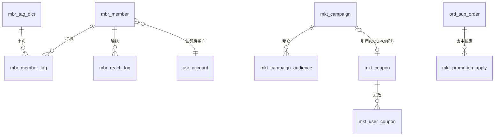

# TDD-会员与营销 · 数据库与 UI 设计

状态：草稿（待确认）
关联：[会员体系与活动联动 · 需求](../../requirements/会员体系与活动联动-需求.md) ·
[活动体系 · 产品方案](../../requirements/活动体系-需求.md) ·
[TDD-会员体系](./TDD-会员体系.md) · [TDD-券与活动模型](./TDD-券与活动模型.md)
创建日期：2026-08-24

---

## 一、总览：三块数据，五张新表

```
会员域 mbr_*                    营销域 mkt_*（扩展为主）
├─ mbr_member        关系       ├─ mkt_coupon            券模板（+11 列）
├─ mbr_member_tag    标签       ├─ mkt_user_coupon       用户券（+4 列）
├─ mbr_tag_dict      标签字典   ├─ mkt_campaign          活动（+6 列）
└─ mbr_reach_log     触达       ├─ mkt_campaign_audience 活动受众（新）
                                └─ mkt_promotion_apply   一单用了哪些优惠（新）
```

**为什么营销侧以扩展为主**：`mkt_coupon` 的五段模型今天已经有三段（权益/门槛/时间），
`discountFor()` 是唯一算优惠处；重建一张表要迁移已上线的算价链路，收益不抵风险
（见 [TDD-券与活动模型](./TDD-券与活动模型.md) §5）。

**唯一必须新增的营销表是 `mkt_promotion_apply`**：今天订单上只有 `discount_amount`
（以及按出资方拆的 platform/merchant 两列），**没有记是哪张券、哪个活动**。
没有它，活动效果、券的核销对账、「这个人因为哪场活动第一次下单」三件事都做不了。

---

## 二、DDL

### 2.1 `mbr_member` —— 一个人 × 一家主体

```sql
CREATE TABLE IF NOT EXISTS mbr_member
(
    id BIGINT(20) NOT NULL AUTO_INCREMENT,
    member_no VARCHAR(64) NOT NULL,
    entity_no VARCHAR(64) NOT NULL COMMENT '商家主体。会员属主体不属门店 —— 同一个人在总店买米、南门店买油是同一个人',
    user_no VARCHAR(64) DEFAULT NULL COMMENT '平台用户。线索会员为空，认领后回填',
    phone VARCHAR(32) DEFAULT NULL COMMENT '手工录入时的手机号。线索去重靠它；有 user_no 后仍保留，用于二次认领核对',
    status VARCHAR(16) NOT NULL DEFAULT 'ACTIVE' COMMENT 'LEAD 线索（不可触达/不进受众）/ ACTIVE / BLOCKED 被商家拉黑',
    source VARCHAR(16) NOT NULL COMMENT '首次来源 ORDER/SHARE/SCAN/MANUAL/FAVORITE/SEARCH。首次即定，后续来源进 source_extra',
    source_detail VARCHAR(512) DEFAULT NULL COMMENT 'JSON：inviterNo/shareCode/campaignNo/operatorNo/storeNo。只记来源不记谁分享的，分享激励就没法结算',
    source_extra VARCHAR(255) DEFAULT NULL COMMENT 'JSON 数组：后续出现过的其它来源，去重',
    first_store_no VARCHAR(64) DEFAULT NULL COMMENT '第一次在哪家门店发生关系。筛选「只看南门店的会员」用它与订单一起判',
    first_order_at BIGINT(20) DEFAULT NULL,
    last_order_at BIGINT(20) DEFAULT NULL,
    order_count INT(11) NOT NULL DEFAULT 0,
    total_spent_minor BIGINT(20) NOT NULL DEFAULT 0,
    d90_order_count INT(11) NOT NULL DEFAULT 0 COMMENT '近 90 天单数，每日重算。分层与筛选都读它，不要每次现算',
    d90_spent_minor BIGINT(20) NOT NULL DEFAULT 0,
    level VARCHAR(16) DEFAULT NULL COMMENT 'NEW/REGULAR/LOYAL/SLEEPING，由系统按 sys_setting 的口径算，商家不可改',
    reach_opt_out TINYINT(4) NOT NULL DEFAULT 0 COMMENT '买家在店铺页关掉了这家店的消息。商家看得到「已关闭」，看不到原因',
    remark VARCHAR(255) DEFAULT NULL COMMENT '商家备注。手工录入时常用（「三单元张阿姨」）',
    claimed_at BIGINT(20) DEFAULT NULL COMMENT '线索被本人认领的时刻',
    joined_at BIGINT(20) NOT NULL COMMENT '关系建立时刻',
    tenant_no VARCHAR(32) NOT NULL DEFAULT 'MAIN',
    created_at DATETIME NOT NULL,
    created_by VARCHAR(64) DEFAULT NULL,
    updated_at DATETIME NOT NULL,
    updated_by VARCHAR(64) DEFAULT NULL,
    version BIGINT(20) NOT NULL DEFAULT 0,
    deleted TINYINT(4) NOT NULL DEFAULT 0,
    PRIMARY KEY (id),
    UNIQUE KEY uk_member_no (member_no),
    UNIQUE KEY uk_member_entity_user (tenant_no, entity_no, user_no),
    UNIQUE KEY uk_member_entity_phone (tenant_no, entity_no, phone),
    KEY idx_member_entity_last (entity_no, last_order_at),
    KEY idx_member_entity_level (entity_no, level)
) ENGINE=InnoDB DEFAULT CHARSET=utf8mb4 COLLATE=utf8mb4_uca1400_ai_ci COMMENT='会员：一个人与一家商家主体的关系';
```

> **两个唯一键都要**：正式会员按 `user_no` 去重，线索按 `phone` 去重。
> MySQL 的唯一键允许多行 NULL，所以两者并存不会互相挡住。
> 认领时把线索行的 `user_no` 补上；若该 `user_no` 已有一行（他自己下过单），
> 则**合并**：保留更早的 `joined_at` 与 `source`，标签与备注并入，另一行软删。

### 2.2 `mbr_member_tag` —— 标签是行，不是 JSON

```sql
CREATE TABLE IF NOT EXISTS mbr_member_tag
(
    id BIGINT(20) NOT NULL AUTO_INCREMENT,
    entity_no VARCHAR(64) NOT NULL COMMENT '冗余主体号：按标签筛人时不必回表',
    member_no VARCHAR(64) NOT NULL,
    tag_type VARCHAR(8) NOT NULL COMMENT 'SYS 系统算的（只读）/ MCH 商家打的',
    tag VARCHAR(32) NOT NULL,
    tagged_by VARCHAR(64) DEFAULT NULL COMMENT '谁打的。SYS 为空',
    tagged_at BIGINT(20) NOT NULL,
    tenant_no VARCHAR(32) NOT NULL DEFAULT 'MAIN',
    created_at DATETIME NOT NULL,
    created_by VARCHAR(64) DEFAULT NULL,
    updated_at DATETIME NOT NULL,
    updated_by VARCHAR(64) DEFAULT NULL,
    version BIGINT(20) NOT NULL DEFAULT 0,
    deleted TINYINT(4) NOT NULL DEFAULT 0,
    PRIMARY KEY (id),
    UNIQUE KEY uk_member_tag (tenant_no, member_no, tag),
    KEY idx_tag_entity_tag (entity_no, tag)
) ENGINE=InnoDB DEFAULT CHARSET=utf8mb4 COLLATE=utf8mb4_uca1400_ai_ci COMMENT='会员标签：系统算的与商家打的各一类';
```

> 存 JSON 列的话，「打了『爱囤货』的有多少人」这种最常见的问题要全表扫 + 解析。

### 2.3 `mbr_tag_dict` —— 商家标签字典（限量、可改名、可停用）

```sql
CREATE TABLE IF NOT EXISTS mbr_tag_dict
(
    id BIGINT(20) NOT NULL AUTO_INCREMENT,
    entity_no VARCHAR(64) NOT NULL,
    tag VARCHAR(32) NOT NULL,
    usage_count INT(11) NOT NULL DEFAULT 0 COMMENT '打了多少人。改名/停用前要让商家看见影响面',
    enabled TINYINT(4) NOT NULL DEFAULT 1,
    tenant_no VARCHAR(32) NOT NULL DEFAULT 'MAIN',
    created_at DATETIME NOT NULL,
    created_by VARCHAR(64) DEFAULT NULL,
    updated_at DATETIME NOT NULL,
    updated_by VARCHAR(64) DEFAULT NULL,
    version BIGINT(20) NOT NULL DEFAULT 0,
    deleted TINYINT(4) NOT NULL DEFAULT 0,
    PRIMARY KEY (id),
    UNIQUE KEY uk_tag_dict (tenant_no, entity_no, tag)
) ENGINE=InnoDB DEFAULT CHARSET=utf8mb4 COLLATE=utf8mb4_uca1400_ai_ci COMMENT='商家标签字典：属主体，跨门店共享';
```

### 2.4 `mbr_reach_log` —— 触达记录（频次闸与效果都靠它）

```sql
CREATE TABLE IF NOT EXISTS mbr_reach_log
(
    id BIGINT(20) NOT NULL AUTO_INCREMENT,
    reach_no VARCHAR(64) NOT NULL,
    entity_no VARCHAR(64) NOT NULL,
    member_no VARCHAR(64) NOT NULL,
    task_no VARCHAR(64) DEFAULT NULL COMMENT '一次群发的批次号，对应 notify_push_task',
    channel VARCHAR(16) NOT NULL DEFAULT 'PUSH',
    scene VARCHAR(24) NOT NULL COMMENT 'NOTICE 公告 / WAKEUP 沉睡唤回 / COUPON 发券通知。频次闸按场景分档',
    sent_at BIGINT(20) NOT NULL,
    opened_at BIGINT(20) DEFAULT NULL,
    ordered_at BIGINT(20) DEFAULT NULL COMMENT '收到后 7 天内是否下单。效果只认这个数',
    tenant_no VARCHAR(32) NOT NULL DEFAULT 'MAIN',
    created_at DATETIME NOT NULL,
    created_by VARCHAR(64) DEFAULT NULL,
    updated_at DATETIME NOT NULL,
    updated_by VARCHAR(64) DEFAULT NULL,
    version BIGINT(20) NOT NULL DEFAULT 0,
    deleted TINYINT(4) NOT NULL DEFAULT 0,
    PRIMARY KEY (id),
    UNIQUE KEY uk_reach_no (reach_no),
    KEY idx_reach_gate (entity_no, member_no, scene, sent_at)
) ENGINE=InnoDB DEFAULT CHARSET=utf8mb4 COLLATE=utf8mb4_uca1400_ai_ci COMMENT='触达记录：频次闸查它，效果也算它';
```

> `idx_reach_gate` 就是频次闸的查询形状：「这家店给这个人这个场景，最近一次是什么时候」。

### 2.5 `mkt_coupon` 扩展（券的五段）

```sql
ALTER TABLE mkt_coupon
    ADD COLUMN benefit_mode VARCHAR(16) DEFAULT NULL COMMENT 'CASH 现金 / PERCENT 折扣 / GIFT 兑换 / FREE_SHIP 免运费。空 = 按 type 推导，语义与今天一致',
    ADD COLUMN benefit_ref VARCHAR(64) DEFAULT NULL COMMENT 'GIFT 时兑换哪件商品',
    ADD COLUMN min_qty INT(11) DEFAULT NULL COMMENT '件数门槛。空 = 不限',
    ADD COLUMN scope_type VARCHAR(16) DEFAULT NULL COMMENT 'ALL / STORE / CATEGORY / GOODS。空或 ALL = 全店，与今天一致',
    ADD COLUMN scope_refs TEXT DEFAULT NULL COMMENT 'JSON 数组：门店号 / 类目号 / 商品号',
    ADD COLUMN validity_mode VARCHAR(16) DEFAULT NULL COMMENT 'ABSOLUTE 绝对起止（默认）/ RELATIVE 领取后 N 天',
    ADD COLUMN valid_days INT(11) DEFAULT NULL COMMENT 'RELATIVE 时的天数',
    ADD COLUMN issue_mode VARCHAR(16) DEFAULT NULL COMMENT 'CENTER 领券中心 / TARGETED 定向 / CAMPAIGN 活动发 / CODE 发码。空 = CENTER',
    ADD COLUMN redeem_mode VARCHAR(16) DEFAULT NULL COMMENT 'ORDER 下单抵扣（默认）/ STORE_CODE 到店出示核销。STORE_CODE 不参与下单算价';
```

> `scope_desc` 保留但降级为**展示文案**：规则以 `scope_type/scope_refs` 为准。
> 两者不一致的券在运营端要标出来 —— 今天写「仅限粮油」的券买猫粮照样能用。

### 2.6 `mkt_user_coupon` 扩展（到店核销与相对有效期）

```sql
ALTER TABLE mkt_user_coupon
    ADD COLUMN expire_at BIGINT(20) DEFAULT NULL COMMENT '这一张的失效时刻。RELATIVE 券领取时算出来落库 —— 不能每次读时现算，券模板改了会把已领的券一起改掉',
    ADD COLUMN redeem_code VARCHAR(32) DEFAULT NULL COMMENT '到店核销码。只有 STORE_CODE 券有',
    ADD COLUMN verified_by VARCHAR(64) DEFAULT NULL COMMENT '哪个店员核销的',
    ADD COLUMN verified_store_no VARCHAR(64) DEFAULT NULL COMMENT '在哪家门店核销的';
```

### 2.7 `mkt_campaign` 扩展（目的 / 排期 / 限量 / 引用券）

```sql
ALTER TABLE mkt_campaign
    ADD COLUMN goal VARCHAR(16) DEFAULT NULL COMMENT 'ACQUIRE 拉新 / WAKEUP 唤回 / CLEAR 清库存 / BASKET 提客单。只是入口与默认值，落库仍是四类 type',
    ADD COLUMN schedule_type VARCHAR(16) DEFAULT NULL COMMENT 'ONE_OFF 短期（默认，=今天）/ ALWAYS_ON 长期 / RECURRING 周期',
    ADD COLUMN schedule_rule VARCHAR(128) DEFAULT NULL COMMENT 'RECURRING 时：JSON {weekdays:[3],dayOfMonth:null,from:"08:00",to:"20:00"}',
    ADD COLUMN quota INT(11) DEFAULT NULL COMMENT '限量（件）。FLASH/BUY_GIFT 必填 —— 没有结束时间又没有上限等于永久敞口',
    ADD COLUMN quota_used INT(11) NOT NULL DEFAULT 0,
    ADD COLUMN coupon_no VARCHAR(64) DEFAULT NULL COMMENT 'COUPON 型活动引用的券。存量 CU@ 桥接券保持原样，新建走引用';
```

### 2.8 `mkt_campaign_audience` —— 活动受众（新）

```sql
CREATE TABLE IF NOT EXISTS mkt_campaign_audience
(
    id BIGINT(20) NOT NULL AUTO_INCREMENT,
    campaign_no VARCHAR(64) NOT NULL,
    entity_no VARCHAR(64) NOT NULL,
    audience_type VARCHAR(16) NOT NULL COMMENT 'TAG 标签 / LEVEL 会员层 / SOURCE 来源 / NON_MEMBER 非本店会员',
    audience_value VARCHAR(64) NOT NULL,
    tenant_no VARCHAR(32) NOT NULL DEFAULT 'MAIN',
    created_at DATETIME NOT NULL,
    created_by VARCHAR(64) DEFAULT NULL,
    updated_at DATETIME NOT NULL,
    updated_by VARCHAR(64) DEFAULT NULL,
    version BIGINT(20) NOT NULL DEFAULT 0,
    deleted TINYINT(4) NOT NULL DEFAULT 0,
    PRIMARY KEY (id),
    UNIQUE KEY uk_campaign_audience (tenant_no, campaign_no, audience_type, audience_value),
    KEY idx_audience_campaign (campaign_no)
) ENGINE=InnoDB DEFAULT CHARSET=utf8mb4 COLLATE=utf8mb4_uca1400_ai_ci COMMENT='活动受众：没有任何一行 = 对所有人生效（与今天一致）';
```

> **一个活动的多行之间是「或」**：勾了「熟客」和「沉睡」就是这两类人都能享。
> 需要「且」的场景（熟客且爱囤货）留到有真实需求再说 —— 现在做出来没人用得对。

### 2.9 `mkt_promotion_apply` —— 一单用了哪些优惠（新，效果与对账的地基）

```sql
CREATE TABLE IF NOT EXISTS mkt_promotion_apply
(
    id BIGINT(20) NOT NULL AUTO_INCREMENT,
    apply_no VARCHAR(64) NOT NULL,
    order_no VARCHAR(64) NOT NULL,
    sub_order_no VARCHAR(64) DEFAULT NULL COMMENT '按商家拆的那一单。跨商家的平台券会有多行',
    entity_no VARCHAR(64) DEFAULT NULL,
    user_no VARCHAR(64) NOT NULL,
    promo_type VARCHAR(16) NOT NULL COMMENT 'CAMPAIGN 活动 / COUPON 券 / POINTS 积分',
    promo_no VARCHAR(64) NOT NULL COMMENT '活动号 / 券号 / 积分流水号',
    amount_minor BIGINT(20) NOT NULL DEFAULT 0 COMMENT '这一项减了多少',
    funder VARCHAR(16) NOT NULL DEFAULT 'MERCHANT' COMMENT 'PLATFORM / MERCHANT。与结算拆分同一口径',
    applied_at BIGINT(20) NOT NULL,
    reverted_at BIGINT(20) DEFAULT NULL COMMENT '订单取消/退款时置。效果统计要排除它',
    tenant_no VARCHAR(32) NOT NULL DEFAULT 'MAIN',
    created_at DATETIME NOT NULL,
    created_by VARCHAR(64) DEFAULT NULL,
    updated_at DATETIME NOT NULL,
    updated_by VARCHAR(64) DEFAULT NULL,
    version BIGINT(20) NOT NULL DEFAULT 0,
    deleted TINYINT(4) NOT NULL DEFAULT 0,
    PRIMARY KEY (id),
    UNIQUE KEY uk_promotion_apply (apply_no),
    KEY idx_promo_apply_order (order_no),
    KEY idx_promo_apply_promo (promo_type, promo_no, applied_at)
) ENGINE=InnoDB DEFAULT CHARSET=utf8mb4 COLLATE=utf8mb4_uca1400_ai_ci COMMENT='一单命中了哪些优惠：活动效果、券对账、会员来源归因都读它';
```

> **写入方是 trade（下单算价成功后），但表属 marketing**：跨域走 Port
> （`PromotionApplyPort.record(...)`），与今天 `CampaignPort` / `CouponPort` 同一个形状。
> 同事务写 —— 异步会让「减了钱但没记录」在对账时无解。

### 2.10 关系图



---

## 三、UI 设计

### 3.1 B 端 · 会员（替换现「我的客户」页，路由保留）

```
┌─ 会员 ────────────────────────────┐
│  ┌─────┬─────┬─────┬─────┐        │   顶部四格是数字即入口
│  │ 新客│ 常客│ 熟客│ 沉睡│        │   点一下 = 按该层筛选
│  │  38 │  62 │  17 │  24 │        │   沉睡用警示色（唯一能立刻行动的信号）
│  └─────┴─────┴─────┴─────┘        │
│  本月新增 12 · 可触达 118          │
│                                    │
│  [🔍 手机号完整匹配        ] [筛选]│   ← 只认完整号码，输一半不给结果
│  标签: (爱囤货) (只要土鸡蛋) (+)   │   ← 点标签即筛选，可多选（或）
│                                    │
│  ┌────────────────────────────┐    │
│  │ 张阿姨  ···1234    〔沉睡〕│    │   来源徽标：分享/扫码/录入/自然
│  │ 近90天 0 单 · 累计 23 单   │    │   手机号只出后四位
│  │ 上次 68 天前 · 来自 分享   │    │
│  │ (爱囤货)(不要辣)           │    │
│  └────────────────────────────┘    │
│  … 列表按「最近下单」倒序，沉睡置顶 │
│                                    │
│  [ 批量打标 ] [ 发券 ] [ 发消息 ]  │   ← 选中若干人后出现的操作条
└────────────────────────────────────┘
```

**交互规则**

- 筛选面板：来源 / 层级 / 标签 / 末单区间 / 累计消费区间。筛完顶部显示「命中 37 人」，
  三个动作都作用在这 37 人上。
- **发消息**受频次闸：不满足时按钮置灰并直说「其中 12 人 7 天内已收到过，本次只发 25 人」——
  不要静默少发。
- 线索会员整行淡色 + 「线索」标，**不出现在发消息/发券的可选范围**里，点进去只有备注和标签。

### 3.2 B 端 · 会员详情

```
┌─ 张阿姨 ─────────────────────────┐
│ ···1234   来自 分享（李姐）       │   来源写清「谁分享的」
│ 加入 2026-03-12 · 首单 03-12      │
│ 近90天 0 单 / ¥0 · 累计 23 单/¥1,842│
│ 标签 (爱囤货)(不要辣) [＋ 打标]    │   系统标签是灰的、不可删
│ 备注 三单元，晚上来               │
│ ─────────────────────────────    │
│ 最近的单                          │
│  08-02  ¥68   自提                │
│  07-19  ¥120  自送                │
│ ─────────────────────────────    │
│ [ 发一张券 ]   [ 发条消息 ]       │
└───────────────────────────────────┘
```

### 3.3 B 端 · 手工录入（批次二）

```
┌─ 添加会员 ───────────────────────┐
│ 手机号 [            ] 必填        │
│ 备注   [            ]             │
│ 标签   (爱囤货)(+)                │
│                                   │
│ ⓘ 他还不是平台用户时，这条记为    │   ← 合规提示必须在保存前出现
│   「线索」：不会收到任何消息，     │
│   等他自己注册后自动认领。        │
│                        [ 保存 ]   │
└───────────────────────────────────┘
```

### 3.4 B 端 · 新建活动（目的引导，四步）

```
第 1 步 目的            第 2 步 参数              第 3 步 给谁            第 4 步 预览
┌──────────────┐      ┌──────────────┐        ┌──────────────┐      ┌──────────────┐
│ ○ 拉新客     │      │ 满 [50] 减[5]│        │ ● 所有人     │      │ 每周三 8-20  │
│ ○ 唤回老客   │  →   │ 商品 全部    │   →    │ ○ 沉睡会员24 │  →   │ 满50减5      │
│ ● 清库存     │      │ 限量 [100]件 │        │ ○ 熟客 17    │      │ 限量100件    │
│ ○ 提客单     │      │ 排期:        │        │ ○ 标签…      │      │ 覆盖 24 人   │
└──────────────┘      │ ○短期 ●长期  │        └──────────────┘      │ [ 发布 ]     │
                      │ ○每周三      │                              └──────────────┘
                      └──────────────┘
```

**规则**

- 目的只预填参数，落库仍是四类 `type`。
- **限量对 FLASH/BUY_GIFT 必填**，长期活动更必须（没有结束时间又没上限 = 永久敞口）。
- 第 3 步默认「所有人」；选了会员条件时预览页要显示**覆盖人数**，0 人时拦下来。
- 冲突提示：所选商品已在别的活动里时，这一步直说「同类取最优，实际生效的可能是那个」。

### 3.5 B 端 · 活动列表与效果

```
┌─ 营销 ──────────────────────────┐
│ [进行中] [长期] [周期] [已结束]  │   ← 长期/周期单独分组，否则被"快到期"排序埋掉
│ ┌──────────────────────────┐    │
│ │ 周三特价 · 每周三 8-20    │    │
│ │ 限量 100 · 已用 63        │    │   限量进度是这一行最要紧的数
│ │ 带来 41 单 / ¥2,180       │    │   ← 效果直接长在列表上，不用点进去
│ │ 新客 12 · 唤回 5          │    │
│ │            [暂停] [再来一次]│   │
│ └──────────────────────────┘    │
└──────────────────────────────────┘
```

### 3.6 B 端 · 券（新建券的五段式表单）

```
┌─ 新建券 ─────────────────────────┐
│ 名称   [满50减5]                  │
│ 权益   ● 现金 [5] 元              │   四选一：现金/折扣/兑换/免运费
│        ○ 折扣 [8.5]折 封顶[10]元  │   折扣必须填封顶（预算前置的结论）
│        ○ 兑换 [选商品]            │
│ 门槛   满 [50] 元 · 满 [ ] 件     │
│ 范围   ● 全店 ○ 指定门店          │   ← 范围是规则，不再只是一句文案
│        ○ 指定类目 ○ 指定商品      │
│ 有效期 ○ 固定 [8/24]–[8/31]       │
│        ● 领取后 [7] 天            │   ← 唤回券的标准形态
│ 发放   ● 领券中心 ○ 定向 ○ 活动发 │
│ 核销   ● 下单抵扣 ○ 到店出示      │   ← 到店券不参与下单算价
│ 数量   [200] 张 · 每人 [1] 张     │
│ 预算   ¥1,000（自动算：200×5）    │   ← 敞口在保存这一刻就是确定的
└───────────────────────────────────┘
```

### 3.7 C 端 · 店铺页会员卡 + 加入

```
┌─ 张记粮油 ───────────────────────┐
│ 公告：今天到了新米…  今天 07:20更新│
│ ┌──────────────────────────┐    │
│ │ 常客 · 近90天 4 单        │    │   没加入时这里是 [ 加入会员 ]
│ │ 你的券 2 张  >            │    │
│ │ 接收这家店的消息  [开/关] │    │   ← 退订入口必须在这里，不藏在设置里
│ └──────────────────────────┘    │
└───────────────────────────────────┘
```

### 3.8 C 端 · 券包（到店券要能出示）

```
┌─ 我的券 ─────────────────────────┐
│ [可用 3] [已用] [过期]            │
│ ┌──────────────────────────┐    │
│ │ ¥5   满50减5   张记粮油    │    │
│ │ 7天后过期 · 全店可用       │    │
│ │                  [去使用] │    │
│ ├──────────────────────────┤    │
│ │ 🎁  兑换一份土鸡蛋         │    │
│ │ 到店出示 · 南门店          │    │
│ │        [ 出示核销码 ] ▣    │    │   ← 点开是大号码 + 二维码
│ └──────────────────────────┘    │
└───────────────────────────────────┘
```

### 3.9 B 端 · 到店核销（复用现有核销页，加一个 tab）

```
┌─ 核销 ───────────────────────────┐
│ [取货核销] [券核销]               │   ← 两个「核销」在一处，但分 tab
│ 扫码 或 输入 8 位券码 [        ]  │
│ ┌──────────────────────────┐    │
│ │ 兑换一份土鸡蛋            │    │
│ │ 张阿姨 ···1234            │    │
│ │ 南门店 · 有效期至 08-31   │    │
│ │        [ 确认核销 ]       │    │   ← 确认后不可撤销，按钮上写明
│ └──────────────────────────┘    │
└───────────────────────────────────┘
```

### 3.10 运营端

| 页面 | 内容 |
|---|---|
| 会员口径 | 分层门槛、沉睡天数（默认 60）、标签上限 —— 全部读 `sys_setting` |
| 触达闸 | 每场景的窗口与条数；全平台触达量与退订率排行（哪家店发得最凶） |
| 券审计 | `scope_desc` 与 `scope_type/refs` **不一致**的券；无封顶的存量折扣券；长期活动缺限量的 |

---

## 四、口径与配置（P4 零硬编码）

| key | 默认 | 含义 |
|---|---|---|
| `member.level.regular-min` | 2 | 近 90 天单数 ≥ 该值为常客 |
| `member.level.loyal-min` | 6 | 熟客门槛 |
| `member.sleeping-days` | 60 | 沉睡天数（2026-08-24 拍板） |
| `member.tag.max-per-merchant` | 50 | 商家标签上限 |
| `member.tag.max-per-member` | 10 | 每人标签上限 |
| `member.reach.notice-window-days` | 7 | 普通触达窗口 |
| `member.reach.wakeup-window-days` | 30 | 唤回窗口 |

## 五、迁移与兼容

1. 五张新表 + 三处 ALTER 分两支迁移（会员一支、营销一支），互不依赖。
2. 存量回填：按 `ord_sub_order` 聚合建 `mbr_member`，分批 + 幂等，不在启动时同步跑。
3. `mkt_promotion_apply` **只记新单**，历史单不回填 —— 回填要重算历史优惠归属，
   而那份数据已经进过结算，动它比缺一段历史更危险。效果卡上标明「自 X 月 X 日起统计」。
4. 所有新增列可空且默认值等价于今天的行为；`CouponModelCompatTest` 用金额级断言守住。

---
确认记录：待用户确认
