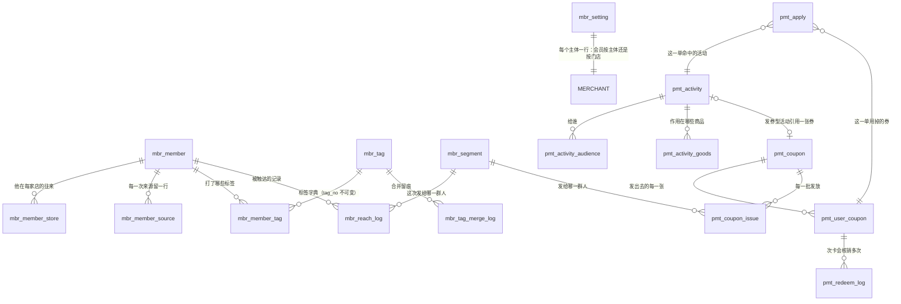
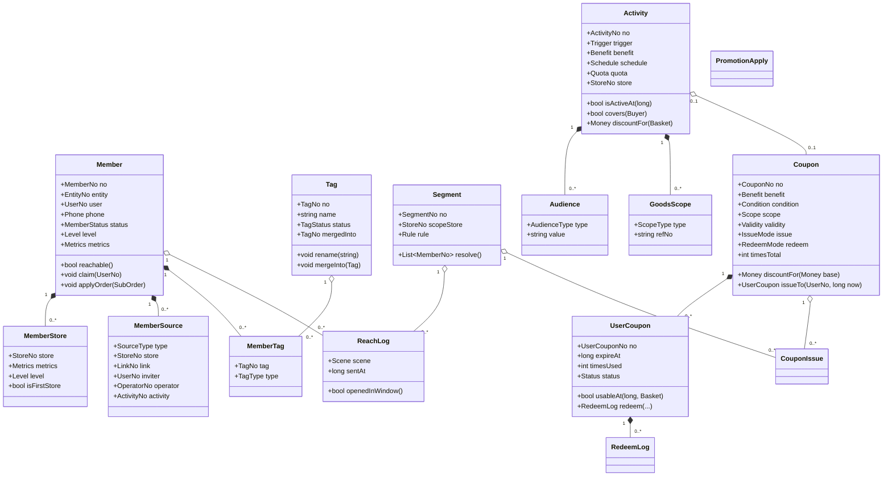

# TDD-会员与营销 · 表结构与对象模型

状态：草稿（待确认）
关联：[会员体系与活动联动 · 需求](../../requirements/会员体系与活动联动-需求.md) ·
[活动体系 · 产品方案](../../requirements/活动体系-需求.md) ·
[TDD-券与活动模型](./TDD-券与活动模型.md)（抽象与取舍）·
[TDD-会员与营销-数据库与UI](./TDD-会员与营销-数据库与UI.md)（UI 部分仍以那一份为准）
创建日期：2026-08-24

---

## 0. 前提与范围

**这一份走「新建表」路线**（2026-08-24 拍板）：营销侧不再往 `mkt_coupon` / `mkt_campaign`
上打补丁，而是新建一套 `pmt_*` 表，按统一模型一次做对；旧表在切换完成后退场。

**代价要说在前面**：重建表意味着**券与活动的服务层、三端页面、算价接入点都要跟着重写**，
不是只写几段 DDL。DDL 是这份文档的产物，重写是接下来的工作量（见 §5 退场路径）。
库里现在是测试数据，可以删了重来 —— 这也是现在做比以后做便宜得多的原因。

命名前缀：会员 `mbr_`（member）、营销 `pmt_`（promotion）。
用新前缀而不是沿用 `mkt_`，是为了**新旧可以并存一段**：先双写/只读切换，再删旧表。

---

## 1. 表与表之间的关系

### 1.1 全景



### 1.2 一句话说明每张表

| 表 | 一句话 | 为什么必须独立 |
|---|---|---|
| `mbr_setting` | 这个主体的会员按主体经营还是按门店经营 | 开关要能随时切；放在主体表上会与商家资料的读写混在一起 |
| `mbr_member` | **一个人 × 一家主体**的关系（主表） | 名单、分层、可触达状态的唯一真源 |
| `mbr_member_store` | 他在**某一家门店**的往来与分层 | 十公里外那家店要按自己的口径看人；两级数据一直都算，开关只决定展示哪级 |
| `mbr_member_source` | **每一次**来源：哪家店、哪条链接、谁发的、谁录的、哪场活动 | 「李姐拉来多少人」是按列聚合的问题，塞 JSON 只能全表扫 |
| `mbr_tag` | 标签字典：`tag_no` 不可变、`name` 可改 | 改名不动关系行；合并要留下 `merged_into` |
| `mbr_member_tag` | 谁被打了哪个标签 | 按标签筛人、按标签统计人数 |
| `mbr_tag_merge_log` | 谁在什么时候把哪个标签并进了哪个 | 合并不可逆，要能回答「这批人的标签怎么变了」 |
| `mbr_segment` | 一组筛选条件 = 一个人群，可命名保存 | 发券、活动受众、触达都要引用「同一群人」，条件散在各处会对不上 |
| `mbr_reach_log` | 谁在什么时候被发过什么 | 频次闸查它，效果也算它 |
| `pmt_activity` | 活动 = 触发 × 优惠 × 排期 × 限量 × 门店 | 统一模型，四类玩法只是取值组合 |
| `pmt_activity_audience` | 这场活动给谁 | 没有任何一行 = 给所有人 |
| `pmt_activity_goods` | 这场活动作用在哪些商品 | 用表不用 TEXT：要反查「这个商品在哪些活动里」（冲突提示） |
| `pmt_coupon` | 券模板 = 权益 × 门槛 × 范围 × 有效期 × 发放 × 核销 × 次数 | 券是资产的模具，与活动解耦 |
| `pmt_user_coupon` | 发到某个人手上的**那一张** | 有自己的有效期与状态，活动结束不该动它 |
| `pmt_coupon_issue` | 一批发放（发给哪个人群、发了多少、谁发的） | 定向发券要能回看与追责 |
| `pmt_redeem_log` | 每一次核销 | 次卡要核销多次；线下核销要留下谁、在哪家店 |
| `pmt_apply` | 这一单命中了哪些优惠、各减了多少、谁出的钱 | 活动效果、券对账、会员来源归因，三件事都读它 |

### 1.3 三条贯穿的规则

1. **关系表只存号，不存文本**（标签、商品、门店都是）：文本会变，号不变。
2. **凡是"给谁"，都指向 `mbr_segment` 或标签号**，不各自存一份 JSON 条件 ——
   否则同一群人在发券、活动、触达三处会算出三个数。
3. **凡是"发生过什么"，都单独留一行**（`mbr_member_source` / `mbr_reach_log` /
   `pmt_redeem_log` / `pmt_apply`）：这些是事实，不是状态；用状态字段覆盖会丢掉历史。

---

## 2. 会员域逐表

### 2.1 `mbr_setting` —— 主体的会员经营口径

```sql
CREATE TABLE IF NOT EXISTS mbr_setting
(
    id BIGINT(20) NOT NULL AUTO_INCREMENT,
    entity_no VARCHAR(64) NOT NULL,
    member_scope VARCHAR(16) NOT NULL DEFAULT 'ENTITY' COMMENT 'ENTITY 按主体（默认）/ STORE 按门店。只改展示与分层口径，不改存储，可随时切',
    auto_join_on_order TINYINT(4) NOT NULL DEFAULT 1 COMMENT '下单即入会。关掉的话只有主动加入的人才算会员',
    tenant_no VARCHAR(32) NOT NULL DEFAULT 'MAIN',
    created_at DATETIME NOT NULL,
    created_by VARCHAR(64) DEFAULT NULL,
    updated_at DATETIME NOT NULL,
    updated_by VARCHAR(64) DEFAULT NULL,
    version BIGINT(20) NOT NULL DEFAULT 0,
    deleted TINYINT(4) NOT NULL DEFAULT 0,
    PRIMARY KEY (id),
    UNIQUE KEY uk_mbr_setting_entity (tenant_no, entity_no)
) ENGINE=InnoDB DEFAULT CHARSET=utf8mb4 COLLATE=utf8mb4_uca1400_ai_ci COMMENT='会员经营口径：按主体还是按门店';
```

### 2.2 `mbr_member` —— 关系主表

```sql
CREATE TABLE IF NOT EXISTS mbr_member
(
    id BIGINT(20) NOT NULL AUTO_INCREMENT,
    member_no VARCHAR(64) NOT NULL,
    entity_no VARCHAR(64) NOT NULL COMMENT '商家主体。会员挂主体 —— 同一个人在三家店不该各算一次',
    user_no VARCHAR(64) DEFAULT NULL COMMENT '平台用户。线索会员为空，本人注册后回填',
    phone VARCHAR(32) DEFAULT NULL COMMENT '手工录入的手机号。线索靠它去重与认领',
    status VARCHAR(16) NOT NULL DEFAULT 'ACTIVE' COMMENT 'LEAD 线索（不可触达、不进受众）/ ACTIVE / BLOCKED 商家拉黑',
    source VARCHAR(16) NOT NULL COMMENT '首次来源 ORDER/SHARE/SCAN/MANUAL/FAVORITE/SEARCH。明细见 mbr_member_source',
    first_store_no VARCHAR(64) DEFAULT NULL COMMENT '从哪家门店进来的。冗余自 source 明细，列表不回表',
    first_order_at BIGINT(20) DEFAULT NULL,
    last_order_at BIGINT(20) DEFAULT NULL,
    order_count INT(11) NOT NULL DEFAULT 0,
    total_spent_minor BIGINT(20) NOT NULL DEFAULT 0,
    d90_order_count INT(11) NOT NULL DEFAULT 0 COMMENT '近 90 天单数，每日重算。分层与筛选读它，不现算',
    d90_spent_minor BIGINT(20) NOT NULL DEFAULT 0,
    level VARCHAR(16) DEFAULT NULL COMMENT 'NEW/REGULAR/LOYAL/SLEEPING，主体级。按门店经营时展示 mbr_member_store.level',
    reach_opt_out TINYINT(4) NOT NULL DEFAULT 0 COMMENT '买家关掉了这家店的消息。商家看得到状态，看不到原因',
    remark VARCHAR(255) DEFAULT NULL COMMENT '商家备注（「三单元张阿姨」）',
    joined_at BIGINT(20) NOT NULL,
    claimed_at BIGINT(20) DEFAULT NULL COMMENT '线索被本人认领的时刻',
    tenant_no VARCHAR(32) NOT NULL DEFAULT 'MAIN',
    created_at DATETIME NOT NULL,
    created_by VARCHAR(64) DEFAULT NULL,
    updated_at DATETIME NOT NULL,
    updated_by VARCHAR(64) DEFAULT NULL,
    version BIGINT(20) NOT NULL DEFAULT 0,
    deleted TINYINT(4) NOT NULL DEFAULT 0,
    PRIMARY KEY (id),
    UNIQUE KEY uk_mbr_member_no (member_no),
    UNIQUE KEY uk_mbr_member_user (tenant_no, entity_no, user_no),
    UNIQUE KEY uk_mbr_member_phone (tenant_no, entity_no, phone),
    KEY idx_mbr_member_last (entity_no, last_order_at),
    KEY idx_mbr_member_level (entity_no, level),
    KEY idx_mbr_member_store (entity_no, first_store_no)
) ENGINE=InnoDB DEFAULT CHARSET=utf8mb4 COLLATE=utf8mb4_uca1400_ai_ci COMMENT='会员：一个人与一家主体的关系';
```

**两个唯一键并存**：正式会员按 `user_no` 去重、线索按 `phone` 去重（唯一键允许多行 NULL）。
认领时若两行都存在则**合并**：保留更早的 `joined_at` 与首次来源，标签与备注并入，另一行软删。

### 2.3 `mbr_member_store` —— 他在每家店的往来

```sql
CREATE TABLE IF NOT EXISTS mbr_member_store
(
    id BIGINT(20) NOT NULL AUTO_INCREMENT,
    member_no VARCHAR(64) NOT NULL,
    entity_no VARCHAR(64) NOT NULL,
    store_no VARCHAR(64) NOT NULL,
    first_order_at BIGINT(20) DEFAULT NULL,
    last_order_at BIGINT(20) DEFAULT NULL,
    order_count INT(11) NOT NULL DEFAULT 0,
    total_spent_minor BIGINT(20) NOT NULL DEFAULT 0,
    d90_order_count INT(11) NOT NULL DEFAULT 0,
    d90_spent_minor BIGINT(20) NOT NULL DEFAULT 0,
    level VARCHAR(16) DEFAULT NULL COMMENT '这家店自己的分层。按门店经营时展示的是它',
    is_first_store TINYINT(4) NOT NULL DEFAULT 0 COMMENT '他是从这家店进来的',
    tenant_no VARCHAR(32) NOT NULL DEFAULT 'MAIN',
    created_at DATETIME NOT NULL,
    created_by VARCHAR(64) DEFAULT NULL,
    updated_at DATETIME NOT NULL,
    updated_by VARCHAR(64) DEFAULT NULL,
    version BIGINT(20) NOT NULL DEFAULT 0,
    deleted TINYINT(4) NOT NULL DEFAULT 0,
    PRIMARY KEY (id),
    UNIQUE KEY uk_mbr_member_store (tenant_no, member_no, store_no),
    KEY idx_mbr_store_last (entity_no, store_no, last_order_at),
    KEY idx_mbr_store_level (entity_no, store_no, level)
) ENGINE=InnoDB DEFAULT CHARSET=utf8mb4 COLLATE=utf8mb4_uca1400_ai_ci COMMENT='会员在某家门店的往来与分层';
```

### 2.4 `mbr_member_source` —— 每一次来源

```sql
CREATE TABLE IF NOT EXISTS mbr_member_source
(
    id BIGINT(20) NOT NULL AUTO_INCREMENT,
    source_no VARCHAR(64) NOT NULL,
    member_no VARCHAR(64) NOT NULL,
    entity_no VARCHAR(64) NOT NULL,
    source_type VARCHAR(16) NOT NULL COMMENT 'ORDER/SHARE/SCAN/MANUAL/FAVORITE/SEARCH',
    store_no VARCHAR(64) DEFAULT NULL COMMENT '这一次是从哪家门店进来的',
    link_no VARCHAR(64) DEFAULT NULL COMMENT '哪一条分享链接 / 店铺码，可回查落地页',
    inviter_user_no VARCHAR(64) DEFAULT NULL COMMENT '谁发的链接。分享激励结算读它',
    inviter_role VARCHAR(16) DEFAULT NULL COMMENT 'MERCHANT 商家 / STAFF 员工 / CUSTOMER 老客转发',
    operator_no VARCHAR(64) DEFAULT NULL COMMENT 'MANUAL 时哪个员工录的',
    activity_no VARCHAR(64) DEFAULT NULL COMMENT '因哪场活动进来的',
    is_first TINYINT(4) NOT NULL DEFAULT 0,
    occurred_at BIGINT(20) NOT NULL,
    tenant_no VARCHAR(32) NOT NULL DEFAULT 'MAIN',
    created_at DATETIME NOT NULL,
    created_by VARCHAR(64) DEFAULT NULL,
    updated_at DATETIME NOT NULL,
    updated_by VARCHAR(64) DEFAULT NULL,
    version BIGINT(20) NOT NULL DEFAULT 0,
    deleted TINYINT(4) NOT NULL DEFAULT 0,
    PRIMARY KEY (id),
    UNIQUE KEY uk_mbr_source_no (source_no),
    KEY idx_mbr_source_member (member_no, occurred_at),
    KEY idx_mbr_source_inviter (entity_no, inviter_user_no, occurred_at),
    KEY idx_mbr_source_activity (activity_no),
    KEY idx_mbr_source_store (entity_no, store_no, occurred_at)
) ENGINE=InnoDB DEFAULT CHARSET=utf8mb4 COLLATE=utf8mb4_uca1400_ai_ci COMMENT='会员来源明细：哪家店、哪条链接、谁发的、谁录的、因哪场活动';
```

### 2.5 `mbr_tag` / `mbr_member_tag` / `mbr_tag_merge_log`

```sql
CREATE TABLE IF NOT EXISTS mbr_tag
(
    id BIGINT(20) NOT NULL AUTO_INCREMENT,
    tag_no VARCHAR(64) NOT NULL COMMENT '不可变。改名改的是 name，关系行一行不动',
    entity_no VARCHAR(64) NOT NULL COMMENT '属主体：跨门店共享',
    name VARCHAR(32) NOT NULL,
    tag_type VARCHAR(8) NOT NULL DEFAULT 'MCH' COMMENT 'SYS 系统算的（不可改名不可合并）/ MCH 商家的',
    status VARCHAR(16) NOT NULL DEFAULT 'ACTIVE' COMMENT 'ACTIVE / DISABLED 停用（老的还在、新的打不了）/ MERGED 已并入',
    merged_into VARCHAR(64) DEFAULT NULL COMMENT 'MERGED 时指向目标 tag_no，保留不删',
    usage_count INT(11) NOT NULL DEFAULT 0,
    tenant_no VARCHAR(32) NOT NULL DEFAULT 'MAIN',
    created_at DATETIME NOT NULL,
    created_by VARCHAR(64) DEFAULT NULL,
    updated_at DATETIME NOT NULL,
    updated_by VARCHAR(64) DEFAULT NULL,
    version BIGINT(20) NOT NULL DEFAULT 0,
    deleted TINYINT(4) NOT NULL DEFAULT 0,
    PRIMARY KEY (id),
    UNIQUE KEY uk_mbr_tag_no (tag_no),
    UNIQUE KEY uk_mbr_tag_name (tenant_no, entity_no, name),
    KEY idx_mbr_tag_entity (entity_no, status)
) ENGINE=InnoDB DEFAULT CHARSET=utf8mb4 COLLATE=utf8mb4_uca1400_ai_ci COMMENT='标签字典：tag_no 不可变、name 可改';

CREATE TABLE IF NOT EXISTS mbr_member_tag
(
    id BIGINT(20) NOT NULL AUTO_INCREMENT,
    entity_no VARCHAR(64) NOT NULL,
    member_no VARCHAR(64) NOT NULL,
    tag_no VARCHAR(64) NOT NULL COMMENT '只存号不存文本',
    tag_type VARCHAR(8) NOT NULL,
    tagged_by VARCHAR(64) DEFAULT NULL COMMENT '谁打的。SYS 为空',
    tagged_at BIGINT(20) NOT NULL,
    tenant_no VARCHAR(32) NOT NULL DEFAULT 'MAIN',
    created_at DATETIME NOT NULL,
    created_by VARCHAR(64) DEFAULT NULL,
    updated_at DATETIME NOT NULL,
    updated_by VARCHAR(64) DEFAULT NULL,
    version BIGINT(20) NOT NULL DEFAULT 0,
    deleted TINYINT(4) NOT NULL DEFAULT 0,
    PRIMARY KEY (id),
    UNIQUE KEY uk_mbr_member_tag (tenant_no, member_no, tag_no),
    KEY idx_mbr_tag_filter (entity_no, tag_no)
) ENGINE=InnoDB DEFAULT CHARSET=utf8mb4 COLLATE=utf8mb4_uca1400_ai_ci COMMENT='会员标签关系';

CREATE TABLE IF NOT EXISTS mbr_tag_merge_log
(
    id BIGINT(20) NOT NULL AUTO_INCREMENT,
    entity_no VARCHAR(64) NOT NULL,
    from_tag_no VARCHAR(64) NOT NULL,
    to_tag_no VARCHAR(64) NOT NULL,
    affected_count INT(11) NOT NULL DEFAULT 0,
    operator_no VARCHAR(64) DEFAULT NULL,
    merged_at BIGINT(20) NOT NULL,
    tenant_no VARCHAR(32) NOT NULL DEFAULT 'MAIN',
    created_at DATETIME NOT NULL,
    created_by VARCHAR(64) DEFAULT NULL,
    updated_at DATETIME NOT NULL,
    updated_by VARCHAR(64) DEFAULT NULL,
    version BIGINT(20) NOT NULL DEFAULT 0,
    deleted TINYINT(4) NOT NULL DEFAULT 0,
    PRIMARY KEY (id),
    KEY idx_mbr_merge_entity (entity_no, merged_at)
) ENGINE=InnoDB DEFAULT CHARSET=utf8mb4 COLLATE=utf8mb4_uca1400_ai_ci COMMENT='标签合并留痕：合并不可逆';
```

### 2.6 `mbr_segment` —— 一组条件 = 一个人群

```sql
CREATE TABLE IF NOT EXISTS mbr_segment
(
    id BIGINT(20) NOT NULL AUTO_INCREMENT,
    segment_no VARCHAR(64) NOT NULL,
    entity_no VARCHAR(64) NOT NULL,
    name VARCHAR(64) NOT NULL COMMENT '商家起的名字（「南门店沉睡老客」）',
    scope_store_no VARCHAR(64) DEFAULT NULL COMMENT '限定门店。空 = 全主体',
    rule_json TEXT NOT NULL COMMENT '筛选条件：层级/标签号/来源/末单区间/消费区间。**存号不存文本**',
    last_count INT(11) NOT NULL DEFAULT 0 COMMENT '上次算出多少人。发券与触达前会重算，这里只是展示',
    counted_at BIGINT(20) DEFAULT NULL,
    tenant_no VARCHAR(32) NOT NULL DEFAULT 'MAIN',
    created_at DATETIME NOT NULL,
    created_by VARCHAR(64) DEFAULT NULL,
    updated_at DATETIME NOT NULL,
    updated_by VARCHAR(64) DEFAULT NULL,
    version BIGINT(20) NOT NULL DEFAULT 0,
    deleted TINYINT(4) NOT NULL DEFAULT 0,
    PRIMARY KEY (id),
    UNIQUE KEY uk_mbr_segment_no (segment_no),
    KEY idx_mbr_segment_entity (entity_no)
) ENGINE=InnoDB DEFAULT CHARSET=utf8mb4 COLLATE=utf8mb4_uca1400_ai_ci COMMENT='人群：发券、活动受众、触达共用同一份条件';
```

> **人群是"条件"不是"名单快照"**：名单每天都在变（有人昨天刚下单就不再沉睡）。
> 存快照会让商家在两周后按一份过期名单发券。要留痕的是**发放那一刻命中了谁**，
> 那在 `pmt_coupon_issue` 与 `mbr_reach_log` 里。

### 2.7 `mbr_reach_log` —— 触达记录

```sql
CREATE TABLE IF NOT EXISTS mbr_reach_log
(
    id BIGINT(20) NOT NULL AUTO_INCREMENT,
    reach_no VARCHAR(64) NOT NULL,
    entity_no VARCHAR(64) NOT NULL,
    member_no VARCHAR(64) NOT NULL,
    segment_no VARCHAR(64) DEFAULT NULL COMMENT '这次发给哪一群人',
    task_no VARCHAR(64) DEFAULT NULL COMMENT '一次群发的批次号',
    channel VARCHAR(16) NOT NULL DEFAULT 'PUSH',
    scene VARCHAR(24) NOT NULL COMMENT 'NOTICE 公告 / WAKEUP 唤回 / COUPON 发券通知。频次闸按场景分档',
    sent_at BIGINT(20) NOT NULL,
    opened_at BIGINT(20) DEFAULT NULL,
    ordered_at BIGINT(20) DEFAULT NULL COMMENT '收到后 7 天内是否下单。效果只认这个',
    tenant_no VARCHAR(32) NOT NULL DEFAULT 'MAIN',
    created_at DATETIME NOT NULL,
    created_by VARCHAR(64) DEFAULT NULL,
    updated_at DATETIME NOT NULL,
    updated_by VARCHAR(64) DEFAULT NULL,
    version BIGINT(20) NOT NULL DEFAULT 0,
    deleted TINYINT(4) NOT NULL DEFAULT 0,
    PRIMARY KEY (id),
    UNIQUE KEY uk_mbr_reach_no (reach_no),
    KEY idx_mbr_reach_gate (entity_no, member_no, scene, sent_at),
    KEY idx_mbr_reach_task (task_no)
) ENGINE=InnoDB DEFAULT CHARSET=utf8mb4 COLLATE=utf8mb4_uca1400_ai_ci COMMENT='触达记录：频次闸查它，效果也算它';
```

> `idx_mbr_reach_gate` 的列序就是频次闸的查询形状：
> 「这家店 → 这个人 → 这个场景 → 最近一次」。

---

## 3. 营销域逐表

### 3.1 `pmt_activity` —— 活动 = 触发 × 优惠 × 排期 × 限量

```sql
CREATE TABLE IF NOT EXISTS pmt_activity
(
    id BIGINT(20) NOT NULL AUTO_INCREMENT,
    activity_no VARCHAR(64) NOT NULL,
    entity_no VARCHAR(64) NOT NULL,
    store_no VARCHAR(64) DEFAULT NULL COMMENT '空 = 全部门店；有值 = 只在这家店生效',
    name VARCHAR(128) NOT NULL,
    goal VARCHAR(16) DEFAULT NULL COMMENT 'ACQUIRE 拉新 / WAKEUP 唤回 / CLEAR 清库存 / BASKET 提客单。只是建的时候的入口与默认值',

    trigger_type VARCHAR(16) NOT NULL COMMENT 'NONE 无条件 / AMOUNT 订单满额 / QTY 买够件数 / GOODS 命中商品',
    trigger_amount_minor BIGINT(20) DEFAULT NULL COMMENT 'AMOUNT 时的门槛',
    trigger_qty INT(11) DEFAULT NULL COMMENT 'QTY 时的件数',

    benefit_type VARCHAR(16) NOT NULL COMMENT 'CUT 减金额 / PRICE 改单价 / GIFT 送商品 / COUPON 发券',
    benefit_amount_minor BIGINT(20) DEFAULT NULL COMMENT 'CUT 减多少 / PRICE 改成多少',
    benefit_qty INT(11) DEFAULT NULL COMMENT 'GIFT 送几件',
    benefit_ref VARCHAR(64) DEFAULT NULL COMMENT 'GIFT 送哪件商品 / COUPON 发哪张券（指向 pmt_coupon.coupon_no）',

    schedule_type VARCHAR(16) NOT NULL DEFAULT 'ONE_OFF' COMMENT 'ONE_OFF 短期 / ALWAYS_ON 长期 / RECURRING 周期',
    start_at BIGINT(20) DEFAULT NULL COMMENT 'ALWAYS_ON 可为空',
    end_at BIGINT(20) DEFAULT NULL,
    schedule_rule VARCHAR(255) DEFAULT NULL COMMENT 'RECURRING：JSON {weekdays:[3],dayOfMonth:null,from:"08:00",to:"20:00"}，按市场时区',

    quota INT(11) DEFAULT NULL COMMENT '限量（件/份）。PRICE 与 GIFT 必填，ALWAYS_ON 一律必填 —— 没有结束时间又没上限就是永久敞口',
    quota_used INT(11) NOT NULL DEFAULT 0,
    budget_minor BIGINT(20) DEFAULT NULL COMMENT '预算上限（分）。与 quota 至少填一个',
    budget_used_minor BIGINT(20) NOT NULL DEFAULT 0,

    status VARCHAR(16) NOT NULL DEFAULT 'DRAFT' COMMENT 'DRAFT / RUNNING / PAUSED / ENDED（到量或到期）',
    ended_reason VARCHAR(16) DEFAULT NULL COMMENT 'EXPIRED 到期 / QUOTA 到量 / BUDGET 预算用尽 / MANUAL 手动。商家问「怎么停了」要有答案',
    archived_at DATETIME DEFAULT NULL COMMENT '归档：从列表消失，数据保留。与 status 正交',
    tenant_no VARCHAR(32) NOT NULL DEFAULT 'MAIN',
    created_at DATETIME NOT NULL,
    created_by VARCHAR(64) DEFAULT NULL,
    updated_at DATETIME NOT NULL,
    updated_by VARCHAR(64) DEFAULT NULL,
    version BIGINT(20) NOT NULL DEFAULT 0,
    deleted TINYINT(4) NOT NULL DEFAULT 0,
    PRIMARY KEY (id),
    UNIQUE KEY uk_pmt_activity_no (activity_no),
    KEY idx_pmt_activity_live (entity_no, status, start_at, end_at),
    KEY idx_pmt_activity_store (entity_no, store_no, status)
) ENGINE=InnoDB DEFAULT CHARSET=utf8mb4 COLLATE=utf8mb4_uca1400_ai_ci COMMENT='活动：触发条件 × 优惠形式 × 排期 × 限量';
```

**四类玩法在这张表里的样子**（旧枚举退场后就是取值组合）：

| 玩法 | trigger_type | benefit_type | 关键字段 |
|---|---|---|---|
| 满减 | `AMOUNT` | `CUT` | `trigger_amount_minor=5000` `benefit_amount_minor=500` |
| 限时特价 | `GOODS` | `PRICE` | `benefit_amount_minor=活动价`，商品在 `pmt_activity_goods` |
| 买 N 送 M | `QTY` | `GIFT` | `trigger_qty=2` `benefit_qty=1` |
| 发券 | `NONE` | `COUPON` | `benefit_ref=券号` |
| 第二件半价（将来） | `QTY` | `PRICE` | 不加表、不加枚举 |
| 满额送券（将来） | `AMOUNT` | `COUPON` | 同上 |

### 3.2 `pmt_activity_audience` / `pmt_activity_goods`

```sql
CREATE TABLE IF NOT EXISTS pmt_activity_audience
(
    id BIGINT(20) NOT NULL AUTO_INCREMENT,
    activity_no VARCHAR(64) NOT NULL,
    entity_no VARCHAR(64) NOT NULL,
    audience_type VARCHAR(16) NOT NULL COMMENT 'TAG 标签号 / LEVEL 会员层 / SOURCE 来源 / SEGMENT 人群 / NON_MEMBER 非本店会员',
    audience_value VARCHAR(64) NOT NULL COMMENT '标签号 / 层 / 来源 / 人群号。**存号不存文本**',
    tenant_no VARCHAR(32) NOT NULL DEFAULT 'MAIN',
    created_at DATETIME NOT NULL,
    created_by VARCHAR(64) DEFAULT NULL,
    updated_at DATETIME NOT NULL,
    updated_by VARCHAR(64) DEFAULT NULL,
    version BIGINT(20) NOT NULL DEFAULT 0,
    deleted TINYINT(4) NOT NULL DEFAULT 0,
    PRIMARY KEY (id),
    UNIQUE KEY uk_pmt_audience (tenant_no, activity_no, audience_type, audience_value),
    KEY idx_pmt_audience_activity (activity_no)
) ENGINE=InnoDB DEFAULT CHARSET=utf8mb4 COLLATE=utf8mb4_uca1400_ai_ci COMMENT='活动受众：一行都没有 = 对所有人生效';

CREATE TABLE IF NOT EXISTS pmt_activity_goods
(
    id BIGINT(20) NOT NULL AUTO_INCREMENT,
    activity_no VARCHAR(64) NOT NULL,
    entity_no VARCHAR(64) NOT NULL,
    scope_type VARCHAR(16) NOT NULL DEFAULT 'GOODS' COMMENT 'GOODS 指定商品 / CATEGORY 指定类目 / ALL 全店',
    ref_no VARCHAR(64) NOT NULL COMMENT '商品号或类目号；ALL 时填 *',
    tenant_no VARCHAR(32) NOT NULL DEFAULT 'MAIN',
    created_at DATETIME NOT NULL,
    created_by VARCHAR(64) DEFAULT NULL,
    updated_at DATETIME NOT NULL,
    updated_by VARCHAR(64) DEFAULT NULL,
    version BIGINT(20) NOT NULL DEFAULT 0,
    deleted TINYINT(4) NOT NULL DEFAULT 0,
    PRIMARY KEY (id),
    UNIQUE KEY uk_pmt_activity_goods (tenant_no, activity_no, scope_type, ref_no),
    KEY idx_pmt_goods_ref (entity_no, scope_type, ref_no)
) ENGINE=InnoDB DEFAULT CHARSET=utf8mb4 COLLATE=utf8mb4_uca1400_ai_ci COMMENT='活动作用范围。用表不用 TEXT：要反查「这个商品在哪些活动里」';
```

> `idx_pmt_goods_ref` 就是**冲突提示**要的那条路：建活动时按商品号反查，
> 立刻能说「这件商品已经在『周三特价』里，同类取最优」。
> 旧模型把商品塞在 `goods_nos TEXT` 里，这个问题只能全表扫。

### 3.3 `pmt_coupon` —— 券模板（五段 + 次数）

```sql
CREATE TABLE IF NOT EXISTS pmt_coupon
(
    id BIGINT(20) NOT NULL AUTO_INCREMENT,
    coupon_no VARCHAR(64) NOT NULL,
    entity_no VARCHAR(64) DEFAULT NULL COMMENT '商家券的主体；平台券为空',
    funder VARCHAR(16) NOT NULL DEFAULT 'MERCHANT' COMMENT 'PLATFORM / MERCHANT —— 分账扣谁的钱',
    title VARCHAR(128) NOT NULL,

    benefit_mode VARCHAR(16) NOT NULL COMMENT 'CASH 现金 / PERCENT 折扣 / GIFT 兑换 / FREE_SHIP 免运费',
    benefit_value BIGINT(20) NOT NULL DEFAULT 0 COMMENT 'CASH 面额(分) / PERCENT 万分比(8500=八五折) / 其余 0',
    benefit_cap_minor BIGINT(20) DEFAULT NULL COMMENT '折扣封顶(分)。PERCENT 必填 —— 不封顶的敞口随订单金额无限放大',
    benefit_ref VARCHAR(64) DEFAULT NULL COMMENT 'GIFT 兑换哪件商品',

    min_amount_minor BIGINT(20) DEFAULT NULL COMMENT '金额门槛。空 = 不限',
    min_qty INT(11) DEFAULT NULL COMMENT '件数门槛。空 = 不限',

    scope_type VARCHAR(16) NOT NULL DEFAULT 'ALL' COMMENT 'ALL 全店 / STORE 指定门店 / CATEGORY 指定类目 / GOODS 指定商品',
    scope_desc VARCHAR(128) DEFAULT NULL COMMENT '展示文案。**规则以 pmt_coupon_scope 为准**，两者不符要在运营端标出来',

    validity_mode VARCHAR(16) NOT NULL DEFAULT 'ABSOLUTE' COMMENT 'ABSOLUTE 固定起止 / RELATIVE 领取后 N 天',
    start_at BIGINT(20) DEFAULT NULL,
    end_at BIGINT(20) DEFAULT NULL,
    valid_days INT(11) DEFAULT NULL COMMENT 'RELATIVE 时的天数',

    issue_mode VARCHAR(16) NOT NULL DEFAULT 'CENTER' COMMENT 'CENTER 领券中心 / TARGETED 定向发 / ACTIVITY 活动发 / CODE 发码',
    redeem_mode VARCHAR(16) NOT NULL DEFAULT 'ORDER' COMMENT 'ORDER 下单抵扣 / STORE_CODE 到店出示核销 / AUTO 自动生效',
    times_total INT(11) NOT NULL DEFAULT 1 COMMENT '一张能用几次。1 = 一次性；N = 次卡（豆浆 5 杯）',

    total_count INT(11) DEFAULT NULL COMMENT '发行量。空 = 不限（仅 TARGETED 允许）',
    received_count INT(11) NOT NULL DEFAULT 0,
    per_user_limit INT(11) NOT NULL DEFAULT 1,
    budget_minor BIGINT(20) DEFAULT NULL COMMENT '预算。建券时断言 budget >= total_count × 单张最大优惠',

    status VARCHAR(16) NOT NULL DEFAULT 'ACTIVE' COMMENT 'ACTIVE / PAUSED 暂停发放（已领的不受影响）/ ENDED',
    archived_at DATETIME DEFAULT NULL,
    tenant_no VARCHAR(32) NOT NULL DEFAULT 'MAIN',
    created_at DATETIME NOT NULL,
    created_by VARCHAR(64) DEFAULT NULL,
    updated_at DATETIME NOT NULL,
    updated_by VARCHAR(64) DEFAULT NULL,
    version BIGINT(20) NOT NULL DEFAULT 0,
    deleted TINYINT(4) NOT NULL DEFAULT 0,
    PRIMARY KEY (id),
    UNIQUE KEY uk_pmt_coupon_no (coupon_no),
    KEY idx_pmt_coupon_entity (entity_no, status),
    KEY idx_pmt_coupon_center (status, issue_mode, end_at)
) ENGINE=InnoDB DEFAULT CHARSET=utf8mb4 COLLATE=utf8mb4_uca1400_ai_ci COMMENT='券模板：权益 × 门槛 × 范围 × 有效期 × 发放 × 核销 × 次数';

CREATE TABLE IF NOT EXISTS pmt_coupon_scope
(
    id BIGINT(20) NOT NULL AUTO_INCREMENT,
    coupon_no VARCHAR(64) NOT NULL,
    scope_type VARCHAR(16) NOT NULL COMMENT 'STORE / CATEGORY / GOODS',
    ref_no VARCHAR(64) NOT NULL,
    tenant_no VARCHAR(32) NOT NULL DEFAULT 'MAIN',
    created_at DATETIME NOT NULL,
    created_by VARCHAR(64) DEFAULT NULL,
    updated_at DATETIME NOT NULL,
    updated_by VARCHAR(64) DEFAULT NULL,
    version BIGINT(20) NOT NULL DEFAULT 0,
    deleted TINYINT(4) NOT NULL DEFAULT 0,
    PRIMARY KEY (id),
    UNIQUE KEY uk_pmt_coupon_scope (tenant_no, coupon_no, scope_type, ref_no),
    KEY idx_pmt_scope_ref (scope_type, ref_no)
) ENGINE=InnoDB DEFAULT CHARSET=utf8mb4 COLLATE=utf8mb4_uca1400_ai_ci COMMENT='券的适用范围（规则）。scope_desc 只是文案';
```

### 3.4 `pmt_user_coupon` / `pmt_redeem_log`

```sql
CREATE TABLE IF NOT EXISTS pmt_user_coupon
(
    id BIGINT(20) NOT NULL AUTO_INCREMENT,
    user_coupon_no VARCHAR(64) NOT NULL,
    coupon_no VARCHAR(64) NOT NULL,
    user_no VARCHAR(64) NOT NULL,
    entity_no VARCHAR(64) DEFAULT NULL COMMENT '冗余：券包按店分组、商家看自己发出去多少',
    issue_no VARCHAR(64) DEFAULT NULL COMMENT '哪一批发的',
    status VARCHAR(16) NOT NULL DEFAULT 'UNUSED' COMMENT 'UNUSED / USED（一次性用掉或次卡用满）/ EXPIRED / REVOKED',
    times_used INT(11) NOT NULL DEFAULT 0 COMMENT '次卡已核销几次',
    received_at BIGINT(20) NOT NULL,
    expire_at BIGINT(20) NOT NULL COMMENT '**这一张**的失效时刻。RELATIVE 券在领取时算好落库 —— 现算的话改模板会把已发的券一起改掉',
    redeem_code VARCHAR(32) DEFAULT NULL COMMENT '到店核销码。只有 STORE_CODE 券有',
    tenant_no VARCHAR(32) NOT NULL DEFAULT 'MAIN',
    created_at DATETIME NOT NULL,
    created_by VARCHAR(64) DEFAULT NULL,
    updated_at DATETIME NOT NULL,
    updated_by VARCHAR(64) DEFAULT NULL,
    version BIGINT(20) NOT NULL DEFAULT 0,
    deleted TINYINT(4) NOT NULL DEFAULT 0,
    PRIMARY KEY (id),
    UNIQUE KEY uk_pmt_user_coupon_no (user_coupon_no),
    UNIQUE KEY uk_pmt_redeem_code (tenant_no, redeem_code),
    KEY idx_pmt_uc_user (user_no, status, expire_at),
    KEY idx_pmt_uc_coupon (coupon_no, status)
) ENGINE=InnoDB DEFAULT CHARSET=utf8mb4 COLLATE=utf8mb4_uca1400_ai_ci COMMENT='用户券：发到某个人手上的那一张，有自己的有效期';

CREATE TABLE IF NOT EXISTS pmt_redeem_log
(
    id BIGINT(20) NOT NULL AUTO_INCREMENT,
    redeem_no VARCHAR(64) NOT NULL,
    user_coupon_no VARCHAR(64) NOT NULL,
    coupon_no VARCHAR(64) NOT NULL,
    user_no VARCHAR(64) NOT NULL,
    redeem_mode VARCHAR(16) NOT NULL COMMENT 'ORDER 下单抵扣 / STORE_CODE 到店核销',
    order_no VARCHAR(64) DEFAULT NULL COMMENT 'ORDER 时用在哪一单；取消订单按它退回',
    store_no VARCHAR(64) DEFAULT NULL COMMENT 'STORE_CODE 时在哪家门店',
    operator_no VARCHAR(64) DEFAULT NULL COMMENT '哪个店员核销的',
    amount_minor BIGINT(20) NOT NULL DEFAULT 0 COMMENT '这一次抵了多少（GIFT 为 0）',
    reverted_at BIGINT(20) DEFAULT NULL COMMENT '退回（订单取消）。线下核销不可撤销，恒为空',
    redeemed_at BIGINT(20) NOT NULL,
    tenant_no VARCHAR(32) NOT NULL DEFAULT 'MAIN',
    created_at DATETIME NOT NULL,
    created_by VARCHAR(64) DEFAULT NULL,
    updated_at DATETIME NOT NULL,
    updated_by VARCHAR(64) DEFAULT NULL,
    version BIGINT(20) NOT NULL DEFAULT 0,
    deleted TINYINT(4) NOT NULL DEFAULT 0,
    PRIMARY KEY (id),
    UNIQUE KEY uk_pmt_redeem_no (redeem_no),
    KEY idx_pmt_redeem_uc (user_coupon_no, redeemed_at),
    KEY idx_pmt_redeem_store (store_no, redeemed_at)
) ENGINE=InnoDB DEFAULT CHARSET=utf8mb4 COLLATE=utf8mb4_uca1400_ai_ci COMMENT='券的每一次核销。次卡会有多行';
```

### 3.5 `pmt_coupon_issue` —— 每一批发放

```sql
CREATE TABLE IF NOT EXISTS pmt_coupon_issue
(
    id BIGINT(20) NOT NULL AUTO_INCREMENT,
    issue_no VARCHAR(64) NOT NULL,
    coupon_no VARCHAR(64) NOT NULL,
    entity_no VARCHAR(64) DEFAULT NULL,
    issue_mode VARCHAR(16) NOT NULL COMMENT 'TARGETED 定向 / ACTIVITY 活动发 / CENTER 领券中心（自领的不记批次）',
    segment_no VARCHAR(64) DEFAULT NULL COMMENT '发给哪一群人',
    activity_no VARCHAR(64) DEFAULT NULL COMMENT '因哪场活动发的',
    rule_snapshot TEXT DEFAULT NULL COMMENT '发放当时的人群条件快照。人群条件后来会改，追责要看当时那一份',
    planned_count INT(11) NOT NULL DEFAULT 0,
    issued_count INT(11) NOT NULL DEFAULT 0,
    skipped_count INT(11) NOT NULL DEFAULT 0 COMMENT '被跳过的（已达每人上限、线索会员、已退订）',
    amount_minor BIGINT(20) NOT NULL DEFAULT 0 COMMENT '本批最大敞口',
    operator_no VARCHAR(64) DEFAULT NULL,
    issued_at BIGINT(20) NOT NULL,
    tenant_no VARCHAR(32) NOT NULL DEFAULT 'MAIN',
    created_at DATETIME NOT NULL,
    created_by VARCHAR(64) DEFAULT NULL,
    updated_at DATETIME NOT NULL,
    updated_by VARCHAR(64) DEFAULT NULL,
    version BIGINT(20) NOT NULL DEFAULT 0,
    deleted TINYINT(4) NOT NULL DEFAULT 0,
    PRIMARY KEY (id),
    UNIQUE KEY uk_pmt_issue_no (issue_no),
    KEY idx_pmt_issue_coupon (coupon_no, issued_at),
    KEY idx_pmt_issue_segment (segment_no)
) ENGINE=InnoDB DEFAULT CHARSET=utf8mb4 COLLATE=utf8mb4_uca1400_ai_ci COMMENT='发放批次：发给谁、发了多少、跳过多少、谁发的';
```

> `skipped_count` 与 §UI 的那条规则对应：**不静默少发**。
> 界面要能说出「25 发出、12 跳过（其中 9 人 7 天内收过、3 人是线索）」。

### 3.6 `pmt_apply` —— 这一单命中了哪些优惠

```sql
CREATE TABLE IF NOT EXISTS pmt_apply
(
    id BIGINT(20) NOT NULL AUTO_INCREMENT,
    apply_no VARCHAR(64) NOT NULL,
    order_no VARCHAR(64) NOT NULL,
    sub_order_no VARCHAR(64) DEFAULT NULL COMMENT '按商家拆的那一单；跨商家的平台券会有多行',
    entity_no VARCHAR(64) DEFAULT NULL,
    store_no VARCHAR(64) DEFAULT NULL,
    user_no VARCHAR(64) NOT NULL,
    promo_type VARCHAR(16) NOT NULL COMMENT 'ACTIVITY 活动 / COUPON 券 / POINTS 积分',
    promo_no VARCHAR(64) NOT NULL COMMENT '活动号 / 用户券号 / 积分流水号',
    amount_minor BIGINT(20) NOT NULL DEFAULT 0,
    funder VARCHAR(16) NOT NULL DEFAULT 'MERCHANT' COMMENT '与结算拆分同一口径',
    applied_at BIGINT(20) NOT NULL,
    reverted_at BIGINT(20) DEFAULT NULL COMMENT '订单取消/退款时置。效果统计要排除它',
    tenant_no VARCHAR(32) NOT NULL DEFAULT 'MAIN',
    created_at DATETIME NOT NULL,
    created_by VARCHAR(64) DEFAULT NULL,
    updated_at DATETIME NOT NULL,
    updated_by VARCHAR(64) DEFAULT NULL,
    version BIGINT(20) NOT NULL DEFAULT 0,
    deleted TINYINT(4) NOT NULL DEFAULT 0,
    PRIMARY KEY (id),
    UNIQUE KEY uk_pmt_apply_no (apply_no),
    KEY idx_pmt_apply_order (order_no),
    KEY idx_pmt_apply_promo (promo_type, promo_no, applied_at),
    KEY idx_pmt_apply_entity (entity_no, applied_at)
) ENGINE=InnoDB DEFAULT CHARSET=utf8mb4 COLLATE=utf8mb4_uca1400_ai_ci COMMENT='一单命中了哪些优惠：活动效果、券对账、来源归因都读它';
```

---

## 4. 对象模型

### 4.1 聚合与边界



### 4.2 五个聚合根，各管一件事

| 聚合根 | 边界内 | 不变量（由它自己守） |
|---|---|---|
| **Member** | MemberStore / MemberSource / MemberTag | 一个人在一家主体只有一条；线索不可触达；主体级与门店级指标一起更新 |
| **Tag** | 自己 + 合并关系 | `tag_no` 不可变；SYS 标签不可改名不可合并；MERGED 后不可再被打上 |
| **Segment** | 规则 | 规则里只存号（标签号/门店号），解析出人群时才落到具体 member |
| **Activity** | Audience / GoodsScope | 排期与限量的判断只在 `isActiveAt` 与 `quota`；受众为空即全体 |
| **Coupon** | 自己（模板） | 发出的每一张是 **UserCoupon** 的事，模板改动不影响已发出的券 |
| **UserCoupon** | RedeemLog | 有效期与次数在自己身上；核销一次落一行；线下核销不可撤销 |

> **Coupon 与 UserCoupon 是两个聚合根，不是一个。** 这条是整套模型里最要紧的一句：
> 模板是商家的东西，券是用户的资产。改模板、停发、活动结束，
> 都不许动已经发到人手上的那一张 —— 只有它自己的有效期与核销次数说了算。

### 4.3 跨域端口（沿用现有形状）

| Port | 方向 | 用途 |
|---|---|---|
| `MemberQueryPort` | marketing → member | 「这个买家命中活动受众吗」「这批条件命中哪些人」 |
| `MemberEventPort` | trade → member | 支付成功 → 入会 / 更新指标 |
| `ActivityPort` | trade → promotion | 下单算价：自动优惠、活动价、买赠 |
| `CouponPort` | trade → promotion | 可用券、最优券、抵扣与退回 |
| `PromotionApplyPort` | trade → promotion | 落 `pmt_apply`（同事务，不异步） |
| `SharePort` | member → marketing | 来源里的 `link_no` / `inviter` 回查落地页与激励结算 |

**算价链路上不查会员明细**：受众判断只要 `Set<TagNo> + Level + 是否本店会员`，
一次查询取回，之后全在内存里判。这是为了不让下单多一条跨域强依赖。

---

## 5. 旧表退场路径

| 旧表 | 新表 | 怎么退 |
|---|---|---|
| `mkt_coupon` | `pmt_coupon` + `pmt_coupon_scope` | 新服务上线后停止写旧表；观察一周；删表 |
| `mkt_user_coupon` | `pmt_user_coupon` + `pmt_redeem_log` | 同上。测试数据不迁移 |
| `mkt_campaign` | `pmt_activity` + `_audience` + `_goods` | 同上 |
| `mkt_coupon_issue` | `pmt_coupon_issue` | 同上 |
| `mkt_attribution*` | **保留** | 归因是另一件事（谁带来的流量），会员来源引用它的结论 |
| `mkt_group_*` / `mkt_quote*` / `mkt_request*` / `mkt_fission_*` | **保留** | 团购、求团、裂变不在本次范围 |

**要一起改的代码**（这是真正的工作量，DDL 只是开头）：

- 后端：`CouponServiceImpl` / `CampaignServiceImpl` / `CouponPortImpl` / `CampaignPortImpl`
  → 改为读写 `pmt_*`；`OrderServiceImpl` 的 `Discounts` 接入点保持形状不变。
- b-app：`pages/marketing`（活动）+ 新增券页；ops-web：券模板与发放记录两页。
- 测试：券与活动的既有用例整体重写 —— **金额级断言必须保留**
  （同样的篮子、同样的券，改造前后减出来的钱要一分不差）。

---

## 6. 风险

1. **这是一次替换，不是一次扩展**：券与活动的服务层、三端页面、用例都要重写。
   建议按 §5 的顺序做，任何一步都能独立上线并回退。
2. **算价是最贵的路径**：接入点（`ActivityPort` / `CouponPort` 的签名）保持不变，
   实现换库。这样交易域的用例一行不用改，能直接当回归基线。
3. **两套表并存期不要双写**：双写会产生"两边不一致该信谁"的问题。
   用**只读切换**：新表建好后，先让读走新表（数据由新服务写入），旧表只留作对照。
4. **`pmt_apply` 只记新单**：历史单不回填，效果卡标明统计起始日。
5. **测试数据可删**：库里现在是测试数据，所以这次可以推倒重来 ——
   这也是现在做比以后做便宜得多的原因。

---
确认记录：待用户确认
