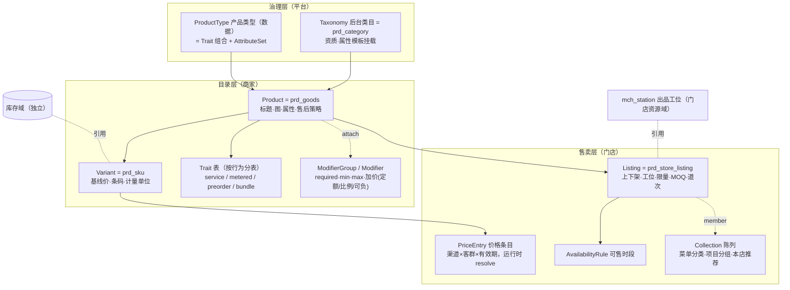

# TDD 商品域 · 完整方案（总入口）

状态：**草稿 · 待确认** · 创建 2026-08-28
性质：**商品域这一轮全部分析的收敛定稿候选。** 此前八份文档是分析过程（文档地图见 §十二），
**从本册起，商品域只看这一份**；细节冲突时以本册为准。

一句话：**一套库、一套接口、一套逻辑，同时服务已准入的七类行业；
行为用 Trait 组合，行业只是数据；从现有系统渐进演进，每一步"存量行为零变化"。**

---

# 一 · 决策记录（全部已裁决项，每条一行理由）

| # | 决策 | 理由 |
|---|---|---|
| 1 | **Catalog / Offer 分离**：Product（是什么，商家级）与 Listing（怎么卖，门店级）两个聚合 | 改价沽清每天几十次、改商品几周一次；审核作用在前者、上下架作用在后者 |
| 2 | **ProductType 是数据，行为是 Trait** | 新行业 = 配数据零发版；新行为 = 一个 Trait 一次发版、三行业同时可用 |
| 3 | **Option 与 Modifier 严格分离**：影响成本或库存身份 → Option（进 SKU）；否则 → Modifier | 判错的代价不对称：SKU 笛卡尔积爆炸 vs 库存成本失真 |
| 4 | **Modifier 不建 Variant**（POS 系） | 加料/做法/指定技师不是可独立售卖的商品；订单行金额 = variant 价 + Σ modifier 快照 |
| 5 | **描述属性走 Schema JSON，行为字段走强类型列；系统逻辑禁读属性袋** | 属性袋没有类型、约束、迁移；行为必须能被引擎强类型消费 |
| 6 | **前台陈列（Collection）与后台类目（Taxonomy）分离** | 类目管资质税务一年不动；菜单分类/项目分组一天三改，是门店级 Collection |
| 7 | **价格用条目模型 + 运行时解析**（`resolve` 是全系统唯一判定处） | 渠道价/会员价/每日定价一个模型全吃；结果进订单快照可复现 |
| 8 | **库存不在商品域**；Listing 的每日限量是流量（每天回满），不是存量 | 用库存表达沽清，第二天要有人记得改回来 |
| 9 | **按实计量结算泛化为 METERED(dimension)**，先落 WEIGHT，TIME/DISTANCE 记账不预建 | 称重/按时/按里程是同一模式；费率表独立成对象 —— 改形状比加形态贵 |
| 10 | **商品级售后策略字段**（实物七天退 / 虚拟不可退 / 服务按取消规则） | 七行业对照发现的共同缺口，三行业梳理也漏了它 |
| 11 | **不开 `/v2` 平行命名空间**，在现有 `/biz` `/mp` 前缀下按「不传=不改」扩展 | 平行宇宙 = 权限矩阵、界面清单、生成器全部两份 |
| 12 | **落法：领域层薄壳（档 A）**，持久层与 2457 行 Service 不重写，校验逐段搬进不变量 | 有测试覆盖（P6）；重构收益薄壳已拿到 |
| 13 | 物理表名**沿用现有**（`prd_goods` 即 Product），新概念用新表；`prd_store_goods → prd_store_listing` 按命名基准既定改名 | 改名的代价高于收益，仅这一处基准已定 |
| 14 | `duration_min` 收敛：**终态在 `prd_trait_service`**，迁移拷贝后旧列废弃删除，不留双源 | 两列并存 = 没人知道读哪个 |
| 15 | 上菜顺序 `course_no` 落 Listing，**标注待观察** | 与拣货波次下游不同，硬合并会造出零售永远为空的字段 |

---

# 二 · 概念模型



**Trait 清单（终版，含已验证业态列 —— 防止 Trait 变成想象出来的抽象）**：

| Trait | 行为 | 已验证业态 | 本期建否 |
|---|---|---|---|
| `SCHEDULED_SERVICE` | 时长/缓冲/资源类型与数量 | 美业、家政、健身、剧本杀 | ✅ |
| `METERED(WEIGHT)` | 按实称重结算 | 零售生鲜、餐饮海鲜 | ✅（形状带 dimension） |
| `METERED(TIME/DISTANCE)` | 按时/按里程 | KTV、搬家 | ❌ 记账不预建 |
| `PREORDER` | 每日截单/到货 | 零售生鲜 | ✅ |
| `BUNDLE(FIXED/CHOICE/SERIES)` | 套餐/可选组/疗程次数 | 餐饮、美业、零售礼盒 | ✅ |
| `REDEEMABLE` | 凭证核销（TIMES/VALUE；PERIOD 期限卡） | 美业次卡、健身会籍 | TIMES/VALUE ✅，PERIOD ❌ 记账 |
| `DAILY_PRICED` | 每日定价 | 餐饮时价菜、生鲜时价 | ✅（由价格条目 valid 窗口承载，不单独建表） |

---

# 三 · 数据库设计（终版）

## 3.1 现有表：沿用与加列

| 现表 | 动作 | 内容 |
|---|---|---|
| `prd_category` | **沿用** | 即 Taxonomy。`template`（五品类）保留，P2 起仅作 ProductType 的种子来源 |
| `prd_goods` | **加列** | `product_type_no`（P2）、`after_sale_policy VARCHAR(24)`、`caution VARCHAR(500)`；FRESH/SERVICE 旧列 P2 迁入 Trait 表后删除 |
| `prd_sku` | **沿用** | Variant。`nominal_gram` P2 迁入 `prd_trait_metered` |
| `prd_store_goods` | **改名** `prd_store_listing` + 加列 | `channels JSON`、`station_no`、`course_no`、`daily_quota`、`quota_used`、`quota_reset`、`moq`、`disabled_modifier_groups JSON` |
| `prd_store_price` | **迁移后退役** | 存量行转为 PriceEntry（store 级、无渠道、无客群） |
| `prd_store_stock` | **沿用** | 库存域边界不动；沽清不再碰它（改走 daily_quota） |
| 规格四层（V195） | **沿用** | Option 轴的物理承载就是 `spec_groups` 快照 + 规格库，**已验证，不重建** |
| `prd_topic` | **沿用** | 平台级 Collection 的现身；门店级 Collection 新建表承载 |

## 3.2 新表

```sql
-- ── 治理 ──────────────────────────────────────────────
CREATE TABLE cat_product_type (
  type_no        VARCHAR(32) PRIMARY KEY,
  name           VARCHAR(64) NOT NULL,          -- 「鲜活海产」「美容项目」「火锅套餐」
  traits         JSON NOT NULL,                 -- 取值域 = 代码 Trait 枚举，启动时校验
  attribute_sets JSON NOT NULL DEFAULT '[]',
  status         VARCHAR(16) NOT NULL DEFAULT 'ACTIVE'
);
-- 种子：由五品类 template 生成五行；TEMPLATE_TO_TYPE 在 P2 退役

-- ── Trait（一个行为一张表；只有挂了的商品有行）────────
CREATE TABLE prd_trait_service (
  product_no        VARCHAR(32) PRIMARY KEY,
  duration_min      INT NOT NULL,
  buffer_before_min INT NOT NULL DEFAULT 0,
  buffer_after_min  INT NOT NULL DEFAULT 0,
  resource_type     VARCHAR(16) NULL,           -- STAFF/SEAT/ROOM（资源域取值）
  resource_count    INT NOT NULL DEFAULT 1      -- 双人服务 = 2
);
CREATE TABLE prd_trait_service_variant (        -- 60/90 分钟档按 Variant 覆盖
  variant_no VARCHAR(32) PRIMARY KEY, duration_min INT NOT NULL
);
CREATE TABLE prd_trait_metered (
  variant_no    VARCHAR(32) PRIMARY KEY,
  dimension     VARCHAR(16) NOT NULL,           -- WEIGHT（本期）/ TIME / DISTANCE（预留）
  nominal_qty   INT NOT NULL,                   -- 标称量（克/分钟/米）
  unit          VARCHAR(8) NOT NULL,
  tolerance_pct INT NULL                        -- 允差，超过须人工确认
);
CREATE TABLE prd_metered_rate (                 -- 费率表：独立成对象（决策 9 的"形状"）
  rate_no    VARCHAR(32) PRIMARY KEY,
  variant_no VARCHAR(32) NOT NULL,
  seq        INT NOT NULL,                      -- 起步段/续步段
  from_qty   INT NOT NULL, step_qty INT NULL, step_price BIGINT NOT NULL,
  time_band  VARCHAR(32) NULL                   -- 分时费率（TIME 维度用），本期恒 NULL
);
CREATE TABLE prd_trait_preorder (
  product_no VARCHAR(32) PRIMARY KEY,
  cutoff_time TIME NOT NULL, lead_days INT NOT NULL DEFAULT 1,
  arrival_desc VARCHAR(128) NULL
);
CREATE TABLE prd_trait_bundle (
  bundle_no VARCHAR(32) PRIMARY KEY,
  product_no VARCHAR(32) NOT NULL,
  kind VARCHAR(16) NOT NULL                     -- FIXED / CHOICE / SERIES
);
CREATE TABLE prd_bundle_component (
  bundle_no VARCHAR(32) NOT NULL,
  group_name VARCHAR(32) NULL, choose_count INT NULL,   -- CHOICE
  variant_no VARCHAR(32) NOT NULL, qty INT NOT NULL DEFAULT 1,
  times INT NULL,                                        -- SERIES 疗程次数
  PRIMARY KEY (bundle_no, variant_no)
);

-- ── Modifier ──────────────────────────────────────────
CREATE TABLE prd_modifier_group (
  group_no  VARCHAR(32) PRIMARY KEY,
  entity_no VARCHAR(32) NOT NULL,               -- 商家级复用；门店经 listing 禁用
  name      VARCHAR(32) NOT NULL,
  selection VARCHAR(8) NOT NULL,                -- SINGLE/MULTI
  required  TINYINT NOT NULL DEFAULT 0,
  min_pick  INT NOT NULL DEFAULT 0, max_pick INT NULL,
  source    VARCHAR(24) NOT NULL DEFAULT 'MANUAL'   -- MANUAL | RESOURCE:STAFF
);
CREATE TABLE prd_modifier (
  modifier_no VARCHAR(32) PRIMARY KEY,
  group_no    VARCHAR(32) NOT NULL,
  name        VARCHAR(32) NOT NULL,
  price_delta BIGINT NULL,                      -- 定额加价（分，可负：自带工具 −10）
  price_delta_pct INT NULL,                     -- 比例加价（加急 +50）。与定额二选一
  ref_no      VARCHAR(32) NULL,                 -- RESOURCE 源的外部键
  is_default  TINYINT NOT NULL DEFAULT 0, sort INT NOT NULL DEFAULT 0
);
CREATE TABLE prd_goods_modifier_group (
  product_no VARCHAR(32) NOT NULL, group_no VARCHAR(32) NOT NULL,
  sort INT NOT NULL DEFAULT 0, PRIMARY KEY (product_no, group_no)
);

-- ── 售卖 ──────────────────────────────────────────────
CREATE TABLE sell_price_entry (
  entry_no   VARCHAR(32) PRIMARY KEY,
  variant_no VARCHAR(32) NOT NULL,
  store_no   VARCHAR(32) NULL,                  -- NULL = 商家级
  channel    VARCHAR(16) NULL,                  -- NULL = 全渠道（DINE_IN/TAKEOUT/DELIVERY/HOME/ONLINE）
  tier       VARCHAR(16) NULL,                  -- NULL = 全客群（MEMBER/FIRST_ORDER）
  price      BIGINT NOT NULL, currency VARCHAR(3) NOT NULL DEFAULT 'CNY',
  valid_from DATETIME NULL, valid_to DATETIME NULL,   -- 每日定价 = 圈住当天
  KEY idx_price_lookup (variant_no, store_no, channel, tier, valid_from)
);
CREATE TABLE sell_availability_rule (
  rule_no VARCHAR(32) PRIMARY KEY,
  store_no VARCHAR(32) NOT NULL, name VARCHAR(32) NOT NULL,
  days_mask VARCHAR(7) NOT NULL, start_min INT NOT NULL, end_min INT NOT NULL,
  channels JSON NULL
);
CREATE TABLE sell_listing_availability (
  listing_no VARCHAR(32) NOT NULL, rule_no VARCHAR(32) NOT NULL,
  PRIMARY KEY (listing_no, rule_no)             -- 零行 = 全时段
);
CREATE TABLE sell_collection (
  collection_no VARCHAR(32) PRIMARY KEY,
  owner_type VARCHAR(8) NOT NULL,               -- PLATFORM / STORE
  owner_no   VARCHAR(32) NOT NULL,
  name VARCHAR(32) NOT NULL,
  kind VARCHAR(8) NOT NULL DEFAULT 'MANUAL',    -- MANUAL / SMART
  rule JSON NULL, sort INT NOT NULL DEFAULT 0
);
CREATE TABLE sell_collection_item (
  collection_no VARCHAR(32) NOT NULL, product_no VARCHAR(32) NOT NULL,
  sort INT NOT NULL DEFAULT 0, pinned TINYINT NOT NULL DEFAULT 0,
  PRIMARY KEY (collection_no, product_no)
);

-- ── 门店资源域 ────────────────────────────────────────
CREATE TABLE mch_station (
  station_no VARCHAR(32) PRIMARY KEY,
  store_no VARCHAR(32) NOT NULL, name VARCHAR(32) NOT NULL,
  kind VARCHAR(16) NOT NULL,                    -- KITCHEN / PICKING / SERVICE
  sort INT NOT NULL DEFAULT 0
);
```

**兼容铁律**：所有新表「零行 = 旧行为」，所有加列「NULL = 旧行为」。
存量 73 类目与全部存量商品在每个阶段落地当天**行为零变化**。
迁移操作三条既有教训：加列必须同步实体字段（entity-alignment 守卫）；
并行会话撞 Flyway 号，改号后 `clean package`；H2 绿 ≠ MariaDB 对。

---

# 四 · 领域对象（终版）

```
product/domain/（纯 POJO，ArchUnit 禁 import MyBatis/Spring/BaseEntity）
├── Product                聚合根（≈ prd_goods + traits + modifier 引用）
│    ├── traits(): Set<Trait>   ServiceTrait/MeteredTrait/PreorderTrait/BundleTrait —— 强类型
│    ├── attributes: Attributes （Schema 校验；系统逻辑禁读）
│    └── validate() → ProductInvariants
├── ModifierGroup          聚合根（可复用 → 独立生命周期）
├── Listing                聚合根（≈ prd_store_listing + availability 引用）
├── Collection             聚合根（MANUAL 持 items / SMART 持 rule）
├── PriceBook              无状态解析器：resolve(variantNo, ctx) → Money
└── vo/  Money(minor,currency)  Duration  Quota(limit,used)  Metered(dim,nominal,rates)
         ProductNo/VariantNo/ListingNo…（类型化业务键）
```

**不变量（集中在 `ProductInvariants`，共 14 条）**：

| # | 不变量 |
|---|---|
| 1 | Variant 取值与规格轴一一对应；单规格恰一条 |
| 2 | Trait 数据必须与 ProductType 声明一致（**双向**：没声明的不得有行，声明了的必须有行） |
| 3 | 系统代码禁读 attributes（ArchUnit 拦） |
| 4 | Modifier：required ⇒ min_pick ≥ 1；min ≤ max；定额与比例二选一 |
| 5 | Modifier 负加价后**订单行合计不得为负** |
| 6 | RESOURCE 源的 Modifier 选项只读（由资源域同步） |
| 7 | Bundle 子项同主体；SERIES 必有 times；CHOICE 每组必有 choose_count |
| 8 | Metered 的费率段连续无重叠；WEIGHT 之外的 dimension 本期拒绝写入 |
| 9 | 价格解析必须命中且仅命中一条（most-specific-wins 是全序：store > 渠道 > 客群 > 时间窗） |
| 10 | Quota 扣减条件 UPDATE 判影响行数；与库存互不影响 |
| 11 | 门店价条目必须属于该门店已上架商品 |
| 12 | 引用标准品时类目与 optionCode 以标准品为准 |
| 13 | 售后策略取值域受 `AfterSalePolicies` 常量约束 |
| 14 | Listing 状态迁移唯一判定处（ON/OFF/PLATFORM_SUSPENDED，平台挂起商家不可自行解除） |

---

# 五 · Service 层（终版）

| Service | 归属 | 职责 | 与现状关系 |
|---|---|---|---|
| `MerchantGoodsService` | 目录写 | 建品/编辑/送审/审核（含 traits、modifiers 引用段） | **沿用**，校验逐段搬入 `ProductInvariants`（档 A） |
| `SpecLibraryService` | 目录写 | 规格四层 | **不动** |
| `ModifierCatalogService` | 目录写 | 选配组 CRUD、attach、RESOURCE 源同步 | 新建 |
| `ListingService` | 售卖写 | 上下架、工位、道次、MOQ、限量、沽清、渠道 | 新建（从 MerchantGoodsService 迁出门店职责） |
| `PricingService` | 售卖写+判定 | 条目 CRUD；**`resolve(variantNo, ctx)` 全系统唯一价格判定处**（购物车/下单/退款都调它） | 新建；`prd_store_price` 读写迁入后退役 |
| `AvailabilityService` | 售卖写 | 时段规则 CRUD、`isAvailable(listing, at, channel)` | 新建 |
| `CollectionService` | 售卖写 | 陈列分组；SMART 规则由 JobHandler 定时物化 | 新建 |
| `FormSchemaService` | 读 | 建品表单 = ProductType 的 traits + attributeSets 派生；按门店能力过滤 | 新建 |
| `CatalogQueryService` | 读 | `storefront(store, channel, at)` 合成视图（陈列×时段×沽清×价格服务端算完）；详情；搜索走投影 | 新建 |
| Job | 任务 | 配额营业日归零（幂等）；SMART Collection 物化；投影刷新 | `JobHandler` 挂接 |

**边界**：库存扣减在库存域；订单行展开 modifier 在交易域；duration 算占位格数在预约域；
station 路由匹配在打印/拣货域 —— **商品域只提供数据与判定，不编排。**

---

# 六 · API（终版，现有前缀下扩展）

**原则**：端点语义动作用 `:verb`；写带幂等键；「不传 = 不改」；不开 `/v2`。

```
# ── 沿用并扩展 ──
POST /biz/goods/save            SaveCommand 增段：traits{service|metered|preorder|bundle}、
                                modifierGroupNos、afterSalePolicy、caution（全部不传=不改）
GET  /biz/goods /biz/goods/{no} 返回增 traits/modifiers/afterSalePolicy 段
POST /biz/goods/{no}/submit|toggle|store-price(过渡)   语义不变

# ── 新增：目录 ──
GET/POST /biz/modifier-groups                选配组（商家级）
POST     /biz/goods/{no}/modifier-groups:attach
GET      /biz/goods/form-schema?categoryNo=&storeNo=   建品表单唯一来源（b-app 弃 type 硬渲染）

# ── 新增：售卖（作用域=门店）──
POST /biz/stores/{storeNo}/listings:activate|:delist   批量上下架
PUT  /biz/listings/{listingNo}               工位/道次/MOQ/渠道/限量
POST /biz/listings/{listingNo}:sold-out      沽清（今日 quota 置 0，次日任务回满）
GET/PUT /biz/stores/{storeNo}/availability-rules
GET/PUT /biz/stores/{storeNo}/collections    菜单分类/项目分组/本店推荐
PUT  /biz/price-entries:batch                改价（渠道/客群/每日定价共用）
GET  /biz/price:resolve?variantNo=&storeNo=&channel=&tier=   判定处的调试出口

# ── C 端 ──
GET /mp/storefront/{storeNo}?channel=&at=    合成视图（端上不拼）
GET /mp/goods/{no}                           增 modifiers（按 visibleToBuyer 裁剪）与售后策略展示

# ── 运营 ──
GET/PUT /ops/product-types                   ProductType（改 traits 是危险动作，走审批）
```

新增端点全部登记 `scripts/perm-endpoint-map.mjs` 并重跑生成器（pre-push 闸）；
界面变更重跑 `gen-ui-catalog.py`。**b-app 建品页改读 form-schema 与后端段落地同 PR** ——
否则"配了没生效"且不报错。

---

# 七 · 行业覆盖（验证快照）

| 行业/业态 | 覆盖方式 | 缺口 |
|---|---|---|
| 零售（基线） | 现有能力 + 本方案六项新增（分组/时段/选配/工位/限量/MOQ） | 无 |
| 餐饮 | 同一套：做法加料=Modifier、菜单分类=Collection、时段菜单=Availability、出品部门=Station、沽清=Quota、海鲜=METERED(WEIGHT)、堂食外卖价=渠道条目 | 无（商品域零行业代码） |
| 美业 | 同一套：时长缓冲=SERVICE Trait、指定技师=Modifier(RESOURCE)、疗程=BUNDLE(SERIES)、项目分组=Collection | 无（商品域零行业代码） |
| 家政/维修/洗衣/宠物 | 51% 直接覆盖；上门费先收后抵与"定金尾款"共用（交易域）；寄养按晚归预约域 | METERED(TIME) 记账 |
| 娱乐（KTV/健身/剧本杀） | 会籍=REDEEMABLE(PERIOD) 记账；团课名额=预约域已有；私教分级价 ≡ 指定技师 | METERED(TIME) 记账 |
| 搬家/虚拟 | 车型档=Option；附加费=Modifier；虚拟=VIRTUAL 类型 | METERED(DISTANCE) 记账 |

**记账不预建**：METERED(TIME/DISTANCE)、REDEEMABLE(PERIOD)、周期单 —— 对应业态入驻才施工，
但形状（费率表对象、card_kind 枚举位）已在本方案预留。

---

# 八 · 演进路线（四阶段，每段独立可停、可回退）

| 阶段 | 内容 | 验收闸门 |
|---|---|---|
| **P0 底座** | 全部新表建出（零行）；`prd_store_goods → prd_store_listing` 改名（协同迁移，pathspec 全仓核对）；`prd_goods` 加三列；领域层 `domain/` + `assembler/` 落地（不接调用方） | **什么都没变**：存量全量测试一条不改全绿；`entity→domain→entity` 逐字段相等 |
| **P1 售卖层** | Collection / Availability / Modifier / Quota+沽清 / MOQ / 渠道与客群价格条目 + `PricingService.resolve`（新读旧写双轨→切换→退役 `prd_store_price`）+ form-schema + b-app 建品页（同 PR） | 三行业各一条场景在 `-Pcore-only` 下全绿；零售回归逐字节相同；撤掉 resolve 用例必须变红 |
| **P2 类型与 Trait** | `cat_product_type` 种子五行；Trait 表建 + 存量 FRESH/SERVICE/称重列**一次性迁移→旧列删除**（不留双源）；`TEMPLATE_TO_TYPE` 退役；`ProductInvariants` 校验搬迁完成 | 迁移前后读结果逐字节相同；不变量 2 的双向校验生效；`prd_goods.type` 保留为查询缓存列 |
| **P3 读侧** | `storefront` 合成视图；搜索投影（filterable 属性）；`CatalogQueryService` 接管 C 端读 | C 端首页与详情响应对比零 diff；投影延迟指标上线 |

**P1 与 P2 可换序**（P1 交付业务价值大，先做）；每阶段迁移分批提交防撞号。

---

# 九 · 测试与闸门（合并版）

**单元**：14 条不变量各至少一条正反用例；价格解析 most-specific 决胜全序表驱动；
Quota 并发扣减（两人抢最后一份只成一个）；跨夜时段拆条；Modifier 负加价合计不为负；
METERED 费率段连续性；Bundle 三形态。

**场景（同一套接口跑三行业）**：
零售建品→审→上架→改价→下单逐字节回归；餐饮建菜配齐五件套→扫码点单→分单命中；
美业项目→指定技师加价→占位格数正确；**跨行业主体一次查询同返**。

**闸门**：
1. `-Pcore-only` 三行业场景全绿（一套库为真的唯一硬判据）；
2. ArchUnit：`product.domain.**` 禁 import 框架与 BaseEntity；基座禁 import 行业包；系统代码禁读 attributes；
3. form-schema 契约测试：字段集与 SaveCommand 一致（前后端分岔唯一防线）；
4. 反向验证：撤掉任一新判定（能力拒收、quota 条件 UPDATE、resolve），对应用例必须变红且点名正确；
5. pre-push 既有闸：权限矩阵逐格、界面清单、`vue-tsc`。

---

# 十 · 术语层

模型统一是给系统的，叫法分行业是给人的。词条 = i18n × 行业维度的**数据**，
由 form-schema 按门店行业码下发，b-app 原样渲染。全表见[对齐清单](../reference/商品域-多行业对齐清单.md) §四
（Collection→菜单分类/项目分组、Station→出品部门/服务区、Quota→沽清份数/每日可约……）。

---

# 十一 · 待确认（唯余业务问题，技术项已全部裁决）

1. 平台审核是否覆盖 Trait 字段（服务时长变更买家可感，出品工位不用审）→ 决定重审策略按字段细化与否；
2. Modifier 的 `visibleToBuyer` 由谁配（平台默认 + 商家可改？）；
3. 跨行业主体建品：按门店出表单 ⇒ 建品第一屏要不要先选店（影响 b-app 交互）；
4. 渠道取值域定稿（DINE_IN/TAKEOUT/DELIVERY/HOME/ONLINE 五个够不够，与 PayScenes 对不对齐）；
5. 售后策略取值域细则（实物/虚拟/服务三档之下要不要更细）；
6. 改段/改 Trait 是否进商品变更留痕（公共字段已有留痕）。

---

# 十二 · 文档地图（本册之下）

| 文档 | 角色 |
|---|---|
| **本册** | **唯一入口与定稿候选** |
| [商品域-三行业功能梳理与对齐](./商品域-三行业功能梳理与对齐.md) · [商品域-七行业需求与V2对照](./商品域-七行业需求与V2对照.md) | 需求依据（保留） |
| [商品域-多行业对齐清单](../reference/商品域-多行业对齐清单.md) | 标准名与术语层（保留，落点以本册为准） |
| [TDD-商品域V2-多行业一体化方案](./TDD-商品域V2-多行业一体化方案.md) | 清室参照（保留；其 §三 DDL 被本册 §三 取代） |
| [TDD-统一商品模型-三行业合并](./TDD-统一商品模型-三行业合并.md) · [TDD-商品领域模型-继承与数据库对标](./TDD-商品领域模型-继承与数据库对标.md) | 分析过程（被本册吸收） |
| ~~商品域-三行业一套接口~~ · ~~TDD-多行业商品域-一套逻辑一套接口~~ | 已标注取代 |

---
确认记录：待确认
