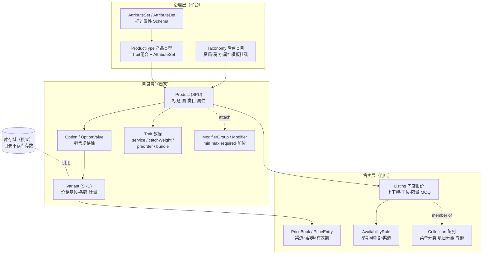

# TDD 商品域 V2.0 —— 多行业一体化方案（清室设计）

状态：**草稿 · 待确认** · 创建 2026-08-28
性质：**清室设计（clean-room）**。本册刻意不从现有实现出发，而从业界最佳实践正向推导
「一个同时服务零售 / 餐饮 / 服务业的商品域该长什么样」。与现行仓库的关系见 §十一。

参照系（每条设计决策都标注出处）：

| 参照 | 借什么 |
|---|---|
| 淘宝/天猫类目体系 | SPU/SKU 分层；**前台类目与后台类目分离** |
| Shopify | Product / Option / Variant 三层；Collection（含 smart collection） |
| Square Catalog & Appointments | **Modifier List** 模型；服务商品的时长/缓冲/资源；批量 upsert API |
| Toast POS | 菜单排期（menu schedule）；出品工位路由 |
| commercetools | **Product Type + Attribute Schema**（类型即数据）；Price 的上下文选择 |
| Medusa / Saleor | Price List（渠道 × 客群 × 有效期）；Sales Channel |
| Amazon marketplace | **Catalog 与 Offer 分离**（ASIN vs offer） |
| Fresha / Booksy | 服务目录：时长、资源、疗程（series/package） |

---

# 一 · 五条根设计决策

整个方案由五条决策撑起来。后面所有表、类、接口都是这五条的展开。

## D1 · Catalog 与 Offer 分离（Amazon / commercetools）

**「这是什么东西」与「怎么卖它」是两个生命周期完全不同的对象。**

```
Product（目录）＝ 它是什么：标题、类目、属性、规格、图
Listing（报价）＝ 怎么卖它：哪家店、什么价、什么时段、卖多少、谁来做
```

- Product 归商家（跨门店共享定义），Listing 归门店；
- 改价、沽清、调时段发生在 Listing，**频率是每天几十次**；改 Product 是几周一次；
- 审核作用在 Product（内容合规），上下架作用在 Listing（经营决策）—— 两件事从此不再互相拖累。

## D2 · Product Type 是数据，行为是 Trait（commercetools + Square）

不硬编码「五品类」枚举。**产品类型（Product Type）是一行数据**，它声明两件事：

1. 挂哪些 **Trait**（行为特征，有限集合、代码实现）；
2. 挂哪些 **Attribute Set**（描述属性模板，纯数据）。

```
Trait（行为，代码消费，强类型）：
  SCHEDULED_SERVICE   要排期：时长/缓冲/资源      —— 服务业项目、上门维修
  CATCH_WEIGHT        按重计价：标称重/实称/差价    —— 生鲜、海鲜
  PREORDER            预售截单：截单时间/到货说明
  DAILY_PRICED        每日定价：时价菜、生鲜时价
  BUNDLE              组合：套餐/疗程/礼盒
  REDEEMABLE          凭证核销：次卡、储值卡

产品类型 = Trait 组合（数据）：
  「日用百货」 = {}
  「鲜活海产」 = {CATCH_WEIGHT, DAILY_PRICED}
  「美容项目」 = {SCHEDULED_SERVICE}
  「面部疗程」 = {SCHEDULED_SERVICE, BUNDLE}
  「火锅套餐」 = {BUNDLE}
```

**为什么这样切**：行为必须是强类型的（预约引擎要读时长，不能从属性袋里捞）；
但「哪种商品有哪些行为」是运营决策，会随行业扩张而变 —— 让它是数据，
新行业上线 = 配几行产品类型，**不发版**。Trait 集合本身的扩张才需要发版，而那是低频的。

## D3 · Option 与 Modifier 严格分离（Shopify vs Square）

两个长得像、后果完全不同的概念，业界的共识是**分成两个模型**：

| | Option（销售规格） | Modifier（选配） |
|---|---|---|
| 例 | 大杯/中杯、红色/蓝色、60min/90min | 加珍珠 +2、免辣、指定总监 +50、礼盒包装 |
| 改变什么 | **商品的身份**：不同 Variant、不同价、不同库存 | 订单行的**附加**：不产生新 Variant |
| 落点 | 进 SKU 矩阵 | 进订单行的 modifier 明细 |
| 判据 | **影响成本或库存身份 → Option；否则 → Modifier** | |

判错的代价不对称：把 Modifier 建成 Option，SKU 笛卡尔积爆炸（3 个做法 = 8 倍 SKU）；
把 Option 建成 Modifier，库存与成本失真。**判据要出现在建品界面的帮助文案里，不能只在文档里。**

## D4 · 属性分两种：描述属性走 Schema，行为字段走强类型列

| | 描述属性（Attribute） | 行为字段（Trait 字段） |
|---|---|---|
| 例 | 产地、材质、保质期、酒精度 | 服务时长、标称克重、截单时间 |
| 谁消费 | **买家**（详情页展示、筛选、比较） | **系统**（预约引擎、称重结算、打印路由） |
| 存法 | Schema 校验的 JSON（commercetools 式） | Trait 表的强类型列 |
| 扩展 | 运营配 Attribute Set，不发版 | 发版（有限、低频） |

**铁律：系统逻辑永远不读属性袋。** 属性袋只进详情页与搜索索引。
这条不守，属性袋会慢慢变成第二套字段系统，而它没有类型、没有约束、没有迁移。

## D5 · 前台陈列与后台类目分离（淘宝）

| | 后台类目（Taxonomy） | 前台陈列（Collection） |
|---|---|---|
| 归属 | 平台 | 平台 + **门店** |
| 职责 | 治理：资质、税务、佣金、属性模板挂载 | 展示：首页专题、**店内菜单分类、项目分组** |
| 稳定性 | 一年不动 | 一天三改 |
| 关系 | 一件商品**恰好一个**后台类目 | 可属**多个** Collection |

餐饮的「菜单分类」、美业的「项目分组」、零售的「本店推荐」都是**门店级 Collection** ——
不是类目，也不该是类目。Collection 支持手工（选品）与规则（smart：按类目/标签/价格自动圈品）。

---

# 二 · 概念模型总图



**库存不在商品域**（Square / Medusa 同此）：目录只持 Variant 的身份，库存数、锁定、
预占在独立的库存域。Listing 上的「每日限量」是**售卖概念**（流量，每天回满），不是库存（存量）。

---

# 三 · 数据库设计

约定：`id` 为内部主键不对外；对外一律业务键 `*_no`；审计四列 + 乐观锁 + 软删每表都有（下略）；
金额一律最小货币单位整数 + 币种。前缀：治理 `cat_`、目录 `prd_`、售卖 `sell_`。

## 3.1 治理层

```sql
CREATE TABLE cat_taxonomy_node (             -- 后台类目（平台树）
  node_no        VARCHAR(32) PRIMARY KEY,
  parent_no      VARCHAR(32) NULL,
  name           VARCHAR(64) NOT NULL,
  level          INT NOT NULL,
  qualification  JSON NULL,                  -- 经营该类目需要的资质要求
  status         VARCHAR(16) NOT NULL DEFAULT 'ACTIVE'
);

CREATE TABLE cat_product_type (              -- 产品类型 = 行为画像（数据！）
  type_no        VARCHAR(32) PRIMARY KEY,
  name           VARCHAR(64) NOT NULL,       -- 「鲜活海产」「美容项目」「火锅套餐」
  traits         JSON NOT NULL,              -- ["CATCH_WEIGHT","DAILY_PRICED"] 取值域=代码里的 Trait 枚举
  attribute_sets JSON NOT NULL DEFAULT '[]', -- 挂载的描述属性集
  status         VARCHAR(16) NOT NULL DEFAULT 'ACTIVE'
);
-- 类目 → 默认产品类型（建品时带出，可改）
CREATE TABLE cat_taxonomy_product_type (
  node_no VARCHAR(32) NOT NULL,
  type_no VARCHAR(32) NOT NULL,
  is_default TINYINT NOT NULL DEFAULT 0,
  PRIMARY KEY (node_no, type_no)
);

CREATE TABLE cat_attribute_def (             -- 描述属性定义
  attr_no    VARCHAR(32) PRIMARY KEY,
  set_no     VARCHAR(32) NOT NULL,           -- 所属属性集
  name       VARCHAR(64) NOT NULL,           -- 「产地」「酒精度」「适用肤质」
  value_type VARCHAR(16) NOT NULL,           -- TEXT/NUMBER/ENUM/MULTI_ENUM/BOOL
  options    JSON NULL,                      -- ENUM 的枚举值池（平台维护 → 跨店可比、可筛选）
  unit       VARCHAR(16) NULL,
  filterable TINYINT NOT NULL DEFAULT 0,
  required   TINYINT NOT NULL DEFAULT 0
);
```

## 3.2 目录层

```sql
CREATE TABLE prd_product (                   -- SPU
  product_no  VARCHAR(32) PRIMARY KEY,
  entity_no   VARCHAR(32) NOT NULL,          -- 归属商家主体
  type_no     VARCHAR(32) NOT NULL,          -- → cat_product_type
  node_no     VARCHAR(32) NOT NULL,          -- → cat_taxonomy_node（恰好一个）
  title       VARCHAR(128) NOT NULL,
  title_i18n  JSON NULL,
  subtitle    VARCHAR(255) NULL,
  media       JSON NOT NULL DEFAULT '[]',    -- [{url,role:MAIN/GALLERY/DETAIL,sort}]
  detail      TEXT NULL,                     -- 纯文本（收 HTML 要三端消毒）
  attributes  JSON NOT NULL DEFAULT '{}',    -- 描述属性，按 AttributeSet Schema 校验（D4）
  caution     VARCHAR(500) NULL,             -- 禁忌/注意事项：交易前置弹出，不是详情段落
  audit_state VARCHAR(16) NOT NULL DEFAULT 'DRAFT',  -- DRAFT/PENDING/APPROVED/REJECTED
  KEY idx_prd_product_entity (entity_no, audit_state)
);

CREATE TABLE prd_option (                    -- 销售规格轴（Shopify Option）
  option_no  VARCHAR(32) PRIMARY KEY,
  product_no VARCHAR(32) NOT NULL,
  name       VARCHAR(32) NOT NULL,           -- 「杯型」「颜色」「时长档」
  sort       INT NOT NULL DEFAULT 0
);
CREATE TABLE prd_option_value (
  value_no  VARCHAR(32) PRIMARY KEY,
  option_no VARCHAR(32) NOT NULL,
  name      VARCHAR(32) NOT NULL,            -- 「大杯」
  sort      INT NOT NULL DEFAULT 0
);

CREATE TABLE prd_variant (                   -- SKU
  variant_no    VARCHAR(32) PRIMARY KEY,
  product_no    VARCHAR(32) NOT NULL,
  option_values JSON NOT NULL DEFAULT '[]',  -- [value_no...]，与 Option 轴一一对应
  base_price    BIGINT NOT NULL,             -- 基线价（分）。上下文价在 sell_price_entry
  currency      VARCHAR(3) NOT NULL DEFAULT 'CNY',
  compare_price BIGINT NULL,                 -- 划线价
  cost_price    BIGINT NULL,
  barcode       VARCHAR(32) NULL,
  seller_sku    VARCHAR(64) NULL,            -- 商家货号（ERP/收银秤的通用键）
  sale_unit     VARCHAR(16) NULL,            -- 份/例/斤/次/位
  status        VARCHAR(16) NOT NULL DEFAULT 'ACTIVE',
  UNIQUE KEY uk_variant_product_values (product_no, option_values(255))
);
```

**Trait 数据 —— 一个 Trait 一张表**（不进宽表；只有挂了该 Trait 的商品有行）：

```sql
CREATE TABLE prd_trait_service (             -- SCHEDULED_SERVICE
  product_no        VARCHAR(32) PRIMARY KEY,
  duration_min      INT NOT NULL,
  buffer_before_min INT NOT NULL DEFAULT 0,
  buffer_after_min  INT NOT NULL DEFAULT 0,
  resource_type     VARCHAR(16) NULL,        -- STAFF/SEAT/ROOM（资源域取值）
  resource_count    INT NOT NULL DEFAULT 1   -- 双人服务 = 2
);
-- ⚠️ 时长按 Variant 覆盖：60min/90min 档是 Option，各 Variant 可覆盖时长
CREATE TABLE prd_trait_service_variant (
  variant_no   VARCHAR(32) PRIMARY KEY,
  duration_min INT NOT NULL
);

CREATE TABLE prd_trait_catch_weight (        -- CATCH_WEIGHT
  variant_no   VARCHAR(32) PRIMARY KEY,      -- 挂 Variant：整鱼和切片的标称重不同
  nominal_gram INT NOT NULL,
  tolerance_pct INT NULL                     -- 允差，超过必须人工确认
);

CREATE TABLE prd_trait_preorder (            -- PREORDER
  product_no   VARCHAR(32) PRIMARY KEY,
  cutoff_time  TIME NOT NULL,                -- 每日截单点
  lead_days    INT NOT NULL DEFAULT 1,
  arrival_desc VARCHAR(128) NULL
);

CREATE TABLE prd_trait_bundle (              -- BUNDLE：固定/可选组/次数 三形态
  bundle_no    VARCHAR(32) PRIMARY KEY,
  product_no   VARCHAR(32) NOT NULL,
  kind         VARCHAR(16) NOT NULL          -- FIXED / CHOICE / SERIES
);
CREATE TABLE prd_bundle_component (
  bundle_no    VARCHAR(32) NOT NULL,
  group_name   VARCHAR(32) NULL,             -- CHOICE：「主食三选一」的组名
  choose_count INT NULL,                     -- CHOICE：选几个
  variant_no   VARCHAR(32) NOT NULL,         -- 子项（必须同主体，跨主体结算无解）
  qty          INT NOT NULL DEFAULT 1,
  times        INT NULL,                     -- SERIES：疗程次数
  PRIMARY KEY (bundle_no, variant_no)
);
```

**Modifier（Square 模型原样）**：

```sql
CREATE TABLE prd_modifier_group (
  group_no   VARCHAR(32) PRIMARY KEY,
  entity_no  VARCHAR(32) NOT NULL,           -- 商家级，可跨店复用；门店可禁用
  name       VARCHAR(32) NOT NULL,           -- 「辣度」「加料」「指定技师」「包装」
  selection  VARCHAR(8) NOT NULL,            -- SINGLE / MULTI
  required   TINYINT NOT NULL DEFAULT 0,     -- 必选：奶茶不选甜度不让下单
  min_pick   INT NOT NULL DEFAULT 0,
  max_pick   INT NULL,
  source     VARCHAR(24) NOT NULL DEFAULT 'MANUAL'
             -- MANUAL | RESOURCE:STAFF（选项动态取自资源域：指定技师）
);
CREATE TABLE prd_modifier (
  modifier_no VARCHAR(32) PRIMARY KEY,
  group_no    VARCHAR(32) NOT NULL,
  name        VARCHAR(32) NOT NULL,
  price_delta BIGINT NOT NULL DEFAULT 0,     -- 加价（分），0 = 免费选配
  ref_no      VARCHAR(32) NULL,              -- source 非 MANUAL 时的外部键（resource_no）
  is_default  TINYINT NOT NULL DEFAULT 0,
  sort        INT NOT NULL DEFAULT 0
);
CREATE TABLE prd_product_modifier_group (    -- 商品 ↔ 选配组（组可复用）
  product_no VARCHAR(32) NOT NULL,
  group_no   VARCHAR(32) NOT NULL,
  sort       INT NOT NULL DEFAULT 0,
  PRIMARY KEY (product_no, group_no)
);
```

> Modifier 的 `price_delta` 直接落在订单行的 modifier 明细上（快照），
> **不要求为每个加料造 Variant** —— 这是 Square/Toast 与 Shopify 的分野，
> POS 系的做法对餐饮/服务业是对的：加料不是一个可独立售卖的商品。
> 代价：订单行金额 = variant 价 + Σ modifier 快照，金额链要认这个公式（§十.2）。

## 3.3 售卖层

```sql
CREATE TABLE sell_listing (                  -- 门店报价：Offer
  listing_no    VARCHAR(32) PRIMARY KEY,
  store_no      VARCHAR(32) NOT NULL,
  product_no    VARCHAR(32) NOT NULL,
  state         VARCHAR(16) NOT NULL DEFAULT 'OFF',   -- ON / OFF / PLATFORM_SUSPENDED
  channels      JSON NULL,                   -- 可售渠道；空 = 全部（DINE_IN/TAKEOUT/DELIVERY/HOME/ONLINE）
  station_no    VARCHAR(32) NULL,            -- 出品工位（门店资源域）→ 厨打/拣货路由
  course_no     INT NULL,                    -- 上菜道次（POS: course）
  daily_quota   INT NULL,                    -- 每日限量；沽清 = 今日置 0；NULL = 不限
  quota_used    INT NOT NULL DEFAULT 0,      -- 今日已用（营业日切换归零，条件 UPDATE 扣）
  moq           INT NULL,                    -- 最小起订量
  disabled_modifier_groups JSON NULL,        -- 门店禁用某些选配组（总部配的，分店没有）
  UNIQUE KEY uk_listing (store_no, product_no)
);

CREATE TABLE sell_price_entry (              -- 上下文价（Medusa price list）
  entry_no    VARCHAR(32) PRIMARY KEY,
  variant_no  VARCHAR(32) NOT NULL,
  store_no    VARCHAR(32) NULL,              -- NULL = 商家级（全店生效）
  channel     VARCHAR(16) NULL,              -- NULL = 全渠道
  tier        VARCHAR(16) NULL,              -- NULL = 全客群；MEMBER / FIRST_ORDER
  price       BIGINT NOT NULL,
  currency    VARCHAR(3) NOT NULL DEFAULT 'CNY',
  valid_from  DATETIME NULL,                 -- 每日定价 = valid_from/to 圈住当天
  valid_to    DATETIME NULL,
  KEY idx_price_lookup (variant_no, store_no, channel, tier, valid_from)
);
-- 解析规则（代码里唯一一处）：候选 = 时间窗内所有行；
-- 最specific者胜：store>NULL, channel>NULL, tier>NULL；全无 → variant.base_price

CREATE TABLE sell_availability_rule (        -- 可售时段（Toast menu schedule）
  rule_no   VARCHAR(32) PRIMARY KEY,
  store_no  VARCHAR(32) NOT NULL,
  name      VARCHAR(32) NOT NULL,            -- 「午市」「早市特价档」
  days_mask VARCHAR(7)  NOT NULL,            -- 1111100
  start_min INT NOT NULL,                    -- 跨夜拆两条
  end_min   INT NOT NULL,
  channels  JSON NULL
);
CREATE TABLE sell_listing_availability (
  listing_no VARCHAR(32) NOT NULL,
  rule_no    VARCHAR(32) NOT NULL,
  PRIMARY KEY (listing_no, rule_no)
);           -- 零行 = 全时段可售

CREATE TABLE sell_collection (               -- 前台陈列（门店级 + 平台级）
  collection_no VARCHAR(32) PRIMARY KEY,
  owner_type    VARCHAR(8)  NOT NULL,        -- PLATFORM / STORE
  owner_no      VARCHAR(32) NOT NULL,
  name          VARCHAR(32) NOT NULL,        -- 「热菜」「面部护理」「本店推荐」
  kind          VARCHAR(8)  NOT NULL DEFAULT 'MANUAL',  -- MANUAL / SMART
  rule          JSON NULL,                   -- SMART：按类目/标签/价格圈品
  sort          INT NOT NULL DEFAULT 0
);
CREATE TABLE sell_collection_item (
  collection_no VARCHAR(32) NOT NULL,
  product_no    VARCHAR(32) NOT NULL,
  sort          INT NOT NULL DEFAULT 0,
  pinned        TINYINT NOT NULL DEFAULT 0,  -- 招牌置顶
  PRIMARY KEY (collection_no, product_no)
);
```

**这套库如何回答三行业的问题**（抽样验证）：

| 场景 | 走哪些表 |
|---|---|
| 奶茶：大杯/小杯 × 甜度必选 × 加珍珠+2 | Option/Variant + ModifierGroup(required, SINGLE) + Modifier(price_delta=200) |
| 时价海鲜按斤 | Trait CATCH_WEIGHT + DAILY_PRICED（sell_price_entry 圈当天）|
| 美容疗程 10 次、总监加价 | Trait SERVICE + BUNDLE(SERIES, times=10) + ModifierGroup(source=RESOURCE:STAFF) |
| 午市套餐只在 11:00–14:00 堂食卖 | BUNDLE(CHOICE) + availability_rule + listing.channels |
| 分店没有水吧、菜单分类不同 | listing.station_no 门店级 + STORE Collection |
| 零售会员价、早市特价 | price_entry(tier=MEMBER) / (valid_from + availability) |

---

# 四 · 领域对象

```
catalog.domain（纯 POJO，零框架依赖）
│
├── Product                       聚合根：目录
│     ├── ProductType typeRef    （行为画像引用）
│     ├── Set<Trait> traits()    （由 type 展开，强类型对象）
│     │      ServiceTrait / CatchWeightTrait / PreorderTrait / BundleTrait
│     ├── List<Option> options
│     ├── List<Variant> variants
│     ├── Attributes attributes  （Schema 校验的描述属性）
│     ├── List<GroupRef> modifierGroups
│     └── validate()             （不变量见下）
│
├── ModifierGroup                 聚合根：选配组（可复用 → 独立生命周期）
│     └── List<Modifier>
│
├── Listing                       聚合根：门店报价
│     ├── ListingState state
│     ├── Quota dailyQuota       （流量，不是库存）
│     ├── StationRef / CourseNo
│     └── availability: List<RuleRef>
│
├── PriceBook                     领域服务持有的解析器（无状态）
│     └── resolve(variantNo, ctx{store,channel,tier,at}) → Money
│
├── Collection                    聚合根：陈列（MANUAL 持items / SMART 持rule）
│
└── 值对象
      Money(minor, currency)  Duration(prepare, before, after)
      Quota(limit, used)      CatchWeight(nominalGram, tolerance)
      ProductNo / VariantNo / ListingNo …（类型化业务键）
```

**核心不变量**（集中在聚合根，这是领域层存在的理由）：

| 宿主 | 不变量 |
|---|---|
| Product | Variant 的 option_values 与 Option 轴一一对应；单规格恰一条 Variant |
| Product | Trait 数据必须与 type 声明一致：没挂 SERVICE 的商品不得有时长（**反向也成立**）|
| Product | attributes 必须过其 AttributeSet 的 Schema；系统代码禁止读 attributes（ArchUnit）|
| ModifierGroup | required ⇒ min_pick ≥ 1；min ≤ max；source=RESOURCE 时选项只读 |
| BundleTrait | 子项同主体；SERIES 必有 times；CHOICE 每组必有 choose_count |
| Listing | quota 扣减必须条件 UPDATE（quota_used + n ≤ daily_quota）判影响行数 |
| PriceBook | 解析必须命中且仅命中一条（most-specific-wins 的决胜序是全序）|

---

# 五 · Service 层

**写侧按聚合，读侧独立投影（CQRS-lite）。**

```java
// ── 治理（平台）──
CatalogGovernanceService
  upsertTaxonomy / upsertProductType / upsertAttributeSet
  // 改 ProductType 的 traits 是危险动作：已有商品的 Trait 数据要迁移，走审批

// ── 目录（商家）──
ProductAuthoringService
  create(cmd) / update(productNo, cmd)          // cmd 含 traits 数据段，按 type 校验
  submitForAudit / audit(approved, reason)
  defineOptions(productNo, options)             // 重建 Variant 矩阵（保留已有 variant 的价格）
  upsertVariants(productNo, variants)

ModifierCatalogService
  upsertGroup / upsertModifiers / attach(productNo, groupNos)

// ── 售卖（门店）──
ListingService
  list(storeNo, productNos) / delist / suspend(平台)
  setStation / setCourse / setMoq
  setDailyQuota / soldOut(listingNo)            // 沽清 = 今日 quota 置 0
  resetQuotaJob()                               // 营业日切换归零（幂等）

PricingService
  upsertEntries(entries) / resolve(variantNo, PriceCtx) → Money
  // resolve 是全系统唯一的价格判定处：购物车、下单、退款都调它

AvailabilityService
  upsertRule / bind(listingNo, ruleNos)
  isAvailable(listingNo, at, channel) → boolean

CollectionService
  upsertCollection / setItems / evaluate(smartRule)   // SMART 由任务定时物化

// ── 读侧（C 端 / B 端共用）──
CatalogQueryService                              // 只读投影：搜索、列表、详情
  storefront(storeNo, channel, at)               // 陈列 × 可售时段 × 沽清 已合成
  productDetail(productNo, ctx)                  // 含解析后价格、可选配组
FormSchemaService
  schema(typeNo, storeNo)                        // 建品表单 = type 的 traits + attributeSets 派生
```

**边界**：库存扣减在库存域；订单行如何展开 modifier 在交易域；
预约怎么用 duration 算格数在预约域 —— 商品域**只提供数据与判定，不编排**。

---

# 六 · API 设计

风格：REST，`/v2` 前缀；写操作**幂等键**必填（`Idempotency-Key` 头）；
游标分页（`cursor` / `limit`）；批量 upsert（Square Catalog 式）；变更发领域事件。

```
# ── 治理（ops）──
GET/PUT  /v2/catalog/taxonomy                       类目树
GET/PUT  /v2/catalog/product-types                  产品类型（trait 组合）
GET/PUT  /v2/catalog/attribute-sets

# ── 目录（biz，作用域=当前商家，入参不收 entityNo）──
POST     /v2/products                               建品（含 traits 数据段）
GET      /v2/products?cursor=&filter=
GET      /v2/products/{productNo}                   含 options/variants/traits/modifiers
PUT      /v2/products/{productNo}
POST     /v2/products/{productNo}:submit            送审
POST     /v2/products:batch-upsert                  批量（导入/总部下发）
PUT      /v2/products/{productNo}/options           定义规格轴（服务端重建矩阵）
PUT      /v2/products/{productNo}/variants
GET/PUT  /v2/modifier-groups                        选配组（商家级复用）
POST     /v2/products/{productNo}/modifier-groups:attach

GET      /v2/form-schema?typeNo=&storeNo=           建品表单从哪来的唯一答案

# ── 售卖（biz，作用域=门店）──
POST     /v2/stores/{storeNo}/listings:activate     批量上架
POST     /v2/listings/{listingNo}:sold-out          沽清（今日）
POST     /v2/listings/{listingNo}:delist
PUT      /v2/listings/{listingNo}                   工位/道次/MOQ/渠道/限量
GET/PUT  /v2/stores/{storeNo}/availability-rules
GET/PUT  /v2/stores/{storeNo}/collections           菜单分类/项目分组/推荐位
PUT      /v2/price-entries:batch                    改价（含每日定价：带 valid 窗口）
GET      /v2/price:resolve?variantNo=&storeNo=&channel=&tier=   价格判定（调试/收银）

# ── 读侧（mp）──
GET      /v2/storefront/{storeNo}?channel=&at=      陈列合成视图（分组×时段×沽清已算好）
GET      /v2/storefront/{storeNo}/products/{productNo}
GET      /v2/search?q=&filter=attr.*                属性筛选走投影索引

# ── 事件（内部 outbox）──
catalog.product.updated / catalog.price.updated / catalog.listing.changed
  → 搜索投影、打印路由缓存、预约引擎各自消费
```

**API 三条纪律**：
1. 写接口的语义动作用 `:verb`（`:sold-out`、`:submit`），不用裸 PUT 表状态迁移 —— 状态机在服务端；
2. 读侧 `storefront` 是**合成视图**：陈列、时段、沽清、价格解析都在服务端算完，端上不拼；
3. 行为字段只出现在 traits 段里，属性袋只出现在 attributes 段里 —— **响应结构复刻 D4 的分界**。

---

# 七 · 多行业验证：同一套模型的三张「建品单」

| 输入 | 零售·矿泉水 | 餐饮·招牌牛肉面 | 美业·深层护理疗程 |
|---|---|---|---|
| ProductType | 日用百货 {} | 现制餐食 {} | 面部疗程 {SERVICE, BUNDLE:SERIES} |
| Option/Variant | 550ml / 1.5L 两个 Variant | 大碗/小碗 | 单次60min/单次90min |
| Traits | — | — | duration=60, buffer_after=15, resource=STAFF |
| Modifier | — | 辣度(required,SINGLE,+0)、加面(+300) | 指定总监(+5000, source=RESOURCE:STAFF) |
| Listing | 全渠道 | station=面档, course=1, 午市 rule | channels=[STORE,HOME] |
| Price | 会员价 entry(tier=MEMBER) | 堂食/外卖两条 entry(channel) | 首单价 entry(tier=FIRST_ORDER) |
| Collection | 本店推荐 | 「面食」分类 | 「面部」分组 |

**同一套表、同一套接口、同一个建品页（form-schema 驱动），零行业分支。**

---

# 八 · 与交易/预约/打印的契约（商品域的出口）

| 下游 | 读什么 | 契约 |
|---|---|---|
| 交易 | Variant 快照 + resolve 价 + modifier 快照 | 订单行金额 = variant 价 + Σ modifier.price_delta（下单时快照，此后商品改动无关）|
| 交易 | listing.quota | 下单条件 UPDATE 扣、取消回补 |
| 预约 | ServiceTrait(duration, buffer, resource) | 占位格数 = ceil((d+b)/粒度) × resource_count |
| 打印/拣货 | listing.station_no / course_no | 路由规则按 station 匹配（普通 JOIN）|
| 结算 | 快照 | 结算只认订单快照，不回读商品 |
| 搜索 | attributes（filterable）+ 标题 | 走投影索引，不打主库 |

---

# 九 · 演进：加第四个行业要做什么

以「家政上门」为例：

1. 运营配 ProductType「家政服务」= {SCHEDULED_SERVICE, PREORDER}，挂属性集「家政」；—— **零发版**
2. 若需要新行为（如「按面积计价」）：新增 Trait `AREA_PRICED`（一张表 + 一个强类型对象 + 计价接入点）—— **一次发版，面积价对三行业同时可用**；
3. 门店级：配 Collection、availability、price entries —— 全是数据。

**度量口径**：新行业上线动的代码行数。目标是「常见行业 0 行，新行为一个 Trait」。

---

# 十 · 关键取舍备忘（清室方案里最容易被挑战的四处）

1. **Modifier 不建 Variant** —— 选了 POS 系（Square/Toast）而不是 Shopify 系。
   代价：订单行金额是「价 + Σ delta」的复合，库存不追踪加料。
   理由：三行业里加料/做法/指定技师都不是可独立售卖的商品；追踪珍珠库存是进销存的事（BOM），不是目录的事。
2. **价格解析是运行时行为** —— 每次下单调 resolve，而不是把「最终价」物化到 listing。
   代价：多一次判定。换来：每日定价、会员价、渠道价一个模型全吃，且改价即时生效。判定结果进订单快照，事后可复现。
3. **Trait 表按行为分表而不是宽表** —— 代价是详情页多几次 join（用读投影抵消）。
   换来：加 Trait 不动 `prd_product`；「没挂 SERVICE 的商品不得有时长」由表结构直接保证一半。
4. **attributes 用 Schema 校验的 JSON 而不是 EAV** —— EAV 查询与迁移都痛苦；
   JSON + 投影索引（筛选走搜索）是 commercetools/Shopify metafield 的共同收敛点。
   铁律仍是 D4：**系统逻辑禁止读它**。

---

# 十一 · 与现行仓库的关系（一段话，不展开）

本册是**目标态参照**，不是替换指令。现行方案（[统一商品模型](./TDD-统一商品模型-三行业合并.md)、
[领域模型](./TDD-商品领域模型-继承与数据库对标.md)）是从存量渐进的路径，两者的终点高度重合：
Catalog/Offer 分离 ≈ Product/StoreListing 两聚合；Trait ≈ 五品类的去枚举化；
Modifier/Availability/Collection 与「选配项/可售时段/陈列分组」一一对应。
**真正的增量差异是三处**：ProductType 数据化（现行还是五品类枚举）、价格解析器（现行是覆盖表）、
读侧投影（现行直查主库）。要不要把这三处纳入演进路线，是下一个决策点 —— 届时逐条评估迁移成本，
而不是整册照搬。
