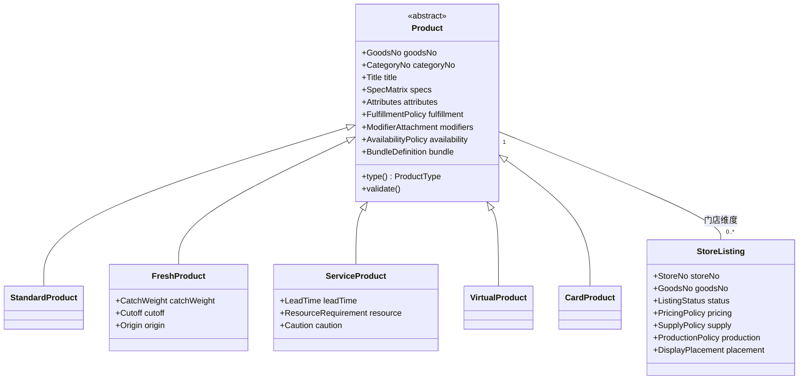

# TDD 商品领域模型 —— 继承、组合，与数据库对标

状态：**草稿 · 待确认** · 创建 2026-08-28
输入：[商品域-多行业对齐清单](../reference/商品域-多行业对齐清单.md) · [商品域-三行业功能梳理与对齐](./商品域-三行业功能梳理与对齐.md)
方案上游：[TDD-统一商品模型-三行业合并](./TDD-统一商品模型-三行业合并.md)

> **总入口**：本册已并入 [TDD-商品域-完整方案](./TDD-商品域-完整方案.md)，细节冲突时以那份为准。

---

# 一 · 先钉住三条不能推翻的事实

领域模型不是在白纸上画的。动手前先把三条既有约束写下来，
**否则画出来的模型很漂亮，但落不进这个仓库。**

## 1.1 五品类共用一张表，是有理由的
`PrdGoods` 的类注释写着：

> 五品类共用一张表，差异字段按 `type` 各用各的 —— **五张表意味着列表页要 union 五次，
> 而「按社区逛全部商品」是首页的主查询**。

所以**领域模型可以有继承，数据库不要跟着继承**。这是本册最重要的一句。

## 1.2 `BaseEntity` 是持久层基类，不是领域基类
它管 `id` / `tenantNo` / 审计四列 / `@Version` / `@TableLogic`。
**这些是存储关切，不是业务语义** —— 领域类不该继承它，否则领域层立刻依赖 MyBatis-Plus。

## 1.3 `MerchantGoodsServiceImpl` 有 2457 行、25 个 public 方法
它同时背着商品、SKU、库存、门店价、门店选品五件事。
`SpecLibraryService` 的注释已经点过这个问题：

> 单独一个服务而不是塞进 `MerchantGoodsServiceImpl`：那个类已经背着五件事，
> 再挂四张表的组装会让「改规格库」与「改商品保存」变成同一处风险。

**它有测试覆盖**，按 P6 不能推倒重来 —— 领域模型的引入必须是**加法**，不是重写。

---

# 二 · 核心判断：is-a 用继承，has-a 用组合

「基于基类继承形成领域类」**对一半**：继承只能用在**品类差异**上，横切能力必须组合。

## 2.1 为什么

假设把能力做成子类：

```
Product
├─ ModifiableProduct     （有选配项）
├─ WeighedProduct        （按重计价）
├─ TimeWindowedProduct   （有可售时段）
└─ QuotaLimitedProduct   （有每日限量）
```

一道**时价海鲜**同时要：按重计价 + 做法选配 + 沽清限量 + 时段菜单 —— **四个都要**。
Java 单继承给不了，只能多层继承（组合爆炸）、接口默认方法（状态无处放）、或者放弃。

**判据一句话**：
- 回答「**这是一种什么东西**」→ 继承（菜品 is-a 商品，服务项目 is-a 商品）；
- 回答「**这东西还带着什么**」→ 组合（商品 has 选配项、has 可售时段）。

## 2.2 于是模型是「一条浅继承线 + 若干组合件」



**`FreshProduct` 与 `ServiceProduct` 各自只多两三个字段，其余全在基类。**
继承线只有一层，这是有意的 —— 深继承是下一个坑。

---

# 三 · 领域模型

## 3.1 聚合划分

| 聚合根 | 边界内 | 为什么是一个聚合 |
|---|---|---|
| **`Product`** | SPU 本体、规格矩阵与 SKU、商品参数、履约与支付策略、选配项**引用**、可售时段**引用**、组合定义 | 「这件商品是什么」必须一起变、一起校验：改规格必须同时改 SKU 矩阵，否则出现没有价格的规格 |
| **`StoreListing`** | 上架状态、价格策略、供给策略、生产策略、陈列位置 | 「这家店怎么卖它」是另一条变更节奏：改价改库存每天几十次，改商品几周一次。**合成一个聚合会让改价去抢商品那一行的锁** |
| **`ModifierGroup`** | 组 + 选项 + 约束 | 可复用（一个「辣度」给 30 道菜），有自己的生命周期 |
| **`AvailabilityWindow`** | 时段规则 | 门店级复用 |
| **`DisplayGroup`** | 分组 + 组内排序 | 同上 |

**跨聚合只经业务键引用，不放对象引用** —— 与仓库既有的「跨域引用只经业务键」同一条原则。
`Station`（出品工位）属 `mch_` 域，商品域只持 `stationNo`。

## 3.2 继承：`Product` 的五个特化

| 类 | 判别值 | 独有的东西 | 谁在用 |
|---|---|---|---|
| `StandardProduct` | `NORMAL` | — | 零售日用品、**餐饮的绝大多数菜品** |
| `FreshProduct` | `FRESH` | 截单、到货说明、按重计价、产地 | 零售生鲜、**餐饮海鲜按斤** |
| `ServiceProduct` | `SERVICE` | 制备时长、前后缓冲、资源需求与数量、服务禁忌 | **美业项目**、家政维修 |
| `VirtualProduct` | `VIRTUAL` | — | 线上服务 |
| `CardProduct` | `CARD` | — | 储值卡、次卡 |

**菜品不是第六个子类。** 一道热菜是 `StandardProduct`，一条按斤卖的鱼是 `FreshProduct`。
餐饮的差异全在组合件里 ——
**这是"合并"在对象模型上的直接体现：如果菜品需要一个子类，说明合并失败了。**

## 3.3 组合：能力对象

| 组合件 | 装什么 | 谁会用 |
|---|---|---|
| `SpecMatrix` | 规格维度 + SKU 集合 + 一致性规则 | 三行业 |
| `Attributes` | 商品参数（PROP，**给买家看**） | 三行业 |
| `FulfillmentPolicy` | 履约方式集合 + 支付方式集合 | 三行业 |
| `ModifierAttachment` | 选配项组引用 + 顺序 | 餐饮做法加料、美业加项、零售包装刻字 |
| `AvailabilityPolicy` | 可售时段引用（空 = 全时段） | 餐饮时段菜单、美业可约时段、零售早市 |
| `BundleDefinition` | 组合明细（固定 / 可选组 / 次数） | 套餐 ≡ 疗程 ≡ 礼盒 |
| `PricingPolicy` | 门店价 × 市场 × 渠道 × 价类型 × 生效日 | 堂食外卖差价、会员价、时价 |
| `SupplyPolicy` | 库存 + 每日限量与重置 + 最小起订 | 沽清、每日限量 |
| `ProductionPolicy` | 工位引用 + 上菜顺序（待观察） | 分单打印、拣货分区 |
| `DisplayPlacement` | 陈列分组引用 + 组内排序 | 菜单分类、项目分组 |

**组合件是值对象或小实体，没有自己的 Service** —— 行为挂在聚合根上。

## 3.4 值对象

| 值对象 | 说明 |
|---|---|
| `Money` | 最小货币单位（分）+ 币种。**整数，绝不用浮点**（沿用既有约定） |
| `GoodsNo` / `SkuNo` / `StoreNo` … | 业务键的类型化包装，防止「同名不同义的键」（命名基准原则 4） |
| `CatchWeight` | 标称克重 + 是否已称 + 差价 |
| `LeadTime` | 制备时长 + 前缓冲 + 后缓冲 |
| `ResourceRequirement` | 资源类型 + **数量**（双人服务 = 2） |
| `Quota` | 限量值 + 重置口径（`DAILY` / `NONE`） |
| `Title` | 中文权威 + 多语言附件（缺的语言回落中文） |

---

# 四 · 不变量：领域模型存在的理由

**这些规则不能集中在一处表达，引入领域模型就没有意义。** 今天它们散落在 2457 行那个类里。

| # | 不变量 | 违反时的现象 |
|---|---|---|
| 1 | SKU 集合的取值必须与 `SpecMatrix` 的维度一一对应 | 出现没有价格的规格组合，前端选到底下不了单 |
| 2 | 单规格商品**有且仅有一条** SKU | 单规格却有两条，列表价随机 |
| 3 | 加价的选配项**必须**指向真实 SKU | 金额链断掉，退款退不出那 2 块钱 |
| 4 | `min_pick ≤ max_pick`；`required` 时 `min_pick ≥ 1` | 必选组一个都不选也能下单 |
| 5 | 只有 `FreshProduct` 允许有 `CatchWeight` | 一件日用品带着标称克重，称重差价对它生效 |
| 6 | 只有 `ServiceProduct` 允许有 `LeadTime` / `ResourceRequirement` | 预约编排给一袋米算占位格数 |
| 7 | 门店价必须属于该门店**已上架**的商品 | 下架商品还有门店价，报表金额对不上 |
| 8 | 每日限量与库存**互不影响**（流量 vs 存量） | 沽清改了库存，第二天要人工改回来 |
| 9 | 引用标准品时，类目与 optionCode **以标准品为准** | 跨店可比失效 |
| 10 | 组合商品的子项必须同属一个主体 | 跨主体套餐，结算无解 |

**1–4 与 7–8 今天没有集中的表达处**，靠各处 `if` 保证。
把它们放进 `ProductInvariants`，是引入领域模型的**唯一硬收益**。

---

# 五 · 数据库对标

## 5.1 三种映射关系，不是清一色 1:1

| 关系 | 用在哪 | 说明 |
|---|---|---|
| **单表继承（STI）** | `Product` 五特化 → **一张 `prd_goods`** | `type` 是判别列。子类独有字段在表上是可空列，**别的品类恒 NULL —— 这是有意的** |
| **1:1 / 1:N** | 聚合根与从表 | `Product`→`prd_sku`；`StoreListing`→`prd_store_price` / `prd_store_stock` |
| **值对象内联** | `Money`、`Title`、`LeadTime`、`Quota` | 展开成列，**不单独建表** |

## 5.2 逐类映射

| 领域类 | 表 | 关键列 / 说明 |
|---|---|---|
| `Product`（抽象） | `prd_goods` | 公共列 + `type` 判别列 |
| `StandardProduct` | 同上 | 无独有列 |
| `FreshProduct` | 同上 | `cutoff_at` `arrival_desc` `weighed` `origin`；`prd_sku.nominal_gram` |
| `ServiceProduct` | 同上 | `duration_min`（制备时长，§十.1）`buffer_before_min` `buffer_after_min` `resource_type` `resource_count` `caution` |
| `SpecMatrix` | `prd_goods.spec_groups` + `prd_sku` | 维度是 JSON 快照，取值在 SKU 行 |
| `Attributes` | `prd_goods.params` | PROP，JSON |
| `FulfillmentPolicy` | `prd_goods.fulfillments` / `pay_modes` | JSON 数组，取值域常量类约束 |
| `ModifierAttachment` | `prd_goods_modifier_group` | 关系表 |
| `ModifierGroup` / `Modifier` | `prd_modifier_group` / `prd_modifier` | 加价项的 `extra_sku_no` 指向真实 SKU |
| `AvailabilityPolicy` | `prd_goods_availability` | 一行都没有 = 全时段 |
| `AvailabilityWindow` | `prd_availability_window` | 门店级 |
| `BundleDefinition` | `prd_sku_bundle` | 固定 / 可选组 / 次数三形态 |
| `DisplayGroup` | `prd_store_display_group` + `prd_display_group_goods` | 门店级 |
| **`StoreListing`** | `prd_store_listing`（现 `prd_store_goods`） | 加 `station_no` `daily_quota` `quota_reset` `min_order_qty` `course_seq` |
| `PricingPolicy` | `prd_store_price` | 唯一键扩为 `(store_no, sku_no, market, channel, price_type, effective_date)`，见 §十.2 |
| `SupplyPolicy` | `prd_store_stock` + `prd_store_listing` 的配额列 | **库存与配额分开存** |
| `ProductionPolicy` | `prd_store_listing.station_no` / `course_seq` | 工位主数据在 `mch_station` |

## 5.3 为什么不做「每个领域类一张表」

| 做法 | 代价 |
|---|---|
| 每类一表（Table-per-Class） | 首页主查询 union 五次 —— `PrdGoods` 注释里已经算过这笔账 |
| 类表继承（Joined） | 每次读商品要 join 一次子表；而**读远多于写** |
| **单表继承（STI）** ✅ | 代价是子类独有列对别的品类恒 NULL。**这个代价已经付了，且没出过问题** |

**「数据库对标领域模型」不等于「表与类一一对应」** ——
对标的是**语义**（每个类都能明确说出自己落在哪些列上），不是形状。

## 5.4 STI 的一条纪律
子类独有列**必须只由该子类写入**，读时也只由该子类暴露。
不变量 5、6 就是为此而设 —— 没有它，`prd_goods` 会慢慢变成谁都能往里塞列的宽表，
而那是单表继承唯一真实的风险。

---

# 六 · 工程落法：两档，推荐 A

## 档 A · 领域层薄壳（推荐）

```
product/
├─ domain/                     ← 新增，纯 POJO，不依赖 MyBatis
│   ├─ Product.java (abstract) + 五个子类
│   ├─ policy/  SpecMatrix, PricingPolicy, SupplyPolicy, …
│   ├─ vo/       Money, LeadTime, Quota, CatchWeight, …
│   └─ ProductInvariants.java  ← §四 的十条集中在这里
├─ assembler/                  ← 新增，entity ⇄ domain
│   └─ ProductAssembler.java   ← 按 type 造出正确的子类（STI 的落法）
├─ entity/                     ← 不动（MyBatis-Plus，继承 BaseEntity）
├─ mapper/                     ← 不动
└─ service/impl/               ← 逐步瘦身：校验移入 domain，编排留在这里
```

- **持久层一行不改**，`BaseEntity` 继续管审计与乐观锁；
- 领域类**不继承 `BaseEntity`**；
- `MerchantGoodsServiceImpl` 不重写，**只把校验一段段搬进 `ProductInvariants`**，每搬一段跑一次全量测试。

## 档 B · 完整 DDD 重构（否掉）

仓储接口、领域事件、工作单元、聚合内强一致…
**否掉的理由**：那个类有测试覆盖（P6），25 个 public 方法被三端调用；
重构的收益（不变量集中）**档 A 已经拿到了**，代价却是几周的高风险改动。

---

# 七 · 这能解决什么

| 痛点 | 领域模型怎么解 |
|---|---|
| 校验散落在 2457 行里，改一处不知道影响谁 | 十条不变量集中在 `ProductInvariants` |
| 三行业逻辑会往 Service 里塞 `if` | 品类差异在子类，行业差异在组合件，**没有 `if (行业)` 的位置** |
| 「改规格库」与「改商品保存」是同一处风险 | 规格是 `SpecMatrix` 组合件，边界清楚 |
| 新增一个能力要改五处 | 加一个组合件 + 一条不变量，聚合根签名不变 |
| 加价选配项与金额链的关系没人说得清 | 不变量 3 用一行代码表达 |

---

# 八 · 迁移路径（三步，每步可回退）

| 步 | 做什么 | 验收 |
|---|---|---|
| 1 | 建 `domain/` 与 `assembler/`，五特化 + 现有字段映射，**不接任何调用方** | 一条测试：任取现存商品，`entity → domain → entity` **逐字段相等** |
| 2 | 把校验从 Service 逐段搬进 `ProductInvariants`，Service 改为调用它 | 每搬一段跑全量；**测试一条都不许改** |
| 3 | 新增能力（选配项、时段、限量…）**只在 domain 里加**，Service 只做编排 | 新能力的测试全部写在 domain 层 |

**第 1 步的「逐字段相等」是整条路径的地基** —— 它证明领域模型没有丢信息。

---

# 九 · 风险与闸门

| 风险 | 闸门 |
|---|---|
| 领域层偷偷依赖 MyBatis / Spring | **ArchUnit**：`product.domain.**` 不许 import `com.baomidou.**` / `org.springframework.**` |
| 领域类继承 `BaseEntity` | 同上，`domain` 包不许 import `common.BaseEntity` |
| STI 宽表失控（谁都往 `prd_goods` 加列） | 加列必须指明「属于哪个子类」并补一条不变量；**加列必须同步实体字段**（既有教训） |
| 双写：校验既在 Service 又在 domain | 搬一段删一段，**不留兼容分支**；撤掉 domain 校验，对应用例必须变红 |
| Assembler 丢字段 | 第 1 步的逐字段相等测试常驻 |
| 深继承 | **继承只允许一层**，第二层要走 ADR |

---

# 十 · 待确认

1. **`duration_min` 与 `prep_lead_min` 收敛成哪个**（对齐清单 §6.1 已列）。
   领域侧统一叫 `LeadTime.prepareMin`，库里保留哪个列名要定。
2. **`prd_store_price` 的唯一键扩到六元组**（market × channel × price_type × effective_date）
   是否过宽 —— 会让「改一次价」变成写多行。备选：把 `price_type` 与 `effective_date` 拆成两张表。
3. **`course_seq`（上菜顺序）**留不留 —— 功能梳理里标为待观察，模型里先放在 `ProductionPolicy`。
4. **`Money` 要不要带币种** —— 现在恒 CN，带上是为出海留位置，但每个金额字段要多一列。
5. 档 A 的第 2 步搬校验，**要不要一次只搬一个不变量**（更慢但更安全）。
