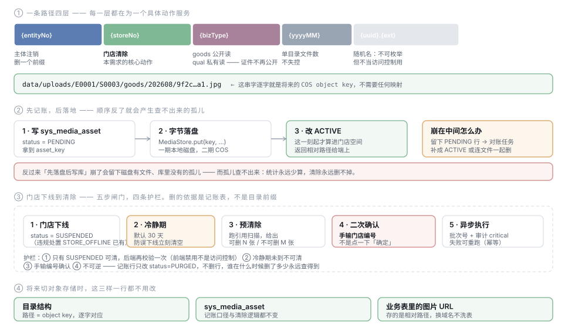
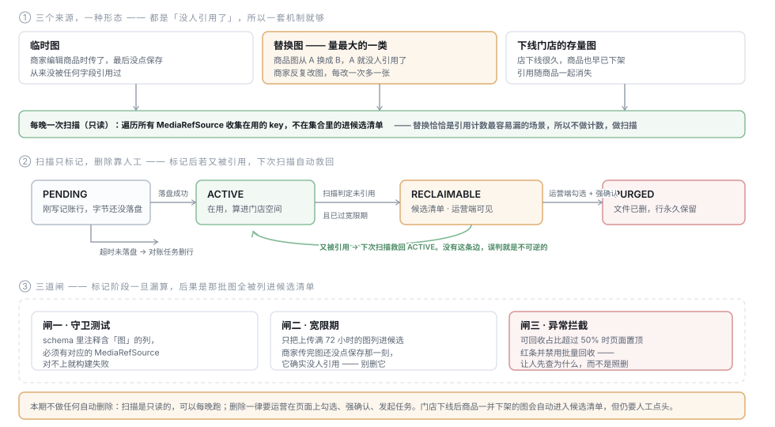
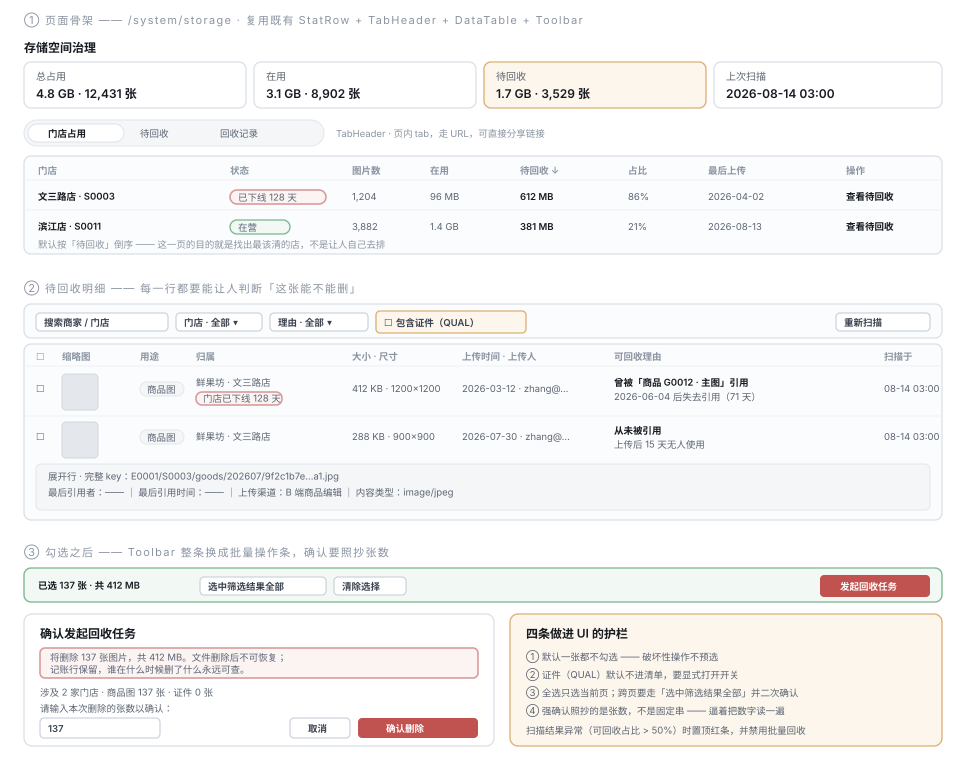

# TDD-图片存储与空间回收

状态：**已实现**（2026-08-14）· 真链路验证通过
关联需求：无独立 PRD —— 工程侧诉求（2026-08-14 口头确认）：
「图片临时存磁盘、要划分目录、将来可切对象存储；目的是**管理方便** ——
门店下线很久还有多余图占空间，商家上传的临时图、替换掉不用的图要定期删除。
**先不做自动回收**：运营端展示出待回收的图片，要有详细的信息，人工确认后启动任务执行」
关联：[资源需求评估-JDK21与native](资源需求评估-JDK21与native.md) §L3-8 ·
[定时任务清单与调度方案](定时任务清单与调度方案.md) ·
[ADR-011 经营主体与门店边界](../ADR/ADR-011-经营主体与门店边界.md)
创建日期：2026-08-14

---

## L1 · 这份方案做什么

目的是**管理方便**：让「谁占了多少、其中多少是垃圾、垃圾怎么清掉」有个着落。
不是计费，不是配额 —— 这一条让很多地方可以做得更轻。

要清的东西有三个来源，但**只有一种形态：没人引用了**。

| 来源 | 怎么产生 |
|---|---|
| 临时图 | 商家编辑商品时传了图，最后没点保存 —— 从来没被任何字段引用过 |
| **替换图**（量最大） | 商品图从 A 换成 B，A 就没人引用了。商家反复改图，每改一次多一张 |
| 下线门店的存量图 | 店下线很久，商品也早已下架，引用随商品一起消失 |

**这一版明确：不做任何自动删除。**

> 扫描是只读的，可以每晚跑 —— 它只产出一份「待回收清单」。
> 删除一律要运营在页面上看过、勾选、强确认，然后发起任务。

把这两件事分开是本方案的核心判断：**只读的可以自动，破坏性的必须人工。**
扫描每晚跑保证运营早上进来就有新鲜清单，而不是点一下等几十秒。

---

## L2 · 结构

### 存哪里、怎么记账



**上传三步顺序不能换**：先写 `PENDING` 行、再落盘、最后改 `ACTIVE`。
反过来「先落盘后写库」崩在中间会留下磁盘有文件、库里没有的孤儿 ——
**而孤儿是查不出来的**：统计永远少算，清单里永远不出现，只能靠人去 `du` 才发现。

**`{bizType}` 那一层顺带修掉一个已存在的问题**：现在证件影像和商品图落在同一个 `permitAll` 目录里
（见[资源需求评估 §L3-8](资源需求评估-JDK21与native.md)第二条）。分层后 `goods` 公开读、`qual` 私有读。

> 图里第 ③ 段画的是「门店维度的人工清除」，本版已并入统一的运营端流程，见 §L3-7。

### 从扫描到删除



**`RECLAIMABLE → ACTIVE` 那条绿边是整套机制的安全阀。** 扫描每晚重跑，
清单里的图如果又被引用（商家撤销了修改、恢复了旧图），下次自动救回。
**没有这条边，误判就是不可逆的。**

---

## L3 · 详情

### 1. 当前状态（已核实）

| 事实 | 位置 |
|---|---|
| 唯一上传端点，商品图与证件都走它 | `BizUploadController` → `POST /biz/upload/image` |
| 落点 `{merchantNo}/{uuid}.ext`，返回**相对路径** | 同上，第 76–86 行 |
| `/uploads/**` 整条链 `permitAll` | `SecurityConfig` 第 151–153 行 |
| 上下文里已有门店 | `BizContext.currentStoreNo()` / `requireStoreNo()` |
| 商品属于主体，不属于门店 | `prd_goods.entity_no`；`store_goods(store_no, goods_no)` 是上架关系 |
| 门店下线已有状态 | 违规处置 `STORE_OFFLINE` → `mch_store.status = SUSPENDED`（V96） |
| 审计表已有 | `SysAuditLog`（含 `critical` / `beforeJson` / `afterJson`） |
| 运营端菜单在库里 | `sys_function_point`，由 `ops-web/scripts/gen-perm-seed.mjs` 全量重生成 |
| 运营端组件齐备 | `DataTable`（selectable/expandable）· `Toolbar`（选中切批量条）· `useConfirm`（`requireText` 强确认）· `StatRow` · `TabHeader` · `Drawer` · `Progress` · `EmptyState` |

**本方案不需要新造任何 UI 原语** —— 全部是既有组件的组合。

### 2. 目录结构

```
{root}/{entityNo}/{storeNo}/{bizType}/{yyyyMM}/{uuid}.{ext}

data/uploads/E0001/S0003/goods/202608/9f2c1b7e4a…a1.jpg
```

| 层 | 服务于哪个动作 |
|---|---|
| `{entityNo}` | 主体注销/迁移时删一个前缀 |
| `{storeNo}` | 门店维度统计；COS 上按前缀批量删 |
| `{bizType}` | `goods` 公开读 / `qual`、`aftersale` 私有读 |
| `{yyyyMM}` | 单目录文件数不失控 |
| `{uuid}.{ext}` | 随机名只保证不可枚举，**不当访问控制用** |

**这串路径逐字就是将来的 COS object key。**

### 3. 记账表 `sys_media_asset`

```sql
CREATE TABLE sys_media_asset (
  id                 BIGINT       NOT NULL AUTO_INCREMENT,
  asset_key          VARCHAR(255) NOT NULL COMMENT '相对路径，也是将来的 COS object key',
  entity_no          VARCHAR(64)  NOT NULL,
  store_no           VARCHAR(64)  NOT NULL COMMENT '上传时的当前门店',
  biz_type           VARCHAR(16)  NOT NULL COMMENT 'GOODS / QUAL / AFTERSALE',
  bytes              BIGINT       NOT NULL,
  width              INT          DEFAULT NULL,
  height             INT          DEFAULT NULL,
  content_type       VARCHAR(64)  DEFAULT NULL,
  status             VARCHAR(16)  NOT NULL DEFAULT 'PENDING'
                     COMMENT 'PENDING / ACTIVE / RECLAIMABLE / PURGED',
  -- 「可回收理由」全靠这两列，它们是扫描时落下的真实数据，不是推断
  last_referenced_at DATETIME     DEFAULT NULL COMMENT '最后一次被扫描到仍在引用的时刻；NULL = 从未被引用',
  last_ref_desc      VARCHAR(128) DEFAULT NULL COMMENT '最后一个引用者的人话描述，如「商品 G0012 · 主图」',
  marked_at          DATETIME     DEFAULT NULL COMMENT '进候选清单的时刻；救回时置空',
  uploaded_by        VARCHAR(64)  DEFAULT NULL COMMENT '商家侧账号',
  purge_batch_no     VARCHAR(64)  DEFAULT NULL,
  created_at         DATETIME     NOT NULL,
  updated_at         DATETIME     NOT NULL,
  purged_at          DATETIME     DEFAULT NULL,
  PRIMARY KEY (id),
  UNIQUE KEY uk_asset_key (asset_key),
  KEY idx_store_status (store_no, status),
  KEY idx_status_marked (status, marked_at)
) COMMENT '图片资产记账：空间统计与回收清单的唯一依据';
```

三个决定要说明：

- **不删行，只改 `status = PURGED`**。删除不可逆，「什么时候删了什么」必须永远查得到
- **`last_referenced_at` / `last_ref_desc` 是「详细信息」的全部来源**，见 §L3-6
- **`marked_at` 救回时置空**，留着的话第二次进清单会用一个过期的起算点

### 4. 统计口径：只做归属，但按状态分列

商品是主体级的，一张图可能被多家店展示，于是有两个都成立的口径：

| 口径 | 各店之和 | 用途 |
|---|---|---|
| **归属**（采用） | **= 磁盘实际占用** | 空间管理、回收 |
| 引用 | **> 实际占用**（共享图算多次） | 「这家店展示了多少」 |

既然目的是管理方便而不是计费，归属口径就够了 —— 它唯一、可加总、加起来正好是磁盘真实字节数。

```sql
SELECT store_no,
       SUM(CASE WHEN status='ACTIVE'      THEN bytes ELSE 0 END) AS active_bytes,
       SUM(CASE WHEN status='RECLAIMABLE' THEN bytes ELSE 0 END) AS reclaimable_bytes,
       COUNT(CASE WHEN status='RECLAIMABLE' THEN 1 END)          AS reclaimable_cnt
  FROM sys_media_asset
 WHERE status IN ('ACTIVE','RECLAIMABLE')
 GROUP BY store_no;
```

**不扫磁盘。**

### 5. 上传链路改造

顺序三步，**不能换**：写 `PENDING` → 落盘 → 改 `ACTIVE`。
崩在中间的两种情况都留下**可对账的 PENDING 行**（有行无文件 → 删行；有行有文件 → 补 `ACTIVE`）。

```
POST /biz/upload/image?bizType=GOODS   （默认 GOODS，证件传 QUAL）
返回 { "url": "/uploads/E0001/S0003/goods/202608/9f2c….jpg" }   ← 形状不变，端上不用改
```

顺带在这一步读出图片宽高存进 `width` / `height` —— 运营端要显示尺寸，而事后再读要把每个文件打开一遍。

### 6. 扫描：mark 而不删，顺便把「理由」算出来

**不做引用计数，做扫描。** 替换是本需求量最大的一类，
而它恰恰是引用计数最容易出错的场景（改字段时只加新值、忘了减旧值，症状是「空间只涨不降」，没人会注意到）。

引用源不靠手写清单，按项目已有的 `DataScopeRegistrar` 那套做法：

```java
/** 「我这个域引用了哪些图，分别是被什么引用的」。每个含图片字段的域实现一个。 */
public interface MediaRefSource {
    /** sink 收 (assetKey, 人话描述)，如 ("E0001/…/a1.jpg", "商品 G0012 · 主图") */
    void forEachReference(BiConsumer<String, String> sink);
}
```

扫描一趟做三件事：

| 对象 | 动作 |
|---|---|
| 仍被引用的 | `last_referenced_at = now`、`last_ref_desc = 描述`；若原为 `RECLAIMABLE` 则**救回 `ACTIVE`** 并清空 `marked_at` |
| 未被引用且已过宽限期（72h）的 `ACTIVE` | 转 `RECLAIMABLE`，`marked_at = now` |
| 未被引用但在宽限期内的 | 不动 |

**「可回收理由」就是这两列的自然结果**，不是推断：

| `last_referenced_at` | 运营端展示 |
|---|---|
| `NULL` | **从未被引用** · 上传后 15 天无人使用 |
| 有值 | **曾被「商品 G0012 · 主图」引用** · 2026-06-04 后失去引用（71 天） |

代价几乎为零 —— 扫描本来就在遍历引用，顺手写两个字段而已。

**mark 阶段的内存**：全量 key 进 `HashSet`。1 万商品 × 6 张 ≈ 6 万 key ≈ 10 MB 以内，
当前量级毫无压力；超过百万级时按 `entity_no` 分片跑。

### 7. 运营端展示方案（本版重点）

**位置** `/system/storage` · **菜单** 系统 → 存储空间治理 · **文案** `ops-web/app/system/storage/copy.ts`（zh/en 双份，走既有 `PageCopy`）

**权限**：`platform:media:read` 能看；只有 `platform:media:purge` 才出现选择框与批量条，
否则挂 `ReadOnlyNotice`。「能看」和「能删」通常不是同一个人。



#### 顶部 `StatRow` —— 四张卡

| 卡 | 内容 |
|---|---|
| 总占用 | 4.8 GB · 12,431 张 |
| 在用 | 3.1 GB · 8,902 张 |
| **待回收** | 1.7 GB · 3,529 张（warn 色调 —— 它是这一页存在的理由） |
| 上次扫描 | 2026-08-14 03:00 |

#### Tab 1 · 门店占用

| 列 | 内容 | 备注 |
|---|---|---|
| 门店 | 名称 · 编号 | 点击跳 Tab 2 并带上门店筛选 |
| 状态 | 在营 / **已下线 128 天** | 下线用 danger `Badge`，天数是关键信息 |
| 图片数 | 1,204 | |
| 在用 | 96 MB | |
| **待回收** | 612 MB | **默认按此列倒序** |
| 占比 | 86% | 待回收 ÷ 总占用 |
| 最后上传 | 2026-04-02 | 判断这家店还活着没 |
| 操作 | 查看待回收 | |

默认倒序的理由：**这一页的目的就是找出最该清的店，不该让人自己去排。**

#### Tab 2 · 待回收（核心）

`Toolbar`：搜索（商家/门店）+ 门店筛选 + 理由筛选 + **「包含证件」开关（默认关）** + 「重新扫描」

`DataTable`（`selectable` + `expandable`）：

| 列 | 内容 | 为什么要它 |
|---|---|---|
| ☐ | 选择框 | **默认一张都不勾** |
| 缩略图 | 80×80 | **没有图就是让人盲删** |
| 用途 | 商品图 / 证件 / 售后凭证 | 证件用 danger `Badge` |
| 归属 | 主体 · 门店 + 状态徽标 | 「门店已下线 128 天」 |
| 大小 · 尺寸 | 412 KB · 1200×1200 | 尺寸能帮着认出「这是原图还是缩略」 |
| 上传时间 · 上传人 | 2026-03-12 · zhang@… | 要追问时找得到人 |
| **可回收理由** | 见 §L3-6 的两种形态 | **这一列是整个页面的核心** |
| 扫描于 | 08-14 03:00 | 这份判定有多新 |

展开行（`expandable`）：完整 `asset_key` · 最后引用者 · 最后引用时间 · 上传渠道 · content-type

#### Tab 3 · 回收记录

批次号 / 发起人 / 发起时间 / 张数 / 字节 / 状态 / 耗时 / 操作。
执行中的行内嵌 `Progress`；点开 `Drawer` 看每张的删除结果（成功 / 失败 / 已跳过）。
**这是审计视图**，与 `SysAuditLog` 互为印证。

#### 四条护栏做进 UI

| # | 护栏 | 为什么 |
|---|---|---|
| 1 | **默认一张都不勾选** | 破坏性操作不预选 |
| 2 | **证件（QUAL）默认不进清单**，要显式打开开关 | Q4 的法务留存期口径未定 —— UI 把这个未决状态显式化，而不是假装它不存在 |
| 3 | 全选只选当前页；跨页要走「选中筛选结果全部」并二次确认 | `DataTable` 的全选语义本来就是当前页，别偷偷扩大 |
| 4 | 强确认照抄**本次删除的张数**：`useConfirm({ danger: true, requireText: String(count) })` | 逼着把数字读一遍，比抄固定串更有信息量 |

额外一条：**扫描结果异常（可回收占比 > 50%）时页面置顶红色 `Notice` 并禁用批量回收** ——
这种比例多半意味着某个 `MediaRefSource` 漏了，让人先查为什么，而不是照删。

#### 各种状态都要有

| 态 | 展示 |
|---|---|
| 从未扫描 | `EmptyState`「还没扫描过。点右上角『重新扫描』生成待回收清单。」 |
| 扫描中 | `Skeleton` + 顶部 `Progress`，「重新扫描」禁用 |
| 扫完无候选 | `EmptyState`「没有待回收的图片。上次扫描 08-14 03:00。」 |
| 有进行中的批次 | 「发起回收任务」禁用 + `Notice` 提示批次号与进度 |
| 只读权限 | 隐藏选择框与批量条 + `ReadOnlyNotice` |

#### 缩略图从哪来

本地磁盘没有缩略图服务。一期**直接引原图** + `loading="lazy"` + CSS `object-fit: cover`；
运营端在内网，一页 20 张 × 约 300 KB ≈ 6 MB，可接受。
切 COS 后换成 `?imageMogr2/thumbnail/160x` —— 数据万象的现成能力，届时是一行 URL 参数的事。

⚠️ 证件（QUAL）的缩略图不能走公开 URL，要走 §L3-9 的签名 URL，**且有效期按分钟计**。

#### 接口

| 端点 | 权限 | 返回 |
|---|---|---|
| `GET /ops/media/overview` | read | 四个 KPI + 上次扫描时间 |
| `GET /ops/media/stores` | read | Tab 1 列表（分页、排序） |
| `GET /ops/media/reclaimable` | read | Tab 2 列表（分页、筛选：门店 / 理由 / 用途 / 是否含证件） |
| `POST /ops/media/scan` | purge | 触发扫描（异步），返回任务号 |
| `GET /ops/media/scan/status` | read | 扫描进度 |
| `POST /ops/media/reclaim` | purge | 提交回收批次 |
| `GET /ops/media/batches` | read | Tab 3 列表 |
| `GET /ops/media/batches/{no}` | read | 批次明细 |

`POST /ops/media/reclaim` 两种入参：

```
{ "assetKeys": ["…", "…"] }                                  // 当前页勾选
{ "filter": { "storeNo": "S0003", "reason": "NEVER_USED" },
  "expectedCount": 137 }                                     // 跨页全选
```

**跨页全选必须带 `expectedCount`，服务端比对不一致就拒绝** ——
从确认到执行之间清单可能变了（比如刚好跑了一次扫描把几张救回去了），
不比对就会删掉运营没看过的那几张。

### 8. 执行：一个任务，不是一个定时器

运营点「确认删除」后：

1. 生成 `purge_batch_no`，把选中的行标记进批次（状态 `RECLAIMABLE` 不变，只挂批次号）
2. 投递到 worker 面异步执行 —— 前端拿批次号轮询进度
3. 逐条：`MediaStore.delete(key)` → `status = PURGED`、`purged_at = now`
4. 写一条 `SysAuditLog`（`critical = true`）：谁、何时、批次号、张数、字节数
5. 失败的留在批次里可重跑（`PURGED` 幂等，已删的跳过）

**没有定时删除任务。** 定时的只有两个只读/低风险的：

| 任务 | 频率 | 破坏性 |
|---|---|---|
| `MediaScanJob` | 每日凌晨 | 无（只改状态，不碰文件） |
| `MediaReconcileJob` | 每小时 | 小（只清理超时的 `PENDING`） |

```yaml
shop:
  media:
    scan:
      enabled: true
      cron: "0 0 3 * * *"
      grace-hours: 72              # 宽限期：上传后多久才可能进候选清单
      abnormal-ratio-alert: 0.5    # 超过就页面置顶红条并禁用批量回收
```

### 9. `MediaStore` 端口与 COS 适配

```java
public interface MediaStore {
    void   put(String key, InputStream in, long size, String contentType);
    void   delete(Collection<String> keys);
    String publicUrl(String key);                    // GOODS
    String signedUrl(String key, Duration ttl);      // QUAL / AFTERSALE
}
```

接口放 `shop-base`，实现放 `shop-channel/media`。一期 `LocalDiskMediaStore`，二期 `CosMediaStore`。
**切换时改的只有实现类和端上图片域名** —— 目录结构、记账表、扫描逻辑、业务表里的 URL 一行不用改。

### 10. 存量数据：不搬家

扫 `data/uploads/`，每个文件补一条 `sys_media_asset`（`asset_key` = 老路径原样，
`store_no` = 该主体的默认门店，`biz_type = GOODS`，`status = ACTIVE`）。
**不移动文件、不洗业务表** —— 回收是按记账表的行走的，目录前缀只是 COS 上批量删的加速手段。

⚠️ **补完记账后的第一次扫描会列出一大批候选** —— 存量里积压的替换图和临时图会一次性涌出来，
很可能直接撞上 §L3-7 的异常拦截（占比 > 50%）。**这是预期行为**：
先让人确认这批确实是垃圾，分几次清完，比一次全删安全。

### 11. 权限、菜单、迁移

| 权限码 | 说明 |
|---|---|
| `platform:media:read` | 看统计与待回收清单 |
| `platform:media:purge` | 触发扫描、发起回收任务 |

菜单落 `sys_function_point`：跑一遍 `ops-web/scripts/gen-perm-seed.mjs`，
从输出里**逐字取新增行**落成迁移，其余一行不动（与 V140 同一套写法）。

迁移号：本方案取 **V152**。
⚠️ 初稿写的 `V142` 已被并行会话的 `V142__mail_business_templates.sql` 占掉，当前最大是 `V151` ——
这正是「撞号」的典型现场，落盘前务必再确认一次。

---

## L4 · 边界

### 未定项

| # | 待决 | 暂定 |
|---|---|---|
| Q1 | 宽限期多久（商家从传图到保存商品的最长间隔） | 72 小时 |
| Q2 | 异常拦截阈值 | 可回收占比 > 50% |
| Q3 | 清除是否连证件（`qual`）一起删 | **法务口径，不由工程定**。UI 上已做成默认不显示的开关 |
| ~~Q4~~ | ~~每晚自动扫描能接受吗~~ | ✅ **已确认接受**（2026-08-14）。只读、不删任何文件 |
| ~~Q5~~ | ~~门店下线还有别的路径吗~~ | ✅ **已查清**，见下 |

### Q5 的答案：门店下线有两条路径

`MchStore` 三态（`MchStore.java` 第 32–39 行）：

| 状态 | 含义 | 谁写的 |
|---|---|---|
| `ACTIVE` | 在营 | 建店、恢复 |
| `READONLY` | **商家自助停用 / Plan 降级** | `StoreAdminServiceImpl:134` |
| `SUSPENDED` | **平台强制下线**（违规处置 `STORE_OFFLINE`） | `MerchantGovernServiceImpl:263` |

**这不影响回收的核心逻辑** —— 因为判据是「没人引用」，不是门店状态。
门店状态只作为运营端的辅助判断信息展示，所以徽标要分两种文案：
「平台已下线 N 天」与「商家已停用 N 天」，别混成一个「已下线」。

这也反过来验证了 §L3-6 的设计：**把判据挂在引用上而不是挂在门店状态上，
门店状态多一个取值就不用改回收逻辑。**

### 实施中改掉的三处设计（2026-08-14，T1–T4）

方案落到代码时被现实按住了三次，都已改掉并在测试里钉住：

| # | 方案原样 | 实际 | 为什么 |
|---|---|---|---|
| 1 | 证件也按 `{storeNo}` 分目录 | 证件落 **`_ENTITY`** 哨兵档 | 营业执照属于**主体**不属于某家店；且进件阶段商家还没建店，照搬 `requireStoreNo()` 会 403 —— 传不了证件也就进不了件 |
| 2 | 上传返回签名 URL | 上传返回**稳定相对路径**，签名是渲染那一刻的事（`MediaStore.privatePath` / `signedUrl` 分开） | 签名带有效期，存进 `mch_qualification.image_url` 就是定时炸弹：存的时候能开，几分钟后同一行数据变死链，且不报错 |
| 3 | `sys_media_asset` 登记进 DataScope | **刻意不登记** | 登记后上传第三步变成 `UPDATE … WHERE id=? AND 1 = 0`，记账行永远停在 `PENDING`。这正是 fail-closed，而症状最难查：上传 200、文件也落盘，只有状态不对。它与 `sys_outbox` 同类，且运营端要的就是全平台视图 |

| 4 | `MediaRefColumn` 带「单值 / JSON 数组 / 自由文本」三种形态 | **去掉了形态字段** | 写扫描器时发现三者处理完全一样。留着反而多一类静默故障：一列实际存数组却声明成单值，按声明解析只取到一个引用，**剩下那些图会被判成孤儿删掉**且不报错 |
| 5 | 菜单是独立页面 `/system/storage`，三个页签 | **`/system?tab=storage`，页内分段控件**；页面落地前标 `soon` | 这个项目的 nav 约定里没有子路径叶子（`nav.test.ts` 拦下）。另有一条守卫要求「已解锁的 tab 叶子页面必须真的认这个 tab」，所以页面没做之前不解锁 |
| 6 | 存量补录取「该主体的默认门店」 | **归到 `_ENTITY` 主体级** | 那个数据当时根本不存在 —— 这些文件是在门店维度出现之前传的。填一个默认店会让统计**看起来精确而实际是编的**，而运营正要拿这个数决定清谁 |
| 7 | 一次性的「存量补记账脚本」 | **常驻的「磁盘对账」端点** | 「磁盘上有、库里没有」在任何时候都可能发生（备份恢复、手工拷贝）。而这类文件查不出来：统计不算、清单不出现，只有人去 `du` 才发现磁盘满了 |

补录的 `created_at` 取**文件最后修改时间**而不是 `now()`：用 `now()` 的话存量全落在同一刻，
而宽限期是按它算的 —— 补录当天一张都不会进清单，看起来像「扫描没生效」。

| 8 | 确认弹窗拿返回值自己发请求 | **传 `action` 给弹窗** | 不传的话弹窗点完立刻关，异步在页面里跑 —— 这段时间界面上没有任何「正在处理」的痕迹，人会再点一次。**对不可逆操作，再点一次意味着又发一个批次** |

运营端还被两条守卫拦下过，都是这个项目自己立的规矩：
「巡检」是上游项目的业务名词（`no-scaffold-leftover`），i18n 词典里不能写 markdown 星号
（`design-tokens` —— 词典里的星号不会被渲染，只会原样显示给运营看）。

第 3 条的**重新登记触发点**：B 端出现「我的存储占用」这类页面时。
那时要连同「这个会话到底带哪几个维度」一起验，别照抄 `prd_goods` 的写法 —— 这次的 `1=0` 就是照抄来的。

### 本方案不做的

- **自动删除**：本版明确不做。将来若要，加的是「清单里超过 N 天且无人处理的自动执行」，不是绕过人工
- **配额与限流**：目的是管理方便，不是计费
- **图片去重**（`sha256`）：随 COS 一起做
- **缩略图 / WebP**：等切 COS 用数据万象
- **存量证件影像的收口**：已单独立项

---

## 测试策略

| 场景 | 判据 |
|---|---|
| 上传落到四层路径 | 路径逐段断言，含 `bizType` 与 `yyyyMM`；`width`/`height` 有值 |
| 记账三步顺序 | 模拟落盘失败 → 留 `PENDING`、磁盘无文件；对账任务跑完该行消失 |
| **临时图进清单** | 传图不保存商品 → 拨快 72 小时 → 扫描后为 `RECLAIMABLE`，理由「从未被引用」 |
| **替换图进清单** | 商品 cover 从 A 改 B → 扫描后 A 为 `RECLAIMABLE`，理由带「曾被『商品 X · 主图』引用」；**B 仍 `ACTIVE`** |
| **宽限期内不进清单** | 传图不保存，立刻扫描 → 仍是 `ACTIVE` |
| **救回** | 图进清单后把商品 cover 改回它 → 下次扫描变回 `ACTIVE` 且 `marked_at` 为空 |
| **扫描不删文件** | 扫描前后磁盘文件数不变 —— 这条要单独断言 |
| **异常拦截** | 构造占比 > 50% → 接口返回异常标记，前端禁用批量回收 |
| **跨页全选的数量比对** | 提交时 `expectedCount` 与服务端实际不符 → 拒绝，不删任何东西 |
| 空间统计 | 传 3 张（两店）→ 分状态聚合结果与磁盘实际字节相等 |
| 权限降级 | 只有 `read` 时调 `POST /ops/media/reclaim` 返回 403，**不靠前端隐藏** |
| 批次幂等 | 同一批次跑两次，第二次全部跳过，不报错 |
| 审计留痕 | `SysAuditLog` 有一条 `critical = true`，含批次号与字节数 |
| **守卫测试** | 故意加一列注释含「图」的字段而不实现 `MediaRefSource` → **构建失败** |

**必须有一条真实链路验证**：上传 → 改商品图 → 扫描 → 运营端确认 → 执行删除，
而把某个 `MediaRefSource` 实现摘掉后，「在用的图被列进清单」这条测试必须变红。
替身太干净会盖住真缺陷 —— 这套机制的失败模式恰恰是「测试全绿但清单里混进了在用的图」。

---

## 实现任务

后端

- [x] T1 `sys_media_asset` 表 + 实体 + Mapper（V142，取号前确认）
- [x] T2 `MediaStore` 端口 + `LocalDiskMediaStore`
- [x] T3 `BizUploadController` 改造：四层路径 + `bizType` + 三步记账 + 读宽高
- [x] T4 `UploadResourceConfig` 收窄到 `**/goods/**`；`qual` / `aftersale` 走签名 URL
- [x] T5 `MediaRefSource` 接口 + 各域实现 + **schema 守卫测试**
- [x] T6 `MediaScanJob`：标记、救回、写 `last_ref_desc`、异常比例标记
- [x] T7 `MediaReconcileJob`：`PENDING` 超时清理
- [x] T8 回收任务执行器：批次、幂等、审计、进度
- [x] T9 八个 `/ops/media/*` 端点 + 两个权限码 + `sys_function_point` 菜单迁移
- [x] T10 存量补记账脚本（不搬家）

运营端

- [x] T11 `app/system/storage/` 页面骨架：`StatRow` + `TabHeader` 三个 tab + `copy.ts`（zh/en）
- [x] T12 Tab 1 门店占用（默认按待回收倒序）
- [x] T13 Tab 2 待回收明细：`DataTable` selectable + expandable + 缩略图 + 理由列
- [x] T14 批量条 + `useConfirm({ requireText: String(count) })` 强确认弹窗
- [x] T15 Tab 3 回收记录 + 批次 `Drawer` + `Progress`
- [x] T16 五种状态（未扫描 / 扫描中 / 无候选 / 有进行中批次 / 只读）

---

确认记录：2026-08-14 用户确认「可以」——方案与每晚自动扫描（Q4）均通过，进入实施。

实现记录：2026-08-14 全部 16 项完成，在真后端（ops profile + MariaDB）上跑通整条链路：
磁盘对账捞到文件 → 扫描判定可回收（主体级 / 180 B / 64×64，时间取自文件 mtime）
→ 勾选 → 强确认照抄张数 → 批次生成 → 「有一批正在执行」提示 → 批次明细抽屉。

期间**异常拦截真的挡了一次**：库里只有 1 张资产且它可回收，占比 100% 超阈值，
页面自动禁用了批量回收 —— 补几张在用的图把占比压到 25% 之后才放行。
这条闸不是摆设，是当场按住过的。

仍待拍板：宽限期 72 小时 · 异常阈值 50% · 证件删不删（法务口径）。
