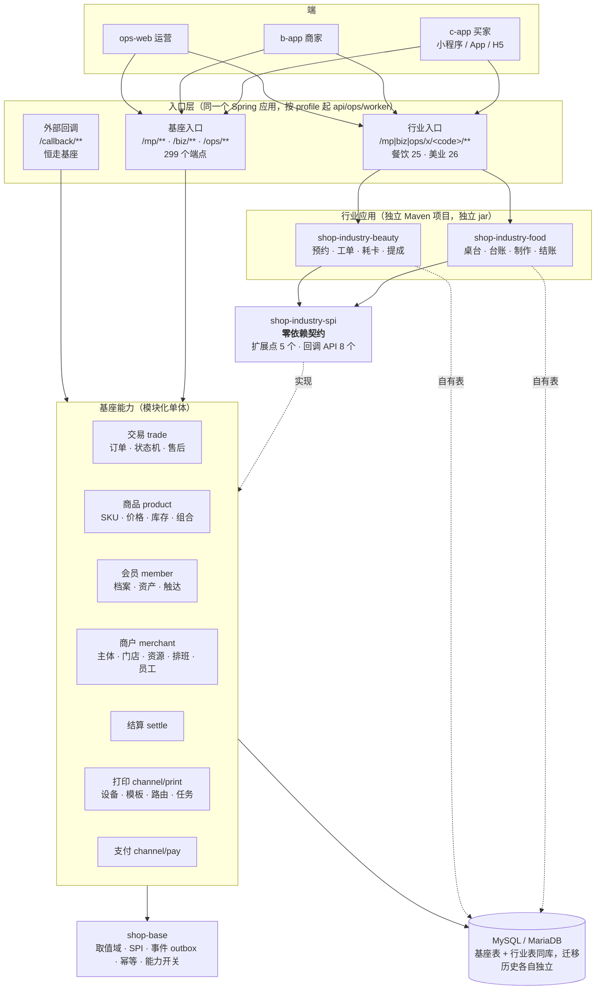
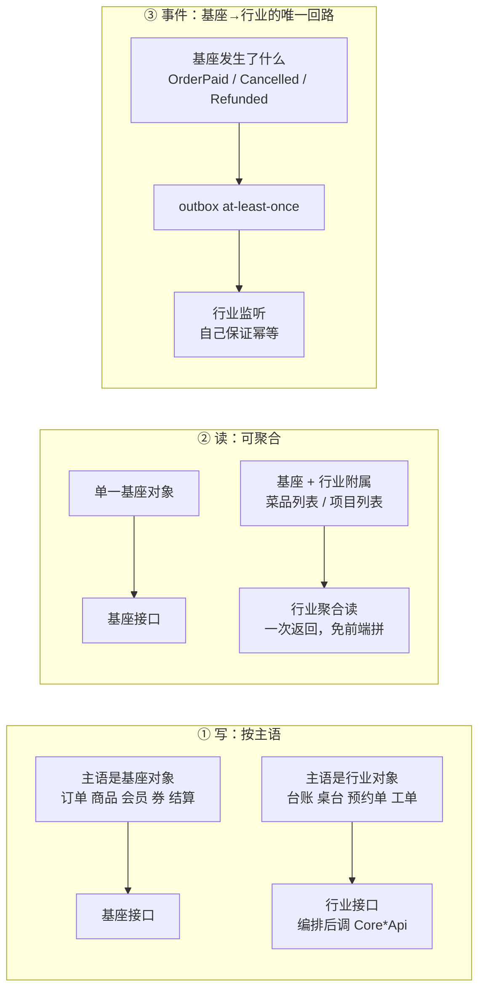
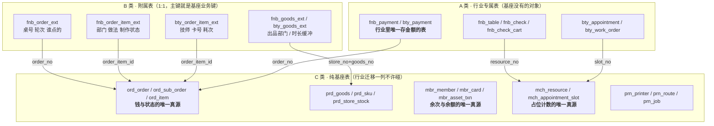
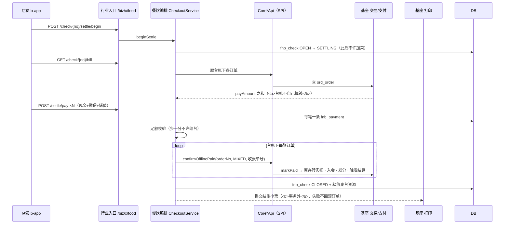
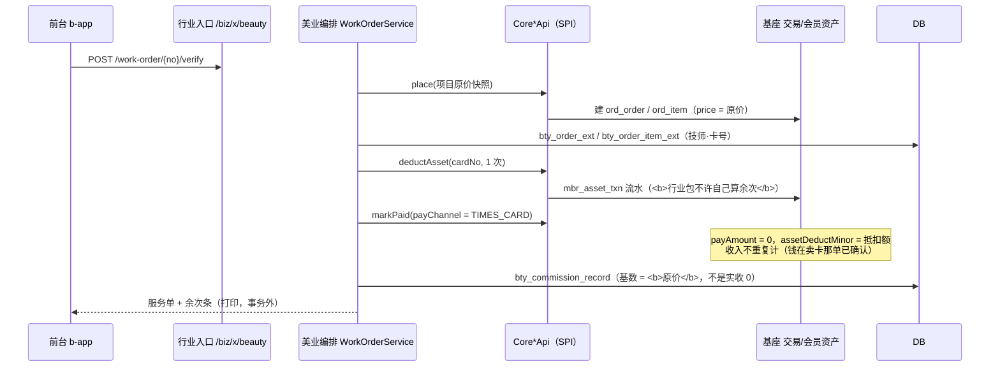
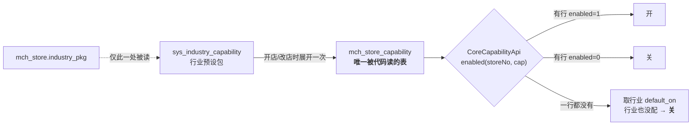
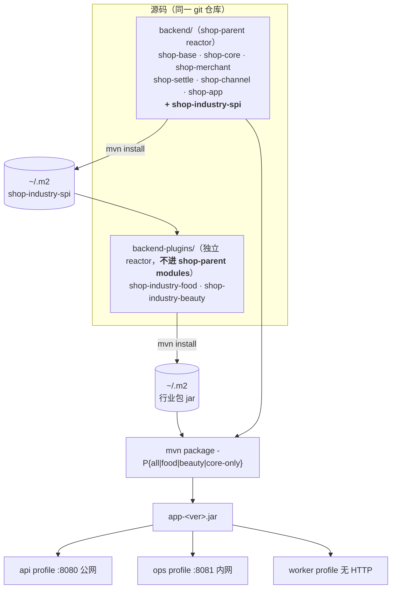
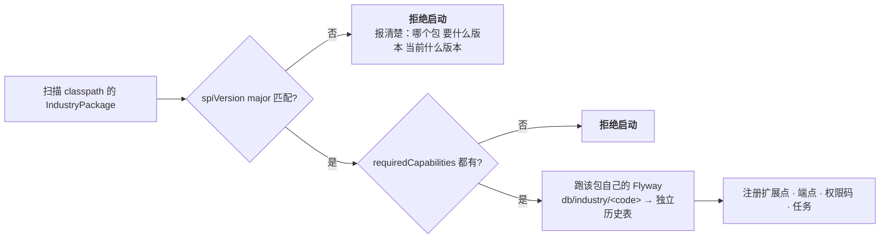

# TDD 基座与行业应用 —— 总体架构

状态：**草稿 · 待确认** · 创建 2026-08-27
本册是**总纲**，把下列已决内容合成一张完整的图。细节仍在各自文档里，不重复：

| 已决 | 在哪 |
|---|---|
| 行业工作流做成独立行业包、契约零依赖、不做热插拔 | [ADR-019](../ADR/ADR-019-行业工作流做成独立行业包.md) |
| 接口终局形态：写按主语、读可聚合、行业自有走 `/x/<code>/**` | [ADR-020](../ADR/ADR-020-行业接口终局形态.md) |
| 基座该有什么（A–J 十域 30 条能力） | [核心能力清单](../reference/核心能力清单.md) |
| 餐饮包的场景、流程、DDL、API | [TDD-餐饮包](./TDD-餐饮包-场景与工作流.md) |
| 美业包的场景、流程、DDL、API | [TDD-美业包](./TDD-美业包-场景与工作流.md) |
| 零售是基线；299 端点的口径 | [零售基线](./零售基线-接口与流程.md) |
| 三行业差异的实测数据 | [对比矩阵](./三行业接口与流程对比矩阵.md) · 生成物 [端点盘点](../reference/行业化端点盘点.md) |

---

## 1. 一句话

**一个基座 + N 个行业应用。**
基座是零售跑得起来的全集（91.7% 的接口三行业共用）；
行业应用是各自约 25 个端点、10 张表的**独立 Maven 项目**，
只面向零依赖契约 `shop-industry-spi` 编程，**整个不装而系统仍完整**。

---

## 2. 分层

> **这张保留为图，不是因为它不受影响** —— mermaid 静默失效的风险同样存在。
> 保留是取舍：分层嵌套 + 交叉引用（谁在谁里面、哪条线跨了层）用表格表达会散成几张互相看不见的表。
> 改动它时请手工确认渲染。



**每层的一句话职责，以及它不许做的事：**

| 层 | 职责 | **不许** |
|---|---|---|
| 端 | 按能力开关渲染 | 不许按 `industry_pkg` 分支 —— 只问能力 |
| 基座入口 | 基座对象的读写 | 不许出现行业分支 |
| 行业入口 | 行业对象的读写 + 编排 | 不许代理基座接口（那是方案 B，已否决） |
| 行业应用 | 行业业务逻辑 | 不许 import 基座实体、不许写基座表、不许改价/改库存/改订单状态 |
| 契约 SPI | 双向窄口子 | 不许引 Spring、不许出现基座实体 |
| 基座能力 | 全行业共用的一份实现 | 不许知道行业存在（除能力开关的展开那一处） |

---

## 3. 三条边界线

这套架构成立与否，全在这三条线画得准不准。

> **这张保留为图，不是因为它不受影响** —— mermaid 静默失效的风险同样存在。
> 保留是取舍：分层嵌套 + 交叉引用（谁在谁里面、哪条线跨了层）用表格表达会散成几张互相看不见的表。
> 改动它时请手工确认渲染。



**为什么写不能聚合**：唯一写入口 = 唯一校验 = 唯一状态机。
三个门写同一张订单，是这套方案最不该有的东西。

**为什么读可以**：读没有一致性风险，而聚合掉的正是前端拼接的成本 ——
菜品列表要显示出品部门和沽清，前端调两次自己拼，拼错了没人发现。

**为什么事件不能反向同步等待**：基座等行业包返回，基座就依赖行业包了。
`OrderLifecycleListener` 只表达"基座发生了什么"，不表达"基座需要什么"。

**两条否决项（与占比无关）**：
- `external=Y`（支付/物流回调）**恒走基座** —— 回调地址只能有一个，外部系统不认识行业；
- `cross=Y`（跨商家混合下单）**恒走基座** —— 一次调用跨多个商家时，行业门没有唯一答案。
  落法是"多一个行业入口"，**不是"废掉基座那条"**：
  `POST /mp/order` 继续服务混合购物车，`POST /mp/x/food/place` 服务餐饮场景。

---

## 4. 数据：三类表

> **这张保留为图，不是因为它不受影响** —— mermaid 静默失效的风险同样存在。
> 保留是取舍：分层嵌套 + 交叉引用（谁在谁里面、哪条线跨了层）用表格表达会散成几张互相看不见的表。
> 改动它时请手工确认渲染。



**分类判据一句话**：这条数据脱离基座对象还有没有意义？
有 → A（桌台在没有订单时照样存在）；没有 → B（"这一行的做法是免辣"脱离订单行毫无意义）。

**附属表六条规矩**（详见餐饮 TDD §7.2）：
主键 = 基座业务键 · 只存基座没有的列 · 缺行 = 默认值 · 与基座写入同事务 ·
生命周期跟随基座对象 · 迁移只写自己前缀的表。

**三个"唯一真源"**，行业包一份都不许复制：
**钱与状态**在 `ord_*`；**余次与余额**在 `mbr_*`；**占位计数**在 `mch_appointment_slot`。
复制任何一个，分叉时**两边都不会报错**，只有顾客在结账时看出不对。

---

## 5. 一次请求：两条完整时序

### 5.1 餐饮 · 先吃后付的结账

> **这张保留为图，不是因为它不受影响** —— mermaid 写错一个字符整张图静默不渲染、不报错，
> 这条风险对时序图同样成立。保留是取舍：泳道 × 序号 × 跨轨箭头换成表格会掉信息（谁调谁、第几步、
> 哪条是异步），而这里的结构信息值这个风险。改动它时请手工确认渲染。



### 5.2 美业 · 卡客耗卡

> **这张保留为图，不是因为它不受影响** —— mermaid 写错一个字符整张图静默不渲染、不报错，
> 这条风险对时序图同样成立。保留是取舍：泳道 × 序号 × 跨轨箭头换成表格会掉信息（谁调谁、第几步、
> 哪条是异步），而这里的结构信息值这个风险。改动它时请手工确认渲染。



**这两条时序里各有一处最容易做错的**：
- 餐饮：**制作由"下达"触发，不由 `OrderPaid` 触发** —— 后付时钱还没收，菜必须已经在做了；
- 美业：**收入不重复计与提成有基数必须同时成立** ——
  耗卡订单记原价则收入翻倍，记 0 则技师这个月业绩为零。

---

## 6. 行业能力怎么被打开

> **这张保留为图，不是因为它不受影响** —— mermaid 静默失效的风险同样存在。
> 保留是取舍：分层嵌套 + 交叉引用（谁在谁里面、哪条线跨了层）用表格表达会散成几张互相看不见的表。
> 改动它时请手工确认渲染。



三条硬规矩：
1. **代码里唯一允许读 `industry_pkg` 的地方是开店/改店服务**，此后无人再读 —— ArchUnit 拦；
2. **默认关的那一半才是生产常态**：每条能力开/关两态各要有用例，只测开着的等于没测；
3. **例外只有一条**：`APPOINTMENT` 沿用「一个时段都没开 = 按旧口径放行」，
   否则存量上门商家上线即接不了单。**不许长出第二条例外。**

`sys_industry`（已存在，7 条种子）**不动** —— 它的语义是支付通道准入（能否小微进件），
不是"按什么流程做生意"。挪用它会让一个前端开关改掉商家的收款通道。

---

## 7. 构建与部署

> **这张保留为图，不是因为它不受影响** —— mermaid 静默失效的风险同样存在。
> 保留是取舍：分层嵌套 + 交叉引用（谁在谁里面、哪条线跨了层）用表格表达会散成几张互相看不见的表。
> 改动它时请手工确认渲染。



| Profile | 装什么 | 用途 |
|---|---|---|
| `all` | 全部行业包 | **线上默认** —— 平台同时接零售/餐饮/美业商家 |
| `food` / `beauty` | 单个 | 私有化单行业交付 |
| `core-only` | 一个都不装 | **闸门**：必须能起、零售全量场景全绿 |

**为什么同仓不同 reactor**：进 `shop-parent` 的 `modules` 就不叫行业包叫模块，
一条 `mvn -am` 边界当天失效；而现在没有内网 Maven 仓库（父 POM 只在 `~/.m2`），
拆两个 git 仓库当天就卡在拉不到契约包上。**目录整体搬走就是独立仓库 —— 那是一次 `git mv`。**

**启动装配**：行业包自带 `AutoConfiguration`，启动时基座读它的 `IndustryPackage`：

> **这张保留为图，不是因为它不受影响** —— mermaid 静默失效的风险同样存在。
> 保留是取舍：分层嵌套 + 交叉引用（谁在谁里面、哪条线跨了层）用表格表达会散成几张互相看不见的表。
> 改动它时请手工确认渲染。



`requiredCapabilities` 是一条廉价但救命的检查：餐饮包依赖分单路由，
基座这一版没做就**启动时报错**，而不是等第一桌客人点完菜、后厨没出票才发现。

---

## 8. 失效模式与闸门（这一节是本册的核心）

架构不是靠文档维持的，是靠**红灯**维持的。把散落各处的闸门集中在这里：

| # | 失效模式 | 症状（为什么自己发现不了） | 闸门 |
|---|---|---|---|
| 1 | 行业包偷偷读基座的表 | 同一个库，物理上拦不住；跑起来完全正常 | **ArchUnit**：行业包不许 import 基座实体包 |
| 2 | 基座长出行业分支 | `if (行业)` 藏在 Service 深处，接口层看不出来 | **ArchUnit**：除开店服务外引用 `industry_pkg` 即失败 |
| 3 | 行业包边界是假的 | 拆不掉，但没人会去试 | **`-Pcore-only` 构建闸**：必须能起、零售全绿 |
| 4 | 两个行业包互相依赖 | 插件化最常见的死法 | **ArchUnit**：行业包之间零 import；共用能力一律下沉 |
| 5 | 行业迁移写了基座表 | 上线才炸，且炸在别人的域 | **迁移隔离闸**：行业迁移只许写自己前缀的表 |
| 6 | 契约版本漂移 | 老行业包配新基座，`ClassCastException` 报在无关位置 | **`spiVersion` major 不匹配拒绝启动**，且有测试证明它真的拒绝 |
| 7 | 能力开关只测了开着的一态 | 关着的才是生产常态，上线才炸 | **两态各有用例**；撤掉判定后用例必须变红 |
| 8 | 金额/余次/占位被复制成两份 | 分叉时**两边都不报错** | code review + 附属表规矩第 2 条；`fnb_check` 上没有 `total_amount` 是硬约束 |
| 9 | 权限码与端点矩阵没重跑 | 生成物与代码对不上 | **pre-push 已有闸**：矩阵测试逐格比对 |
| 10 | 界面清单没重跑 | 同上 | **pre-push 已有闸**：`gen-ui-catalog.py --check` |
| 11 | 关系码与 TDD 分岔 | 统计还在，但依据变了 | 登记表头部写明约束；改 TDD 要同时改 `industry-endpoint-map.mjs` |

**没有闸门守着的两处（诚实记录）**：

- **Service 层内部的行业分叉**。P3 只盘了接口，没盘 Service ——
  而这恰是方案 A 最需要防的失效模式。目前只能靠 #2 的 ArchUnit 与人工 review 兜，
  **统计给不了保证**。
- **真机打印**。分单路由、中文字符、切纸，假打印机测不出来。
  **必须人工验收**，不接受假打印机的绿测。

---

## 9. 施工顺序

| 阶段 | 内容 | 验收标准 |
|---|---|---|
| **0 · 基座** | 能力开关 · `shop-industry-spi` · 打印通道 I1–I4 · `DINE_IN` · `mch_resource` + slot 资源维度 · `mch_staff` + 排班 · 会员资产 F2 · 组合商品 B4 · `assetDeductMinor` 列 · 预约接口对外暴露 | **什么都没变** —— 存量商家行为零变化、现有全量测试一条不许改；`-Pcore-only` 可构建可启动 |
| **1 · 美业包** | 26 端点 · 14 表 | 试点店跑通「约—到店—服务—耗卡—结账」；剔除本包后零售全绿 |
| **2 · 餐饮包** | 25 端点 · 15 表 | 试点店跑通两种付款顺序 + **真机出票**；剔除本包后零售与美业全绿 |
| **3 · 收口** | 提成 · 行业报表 · b-app 按能力分叉 · ops-web 行业配置 | 三行业共用一份订单/会员/结算报表 |

**美业排在餐饮前面**：它依赖的基座能力（资源、排班、会员资产）恰好是餐饮也要的一大半，
先做美业等于把基座验一遍；反过来先做餐饮，桌台那套自成体系，验不到排班与资产。

**阶段 0 不交付任何面向商家的新功能，它的验收标准就是「什么都没变」** ——
这是它最容易被跳过、也最不能跳过的地方。

---

## 10. 度量与复议

**度量**（每次改完重跑，数字进 PR 描述）：

```bash
npm run gen:industry-inventory     # 分母、关系码分布、X 逐条
```

当前：有效分母 252 · `S` 91.7% · `V` 5.2% · `P` 1.2% · **`X` 2.0%（5 条，全在 `order`）**。
行业自有面：餐饮 16.6%、美业 17.3%（**行业包不是薄壳，排期按这个估**）。

**复议条件**（ADR-020 §6，写死避免"再讨论一次"）：
`X` ≥ 15% 或摊到 > 3 个主语 · 第 4 个行业 `S` < 80% · 行业包由第三方开发 · 出现私有化单行业交付。

**本册未覆盖**：`/ops` 的 338 个端点没盘 · "有前端调用方"是前缀匹配所以 `S` 可能被高估 ·
Service 层没盘 · 社区团购 20 条被排除出分母。
