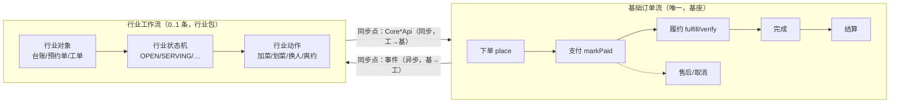
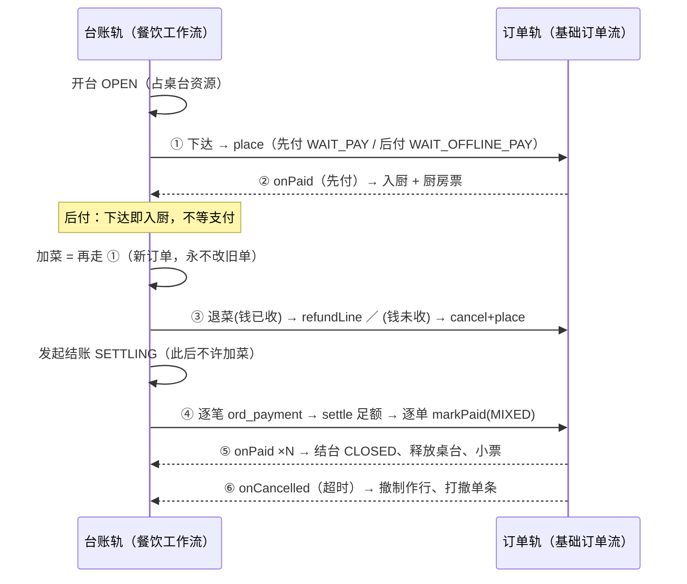
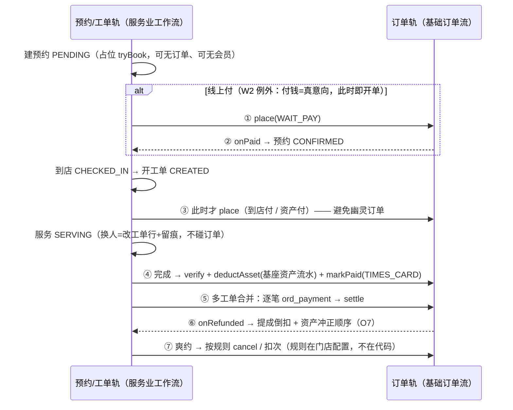
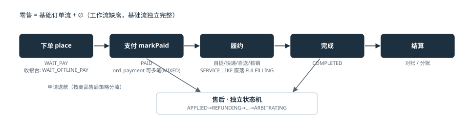
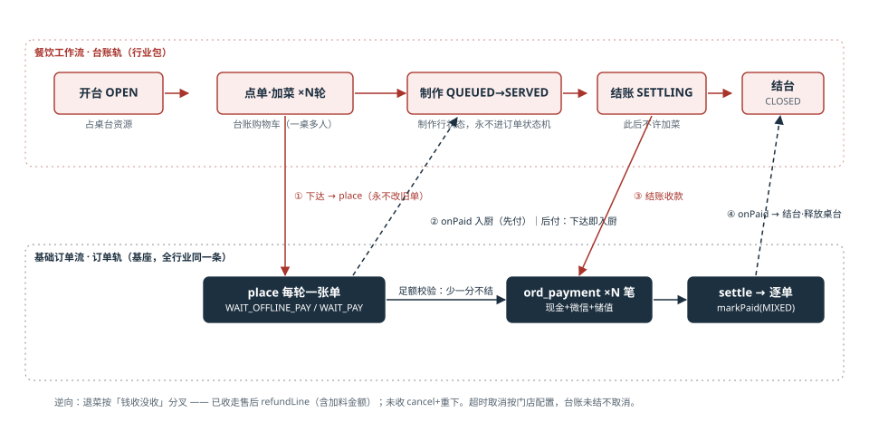
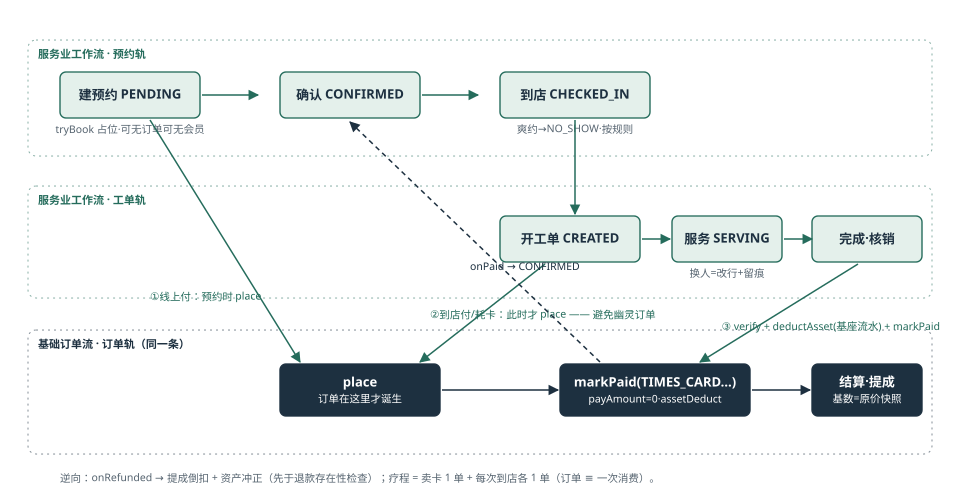
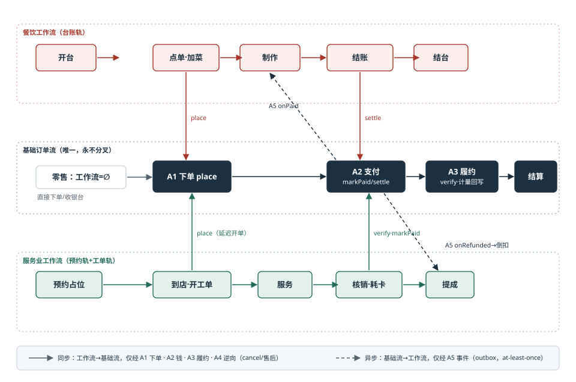

# TDD 基础订单流 + 行业工作流 —— 组合模型

状态：**草稿 · 待确认** · 创建 2026-08-28
定位：把散在各册里的结论收拢成一个**公式**并给出组合规范。
上游：[TDD-订单域-多行业完整方案](./TDD-订单域-多行业完整方案.md) · [订单域V2-设计规格书](./订单域V2-设计规格书.md) · [TDD-餐饮包](./TDD-餐饮包-场景与工作流.md) · [TDD-美业包](./TDD-美业包-场景与工作流.md)

---

# 一 · 公式

```
零售订单   = 基础订单流 + ∅（收银台是基座内建的最小工作流）
餐饮订单   = 基础订单流 + 餐饮工作流（台账轨）
服务业订单 = 基础订单流 + 服务业工作流（预约轨 + 工单轨）
未来行业   = 基础订单流 + 新写一条工作流
```

**基础订单流全行业只有一条，永不分叉；行业差异全部表达为「旁边跑着的另一条轨」。**
两条轨只在有限的几个**同步点**接触，其余时间互不知晓。



---

# 二 · 基础订单流：五个挂接点，仅此五个

基础流对工作流暴露的全部表面。**不在这张表里的接触方式都是违规。**

| # | 挂接点 | 方向 | 语义 | 幂等 |
|---|---|---|---|---|
| A1 | `place` | 工→基（同步） | **工作流唯一的开单入口**。返回 order_no，工作流自己记（fnb_order_ext / bty_order_ext） | 幂等键 |
| A2 | `markPaid` / `confirmOfflinePaid` / `settle` | 工→基（同步） | 钱的确认。混合收款先逐笔 `ord_payment` 再 settle | 是（既有） |
| A3 | `verify` / 履约推进 / `applyMeteredAdjust` | 工→基（同步） | 核销、发货、称重/计时回写 | 是 |
| A4 | `cancel` / `AfterSaleService` | 工→基（同步） | 逆向：取消未付单、退款已付行（含 modifier 金额） | 是 |
| A5 | `OrderLifecycleListener`（Created/Paid/Cancelled/Refunded/Fulfilled） | **基→工（异步，唯一回路）** | outbox at-least-once，工作流自己保证幂等 | 消费方 |

**A5 是基→工的唯一通道**：基础流从不同步等待工作流返回 ——
等了，基座就依赖行业了。事件只表达「发生了什么」，不表达「需要什么」。

---

# 三 · 行业工作流的规格：一条工作流必须声明的六件事

新行业 = 按此模板写一条工作流。**六件事缺一不完整：**

| # | 声明 | 餐饮的答案 | 服务业（美业）的答案 |
|---|---|---|---|
| W1 | **自有对象与状态机** | 台账 `fnb_check`：OPEN→SETTLING→CLOSED；制作行 QUEUED→…→SERVED | 预约单 PENDING→CONFIRMED→CHECKED_IN；工单 CREATED→SERVING→FINISHED→SETTLED |
| W2 | **开单时机**（何时调 A1） | **即时**：下达即开单 —— 菜要立刻做 | **延迟**：到店才开单 —— 电话约十个来三个，立即开单=幽灵订单污染报表 |
| W3 | **付款时点组合** | 先付（WAIT_PAY）/ 后付（WAIT_OFFLINE_PAY） | 先付 / 到店付 / **早付过**（耗卡：实收 0 + asset_deduct） |
| W4 | **同步点映射表**（见 §四/§五） | 六条 | 七条 |
| W5 | **超时与逆向策略** | 后付超时按门店配置且**台账未结不取消**；退菜按「钱收没收」分叉 | 爽约按门店规则（扣次/扣定金/不罚）；退卡按核销口径 |
| W6 | **requiredCapabilities + 打印场景** | OFFLINE_PAY·DINE_IN·分单路由；KITCHEN/CHECKOUT/… | RESOURCE_BOOKING·资产·assetDeduct 列；SERVICE_START/CARD_BALANCE/… |

**W2（开单时机）是工作流设计里最重要的一个参数** —— 它决定了这个行业的订单
什么时候开始存在。判据：**开单那一刻起，这张单就进报表、进转化率、进 GMV** ——
下单动作是否已代表真实交易意向？餐饮下达=真点了菜（即时）；电话预约=还没来（延迟）。

---

# 四 · 餐饮 = 基础订单流 + 餐饮工作流

双轨图与同步点：



**同步点仅六个。** 台账的 OPEN/SETTLING、制作行的全部状态，基础流一概不知道。

## 组合检验（这几条错一条，组合就破了）
- 「一桌多单」：同一台账下 N 张订单**各自独立走完**基础流 —— 没有"半张订单"；
- 「先吃后付」：不是新支付状态，是 W3 选了 WAIT_OFFLINE_PAY + W5 改了超时策略；
- 「制作中/上菜中」：制作行状态，**永不进**子单状态机 —— 进了，零售和美业也要认它。

---

# 五 · 服务业 = 基础订单流 + 服务业工作流

服务业工作流比餐饮多一段**前置轨**（预约），且开单时机是延迟的：



## 组合检验
- 「预约单可以没有订单」：占位由预约单持有，**计数真源仍在基座 slot** —— 工作流只记"谁占的"；
- 「耗卡」：不是新支付形态，是 W3 的"早付过" —— A2 照走 `markPaid`，原价留快照、实收 0；
- 「疗程 10 次」：卖卡 1 单 + 每次到店各 1 单，**订单 ≡ 一次消费的假设保住了**；
- 「提成」：完全在工作流侧（基数=快照原价、归属=`ord_item_modifier.ref_no`），基础流不知提成为何物。

---

# 六 · 组合定律（六条，闸门可验证）

| # | 定律 | 闸门 |
|---|---|---|
| L1 | 工作流→基础流只经 A1–A4；基础流→工作流只经 A5 | ArchUnit：行业包禁 import `ord_*` 实体 |
| L2 | **金额与订单状态的真源在基础流**；工作流零金额（收款流水已上收 `ord_payment`） | 行业表 DDL 审查：出现金额列即拒 |
| L3 | 所有同步点幂等（幂等键 / 条件更新） | 重放测试：每个同步点重复调用结果不变 |
| L4 | 同一工作流对象下的多张订单各自独立走完基础流 | 场景测试：三轮加菜三单独立可退可查 |
| L5 | 工作流可整体缺席，基础流独立完整 | `-Pcore-only`：零售全量场景全绿 |
| L6 | **新工作流不得要求基础流加状态或加边** —— 要求了，就是把工作流状态错当了订单状态 | `OrderStateMachine` 图完整性测试锁死；改图走 ADR |

L6 是这套模型的**存亡线**。历史上唯一一次给基础流加状态（`WAIT_OFFLINE_PAY`）
之所以正确，是因为「等商家确认收款」对**任何行业**都成立 —— 它是支付语义，不是行业语义。
下一次有人要加状态，用同一个问题检验：**零售也需要这个状态吗？**

---

# 七 · 新行业接入清单（照抄可用）

以「休闲娱乐 · KTV」为例走一遍模板：

| 声明 | KTV 的答案 |
|---|---|
| W1 对象与状态机 | 包厢台账（复用餐饮台账模型的形状）：OPEN→SETTLING→CLOSED |
| W2 开单时机 | 开台即开一张 0 元计时单（METERED(TIME) 到位后）；酒水果盘=加菜（即时） |
| W3 付款时点 | 后付为主（WAIT_OFFLINE_PAY）+ 包段套餐先付 |
| W4 同步点 | 与餐饮同构六条 + 计时回写（A3 `applyMeteredAdjust`） |
| W5 超时逆向 | 超时自动续/到点清台按门店配置；台账未结不取消 |
| W6 依赖与打印 | METERED(TIME)（**记账中，未建**）·OFFLINE_PAY；CHECKOUT 小票 |

第四行业（电子元器件）已按本模板成册：[v2/14](../../v2/14-电子元器件行业规格.md) §二 —— RFQ 是前置单据（同美业预约单），零新同步点，L6 复验通过。

**结论从表里直接读出来**：KTV 的工作流几乎是餐饮工作流换皮 ——
真正的缺口只有 METERED(TIME) 一个 Trait（商品域已记账）。
这正是组合模型要达到的效果：**评估新行业 = 填一张六行的表，而不是开一轮架构讨论。**

---

# 八 · 图册（SVG，`docs/technical/diagrams/`）

| 图 | 文件 | 一句话 |
|---|---|---|
| 零售 = 基础流 + ∅ |  `workflow-retail.svg` | 基础订单流本体：五段 + 售后独立状态机 |
| 餐饮双轨 |  `workflow-food.svg` | 台账轨在上、订单轨在下，四个同步点 ①下达 ②入厨 ③收款 ④结台 |
| 服务业三轨 |  `workflow-beauty.svg` | 预约轨占位、工单轨执行、订单**延迟诞生**于到店 |
| **组合总图** |  `workflow-composite.svg` | 三行业挂在同一条基础流上：实线=同步 A1–A4，虚线=事件 A5 |

# 九 · 与既有文档的关系

本册是**组合规范**，不新增任何表或接口。餐饮/美业两份 TDD 的场景细节、
订单域两册的 DDL 与 API 均不受影响；它们从此可按 §三 的六件事索引对读。
未来第三个行业包的 TDD **必须以 §三 模板开篇**。
场景级展开见[三行业场景工作流手册](./三行业场景工作流手册.md)（28 场景，L6 在场景粒度复验通过）。
