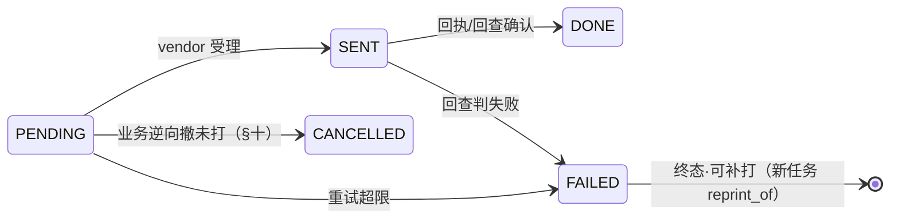

# TDD 打印域 · 方案与规格（合册）

状态：**草稿 · 待确认** · 创建 2026-08-28 · 同日扩版：补**运行逻辑**（触发矩阵/流水线/容错/重复语义/顺序）
定位：基座能力 I1–I4 的成册。**打印是设备通道不是餐饮功能**：零售小票、快递面单、后厨分单、美业服务单 ——
本质是「把一条结构化消息送到一台设备」，与 notify 送微信同构，居 `shop-channel/print`。
上游：核心能力清单 I1–I4 · 行业包功能清单 · SPI `PrintPayloadProvider`/`CorePrintApi` · [订单域](./订单域V2-设计规格书.md)（事件源）

---

# 第一部分 · 结构

## 一 · 决策记录

| # | 决策 | 一行理由 |
|---|---|---|
| 1 | 通道/设备/模板/路由/任务/重试在基座；**内容在行业**（`PrintPayloadProvider`） | 行业自带打印=第二个行业再抄一遍设备管理与补打 |
| 2 | **触发一律走事件**（A5 outbox + 行业工作流事件），业务域不直接调打印；任务落库在消费侧幂等 | 打印失败不回滚业务；可靠性由 outbox 承担，不另造一条 |
| 3 | **幂等在任务生成侧**（`idem_key = 事件id×scene`唯一） | 后厨票重复是最贵的重复 —— 真会多做一份菜 |
| 4 | 重复有**三种语义，三种处理**（§九）：系统重投=吞掉 · 自动重试=同任务 · 人工补打=新任务**票面带【补打】标** | 混为一谈就会出现"厨房照着补打票又做了一份" |
| 5 | 模板存库；解析链**三级兜底**：门店模板 → 平台默认 → 内置极简（代码常量，只打关键字段） | 任何一级失败都不许丢票 |
| 6 | 行业差异全落 `prn_route` 数据行；`match_expr` 受限表达式（§三），不 eval | 代码零行业分支；可脚本化=注入面 |
| 7 | vendor 适配器 SPI，只装适配不装业务判断 | channel 域既有规矩 |
| 8 | 重试退避有上限 → `FAILED` **可见可补打**；路由零命中**绝不静默丢**（按场景策略：告警 or 落默认机） | 一张没打出来的后厨票=一桌菜没人做 |
| 9 | **同一打印机串行 FIFO**、按业务时序投递；`URGE/VOID` 类任务**插队** | 厨房票乱序=上菜乱序；催菜条排队尾等于没催 |
| 10 | 业务逆向要**撤未打、冲已打**：PENDING 任务置 CANCELLED，已出纸的打冲销条（KITCHEN_VOID） | 退了的菜，票还挂在厨房就会被做出来 |
| 11 | **真机验收不可替代**：分单命中/中文/切纸/断网恢复/重提交幂等 | 假打印机的绿测不算数 |

## 二 · 表（终版 DDL，前缀 `prn_`）

```sql
CREATE TABLE prn_printer (
  printer_no VARCHAR(32) NOT NULL,
  store_no   VARCHAR(32) NOT NULL,
  name       VARCHAR(64) NOT NULL,               -- 「后厨-热菜」「前台小票机」
  vendor     VARCHAR(24) NOT NULL,               -- FEIE / YLY / P365（适配器注册表校验）
  device_sn  VARCHAR(64) NOT NULL,
  secret     VARCHAR(128) NOT NULL,              -- 加密存储
  paper      VARCHAR(8) NOT NULL DEFAULT '58',
  status     VARCHAR(16) NOT NULL DEFAULT 'ACTIVE',
  last_seen_at DATETIME NULL,                    -- 心跳回写；离线判定与告警据此
  UNIQUE KEY uk_printer (printer_no), UNIQUE KEY uk_printer_sn (vendor, device_sn),
  KEY idx_printer_store (store_no, status)
);
CREATE TABLE prn_template (
  template_no VARCHAR(32) NOT NULL,
  scene    VARCHAR(24) NOT NULL,                 -- 取值域 PrintScenes（§四）
  store_no VARCHAR(32) NULL,                     -- NULL=平台默认；门店行覆盖
  name     VARCHAR(64) NOT NULL,
  content  TEXT NOT NULL,                        -- {{}} 模板（§五）；纸宽适配由 vendor 层断行
  UNIQUE KEY uk_template (template_no), UNIQUE KEY uk_tpl_scene (scene, store_no)
);
CREATE TABLE prn_route (
  route_no   VARCHAR(32) NOT NULL,
  store_no   VARCHAR(32) NOT NULL,
  scene      VARCHAR(24) NOT NULL,
  match_expr VARCHAR(255) NULL,                  -- 受限表达式；NULL=场景兜底路由
  printer_no VARCHAR(32) NOT NULL,
  template_no VARCHAR(32) NULL,                  -- NULL=按解析链取模板
  copies     INT NOT NULL DEFAULT 1,
  priority   INT NOT NULL DEFAULT 0,             -- 具体在前、兜底在后
  enabled    TINYINT NOT NULL DEFAULT 1,
  UNIQUE KEY uk_route (route_no), KEY idx_route_lookup (store_no, scene, enabled, priority)
);
CREATE TABLE prn_job (
  job_no     VARCHAR(32) NOT NULL,
  store_no   VARCHAR(32) NOT NULL,
  scene      VARCHAR(24) NOT NULL,
  printer_no VARCHAR(32) NOT NULL,
  template_no VARCHAR(32) NOT NULL,
  payload    JSON NOT NULL,                      -- 渲染数据快照（补打原样重打的依据）
  biz_ref    VARCHAR(48) NULL,                   -- ORDER/O-1 · CHECK/chk-A3（撤销/冲销/追溯按它找）
  status     VARCHAR(16) NOT NULL,               -- §七 状态机
  priority   INT NOT NULL DEFAULT 0,             -- URGE/VOID=100 插队
  retry_count INT NOT NULL DEFAULT 0,
  vendor_msg_id VARCHAR(64) NULL,                -- 回执/回查凭据
  sent_at DATETIME NULL, done_at DATETIME NULL,
  last_error VARCHAR(255) NULL,
  reprint_of VARCHAR(32) NULL,                   -- 补打指向原任务（票面自动加【补打】）
  idem_key   VARCHAR(64) NOT NULL,
  UNIQUE KEY uk_job (job_no), UNIQUE KEY uk_job_idem (idem_key),
  KEY idx_job_dispatch (printer_no, status, priority, id),   -- 单机 FIFO+插队 的取数索引
  KEY idx_job_biz (biz_ref), KEY idx_job_retry (status, retry_count)
);
```

## 三 · `match_expr` 受限表达式（定稿）

`字段 op 值 {AND 字段 op 值}`；op ∈ `= != in`。**字段白名单**：
`stationNo · channel · lineKind · fulfillment · sceneArg.*` —— 超出即建路由报错。
存原文 + 编译缓存；**不 eval、不接脚本引擎**。
示例：`stationNo = ST-hot` · `channel in (TAKEOUT, DELIVERY)`。

## 四 · 场景取值域 `PrintScenes`

```
基座：ORDER_PAID(零售小票) · PICKING(拣货分单) · CASHIER_RECEIPT(收银)
餐饮：KITCHEN · KITCHEN_VOID(冲销条) · URGE(催菜) · PRE_BILL(预结,与小票视觉必须可区分) · CHECKOUT
美业：APPT_CONFIRM · SERVICE_START(含过敏提醒) · CARD_BALANCE(余次条,数字必取基座) · HANDOVER(交班)
```
每个场景登记两个属性：`critical`（要不要"零命中告警+落默认机"，KITCHEN=是、小票=可配）与
`dedupCritical`（补打必须带标，KITCHEN=是）。行业新增场景 = 常量 + 默认模板迁移行，不改基座代码。

## 五 · 模板（给运营写的）

`{{order.lines[].title}}` 路径取值 · 管道 `{{amount|fen2yuan}}` `{{at|time}}` · 区块 `{{#lines}}…{{/lines}}` ·
轻标记（`|c|` 居中、`**` 加粗）由 vendor 层译 ESC/POS 并按纸宽断行。
**解析链三级**：门店 `(scene, store)` → 平台 `(scene, NULL)` → 内置极简兜底（代码常量：单号/桌号/行名×数量）。
渲染失败落下一级并告警，**永不因模板丢票**。

---

# 第二部分 · 运行逻辑

## 六 · 触发矩阵（多业态：谁、在什么时刻、出什么票）

| 行业 | 业务时刻 | 事件源 | 场景 | 说明 |
|---|---|---|---|---|
| 零售 | 支付成功 | A5 `OrderPaid` | ORDER_PAID | 线上单小票（门店可关） |
| 零售 | 支付成功（邻里自提） | A5 `OrderPaid` | PICKING | 按拣货分区（station）分单 |
| 零售 | 收银台结清 | settle 完成事件 | CASHIER_RECEIPT | 含混合收款明细（来自 ord_payment） |
| 零售 | 称重确认 | 计量回写动作后 | ORDER_PAID(补差联) | 差价单联，`sceneArg.kind=ADJUST` |
| 餐饮 | **下达**（先付=onPaid；后付=台账下达事件） | A5 / 工作流事件 | KITCHEN | **按菜品 station 分单** —— 一次下达产出 N 张票 |
| 餐饮 | 退菜 | 工作流事件 | KITCHEN_VOID | 冲销条：原票号+菜名+原因，**插队** |
| 餐饮 | 催菜 | 工作流动作 | URGE | 插队 |
| 餐饮 | 预结 | **人工触发** | PRE_BILL | 直接落任务（无事件） |
| 餐饮 | settle 完成 | 结台事件 | CHECKOUT | 结账小票（收款明细多笔） |
| 美业 | 预约确认 | hold confirm 后事件 | APPT_CONFIRM | 可推送替代（门店配） |
| 美业 | 开工单 | 工作流事件 | SERVICE_START | 过敏提醒必在票面 |
| 美业 | 耗卡完成 | A5 `OrderPaid(TIMES_CARD)` | CARD_BALANCE | 余次**现查基座**，不用 payload 旧值 |
| 美业 | 交班 | 人工/Job | HANDOVER | 汇总取 `ord_payment` |

**多业态共存**：同一门店的场景集合 = 能力开关推出（`KITCHEN_PRINT`、`PRINT_RECEIPT`…），
矩阵行只在能力开着时生效 —— 触发端不判行业，**只判场景注册与能力**。

## 七 · 任务流水线（类比下单五步，共七步）与状态机

```
① 触发：事件（at-least-once）/ 动作后（事务外）/ 人工
② 幂等闸：idem_key = 事件id×scene（人工=操作id）——重投在此吞掉，零票
③ 渲染：PrintPayloadProvider.render(ctx) → PrintDoc[]（KITCHEN 按 station 分组出多 doc）
        失败 → 模板解析链降级 + 告警（不失败任务）
④ 路由：对每个 doc 按 (store, scene, priority) 首中；零命中 → critical？默认机+告警 : 按配置
⑤ 落库：prn_job ×copies 一批（含 payload 快照）——到此为止是"生成"，同步、幂等、可重放
⑥ 投递：per-printer 单通道 worker，按 (priority DESC, id ASC) 取 PENDING
        → vendor.send → SENT(记 vendor_msg_id) → 回执 → DONE
        失败退避 1s/5s/30s/2m/10m ×5 → FAILED(last_error)
⑦ 对账巡检（Job）：SENT 超时 → vendor 回查（msg_id）→ DONE/FAILED；
        printer 心跳超时 → 离线告警；critical 场景积压 N 分钟 → 升级告警
```



## 八 · 容错矩阵

| 故障 | 表现 | 处理 | 兜底 |
|---|---|---|---|
| 事件重投 | 同一 OrderPaid 到两次 | ② 幂等闸吞掉 | 唯一键兜底 |
| 渲染失败 | 行业 render 抛错/模板坏 | 解析链降级 → 内置极简 | 永不丢票，必告警 |
| 零路由 | 新店没配路由 | critical→默认机+告警；否则按场景配置 | 建店引导配路由 |
| 打印机离线 | 心跳超时 | 任务滞留 PENDING 排队，恢复自动 drain；离线告警 | critical 积压升级告警（菜没人做） |
| vendor API 失败 | 超时/5xx | 退避重试 ×5 → FAILED | B 端 FAILED 列表可批量补打 |
| 受理未出纸 | 缺纸/卡纸 | 回查得知 → FAILED(reason=缺纸) + 告警 | 换纸后补打 |
| 回执丢失 | SENT 悬挂 | 巡检回查 msg_id；不可判定超时 → FAILED | **宁可补打带标，不可悬空** |
| 业务取消 | 退菜/撤单/取消订单 | §十：撤未打 + 冲已打 | biz_ref 反查全链 |
| 打印域自身崩溃 | worker 重启 | 任务在库、状态可续跑；SENT 由巡检收敛 | 无内存态 |

## 九 · "重复打印"的三种语义（决策 4 展开）

| 语义 | 触发 | 处理 | 出几张 | 票面 |
|---|---|---|---|---|
| 系统重投 | outbox at-least-once | ② 幂等闸 | **0** | — |
| 自动重试 | 投递失败 | 同一 job 重试（没出过纸） | 1 | 正常 |
| **人工补打** | B 端 reprint（权限 `PRINT_REPRINT` 能力 + 场景权限码） | **新 job**，`reprint_of` 指原任务，payload 原样快照 | 1 | `dedupCritical` 场景**自动加【补打】大标** —— 厨房看见不重做 |
| 冲销（逆向） | 退菜等 | KITCHEN_VOID 新任务，引用原票号 | 1 | 【撤】+原因 |

## 十 · 业务逆向联动（与订单/工作流的接缝）

```
退菜/整单取消 事件 → 打印域按 biz_ref 反查：
  未投递(PENDING) → 置 CANCELLED（那张票不该出现在厨房）
  已出纸(DONE)    → 生成 KITCHEN_VOID 冲销条（插队）
  投递中(SENT)    → 不追（无法拦硬件），按已出纸补冲销
```
零售/美业同理：已打小票遇整单退款 → 不冲销（小票无执行语义），仅留痕。

## 十一 · 顺序与并发

- **同一打印机严格串行**（per-printer 单通道），按 `(priority DESC, id ASC)` —— 厨房票序=下单序；
- `URGE=100 · KITCHEN_VOID=90` 插队；普通=0；
- 跨打印机并行；同一门店多机互不阻塞；
- 补打不插队（它是历史票）。

# 十二 · Service 与 API

```java
PrinterService   upsert/list/testPrint(printerNo)         // 测试页=接线验收第一步
TemplateService  upsert/preview(templateNo, samplePayload)
RouteService     upsert/list/dryRun(scene, ctx) → 命中报告  // 上线前演练
PrintJobService  submit(scene, ctx, idemKey)              // ②–⑤ 同步完成
                 reprint(jobNo, operator) / cancelByBizRef(bizRef)
                 page(query) / retryFailed(jobNos)
PrintDispatcher  perPrinterLoop()                         // ⑥；PrintReconcileJob = ⑦（JobHandler）
```
```
GET/POST /biz/printers · POST /biz/printers/{no}:test
GET/PUT  /biz/print-templates · POST /biz/print-templates/{no}:preview
GET/PUT  /biz/print-routes · POST /biz/print-routes:dry-run
GET      /biz/print-jobs?status= · POST /biz/print-jobs/{no}:reprint · POST /biz/print-jobs:retry
```

# 十三 · 不变量与测试

P1 同 idem_key 只生成一批 ｜ P2 重试超限 FAILED 可见可补 ｜ P3 critical 零命中绝不静默丢 ｜
P4 模板三级链，永不因模板丢票 ｜ P5 补打=新任务+原快照+（dedupCritical）票面标 ｜
P6 单机 FIFO+插队序确定 ｜ P7 逆向撤未打冲已打 ｜ P8 SENT 必被巡检收敛（无悬挂终局）。
自动化覆盖 ②–⑤/⑦ 与状态机全图；撤掉幂等闸/插队序/解析链任一，对应用例必须变红。
**真机验收**：中文宽字符 · 58/80 切纸 · 分单命中三部门 · 断网 5 分钟恢复不丢不重 ·
同单重提交只出一套票 · 补打带标 · 退菜冲销条到达正确档口。

# 十四 · 施工
四表迁移（job 含 priority/vendor_msg_id 列）→ vendor 首家真机 → ②–⑤ 生成链 → ⑥ 单机通道 worker
→ ⑦ 巡检 Job → 事件订阅接线（A5 + 行业工作流事件 + 逆向联动）→ 端点与权限登记 → 默认模板种子 → 真机验收。
