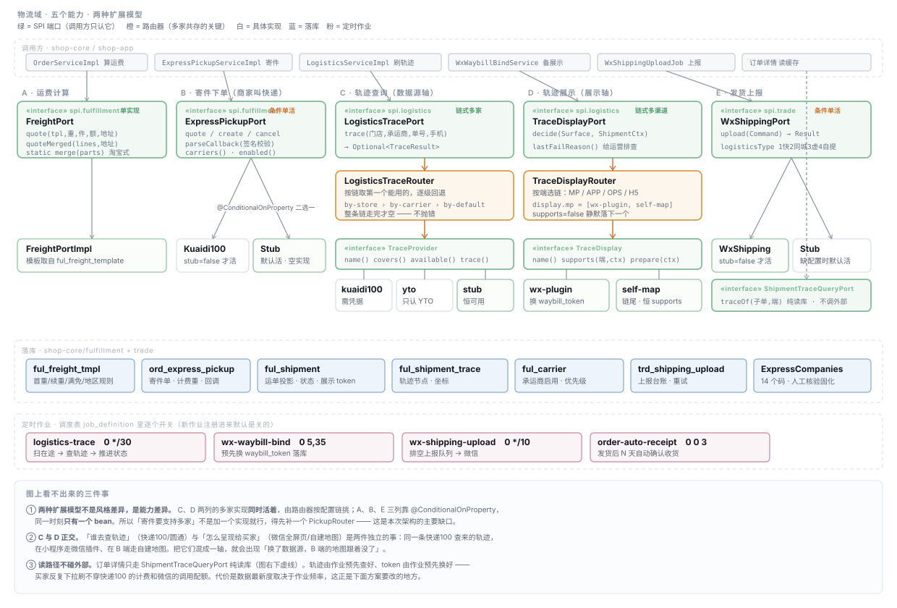

# TDD 物流域 · 完整方案

状态：**架构已梳理 · 签收闭环 A+B+C 已实现（2026-10-09）· 未发布**
档位：2（跨域架构 + 外部平台能力接入 + 扩展模型的不可逆决策）
关联：[TDD-快递100商家寄件](../TDD-快递100商家寄件.md)（寄件 + 运费模板）·
[TDD-快递100轨迹查询](../TDD-快递100轨迹查询.md)（数据源第一个真实 provider）·
[TDD-物流轨迹多渠道](../TDD-物流轨迹多渠道.md)（两轴设计）·
[TDD-通知与消息推送](./TDD-通知与消息推送.md) §13（买家触达现状对账）
起因：用户 2026-10-09「从整体架构上要支持多家，具体实现优先实现微信的全套能力」

---

## 一、L1 定位

物流域回答五个问题，**每个问题一个 SPI 端口**，调用方（交易域、运营端、B 端）只认端口：

| 问题 | 端口 | 谁在问 |
|---|---|---|
| 这单快递要收多少钱 | `FreightPort` | 下单算价 |
| 帮商家叫一次快递上门 | `ExpressPickupPort` | B 端发货 |
| 这个运单现在到哪了 | `LogisticsTracePort` | 轨迹轮询作业 |
| 这条轨迹给这个端怎么呈现 | `TraceDisplayPort` | 绑定作业 / 订单详情 |
| 把发货信息报给下单平台 | `WxShippingPort` | 上报作业 |

**物流域不持有订单状态。** 它只产出「运单事实」（到哪了、谁在送、多少钱），
订单状态由交易域按这些事实推进。这条边界决定了物流域可以整块换供应商而不动订单。

---

## 二、L2 结构



### 2.1 两种扩展模型 —— 这是「支持多家」的落点

| 模型 | 哪几个能力 | 怎么选 | 多家共存吗 |
|---|---|---|---|
| **链式路由** | 轨迹查询（C）· 轨迹展示（D） | 全部实现都注册成 bean，路由器按配置链逐个试，前一个不可用就落下一个 | ✅ **已支持** |
| **条件单活** | 寄件下单（B）· 发货上报（E） | `@ConditionalOnProperty` 挑一个 bean，另一个根本不存在 | ❌ **不支持** |
| 单实现 | 运费计算（A） | 只有一个实现 | 不涉及 |

**链式路由的三条语义**（两轴共用，别各写一套）：

1. **逐级回退，不抛错**：某一环「没注册 / `available()` 为假 / `covers()` 不认这个承运商 / 返回空」→ 落下一个。
   整条链走完仍为空 → 返回 `Optional.empty()`，界面显示「暂无轨迹」，**不是 500**。
2. **链尾必须恒真**：展示轴的 `self-map` 的 `supports()` 永远返回 true。没有恒真的链尾，
   就会出现「某种单子谁都不认、页面空白且无日志」。
3. **失败要留痕**：`TraceDisplayPort.lastFailReason()` 写进 `ful_shipment.display_fail_reason`。
   「supports=false 静默跳过」是常态不记，「prepare 失败」才记 —— 两者混在一起会把运营排查的唯一输入淹掉。

### 2.2 为什么 C 与 D 必须是两根轴

「谁去查轨迹」与「怎么呈现给买家」是正交的：同一条快递100 查来的轨迹，
在小程序走微信全屏物流页、在 B 端 App 和运营端走自建地图 + 时间线。

合成一轴的代价很具体：换数据源会把 B 端的地图一起换掉，而 B 端根本用不了微信插件
（插件只能在小程序内打开）。

### 2.3 读路径与写路径分开

- **写**（作业）：`logistics-trace` 查轨迹落 `ful_shipment_trace`；`wx-waybill-bind` 换 `waybill_token` 落 `ful_shipment`。
- **读**（订单详情）：只走 `ShipmentTraceQueryPort`，**纯读库，不调任何外部接口**。

理由是硬约束：快递100 按单计费且同一单 30 分钟内重查会锁单；微信 `trace_waybill` 有调用次数上限。
买家反复下拉刷新打不穿它们。代价是**数据最新度取决于作业频率** —— 见 §五的改法。

---

## 三、L3 详情

### 3.1 承运商码：单一词表，人工核验后固化

`ExpressCompanies`（`shop-base/common`）14 个码，值就是微信的 `delivery_id`，原样上报。
2026-09-20 用微信 `get_delivery_list` 全量表**逐个核验**过（韵达是 `YD` 不是 `YUNDA`；
顺丰取 `SF` 不是 `NSF`；百世快递 `HTKY` 与百世快运 `BTWL` 是两家业务）。

**是固化不是运行时拉取**：运行时拉会让「商家能选哪些快递」依赖一次外部调用的成败。
启用与优先级按租户存在 `ful_carrier`，运营端可开关。

### 3.2 数据源轴的链怎么算

`sourceChain(storeNo, carrier)` 首个命中即返回，**不合并**：

```
source.by-store[门店] › source.by-carrier[承运商] › store-route[门店]（旧键）
  › source.by-default（仅当它不是字面量 ["stub"]） › default-provider
```

已注册的 provider：`kuaidi100`（需 key + customer）、`yto`（只 `covers("YTO")`）、`stub`（恒可用）。

> **配置坑**：`application.yml` 写的是 `${SHOP_EXPRESS_TRACE_DEFAULT:stub}`，
> 而生产实配的键是 `SHOP_EXPRESS_TRACE_DEFAULTPROVIDER`。两个键都能生效
> （后者靠 Spring 的松绑定把 `defaultprovider` 对上 `default-provider`），
> 但**读 yml 的人会以为前者才是那个键**。两处应收敛成一个。

### 3.3 展示轴的链怎么算

`displayChain(surface)`，端为 `MP / APP / OPS / H5`，认不出一律当 `MP`。
生产实配：`display.mp = [wx-plugin, self-map]`，其余三端 `[self-map]`。

`wx-plugin` 的 `supports()` 要五个条件同时成立：端是 MP、appid 与 secret 非空、
买家 openid、微信交易号、运单号。缺任一静默落到 `self-map` —— 这是常态（自提单就没有运单号）。

### 3.4 发货上报：六种履约 → 微信四类

`WxLogisticsTypes`：`EXPRESS→1 快递`、`MERCHANT_DELIVERY→2 同城`、
`STORE_VERIFY/APPOINTMENT→3 虚拟`、`STORE_PICKUP/NEIGHBOR_PICKUP→4 自提`。

两条值得记的规则：
- `uploadOnPaid()`：服务类（到店核销 / 上门预约）**在支付成功时就上报**，不等发货 —— 它们没有发货动作。
- `needsTracking()`：只有 `EXPRESS` 需要运单跟踪，其余三类上报完就结束。

### 3.5 定时作业与它们的开关

| 作业 | cron | 做什么 |
|---|---|---|
| `logistics-trace` | `0 */30` | 扫在途运单（上限 300）→ 查轨迹 → 落节点 → 推进运单状态 |
| `wx-waybill-bind` | `0 5,35` | 给在途小程序单预先换 `waybill_token` 落库 |
| `wx-shipping-upload` | `0 */10` | 排空 `trd_shipping_upload` 队列 → 微信发货信息录入 |
| `order-auto-receipt` | `0 0 3` | 发货后 N 天自动确认收货 |

> **新作业注册进调度表默认是关的**（`job_definition.enabled=0`，`source=CODE`），要运营手工开。
> 2026-10-09 实查：`logistics-trace`（10-05 注册）与 `wx-waybill-bind`（10-08 注册）**从未被开过**，
> 所以轨迹只有手工触发那一次的节点、微信 token 也从不自动绑。当日已开启，开启后首轮就把
> 一条真实申通单从 1 个节点补到 5 个、状态从「已揽收」推进到「运输中」。
> **这是「代码上线 ≠ 功能上线」的一个实例**：代码、配置、调度开关三者都到位才算上线。

---

## 四、微信能力落地清单

微信把物流做成了一套闭环能力。**买家侧的通知与详情页微信已经全包，且不消耗订阅消息额度** ——
这一点改变了方案重心：我们自己的订阅消息只该留给微信不管的事。

| # | 微信能力 | 作用 | 状态 |
|---|---|---|---|
| 1 | `upload_shipping_info` 发货信息录入 | 录入后微信**自己跟踪运单**，在「已揽件 / 派件中 / 已签收」三个节点主动推送给买家；买家可从消息回访小程序 | ✅ **已接** |
| 2 | `trace_waybill` 物流查询组件 | 换 `waybill_token` → `openWaybillTracking` 打开微信全屏物流页（轨迹、地图由微信渲染） | ✅ **已接**（2026-10-09 打通） |
| 3 | `get_delivery_list` 运力列表 | 承运商码的权威来源 | ✅ 人工核验后固化（§3.1） |
| 4 | `upload_combined_shipping_info` 合单发货 | 一个支付单拆多个包裹时分别录入 | ❌ **未接** |
| 5 | `notify_confirm_receive` 确认收货提醒 | 我方得知签收后提醒买家确认收货（**每单限一次**，必填签收时间，且必须晚于发货时间） | ❌ **未接** |
| 6 | `trade_manage_order_settlement` 结算事件 | 买家确认收货 / 系统自动确认 → 回调我方（`confirm_receive_method` 区分手动与自动） | ❌ **未接** |

### 4.1 微信不提供的那一半

查过官方文档与社区：**微信不会把「已揽件 / 派件中 / 已签收」回调给我们** ——
那三条是微信推给**买家**的，不是推给开发者的。开发者侧只有结算事件（能力 6）。

所以**签收检测仍要自己查**（快递100 轮询），它是能力 5 的触发前提。
这条约束决定了轮询作业不能去掉，只能降频。

### 4.2 现在真正的缺口：签收之后什么都没发生

实查：`ful_shipment.status` 推到 `DELIVERED` 后**只是把运单移出轮询**，没有任何下游消费者；
自动确认收货按「发货后 15 天」算，根本不看签收（代码注释自己写着「接上签收后把它调小即可」）。

补上之后的闭环：

```
快递100 查到签收（TraceStatus.SIGNED）
   ├─→ 微信 notify_confirm_receive：提醒买家确认收货（每单一次）
   ├─→ 自动确认收货改按「签收后 N 天」起算
   └─→ 运单落 DELIVERED
微信 trade_manage_order_settlement 回调
   └─→ 买家已确认（或微信自动确认）→ 子单落 COMPLETED → 触发结算
```

---

## 五、L4 边界：待决与取舍

### 5.1 待决：寄件要不要支持多家

现状是条件单活（`Kuaidi100PickupGateway` 与 `StubExpressPickupGateway` 二选一）。
要支持多家（如同时接菜鸟 / 顺丰直连），**必须先补一个 `PickupRouter`**，
照搬轨迹轴那三条语义（逐级回退 / 链尾恒真 / 失败留痕）。

**本次不做**，理由：今天只有快递100 一家有账号，先补路由器是为没有的需求付设计成本。
但要记下判据：**第二家寄件渠道进来的那一刻就得补**，而不是在那时往 `if` 里塞分支。

### 5.2 待决：发货上报要不要抽象成多平台

`WxShippingPort` 名字里带 Wx，但「把发货信息报给下单的那个平台」是通用概念
（将来支付宝小程序、抖音小店各有一套）。

**暂不改名**：今天只有微信一个下单平台，改名要动 spi + 实现 + 配置三处，
收益是零。判据同上：第二个下单平台进来时再抽。

### 5.3 取舍记录

| 决策 | 选了 | 弃了 | 理由 |
|---|---|---|---|
| 轨迹查询与展示的关系 | 两根正交的轴 | 一根「渠道」轴 | 合成一轴会让换数据源把 B 端地图一起换掉 |
| 读路径 | 纯读库 | 读时实时查承运商 | 计费 + 锁单 + 微信调用配额；代价是最新度靠作业 |
| 承运商码 | 人工核验后固化 | 运行时拉 `get_delivery_list` | 不让「能选哪些快递」依赖一次外部调用的成败 |
| 链路由的失败 | 返回空，界面说「暂无轨迹」 | 抛错 | 物流查不到是常态（刚发货微信那边还没有），不是故障 |
| 买家发货通知 | 用微信自带的三节点推送 | 自己做订阅消息 | 微信免费且不占订阅额度；自己做要额外申请模板且每条耗一次授权 |

### 5.4 分批建议

| 批 | 内容 | 依赖 |
|---|---|---|
| **A** | 签收 → `notify_confirm_receive` 提醒买家确认收货 | ✅ **已实现**（`e8a67356f`） |
| **B** | 接 `trade_manage_order_settlement` 回调 → 子单落 COMPLETED | ✅ **代码已实现**；要在微信后台配回调 URL 与 token（**需人操作**） |
| **C** | 自动确认收货改按签收起算 | ✅ **已实现**（`7130cdd5c`） |
| **D** | 读时按需刷新 + 作业降频 + token 按需换 | 无 |
| **E** | 合单发货 `upload_combined_shipping_info` | 一单多包裹的产品决策 |
| **F** | 两处配置键收敛（§3.2）、`TraceRoutingProperties.withinTtl` 死代码清理 | 无 |

A+B+C 是一条线（签收闭环），价值最大；D 是成本与新鲜度优化；E 看产品需要；F 是清理。

### 5.5 签收闭环（A+B+C）的实现记录

```
快递100 查到签收（logistics-trace 作业）
   └─ ful_shipment.signed_at ←「推进到 DELIVERED 那一刻」记下（V386）
        ├─→ A  wx-confirm-receive 作业（0 10,40）
        │      → 微信 notify_confirm_receive：提醒买家去确认
        │        幂等落 trd_shipping_upload.confirm_notified_at（每支付单一次）
        └─→ C  order-auto-receipt 作业
               → 签收后 7 天 或 发货后 15 天，**先到者为准**

微信 trade_manage_order_settlement 事件（买家确认 / 微信自动确认）
   └─→ B  POST /mp/wx/callback（**已补验签**）→ WxPushEventService
          → 该支付单下 FULFILLING 的子单逐张 confirmReceipt
```

**三个当时想清楚了的取舍，记下来免得回头被"优化"掉：**

1. **签收时间在推进那一刻记，不事后反推。** 轨迹节点会被后续查询继续追加、顺序不保证，
   反推可能得到一个早于发货的时间，而微信要求 `received_time` 晚于发货（10060029）。
2. **自动确认收货取「先到者」，不是换成签收判据。** 直接换的话，第 10 天才签收的单
   会从第 15 天推迟到第 17 天完成 —— 状态机的改动把钱的到账时间往后推。
3. **回调事件按字段名在任意层级找，不赌嵌套结构。** 微信文档给了字段表
   （`confirm_receive_method` 1 手动 / 2 自动、`confirm_receive_time` 秒）
   但**没给完整报文**。按猜的层级取值，猜错时表现是「事件收到了、字段取不到、什么都没发生」——
   和没接一样且不报错。现在认不出订单就把原文整条落 WARN，**第一条真实事件就是把它改成精确解析的依据**。

**批 B 还需要人做的两件事**（都在微信后台「开发管理 → 消息推送」）：

小程序后台 →「开发管理 → 开发设置 → 消息推送」，**启用时要管理员扫码**（这一步没有接口，
微信没给自有小程序开放设置消息推送的 API，只能人工）。四项填法：

| 项 | 填什么 | 填错的后果 |
|---|---|---|
| 服务器地址 URL | `https://www.hxmall.top/mp/wx/callback` | —— |
| 令牌 Token | 与生产 `WX_PUSH_TOKEN` **同值**（已配好，见下） | 校验恒失败，而微信只说「token 验证失败」，不说是哪儿不对 |
| 消息加密方式 | **明文模式** | ⚠️ 选安全/兼容模式代码不认：我们验的是 `signature`、body 按明文 JSON 读；加密模式要验 `msg_signature` 并做 AES 解密 |
| 数据格式 | **JSON** | 选 XML 的话事件进得来但解析不出（会落一条「不是 JSON」的 WARN） |

> 没配 token 时 POST **拒收**（不是放行）—— 放行等于谁都能冒充微信把别人的订单推成已完成。
>
> **2026-10-09 实测：生产 `WX_PUSH_TOKEN` 早已配好，回调 URL 公网可达，
> 用真实 token 算签名打过去原样回显了 echostr —— 微信后台那一步「提交」会一次通过。**
> 读 token：`ssh soukmind-tx 'sudo grep "^WX_PUSH_TOKEN=" /data/app/ai-shop/shop-app/shop-app.env'`
>
> ⚠️ 配置键叫 `WX_PUSH_TOKEN`（`shop.wx.push.token`），**不是** `SHOP_WX_PUSH_TOKEN`。
> 我按后者查过一次、以为没配，还往 yml 里补了第二个 `shop.wx.push` ——
> **YAML 重复键会让整个 Spring 上下文起不来**，而报错不指向 YAML。
> 那一处上面本来就写着这条警告（有人踩过并合并了块），仍然没拦住我。
> 教训：改 yml 前先 `grep` 这个前缀下已经有什么。

**批 A 的作业要记得开**：`wx-confirm-receive` 注册进调度表默认是关的（见 §3.5），
部署后要在运营端开启，否则它一次都不会跑。
