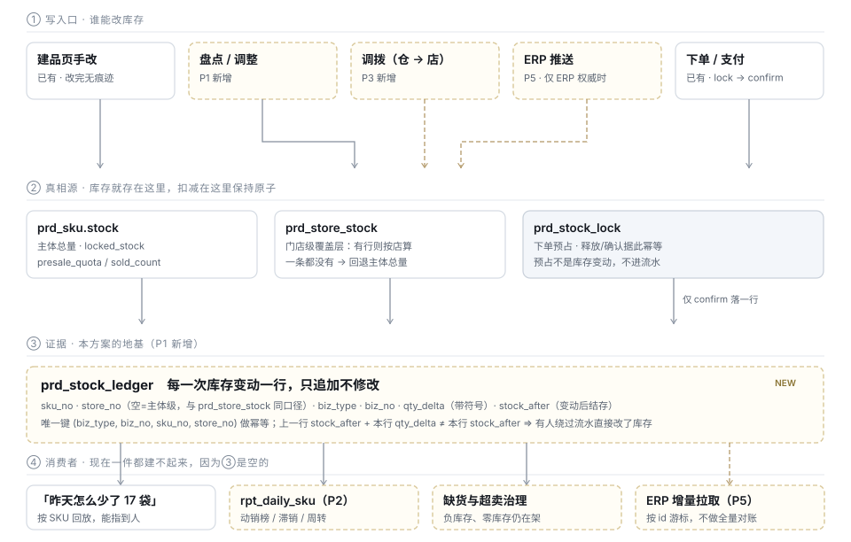

# TDD · 进销存与经营报表

> 状态：**草稿 · 待评审** · 2026-08-26（v2：重划「进」的边界，见 §二更正）
> 覆盖：库存流水 · 盘点 · 进货与成本 · 仓与调拨 · 报表与统计 · 导出 · ERP 对接
> 上游：[TDD-规格与SKU模型](./TDD-规格与SKU模型.md) —— SPU/SKU 的形态与外部身份在那份里已经定完，本文不重复，只接着它的 P5 往下走
> **与既有规划的关系**：[产品规划-下一阶段 §不做的事](./产品规划-下一阶段.md) 把「批量导入 / ERP / 账期」划在范围外。
> 本文 P1–P4 **不冲突**（进销存的减法版服务的是老陈的粮油店，不是连锁），真正冲突的只有 P5 的 Open API —— 见 §十待确认 ①

---

## 一、一句话

**平台做「电商 + 一份能对得上的货账」，不做 ERP。**

每一次库存变动留一行证据（P1），进货与毛利用减法版补上「进」（P2），
多店商家拿到仓与调拨（P3）—— 而有 ERP 的商家走接口（P5），我们不去重写一个 ERP。

---

## 二、先划线：两条判据，回答两个不同的问题

| 判据 | 回答的问题 | 不过这一条 |
|---|---|---|
| ① **不做会不会让线上交易出错？** | 这是**必须做**（平台自己的欠债） | 不代表不做，还要看 ② |
| ② **商家会不会因为没有它而不用我们？** | 这是**值得做**（产品竞争力，可作为付费档位） | 两条都不过 ⇒ 是 ERP 的 |

| 进销存的六件事 | ① 会出事？ | ② 商家会走？ | 结论 |
|---|---|---|---|
| **库存结存与扣减** | ✅ 超卖：顾客付了钱拿不到货 | ✅ | **必须做** · P1 |
| **销售出库** | ✅ 就是订单确认扣减 | ✅ | 已在跑 |
| **盘点与调整** | ✅ 账实不符时只能「把数直接改对」，改完与"卖掉了"一模一样 | ✅ | **必须做** · P1 |
| **调拨与仓** | ⚠️ 第二家店**开门即无货**（`prd_store_stock` 的「没有行视为 0」） | ✅ 多店商家的刚需 | **做** · P3 |
| **采购与入库** | ❌ 少录一张进货单，平台的订单一个字不会错 | ✅ **没有进价就算不出毛利，而毛利是他定价的唯一依据** | **做减法版** · P2 |
| 供应商档案 / 应付账期 | ❌ | ❌ 小店的供应商是微信里那个人 | 不做 |
| 加权平均成本核算 | ❌ | ⚠️ 想要，但要准就得每次入库都录且录准 | **只给估算**，标注口径（§5.3） |
| ERP 对接 | ❌ | ❌ **有 ERP 的商家按定义就是大商家**，不是当前客户 | P5，需先拍板 |

> **对 v1 的更正**：上一版把「采购与入库」整条推给 ERP，只用了判据①。
> 判据①决定"必须做"，它答不了"值不值得做"—— 而竞争力问题恰好全部落在判据②上。

这两条判据同时回答了「为什么不做 WMS 那一套（库位、拣货路径、波次）」：
储藏间没有库位，写进系统既不会让任何一单发得更快（①不过），也没有商家因为它离开（②不过）。

---

## 三、竞争力在哪，以及不在哪

### 3.1 「电商 + 进销存一体化」本身不是差异点

这个组合不是我们发明的 —— 有赞新零售、微盟智慧零售、管家婆云、秦丝，都是它。
**把它当差异点，等于拿一个还没跑通收款闭环的团队，去打人家做了十年的模块。**

### 3.2 真正可能成立的差异，库里已经有了

| 我们已有的 | 它在一般进销存 SaaS 里的位置 |
|---|---|
| 门店级库存覆盖层（`prd_store_stock`，有行按店算） | 企业版才有的"多门店" |
| 自提点与社区履约（`cmt_pickup_point` / `ful_group_pickup`） | 没有 |
| 预售额度与截单（`presale_quota` / `cutoff_at`） | 没有 —— 而生鲜社区店天天用 |
| 跨店总览（`cross_store_stats` 能力位） | 加价项 |
| 档位有稳定编号 + 归一量的规格库（四层） | 多数只有自由文本规格，跨店比价做不了 |

所以对外的说法不是「**我们也有进销存**」，是
「**库存这件事，我们从第一天就是多店 + 社区履约口径的**」。

**这个差别决定工作量是三个月还是三周**：前者是重写一个进销存，
后者是把已有的库存能力补上「账」（P1）与「进」（P2），然后讲成进销存。

### 3.3 排序上的真话

现行排序是 `A 收款闭环 → B 商业化落地 → C 分发触达 → D 数据与导出`。
进销存插在 A/B 之前，等于「商家还收不到钱，但能管库存了」。

**但 P1 是例外**：它不是新功能，是平台自己的欠债（超卖、追责、对账证据都缺），
做它的理由不是竞争力，是它本来就该有。
**P2 正好可以跟 B 一起走** —— 它是 `PRO` 档卖得动的东西（见 §六）。

---

## 四、现状：缺的不是功能，是证据

### 4.1 已经有的 —— 不要重建

| 能力 | 落点 | 关键语义 |
|---|---|---|
| SPU / SKU | `prd_goods` / `prd_sku` | 单规格 = 长度为 1 的 SKU 列表，**模型不分叉** |
| SKU 外部身份 | `prd_sku.barcode` / `merchant_sku_code` / `sale_unit`（V252） | ERP 对接的键**已经就位**；货号在商家命名空间内唯一，条码只是查找键 |
| 成本价 | `prd_sku.cost_price`（V194） | 仅 B 端可见，不下发买家端 |
| 主体库存 | `prd_sku.stock` / `locked_stock` | 扣减靠唯一键 + 条件更新防超卖 |
| 门店库存 | `prd_store_stock`（V13） | **覆盖层**：有任意一行则按店算，一行都没有才回退主体总量 |
| 预售额度 | `prd_sku.presale_quota` / `sold_count` / `cutoff_at`（V100） | `0` = 不预售，存量行为零变化 |
| 库存锁 | `prd_stock_lock`，带 `store_no` 与 `presale`（V13/V101） | lock / release / confirm 三段幂等 |
| 门店选品与门店价 | `prd_store_goods` / `prd_store_price` | 与库存同为"店级覆盖层" |
| 规格库四层 | `prd_spec_dim` / `_value` / `prd_category_spec` / `prd_merchant_spec_*`（V195/V213） | 档位有稳定编号 + 归一量 |
| 跑批基础设施 | `@Scheduled` + `@Profile("worker")` + `sys_job_run` + shedlock | 日快照直接挂上去，**不引调度平台** |
| 幂等 | `sys_idempotent` | Open API 的写接口直接复用 |
| 权限码 | `biz:stock`（改库存，含门店库存） | **已存在**，盘点不需要新权限码 |
| 档位能力位 | `sys_merchant_plan_def.cross_store_stats` | 注释写着"一期只有这一个" —— 加能力位照它的写法 |

### 4.2 缺的

| 缺口 | 后果 —— 不是"不方便"，是具体的坏事 |
|---|---|
| **库存流水** | 老板问「昨天还有 20 袋，今天怎么剩 3 袋」，**查不出来**。而 `biz:stock` 是 `CLERK`（店员）和 `PICKER`（理货员）都有的权限 —— 改库存本来就是他们今天的活，**平台却连"谁改的"都答不上来** |
| 盘点 | 账实不符时只能直接改数，改完在库里与"卖掉了"一模一样 |
| **进货与毛利** | 商家不知道自己赚多少。`cost_price` 有列但没有任何入口在维护它 —— 它现在基本是空的 |
| 仓 / 调拨 | 一处备货多店共享做不了。而 `prd_store_stock` 的「没有行视为 0」意味着新开的第二家店**开门即无货** |
| 日快照 | 经营数据每次实时 count 打在 `ord_order` 上；且与结算各写各的 SQL，**两个数不一样时没人解释得了** |
| 商品维度报表 | 商家不知道哪件在动、哪件压着 —— 那是他每周唯一真正要做的决策 |
| 导出 | 一条都没有 |
| Open API | ERP 只能拿 B 端用户 token 调，而那是给人用的：有效期短、绑设备、要短信验证码 |

### 4.3 所以第一件事不是仓库，也不是 ERP

**流水是地基。** 没有它：

- 报表只能从订单反推 —— 而退货、盘亏、报损、调拨、进货**都不在订单里**，反推出来的数注定对不上；
- 对账没有第三方证据 —— "卖出 X 件、库存少了 Y 件"，X≠Y 时无从判断哪边错；
- ERP 没有增量可拉，只能天天全量比对整个 SKU 表。



图上看不出来的三件事：

1. **第②层是真相，第③层是证据，不能对调。** 把流水做成真相源（每次读库存都聚合）
   意味着最热的写路径从「一条条件更新」变成「append + 聚合」，超卖会立刻回来。
2. **`prd_stock_lock` 那条线是虚的**：预占不是库存变动，只有 `confirm` 才落一行流水。
3. **第④层的消费者共用同一份证据**。各自去订单表反推，就会得到几个不一样的数。

---

## 五、详细设计

### 5.1 `prd_stock_ledger` —— 库存流水（P1）

```sql
CREATE TABLE IF NOT EXISTS prd_stock_ledger
(
    id          BIGINT(20)  NOT NULL AUTO_INCREMENT,
    sku_no      VARCHAR(64) NOT NULL,
    store_no    VARCHAR(64) DEFAULT NULL COMMENT '空 = 主体级，与 prd_store_stock 同一口径',
    entity_no   VARCHAR(64) NOT NULL COMMENT '冗余主体号：数据域锚点，也免 join',
    biz_type    VARCHAR(16) NOT NULL COMMENT 'INIT/SALE/REFUND/ADJUST/TRANSFER_IN/TRANSFER_OUT/PURCHASE/SCRAP',
    biz_no      VARCHAR(64) DEFAULT NULL COMMENT '订单号 / 盘点单号 / 调拨单号 / 进货单号；INIT 为空',
    qty_delta   INT(11)     NOT NULL COMMENT '带符号：出库为负，入库为正',
    stock_after INT(11)     NOT NULL COMMENT '这一行之后的结存',
    reason      VARCHAR(16) DEFAULT NULL COMMENT 'ADJUST/SCRAP 必填：CHECK 盘点/BROKEN 损耗/EXPIRED 过期/GIFT 赠送/OTHER',
    remark      VARCHAR(255) DEFAULT NULL,
    tenant_no   VARCHAR(32) NOT NULL DEFAULT 'MAIN',
    created_at  DATETIME    NOT NULL DEFAULT CURRENT_TIMESTAMP,
    created_by  VARCHAR(64) DEFAULT NULL COMMENT '谁改的。这一列是这张表存在的一半理由',
    PRIMARY KEY (id),
    UNIQUE KEY uk_ledger_biz (biz_type, biz_no, sku_no, store_no),
    KEY idx_ledger_sku_time (sku_no, id),
    KEY idx_ledger_entity_time (entity_no, created_at)
) ENGINE=InnoDB DEFAULT CHARSET=utf8mb4 COLLATE=utf8mb4_uca1400_ai_ci COMMENT='库存流水：只追加，不修改，不删除';
```

**六条设计约束，每条对着一个具体的坏事：**

| # | 约束 | 防住什么 |
|---|---|---|
| 1 | `qty_delta` **带符号**，不拆 `in_qty`/`out_qty` 两列 | 两列会把"求和"变成"减法"，任何一次漏减都不会被发现；一列求和 ≠ 结存立刻暴露 |
| 2 | 冗余存 `stock_after` | 不存的话，「8 月 12 号那天结存多少」要从头累加。**更重要的是它自校验**：上一行 `stock_after + 本行 qty_delta ≠ 本行 stock_after` ⇒ 有人绕过流水直接改了库存 —— 这是这张表能提供的最强断言 |
| 3 | `uk_ledger_biz` 做幂等 | 确认扣减重放不会写两行。与 `prd_stock_lock` 的幂等同一手法，不发明第二套 |
| 4 | **锁定不进流水**，只有 `confirm` 进 | 否则下单未付的单在流水里造出一进一出的噪声，而商家看到的"今天卖了"会包含没付钱的 |
| 5 | **流水不是真相源**，`prd_sku.stock` / `prd_store_stock` 才是 | 见 §4.3 图注①：改成聚合读会让超卖回来 |
| 6 | 只追加：不 UPDATE、不软删、没有 `deleted` 列 | 写错了就再写一行反向的。留下 `deleted` 列等于给"把证据擦掉"留了入口，而这张表的全部价值就是不能擦 |

**回填**：一条迁移给每个有库存的 SKU 写一行 `INIT`（`qty_delta = stock`，`stock_after = stock`）。
不回填的话，第一次盘点的自校验断言必然失败 —— 因为没有上一行。

**写入点**：全部收在 `StockPortImpl` 一处，与业务同事务。
分散到各调用方去写，迟早有一条路径漏写，而漏写的表现是"约束 2 报警"—— 排查方向会指向错的地方。

### 5.2 盘点与调整（P1）

- **盘点 = 一行 `ADJUST`**，不建单据表。商家点开某个 SKU，输入"实际有多少"，
  系统算 `qty_delta = 实盘 − 账面`，`reason` 必填。
  盘点单（一次盘一批）留到 P3 —— 单个 SKU 盘完就能用，先给能用的那一半。
- **权限复用 `biz:stock`**，不新开权限码。新开一个的代价是权限种子一致性守卫、
  角色矩阵文档、三端权限对齐清单各改一遍，换来的是同一件事。
- **`reason` 是枚举不是自由文本**：自由文本汇总不出「这个月报损了多少」，
  而那正是商家盘点后唯一想知道的数。
- **不允许把结存改成负数**，与建品页的现有约束一致（负库存会打乱 C 端置灰与到货提醒）。

### 5.3 进货单 —— 「进」的减法版（P2）

商家要的不是 SRM，是三个一句话能答的问题：**这批花了多少、还剩多少、卖一件赚多少。**

```sql
CREATE TABLE prd_purchase_note        -- 进货单头
    note_no / entity_no / store_no
    supplier_name VARCHAR(64)         -- 自由文本，不建档案
    total_cost_minor / noted_at / remark / created_by

CREATE TABLE prd_purchase_item        -- 进货明细
    note_no / sku_no / qty / unit_cost_minor
```

**三条约束：**

| # | 约束 | 防住什么 |
|---|---|---|
| 1 | **供应商是一个自由文本字段，不是一张表** | 小店的供应商是微信里那个人。建档案要维护、去重、合并，而商家填完一次不会再看第二眼。真需要时，从填过的历史做联想输入即可 —— 那是前端一个下拉，不是一个域 |
| 2 | 进货单**只落流水**，库存由流水入口统一加（每条明细一行 `PURCHASE`） | 单独开一条改库存的路径 = 第二个写入点，而 §5.1 约束 2 的自校验会因此常态报警，报警一旦常态就没人看 |
| 3 | **成本口径默认「最新进价」写回 `prd_sku.cost_price`，不做移动加权** | 移动加权要求每次进货都录且录准，漏一次之后所有历史毛利全错，**而错了不报警**。最新进价错得看得见（商家自己知道上次进多少钱），移动加权错得看不见。只给「最新价 / 手工价」两个选项，不给第三种 |

**毛利只是估算**：`(售价 − cost_price) × 销量`。界面必须标"估算"并给出算式 ——
不标的话商家会拿它去报税。

### 5.4 报表与统计（P2）

**两层，不是一层：**

| 层 | 数据源 | 覆盖 | 为什么这么分 |
|---|---|---|---|
| 实时层 | 直接查 `ord_order` / `prd_sku` | **今天** | 一天的数据量天然小，而"今天卖了多少"必须是此刻的 |
| 快照层 | `rpt_daily_*` | 昨天及以前 | 历史不会再变，每次重算是纯浪费；历史区间查询打在业务表上会随订单量线性劣化 |

```
rpt_daily_store  (stat_date, entity_no, store_no)
    orders / gmv_minor / refund_minor / paid_buyers / new_buyers
    avg_order_minor / owned_traffic_rate

rpt_daily_sku    (stat_date, entity_no, store_no, sku_no)
    sold_qty / sold_amount_minor / refund_qty
    stock_end / est_profit_minor      -- 结存来自流水当日最后一行；毛利按 §5.3 口径估算
```

**四条约束：**

1. **报表口径与结算口径必须走同一处取数。**
   现在 `BizDashboardController.stats` 与 `stl_bill` 各写各的 SQL。
   防住的是：商家看到经营数据 1 万、结算单 9 千 8，问客服，**客服也答不上来**。
   落地做法是跑批与结算共用一个口径方法，不各写 SQL。
2. **按天，不按小时。** 社区店的经营决策粒度是天。按小时的表大 24 倍，而目前没有一个问题需要它。
3. **按天幂等可重跑**：`REPLACE INTO`，跑批挂了重跑一次即可，不需要人工补数。
   跑批挂 `@Profile("worker")` + `sys_job_run` 记录，T+1 03:30 —— 与既有任务同一套。
4. **`est_profit_minor` 必须标"估算"**（见 §5.3）。

**报表清单 —— 按"看完能干什么"排，不按"数据好取"排：**

| 端 | 报表 | 看完能干什么 | 现状 |
|---|---|---|---|
| B | 经营日报（订单/GMV/客单价/退款） | 知道昨天怎么样 | 雏形已有（`/biz/dashboard/stats`），缺历史与趋势 |
| B | **商品动销榜 / 滞销榜** | **决定这周进什么、清什么** —— 商家每周唯一的真决策 | ❌ |
| B | **毛利榜** | 决定哪件该涨价、哪件在白忙 | ❌ 依赖 §5.3 |
| B | 库存周转与缺货预警 | 知道哪件要断货、哪件压了三个月 | ❌ 依赖 §5.1 |
| B | 会员复购与沉默客户 | 决定给谁发券 | 部分有（`/biz/customers` 已按沉默排序） |
| Ops | 平台大盘（GMV / 活跃商家 / 类目分布） | —— | 已有 `OpsDashboardController` |
| Ops | **库存健康度**（负库存、零库存仍在架、90 天未动销） | 治理：这些商品正在给买家制造失败的下单 | ❌ |

### 5.5 仓：不建新实体，仓是门店的一个类型（P3）

| 方案 | 结论 |
|---|---|
| 新建 `prd_warehouse` + `store_warehouse` 路由表 | ❌ 库存维度要从 `(sku, store)` 改成 `(sku, warehouse)`，`prd_store_stock` 全量迁移，而销售仍在 store 上 —— 每次扣减都要先解一次路由 |
| **`mch_store` 加 `store_type`，仓是一种门店** | ✅ 库存表结构一个字不动（`store_no` 既能是门店也能是仓）；单店商家零变化 |

```sql
ALTER TABLE mch_store
    ADD COLUMN store_type      VARCHAR(16) NOT NULL DEFAULT 'SHOP'
        COMMENT 'SHOP 门店 / WAREHOUSE 仓。仓不对 C 端露出、不进附近商家、不收款',
    ADD COLUMN stock_source_no VARCHAR(64) DEFAULT NULL
        COMMENT '这家店从哪里扣库存（另一个 store_no）。空 = 扣自己的';
```

**五条约束：**

1. **`stock_source_no` 的解析发生在扣减入口**，不改 `prd_store_stock` 的语义：
   `storeNo → 解析成 stockStoreNo（自己或它的源仓）→ 走既有逻辑`。
   防住的是：改 V13 的「没有行视为 0」= 全平台库存判定当天改变，**而没有任何人配置过仓**。
2. **仓不对 C 端露出**：不进附近商家、无店铺主页、`pay_merchant_no` 无意义。
   否则买家会导航到一个储藏间。
3. **不允许链式指向**（A→B→C）：被指向的门店自己必须 `stock_source_no IS NULL`。
   链式的第一个后果是环，第二个是没人说得清货到底从哪出。
4. **调拨 = 两行流水**（`TRANSFER_OUT` −N / `TRANSFER_IN` +N），共用一个 `biz_no`。
   在途与部分收货留到真有商家提出 —— 社区店的"调拨"是骑车把货搬过去，中间没有在途。
5. **仓占不占门店额度是商业决策**，见 §十待确认 ②。

### 5.6 导出（P4）

- **CSV，不是 Excel。** 引 POI 是为了一个下载按钮加一整套依赖。
- **UTF-8 带 BOM。** 防住"导出来在 Excel 里打开全是乱码"—— 这件事 100% 会发生。
- **手机号脱敏红线不变**（`MerchantOrderService` 已有此约束）：导出一次就永久离开平台。
- **每次导出写 `sys_audit_log`**：谁、什么时候、导了哪个区间。

### 5.7 ERP 对接（P5）

**唯一真正的设计决策：谁是库存的真相源。**

```
mch_entity（或新表 mch_erp_link）
    stock_authority  VARCHAR(16)  'PLATFORM' | 'ERP'
```

| 取值 | 含义 | 适合谁 |
|---|---|---|
| `PLATFORM`（默认） | 平台权威，ERP 只读 | 线上为主的商家 |
| `ERP` | ERP 权威，平台库存由 ERP 推 | 有收银系统、线下为主的商家 |

**二选一，不允许"都能改"。** 双写的后果不是冲突报错，是**后写静默覆盖先写**，
而两边都不知道自己被覆盖了 —— 表现为"库存莫名其妙变回去了"，且无法复现。

| 方向 | 接口 | 键 | 幂等 |
|---|---|---|---|
| 出 | `GET /open/v1/skus` | `merchant_sku_code` / `barcode` | —— |
| 出 | `GET /open/v1/orders?since={cursor}` | 订单号 | 游标按 `id`，不按时间（时钟回拨会漏单） |
| 出 | `GET /open/v1/stock-ledger?since={cursor}` | 流水 `id` | 同上 |
| 入 | `POST /open/v1/stock:sync` | 按 `merchant_sku_code` 定位 SKU | 复用 `sys_idempotent`，落一行 `ADJUST` 流水 |

**认证不复用 B 端 JWT**：新建 `mch_open_credential`（`app_key` + `app_secret` 哈希，
与运营端密码同一套 bcrypt；按 `entity_no` 授权、可吊销）。
B 端 token 有效期短、绑设备、要短信验证码 —— 那是给人用的，服务端对接拿不到也不该拿到。

**不做 webhook 推送**：要重试队列、签名、对方不可用时的堆积治理。先拉后推。

---

## 六、把它变成钱：进销存按增值包分档

`sys_merchant_plan_def` 已经有能力位的写法（`cross_store_stats`，注释写着"一期只有这一个"）。
进销存的能力位照它加，不发明新机制。

| 档 | 给什么 | 为什么在这一档 |
|---|---|---|
| **FREE** | 库存、**流水明细**、单 SKU 盘点 | 流水是平台自己的欠债（超卖追责、对账证据）。**藏在付费墙后面等于平台自己也没有证据** |
| **PRO** | 进货单与成本毛利、动销/滞销/毛利榜、经营日报与导出 | 这些是"帮他多赚钱"的，不是"帮平台不出事"的 —— **付费的分界线正在这里** |
| **CHAIN** | 仓与调拨、跨店库存总览、Open API（P5） | 只有多店商家用得上；`cross_store_stats` 已经在这一档 |

新增能力位（一条迁移）：`inv_purchase`（进货与毛利）、`inv_warehouse`（仓与调拨）。
**不给流水与盘点加能力位** —— 加了就要在每个入口判一次，而它们本来就该人人有。

---

## 七、分期

| 期 | 内容 | 依赖 | 风险 |
|---|---|---|---|
| **P1** | `prd_stock_ledger` + 回填迁移 + 写入点收口 + B 端盘点/调整入口 | 无 | **纯新增，上线当天零行为变化**。唯一风险是漏写入点，靠 §5.1 约束 2 的自校验兜住 |
| **P2** | 进货单 + 成本毛利 + `rpt_daily_*` 跑批 + 动销/滞销/毛利榜 + 库存健康度 | P1 | 口径统一要动 `BizDashboardController` 与结算共用取数 —— 属修改已测功能，需确认 |
| **P3** | `store_type` + `stock_source_no` + 调拨 + 批量盘点单 | P1 | 动扣减入口的路由解析，需全量库存场景测试 |
| **P4** | CSV 导出（订单 / 商品 / 流水 / 日报） | P2 | 低 |
| **P5** | `mch_open_credential` + Open API 四接口 + `stock_authority` | P1–P4 | **需要先解 §十① 的定位冲突** |

**对外可以说"带进销存"的时点是 P2 做完**（进 · 销 · 存 · 盘 四件齐了），不必等 P3/P5。

---

## 八、测试策略

| 场景 | 断言 | 类型 |
|---|---|---|
| 下单 → 支付 → 流水 | `confirm` 后恰好一行 `SALE`；`lock`/`release` 不产生任何行 | 场景测试 |
| 重复 confirm | 唯一键挡住，仍只有一行；结存不变 | 场景测试 |
| 盘点 | `stock_after` = 实盘值；`prd_sku.stock` 同步；`reason` 为空时拒绝 | 单元 + 场景 |
| 进货单 | N 条明细产生 N 行 `PURCHASE`；`cost_price` 按最新进价更新；单据删除不回滚流水（要写反向单） | 场景测试 |
| **自校验** | 对任一 SKU 按 `id` 顺序回放：`prev.stock_after + delta == stock_after`，全链闭合 | 守卫（跑批 + 测试各一处） |
| 负库存 | 盘点/调整改到负数被拒 | 单元 |
| 店级回退 | 有店级行时按店扣、无行时按主体扣，流水的 `store_no` 与之一致 | 复用 `StoreStockFlowTest` |
| 仓路由（P3） | `stock_source_no` 指向仓时扣的是仓的行；链式指向在保存时被拒 | 场景测试 |
| 日快照（P2） | 同一天重跑两次结果逐字相同；快照 GMV == 结算口径 GMV | 场景测试 |
| 档位门禁（P2/P3） | `FREE` 能看流水与盘点；`inv_purchase` 关时进货单入口 403 | 场景测试 |

**守卫**：自校验那条要能**撤掉修复就变红**——若删掉某个写入点的流水写入，
它必须报警并**点名到那个 SKU**。报得含糊的守卫等于噪声掩体。

---

## 九、取舍记录 —— 不做什么

| 不做 | 为什么 |
|---|---|
| 供应商档案 / 应付账期 / 对账单 | 两条判据都不过。小店的供应商是微信里那个人 |
| 加权平均 / 移动加权成本 | 漏录一次之后所有历史毛利全错**且不报警**。只给最新进价与手工价 |
| 批次与效期管理 | 生鲜真实需要，但它要求库存从"一个数"变成"一组批次"、扣减要选批次 —— **模型级分叉，必须单独立项** |
| WMS（库位、拣货路径、波次） | 储藏间没有库位。既不让单发得更快，也没人为它离开 |
| 把流水做成真相源 | 最热的写路径变成 append + 聚合，超卖立刻回来 |
| 流水的 UPDATE / 软删 | 留下擦除入口 = 这张表的全部价值归零。写错了再写一行反向的 |
| 独立的 `prd_warehouse` 实体 | 见 §5.5：库存维度改写 + 全量迁移，换来的是 `store_type` 一列能给的东西 |
| 调拨在途 / 部分收货 | 社区店的调拨是骑车搬过去，中间没有在途 |
| 新的盘点权限码 | `biz:stock` 已存在且语义正好 |
| 给流水与盘点加档位能力位 | 平台自己的欠债不能藏在付费墙后面 |
| ClickHouse / 数仓 | 一张日表，一年 365 × 门店数行。MariaDB 绰绰有余 |
| 按小时的报表 | 大 24 倍，而没有一个问题需要它 |
| ERP webhook 推送 / 双向实时同步 | 两个系统都认为自己是真相源，冲突静默且不可复现。先拉后推 |
| 把「一体化」当差异点对外讲 | 见 §3.1 —— 所有同类产品都有，讲它等于把战场选在对方最厚的地方 |

---

## 十、待确认

| # | 决策 | 挡住谁 | 现状 |
|---|---|---|---|
| ① | **P5（Open API / ERP 对接）是否解禁。** 本文 P1–P4 与《产品规划-下一阶段》「不做大商家能力」**不冲突** —— 减法版进销存服务的是老陈的粮油店；真正冲突的只有 Open API，因为有 ERP 的商家按定义就是大商家 | 只挡 P5 | **未定** |
| ② | 仓占不占门店额度 | P3 的商业化口径。不占，`CHAIN` 档白送仓；占，商家会拿一个门店名额当仓，`FREE`（3 家）实际只剩 2 家店 | **未定** |
| ③ | 进销存三档怎么切（§六那张表） | P2 的能力位迁移。特别是「进货与毛利」放 `PRO` 还是 `FREE` —— 放 `FREE` 拉新更快，放 `PRO` 才有付费理由 | 倾向 `PRO` |
| ④ | `stock_authority` 是主体级还是门店级 | P5 的表设计。主体级简单；但连锁可能只有旗舰店接了 ERP | 倾向主体级 |
| ⑤ | `rpt_` 是新的域前缀 | 需在[全域命名基准](../reference/全域命名基准.md)登记。备选是拆回各自域，但 `rpt_daily_sku` 天然跨域（销量在 ord，结存在 prd） | 倾向登记 `rpt_` |

---

## 十一、实现任务

**P1（可立即开工，不依赖任何待确认项）**

- [ ] 迁移：建 `prd_stock_ledger`
- [ ] 迁移：回填 `INIT` 行（主体级 + 已有店级行）
- [ ] `StockPortImpl` 收口写入点：`confirm` / 退款回补各落一行，与业务同事务
- [ ] `MerchantGoodsServiceImpl` 改库存的三处写入点接流水（`ADJUST`）
- [ ] 实体 `PrdStockLedger` + mapper（迁移加表必须补实体，否则那些列永远读出 null）
- [ ] B 端：SKU 库存变动明细页 + 盘点入口（权限 `biz:stock`）
- [ ] 自校验守卫（跑批一处 + 测试一处），撤掉修复必须变红且点名
- [ ] 场景测试：§八 前三行 + 自校验 + 负库存 + 店级回退
- [ ] 新增页面后重跑 `python3 scripts/gen-ui-catalog.py` 并提交 JSON

**P2（依赖 ③ 的分档决定，但进货单本身不依赖）**

- [ ] 迁移：`prd_purchase_note` / `prd_purchase_item` + 能力位 `inv_purchase`
- [ ] 进货单落 `PURCHASE` 流水 + `cost_price` 回写（最新进价 / 手工价二选一）
- [ ] `rpt_daily_store` / `rpt_daily_sku` + 跑批（worker + `sys_job_run`）
- [ ] 口径统一：跑批与结算共用取数（**修改已测功能，需先确认**）
- [ ] B 端：动销/滞销/毛利榜、经营日报趋势；Ops：库存健康度

---

确认记录：待用户确认（v2 于 2026-08-26 按「进销存是否坐进来」的追问重划边界）
