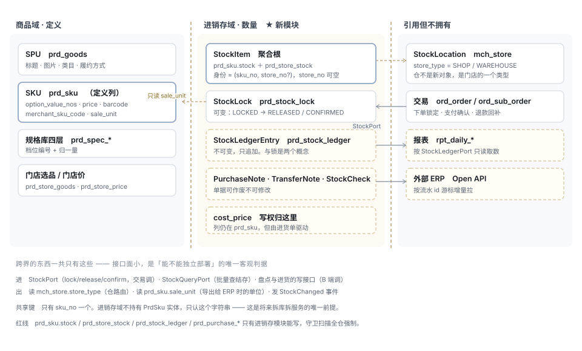

# TDD · 进销存模块化 · 独立部署 · 领域对象

> 状态：**草稿 · 待评审** · 2026-08-26
> 回答三个问题：① 独立 Java 模块与独立部署 ② 要不要独立库 ③ 领域对象梳理
> 上游：[TDD-进销存与经营报表](./TDD-进销存与经营报表.md)（做什么）·
> [进销存-销售-财务-全链路与产品矩阵](./进销存-销售-财务-全链路与产品矩阵.md)（在整体里的位置）
> ⚠️ **§3「不拆库」已被业务决策取代**（2026-08-26）：进销存确定作为可独立交付的产品，
> 那正是本文 §3.4 写下的翻盘条件之一。独立库形态下的领域抽象见 [TDD-进销存领域模型](./TDD-进销存领域模型.md)。
> **§2（冷热切分与 profile）与 §4（对象边界）继续有效**，新方案建立在它们之上。
> 关联决策：[ADR-016](../ADR/ADR-016-后端暂不拆构建产物-边界在数据不在jar.md)（§3「第一刀切在数据」仍有效）·
> [TDD-三端服务拆分](./TDD-三端服务拆分-架构与依赖规划.md)（目标架构，待确认）

---

## 一、一句话

**模块现在就建，部署按冷热切，库不拆 —— 但把「能不能拆库」变成一条可验证的守卫。**

三个问题的答案硬度不同：模块化是**现在做，几乎零成本**；
独立部署是**冷路径现在就能，热路径永远不该**；
独立库是**现在不做，且要写下翻盘条件，免得每季度重议一次**。

---

## 二、问题①：独立模块与独立部署

### 2.1 独立 Maven 模块：现在就做

**现状对这件事极其有利**：

```
shop-base ←── shop-channel · shop-core · shop-merchant · shop-notify · shop-settle
                                    ↑
                              shop-app（装配 + 迁移 + 测试）
```

六个域模块**全部只依赖 `shop-base`，彼此零依赖**，跨域调用 100% 走 `shop-base` 里的 Port
接口。**加第八个模块是照抄 `shop-settle` 的 pom**，不是架构改造。

| 项 | 内容 |
|---|---|
| 模块名 | **`shop-inventory`** |
| 依赖 | 只依赖 `shop-base`（与 `shop-merchant` / `shop-settle` 同构） |
| 从 `shop-core` 搬出 | `PrdStoreStock` · `PrdStockLock` · `StockPortImpl` + 各自 mapper |
| 新增落这里 | `prd_stock_ledger` · `prd_purchase_*` · 盘点 / 调拨 / 报表取数 / Open API |
| 迁移文件 | **仍留 `shop-app`**（与今天一致，见 §六风险） |

> **命名取今天的兄弟，不取还没确认的规划。** 三端拆分 TDD 规划的是
> `shop-domain-inventory`，但那份**状态是「待确认」且代码零改动**；
> 而 `shop-merchant` / `shop-settle` / `shop-notify` 是**已经落地的事实**。
> 将来若整体改名 `shop-domain-*`，它跟着一起改；
> **现在单独用规划里的名字，会造出仓库里唯一一个不一样的模块名**。

### 2.2 独立部署：先把进销存切成冷热两半

**一条硬约束先摆出来**：

`OrderServiceImpl:869` 的 `stockPort.confirm(orderNo)` 与订单转态、结算计提**在同一个事务里**
（三端拆分 TDD §7.3 原话：「下单今天在一个事务里跨 trade / product（锁库存）/ settle」）。

把这条路径拆到另一个进程，只有两条路，**两条都不能走**：

| 路 | 后果 |
|---|---|
| 分布式事务（2PC） | 给一个日单量三位数的系统引入两阶段提交 |
| Outbox 最终一致 | **超卖不能最终一致**。锁库存必须同步强一致，否则两个人同时下单都成功，而错误在发货那天才暴露 |

**所以扣减这条路径永远不该跨进程。** 但这恰好给出一条干净的切法：

| | 内容 | 在下单关键路径上吗 | 能独立部署吗 |
|---|---|---|---|
| **热路径** | `lock` / `release` / `confirm`、结存读 | **是** | **不能** |
| **冷路径** | 流水查询、盘点、进货单、调拨、报表跑批、导出、Open API | 否 | **能，现在就能** |

冷路径独立部署的收益是真的，不是为拆而拆：

- 报表跑批是 CPU 密集且按天跑一次；
- 导出一年流水是长事务、大结果集；
- Open API 是**外部流量**：QPS 不可控、要单独限流、要独立故障域。

**把它们和「下单」放同一个进程，等于一个商家导出流水能拖慢所有人下单。**

### 2.3 落地形态：不是第二个 jar，是多一个 profile

今天 `api` / `ops` / `worker` 就是**同一个 jar 三个 profile**，隔离靠
Controller 上的 `@Profile` —— 以 `ops` 起时 `/mp/**` 直接 404，不是 401。

进销存的冷路径照抄这个机制：

```
shop-inventory（一个模块，两种装配）
   ├── 热路径 StockPortImpl        → 被 api profile 装配，与下单同进程
   ├── 冷路径 Controller           → @Profile("biz") 常规装配（盘点/进货，B 端低频人工）
   ├── 报表跑批 Job                → @Profile("worker")   ← 已有进程，零新增
   └── Open API Controller         → @Profile("openapi")  ← 新 profile，独立进程 + 独立限流
```

**「目前就可以独立部署」的正确答案是这个**：不是拆出第二个构建产物，
是**多一个 profile、多起一个进程**。构建产物仍是一个，流水线仍是一条，
而故障域、限流、扩缩容全都拿到了。

拆构建产物的翻盘条件与 ADR-016 §4 一致：**驱动力是组织（两个团队各自发版），不是技术。**

---

## 三、问题②：独立库

### 3.1 结论：不拆。三条理由按硬度排

| # | 理由 | 硬度 |
|---|---|---|
| 1 | **扣减的原子性是一条 SQL 的原子性。** `prd_sku.stock` 防超卖靠「唯一键 + 条件更新」。跨库之后「查库存 + 扣减 + 写订单行」要么 2PC、要么补偿事务 —— 而补偿的失败模式是「超卖了再退款」，自提场景下就是顾客到店取不到货 | **硬** |
| 2 | **库存与商品在同一张表里。** `prd_sku` 一行既有 `stock` 又有 `price` / `option_value_nos` / `barcode`；`prd_store_stock` 与 `prd_store_price` 是孪生结构。拆库要先把 `prd_sku` 竖切成两半，那是**模型级手术**，且切完每次读商品详情都要跨库取数 | **硬** |
| 3 | **今天 `prd_sku.stock` 被 trade 写。** ADR-016 §3.1 的原话是「拆了进程但共库 = 分布式单体」；反过来同样成立：**拆库的前提是这个域的表不被别人写**，而这一条今天不成立 | 可解，见 §3.3 |

### 3.2 不推荐的中间态：同实例、独立 schema

看起来像"演练"，实际什么都没隔离：**MariaDB 的跨 schema join 是免费的**，
写一句 `ai_shop.ord_order JOIN ai_shop_inv.prd_stock_ledger` 就过去了，
没有任何东西会报错。**它挡不住耦合，只多一层运维复杂度**（备份、权限、迁移各两套）。

一个不会失败的演练，演练的是错觉。

### 3.3 推荐的中间态：写权收口 + 一条守卫

真正朝拆库走的一步是**把写权收口，并让它可验证**：

**规则**：下列表（列）**只有 `shop-inventory` 能写**，其他模块一律走 Port：

```
prd_sku.stock / locked_stock / presale_quota / sold_count / cost_price
prd_store_stock
prd_stock_lock
prd_stock_ledger        （P1 新增）
prd_purchase_note/_item （P2 新增）
```

**守卫**：扫描全仓，`shop-inventory` 以外的模块出现对这些表的写调用（mapper 的
`insert` / `update` / `delete`，或含它们的 `@Update`）就红，并**点名到类与行**。

这条守卫的价值：

- 它把「能不能拆库」从一个凭感觉的讨论，变成**一个客观的绿灯**
  —— 正是 ADR-016 §5.1 说的、至今没建的那种依据；
- **守卫绿了一整年，拆库才是一次配置改动；守卫没有，拆库永远是一次考古。**

> 顺带：这条守卫今天就会红一次 —— `stockPort.confirm` 走的是 `StockPortImpl`（在 inventory 里，✅），
> 但 `MerchantGoodsServiceImpl` 直接写 `prd_sku` 的 stock 列（改库存入口）。
> **那正是 P1 要收口的写入点** —— 守卫与 P1 是同一件事的两面。
> （逐处数清楚是 **12 处**，见[代码结构与现状对齐 §4.1](./进销存-代码结构与现状对齐.md)。）

### 3.4 什么时候翻盘（写下来，免得每季度重议）

| 触发条件 | 为什么那时值得 |
|---|---|
| 库存写 QPS 成为主库瓶颈 | 今天离得很远（日单量三位数） |
| **进销存要卖给非本平台商家** | 那时它有自己的客户与生命周期，**独立库是产品边界不是技术边界** —— 这是最可能真实发生的一条 |
| 两个团队各自排期发版 | 与 ADR-016 §4 同一条线 |

**不构成翻盘条件**：表变大、觉得单体不好看、"微服务是趋势"。

---

## 四、问题③：领域对象

### 4.1 边界一句话：定义归商品域，数量归进销存域

进销存的边界不是"商品"，是**数量**：

- SKU 的**定义**（标题、规格档位、售价、条码、单位）属于**商品域**；
- SKU 的**数量**（结存、锁定、流水、成本）属于**进销存域**；
- 两者共享的东西**只有 `sku_no` 一个键**，没有第二个。



**表现在不竖切，代码上先切干净**：`shop-inventory` 只认 `sku_no` 字符串，
**不持有 `PrdSku` 实体**。这一条是将来拆库拆服务的唯一前提，
而它今天就能做到，且不需要动任何一张表。

### 4.2 对象清单

| 对象 | 类型 | 身份 | 归属 | 落表 | 现状 |
|---|---|---|---|---|---|
| SPU | 聚合根 | `goods_no` | product | `prd_goods` | ✅ |
| SKU（定义） | 聚合根内实体 | `sku_no` | product | `prd_sku` 定义列 | ✅ |
| 规格维度 / 档位 | 值对象 | `dim code` / `value_no` | product | `prd_spec_*` 四层 | ✅ |
| 门店选品 / 门店价 | 实体 | `(store_no, goods_no/sku_no)` | product | `prd_store_goods` / `prd_store_price` | ✅ |
| **StockItem 库存项** | **聚合根** | **`(sku_no, store_no?)`** | **inventory** | `prd_sku.stock` / `prd_store_stock` | ✅ 表有，无聚合根 |
| **StockLock 库存锁** | 实体（可变） | `(lock_no, sku_no, store_no?)` | inventory | `prd_stock_lock` | ✅ |
| **StockLedgerEntry 流水** | **不可变实体** | `id` | inventory | `prd_stock_ledger` | ❌ P1 |
| **PurchaseNote 进货单** | 聚合根 | `note_no` | inventory | `prd_purchase_note/_item` | ❌ P2 |
| **StockCheck 盘点** | 聚合根（P3 批量时） | `check_no` | inventory | 流水 `ADJUST` | ❌ P1/P3 |
| **TransferNote 调拨单** | 聚合根 | `transfer_no` | inventory | 两行流水 | ❌ P3 |
| **CostPrice 成本价** | 值对象 | —— | **inventory** | `prd_sku.cost_price` | ⚠️ 列有，归属要改 |
| **StockLocation 库位** | **值对象（引用）** | `store_no` | **merchant** | `mch_store.store_type` | ❌ P3 |
| 售价 | 值对象 | —— | product | `prd_sku.price` | ✅ |

### 4.3 五个容易做错的地方

| # | 约束 | 防住什么 |
|---|---|---|
| 1 | **`StockItem` 的身份是 `(sku_no, store_no?)`，`store_no` 可空** | 空 = 主体级。这不是"两种库存"，是同一个聚合根的两种粒度。做成两个类之后，「这个 SKU 到底按哪种算」会在每个调用点各判一次，而 V13 的覆盖层语义只有一份 |
| 2 | **仓不是新对象**，是 `StockLocation` 的一个 kind，落在 `mch_store` 上 | 进销存**引用**它，不拥有它 —— 所以 inventory 不能写 `mch_store`。新建一个 `prd_warehouse` 会让"货从哪出"有两个真源 |
| 3 | **`cost_price` 的写权从 product 移到 inventory** | 它由进货单驱动，是货账的一部分，不是商品定义。列不动、写权动 —— 不改的话，进货单和建品页会各自写它，而两边算出的毛利不一样 |
| 4 | **`StockLock` 不是流水** | 锁可变（`LOCKED→RELEASED/CONFIRMED`），流水不可变。合成一个概念之后，「释放」要么变成删流水（擦证据），要么变成写一行反向流水（把没成交的单算进销量） |
| 5 | **inventory 不持有 `PrdSku` 实体，只认 `sku_no`** | 持有之后，拆库/拆服务时这条引用要在几十处解开；不持有则是一次配置改动 |

### 4.4 Port 面 —— 接口面小是能不能拆的唯一判据

**进（别人调 inventory）**

| Port | 谁调 | 用途 |
|---|---|---|
| `StockPort`（已有） | trade | `lock` / `release` / `confirm` |
| `StockQueryPort`（新） | product · portal | 批量查结存（商品详情、B 端列表） |
| `StockLedgerPort`（新，只读） | 报表跑批 · Open API | 按 `id` 游标增量取流水 |
| 盘点 / 进货写接口 | B 端 portal | 低频人工操作 |

**出（inventory 调别人）**

| 依赖 | 用途 | 备注 |
|---|---|---|
| `MerchantQueryPort` 读 `store_type` | 仓路由（P3） | 只读 |
| 读 `prd_sku.sale_unit` | 导出给 ERP 时的单位 | 只读 |
| 发 `StockChanged` 事件 | 报表跑批、将来的 MQ | 走已有 Outbox |

**总计进 4 出 3。** 对比：`shop-core` 今天是 250 个文件 9 个域包，
"一依赖就全背上"。**接口面小到能在一张表里列完，就是这个模块能独立部署的证据。**

> 附带一条现状更正：三端拆分 TDD §2.4 记的「Outbox 投递任务根本没在跑」**已经不成立** ——
> `OutboxDispatchJob` 在 `@Profile("worker")` 下每 5 秒跑一次。跨服务异步的前置条件已经具备。

---

## 五、模块落位与要同步更新的东西

| 项 | 动作 |
|---|---|
| `backend/pom.xml` | `<modules>` 加 `shop-inventory` |
| `backend/shop-app/pom.xml` | 加依赖（装配方） |
| `shop-core` → `shop-inventory` | 搬 `PrdStoreStock` / `PrdStockLock` / `StockPortImpl` + mapper。**纯搬家，单独一次提交，零行为变化** |
| [迁移后-项目模块与数据归属清单](../reference/迁移后-项目模块与数据归属清单.md) | product 的表数减少、新增 inventory 一节 |
| [TDD-三端服务拆分](./TDD-三端服务拆分-架构与依赖规划.md) §4.2 | kernel 模块从 8 变 9 |
| 架构守卫 | `ScheduledJobConventionTest`、entity-alignment、模块依赖守卫要认新模块 |
| **写权守卫（新）** | §3.3 那条 |

**搬家的验收沿用仓库里已有的那条**：把 HEAD 的对应行段抽出来 `diff` 新文件 **0 行差异**，
原类的 diff **全删除、零新增**。两条不成立就不叫搬家。

---

## 六、分期

| 期 | 内容 | 成本 | 风险 |
|---|---|---|---|
| **S0** | 建 `shop-inventory` + 搬三个类 + 写权守卫 | 半天 | **零行为变化**。守卫首次会红在 `MerchantGoodsServiceImpl` 的三处写入点 —— 那正是 P1 要收口的 |
| **S1** | P1 的流水 / 盘点 / 退货回补**直接写在新模块里** | 与 P1 同 | 本来就要写，写在哪都一样 —— **所以 S0 必须在 P1 之前** |
| **S2** | 报表跑批挂 `worker`；盘点/进货走常规 profile | 一行配置 | 低 |
| **S3** | Open API 独立 `@Profile("openapi")` + 独立限流 | 中 | 需先解 Open API 的定位拍板 |
| **S4** | 拆库 | —— | **只在 §3.4 触发条件命中时** |

> **S0 的时机是唯一有窗口的**：P1 的流水与盘点是**新代码**，写进 `shop-core` 再搬出来是
> 两倍工作量，而且搬的时候它已经有调用方了。**先建模块，再写 P1。**

---

## 七、不做什么

| 不做 | 为什么 |
|---|---|
| 把 `lock/confirm` 拆到独立进程 | 超卖不能最终一致（§2.2） |
| 独立 schema 作为"演练" | 跨 schema join 免费，什么都没隔离（§3.2） |
| 现在拆库 | §3.1 三条，且第 2 条是模型级手术 |
| 新建 `prd_warehouse` 实体 | 仓是 `mch_store` 的一个类型，见 TDD-进销存与经营报表 §5.5 |
| 让 inventory 持有 `PrdSku` 实体 | 拆分时要在几十处解开 |
| 用 `shop-domain-inventory` 这个名字 | 规划仍是「待确认」且代码零改动；单独用它会造出仓库里唯一一个不一样的模块名 |
| 把迁移文件搬进新模块 | 迁移集中在 `shop-app` 是今天的事实；分散之后迁移号撞车会从"偶尔"变成"必然" |
| 为拆分引入 MQ / 网关 | 三端拆分 TDD §10 已明确一期不做 |

---

## 八、待确认

| # | 决策 | 挡住谁 |
|---|---|---|
| ① | 模块名 `shop-inventory` 是否认可（对齐今天的兄弟，不对齐待确认的规划） | S0，**它挡住 P1 的开工位置** |
| ② | `cost_price` 写权移到 inventory 是否认可 | P2 的进货单 |
| ③ | Open API 是否独立 profile（还是先跟 `biz` 合并） | S3；也依赖 Open API 本身是否解禁 |
| ④ | 写权守卫红了之后是"拦提交"还是"只报告" | S0。倾向**拦**：只报告的守卫三周后没人看 |

---

确认记录：待用户确认
