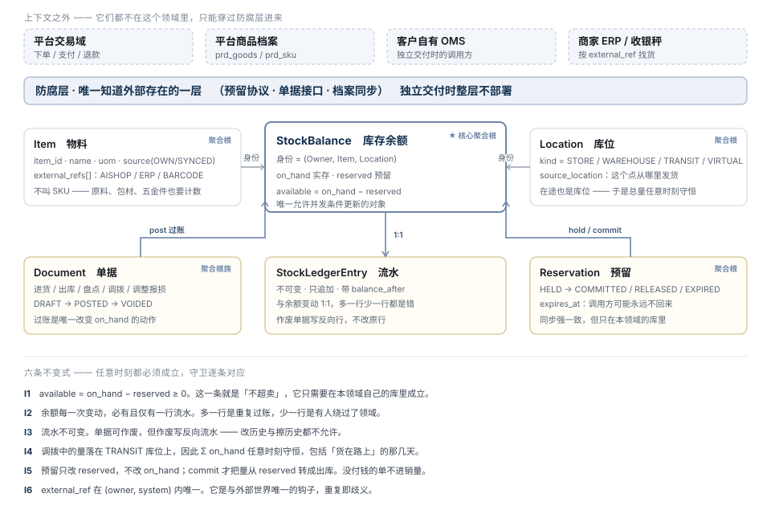

# TDD · 进销存领域模型（独立领域 · 独立库 · 可独立交付）

> 状态：**草稿 · 待评审** · 2026-08-26
> 决策前提：进销存作为**独立限界上下文**，独立库、独立模块/服务，**将来可独立交付**
> 本文只做一件事：**抽象领域对象**。做什么见 [TDD-进销存与经营报表](./TDD-进销存与经营报表.md)，
> 在整体里的位置见 [全链路与产品矩阵](./进销存-销售-财务-全链路与产品矩阵.md)
> **字段级定义见 [进销存-领域对象详解](./进销存-领域对象详解.md)**（L3：SKU / 库存 / 入库单 / 出库单 / 盘点单 / 调拨单 逐列展开）——
> 其中 §1.2 修正了本文 §5.4「一张单据表 + doc_type」：入库与出库拆回两族
> 取代：[TDD-进销存模块化与独立部署](./TDD-进销存模块化与独立部署.md) §3「不拆库」——
> 那份写的翻盘条件之一是「进销存要卖给非本平台商家 ⇒ 独立库是产品边界不是技术边界」，**该条件已命中**

---

## 一、一句话

**「可独立交付」是一条设计约束，不是一句愿景。**

它推出三件事：这个领域**不能认识平台的任何一张表**、
**不能依赖平台的身份体系**、**不能依赖平台的事务**。
本文把这三条落成五个聚合根和六条不变式。

---

## 二、一处更正：跨进程 ≠ 最终一致

上一版我写「超卖不能最终一致，所以扣减永远不该跨进程」。
**前半句对，后半句是错的推论**——两者之间少了一步。

**预留协议（Reservation Protocol）下，跨进程调用仍然是同步强一致的**：
`available ≥ 0` 这条不变式**只需要在进销存自己的库里成立**，
一条件更新即可，与调用方在不在同一个进程无关。

跨库真正的代价是另外两样，要如实写下来：

| 代价 | 大小 | 处置 |
|---|---|---|
| **可用性耦合**：进销存挂了就下不了单 | 真实 | 它本来就是下单的必要条件（今天进程内挂了也一样下不了）。给超时与熔断，熔断后**拒单而不是放行** |
| **延迟**：多一次 RTT | 小 | 同机房 1–3ms。下单链路本来就有支付通道的百毫秒级往返 |
| ~~一致性~~ | **不是代价** | 预留是同步的；剩下的两种不一致都可补偿，见 §六 |

---

## 三、「可独立交付」推出的三条硬约束

| # | 约束 | 不这么做会怎样 |
|---|---|---|
| **A1** | **零跨库引用**：不 join 平台任何表、不建外键、不共享事务 | 交付给客户时，第一句话就是「请先装一个 ai_shop」 |
| **A2** | **自有身份体系**：Owner / Item / Location 都是本领域自己的对象，平台的 `entity_no`/`sku_no`/`store_no` 只是**外部引用**（`external_ref`） | 客户没有 `entity_no`，模型里却处处是它 |
| **A3** | **自有一致性协议**：与调用方之间只有预留协议、单据接口、档案同步三种交互，全部可在网络上跑 | 依赖本地事务的设计，拆的那天要重写领域层 |

**同一套模型跑两种形态**，这是能不能"独立交付"的真正判据：

| | 嵌入平台（现在） | 独立交付（将来） |
|---|---|---|
| 库 | 独立数据源 `inv`，先同实例后独立实例 | 独立实例 |
| `Item.source` | `SYNCED`（由平台商品档案同步来） | `OWN`（客户自己维护） |
| `Owner` | 映射 `mch_entity.entity_no` | 客户自己的租户 |
| `Location` | 映射 `mch_store.store_no` | 客户自己建仓 |
| 调用方 | 平台交易域（`StockPort` 换实现） | 客户 OMS / 收银 / ERP |
| 防腐层 | 部署 | **整层不部署** |

> **模型不分叉**，分叉的只有防腐层与 `source` 字段。
> 若两种形态需要两套领域对象，那就不是"可独立交付"，是"再写一遍"。

---

## 四、通用语言（Ubiquitous Language）

抽象领域对象的第一步是**换掉平台的词**——平台的词带着平台的假设。

| 领域词 | 平台今天的词 | 为什么换 |
|---|---|---|
| **Owner** 业主 | `entity_no` 商家主体 | 独立交付时业主可能是工厂、门店、个人。「商家」是平台视角 |
| **Item** 物料 | SKU | SKU 是零售词。进销存要计数的还有原料、包材、五金件、赠品 |
| **Location** 库位 | 门店 / 仓库 | **门店、仓、在途、报废区都是库位**。分成两个词，调拨就没地方落脚 |
| **StockBalance** 库存余额 | 库存 stock | 「库存」既指数量又指这件事本身。余额是可结账的那个数 |
| **Reservation** 预留 | 库存锁 lock | Lock 是实现词（锁什么？锁多久？）。Reservation 是业务词：占住一批货等人来取 |
| **Document** 单据 | （无） | **今天销售出库没有单据，只有隐式扣减。** 客户的会计凭单核账，流水行不是凭证 |
| **UoM** 计量单位 | `sale_unit` | 「销售单位」是销售视角；进货、盘点、调拨用的是同一个单位 |

---

## 五、聚合根与对象



### 5.1 Item　物料　（聚合根）

```
Item
  item_id        本领域内部标识，**永不外泄给业务含义**
  owner_id
  name / spec_text
  uom            计量单位（值对象）
  source         OWN | SYNCED     ← 两种交付形态的唯一分叉点
  status         ACTIVE | ARCHIVED
  external_refs  [ (system, ref) ]  AISHOP=sku_no · ERP=货号 · BARCODE=条码
  default_cost   当前成本（值对象 Money）
```

**三条约束：**

| 约束 | 防住什么 |
|---|---|
| `item_id` 内部生成，不复用 `sku_no` | 复用之后，独立交付给没有 sku_no 的客户时，主键要重新设计 —— 那是模型级返工 |
| `external_ref` 是**一组**不是一个 | 同一件货在平台叫 `SKU123`、在商家 ERP 叫 `LM-05`、条码是 `690…`。一列存不下，而三者都要能查到 |
| `(owner_id, system, ref)` 唯一 | 见不变式 I6。重复即歧义：扫一个条码出来两件货 |

### 5.2 Location　库位　（聚合根）

```
Location
  location_id / owner_id / name
  kind            STORE | WAREHOUSE | TRANSIT | VIRTUAL
  external_ref    平台的 store_no（嵌入形态）
  source_location 这个点从哪里发货；空 = 发自己的
  status
```

**`TRANSIT`（在途）是这个模型里最容易被省掉、也最不该省的一个 kind。**
调拨发出到收到之间，货既不在 A 也不在 B。没有在途库位，这几天里
「总量守恒」这条断言就不成立，而**不守恒的账没法用来发现错误** —— 差多少都能解释成"在路上"。

`VIRTUAL` 用于报废区、样品区、客户借出 —— 让"货去哪了"永远有一个答案。

### 5.3 StockBalance　库存余额　（★ 核心聚合根）

```
StockBalance                身份 = (owner_id, item_id, location_id)
  on_hand      实存
  reserved     已预留未出库
  available    = on_hand − reserved     （派生，不落库）
  version      乐观锁
```

**四条约束：**

| 约束 | 防住什么 |
|---|---|
| 身份三元组**没有可空项** | 平台今天靠 `store_no` 可空表达"主体级库存"，那是覆盖层的历史包袱。独立领域里，主体级 = 一个 `kind=WAREHOUSE` 的默认库位 —— **一种表达，不是两种** |
| `available` 派生不落库 | 落库就有第三个数要维护，而三个数里错一个不会报警 |
| 唯一允许并发条件更新的对象 | 其余聚合根都是"追加或状态机"。把并发面收到一个对象上，超卖的正确性只需要证明一次 |
| **不存"可售"** | 可售是销售策略（预售、限购、渠道），属于调用方。存进来之后，改一次促销规则要改库存领域 |

### 5.4 Document　单据　（聚合根族）

```
Document                     一张表 + doc_type，不是六张表
  doc_no / owner_id / doc_type / status / occurred_at / operator / remark
  DocumentLine[]  item_id · location_id · qty · unit_cost · (to_location_id)
```

| `doc_type` | 何时产生 | 方向 |
|---|---|---|
| `RECEIPT` 进货入库 | 商家录入 | ＋ |
| `ISSUE` 销售出库 | **预留 commit 时系统自动开** | − |
| `RETURN` 退货入库 | 售后（仅退货类） | ＋ |
| `COUNT` 盘点 | 商家 | ± |
| `TRANSFER` 调拨 | 商家 | 出 → TRANSIT → 入 |
| `ADJUST` 调整 / 报损 | 商家 | ± |

**三条约束：**

1. **过账（`post`）是唯一改变 `on_hand` 的动作。** 包括销售出库 ——
   系统自动开一张 `ISSUE` 单，而不是"直接扣"。
   防住的是：客户的会计问「这 200 斤米是怎么少的」，没有单据就只能给他看一行日志。
2. **单据可作废不可修改**，作废写反向流水。改单据 = 改历史。
3. **一张表 + `doc_type`，不是六张表。** 六张表之后，"这个月一共动了多少货"要 union 六次，
   而每加一种业务就多一次 —— 那个 union 迟早漏掉一张。

### 5.5 Reservation　预留　（聚合根）

```
Reservation
  reservation_id / owner_id
  external_ref      调用方的订单号
  status            HELD | COMMITTED | RELEASED | EXPIRED
  expires_at        ★ 独立交付的必需品
  ReservationLine[] item_id · location_id · qty
```

**三条约束：**

| 约束 | 防住什么 |
|---|---|
| **全成功或全失败**，不允许部分预留 | 部分成功意味着"购物车里 3 件成了 2 件"，这种单没法结算也没法退 |
| **`expires_at` + 自动回收任务** | 调用方可能永远不回来（进程挂了、网络断了、客户的 OMS 有 bug）。进程内时代靠"关单任务"兜底，跨进程后**兜底必须在本领域内** |
| `external_ref` 唯一，重复预留返回原结果 | 网络超时重试是常态。不幂等就会预留两次，而第二次没人释放 |

### 5.6 StockLedgerEntry　流水　（不可变实体）

```
StockLedgerEntry
  id (单调递增，兼作增量游标) / owner_id / item_id / location_id
  doc_no / doc_type / qty_delta（带符号）/ balance_after
  occurred_at / operator
```

**它不是聚合根**——它没有自己的生命周期，是余额变动的影子。
但它是这个领域**对外最有价值的东西**：报表按它取数，ERP 按 `id` 游标增量拉。

### 5.7 值对象

| 值对象 | 内容 | 为什么是值对象 |
|---|---|---|
| `Quantity` | 数量 + UoM | **带单位的数才能相加**。裸 `int` 会让"5 斤"和"5 件"相加而不报错 |
| `Money` | 金额（最小币种单位）+ 币种 | 同上 |
| `ExternalRef` | (system, ref) | 它没有身份，只有值 |
| `UoM` | 单位码 + 是否可拆分 | 称重品与计件品的分界 |

### 5.8 领域事件

| 事件 | 何时发 | 谁听 |
|---|---|---|
| `DocumentPosted` | 单据过账 | 报表跑批 · 外部订阅 |
| `StockBalanceChanged` | 余额变动 | 缺货预警 · 平台商品可售状态 |
| `ReservationExpired` | 自动回收 | 调用方（订单可据此关单） |
| `LowStockDetected` | 跌破阈值 | 商家通知 |

---

## 六、不变式（守卫逐条对应）

| # | 不变式 | 守卫形态 |
|---|---|---|
| **I1** | `available = on_hand − reserved ≥ 0` | 条件更新 + 并发测试 |
| **I2** | 余额每一次变动，**必有且仅有**一行流水 | 回放断言：`prev.balance_after + qty_delta == balance_after` |
| **I3** | 流水不可变；单据作废写反向流水 | 表无 UPDATE/DELETE 权限；守卫扫描 |
| **I4** | `Σ on_hand` 在调拨全程守恒（含在途） | 调拨场景测试 |
| **I5** | 预留只改 `reserved`；`commit` 才改 `on_hand` | 场景测试：预留后销量为 0 |
| **I6** | `external_ref` 在 `(owner, system)` 内唯一 | 唯一索引 |

**这六条是这个领域的验收标准。** 撤掉任一条的实现，对应守卫必须变红且点名 ——
恒绿的守卫等于没有守卫。

### 与调用方之间的两种不一致，都可补偿

跨库之后只剩两种不一致，**都不需要分布式事务**：

| 情况 | 补偿 | 今天有对应物吗 |
|---|---|---|
| 预留成功、订单没创建 | `expires_at` 到期自动回收 | 有：超时未支付释放库存 |
| 订单创建、预留失败 | 订单创建整体失败，用户重试 | 有：今天锁库存失败就下单失败 |

**两种今天都已经在发生**——所以这不是新增的失败模式，是同一个失败模式换了个地方兜底。

---

## 七、库表草案（`inv_` 前缀，独立数据源）

```
inv_owner            业主
inv_item             物料           ← 唯一键 (owner_id, item_id)
inv_item_ref         外部引用       ← 唯一键 (owner_id, system, ref)
inv_location         库位
inv_stock_balance    余额           ← 唯一键 (owner_id, item_id, location_id)
inv_reservation      预留头         ← 唯一键 (owner_id, external_ref)
inv_reservation_line 预留行
inv_document         单据头         ← 唯一键 (owner_id, doc_no)
inv_document_line    单据行
inv_ledger           流水           ← id 单调递增，兼作增量游标
```

**十张表，零外键指向 `ai_shop`。** 前缀换成 `inv_` 不是美观问题：
`prd_` 是平台商品域的前缀，独立交付时客户库里出现 `prd_` 会让人以为还有个商品系统。

**迁移独立**：本领域自己的 Flyway 目录与 `flyway_schema_history`，
与平台迁移**互不知情** —— 否则每次交付都要带上平台的 260 条迁移。

---

## 八、与平台的接触面（防腐层）

**三种交互，仅此三种：**

| 交互 | 方向 | 协议 | 幂等 |
|---|---|---|---|
| **预留协议** | 平台 → 进销存 | `reserve` / `commit` / `release` | 按 `external_ref` |
| **单据接口** | 双向 | 退货入库（平台推）· 单据查询（平台拉） | 按 `doc_no` |
| **档案同步** | **平台 → 进销存，单向** | `Item`（由 `prd_sku` 投影）· `Location`（由 `mch_store` 投影） | 按 `external_ref` upsert |

**档案同步永远单向。** 反向同步会造出两个真相源，
而两个真相源的冲突是**静默的**：后写覆盖先写，两边都不知道。

**`StockPort` 今天已经是预留协议的形状**（`lock` / `release` / `confirm`）——
所以从"进程内"走到"独立服务"，**平台交易域一行不改**，只换 Port 的实现。
这是上一版留下的最有价值的一件东西。

---

## 九、分层与模块

```
shop-inventory-core        纯领域：聚合根 · 值对象 · 不变式 · 领域服务。零 Spring、零 MyBatis
shop-inventory-app         用例编排 + 事务边界 + 事件发布
shop-inventory-infra       持久化（独立 DataSource）· 迁移 · 定时回收
shop-inventory-api         对外接口（HTTP / 本地 Port 两套适配，同一份用例）
shop-inventory-acl         ★ 防腐层：平台 ↔ 领域的映射。**独立交付时整层不部署**
```

**`core` 零框架依赖是"可独立交付"的体检项**：
它一旦 `import org.springframework`，就说明领域逻辑里混进了运行时假设，
而那些假设在客户的环境里未必成立。

**关于"尽量用独立的数据库"的落地**：
逻辑上从第一天独立（独立 `DataSource`、零 join、零外键、独立迁移），
物理上**可以先同实例**省运维 —— 但要加一条守卫：
`shop-inventory-*` 只能用 `invDataSource`，出现跨库 join 或跨 DataSource 事务就红。

> 这是对上一版「同实例独立 schema 是错觉」的限定：**没有守卫时它确实是错觉**，
> 因为跨 schema join 免费且不报错。加上守卫之后它成立 ——
> 差别不在物理部署，在**有没有一条会失败的检查**。

---

## 十、分期

| 期 | 内容 | 判据 |
|---|---|---|
| **D0** | `core` 领域对象 + 六条不变式的单元测试（**不接数据库、不接平台**） | 领域模型能独立跑通，是后面一切的前提 |
| **D1** | `infra` 独立数据源 + 十张表 + 独立迁移；`acl` 把 `prd_sku`/`mch_store` 投影进来 | 双写期：平台库存仍是真相，inventory 影子记账，**每日对差** |
| **D2** | 真相源切换：`StockPort` 实现改为调 inventory；平台 `prd_sku.stock` 降为只读缓存 | 对差连续 N 天为零才切 |
| **D3** | 进货 / 盘点 / 调拨 / 报表 / 导出（[TDD-进销存与经营报表](./TDD-进销存与经营报表.md) 的 P1–P4 落在这里） | —— |
| **D4** | 独立进程 + Open API + 独立实例 | 熔断与限流就位 |
| **D5** | 独立交付形态：`acl` 不部署，`Item.source=OWN` | 能在一台空机器上装起来并跑通一遍进销存 |

**D1 的双写期不能省。** 库存是这个系统里错了最贵的数据 ——
直接切换意味着「切换那天开始超卖」而没有任何证据能回溯是从哪一刻开始的。

> ### ⚠️ 现状（2026-08-28 核查）：每日对差**一天都没在跑**
>
> D2 的判据是「对差连续 N 天为零才切」，而攒这个证据的 `inv-backfill`
> **当前在生产上无处运行**：
>
> - 它挂在 `@ConditionalOnProperty(prefix="shop.inventory.backfill", name="enabled")` 上，
>   生产 env 里只有 `SHOP_INVENTORY_ENABLED`，**没有** `SHOP_INVENTORY_BACKFILL_ENABLED`，
>   所以主应用里这个 bean 根本没装配 → 没有声明 → 任务注册表的 12 个任务里看不到它；
> - 它此前只在一个手工起的搬运 worker 里跑过，那个进程 08-28 21:09 已停
>   （搬运那一半确实干完了：209 个 SKU 全部建成物料，新 SKU 改走
>   `SKU_UPSERTED` → outbox → 投影 这条常驻链路）。
>
> **搬运退休了，对差没有。** 两半是同一个 `run()`，随搬运一起停掉了。
>
> 后果不是今天就出事，而是 **D2 永远等不到它的判据** ——
> 「连续 N 天为零」的计数器从来没有开始计。要往 D2 走，第一步是先让对差跑起来
> （给主应用加上那个开关，或把对差单独拆成一个只读任务），
> 而不是到时候临时跑一次就当作证据。

---

## 十一、不做什么

| 不做 | 为什么 |
|---|---|
| 领域层里出现 `entity_no` / `sku_no` / `store_no` | 它们是外部引用，只能出现在 `acl` 里。出现一次，独立交付就少一分 |
| `core` 依赖 Spring / MyBatis | 见 §九 |
| 双向档案同步 | 两个真相源，冲突静默 |
| 分布式事务 / 2PC | §六两种不一致都可补偿 |
| 在余额上存"可售" | 可售是销售策略，属于调用方 |
| 六张单据表 | 一张表 + `doc_type`，否则汇总要 union 六次 |
| 省掉 `TRANSIT` 库位 | 省掉之后总量不守恒，不守恒的账发现不了错误 |
| 批次 / 效期 / 序列号 | **模型已为它留好位置**（`DocumentLine` 加 `batch_id`），但一期不做：它让余额从一个数变成一组，是另一次立项 |
| 多货主 / 寄售 | 同上。`Owner` 已在模型里，将来加的是"货主 ≠ 业主"这层关系 |

---

## 十二、待确认

> ⚠️ **取值已定**，见[决策记录](./进销存-决策记录.md)（2026-08-26「一切都先按照建议执行」）。
> 本节原文保留 —— 它记录的是当时的权衡，不是当前取值。


| # | 决策 | 挡住谁 |
|---|---|---|
| ① | **主体级库存怎么迁**：今天 `prd_sku.stock`（无门店）在新模型里是"默认库位"。存量数据要一次性建默认库位并搬过去 | D1。这是唯一一次不可回退的数据迁移 |
| ② | 物理库：先同实例还是直接独立实例 | D1 的运维。倾向**先同实例 + 守卫**，D4 再拆物理 |
| ③ | `Owner` 与平台 `entity_no` 是 1:1 还是 1:N | D1 的 `acl`。倾向 1:1，多执照商家仍是一个业主 |
| ④ | 独立交付形态是否要自带一个最小 UI | D5 的范围。不带则只能当作 SDK/API 交付 |
| ⑤ | 批次/效期确认不做（模型留位即可） | D0 的对象设计 —— **现在留位便宜，做完再加要动余额的身份** |

---

确认记录：待用户确认
