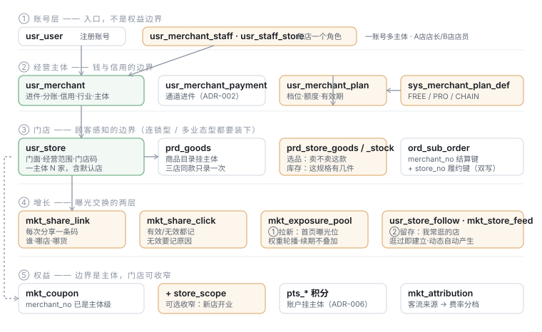

# 业务模型：账号 · 商户 · 门店 · Plan · 增长 · 权益

> 状态：**设计待确认**（部分已落地）· 2026-08-09
> 📌 **补充修订**（口径已确认）：[门店收款商户与员工账号](./业务模型-修订-门店收款商户与员工账号.md)
> —— 主体口径不变（就是 `usr_merchant`）；新增「门店 → 收款商户号」的**可变关联**，
> 员工账号改为**独立身份 + 可选关联 C 端**。本文其余部分不受影响。
> 上游需求：[增值服务与分享激励](../../requirements/多门店与分享激励-需求.md) · [商户主数据与门店](../../requirements/商户主数据与门店-需求.md)
> 数据库落点：[数据库整理-多门店与增长](./数据库整理-多门店与增长.md)
> 详细方案：[增值服务 Plan 体系](./增值服务-多门店与子账号-方案.md) · [跨店权益](./跨店权益-积分与优惠券-方案.md) · [分享激励与曝光](./分享激励与首页曝光-方案.md)
> 决策：ADR-002（分账）· ADR-004（增长）· ADR-006（积分）· ADR-009（经营范围）· ADR-010（主数据）· ADR-011（主体与门店）

---

## 一、总览

### 1.1 三条边界，一句话

整个模型建立在**三条不同的边界**上，它们经常被当成同一条，而混淆它们是这套设计里最贵的错误：

| 边界 | 是什么 | 判据 |
|---|---|---|
| **账号** | 谁在登录、能进哪些地方 | 只是**入口** —— 一个账号管两个主体，不代表这两个主体是一家人 |
| **经营主体** | 钱与信用的边界 | **通道或税务认的是它**：进件、分账、开票、费率、积分负债、权益 |
| **门店** | 顾客感知的边界 | **顾客说「楼下那家」指的是它**：地址、营业时间、库存、评价、履约 |



图上看不出来的三件事：

1. **账号层到主体层是多对多**（`usr_merchant_staff`），不是一对一。今天代码里
   `BizIdentityResolver` 用 `limit 1` 取商家 —— 那一行就是"一个人只能是一家店老板"的全部原因
2. **商品目录挂主体，销售关系挂门店**（③ 层中间两块）。这不是妥协，是为了同时装下
   **连锁型**（三家店卖同一批货）与**多业态型**（菜摊 + 五金店，货毫无关系）——
   只按其中一种设计，另一种就会很难用（§3.5）
3. **权益那条虚线跳过了门店**，直接从主体连到 ⑤ 层 —— 这是刻意的（见 §五）

### 1.2 模块与规模

| # | 模块 | 核心实体 | 状态 |
|---|---|---|---|
| 1 | 账号与身份 | `usr_user` `usr_merchant_staff` `usr_staff_store` | 🚧 多商家 + 逐店角色待做 |
| 2 | 经营主体 | `usr_merchant` `usr_merchant_payment` | ✅ |
| 3 | 主数据 | `sys_industry` `sys_merchant_subject` `sys_pay_channel` | ✅ V40/V41 |
| 4 | 门店 | `usr_store`（← `usr_merchant_store`）`usr_merchant_community` | 🚧 单店已有 |
| 4b | **区域与开城** | `cmt_region`（新）`cmt_community.status` `usr_store.service_geo`（新） | 🚧 GEO 形态与自动开城待做 |
| 5 | Plan 商业化 | `sys_merchant_plan_def` `usr_merchant_plan` | ⬜ |
| 6 | 商品与门店 | `prd_goods` `prd_sku` `prd_store_goods` `prd_store_stock` | 🚧 选品与库存的门店维度待加 |
| 7 | 交易与履约 | `ord_sub_order`(+`store_no`) `cmt_pickup_point` | 🚧 双写待加 |
| 8 | 增长·分享曝光 | `mkt_share_link` `mkt_share_click` `mkt_exposure_pool` | ⬜ |
| 9 | 增长·关系留存 | `usr_store_follow` `mkt_store_feed` | ⬜ |
| 10 | 权益 | `mkt_coupon`(+`store_scope`) `pts_*` `mkt_attribution` | 🚧 收窄待加 |

---

## 二、实体与关联

### 2.1 关系一览

| 关系 | 基数 | 说明 |
|---|---|---|
| `usr_user` → `usr_merchant_staff` | 1 : N | **一个账号可参与多个主体**（App）；小程序取默认主体 |
| `usr_merchant_staff` → `usr_merchant` | N : 1 | 一个主体有多个成员 |
| `usr_merchant_staff` → `usr_staff_store` | 1 : N | **每店一个角色** —— 同一个人可以在 A 店当店长、B 店当店员 |
| `usr_merchant` → `usr_store` | 1 : N | 额度由 Plan 控制；**恰好一个默认店**，删不掉 |
| `usr_merchant` → `usr_merchant_payment` | 1 : N（每通道一条） | 进件按主体 —— 通道按营业执照发号 |
| `usr_merchant` → `usr_merchant_plan` | 1 : 1 | 一主体一档 |
| `usr_store` → `usr_merchant_community` | 1 : N | 覆盖社区**下沉到门店** |
| `usr_store` → `service_geo` | 1 : 1（内嵌） | **地图区域**：半径或多边形。与列举小区**可并存**（自提按小区、配送按半径） |
| `cmt_region` → `cmt_community` | 1 : N | 平台开城层级；社区 `status=OPEN` 才对用户可见 |
| `usr_merchant` → `prd_goods` | 1 : N | **商品目录挂主体**（录一次） |
| `usr_store` × `prd_goods` → `prd_store_goods` | N : N | **选品与上架**：这家店卖不卖这款 |
| `usr_store` × `prd_sku` → `prd_store_stock` | N : N | **库存**：这家店这个规格有几件 |
| `usr_store` → `ord_sub_order` | 1 : N | `store_no` 履约键；`merchant_no` 仍是结算键（双写） |
| `usr_store` → `cmt_pickup_point` | 1 : N | `owner_ref` 在 `STORE` 时指门店 |
| `usr_store` → `mkt_share_link` | 1 : N | 分享的是某一家店 |
| `usr_user` × `usr_store` → `usr_store_follow` | N : N | 逛过即建立 |
| `usr_merchant` → `mkt_coupon` | 1 : N | **权益边界在主体**，`store_scope` 可选收窄 |

### 2.2 三个最容易搞错的关联

**① 账号 ≠ 主体，且角色逐店**

```
usr_user ──< usr_merchant_staff >── usr_merchant
   老王              │                  A 主体
                     │                  B 主体  ← 老王也管 B，但 A、B 各自独立报税
                     └──< usr_staff_store >── 店1: MANAGER
                                              店2: CLERK   ← 同一人，不同店不同角色
```

老王能同时管 A、B，不代表 A 的券能在 B 用（§五）。
`usr_merchant.owner_user_no` 保留为「创建者」记录，**不再是身份来源**。

**权限随当前门店变**，不是登录时算一次 —— 否则「切到 B 店还能改价」，
而这类越权最难发现，因为操作本身完全正常。

**② 商品目录挂主体，卖不卖挂门店**

```
prd_goods（五常大米）── 挂 A 主体，录一次
     │
     ├── prd_store_goods(店1, 大米, 在架)  ← 卖
     ├── prd_store_goods(店2, 大米, 下架)  ← 卖，但暂时下架
     └──（店3 没这条 = 这家五金店根本不卖米）
          prd_store_stock(店1, SK001, 0)  ← 卖，但卖完了
```

三种状态要分得开：**没有关联行 = 不卖**、有行但下架 = 暂时不卖、
有行在架但库存 0 = 卖完了。对顾客是三句不同的话。

**③ 订单双写**

`ord_sub_order.merchant_no`（结算/分账/积分，一行不改）
+ `store_no`（履约/评价/门店报表）。
单店时两者恒等 —— 这正是多门店能分阶段发布的原因。

---

## 三、模块详情

### 3.1 账号与身份

| 功能 | 说明 |
|---|---|
| 注册/登录 | 复用 C 端账号池。**店员多半已是 C 端用户**，不新发一套密码 |
| 参与多主体 | `usr_merchant_staff` 多行；App 顶部切商家，小程序取默认 |
| 默认主体 | `is_primary`，用户可改；未设时取最早加入的 |
| 三级作用域 | `merchantNos` → `storeNos` → `currentStoreNo`，每级一个越权检查点 |
| 请求上下文 | `X-Merchant-No` / `X-Store-No`，都不传时行为与今天一致 |

**后端不按载体分叉**：接口一律返回全部主体，端上决定展示几个。
分叉的话「同一个人在小程序看到 1 家、App 看到 3 家」会变成两条独立演化的代码路径。

### 3.2 经营主体

| 功能 | 说明 | 状态 |
|---|---|---|
| 入驻申请与审核 | 行业 + 主体类型 + 简介；**行业决定可选主体**（提交时校验，不等进件） | ✅ |
| 进件与分账 | 按主体，通道二级商户号（ADR-002） | ✅ |
| 行业 / 主体类型 | 主数据表管规则，shared 类型管取值（ADR-010） | ✅ |
| 信用与费率 | `breach_count`、`trafficSource` 分档（ADR-004） | ✅ |
| 积分开关 | `points_enabled` 挂主体 —— 它是主体的成本结构 | ✅ |

### 3.3 门店

| 功能 | 说明 |
|---|---|
| 建店 / 停用 | 受 Plan 额度；默认店不可删 |
| 门面 | 地址、营业时间、公告、主推（V42 已确立在门店表） |
| 服务区域 | **四种形态**，见 §3.3.1。下沉到门店 —— 两家店在不同小区，共用范围等于其中一家的货出现在它送不到的地方 |
| 门店码 | 扫码进的是**这家店** |
| 状态 | ACTIVE / SUSPENDED / **READONLY**（Plan 降级） |

#### 3.3.1 服务区域：四种形态

[ADR-009](../ADR/ADR-009-商家经营范围三档模型.md) 定了三档，
但**缺了一种真实存在的形态：地图区域**。
「我送方圆两公里」是小店最自然的表达 —— 他不知道两公里内有哪几个小区，
也不该被要求去查。

| 形态 | 怎么表达 | 谁会用 |
|---|---|---|
| `COMMUNITY` | 列举一个或几个小区 | 生鲜、便利店、自提为主 |
| **`GEO`**（新） | 中心点 + 半径，或多边形围栏 | **送货上门的小店**：「我送方圆 2 公里」 |
| `CITY` | 城市码 | 家政、维修、同城配送 |
| `PLATFORM` | 全域 | 虚拟商品、卡券、快递百货 |

`GEO` 不是把 `COMMUNITY` 替换掉：两者回答的是不同的问题 ——
「我在哪几个小区有自提点」（离散、要谈）vs「我骑车能到多远」（连续、自己知道）。
同一家店可以两者都配：**自提按小区、配送按半径**。

⚠️ 这是对 ADR-009 的**扩展，需要修订那份 ADR**（三档 → 四形态）。
配套字段：`service_geo`（JSON：`{type:CIRCLE, lat, lng, radius}` 或 `{type:POLYGON, points[]}`）。

**可达性判定**（C 端查"这家店能不能服务我"）：

```
可达 = 门店服务区域覆盖用户位置
     ∧ 平台已在该区域开城（§3.3.2）
```

两个条件缺一不可 —— 第二个是新的，见下。

#### 3.3.2 平台区域：开城由入驻驱动，不是前提

**系统支持的区域随门店入驻逐步放大**：一开始只有某个小区，
有商家进来了才把那个小区打开，再是一片、一个城市。

这与传统电商相反，而**在邻里场景下是唯一可行的顺序**：

| | 先开城再招商 | **先有商家再开区域** ← 本方案 |
|---|---|---|
| 开城当天 | 用户进来看到空货架 | 至少有一家店可买 |
| 冷启动 | 平台要自己铺供给 | 供给自带需求（商家的老客） |
| 与 ADR-004 的关系 | 矛盾 —— 那份 ADR 的核心就是商家自带客流 | 一致 |

| 实体 | 说明 |
|---|---|
| `cmt_community.status` | OPEN / CLOSED —— **已有**，但目前是手工开 |
| `cmt_region`（新） | 城市 / 片区的开放状态；社区归属其下 |

**开区域的触发**：某社区**首个商家入驻通过**时，把该社区置 OPEN。
不需要运营手工点 —— 手工点意味着「商家入驻了但顾客还看不到他」，
而这正是最伤新商家的一种状态。

**关区域要谨慎**：区域内还有未完成订单时不能关。
与门店只读同一条理由 —— 受损的是买家，而他们与开关城无关。

**门店服务区域 ∩ 平台已开区域**：
商家可以把服务范围画得比平台已开区域大（他愿意送更远），
但**在平台没开的区域里没有用户**，所以实际生效的是交集。
这不需要拦他 —— 拦了反而要解释"为什么我不能选"；
而当那片区域开了，他的范围自动生效，是一个惊喜而不是一次配置。

### 3.4 Plan 商业化

| | FREE（孵化） | PRO（成长） | CHAIN（连锁） |
|---|---|---|---|
| 门店 / 子账号 | 1 / 0 | 3 / 3 | 10 / 15 |
| 跨店总览与对比 | — | ✅ | ✅ |
| 单店经营全套 · **零佣金** | ✅ | ✅ | ✅ |

| 机制 | 说明 |
|---|---|
| 试用 | 14 天，一主体一次（`trial_used`） |
| 额度快照 | 存在实例上，运营改档位定义**只影响新订阅** —— 老用户保护 |
| 到期 | 进 **GRACE 7 天，能力全保留**；扣款失败的原因九成与经营无关 |
| 降级 | 超额门店只读，**未完成的单照常核销**；子账号停用；配置保留 |
| 升档时机 | 平台主动识别（**同一手机号在别的主体下也有店 = 已在用两个主体 workaround**） |

**零佣金对所有档位一视同仁**：把费率做成档位差异就等于回到抽佣，只是换个名字。

### 3.5 商品与门店：两种多门店形态

**多门店有两种完全不同的形态，模型必须同时装下**：

| 形态 | 例子 | 商品重合度 |
|---|---|---|
| **连锁型** | 张记粮油开了三家分店 | 高 —— 卖的基本是同一批货 |
| **多业态型** | 一个老板开了一家菜摊 + 一家五金店 | **零** —— 两家店的货毫无关系 |

只按连锁型设计（商品挂主体、各店都能卖）的后果：
多业态商家的 B 端商品列表里，**五金件和青菜混在一起**，
他每次找一件商品都要在一堆不相干的东西里翻。

只按多业态设计（商品挂门店）的后果：
连锁商家上一款新米要**在三家店各录一遍**，改个价改三次。

#### 解法：目录挂主体，**销售关系显式化**

```
prd_goods（五常大米）──────── 挂主体，录一次
     │
     ├─ prd_store_goods(店1, 大米, 在架)   ← 选品关系：这家店卖不卖这款
     ├─ prd_store_goods(店2, 大米, 下架)
     │      （店3 没有行 = 五金店根本不卖米）
     │
     └─ prd_store_stock(店1, SK001, 30)   ← 库存：这家店这个规格有几件
        prd_store_stock(店2, SK001,  0)
```

| 表 | 粒度 | 回答什么 |
|---|---|---|
| `prd_goods` / `prd_sku` | 主体 | 这个商家有哪些商品**定义** |
| `prd_store_goods` | 门店 × SPU | 这家店**卖不卖**这款、在不在架、排第几 |
| `prd_store_stock` | 门店 × SKU | 这家店这个规格**有几件** |

**两张关联表而不是一张**：选品是 SPU 级的决策（这家店卖不卖米），
库存是 SKU 级的事实（10 斤装还剩几袋）。合成一张会让"这家店不卖这款"
和"这家店这个规格卖完了"变成同一种数据，而它们对顾客的意思完全不同。

#### 两种形态都自然成立

| | 连锁型 | 多业态型 |
|---|---|---|
| 建商品时 | 默认勾选**全部门店** | 默认只勾**当前门店** |
| B 端商品列表 | 按当前门店过滤，可切"全部门店"总览 | 按当前门店过滤 = 天然只看到本业态的货 |
| 改价改描述 | 改一次，三家店同步 | 各店的商品本来就不同，互不影响 |
| 新店开业 | 「从 A 店复制选品」一键铺货 | 从零建自己的商品 |

**默认值按形态给**：建店时问一句「这家店和现有门店卖的东西一样吗」，
一样 → 复制选品；不一样 → 空目录。**这个问题只在建店时问一次**，
不做成一个需要理解的配置项。

#### 价格

仍挂主体 × 市场（现状不变）。同一商家不同店不同价会让顾客觉得被区别对待。

⚠️ 但**多业态形态下这条会失效**：菜摊和五金店本来就没有可比性，
"同一商家不同价"在这里不成立。这是个**已知的将来问题**，
一期先不做分店定价 —— 真需要时按 `prd_store_goods` 加价格覆盖列，
而不是把主价格挪走。

### 3.6 增长：曝光交换

**①拉新**

| 步 | 实体 | 要点 |
|---|---|---|
| 分享 | `mkt_share_link` | **每次分享新建一条码**，否则回答不了"上周那次朋友圈效果怎么样" |
| 记录 | `mkt_share_click` | 六条防刷判定；**无效也记且记原因** |
| 展示 | `mkt_exposure_pool` | 权重轮播非 Top-K；续期非叠加；受社区可达性约束 |

**②留存**

| 实体 | 要点 |
|---|---|
| `usr_store_follow` | **逛过即建立，不要求点关注**；与 `favoriteStores`/`visitedMerchants` 并入同一视图 |
| `mkt_store_feed` | 动态由新品/优惠/开团/公告**自动产生**，商家不单独发 |

**触达克制**：只逛过的不推送，只在首页出现；下过单的才可推，每店每周 1 条。

### 3.7 权益

见 §五。

### 3.8 平台侧

| 模块 | 能力 |
|---|---|
| 主数据 | 行业启停/小微准入/强制积分；档位定义 |
| 商家与门店 | 按主体看门店；授予/延长 Plan；单商家额度覆盖 |
| Plan 运营 | **到期与降级看板**（谁快到期、降级后掉了多少单 —— 判断定价合不合理的唯一依据） |
| 增长 | 曝光池查看与干预；曝光位数量/时长配置 |
| 风控 | 分享刷量拦截（与已有归因防刷同处，不另起一套） |

---

## 四、状态机

| 对象 | 状态 | 迁移要点 |
|---|---|---|
| 入驻申请 | PENDING → REVIEWING → APPROVED/REJECTED | APPROVED 终态；REJECTED 重提是**新开一份**，不原地改回（否则抹掉驳回记录） |
| 商家主体 | ACTIVE / SUSPENDED / BANNED | |
| 门店 | ACTIVE / SUSPENDED / **READONLY** | READONLY 由 Plan 降级触发，**不接新单但未完成的单照常核销** |
| Plan | ACTIVE → GRACE(7天) → EXPIRED | 升档立即、降档到期生效；补缴立即恢复且配置原样 |
| 商品 | AUDITING → APPROVED/REJECTED × 上下架 | 改动后回到待审并强制下架；补货**不**触发重审 |
| 曝光池条目 | ACTIVE / EXPIRED / BLOCKED | 每次有效点击**续期**到 now+7 天 |

---

## 五、边界与刻意的不一致

### 5.1 权益为什么跳过门店直接挂主体

| 边界 | 选它会怎样 |
|---|---|
| 账号 | ❌ A、B 两个营业执照，B 收的钱去抵 A 发的券，**结算对不上** |
| **主体** ✅ | 同一结算方、同一笔钱；三家分店是一个口袋左手倒右手，**不需要清算** |
| 门店 | ❌ 顾客认的是「张记粮油」这块招牌，不是门牌号 |

这同时给了 [ADR-006 §2](../ADR/ADR-006-积分方案.md) 的「商家专属」一个精确定义：
**商家专属 = 主体专属**，跨主体仍不通用，A 方案（全平台通用 + 清算）未被提前消耗。

### 5.2 刻意保留的不一致

| 不一致 | 为什么保留 |
|---|---|
| `usr_merchant.owner_user_no` 与 `usr_merchant_staff` 并存 | 前者降级为"创建者"记录；直接删要改入驻链路，与多商家分两步做 |
| `mkt_attribution` 与 `mkt_share_click` 分开 | 语义不同：一个答"这用户属于谁"，一个答"这店最近带来多少人"。合并会让归因窗口被点击反复刷新 |
| 商品挂主体、库存挂门店 | 见 §3.5 |
| `MERCHANT_EARNED` 独立取值但费率等同 `MERCHANT_OWNED` | 费率要正确（否则越分享越贵），统计要可分（否则评估不了这机制值不值得做） |

### 5.3 待确认（汇总）

各方案文档里共 20+ 条，其中**会改数据模型**的三条：

| # | 事项 | 建议 |
|---|---|---|
| 1 | Plan 三档的额度与数据留存分档 | 留存分档是**唯一一项"免费档比现在差"**的设计，需要确认 |
| 2 | 曝光位分配策略 | 权重轮播（非 Top-K） |
| 3 | `MERCHANT_EARNED` 的费率口径 | 等同自带客流 |
| 4 | **ADR-009 三档 → 四形态**（加 `GEO`） | 需要修订那份 ADR。`GEO` 不替换 `COMMUNITY`，两者答的是不同问题 |
| 5 | 开城是否**自动**触发（首个商家入驻即开该社区） | 建议自动。手工点意味着「商家入驻了但顾客还看不到他」，那是最伤新商家的状态 |

其余为参数（试用天数、GRACE 天数、曝光期、加权分、频次上限），可先按建议实现再调。
