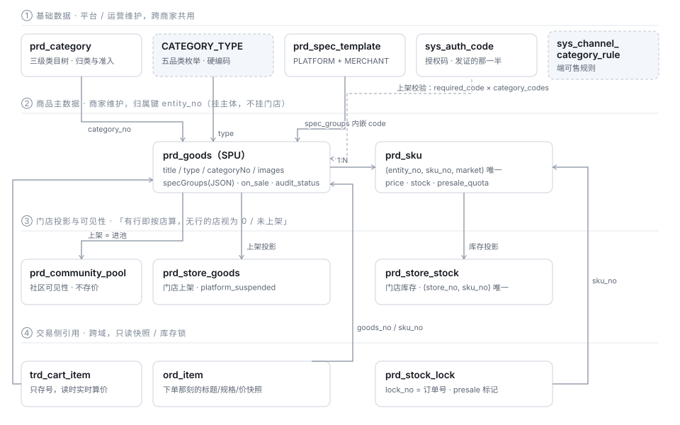

# 商品域 · 产品方案 Review 与四层对齐

> 状态：**已 review · 结论已落地（品类改为类目派生，见下游优化清单 P1-1）** · 2026-08-20 创建 / 08-21 更新

> 2026-08-20 · 定位：把「商品管理」这件事从**需求 → 设计 → API → 库 → 领域对象**串成一条能对账的线。
> 真源：[B 端功能清单 §B-4](../../requirements/B端功能清单.md) · [平台端功能清单 §P-3](../../requirements/平台端功能清单.md) ·
> [项目词典 §4 Catalogue](../../requirements/项目词典.md) · [类目树补齐方案](./类目树补齐方案.md) ·
> [领域对象模型 §四](../reference/domain-model.md) · [ADR-011 经营主体与门店边界](../ADR/ADR-011-经营主体与门店边界.md)
> 生成物：[prd 表关系图](../diagrams/db-prd.svg)（由 schema 生成）
> 下游：[商品域-优化清单](./商品域-优化清单.md)（本文结论的代码处置项）

---

## 零、这次 review 的结论

一句话：**结构是对的，缺口全在「有列 / 有契约 / 没有写入路径」这一类**。

| # | 结论 | 严重度 |
|:--:|---|---|
| 1 | 商品挂**主体**、门店只是投影（上架 + 库存两张覆盖表），三处判据一致，模型成立 | ✅ |
| 2 | 价格只存在 `prd_sku`，SPU 上无价 —— 双入口同源是结构性保证，不是约定 | ✅ |
| 3 | 「上架」的真实含义是**进社区池**，不是 `on_sale=1`；五条写路径都同步了池 | ✅ |
| 4 | 三套分类维度（品类 / 类目 / 行业）正交且各有落点，不是重复 | ✅ |
| 5 | **五品类的差异字段（生鲜 / 服务 / 卡券 / 虚拟）在 B 端全无写入路径** —— `SaveCommand` 里根本没有这些参数 | 🔴 |
| 6 | **划线价 `originPrice`、约重 `nominalGram`、限购、团购价同样只有 DevSeeder 写得进去** | 🔴 |
| 7 | **`/ops/skus/{skuNo}/audit` 名为审 SKU，实为审整件商品**；SKU 没有独立状态 | 🟠 |
| 8 | **预售额度 / 截单只有平台能设**，商家侧无入口，而生鲜预售是商家的日常动作 | 🟠 |
| 9 | 两个 `cutoff_at`：`prd_goods.cutoff_at`(BIGINT，无人写) 与 `prd_sku.cutoff_at`(DATETIME，平台写) | 🟠 |
| 10 | 死列：`prd_goods.points_config` / `sellable_override`、`prd_category.attr_template` 有实体字段无读写 | 🟡 |
| 11 | 「系统品列 / 店家品列」（平台标准品库 → 商家引用建品）**当前模型里不存在**，需要决策 | ❓ |

逐条展开在 §四、§五。

---

## 一、产品方案 Review（需求层）

### 1.1 主链路

```
商家建品 ──→ 平台审核 ──→ 商家上架 ──→ 进社区池 ──→ 买家在自己社区看得到
  B-4.2      P-3.2.2      B-4.8       （隐式）        C 端列表/详情
   ↑                                     ↑
   └── 每次改动回到待审 + 强制下架 ────────┘ 撤池
```

这条链上有**四个闸门**，缺任何一个商品都到不了买家眼前，且每个闸门失效时的症状都是「看起来正常」：

| 闸门 | 位置 | 失效时的样子 |
|---|---|---|
| 过审 | `toggle(onSale=true)` 要求 `APPROVED` | 商家看到一个永远点不动的上架按钮 |
| 类目准入 | `requireCategoryAuthorized` | 报「参数有误」，商家反复改商品信息而问题在资质上 |
| 弱主体准入 | `AdmissionPort.requireListingAllowed` | 不填类目即可绕过（曾经真的能绕，现已前置） |
| 进池 | `syncPool` | 商家侧显示「在售」，买家**任何地方都搜不到**，无报错 |

> 第四条是这个域最贵的一条经验：`on_sale` 是商家的心智，`prd_community_pool` 才是买家的事实。
> 两者不同步的故障不报错、不留日志、两端各自看都正常。

### 1.2 三套分类维度（最容易被当成重复的地方）

| | `prd_goods.type`（品类） | `prd_category`（类目） | `mch_entity.industry`（行业） |
|---|---|---|---|
| 挂在 | 商品 | 商品 | **商家** |
| 谁定义 | 平台硬编码，五值 | 运营后台增删改，三级树 | 平台预置 `sys_industry` |
| 决定 | 履约与合规（冷链 / 不发货 / iOS 可售） | 归类、导购、经营准入 | 支付通道准入（能否小微） |
| 改一个的代价 | 改履约代码 + 发版 | 后台点几下 | 改通道配置 |

**联动**：类目行上带 `template`（STANDARD/FRESH/SERVICE/VOUCHER），与品类是同一件事的两套码。
b-app 选类目时自动带出品类（`TEMPLATE_TO_TYPE`），**允许商家改，改了只提示不阻断** ——
类目树是运营维护的，可能归类不准，而品类决定履约，最终解释权在开店的人手里。

### 1.3 产品方案里已经写下、但实现只到一半的三条

| 需求 | 说的是 | 实际 |
|---|---|---|
| B-4.1 商品列表「在售 / 下架 / **缺货** 分筛」 | 三筛 | 后端 `applyStatus` 只支持 ON_SALE / OFF_SALE / PENDING / REJECTED，**没有缺货**；b-app 四页签也没有它 |
| B-4.5 规格编码 `optionCode`「一期只写入不消费」 | 写入 | 写入已通（`writeSpecGroups` 存 `optionCodes` + `templateNo`）；**商家自存模板不强制 code**，只有平台模板强制 —— 与「code 是模板存在的唯一理由」是两句话，需要在文档里说清这是刻意的 |
| P-3.3 预售额度与超卖 | 平台定额度 | 已实现，且刻意不拦「额度 < 已售」（超卖只可能是平台自己调小调出来的）。但**商家侧没有任何预售入口** |

---

## 二、对象模型（L2）



图上看不出来的三件事：

1. **虚线框是「没有表」的东西** —— `CATEGORY_TYPE` 是代码里的枚举常量，`sys_channel_category_rule` 是规则表不是主数据。
2. **第③层两张表是「覆盖表」不是「关系表」**：没有行 ≠ 没关系，而是「还没转成按店管理」。一旦某商品/某 SKU 有了任意一行，语义整体翻转成「没有行的店 = 0 / 未上架」。
3. **第④层的箭头全部向上**：交易域只读商品域，写只能经 `StockPort`。ArchUnit 守着不许直连。

### 2.1 对象清单

| 领域对象 | 表 | 归属键 | 谁维护 | 边界 |
|---|---|---|---|---|
| **Category** 类目 | `prd_category` | `category_no` | 运营 | 三级封顶；有子或有商品不可归档 |
| **CategoryType** 品类 | —（枚举） | — | 平台硬编码 | 五值，改动 = 发版 |
| **SpecTemplate** 规格模板 | `prd_spec_template` | `template_no` | 平台（PLATFORM）/ 商家（MERCHANT） | 平台模板每个选项必须带 `code`；商家模板不校验 |
| **AuthCode** 授权码 | `sys_auth_code` | `code` | 运营 | 与 `mch_entity.category_codes` 配对，是准入链的「发证」一侧 |
| **Goods** 商品(SPU) | `prd_goods` | `entity_no` | 商家（审核由平台） | **无价**；`spec_groups` 内嵌 JSON，不单独成表 |
| **Sku** | `prd_sku` | `(entity_no, sku_no, market)` | 商家 | 一市场一行；库存**不分市场**，价格分 |
| **StoreGoods** 门店上架 | `prd_store_goods` | `(store_no, goods_no)` | 商家 / 平台处置 | 覆盖语义；`platform_suspended` 标记平台压下的行 |
| **StoreStock** 门店库存 | `prd_store_stock` | `(store_no, sku_no)` | 商家 | 覆盖语义；没设过的店 = 0，**不回退主体总量** |
| **CommunityPool** 社区池 | `prd_community_pool` | `(community_no, goods_no)` | 系统（上下架时同步） | 只决定可见性，不存价；空池 = 未铺货，返回空列表 |
| **StockLock** 库存锁 | `prd_stock_lock` | `lock_no`(=订单号) | 交易域经 `StockPort` | 条件更新原子扣减；`presale` 标记吃的是额度不是现货 |

### 2.2 关联关系

| 关系 | 基数 | 落点 | 关键约束 |
|---|---|---|---|
| Category ─ Goods | 1:N | `prd_goods.category_no` | **选填**；空串归一为 NULL，不允许 `category_no=''` |
| Goods ─ Sku | 1:N | `prd_sku.goods_no` | 保存是全量替换但**保留原 skuNo**；删除是逻辑删（历史订单要查得回） |
| Sku ─ Market | 1:N | `prd_sku.market` | 一个逻辑 SKU 在三个市场 = 三行；分页必须锚在 `market='CN'` 那一行 |
| Goods ─ SpecGroup | 内嵌 | `prd_goods.spec_groups` JSON | 规格组不单独成表；`optionValues` 顺序与 `specGroups` 一一对应 |
| SpecTemplate ─ Goods | 弱引用 | `spec_groups[].templateNo` | 模板是**建议不是强制**，取用后即复制，模板改了历史商品不变 |
| Goods ─ Store | N:M | `prd_store_goods` | 覆盖语义（见上） |
| Sku ─ Store | N:M | `prd_store_stock` | 覆盖语义；`isStoreManaged` 判据是**全局有无行**，不分店 |
| Goods ─ Community | N:M | `prd_community_pool` | 由 `reachableCommunities`（ADR-009/013）推出，product 域不自己读商家社区表 |
| Sku ─ OrderItem | 快照 | `ord_item.sku_no` + title/spec/price 拷贝 | 商品改了不影响历史订单 |
| Sku ─ CartItem | 引用 | `trd_cart_item` 只存号 | **刻意不存快照**：加购到结算之间会改价，存快照给用户看的是旧价 |

### 2.3 三条不变量

1. **SPU 上没有价格列**。展示价 = `min(sku.price)`，由领域服务算。没有第二个地方存价，就不可能不一致。
2. **`available = stock − locked_stock`，对外只暴露 available**。暴露总库存会出现「显示有货、下单说没货」。
3. **上架 ⟺ 在池**。`on_sale`、`store_goods.on_sale`、`community_pool` 三者的同步在同一个事务里完成。

---

## 三、四层对齐（L3）

### 3.1 API × 落点

**B 端（商家）** — `BizGoodsController`

| 端点 | 落到 | 备注 |
|---|---|---|
| `GET /biz/category/tree` | `prd_category` | 只发 ACTIVE |
| `GET /biz/goods` | `prd_goods` + `prd_sku` | **豁免数据域**（B 端会话维度是 SELF，接上就是 `1=0`） |
| `GET /biz/goods/{no}` | 同上 + 门店库存投影 | 只有这一侧下发 `titleI18n` / `auditReason` |
| `POST /biz/goods/save` | `prd_goods` + `prd_sku` + 撤池 | **必回 AUDITING + 强制下架** |
| `POST /biz/goods/{no}/toggle` | 主体 or 门店行 + 同步池 | 多门店时落门店行 |
| `POST /biz/goods/{no}/stock` | `prd_sku.stock`（各市场同值） | 该 SKU 已按店管理时**自动改写到当前门店**，不报错 |
| `POST /biz/goods/{no}/store-stock` | `prd_store_stock` | ⚠️ 首次调用即把该 SKU 整体切成按店管理 |
| `GET/POST /biz/spec-templates` | `prd_spec_template` | 只读平台模板 + 自己的；只写 `scope=MERCHANT` |
| `POST /biz/goods/recognize` | — | 拍照建品，走 `GoodsVisionPort` |

**平台端** — `OpsCategory/Goods/Sku/SpecTemplateController`

| 端点 | 落到 | 备注 |
|---|---|---|
| `GET/POST /ops/categories`、`{no}/archive`、`{no}/unarchive` | `prd_category` | `level` 由 `parentNo` 推，不信端上 |
| `GET /ops/goods`、`/ops/goods/{no}` | `prd_goods` | **接数据域**；带 `storeNo` 时做门店投影 |
| `GET /ops/goods/audit-queue` | `prd_goods` | 与 `list` 分开，就为了这里必须接数据域 |
| `POST /ops/goods/{no}/audit` | `audit_status` + `audit_reason` + 撤池 | 驳回必填原因 |
| `POST /ops/goods/{no}/force-off` | `audit_status=REJECTED` | 撤销过审，商家须重新提审 |
| `GET /ops/skus`、`/ops/skus/oversell` | `prd_sku`（锚 CN 行） | ⚠️ `prd_sku` **未登记数据域**，不带过滤时是全平台 |
| `POST /ops/skus/{no}/presale` | `presale_quota` / `cutoff_at` / `arrive_at` | 截单必须早于到货 |
| `POST /ops/skus/{no}/audit`、`{no}/force-off` | **委托到 goods 级** | 见 §4.3 |
| `GET/POST /ops/spec-templates`、归档/恢复 | `prd_spec_template`（PLATFORM） | 每个选项必须带 code；同类目下不许重名 |

**C 端** — `MpCatalogController`：`/mp/goods`、`/mp/goods/{no}`、`/mp/category/tree`、`/mp/goods/{no}/sku-price`、`/mp/goods/promoted`。
统一条件 `on_sale=1 AND audit_status='APPROVED'`，带 `communityNo` 时先经社区池裁剪。

### 3.2 状态：两轴，不是一条状态机

```
审核轴（库）  AUDITING ──审核通过──→ APPROVED ──驳回/强制下架──→ REJECTED
                 ↑                      │                          │
                 └──── 商家每次 save ────┘                          └── 改后重新提审
在售轴（库）  on_sale 0/1（主体） × store_goods.on_sale（门店，覆盖）

对外下发     PENDING / ON_SALE / OFF_SALE / REJECTED   ← 由两轴合成，词典 §11
```

**为什么对外要合成**：只发 `onSale` 的话，「审核中」与「已下架」都是 false，
而商家对这两者要做的事完全不同（一个是等，一个是点上架）。
**为什么库里不改列值**：`audit_status` 是审核结果那一轴，改列要迁移，收益只是名字好看。

平台的两种处置刻意分开：

| | `force-off`（撤过审） | `platformSuspendGoods`（压下架） |
|---|---|---|
| `audit_status` | → REJECTED | **不动** |
| 商家怎么回来 | 改完重新提审 | 自己点一下上架 |
| 门店行 | 全下，**不打** `platform_suspended` | 全下 |
| 用错的代价 | 临时压一个规格却让整件重审 | 真违规却让他一点就回到 C 端 |

### 3.3 基础数据链：准入是三段，缺一段等于没校验

```
prd_category.required_code ──┐
   「经营叶菜需要 FRESH_VEG」  │
                             ├─→ 上架时比对 ─→ 不持有则拒，报错里给人读的资质名
mch_entity.category_codes  ──┘
   「这家店获批了 [FOOD]」        ↑
                          sys_auth_code 提供「发证机关」那一侧
```

`required_code`（判据）与 `qualification_required`（给人看的文案）分两个字段是刻意的：
拿文案做判据会退化成「类目号以 CAT1 开头就认为要生鲜资质」这种前缀魔法 —— 看起来在校验，实际几乎总是通过。

---

## 四、发现的偏差（L4）

### 4.1 🔴 五品类的差异字段在 B 端无写入路径

`MerchantGoodsService.SaveCommand` 的全部字段：
`goodsNo / title / subtitle / titleI18n / subtitleI18n / type / categoryNo / cover / images / specGroups / skus / fulfillments`。

而 `prd_goods` 上这些列**没有任何生产写入路径**（只有 `DevSeeder` 和测试写得进去）：

| 列 | 属于 | 谁在读 |
|---|---|---|
| `cutoff_at` / `arrival_desc` / `weighed` / `origin` | FRESH | C 端详情页、`ord_item.weighed` 多退少补 |
| `duration_min` / `store_name` | SERVICE | C 端详情页 |
| `limit_per_user` | 通用 | 下单限购校验 |
| `group_price_minor` / `group_min_count` | 团购 | 「可开团的商品」按它筛 |
| `prd_sku.origin_price` | 通用 | 划线价 |
| `prd_sku.nominal_gram` | FRESH | 按标称预扣、称重后多退少补 |

**影响**：`PrdGoods` 的类注释写着「五品类共用一张表，差异字段按 type 各用各的」——
而商家能选 `type`、选不了任何差异字段。生鲜商品建出来没有截单时间、没有约重，
按重计价这条链在真实数据上跑不起来；「可开团的商品」列表恒为空。

**建议**：`SaveCommand` 按 `type` 分段扩参（FRESH 段 / SERVICE 段 / 通用段），
b-app 编辑页按 `type` 切换字段区 —— 这正是 `prd_category.attr_template` 当初预留却没用起来的东西。

### 4.2 🔴 shared 契约声明了后端不发的字段

`packages/shared/src/types/index.ts` 的 `Goods` 上有 `slots` / `card` / `virtual` / `promotions` / `points`，
而 `GoodsVO` 里**一个都没有**。SERVICE 的预约时段、CARD 的面值次数、VIRTUAL 的发放说明、买 N 送 M、单品积分 ——
端上按契约写完了渲染，后端永远发 `undefined`，落进兜底分支，**不报错**。

与 §4.1 是同一个洞的两侧：一侧没有写入，一侧没有下发。

### 4.3 🟠 `/ops/skus/{skuNo}/audit` 审的不是 SKU

```java
// PlatformProductServiceImpl
merchantGoodsService.audit(goodsNoOf(skuNo), pass, reason);   // 解析到父商品再委托
```

代码里的理由是对的（「审核判的是这件商品能不能卖，标题/图/类目/资质都在 goods 上」），
但**端点命名与 ops-web 的心智不一致**：`TDD-ops-商品与类目` §2.2 写着
`Sku` 有自己的状态机 `DRAFT → PENDING → ON_SALE ⇄ OFF_SALE` —— 那是 mock 层的模型，真库里没有。
运营在「库存与预售」tab 里对某一行点「驳回」，**整件商品连同其他规格一起被打回**。

**建议**：二选一并写进 TDD —— 要么把端点改名为 `/ops/goods/{goodsNo}/audit` 的别名并在 UI 上标明作用域，
要么给 `prd_sku` 加独立状态（代价大，且与「审的是商品」这条判断相悖）。倾向前者。

### 4.4 🟠 预售只有平台能配

`presale_quota` / `cutoff_at` / `arrive_at` 唯一写入口是 `POST /ops/skus/{skuNo}/presale`。
产品侧 P-3.3 写的是「额度由平台定」，逻辑自洽；但生鲜商家的日常是**今晚定明天的截单**，
每次都要找运营，这条链在真实经营里跑不动。至少要给商家「申请预售 / 改截单」的入口或默认模板。

### 4.5 🟠 两个 `cutoff_at`，语义相近、类型不同、只有一个有人写

| 列 | 类型 | 谁写 | 谁读 |
|---|---|---|---|
| `prd_goods.cutoff_at` | `BIGINT`（毫秒时间戳） | **无人** | `GoodsVO.cutoffAt` → C 端 FRESH 详情 |
| `prd_sku.cutoff_at` | `DATETIME` | `/ops/skus/{no}/presale` | 运营列表、下单闸门 |

同名不同物、同域不同层。要么合并到 SKU 层（商品级截单本就该是各规格一致），要么给商品级那个改名（`fresh_cutoff_at`）并补写入路径。

### 4.6 🟡 死列

| 列 | 状态 |
|---|---|
| `prd_goods.points_config` | 实体有字段，全仓无读写。`Goods.points` 契约也发不出来（§4.2） |
| `prd_goods.sellable_override` | 实体有字段，全仓无读写；端可售实际走 `sys_channel_category_rule` |
| `prd_category.attr_template` | 有列、无消费。`类目树补齐方案` §五已明确记着「还没按模板切换字段」 |

死列本身不贵，贵在它们**看起来像已经实现的能力**。要么接上（§4.1 正好需要 `attr_template`），要么在表注释里标 `RESERVED`。

### 4.7 🟡 其它

- **`prd_sku` 未登记数据域**（`ANCHOR_WAIVED` 里有登记）：不带过滤条件的 `GET /ops/skus` 是全平台可见，配了商家域的运营也一样。已知口子，别以为 `matchingGoodsNos` 那行补上就全防住了。
- **B-4.1 的「缺货」筛选未实现**：后端 `applyStatus` 与 b-app 页签都只有四态。
- **`saveSkus` 的 `kept` 用 `List.contains` 做成员判断**：SKU × 市场规模小时无所谓，规格矩阵大了是 O(n²)。
- **商家自存模板不校验 `optionCode`**：这是刻意的（手工酱菜没有匹配模板），但与「code 是模板存在的唯一理由」并列出现时容易被读成缺陷，值得在 B-4.5 里补一句。

---

## 五、待决

### 5.1 ❓「系统品列 / 店家品列」当前不存在，要不要做

现状：`prd_goods` **只有商家品**（`entity_no` 必填，无平台自营主体的概念），
没有「平台标准品库 → 商家引用 / 复制建品」这一层。
`TDD-ops-商品与类目` §2.1 里的「自营维护 P-3.2.1」在后端没有对应实现。

三个选项：

| 方案 | 做法 | 代价 |
|---|---|---|
| A 不做 | 维持「商品必属商家」，平台自营用一个内部主体开店 | 零改动；平台侧无法沉淀标准品 |
| B 标准品库（引用） | 新增 `prd_spu_std`，商家品 `ref_std_no` 指过去，标题/图/规格继承、价与库存自持 | 中；要处理「标准品改了商家品跟不跟」 |
| C 标准品库（复制） | 引用时**整份拷贝**，此后两者无关 | 小；沉淀不了统一口径，与 `optionCode` 的目标相悖 |

选 B/C 之前要先回答一个产品问题：**平台想要的是「让商家少填字段」还是「让同一件货跨店可比」**。
前者选 C 就够，后者必须是 B，且要把 `optionCode` 从「一期只写入不消费」推进到消费。

### 5.2 其它待决

| # | 事项 | 阻塞 |
|---|---|---|
| Q1 | 「商品详情」「规格详情」要不要拆表 | 现在 `images` / `spec_groups` 是 `prd_goods` 上的 JSON 列。拆表的收益是详情可独立版本化与审核；代价是列表页多一次 join。**建议不拆**，除非做详情审核留痕 |
| Q2 | C 端导购改用类目树还是继续按 `CATEGORY_TYPE` 分 tab | `类目树补齐方案` §五明确留着，要看数据 |
| Q3 | 多市场：`prd_sku` 一市场一行 vs 未来的汇率兜底 | 一期不换算（B6）。若引入兜底汇率，「没有该市场行 = 不在该市场卖」这条语义要重写 |
| Q4 | 门店级**定价** | 现在只有门店级库存与上架，价格恒主体级。多门店商家迟早要问 |

---

## 六、建议的处理顺序

1. **§4.1 + §4.2 一起做**（写入与下发是同一个洞的两侧），带上 `attr_template` 驱动表单 —— 这是唯一影响真实经营的一条。
2. **§4.5 两个 cutoff 合并/改名**：动一次迁移，越晚越贵。
3. **§4.3 端点作用域澄清**：改名 + TDD 更新，无迁移。
4. **§4.4 商家预售入口**：等 §4.1 的 FRESH 段落地后顺带。
5. **§4.6 死列标注**：一次表注释迁移。
6. **§5.1 标准品库**：先出产品结论，不先动代码。
