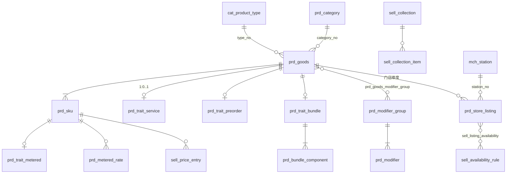

# 商品域 V2.0 · 设计规格书

状态：**草稿 · 待确认** · 创建 2026-08-28
定位：**目标态的完整设计规格** —— 全部表的终版结构、领域对象、Service、API、行业数据对标。
决策依据与演进路线在总入口 [TDD-商品域-完整方案](./TDD-商品域-完整方案.md)（本册是它的设计附件，不重复决策论证）。

---

# 一 · 总览

```
治理层（平台）   cat_product_type · prd_category · 属性集
目录层（商家）   prd_goods · prd_sku · 规格四层 · prd_trait_* · prd_modifier_*
售卖层（门店）   prd_store_listing · sell_price_entry · sell_availability_* · sell_collection_*
资源（门店）     mch_station（出品工位，商户域）
```

表清单（19 张 + 既有规格四层）：

| 层 | 表 | 说明 |
|---|---|---|
| 治理 | `cat_product_type` | 产品类型 = Trait 组合（数据） |
| 治理 | `prd_category` | 后台类目（沿用，目标态见 §2.1） |
| 目录 | `prd_goods` / `prd_sku` | SPU / SKU（目标态完整列） |
| 目录 | `prd_trait_service` `prd_trait_service_variant` | 服务行为 |
| 目录 | `prd_trait_metered` `prd_metered_rate` | 按实计量（WEIGHT 先行） |
| 目录 | `prd_trait_preorder` | 预售截单 |
| 目录 | `prd_trait_bundle` `prd_bundle_component` | 组合三形态 |
| 目录 | `prd_modifier_group` `prd_modifier` `prd_goods_modifier_group` | 选配 |
| 售卖 | `prd_store_listing` | 门店报价（目标态完整列） |
| 售卖 | `sell_price_entry` | 价格条目 |
| 售卖 | `sell_availability_rule` `sell_listing_availability` | 可售时段 |
| 售卖 | `sell_collection` `sell_collection_item` | 陈列 |
| 资源 | `mch_station` | 出品工位 |

约定（全表适用，DDL 中不再重复）：`id BIGINT` 自增物理主键不对外；审计四列
（`created_at/by`、`updated_at/by`）+ `version`（乐观锁）+ `deleted`（软删）+ `tenant_no`；
金额一律最小货币单位整数；对外标识一律业务键。

---

# 二 · 表结构（终版完整 DDL）

## 2.1 治理层

```sql
CREATE TABLE cat_product_type (
  type_no        VARCHAR(32)  NOT NULL COMMENT '业务键',
  name           VARCHAR(64)  NOT NULL COMMENT '「日用百货」「鲜活海产」「美容项目」「火锅套餐」',
  legacy_type    VARCHAR(16)  NOT NULL COMMENT '兼容映射 → prd_goods.type（NORMAL/FRESH/SERVICE/VIRTUAL/CARD），查询缓存用',
  traits         JSON         NOT NULL COMMENT '["SCHEDULED_SERVICE","METERED"...]，取值域=代码 Trait 枚举，启动时校验',
  attribute_sets JSON         NOT NULL DEFAULT ('[]') COMMENT '挂载的描述属性集编号',
  status         VARCHAR(16)  NOT NULL DEFAULT 'ACTIVE',
  UNIQUE KEY uk_product_type (type_no)
) COMMENT='产品类型=行为画像。新行业=加行，不发版';

-- prd_category 沿用现结构，目标态语义调整两处：
--   template：保留，仅作建品页兜底与 ProductType 种子来源；
--   新增列 default_type_no VARCHAR(32) NULL —— 该类目建品时默认带出的产品类型（可改）。
ALTER TABLE prd_category ADD COLUMN default_type_no VARCHAR(32) NULL;
```

属性集沿用现状承载（`prd_goods.params` + 平台值池），不另建 EAV。

## 2.2 目录层 · SPU / SKU（目标态完整列）

```sql
CREATE TABLE prd_goods (
  goods_no        VARCHAR(32)  NOT NULL COMMENT '业务键',
  entity_no       VARCHAR(32)  NOT NULL COMMENT '归属商家主体',
  product_type_no VARCHAR(32)  NOT NULL COMMENT '→ cat_product_type',
  type            VARCHAR(16)  NOT NULL COMMENT '查询缓存列（legacy_type 冗余），列表过滤用，写入时由 type_no 派生',
  category_no     VARCHAR(32)  NOT NULL COMMENT '后台类目，恰好一个',
  std_no          VARCHAR(32)  NULL     COMMENT '引用平台标准品；有值时类目与 optionCode 以标准品为准',
  -- 内容
  title           VARCHAR(128) NOT NULL COMMENT '中文权威',
  title_i18n      JSON NULL, subtitle VARCHAR(255) NULL, subtitle_i18n JSON NULL,
  cover           VARCHAR(255) NULL,
  images          JSON NOT NULL DEFAULT ('[]') COMMENT '顶部轮播',
  detail          TEXT NULL COMMENT '纯文本，不收 HTML',
  detail_images   JSON NOT NULL DEFAULT ('[]') COMMENT '详情长图，与轮播分开',
  params          JSON NOT NULL DEFAULT ('{}') COMMENT '描述属性（给买家看；系统逻辑禁读）',
  caution         VARCHAR(500) NULL COMMENT '禁忌/注意事项：交易前置弹出，不是详情段落',
  lifecycle       VARCHAR(16) NULL COMMENT '生命周期（电子元器件回填）：ACTIVE/NRND/EOL/OBSOLETE；NULL=不适用',
  -- 售卖语义
  fulfillments    JSON NOT NULL COMMENT '履约方式集合，取值域 Fulfillments',
  pay_modes       JSON NOT NULL COMMENT '支付方式集合，取值域 PayModes（四层判定第④层）',
  after_sale_policy VARCHAR(24) NOT NULL DEFAULT 'STANDARD'
                  COMMENT 'STANDARD(实物七天)/NO_RETURN(虚拟)/BY_CANCEL_RULE(服务按取消规则)，取值域 AfterSalePolicies',
  limit_per_user  INT NOT NULL DEFAULT 0 COMMENT '每人限购，0=不限',
  group_price_minor BIGINT NULL COMMENT '团购价；NULL=未开团', 
  group_min_count INT NULL,
  points_config   INT NULL COMMENT '固定发分；NULL=走类目规则（仅运营可配）',
  sellable_override JSON NULL COMMENT '按端可售覆盖',
  -- 状态
  audit_state     VARCHAR(16) NOT NULL DEFAULT 'DRAFT' COMMENT 'DRAFT/PENDING/APPROVED/REJECTED',
  on_sale         TINYINT NOT NULL DEFAULT 0,
  pending_on_sale TINYINT NULL COMMENT '重审期间记住的上架意向',
  rating INT NULL, rating_count INT NULL, sales INT NULL,
  UNIQUE KEY uk_goods (goods_no),
  KEY idx_goods_entity (entity_no, audit_state, on_sale),
  KEY idx_goods_category (category_no, type)
) COMMENT='SPU。五品类单表继承（type 判别）；行为字段一律在 Trait 表，此表不再新增行为列';

CREATE TABLE prd_sku (
  sku_no          VARCHAR(32) NOT NULL,
  goods_no        VARCHAR(32) NOT NULL,
  entity_no       VARCHAR(32) NOT NULL,
  market          VARCHAR(8)  NOT NULL DEFAULT 'CN',
  option_values   JSON NOT NULL DEFAULT ('[]') COMMENT '各规格维度取值，序与 spec_groups 对应',
  option_value_nos JSON NULL COMMENT '值池编号（跨店可比）',
  spec            VARCHAR(128) NULL COMMENT '展示拼接文案，后端下发',
  barcode         VARCHAR(32) NULL COMMENT 'ERP/收银秤通用键',
  merchant_sku_code VARCHAR(64) NULL,
  sale_unit       VARCHAR(16) NULL COMMENT '份/例/斤/次/位/晚',
  price           BIGINT NOT NULL COMMENT '基线价（分）。上下文价在 sell_price_entry',
  currency        VARCHAR(3) NOT NULL DEFAULT 'CNY',
  origin_price    BIGINT NULL, cost_price BIGINT NULL,
  stock INT NOT NULL DEFAULT 0, locked_stock INT NOT NULL DEFAULT 0
        COMMENT '库存域所辖，物理暂驻本表；商品域代码只读不写',
  presale_quota INT NULL, sold_count INT NULL,
  status VARCHAR(16) NOT NULL DEFAULT 'ACTIVE',
  UNIQUE KEY uk_sku (sku_no),
  UNIQUE KEY uk_sku_matrix (goods_no, market, option_values(255)),
  KEY idx_sku_goods (goods_no)
) COMMENT='SKU。规格轴承载沿用 spec_groups 快照+规格库四层（已验证，不重建）';
```

## 2.3 目录层 · Trait 表

```sql
CREATE TABLE prd_trait_service (
  goods_no          VARCHAR(32) NOT NULL COMMENT '主键即 SPU 业务键（1:1）',
  duration_min      INT NOT NULL COMMENT '服务/制备时长',
  buffer_before_min INT NOT NULL DEFAULT 0 COMMENT '前缓冲：路途/准备',
  buffer_after_min  INT NOT NULL DEFAULT 0 COMMENT '后缓冲：清洁',
  resource_type     VARCHAR(16) NULL COMMENT 'STAFF/SEAT/ROOM，与 mch_resource.resource_type 同源',
  resource_count    INT NOT NULL DEFAULT 1 COMMENT '双人服务=2',
  UNIQUE KEY uk_trait_service (goods_no)
) COMMENT='SCHEDULED_SERVICE。占位格数=ceil((duration+buffer)/粒度)×count，算法在预约域';

CREATE TABLE prd_trait_service_variant (
  sku_no VARCHAR(32) NOT NULL, duration_min INT NOT NULL,
  UNIQUE KEY uk_tsv (sku_no)
) COMMENT='60/90 分钟档按 SKU 覆盖时长';

CREATE TABLE prd_trait_metered (
  sku_no        VARCHAR(32) NOT NULL,
  dimension     VARCHAR(16) NOT NULL COMMENT 'WEIGHT（本期）/TIME/DISTANCE（预留，写入拒绝）',
  nominal_qty   INT NOT NULL COMMENT '标称量：克/分钟/米。下单按它出预估价',
  unit          VARCHAR(8)  NOT NULL,
  tolerance_pct INT NULL COMMENT '允差%，超过须人工确认',
  UNIQUE KEY uk_trait_metered (sku_no)
) COMMENT='按实计量结算。差额进订单行调整（weighAdjustMinor 先例）';

CREATE TABLE prd_metered_rate (
  rate_no    VARCHAR(32) NOT NULL,
  sku_no     VARCHAR(32) NOT NULL,
  seq        INT NOT NULL COMMENT '起步段=1，续步段递增',
  from_qty   INT NOT NULL,
  step_qty   INT NULL COMMENT 'NULL=按比例（单价×量）',
  step_price BIGINT NOT NULL,
  time_band  VARCHAR(32) NULL COMMENT '分时费率（TIME 维度），本期恒 NULL',
  UNIQUE KEY uk_metered_rate (rate_no), KEY idx_rate_sku (sku_no, seq)
) COMMENT='费率表独立成对象——改形状比加形态贵。WEIGHT 本期可零行（沿用单价×实重）';

CREATE TABLE prd_trait_preorder (
  goods_no VARCHAR(32) NOT NULL,
  cutoff_time TIME NOT NULL COMMENT '每日截单点',
  lead_days INT NOT NULL DEFAULT 1,
  arrival_desc VARCHAR(128) NULL,
  UNIQUE KEY uk_trait_preorder (goods_no)
) COMMENT='PREORDER。改截单不触发重审（既有 /presale 旁路语义并入）';

CREATE TABLE prd_trait_bundle (
  bundle_no VARCHAR(32) NOT NULL,
  goods_no  VARCHAR(32) NOT NULL,
  kind      VARCHAR(16) NOT NULL COMMENT 'FIXED 固定/CHOICE 可选组/SERIES 次数（疗程）',
  UNIQUE KEY uk_trait_bundle (bundle_no), UNIQUE KEY uk_bundle_goods (goods_no)
);
CREATE TABLE prd_bundle_component (
  bundle_no    VARCHAR(32) NOT NULL,
  group_name   VARCHAR(32) NULL COMMENT 'CHOICE：「主食三选一」组名',
  choose_count INT NULL COMMENT 'CHOICE：选几个',
  sku_no       VARCHAR(32) NOT NULL COMMENT '子项，必须同主体',
  qty          INT NOT NULL DEFAULT 1,
  times        INT NULL COMMENT 'SERIES：次数',
  PRIMARY KEY (bundle_no, sku_no)
);
```

## 2.4 目录层 · Modifier

```sql
CREATE TABLE prd_modifier_group (
  group_no  VARCHAR(32) NOT NULL,
  entity_no VARCHAR(32) NOT NULL COMMENT '商家级复用；门店经 listing.disabled_modifier_groups 禁用',
  name      VARCHAR(32) NOT NULL COMMENT '「辣度」「加料」「指定技师」「包装」',
  selection VARCHAR(8)  NOT NULL COMMENT 'SINGLE/MULTI',
  required  TINYINT NOT NULL DEFAULT 0 COMMENT '必选：不选不让下单',
  min_pick  INT NOT NULL DEFAULT 0,
  max_pick  INT NULL,
  source    VARCHAR(24) NOT NULL DEFAULT 'MANUAL' COMMENT 'MANUAL | RESOURCE:STAFF（选项由资源域同步，只读）',
  visible_to_buyer TINYINT NOT NULL DEFAULT 1,
  UNIQUE KEY uk_modifier_group (group_no), KEY idx_mg_entity (entity_no)
);
CREATE TABLE prd_modifier (
  modifier_no VARCHAR(32) NOT NULL,
  group_no    VARCHAR(32) NOT NULL,
  name        VARCHAR(32) NOT NULL,
  price_delta BIGINT NULL COMMENT '定额加价（分，可负）。与 pct 二选一',
  price_delta_pct INT NULL COMMENT '比例加价（加急+50）',
  ref_no      VARCHAR(32) NULL COMMENT 'RESOURCE 源的外部键（resource_no）',
  is_default  TINYINT NOT NULL DEFAULT 0,
  sort        INT NOT NULL DEFAULT 0,
  status      VARCHAR(16) NOT NULL DEFAULT 'ACTIVE',
  UNIQUE KEY uk_modifier (modifier_no), KEY idx_modifier_group (group_no, sort)
) COMMENT='选中即快照进订单行 modifier 明细；不建 Variant、不追库存';
CREATE TABLE prd_goods_modifier_group (
  goods_no VARCHAR(32) NOT NULL, group_no VARCHAR(32) NOT NULL,
  sort INT NOT NULL DEFAULT 0, PRIMARY KEY (goods_no, group_no)
);
```

## 2.5 售卖层

```sql
CREATE TABLE prd_store_listing (              -- 现 prd_store_goods 改名+扩列
  listing_no  VARCHAR(32) NOT NULL,
  store_no    VARCHAR(32) NOT NULL,
  goods_no    VARCHAR(32) NOT NULL,
  entity_no   VARCHAR(32) NOT NULL COMMENT '冗余，免 join',
  state       VARCHAR(20) NOT NULL DEFAULT 'OFF' COMMENT 'ON/OFF/PLATFORM_SUSPENDED（平台挂起商家不可自行解除）',
  channels    JSON NULL COMMENT '可售渠道；NULL=全部。取值域 SalesChannels',
  station_no  VARCHAR(32) NULL COMMENT '出品工位 → mch_station（厨打/拣货路由按它 JOIN）',
  course_no   INT NULL COMMENT '上菜道次。待观察字段',
  daily_quota INT NULL COMMENT '每日限量；沽清=今日置0；NULL=不限',
  quota_used  INT NOT NULL DEFAULT 0 COMMENT '条件 UPDATE 扣（quota_used+n<=daily_quota）',
  quota_reset VARCHAR(8) NOT NULL DEFAULT 'DAILY' COMMENT 'DAILY 营业日归零/NONE',
  moq         INT NULL COMMENT '最小起订量',
  spq         INT NULL COMMENT '标准包装量（电子元器件回填）：一盘 5000',
  order_multiple INT NULL COMMENT '订购倍数（同上）；NULL=不限',
  disabled_modifier_groups JSON NULL COMMENT '门店禁用总部选配组',
  UNIQUE KEY uk_listing (store_no, goods_no), UNIQUE KEY uk_listing_no (listing_no),
  KEY idx_listing_station (store_no, station_no)
) COMMENT='门店报价（Offer）。与库存无关：quota 是流量，stock 是存量';

CREATE TABLE sell_price_entry (
  entry_no   VARCHAR(32) NOT NULL,
  sku_no     VARCHAR(32) NOT NULL,
  store_no   VARCHAR(32) NULL COMMENT 'NULL=商家级全店',
  channel    VARCHAR(16) NULL COMMENT 'NULL=全渠道',
  tier       VARCHAR(16) NULL COMMENT 'NULL=全客群；MEMBER/FIRST_ORDER',
  min_qty    INT NOT NULL DEFAULT 1 COMMENT '起算数量档（阶梯价，电子元器件回填）：1/100/1000；解析规则扩为「最具体 × 满足数量的最高档」',
  price      BIGINT NOT NULL, currency VARCHAR(3) NOT NULL DEFAULT 'CNY',
  valid_from DATETIME NULL, valid_to DATETIME NULL COMMENT '每日定价=圈住当天',
  UNIQUE KEY uk_price_entry (entry_no),
  KEY idx_price_lookup (sku_no, store_no, channel, tier, min_qty, valid_from)
) COMMENT='解析：时间窗内候选取 most-specific（store>channel>tier），全无→sku.price。唯一判定处在 PricingService';

CREATE TABLE sell_availability_rule (
  rule_no VARCHAR(32) NOT NULL,
  store_no VARCHAR(32) NOT NULL, name VARCHAR(32) NOT NULL,
  days_mask CHAR(7) NOT NULL COMMENT '周一→周日，1111100',
  start_min INT NOT NULL, end_min INT NOT NULL COMMENT '跨夜拆两条',
  channels JSON NULL,
  UNIQUE KEY uk_avail_rule (rule_no), KEY idx_avail_store (store_no)
);
CREATE TABLE sell_listing_availability (
  listing_no VARCHAR(32) NOT NULL, rule_no VARCHAR(32) NOT NULL,
  PRIMARY KEY (listing_no, rule_no)
) COMMENT='零行=全时段可售';

CREATE TABLE sell_collection (
  collection_no VARCHAR(32) NOT NULL,
  owner_type VARCHAR(8) NOT NULL COMMENT 'PLATFORM/STORE',
  owner_no   VARCHAR(32) NOT NULL,
  name VARCHAR(32) NOT NULL COMMENT '「热菜」「面部护理」「本店推荐」',
  kind VARCHAR(8) NOT NULL DEFAULT 'MANUAL' COMMENT 'MANUAL/SMART',
  rule JSON NULL COMMENT 'SMART：按类目/标签/价格圈品，JobHandler 定时物化',
  sort INT NOT NULL DEFAULT 0, status VARCHAR(16) NOT NULL DEFAULT 'ACTIVE',
  UNIQUE KEY uk_collection (collection_no), KEY idx_coll_owner (owner_type, owner_no, sort)
);
CREATE TABLE sell_collection_item (
  collection_no VARCHAR(32) NOT NULL, goods_no VARCHAR(32) NOT NULL,
  sort INT NOT NULL DEFAULT 0, pinned TINYINT NOT NULL DEFAULT 0,
  PRIMARY KEY (collection_no, goods_no)
);

CREATE TABLE mch_station (
  station_no VARCHAR(32) NOT NULL,
  store_no VARCHAR(32) NOT NULL, name VARCHAR(32) NOT NULL,
  kind VARCHAR(16) NOT NULL COMMENT 'KITCHEN 出品/PICKING 拣货/SERVICE 服务区',
  sort INT NOT NULL DEFAULT 0, status VARCHAR(16) NOT NULL DEFAULT 'ACTIVE',
  UNIQUE KEY uk_station (station_no), KEY idx_station_store (store_no, kind)
) COMMENT='商户域：门店产出单元。商品域只持引用';
```

## 2.6 ER 关系



---

# 三 · 领域对象（完整）

```java
// ── 聚合根 Product ────────────────────────────────────
public abstract class Product {                    // STI：type 判别，Assembler 按 type 实例化
    GoodsNo goodsNo; EntityNo entityNo;
    ProductTypeRef typeRef;                        // → cat_product_type
    CategoryNo categoryNo; StdRef std;             // std 有值 ⇒ 类目/optionCode 以标准品为准
    Title title;                                   // 中文权威 + i18n 附件
    Media media;                                   // cover/images/detailImages
    String detail; Attributes attributes;          // 描述属性：Schema 校验，系统禁读
    String caution;                                // 交易前置弹出
    FulfillmentPolicy fulfillment;                 // fulfillments × payModes
    AfterSalePolicy afterSale;                     // STANDARD/NO_RETURN/BY_CANCEL_RULE
    SpecMatrix specs;                              // 规格轴 + List<Variant>
    List<ModifierGroupRef> modifierGroups;
    Optional<BundleDefinition> bundle;
    AuditState auditState; boolean onSale; Boolean pendingOnSale;

    public abstract ProductType type();
    public final void validate() { ProductInvariants.check(this); }
}
public final class StandardProduct extends Product {}
public final class FreshProduct extends Product {  // PREORDER + METERED(WEIGHT) 常见宿主
    Optional<PreorderTrait> preorder;
}
public final class ServiceProduct extends Product {
    ServiceTrait service;                          // 必有（不变量 2 双向）
}
public final class VirtualProduct extends Product {}
public final class CardProduct extends Product {}  // card_kind: TIMES/VALUE（PERIOD 记账）

// ── Trait（强类型行为对象）──────────────────────────
record ServiceTrait(Duration duration, ResourceRequirement resource) {}
record Duration(int prepareMin, int bufferBeforeMin, int bufferAfterMin) {}
record ResourceRequirement(ResourceType type, int count) {}
record MeteredTrait(MeterDimension dim, int nominalQty, String unit,
                    Integer tolerancePct, List<RateStep> rates) {
    Money settle(int actualQty, Money nominalPrice);   // 结算：费率表或单价×实重
}
record PreorderTrait(LocalTime cutoff, int leadDays, String arrivalDesc) {}
record BundleDefinition(BundleKind kind, List<BundleComponent> components) {}

// ── 聚合根 Variant（Product 边界内实体）──────────────
class Variant {
    SkuNo skuNo; List<OptionValue> optionValues;
    Money basePrice; Money comparePrice; Money costPrice;
    String barcode; String sellerSku; SaleUnit unit;
    Optional<MeteredTrait> metered;                // SKU 级
    Optional<Integer> durationOverrideMin;         // 60/90 档
}

// ── 聚合根 ModifierGroup ─────────────────────────────
class ModifierGroup {
    GroupNo groupNo; EntityNo owner; String name;
    Selection selection; boolean required; int minPick; Integer maxPick;
    ModifierSource source;                         // MANUAL / RESOURCE:STAFF
    List<Modifier> modifiers;
    void validatePick(List<ModifierNo> picked);    // 必选/上下限（不变量 4）
}
record Modifier(ModifierNo no, String name, PriceDelta delta, Optional<RefNo> ref) {}
sealed interface PriceDelta { record Fixed(long minor){} record Pct(int pct){} }  // 二选一

// ── 聚合根 Listing ───────────────────────────────────
class Listing {
    ListingNo no; StoreNo store; GoodsNo goods;
    ListingState state;                            // 迁移唯一判定处（不变量 14）
    Set<SalesChannel> channels;                    // 空=全部
    Optional<StationNo> station; Optional<Integer> courseNo;
    Quota quota;                                   // limit/used/reset —— 条件扣减
    Optional<Integer> moq;
    Set<GroupNo> disabledModifierGroups;
    List<RuleRef> availability;                    // 空=全时段
    boolean availableAt(Instant at, SalesChannel ch);
}
record Quota(Integer limit, int used, QuotaReset reset) {}

// ── 价格解析（无状态领域服务）────────────────────────
class PriceBook {
    /** 全系统唯一价格判定处。命中且仅命中一条（不变量 9 全序）。 */
    Money resolve(SkuNo sku, PriceCtx ctx);        // ctx{store, channel, tier, at}
}

// ── Collection ───────────────────────────────────────
class Collection { CollectionNo no; Owner owner; String name;
                   CollectionKind kind; Optional<SmartRule> rule; List<Item> items; }

// ── 值对象与取值域 ───────────────────────────────────
record Money(long minor, Currency currency) {}     // 整数，绝不浮点
enum Trait { SCHEDULED_SERVICE, METERED, PREORDER, BUNDLE, REDEEMABLE, DAILY_PRICED }
enum MeterDimension { WEIGHT, TIME, DISTANCE }     // TIME/DISTANCE 写入拒绝（本期）
enum SalesChannel { DINE_IN, TAKEOUT, DELIVERY, HOME, ONLINE }
enum AfterSalePolicy { STANDARD, NO_RETURN, BY_CANCEL_RULE }
// 类型化业务键：GoodsNo/SkuNo/StoreNo/ListingNo/GroupNo/StationNo …
```

不变量 14 条清单见总入口 §四；全部实现于 `ProductInvariants` 与各聚合的守卫方法。
ArchUnit：`product.domain.**` 禁 import MyBatis / Spring / `BaseEntity`。

---

# 四 · Service 层（完整签名）

```java
// ═══ 治理（ops）═══
public interface ProductTypeService {
    List<ProductTypeVO> list();
    ProductTypeVO upsert(UpsertTypeCmd cmd);          // 改 traits 走审批：存量商品 Trait 数据要迁移
}

// ═══ 目录（biz，作用域=BizContext，入参不收 entityNo）═══
public interface MerchantGoodsService {               // 沿用，SaveCommand 增段
    GoodsVO save(SaveCommand cmd);
    /* SaveCommand 增：traits(TraitsSection), modifierGroupNos, afterSalePolicy,
       caution —— 全部「不传=不改」。TraitsSection 按 product_type 白名单校验 */
    GoodsVO submitForAudit(String goodsNo);
    GoodsVO audit(String goodsNo, boolean approved, String reason);   // 运营
    PageData<GoodsVO> page(GoodsQuery q);
    GoodsDetailVO detail(String goodsNo);             // 含 traits/modifiers/afterSale 段
}
public interface ModifierCatalogService {
    ModifierGroupVO upsertGroup(UpsertGroupCmd cmd);
    void upsertModifiers(String groupNo, List<ModifierCmd> items);
    void attach(String goodsNo, List<String> groupNos);
    void syncResourceOptions(String groupNo);         // RESOURCE 源：由资源域事件触发
    List<ModifierGroupVO> listByEntity();
}
public interface FormSchemaService {
    /** 建品表单唯一来源：type 的 traits + attributeSets + 门店能力过滤 + 行业词条 */
    FormSchemaVO schema(String categoryNo, String storeNo);
}

// ═══ 售卖（biz，作用域=门店）═══
public interface ListingService {
    List<ListingVO> activate(String storeNo, List<String> goodsNos);   // 幂等
    void delist(String listingNo);
    void suspend(String listingNo, String reason);    // 平台（ops）
    void configure(String listingNo, ListingCfgCmd cmd);   // 工位/道次/MOQ/渠道/禁用选配组
    void soldOut(String listingNo);                   // 今日 quota 置 0
    void setDailyQuota(String listingNo, Integer quota, QuotaReset reset);
    boolean tryConsumeQuota(String listingNo, int n); // 条件 UPDATE，交易域下单时调
    void releaseQuota(String listingNo, int n);       // 取消回补
}
public interface PricingService {
    void batchUpsert(List<PriceEntryCmd> entries);    // 渠道/客群/每日定价共用
    Money resolve(String skuNo, PriceCtx ctx);        // ★ 全系统唯一价格判定处
}
public interface AvailabilityService {
    RuleVO upsertRule(String storeNo, RuleCmd cmd);
    void bind(String listingNo, List<String> ruleNos);
    boolean isAvailable(String listingNo, Instant at, SalesChannel ch);
}
public interface CollectionService {
    CollectionVO upsert(Owner owner, CollectionCmd cmd);
    void setItems(String collectionNo, List<ItemCmd> items);
    void materializeSmart(String collectionNo);       // JobHandler 定时调
}

// ═══ 读侧 ═══
public interface CatalogQueryService {
    /** C 端合成视图：陈列×时段×沽清×解析价 服务端算完，端上不拼 */
    StorefrontVO storefront(String storeNo, SalesChannel ch, Instant at);
    BuyerGoodsVO buyerDetail(String goodsNo, PriceCtx ctx);   // modifier 按 visibleToBuyer 裁剪
    SearchResultVO search(SearchQuery q);             // filterable 属性走投影索引
}
```

**跨域出口**（商品域提供数据与判定，不编排）：
交易域调 `resolve` + `tryConsumeQuota` + Variant/Modifier 快照；
预约域读 `ServiceTrait` 算格数；打印/拣货按 `station_no` JOIN 路由；
称重/计时结算调 `MeteredTrait.settle`，差额走订单行调整。

---

# 五 · API（完整）

现有前缀下扩展，不开 `/v2`；写带幂等键；「不传=不改」；语义动作 `:verb`。

## 5.1 端点总表

```
── 治理 ops ──
GET/PUT  /ops/product-types
GET/PUT  /ops/categories/{no}/default-type

── 目录 biz ──
POST /biz/goods/save                  增 traits/modifierGroupNos/afterSalePolicy/caution 段
GET  /biz/goods · /biz/goods/{no}     响应增段
POST /biz/goods/{no}/submit           送审（语义不变）
GET  /biz/goods/form-schema?categoryNo=&storeNo=
GET/POST /biz/modifier-groups
POST /biz/modifier-groups/{groupNo}/modifiers:batch
POST /biz/goods/{no}/modifier-groups:attach

── 售卖 biz（门店作用域）──
POST /biz/stores/{storeNo}/listings:activate      body: goodsNos[]
POST /biz/listings/{listingNo}:delist
POST /biz/listings/{listingNo}:sold-out
PUT  /biz/listings/{listingNo}                    工位/道次/MOQ/渠道/限量/禁用选配组
GET/PUT /biz/stores/{storeNo}/availability-rules
POST /biz/listings/{listingNo}/availability:bind  body: ruleNos[]
GET/PUT /biz/stores/{storeNo}/collections
PUT  /biz/collections/{no}/items
PUT  /biz/price-entries:batch
GET  /biz/price:resolve?skuNo=&storeNo=&channel=&tier=    判定处调试出口

── C 端 mp ──
GET /mp/storefront/{storeNo}?channel=&at=
GET /mp/goods/{no}?storeNo=&channel=
```

## 5.2 关键报文（示例）

**建品（餐饮·牛肉面）** `POST /biz/goods/save`
```jsonc
{ "title": "招牌牛肉面", "categoryNo": "CAT-noodle", "productTypeNo": "PT-FRESH-MEAL",
  "specGroups": [{ "name": "分量", "options": ["小碗", "大碗"] }],
  "skus": [{ "optionValues": ["小碗"], "price": 1800, "saleUnit": "碗" },
           { "optionValues": ["大碗"], "price": 2200, "saleUnit": "碗" }],
  "fulfillments": ["DINE_IN", "STORE_PICKUP", "MERCHANT_DELIVERY"],
  "modifierGroupNos": ["MG-spicy", "MG-extra"],          // 辣度(必选)、加料
  "afterSalePolicy": "BY_CANCEL_RULE" }
```

**C 端合成视图** `GET /mp/storefront/{storeNo}?channel=DINE_IN`
```jsonc
{ "collections": [{ "name": "面食", "items": [{
    "goodsNo": "G-001", "title": "招牌牛肉面",
    "price": { "from": 1800, "resolved": true },          // 已按渠道/客群/时窗解析
    "soldOut": false, "available": true,                  // 时段与沽清已算
    "modifiersBrief": { "required": ["辣度"] } }]}]}
```

**价格解析** `GET /biz/price:resolve?skuNo=SKU-1&storeNo=S1&channel=TAKEOUT&tier=MEMBER`
```jsonc
{ "price": 2000, "currency": "CNY",
  "hit": { "entryNo": "PE-9", "specificity": "store+channel" },   // 判定可解释、进订单快照
  "fallback": false }
```

---

# 六 · 行业数据对标

**同一套表，三个行业的真实数据长什么样。** 每行业一个典型商品 + 一张概念落位表。

## 6.1 零售 · 冷鲜三文鱼（称重 + 预售）

| 表 | 数据 |
|---|---|
| `prd_goods` | type=FRESH，typeNo=「生鲜水产」（traits: METERED, PREORDER, DAILY_PRICED），afterSale=STANDARD |
| `prd_sku` | 「整条」saleUnit=斤 price=6800（基线）；「切段」price=7200 |
| `prd_trait_metered` | 整条: dim=WEIGHT, nominal=1500g, tolerance=15% |
| `prd_trait_preorder` | cutoff=21:00, lead=1, 「次日 10 点到店」 |
| `sell_price_entry` | 明日行：valid 圈住当天，price=6200（**每日定价 = DAILY_PRICED 的承载**） |
| `prd_store_listing` | station=「冷藏区」(PICKING)，quota=NULL |
| `sell_collection` | STORE「时令海鲜」 |

## 6.2 餐饮 · 招牌牛肉面 + 双人套餐

| 表 | 数据 |
|---|---|
| `prd_goods` | 牛肉面: type=NORMAL，typeNo=「现制餐食」（traits: ∅）—— **绝大多数菜品零 Trait** |
| `prd_sku` | 小碗 1800 / 大碗 2200 |
| `prd_modifier_group` | 「辣度」SINGLE required min=1（免辣/微辣/中辣，delta=0）；「加料」MULTI max=3（加面+300、卤蛋+200） |
| `prd_store_listing` | station=「面档」(KITCHEN)，course=1，daily_quota=100（沽清=置0） |
| `sell_price_entry` | channel=TAKEOUT: 小碗 2000（**堂食外卖两价**） |
| `sell_availability_rule` | 「午市」1111111 11:00–14:00 → 绑套餐 listing |
| `prd_trait_bundle` | 双人套餐: kind=CHOICE；组「主食二选二」choose=2；组「饮品二选一」choose=1 |
| `sell_collection` | STORE「面食」「套餐」（= 菜单分类） |

## 6.3 美业 · 深层护理（单次 + 疗程）

| 表 | 数据 |
|---|---|
| `prd_goods` | 单次: type=SERVICE，typeNo=「美容项目」（traits: SCHEDULED_SERVICE），caution=「孕期禁用精油」，afterSale=BY_CANCEL_RULE |
| `prd_sku` | 60min 档 28800 / 90min 档 38800 |
| `prd_trait_service` | duration=60, buffer_after=15, resource=STAFF, count=1 |
| `prd_trait_service_variant` | 90min 档覆盖 duration=90 |
| `prd_modifier_group` | 「指定技师」source=RESOURCE:STAFF（总监+5000、店长+3000，选项同步自资源域） |
| 疗程 `prd_goods` | type=CARD，typeNo=「面部疗程」（traits: SCHEDULED_SERVICE, BUNDLE, REDEEMABLE） |
| `prd_trait_bundle` | kind=SERIES, component=单次60min SKU, times=10 |
| `sell_price_entry` | tier=FIRST_ORDER: 60min 档 9900（体验价） |
| `sell_collection` | STORE「面部」（= 项目分组） |

## 6.4 扩展业态落位速查（缺口已在总入口 §七 记账）

| 业态 | 概念 → 落位 |
|---|---|
| 家政 | 面积档→规格轴；上门→fulfillments(APPOINTMENT)；自带工具−10→Modifier 负加价；加时→METERED(TIME) **记账** |
| KTV | 包厢档→规格轴或独立 SPU；包段套餐→普通 SKU+时段规则；按时开台→METERED(TIME) **记账**；果盘挂账→零售商品进台账（餐饮包复用） |
| 健身 | 私教分级→Modifier(RESOURCE:STAFF)（≡指定技师）；团课名额→预约域 slot；会籍→REDEEMABLE(PERIOD) **记账** |
| 搬家 | 车型档→规格轴；楼层/拆装费→Modifier 组；按里程→METERED(DISTANCE) **记账** |
| 剧本杀 | 按人→saleUnit=位+moq；拼场/包场→两个 SKU；场次→预约域 |
| 洗衣 | 品类价目→商品列表本身；加急+50%→Modifier 比例加价 |

**读法**：扩展业态没有一条要新表 —— 缺的全是 Trait 的新 dimension / 新 kind，
落位方式与三个已验证行业完全同构。

---

# 七 · 术语层（词条即数据）

form-schema 按门店行业码下发 label/help，b-app 原样渲染。核心对照：

| 模型 | 零售 | 餐饮 | 美业 |
|---|---|---|---|
| Collection | 商品分组 | 菜单分类 | 项目分组 |
| AvailabilityRule | 售卖时段 | 时段菜单 | 可约时段 |
| ModifierGroup | 选购选项 | 做法/加料 | 加项/指定技师 |
| Station | 拣货分区 | 出品部门 | 服务区 |
| daily_quota | 每日限量 | 沽清份数 | 每日可约 |
| Bundle | 礼盒装 | 套餐 | 疗程包 |
| METERED(WEIGHT) | 称重商品 | 海鲜按斤 | — |

全表见[对齐清单](../reference/商品域-多行业对齐清单.md) §四。

---

# 八 · 本册与总入口的分工

| 内容 | 在哪 |
|---|---|
| 决策记录（15 条）、演进四阶段、测试与闸门、待确认 | [TDD-商品域-完整方案](./TDD-商品域-完整方案.md) |
| **表结构终版 / 领域对象终版 / Service 签名 / API 报文 / 行业数据对标** | **本册** |
| 标准命名与术语全表 | [对齐清单](../reference/商品域-多行业对齐清单.md) |
| 需求依据 | 三行业梳理 · 七行业对照 |
