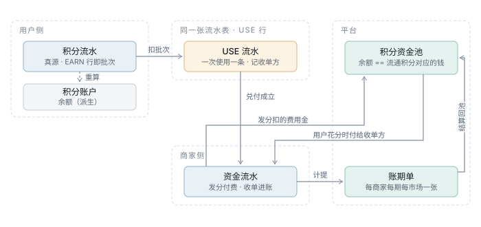
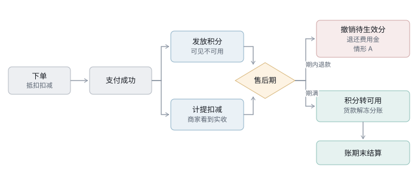
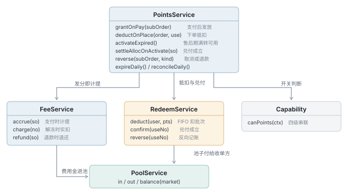

# 积分域 · 完整方案

> 状态：数据层**已落地** `V17`–`V30` · 服务层与契约未实现
> 上游：[ADR-006 积分方案](../ADR/ADR-006-积分方案.md) · 优先级 P1（可整体关闭，不阻塞交易主链路）
> 展开：[表设计详解](../archive/积分域-表设计详解.md)（L3 数据）· [接口与核心逻辑](./积分域-接口与核心逻辑设计.md)（L3 行为）
>
> 本文按 [文档规范](../../文档规范.md) §四「方案类骨架」组织。

---

## 一、一句话

**商家发放积分的那一刻，就从他的货款里扣走对应的钱；此后这批分与他再无关系。**

积分是**平台对用户的负债**，不是商家的。用户在 A 店赚的分在 B 店花，
A 不欠 B —— A 发分时钱已进平台的积分资金池，B 从池子拿钱，池子不问这分是谁发的。

---

## 二、为什么是这个方案

五个被否掉的选项，每个都对应一段真实的复杂度。

### 否掉：信用模型（发分记负债，花掉时才付钱）

它需要**四样额外的东西**，预付费下全部消失：

| 信用模型必须解决的 | 预付费下 |
|---|---|
| 商家无限发分怎么办 | **货款不够就扣不出费用金**，天然受限，不需要授信额度 |
| 已发未兑付的分没有资金对应 | **发放当下钱就到位**，不需要超授信停发闸 |
| A 欠 B 多少要算清 | **不存在债务**，池子付给 B 即可，不需要清算 |
| 额度与资金两本账 | **一本账**：只有资金 |

真正的理由不是复杂，**是风险**：或有负债藏在账外，商家跑路时平台才发现要替他垫付。
预付费把这个敞口压到零。

### 否掉：兑付时按发放商家分摊

这是信用模型的直接推论 —— A 发的分被花掉，A 要付钱给 B，所以必须知道
「这 3000 分里哪 2000 是 A 发的」。曾为此建过一张 `pts_redeem_alloc`。

**预付费下这个需求整个消失**：A 在发分时就付过了。表已于 `V28` 删除。

`V28` 时批次（EARN 行）还留着「只为有效期服务」这一个用途；
`V30` 改成账户级滚动到期后，**这个用途也没了，批次概念整个删除**。

### 否掉：支付成功即可用 / 售后期满才发放

| 方案 | 否掉的理由 |
|---|---|
| 支付成功即可用 | 被「下大单 → 拿分 → 立刻在别家花掉 → 退掉大单」打穿，那笔钱平台垫 |
| 售后期满才发放 | 用户付完钱看不到分，以为没给，客服成本转嫁给平台 |
| **立即发放、售后期后可用** ✅ | 立刻看得到（`pending_balance` 展示为「待生效」），但花不掉 |

### 否掉：按批次算到期（每笔一个日子，或对齐到统一到期日）

在 EARN 行上放 `expire_at` 与 `remaining`，抵扣时 FIFO 逐批递减 —— 结构上不复杂，
但它要求全程维护两个字段，而**这两个字段唯一的读者就是过期任务本身**。

对齐到季度末（淘宝淘金币的做法）能把「每天扫零星几笔」变成「一年 4 次批处理」，
也能让用户只记一个日子 —— 但批次仍然要维护。**账户级滚动到期把批次整个删掉。**

京东走每笔独立那条（2026-01-01 新规：180 天，自获得日起算）。
它的代价在 §四「有效期」一节里对比。

### 否掉：退款时把余额扣成负数

最省事的写法，但**用户看到负余额会来投诉**，而且他若不再消费，
这就是一笔永远挂在账上没人处理的坏账。改为从退款金额里扣，当场结清。

### 对齐行业

| | 京东京豆（2026 新规） | 淘宝淘金币 | 万豪 / 达美 / 招行 | 本方案 |
|---|---|---|---|
| 归属 | 平台单一账户，兑付不追发放来源 | 同 | 同 | 同 |
| 退货扣回 | 扣该商品所获赠的分，**账户不足则从退款金额中扣现金** | — | — | 同京东 |
| 消耗顺序 | — | FIFO，先用最旧的桶 | 不适用 | **不适用**：没有批次 |
| 退回的分 | 「有效期不变」：剩 10 天用掉、2 天后退回还剩 8 天 | — | — | **不需要规则**：加回余额即可 |
| 有效期 | 每笔独立 180 天，自获得日起算 | 自获得起 1 年 | **活跃即保留**：365 天无积分变动才清零 |
| 到期粒度 | 每笔一个日子 | 统一到季度末/半年末 | **账户一个日子** |

**归属与退货扣回取京东，有效期取「活跃即保留」** —— 万豪旅享家 24 个月内有合格活动即延期，
达美/美联航/捷蓝里程永久有效，招行信用卡积分永久有效。固定期限（京东 180 天、
全日空 36 个月不可延）在高价值积分体系里是少数派。

「退回的分有效期怎么算」这个在京东和淘宝口径下都要专门设计的问题，
在滚动到期下**根本不存在** —— 到期挂在账户上，退回就是加回余额。

---

## 三、结构

### 钱怎么流



三个区，一条闭环：**商家发分扣的费用金进池 → 用户在别家花分时池子付给收单方 → 账期单结算后回池**。

图上看不出来但最要紧的一点：**账户是派生的，流水才是真源**。
`pts_user_account.balance` 随时可由 `pts_user_ledger` 重算，所以任何时候都能回答
「这个余额是怎么来的」。一旦允许直接改余额，出错之后就再也查不出是从哪条流水开始错的。

### 三个时点



**售后期结束这一刻同时发生两件事**：积分转为可用、货款解冻并执行分账。
两件事重合不是巧合 —— 它保证「流通中的积分都有对应资金」在积分变得可花的那一刻仍然成立。

期内的退款（**绝大多数**）落在情形 A：分还没生效，撤销即可，零影响。
期后仍可能退款（质量问题、法定退货权），走 B/C。

### 服务边界



`PointsService` 是唯一入口；`FeeService` 与 `RedeemService` 都只作用在 `PoolService` 上 ——
**没有任何一条资金流动绕过池子**，这是恒等式 2 能成立的前提。

### 数据

3 张表，横跨 `pts_*` 与 `stl_*`。完整字段见[表设计详解](../archive/积分域-表设计详解.md)。

| 表 | 职责 | 关键列 |
|---|---|---|
| `pts_user_account` | 余额缓存（**派生**）+ **账户到期** | `balance`、`pending_balance`、`expire_at`、`last_active_at` |
| `pts_user_ledger` | **真源**；EARN 行即发放，USE 行即一次兑付 | `available_at`、`acceptor_merchant_no`、`amount_minor`、`status` |
| `stl_points_pool` | **积分资金池** | `pool_type`、`balance_after` |

订单与结算侧另有三列，是两本账的接缝：

| 列 | 在哪 | 作用 |
|---|---|---|
| `points_deduct_minor` | `ord_sub_order` | 本单抵扣了多少钱 —— **两本账的勾稽点** |
| `points_fee_minor` | `ord_sub_order` / `stl_bill` | 本单发分要扣的费用金 |
| `merchant_recv_minor` | `ord_sub_order` | 商家实收，支付时即算定，不必等结算 |

---

## 四、详细设计

### 一笔具体的账

```
用户在 A 店消费 100 元，A 店开了积分（发放比例 1%）
  ├─ 发放 100 分给用户（对应 1 元）
  └─ A 的实收里扣 1 元费用金 → 进积分池        ← 发分即付

用户后来在 B 店消费，用 100 分抵扣 1 元
  ├─ B 的货款少收 1 元
  └─ 池子付给 B 1 元                          ← 池子兑付

净结果：A 出 1 元，B 收 1 元，池子回到零，用户得到 1 元优惠
```

`pts_user_ledger.issuer_merchant_no`（EARN 行）保留，但**只用于追溯与统计** ——
「谁发的分卖得好」是运营问题，不是资金问题。

### 退款：三种情形

| 层 | 情况 | 已发的分 | 商家费用金 | 退款金额 |
|---|---|---|---|---|
| **A** | 待生效期内（**绝大多数**） | 从 `pending_balance` 撤销 | 退还 | 全额 |
| **B** | 已生效、**账户够扣** | 从 `balance` 扣回 | 退还 | 全额 |
| **C** | 已生效、**账户不够扣** | 能扣多少扣多少 | 差额部分不退 | **扣减差额** |

```
clawback  = min(该单发放的分, 账户余额)
shortfall = 该单发放的分 − clawback
offset    = shortfall / rate_snapshot     ← 从退款金额里扣
```

判据是「**账户现在够不够扣**」，不是「这批分被用掉了多少」。
用户的分是混同的一池 —— 他账上还有 500 分，就没有理由追问
「这 500 里有没有你这单发的」。后者要求全程维护批次消耗明细。

情形 C 的账要这样才平：扣不回来的 100 分对应 1 元，那 1 元已经被兑现
（池子付给某个收单方了），退款就退 99 而不是 100。若按「扣不回来就算了」，池子凭空亏 1 元。

差额折算用**发放时的 `rate_snapshot`**，不用当前汇率：那批分是按那个汇率发的。

> 退款单必须**明示**这笔扣减（`ord_after_sale.points_offset_minor`）。
> 不写清楚，「我退 100 你只退我 99」必然变成客诉。

### 有效期：活跃即保留

**到期挂在账户上，任何积分变动都把它往后推。**

```
pts_user_account.last_active_at = now
pts_user_account.expire_at      = now + POINTS.inactiveDays   // 本地当天 23:59:59
```

续期发生在 **EARN 与 USE**，不发生在 REVOKE / EXPIRE。
用分也算活动，是因为兑换正是我们想鼓励的行为 —— 只认「获得」的话，
一个只花不赚的用户会被清零，而他恰恰在帮池子出清。
REVOKE（退款扣回）不算：那不是用户主动行为，且「退一单续一年」可以被反复触发。

**这一条删掉了整整一层。** 批次级到期需要在每条 EARN 行上维护 `remaining` 与 `expire_at`，
而这两个字段唯一的读者就是过期任务本身。账户级之后：

| 删掉的 | 原来是干什么的 |
|---|---|
| `pts_user_ledger.remaining` | 批次剩余，抵扣时递减 |
| `pts_user_ledger.expire_at` | 批次到期日 |
| `idx_pts_batch` | FIFO 取批次的索引 |
| FIFO 取批次逻辑 | 先到期先用 |
| 「退回的分落在哪个批次」 | 一整套规则，**问题本身消失** |

到期任务也从「扫流水表找未用尽的批次」变成「扫账户表一行一个用户」，便宜一个数量级。

到期时刻取**市场本地时区**的当天 23:59:59 —— 用 UTC 的话界面写着某月某日到期，
而中国用户会在第二天早上 8 点整眼看着分消失。

> ⚠️ **到期前 30 天必须推送提醒**，这不是可选项。
> 滚动到期是**一次性全部清零**，冲击远大于零星过期；而到期日因人而异，
> 用户没有任何办法自己算出来。不提醒的话这个模型对用户是敌意的 ——
> 他不知道自己在倒计时，醒来发现全没了。`expire_notified_at` 是幂等位。

无活动期（现 365 天）在 `POINTS.inactiveDays`。

### 状态机

```
USE 流水 pts_user_ledger.status
    PENDING ──▶ CONFIRMED ──▶ REVERSED
       │                          ▲
       └──────────────────────────┘

账期单 stl_points_bill.status
    DRAFT ──▶ CONFIRMED ──▶ SETTLED
```

`PENDING` = 预占。**此时池子还没付给收单方**，因为订单可能取消。
售后期满转 `CONFIRMED`，池子才出钱。

### 开关：四级串联

```
生效 = L1 全局 AND L2 社区 AND 主体不是小微 AND L3 商家
```

| 级 | 落在哪 |
|---|---|
| L1 | `sys_config.FEATURES.points` |
| L2 | `cmt_community.points_enabled` |
| 主体 | `usr_merchant_payment.subject_type` ≠ `MICRO` |
| L3 | `usr_merchant.points_enabled`；`points_forced` 可按行业强制开 |

三条原则，每条都防着一件具体的事：

1. **上层关，下层一定关** —— 否则灰度放量时关不干净
2. **关闭只影响将来** —— 已发出的分仍有效、已扣的费用金不退，否则关一次开关就是一次资金事故
3. **发收对称**（`canIssue == canAccept`）—— 允许只收不发的话，**理性商家全会这么选**，池子只出不进

> 主体这一级排在商家开关**之前**：小微是「不可开」不是「关着」，
> 提示语必须是「升级为个体工商户后可开启」，而不是「本店未开启积分」。

### 多市场

**按市场隔离**，不跨市场流通 —— 用户在 CN 赚的分不能在 AE 花。

`market` 是隔离键，`currency` 是金额口径（平台按市场配置，不在代码里硬绑）。
`pts_user_account` 按 `(user_no, market)` 唯一，账期单按 `(merchant_no, period, market)` 唯一。

选隔离而不是全局通用：这是本地生意，跨市场消费不会发生，
而全局通用要处理汇兑损益归属 —— **为不会发生的场景付出的代价**。

### 恒等式

对账任务每日校验。恒等式是这套设计唯一的自检手段，违反即告警：

| # | 恒等式 | 违反说明 |
|---|---|---|
| 1 | `pts_user_account.balance` == Σ `pts_user_ledger.points` | 余额被直接改过 |
| 2 | **池子余额 == Σ 流通中积分 × 汇率** | 有分没钱，或有钱没分 |
| 3 | `stl_points_bill.net` == `income − expense` | 账单算错 |
| 4 | Σ `ord_sub_order.points_deduct_minor` == Σ `pts_user_ledger.amount_minor(USE, CONFIRMED)` | **两本账对不上** |
| 5 | `merchant_recv_minor` == 实付 − 通道费 − 佣金 − 服务费 − 费用金 | 实收算错 |

第 2 条是预付费模型的核心保证；第 4 条是资金账与积分账的勾稽点，
由 `packages/shared/tests/schema-lineage.test.ts` 守住那条链路不被改断。

---

## 五、取舍记录

| 冲突 | 让了谁 | 代价 | 为什么接受 |
|---|---|---|---|
| 用户想立刻花分 ↔ 平台怕薅 | **平台** | 用户要等售后期 | 拆成「立即可见 + 延后可用」后，用户损失的只是「立刻花掉」这一个动作 |
| 过期的钱归商家 ↔ 归平台 | **平台** | 商家觉得钱没了 | 归商家要为每笔过期追溯发放方并逆向记账；归平台一笔 `EXPIRE_INCOME` 了结，恒等式 2 始终成立 |
| 池子被强制出清 ↔ 少一层批次 | **少一层批次** | 活跃用户的积分长期不到期，池子沉淀资金更大 | 恒等式 2 照样成立；池子通过兑换与流失用户清零两条路释放。池子真涨得快说明**发放比例 > 兑换率**，那是业务参数失衡 —— 固定到期日只是把它盖住 |
| 资金实时移动 ↔ 少一条失败路径 | **少一条失败路径** | 记账与到账时点分离（`accrued_at` vs `split_at`） | 钱在冻结期内商家本来就用不了，提前分账不让他多拿什么，却要多写一条「退款时回退分账」 |
| 多市场通用 ↔ 隔离 | **隔离** | 跨市场用户体验割裂 | 跨市场消费不会发生 |
| 一张流水表两种行 ↔ 拆表 | **一张表** | EARN 行与 USE 行字段集不同，读之前要按 `biz_type` 分流 | 拆开会有大量共同字段，且「余额 == Σ points」要跨两张表算 |

### 一条教训

`pts_redeem_alloc` 被保留了两版，因为每次发现它的理由失效时，**换了个新理由**，
而不是问「这张表还该不该存在」。

代价是三条新理由各自衍生了索引、状态机分支和退款逻辑 —— 删表时这些一起消失。
**替换掉的理由不是理由，是惯性。**

---

## 六、待确认

| # | 事项 | 卡住谁 |
|---|---|---|
| ~~1~~ | ~~过期积分对应的资金归谁~~ **✅ 2026-08-06 定：归平台**（`EXPIRE_INCOME`，V24） | — |
| 2 | 兑换比例（多少分 = 1 元） | 所有金额换算；接口已按 `rate_snapshot` 预留 |
| 3 | 发放比例（成交额的百分之几） | 商家成本与发放量，直接决定池子规模 |
| 4 | 无活动期长度（现 365 天） | 决定流失用户的清零节奏；与发放/兑换比例共同决定池子规模 |
| 4b | **发放比例与兑换率的目标区间** | 滚动到期不再强制出清，池子规模由这两个数决定 —— 需要设监控阈值 |
| 5 | 账期长度（月 / 半月） | `period` 口径，影响结算任务与商家现金流 |
| 6 | 商家侧积分接口**归 B 端还是 C 端** | 目前挂在 C 端契约，见[接口设计 §一](./积分域-接口与核心逻辑设计.md) |
| 7 | 积分表**尚无 Java 实体与 Mapper**（V17 只建了表） | 后端落地，见[待办](../../api/待办-契约对齐.md) |

---

## 附：版本演进

一张表被保留两版的过程，本身是这套设计最有信息量的部分。

| 版本 | 改了什么 |
|---|---|
| `V17` | 建表（信用模型：授信额度 + 按发放方分摊兑付） |
| `V22` | **改为预付费**：发分即扣费用金，删额度台账 |
| `V23` | 商家实收 `merchant_recv_minor`，支付时即算定 |
| `V24` | 过期积分的资金归平台（`EXPIRE_INCOME`） |
| `V25` | 待生效余额 `pending_balance` + 退款三情形 |
| `V26` | 商家进账改回「一次使用一条」，删自发自用标记 |
| `V27` | 修正遗留自信用模型的表注释 |
| `V28` | **积分发出后与商家脱钩**，删 `pts_redeem_alloc`，USE 列并入用户流水 |
| `V29` | 有效期改为统一到期日（淘宝口径）—— **已被 V30 推翻** |
| `V30` | **活跃即保留**：到期挂到账户上，批次概念（`remaining`/行级 `expire_at`/FIFO）整个删除 |
