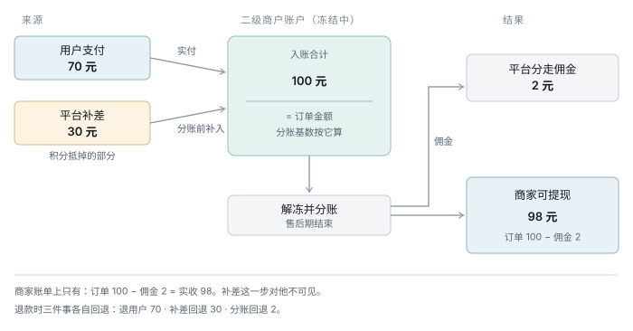

# 积分抵扣的资金补差 · 方案

> 状态：**待决策**，未落地。本文只有设计，**没有改动任何代码、迁移或契约**。
> 上游：[资金链路-数据库方案](./资金链路-数据库方案.md) · [积分域-完整方案](./积分域-完整方案.md)
> 优先级：P0 —— 它决定商家账单口径，做错了要重算历史账
>
> 本文按 [文档规范](../../文档规范.md) §四「方案类骨架」组织。

---

## 一、一句话

**支持。而且微信和支付宝都提供了专门的接口做这件事，叫「补差」。**

平台在**分账前**调补差接口把补贴款转入二级商户账户，
商家账户入账 = 用户实付 + 平台补贴 = **订单全额**，再按全额为基数分账。
商家收到的钱与订单金额完全匹配，他不需要知道有积分这回事。

---

## 二、为什么是这个方案

### 先纠正一个错误前提

之前的设计（`V32` 少分机制）建立在一个判断上：

> 「分账是单向的 —— 平台无法反向分账把钱推给商家。」

**这个判断是错的。** 分账确实是单向的，但两家都另外提供了补差接口：

| | 微信 电商收付通 | 支付宝 直付通 |
|---|---|---|
| 能力 | 补差接口，**分账前**将补贴款转入二级商户账户 | 补差接口，同上 |
| 效果 | 二级商户入账 = 用户实付 + 平台补贴，**按全额为分账基数** | 同 |
| 退款 | 补差回退，把补贴部分退回平台 | 退营销补差 |
| 典型用途 | 平台出资的优惠券 | 同（官方例子就是「平台出资满 200 减 20」） |

官方的典型场景就是**平台出资的优惠券** —— 用户享受 20 元优惠，商家仍收 200 元，
差额由平台补。**积分抵扣与它是同一件事**，只是券换成了积分。

### 被否掉：从平台应收里「少分」（V32）

在补差接口存在的前提下，这个方案的所有代价都是白付的：

| 少分的代价 | 补差下 |
|---|---|
| 商家应收与实际到账现金**存在差额**，要跨账期慢慢补 | 支付成功即补齐，**当笔就匹配** |
| 需要 `stl_merchant_payable` 余额表与冲抵逻辑 | 不需要 |
| **零佣金档（`MERCHANT_OWNED`）没有冗余** —— 让不出足够的钱 | 问题消失：补差不依赖平台应收 |
| 商家零成交时余额永远挂着，要打款兜底 | 不存在 |
| 分账金额要动态计算，历史账难重算 | 分账基数恒为订单全额 |

第三条是关键。少分的空间来自「平台本该收的钱」，而 ADR-004 给自带客流商家的佣金是 **0**
—— 那一档根本让不出钱。补差绕开了这个约束：**补的是平台自己的钱，与佣金无关**。

### 被否掉：平台直接转账给商家

「商家转账到零钱」「企业付款到银行卡」都能把钱送到，但：

- 有额度、资质与风控限制，小微商户尤其麻烦
- 每笔有手续费，而积分抵扣是**高频小额**，最不适合走转账
- 与交易资金完全脱钩，对账要另起一条链路
- 大量小额转账在风控上像资金归集，**平白增加二清嫌疑**

补差是走在同一笔交易上的，对账天然对齐。

---

## 三、结构

### 资金流



一笔具体的账（商品 100 元，积分抵 30 元，佣金率 2%）：

| 步骤 | 动作 | 二级商户账户 | 平台账户 |
|---|---|---:|---:|
| 1 | 用户支付 70 元（合单支付） | +70（冻结） | — |
| 2 | **平台调补差接口补 30** | +30（冻结） | −30 |
| 3 | 售后期结束，解冻并分账（基数 **100**） | −2 | +2 |
| 4 | 商家可提现 | **98** | — |

商家账单：**订单 100 − 佣金 2 = 实收 98**。一个数，与订单金额匹配。
他看不到第 2 步的存在。

> 若该商家自己也开了积分，账单上还有一项「积分服务费」——
> 那是他**发分**的成本，与本单的抵扣无关，两件事不要混在一起解释。

### 时点

```
支付成功 ──▶ 补差（立即）──▶ 售后期 ──▶ 解冻 + 分账（基数=全额）──▶ 商家可提现
   │                                        │
   └── 期内退款 ──▶ 退款 + 补差回退 ─────────┘
```

**补差在支付成功时立即调用**，不等到分账时点。两个理由：

1. 商家在冻结期查账户看到的就是全额 —— 等到分账再补的话，他会先看到 70，
   过几天变成 100，中间那几天的疑问是白白制造的
2. 补差失败要重试，早调有充足的重试窗口；卡在分账时点上重试会阻塞整条结算链

### 数据落点

| 记什么 | 落在哪 | 说明 |
|---|---|---|
| 本单补了多少 | `ord_sub_order.points_deduct_minor` | 已有，就是抵扣金额 |
| 补差调用与回执 | `stl_payment`（新增 `direction = SUBSIDY`） | 与收款/退款同表，对账一起做 |
| 补差回退 | `stl_payment`（`SUBSIDY_REVERSE`） | 同上 |
| 平台侧出账 | `stl_points_pool`（`OUT, MERCHANT_PAY`） | 已有 |
| 分账基数 | `stl_bill.gross_minor` = 订单全额 | `V34` 已改成这个口径 |

**资金流水侧不需要新表**：`stl_payment`（`V31`）本来就是「带通道回执与对账状态的资金流水」，
补差正是这样一笔。

**新增一张 `sys_pay_channel`**（通道注册表，见 §四）—— 它不是资金表，
是能力配置：「这个通道支不支持补差」决定走主路径还是兜底，
这个判据必须从数据来，不能是代码里的 if。

另外两处要加 `pay_channel` 维度：`stl_points_pool`（钱实际分散在两个账户），
以及支付侧三列的改名。

---

## 四、详细设计

### 调用与幂等

补差是一次真实的资金动作，幂等要求与支付、退款一致：

- 本方流水号 `payment_no` 作幂等键，重试用同一个号
- 通道回执号落 `trade_no`，对账靠它
- 状态机复用 `INIT → PENDING → SUCCESS / FAILED`

**补差失败必须阻断分账。** 没补上就分账的话，分账基数是 100 但账户只有 70，
通道会直接报余额不足 —— 那是好事（失败是显式的）。但更糟的情况是补差
「部分成功」，所以分账前要校验账户实际入账额。

### 退款

| 时点 | 动作 |
|---|---|
| 售后期内（**绝大多数**） | 退用户 70 + **补差回退** 30 回平台。二级商户账户回到 0，干净 |
| 售后期后（已分账） | 退用户 70 + 补差回退 30 + 分账回退 2 |

支付宝文档里「退款 / 退分账 / **退营销补差**」是并列的三件事，说明这条路径是设计内的。

积分侧的处理不变（[三种情形](./积分域-完整方案.md)）：扣回该单发放的分，账户不够扣的从退款金额里扣。
**两件事互不影响** —— 补差回退处理的是「用户抵扣的 30」，积分扣回处理的是「本单发放的 1 元的分」。

### 平台账户余额：不需要垫资，但需要隔离与调拨

**池子是自筹的，不是平台垫的。** 商家发分时从他的货款里扣走费用金，
那笔钱进平台账户，用户花分时再由平台补差出去 —— 有多少流通中的积分，
就有多少对应的现金压在池子里（恒等式 2）。

而且时序上是**先收后付**：

```
Day 1   用户下单，商家发分 → 费用金计提（accrued_at），钱还在冻结账户
Day 8   售后期结束 → 解冻分账，费用金**实际进池**；同时这批分才转为可用
Day 20  用户花掉这批分 → 平台补差出账
```

费用金进池的时点与积分变得可用的时点**是同一个**，而用户拿到分后不会当天花完。
所以池子恒为净流入在前、支出在后，**不需要预先垫资**。
加上过期归平台（`V24`）与情形 C 由用户承担，池子只会更宽裕。

不过这个自洽有**两个前提**，都不是自动成立的：

#### 前提一：池子的钱不能被挪用

费用金进的是平台在通道侧的商户账户 —— 而**佣金、履约服务费收入进的是同一个账户**。
运营提现时看到的是一个总余额，不知道其中哪部分是「已经答应要付出去的」。

`stl_points_pool.balance_after` 是这笔钱的账面值，必须把它当成**红线余额**：
通道账户可提现额 = 总余额 − 池子账面余额。没有这条红线，
一次正常的佣金提现就可能让下一笔补差失败，而失败会阻断分账。

#### 前提二：多通道下钱会分散，需要轧差调拨（**已决策：加 `pay_channel`**）

**这是当前设计的一个缺口。** `stl_points_pool` 有 `market` 和 `currency`，
**没有 `channel`** —— 它把池子当成一个逻辑账户。但实际的钱分散在两处：

| | 钱从哪来 | 钱往哪去 |
|---|---|---|
| 平台**微信**商户号 | 微信收单商家的发分费用金 | 微信端的补差 |
| 平台**支付宝**账户 | 支付宝收单商家的发分费用金 | 支付宝端的补差 |

**用户的积分不分通道** —— 在微信小程序赚的分，可以在支付宝小程序花。
那笔补差要从支付宝账户出，而对应的钱在微信账户里。

不做处理的话，长期单向流动会把一侧抽干。三种应对：

| 方案 | 评价 |
|---|---|
| 池子按 `channel` 隔离，积分也按通道分 | ❌ 「你的分只能在微信店花」，用户无法理解 |
| 每笔实时跨通道调拨 | ❌ 提现到银行再充值，有时滞和成本，高频小额最不适合 |
| **两侧各留缓冲，按期轧差调拨** ✅ | 缓冲规模 = 预估跨通道净流动 × 结算周期 |

采用第三种。`stl_points_pool` **加 `pay_channel` 维度**，`balance_after` 按
`(market, pay_channel)` 各自累计 —— 不加的话账面是平的，而两个真实账户
一个溢一个空，**且没有任何指标能看出来**。

> 商家的通道分布不均匀反而是好事：如果 80% 商家只开微信，那 80% 的发分费用金进微信，
> 而抵扣也大多发生在微信店 —— 两侧天然大致平衡。
> 真正的错配只来自**用户跨端行为**，规模远小于总流水。

### 删掉 `stl_merchant_payable`

**平台不欠商家钱。** 补差在用户支付的那一刻就把差额补进了二级商户账户，
商家账上直接就是订单全额 —— 从头到尾不存在「欠款」这个状态，
也就不需要一张余额表去记它。

`V32` 建这张表是为「少分」机制服务的，而少分是在
「平台无法反向分账」这个**错误前提**上设计的（见 §二）。前提没了，表也没了。

#### 我曾给它编过两条新理由，都站不住

| 理由 | 为什么不成立 |
|---|---|
| ① 通道不支持补差时要兜底 | 两家现在都支持，H5 出海是**假想**。真遇到不支持的通道，正确做法是**那个通道不开积分**（`canPoints()` 加一条判据），而不是造一套兜底记账 |
| ② 补差失败时它是唯一痕迹 | **痕迹在 `stl_payment`** 那条 `SUBSIDY` 记录上（`status` / `err_code` / `amount_minor`）。「还欠多少」是从它聚合出来的**派生值** |

第 ② 条尤其要记住：单独维护一份可聚合出来的余额，就是
「**一比一的两份记录不是冗余备份，是一对迟早会不一致的账**」——
这句话是 `V34` 删 `pts_merchant_ledger` 时写的，两版之后我自己又违反了一次。

#### 而且补差失败根本不会静默

§四已经定了「**补差失败必须阻断分账**」。失败时：

```
钱还冻结在二级商户账户里 → 商家一分没拿到 → 分账不发生
售后期 7 天全是重试窗口 → 真补不上，商家会来问
```

**失败是响亮的**，不是静默少给。所以「不记账那笔钱就凭空消失」这个担心不成立。

监控靠一个查询，不靠一张表：

```sql
SELECT * FROM stl_payment
 WHERE direction = 'SUBSIDY' AND status <> 'SUCCESS'
   AND created_at < NOW() - INTERVAL 1 HOUR
```

#### 什么时候才需要商家侧的账户

**除非将来商家可以「收积分」** —— 即商家愿意直接持有积分（拿它抵平台费用、
或用于自己的采购），而不是要平台补现金。那时平台欠商家的是**积分**不是钱，
需要的是一个**商家积分账户**（余额 + 流水），而不是这张应付余额表。

在那之前，这里什么都不需要。

### 与积分资金池的关系

池子的两侧不变，只是出账口径更清楚了：

```
进池：商家发分的服务费   stl_bill.points_fee_minor  →  IN, MERCHANT_RECEIVE
出池：给二级商户的补差    补差接口调用金额           →  OUT, MERCHANT_PAY
出池：到期转平台收入                                →  OUT, EXPIRE_INCOME
```

恒等式不变：**池子余额 == 流通中积分 × 汇率**。

### 通道预定义：`sys_pay_channel`

「这个通道支不支持补差」是**运行时判据**，不能是代码里的 if ——
每加一个通道就要改一次结算逻辑，而通道能力还会随对方发版而变。

#### 先解决一个命名歧义

`channel` 这个列名现在**同名不同义**：

| 出现在 | 含义 | 宽度 |
|---|---|---|
| `usr_merchant_payment` / `stl_bill` / `stl_payment` | **支付通道** WECHAT/ALIPAY | VARCHAR(16) |
| `mkt_attribution` | **归因渠道**（流量来源） | VARCHAR(64) |

血缘守卫只查 `*_no` 结尾的业务键，所以它看不见这一对。
预定义之前先统一：支付侧一律改叫 **`pay_channel`** —— `ord_order.pay_channel`
本来就是这么叫的，改的是后加的那三列；归因侧不动。

#### 注册表

| 列 | 说明 |
|---|---|
| `pay_channel` | 主键。`WECHAT` / `ALIPAY` / …（出海再加行） |
| `name` | 展示名 |
| `enabled` | 全局开关 |
| **`supports_subsidy`** | **能否补差 —— 决定走主路径还是兜底。这是建这张表最主要的理由** |
| `supports_split` | 能否分账 |
| `supports_payout` | 能否打款给商家（兜底路径要用） |
| `pay_methods` | `["JSAPI","APP","H5","NATIVE"]` |
| `markets` | 该通道在哪些市场可用 |
| `pool_account_ref` | 平台在该通道的资金账户标识（对账用，**不存敏感信息**） |

#### 表管能力，类型管取值

取值域仍然要在代码里有类型：

```ts
export type PayChannel = "WECHAT" | "ALIPAY";
```

表里的行必须是这个联合类型的成员，**两边不一致要报错** ——
与 `sys_channel_category_rule` 是同一个模式（`scene` 是预定义枚举，规则在表里），
守卫也照搬 `capability.test.ts` 里「seed 数据与测试表一致」那一条。

> 为什么不干脆只用枚举、不建表：通道能力**会变**（对方开放新接口、调整额度），
> 而且出海要加通道。能力入库改的是数据，不用发版；取值入代码保证不会冒出
> 一个谁都没定义过的 `pay_channel`。

#### 不支持补差的通道怎么办

**那个通道不开积分。** `supports_subsidy = 0` 时 `canPoints()` 直接判否，
用户在该端看到「本店在当前端不支持积分抵扣」—— 一句提示的事。

不做兜底记账：兜底意味着一套余额表、冲抵逻辑、打款流程和监控，
而它服务的是一个**目前不存在的通道**。等真有了再说，那时的约束条件也才知道。

---

## 五、取舍记录

| 冲突 | 让了谁 | 代价 |
|---|---|---|
| 平台不预付资金 ↔ 商家当笔收全额 | **商家当笔收全额** | 平台要在通道侧备余额并监控 |
| 保留兜底路径 ↔ 只走通道能力 | **只走通道能力** | 无补差的通道**直接不开积分**，不做第二套记账 |
| 补差在分账时调（省一次调用）↔ 支付成功即调 | **支付成功即调** | 多一次调用，换来商家账户始终显示全额 + 充足重试窗口 |

### 一条教训

`V32` 的少分机制是在「平台无法反向分账」这个**未经查证的前提**上设计的。
前提错了，方案的每一条推论都跟着错 —— 包括为它专门建的表、
为它算的冗余比例、以及由此得出的「零佣金档没有冗余」这个结论。

那个结论本身是对的（少分确实让不出钱），但它是个**自造的问题**：
换成补差之后它根本不存在。

**下次遇到「通道做不到 X」这类判断，先去翻通道文档。**

### 第二条教训：给表编新理由

发现少分不需要之后，我没有直接删 `stl_merchant_payable`，而是给它编了两条新用途
（无补差通道的兜底、补差失败的痕迹）—— 两条都站不住。

这与 `pts_redeem_alloc` 被留两版是**同一个动作**：理由失效时换个理由，
而不是问「这张表还该不该存在」。上一次的教训就写在
[积分域-完整方案](./积分域-完整方案.md#五取舍记录) 里，两版之后我又做了一遍。

判据其实很简单：**这张表的每一列，是不是都能从别处聚合出来？**
能的话它就不是真源，是一份会漂移的副本。

---

## 六、待确认

| # | 事项 | 影响 |
|---|---|---|
| 1 | 补差是否产生通道手续费，按哪个金额计 | 影响 `channel_fee_minor` 口径与商家实收 |
| 2 | 补差的到账时点：是否与用户支付同时冻结、同时解冻 | 影响分账时机与冻结期账户展示 |
| 3 | 通道账户的**红线余额**怎么落地：靠运营纪律，还是每次提现前程序校验 | 挪用会让补差失败，进而阻断分账（P0） |
| 3b | 跨通道轧差调拨的**周期与缓冲规模** | 缓冲太小会抽干一侧，太大是资金占用 |
| 4 | 补差是否有单笔/单日额度限制 | 大促日可能撞上限 |
| 5 | 两家的接口差异（字段、时序、回退语义）是否需要抽象层 | 影响 `channel` 路由的复杂度 |
| 6 | 小微商户能否作为补差接收方 | 小微目前不参与积分，但将来放开时要确认 |

**第 1、2、4 条要查通道文档或找服务商确认**，本文的设计不依赖它们的具体取值，
但落地前必须有答案。

---

## 附：需要改什么（未执行）

| 对象 | 改动 |
|---|---|
| `stl_payment.direction` | 增加 `SUBSIDY` / `SUBSIDY_REVERSE` |
| **新增 `sys_pay_channel`** | 通道注册表 + 能力位（`supports_subsidy` 等），带 seed |
| 新增 `PayChannel` 类型 + 守卫 | 表里的行必须与联合类型一致 |
| `channel` → `pay_channel` | 支付侧三列改名（`usr_merchant_payment` / `stl_bill` / `stl_payment`），与 `ord_order.pay_channel` 对齐；归因侧不动 |
| `stl_points_pool` | **加 `pay_channel`**，`balance_after` 按 `(market, pay_channel)` 各自累计 |
| **删除 `stl_merchant_payable`** | 平台不欠商家钱（见 §四）。连带删 `stl_bill.payable_offset_minor` |
| 新增：跨通道轧差任务 | 按期算两侧净额，生成调拨建议（实际调拨走人工） |
| **删除 `SETTLE.pointsPayable`** | 打款阈值没有服务对象了 |
| **删除 `points-payable.test.ts`** | 「少分冗余比例」「零佣金档没有冗余」都是自造问题，随少分机制一起消失 |
| `canPoints()` | 加一条：所在通道 `supports_subsidy = 0` 则判否 |
| [资金链路-数据库方案](./资金链路-数据库方案.md) §二⑤ | **整节重写**：主路径是补差，少分与应付余额整段删除 |
| 结算服务 | 支付成功后调补差；分账前校验账户实际入账额 |
| 退款服务 | 增加补差回退调用 |

以上**均未执行**，等本文决策通过后再动。
