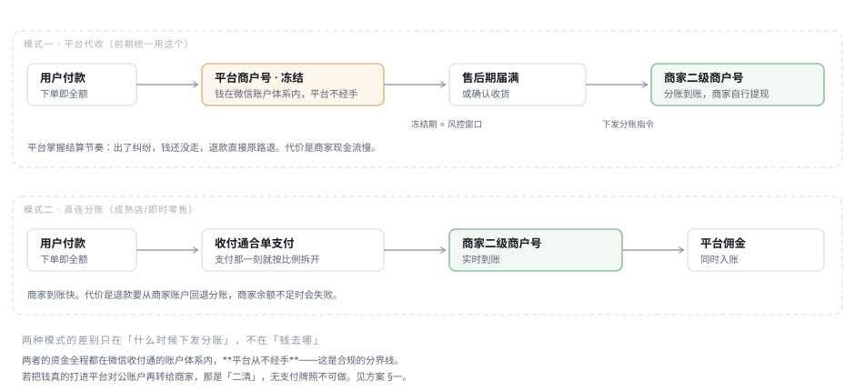

# 结算模式：平台代收 与 直连分账（双模，门店维度）

> 2026-08-11 · **设计方案，待 review**。
> ⚠️ 2026-08-12：[ADR-017](../ADR/ADR-017-资金归集与结算方式.md) 落定了「谁能走哪条路径」——
> 按**商户类型**判定（自然人商户禁走归集路径），并把归集路径明确为**代销**。
> 本文的资金路径与二清红线（§一）继续有效，**谁能用**以 ADR-017 为准。上游：[三层对齐](./三层对齐-功能点与API与数据库.md) §3.2 的悬而未决项。
> 相关：`V14__settle_store_account.sql`（三维度拆分，已实现）· [ADR-002 分账](../ADR) · [支付能力矩阵](../reference/支付能力矩阵-完整方案.md)
>
> **一句话**：两种模式的差别只在**什么时候下发分账**，不在**钱去哪**。
> 认清这一点，整套设计就从「两条资金链路」缩成「一个时机开关 + 一个冻结期」。



---

## 一、先划一条红线：模式一必须是「延迟分账」，不能是「归集到平台账户」

「资金统一进平台再结算」这句话有两种实现，**一种合规，一种不能做**：

| 实现 | 资金实际在哪 | 结论 |
|---|---|---|
| **A. 平台商户号收款 + 延迟分账** | 全程在微信收付通的账户体系内，平台只下发指令 | ✅ **这是本方案采用的** |
| B. 打进平台对公账户，再由平台转账给商家 | 平台真实持有商户资金 | ❌ **「二清」，无支付牌照不可做** |

B 是无证经营支付业务。后果不是「合规风险」这种抽象说法——**微信/银行侧一旦识别，直接停商户号**，整个平台的收款能力当场归零，比任何功能缺失都严重。

好在你要的东西 A 全都能给：

- **平台掌握结算节奏** —— 冻结期由平台定，不到期不分账
- **出纠纷时钱还没走** —— 退款原路退，不用找商家追回
- **平台先看到全额** —— 对账、佣金计算都在平台侧完成

A 与 B 唯一的区别是**钱始终在持牌机构的账户里**。这个区别对产品体验没有影响，对合规是生死线。

> 本文后续所有「平台代收」都指 A。**如果产品实际想做的是 B，本方案不成立**，
> 需要先解决牌照或找持牌机构合作，那是另一件事。

---

## 一之二、阶段零：没有 EDI 的自营期（**当前阶段**）

没有 EDI 就开不了「第三方商家入驻」类目，平台只能**按自营运营**。
这不是把双模方案打折，而是**换了一种法律关系**——搞混了会得出完全错误的结论。

### 关键区分：自营采购**不是**二清

| | 平台代收（§一 的 B） | **自营采购（当前阶段）** |
|---|---|---|
| 谁是交易主体 | 商家。平台只是代收 | **平台自己**。用户买的是平台的货 |
| 钱的性质 | **别人的钱**过平台的手 | **平台自己的收入** |
| 付给供货方 | 「结算商户货款」 | **采购付款**（对公转账 + 合同 + 发票） |
| 合规 | ❌ 二清，需牌照 | ✅ **正常 B2B 结算，不需要任何牌照** |

**平台卖自己的货、收自己的钱、再向供应商采购付款——这是任何一家零售企业每天在做的事。**
它之所以合规，正因为平台是交易主体，而不是资金通道。

所以「前期没有 EDI」这个约束，**反而绕开了 §一 的红线**：
自营期根本不存在「代收商户资金」这件事，也就无所谓二清。

### 资金链路

```
用户付款 ──► 平台商户号（平台自己的收款账户，全额）
                    │
                    ├─ 这笔钱就是平台的营业收入，平台给用户开票
                    │
                    ▼
              供应商（原「商家」）
              ── 采购付款：财务按账期对公转账
              ── 供应商给平台开采购发票
```

**「无法直接打款给商家」是对的，而且不该做**：自营期系统里的打款是**财务动作**，
走公司对公账户，由财务在网银执行。系统的职责到「生成应付账款单 + 对账 + 登记已付」为止，
**不去碰真实的资金划转**。

想让系统自动打款，等于让业务系统去动公司账户——那是财务内控问题，
不是技术能力问题。任何一家公司的财务都不会同意。

### 这一期用不上的东西

以下已建的能力在自营期**全部闲置**，不是白建（EDI 下来就要用），但现在不该继续投入：

| 能力 | 为什么闲置 |
|---|---|
| 收付通进件（`mch_payment_merchant`） | 没有二级商户——所有钱进平台一个号 |
| 分账（`stl_split_log`、`SplitGateway`） | 没有可分的对象 |
| 提现 / 提前放款 | 供应商拿的是采购款，走账期不走提现 |

### 这一期真正需要的

`stl_bill` **一张表就够**，只是语义变了：

| 字段 | 平台期语义 | **自营期语义** |
|---|---|---|
| `entity_no` | 商家主体 | 供应商 |
| `gross_minor` | 结算基数 | 采购金额（= 售价 − 平台毛利） |
| `commission_minor` | 平台佣金 | 平台毛利（记账口径不同，数值逻辑一样） |
| `status` | 分账状态 | **应付账款状态**：待对账 → 已确认 → 已付款 |

要补的只有：**账期**（供应商结算周期）与**付款登记**（谁在什么时候付的、凭证号）。
一张表 + 两三个字段，不是一套新系统。

### 对 C 端与 B 端的连带影响（容易漏）

自营期**销售主体是平台**，这有几个必须落到界面上的后果：

- **商品详情页的销售方**：法律上是平台，不是「XX 店」。展示上仍可显示店铺，
  但销售方与开票方必须是平台——写错了是**虚假宣传**
- **售后责任主体**：用户找的是平台，不能引导到「联系商家」
- **发票**：平台给用户开全额发票；供应商给平台开采购票。
  与平台期（商家给用户开票、平台只开服务费票）**完全相反**

> 这三条不改，等于用平台模式的界面跑自营模式的法律关系。
> 前面写的 `/ops/finance/invoices` 那三条端点，在自营期的含义也随之改变。

### 迁移：EDI 下来之后

自营 → 平台不是开关，是**两套法律关系的切换**，至少要处理：

1. 与每个供应商重签合同（采购 → 入驻）
2. 逐个进件拿二级商户号
3. 存量 `stl_bill` **保持自营语义不动**，新单按平台语义生成
   —— 与 §3.2 的快照原则同一个道理，历史账不能跟着改口径
4. 界面上的销售方、开票方、售后责任主体同步切换

**第 3 条是这里最容易出错的地方**：切换那天如果把历史应付账款也当成待分账处理，
会向没有二级商户号的供应商下发分账，全部失败且脏数据难清。

---

## 二、两种模式（EDI 之后）

| | 模式一 · 平台代收 | 模式二 · 直连分账 |
|---|---|---|
| 分账时机 | 售后期届满 / 确认收货后 | 支付那一刻 |
| 商家到账 | 慢（冻结期 + 结算周期） | 快（实时） |
| 退款 | **原路退，钱还在平台户上** | 需从商家账户回退分账，**余额不足会失败** |
| 平台风险 | 低 | 高（钱已走，出事要追回） |
| 商家现金流 | 差 | 好 |
| 适合 | 新店、低信用、预售/定制、大额 | 成熟店、高信用、即时零售、小额高频 |

**本质：模式一是拿商家的现金流换平台的风险控制。** 这不是技术选择，是商业条款——
所以它要能按门店谈、按门店配，而不是全局一个开关。

### 2.1 前期统一用模式一

> **注意阶段**：§一之二说明了当前是**自营期**，两种模式都还用不上。
> 本节说的「前期」指 EDI 拿到、开放商家入驻之后的前期。

理由成立：平台早期没有商家信用数据，退款纠纷的兜底能力也弱。
**但要同时准备好模式二**，否则第一家成熟商家提出「凭什么押我的钱」时无法应对——
届时临时改架构比现在多写一个字段贵得多。

### 2.2 什么时候放开模式二

契约里写「根据平台成熟度、门店规模、门店类型」，落到可判定的规则：

| 维度 | 建议阈值（待产品定） | 为什么是它 |
|---|---|---|
| 门店信用 | 无 `BREACH` 违规、评分 ≥ 4.5 | 已有 `mch_violation.breach_count` 与评分，不用新建数据 |
| 经营时长 | ≥ 3 个月且完成 ≥ N 单 | 太短看不出退款率 |
| 退款率 | 近 90 天 < 阈值 | **最直接的信号**——模式二的风险就是退款追不回 |
| 品类 | 即时零售/餐饮优先；预售、定制、大额延后 | 前者履约即时、纠纷少；后者天然要押款 |

**不要做成自动升级。** 自动切模式意味着系统在没人确认的情况下改变了资金路径，
出问题时没人知道是谁决定的。做成「系统给建议 + 运营点确认」。

---

## 三、数据模型

### 3.1 一个字段，不是一套新表

**关键结论：模式一不需要商家余额表，也不需要提现单表。**

因为钱在微信侧、平台不记账，所谓「结算」就是**下发分账指令**，
所谓「到账」就是分账成功。已有的 `stl_bill` + `stl_split_log` 完整覆盖，
差的只是「这单什么时候可以分」。

| 改动 | 说明 |
|---|---|
| `mch_store.settle_mode` | `PLATFORM_HOLD` / `DIRECT_SPLIT`，默认 `PLATFORM_HOLD` |
| `mch_store.freeze_days` | 冻结天数，空 = 用平台默认。模式二无意义 |
| `stl_bill.settle_mode` | **快照**，理由见 §3.2 |
| `stl_bill.splittable_at` | 可分账时间 = 支付时间 + 冻结期。模式二为支付时间 |

四个字段，零新表。

### 3.2 为什么 `settle_mode` 要快照进 `stl_bill`

与 `V14` 给 `pay_merchant_no` 快照的理由完全一致，且后果更重：

商家的模式随时可能被调整。若打款时才去查「这家店现在是什么模式」，
**改一次模式会把还没分账的历史流水一起改掉**——本该冻结 7 天的单，
因为门店昨天切了模式二而立即分账，风控窗口凭空消失。

退款方向更糟：模式一的单退款走原路（平台户），模式二的单退款要回退分账。
**用错方向的结果是钱从错误的账户出，两边各错一笔且方向相反。**

### 3.3 与 V14 的关系：两个正交的轴，不矛盾

`V14` 的注释写着「存一个 settleMode 枚举反而会与 pay_merchant_no 打架」。
**那句话说的是另一件事，不要混淆**：

| 轴 | 回答什么 | 载体 |
|---|---|---|
| V14 那个轴 | 钱打给**哪个账户**（分开结算 / 合并结算） | `pay_merchant_no`（配置的结果，不要开关） |
| 本方案的轴 | **什么时候**打（立即 / 冻结后） | `settle_mode`（是开关，因为它是商业条款） |

两者正交：一家店可以是「独立收款号 + 平台代收」，也可以是「共用收款号 + 直连分账」。
V14 反对的是用开关去表达「哪个账户」，因为那已经由配置决定了；
而「什么时候分账」没有任何配置能推导出来，**它必须是个显式的字段**。

---

## 四、状态与流程

### 4.1 结算单状态

```
PENDING ──(splittable_at 到期)──► SPLITTABLE ──(下发成功)──► SPLIT
   │                                   │
   └──(订单退款)──► CANCELLED           └──(下发失败)──► FAILED ──(重试)──► SPLITTABLE
```

模式二的单创建时直接是 `SPLITTABLE`（`splittable_at` = 支付时间），
走同一条链路——**不为模式二另开一套流程**。

### 4.2 谁来推进

`worker` 部署（S8 已就绪）扫 `splittable_at <= now && status = PENDING` 的单，
批量下发分账。**不放在 api 部署**：批量任务与下单接口抢连接池时，
结算跑一轮能把下单拖到超时（S8 的注释已写明）。

### 4.3 退款怎么走

| 模式 | 单据状态 | 退款路径 |
|---|---|---|
| 一 | 未分账 | **原路退**，平台户直接退给用户，结算单置 `CANCELLED` |
| 一 | 已分账 | 回退分账（同模式二） |
| 二 | 任何时候 | 回退分账。**商家余额不足会失败**，需要人工介入队列 |

「商家余额不足导致回退失败」是模式二最现实的运营负担。
契约里的 `/ops/refund-split-backs`（待回退分账队列）就是为它准备的——
但目前 `refundSplitPending` 这个标记**全仓库不存在**，队列无从产生。

---

## 五、接口影响

对[三层对齐](./三层对齐-功能点与API与数据库.md) §3.2 那 20 条 finance 端点的重新判定：

| 端点 | 判定 |
|---|---|
| `/ops/settlements`、`/ops/split-records`、`/ops/fee-rule` | ✅ 表已齐，可做 |
| `/ops/settlements/{no}/split`、`/freeze-back` | 🟡 表齐，但**分账网关是桩**（`StubSplitGateway`），真接通前做出来只是调一个打日志的假网关 |
| `/ops/refund-split-backs` ×2 | 🟡 缺 `refundSplitPending` 标记 |
| `/ops/payments/recon-diffs` ×3 | 🟡 **缺对账差异表** |
| `/ops/finance/invoices` ×3 | 🟡 缺发票申请表。**且待定：平台是否给商家开服务费发票**（见 §七） |
| `/ops/finance/withdrawals`、`/decide` | ❓ **重新判定**：见下 |

### 提现审批：本方案下它有了意义，但语义变了

上一轮我判定「平台不持有资金，提现审批不适用」。**双模之后这句话要修正**：

模式一下，「提现」= **商家申请提前分账**（不等冻结期满）。这是有业务意义的：
商家急用钱、或平台判断这单风险已解除，可以提前放款。

所以这两条端点保留，但语义是「提前放款申请与审批」，不是「从平台账户提现」。
**命名建议改成 `early-release`**——叫 `withdrawal` 会让人以为平台账上有余额，
而那正是 §一 要避免的误解。

---

## 六、落地顺序

### 阶段零（当前 · 自营期，不依赖 EDI 与收付通）

| 序 | 内容 |
|---|---|
| 0.1 | `stl_bill` 补账期与付款登记字段；状态机改「待对账 → 已确认 → 已付款」 |
| 0.2 | 供应商结算单列表与对账（运营端只读 + 登记已付） |
| 0.3 | C 端/B 端的销售方、开票方、售后责任主体按自营口径改 |

**0.3 是三条里最容易被跳过、也最不该跳过的**——它是法律口径，不是文案。

### 阶段一及以后（EDI 与收付通就绪后）

| 序 | 内容 | 依赖 |
|---|---|---|
| 1 | 四个字段 + `stl_bill` 状态机 + worker 扫描下发 | 无 |
| 2 | 三条只读端点（结算单/分账记录/费率卡） | 1 |
| 3 | 门店模式配置界面（B 端只读展示，运营端可改） | 1 |
| 4 | 接真分账通道，替换 `StubSplitGateway` | 收付通开通 |
| 5 | 退款回退队列（含 `refundSplitPending` 标记） | 4 |
| 6 | 提前放款申请与审批 | 4 |
| 7 | 对账差异表与处置 | 4 |

**1–3 现在就能做，且不依赖通道**。4 之后的都要等收付通真开通——
在桩网关上验证资金逻辑是自欺欺人。

---

## 七、待 review 的判断

以下五条是我做的判断，**都可能是错的，请逐条确认**：

| # | 判断 | 若判断错了会怎样 |
|---|---|---|
| 1 | 模式一 = 延迟分账（钱在微信侧），**不是**归集到平台对公账户 | 若真要归集，整个方案作废，先解决牌照 |
| 2 | 不建商家余额表与提现单表 | 若将来要做平台账户体系，这两张表要补，改动不小 |
| 3 | `settle_mode` 与 V14 的 `pay_merchant_no` 是正交两轴 | 若认为该合并，会退回 V14 明确反对过的「开关与配置打架」 |
| 4 | 模式切换只影响新单，在途按快照走完 | 若要「切了就全部立即生效」，风控窗口会被凭空取消 |
| 5 | 不做自动升级，只做「系统建议 + 人工确认」 | 若要自动，需补一套决策留痕，否则出事无人负责 |
| 6 | **自营期不是二清**，因为平台是交易主体 | 若法务判定不同，自营这条路也要重走 |
| 7 | 自营期系统**不碰真实划转**，只到「生成应付 + 登记已付」 | 若要系统自动打款，那是财务内控问题，需财务先同意 |

另有两个**产品问题**，不是技术能定的：

- **平台是否给商家开服务费发票？** 决定发票那三条端点与发票申请表要不要建
- **冻结期定多久？** 建议与售后期挂钩（售后期 + N 天），而不是拍一个固定值——
  两者不一致时，会出现「还能退货但钱已经分走了」的窗口
