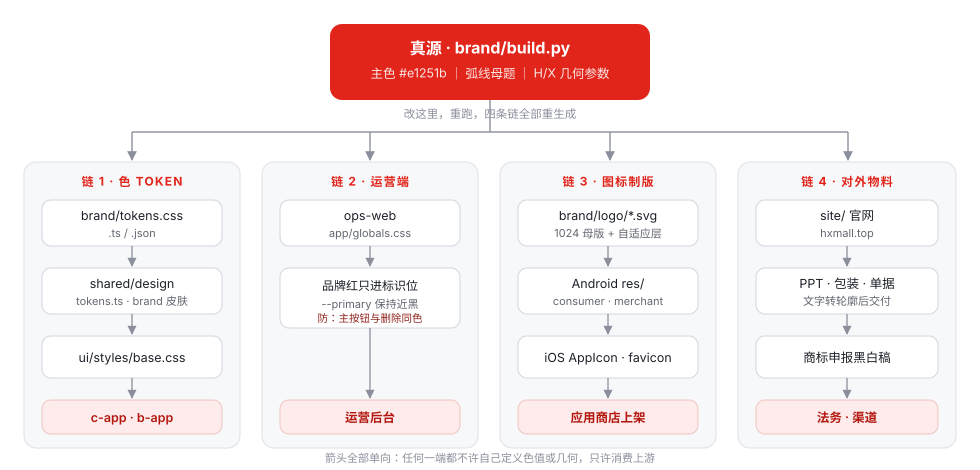

# 视觉设计方案（全项目）· 虹选 · 好物 / HX MALL

品牌归属：**深圳市虹选科技有限公司**（母品牌 虹选科技 hxtech.top · 子业务 HX MALL hxmall.top）

状态：**已定方向，待执行（2026-08-19）**
上游素材：`/Users/robin/project/hxmall`（官网离线全站 HTML · 两份 PPT · 21 个 SVG 标识文件）
取代：[品牌工程与官网方案.md](./品牌工程与官网方案.md) 的 §3 品牌色 与 §4.2 Logo 图形（其余章节仍有效）
关联：[brand/README.md](../../../brand/README.md) · [tokens.ts](../../../packages/shared/src/design/tokens.ts) · [ops-web/app/globals.css](../../../ops-web/app/globals.css) · [TDD-hxmall-site.md](../TDD-hxmall-site.md)
可视化规范页：[brand/spec.html](../../../brand/spec.html)（浏览器直接打开，色卡与标识为实时渲染，不是截图）

---

## 一、一句话

**全项目只有一个视觉真源：`brand/build.py` 里的一组参数**——
主色 `#e1251b`、一道弧线（取「虹」）、一套自绘 H/X 几何字形。
色、形、各端图标、官网、物料全部从它派生；任何一端都不许自己定义色值或几何。

---

## 二、为什么是这个方案

### 2.1 现状：同一家公司有四套并存的视觉体系

盘点的结果比预想严重——不是「缺资产」，是**资产互相打架**：

| # | 体系 | 主色 | 造型 | 落在哪 | 谁在维护 |
|---|---|---|---|---|---|
| 1 | hxmall 标识体系（2026-08-19） | `#e1251b` 红 | 弧线母题 + 自绘 H/X | 官网全站、两份 PPT、21 个 SVG、商标申报稿 | 独立目录，未入仓 |
| 2 | `brand/` 生成管线 | `#BF4D1C` 虹橙 | G4 高横 H | **已落全端**：Android/iOS/H5/ops-web 图标 | `brand/build.py` |
| 3 | 品牌工程与官网方案（2026-08-13） | `#FF5A1F` → `#7A4CE0` 渐变 | 小写 `hx` 连字，h 肩为虹 | 只有文档，无产物 | 文档 |
| 4 | 产品皮肤体系 | `#00B578` 微信绿（默认皮肤 `fresh`） | 无标识 | c-app / b-app 界面 | `shared/design/tokens.ts` |

四套里，**三套主色互不相同，两套造型互不相同**。用户打开 App 看到绿，看到图标是橙，
点进官网是红——这不是「风格不统一」，是三个品牌。

### 2.2 为什么选 hxmall 红这一套

不是因为它新，是因为**只有它是一套体系**：

| 判据 | 体系 1（红） | 体系 2（橙） | 体系 3（渐变） |
|---|---|---|---|
| 有方法论（改一条参数改整个体系） | ✅ 六条规则 + 完整参数表 | ✅ 但只覆盖图标 | ❌ 只有描述 |
| 有中文字标 | ✅ 虹选 / 虹选 · 好物 / 虹选｜好物 | ❌ | ❌ |
| 有母子品牌关系 | ✅ 虹选科技 ｜ HX MALL | ❌ | ❌ |
| 有商标申报单元与黑白稿 | ✅ 五个申报单元 | ❌ | ❌ |
| 有对外落地物 | ✅ 官网全站 + 介绍 PPT | ❌ | ❌ |
| 已落进产物 | ❌ | ✅ 全端图标 | ❌ |

体系 2 唯一的优势是「已经落了」，而这恰恰是**最便宜的一项**——`brand/build.py` 本来就是
参数化生成器，改顶部几个常量重跑一遍，全端产物自己就换了。用一次重跑换一套完整品牌，值。

> **被否掉的选项**：分层并存（母品牌用红、App 图标沿用橙）。
> 否掉的理由不是不好看，是**维护不住**：一旦两个主色都「合法」，后面每加一个界面、每印一版物料，
> 都要有人判断这里该用哪个——判断会漂移，半年后就回到 §2.1 的状态。

### 2.3 为什么产品界面也要收进品牌色

现默认皮肤是微信绿 `fresh`，代码里标了 `brandLocked`，理由是「与微信生态观感一致」。
这条理由在**小程序**里成立，在 **App 与 H5** 里不成立——App 是独立入口，用户不会因为它是绿的
就觉得它更可信，只会觉得它和图标、和官网不是一家。

所以：**新增 `brand` 皮肤并设为默认，`fresh` 保留在皮肤列表里**。
换肤能力（8 套皮肤 × 明暗）一个不动——它是产品既有能力，也是「虹」这个名字的由来。

---

## 三、结构



图上看不出的三件事：

1. **箭头全是单向的。** `c-app` 不许写死颜色（`design-tokens.test.ts` 已在拦），
   `ops-web` 不许把品牌红塞进 `--primary`（原因见 §4.5），官网不许自己调一个「差不多的红」。
2. **链 1 与链 2 是两套 token，不是一套。** 移动端是「皮肤 × 明暗」模型，运营端是
   「Radix 12 阶 + 语义色」模型。强行合并会两边都别扭——它们服务的信息密度差一个数量级。
   共享的只有**品牌色的定义值**，不共享 token 结构。
3. **链 3 的产物不入手改。** `brand/README.md` 已有这条铁律，本方案不放宽。

---

## 四、详细设计

### 4.1 色

主色一个，中性色四个，深色模式各配一档。**每个色值后面的数字是实测对比度，不是估的。**

#### 品牌层（`brand/tokens.css` / `.ts` / `.json`，由 `build.py` 生成）

| Token | 值 | 用途 | 实测对比度 |
|---|---|---|---|
| `--hx-red` | `#e1251b` | 主色：标识、主按钮底、强调 | 压白字 **4.69** ✓ AA |
| `--hx-red-deep` | `#b31710` | 浅底上的红色**文字**、hover 态 | 压白 **6.89** · 压面板 `#f5f6f8` **6.37** ✓ |
| `--hx-red-bright` | `#ff5a4d` | **深色模式**主色 | 压深底 `#161a22` **5.66** ✓ |
| `--hx-ink` | `#17181a` | 正文、深底、单色稿 | 压白 **17.77** |
| `--hx-muted` | `#63676e` | 副行、说明、Slogan | 压白 **5.68** ✓ |
| `--hx-panel` | `#f5f6f8` | 区块底色 | — |
| `--hx-line` | `#e5e7ea` | 分隔线 | — |
| `--hx-tint` | `#fdeceb` | 主色浅底（标签、选中态） | 配 `#b31710` 文字 **6.03** ✓ |

印刷参考：主色 **C0 M91 Y92 K0**。正式打样前以实际纸张打样为准，不拿屏幕值直接开机。

#### 三条不可互换的分工（**防住什么**写在最后一列）

| 规则 | 说明 | 不这么做会怎样 |
|---|---|---|
| 灰底上的红字用 `#b31710`，不用 `#e1251b` | `#e1251b` 压 `#f5f6f8` 只有 **4.33**，差 0.17 不到 AA | 面板里的红色小字过不了无障碍，且这类文字最多（金额、状态、链接） |
| 深色模式主色用 `#ff5a4d`，不用 `#e1251b` | `#e1251b` 压 `#161a22` 只有 **3.72** | 深色下主按钮糊进背景 |
| `#ff5a4d` 上的字用**墨** `#17181a`，不用白 | 白字压它只有 **3.08**，墨字 **5.77** | 深色模式主按钮上的字不可读——这正是 `fresh` 皮肤早就踩过并修过的坑 |

#### 产品皮肤层（`packages/shared/src/design/tokens.ts`）

新增一套皮肤，**不动其余八套**：

```ts
brand: {
  group: "pure", tone: "pure", brandLocked: true,
  light: "#e1251b", dark: "#ff5a4d",
  ink: { light: "#17181a", dark: "#f3f4f6" },
},
```

- `SKINS` 数组把 `brand` 排到**第一位**——`design-tokens.test.ts` 断言原生 tabBar 的
  `selectedColor` 等于 `SKINS[0].color`，顺序即默认。
- `DEFAULT_SKIN = "brand"`。
- `--sh-on-primary` **不手填**：生成器按对比度自动在白/墨之间选。浅色档会选白（4.69），
  深色档会选墨（5.77），正是 §4.1 第三条要的结果。
- 落地命令：改 `tokens.ts` → `npm run gen:skins` → `npm test`。
  `base.css` 是生成物，**不手改**（手改会被 `gen-skins.mjs` 覆盖，且规范测试会红）。

#### 危险色冲突（这条必须处理）

主色是红，`--sh-danger` 也是红（`#f04438`）。两个红并排出现时，用户分不清
「确认下单」和「删除订单」——**这是本方案唯一真正的产品风险**。

处理方式（`brand` 皮肤下生效）：

| 场景 | 规则 |
|---|---|
| 危险操作 | **不用红色实心按钮**，改「描边/幽灵按钮 + 墨字 + 明确动词文案」 |
| 危险状态标签 | 保留红色，但必须**配图标**（`sh-icon` 的 warning 系），不靠颜色单独表意 |
| 二次确认弹窗 | 主按钮（确认删除）用 `--sh-danger` 实心，此时页面上不会同时出现主色按钮 |

> 依据：颜色不能是唯一的信息载体（WCAG 1.4.1）。这条在红色主色的产品里从「建议」变成「必须」。

### 4.2 形：六条规则管住全部形态

改任何一条，改的是整个体系——这是这套标识区别于「随便一个 H」的地方。

| 维度 | 规则 |
|---|---|
| 母题 Motif | **一道弧线** = 虹。半圆弧，圆心角 180°，描边宽 = 字形笔画宽，固定在字符正上方 |
| 字形 Letterform | H 与 X **同源自绘**：笔画等宽（0.267 × 字高）、直角切口。X 按 H 的参数反推。中文用思源黑体 Bold，不重绘 |
| 容器 Container | 透明 → 圆章 → 圆角方章（圆角 **0.275 × 边长**）→ 镂空。字形与弧线参数**不随容器变化** |
| 层级 Hierarchy | 单字符 → 双字符 → 词标 → 全称 → 母品牌。场合越小，层级越低 |
| 分隔符 Separator | `·` 表并列，`｜` 表分组。域名全小写 |
| 颜色 Color | 主色 / 墨 / 反白 / 主色描边，四种。**不用渐变，不用灰** |

#### 构建参数表（可复现，任何尺寸都由它推）

| 参数 | 数值 | 说明 |
|---|---|---|
| 方章圆角 | 0.275 × 边长 | 96px 章 = 26.4px；App 图标另按平台遮罩 |
| 弧线宽（HX） | 0.50 × 边长 | 描边 0.05 × 边长，与字形笔画同宽 |
| 弧线宽（虹） | 0.40 × 边长 | 单字符较宽，弧线相应收窄 |
| 弧线宽（虹选字标） | 1.00 × 字高 | 等于「虹」字宽，左端与「虹」左边缘对齐 |
| 字形笔画宽 | 0.267 × 字高 | H、X 通用，直角切口 |
| H 字高（章内） | 0.64 × 边长 | 圆章与方章一致 |
| HX 字高（章内） | 0.26 × 边长 | 弧线下方留 0.04 × 边长间距 |
| 安全区 | 0.25 × 边长 | 四周留白，任何元素不得侵入 |
| 中文字距 | 0.10 em | 英文副行 0.30 em |

> **弧线只压在「虹」上**，不覆盖整个词。它是「虹」的字义符号，不是装饰——
> 加了「好物」之后弧线**不变宽**。这条最容易被排版的人改错。

### 4.3 字标与命名

| 场合 | 写法 |
|---|---|
| 标准字标 | **虹选 · 好物**（英文副行 `HX MALL`，字距 .30em） |
| 密排横向 | **虹选｜好物** |
| 极窄（图标下、tab、通知标题） | **虹选** |
| App 桌面显示名 `app_name` / `appName` | **虹选好物**（连写，无间隔号） |
| 商标 / 软著 / ICP 备案 / App 备案 | **虹选好物**（连写。加标点等于注册了另一个东西） |
| 应用商店英文名 | `HX Mall` ｜ Logo 英文副行 `HX MALL` ｜ 域名与代码 `hxmall` |
| 母品牌 | **虹选科技** / `HX TECH`（hxtech.top）；联名署名 **虹选科技｜HX MALL** |
| 法律署名 | **深圳市虹选科技有限公司**（官网页脚、隐私政策、用户协议、App 关于页、开发者名称、发票合同） |

**空间紧张时舍「好物」保「虹选」，反过来不行**——「虹选」是公司字号，是真正的品牌资产；
「好物」是品类描述。英文不出现 `HXMall` / `Hx Mall` / `HX-Mall`：变体流出去会稀释商标检索与商店搜索。

包名 `ai.neargo.shop.*` **不改**（改包名 = 老用户视为全新 App，数据全丢、评分清零；包名是技术标识，用户看不见）。

### 4.4 字体

| 位置 | 字体 | 说明 |
|---|---|---|
| 中文标识与标题 | 思源黑体 Bold（SIL OFL，可商用） | 交印刷厂 / 商标申报前**转轮廓** |
| 中文正文 | 思源黑体 Regular / Medium | 官网需子集化（全量 3–8MB，是移动端性能头号杀手） |
| 拉丁 | Figtree | 界面与英文副行 |
| 官网展示大字 | Instrument Serif | **仅官网**，不进产品界面与标识 |
| 标识内 HX | 自绘路径 | 不依赖字体，任何环境不变形 |

### 4.5 各端落点

#### C 端 / B 端 App（c-app · b-app）

| 项 | 规则 |
|---|---|
| 界面主色 | `brand` 皮肤（§4.1），默认；用户仍可切其余八套 |
| 图标 · C 端 | 满幅**主色红**底 + 白 HX + 白弧线（白压红 4.69 ✓） |
| 图标 · B 端 | 深板岩 `#242b33` 底 + 白 HX + **亮红 `#ff5a4d`** 弧线（4.65 ✓） |
| 启动图 | 主色红满幅 + 反白 HX 方章 + 字标「虹选 · 好物」 |
| 通知 / 状态栏 | **去弧线，仅 H 单字符**——保证 16px 可辨 |

> B 端底板为什么不用主色红：`#e1251b` 压 `#242b33` 只有 **3.05**，而且两端图标同色会在
> 桌面上分不清。也不用近黑——黑壁纸上图标没有边界，等于在桌面上消失（`brand/README.md` 原有结论，保留）。

#### 运营端（ops-web）

**品牌红不进 `--primary`。** `--primary` 保持近黑 `#18181b`（现状不动）。

理由：运营端的 `--destructive` 是 `#d92d20`，与品牌红 `#e1251b` 肉眼几乎同色。
密集表格里主按钮和删除按钮同色，是会真出事故的——这不是审美问题。

品牌红在运营端只出现在三处：左上角标识、登录页、页脚署名。

#### 官网（site/ · hxmall.top）

- token 直接照抄 §4.1，`--brand:#e1251b` / `--brand-700:#b31710` / `--tint:#fdeceb` / `--deep:#17181a`
- 版式沿用 hxmall 离线站：`--r:14px` 圆角、`--edge:clamp(20px,5vw,64px)` 边距、`max-width:1160px`
- 展示大字用 Instrument Serif，正文 Figtree + 思源黑体
- 站点已有的**主题切换器**（blue / cyan / violet / lime）在正式站**去掉**——它是选色阶段的对照工具，
  留在线上等于告诉访客「我们的主色还没定」

#### 制版规格（App / 小程序 / favicon）

| 用途 | 尺寸 | 做法 |
|---|---|---|
| App Store / Play | 1024 × 1024 | 满幅底 + HX，**不自带圆角、不留白边、不透明**（iOS 带 alpha 直接拒） |
| iOS 桌面 | 180 / 120 | 由 1024 母版导出，圆角交系统遮罩 |
| Android 自适应 | 432 前景 / 背景 | 前景放 HX（占 66%），背景层纯色。H 四角距中心须 < 33，否则圆形遮罩削角 |
| 小程序方形 | 144 × 144 | 满幅底 + HX，微信端自动裁圆 |
| 小程序中文版 | 144 × 144 | 「虹」方章，弧线收窄至 0.40 × 边长 |
| 通知 / 状态栏 | 76 / 48 | 去弧线，仅 H |
| favicon | 48 / 32 / 16 | H 圆章；16px 用纯色 H，**无弧线** |

**最小尺寸**：方章 28px · H 圆章 16px · 字标字高 20px。字标小于 20px 时改用「虹」方章或圆章。

### 4.6 Slogan

Slogan **不是标识的一部分**，只做锁定组合：字标下方居左，间距 0.34 × 字高，字重 Medium，取次要灰 `#63676e`，最小 14px。**不进商标申报稿**，不加引号，不与英文副行互换位置。

| 候选 | 评价 |
|---|---|
| **好物在身边** | **推荐**（定位已定为社区 LBS 后回到这一句）。五个字，直说 LBS 内核，与「好物」呼应，能刻进 logo 锁定组合 |
| ~~好货，稳定到手~~ | 作废——它承接的是「自营选品 + 供应链」叙事，与已定的社区 LBS 定位不符 |
| ~~现货充足，次日发出~~ | 作废，同上 |

> 广告语（传播语，一季一换，不进锁定组合）：**楼下的好东西，都在虹选。** 已用在官网首页设计稿首屏。

### 4.7 商标申报

按「图形」「中文文字」「组合」三类分别申报，避免单一注册被局限：

| 申报单元 | 类型 | 形态 | 用途 |
|---|---|---|---|
| HX 方章 | 图形 + 文字 | 圆角方章，弧线在上，HX 在下 | App / 小程序图标、官网、海外物料 |
| 虹选 | 中文文字 | 弧线在「虹」上方，字标横向 | 国内渠道、包装、单据、门店 |
| 虹选 · 好物 | 中文文字 | 全称字标 | 对外全称、印刷物、开屏 |
| H 圆章 | 图形 | 实心圆内几何 H | 头像、favicon、封口贴 |
| 虹选科技 / HX TECH | 组合 | 同参数，字标与域名不同 | 母品牌署名、合同、资质 |

申报稿要求：**纯黑实心、白底、无渐变、无阴影、无描边**，边界清晰；彩色稿另附主色版本；
Slogan 与英文副行不进申报稿；文字**转轮廓**；提交 JPG 边长 ≥ 400px；
建议至少 **35 类**（零售批发）与 **9 类**（App 软件），近似检索建议委托代理机构。

### 4.8 禁止事项

| # | 禁止 | 具体 |
|---|---|---|
| 1 | 不动几何 | 不拉伸、不倾斜、不改圆角比例、不换弧线形状或角度 |
| 2 | 不加效果 | 不加渐变、阴影、外发光、描边、立体、纹理 |
| 3 | 不改结构 | 弧线不脱离「虹」或 HX 单独使用，不移到字标右侧或下方 |
| 4 | 不改配色 | 底色只用主色 / 墨 / 反白；不用灰底红字；不在照片上直接放标识 |
| 5 | 不侵安全区 | 四周 0.25 × 边长内不放任何文字、图形或裁切边 |
| 6 | 不越最小尺寸 | 方章 28px、H 圆章 16px、字标字高 20px |
| 7 | 不在代码里写死色值 | 一律 `var(--sh-*)` / `var(--hx-*)`；`.vue` 的 `<style>` 里出现 hex 会被规范测试拦下 |

---

## 五、落地清单（按依赖排序）

### P0 · 换真源（半天，一次重跑）

| # | 事项 | 文件 | 校验 |
|---|---|---|---|
| 1 | 改品牌参数：色改红、几何换弧线 + H/X 自绘 | `brand/build.py` 顶部常量 + 几何函数 | — |
| 2 | 重跑生成器 | `python3 brand/build.py` | 全端图标产物更新 |
| 3 | 更新品牌说明（色表、几何、两端分工） | `brand/README.md` | — |
| 4 | 把 hxmall 的 21 个 SVG 收进仓库 | `brand/logo/`（**含文字的先转轮廓**） | — |

### P1 · 产品界面收口（1 天）

| # | 事项 | 文件 | 校验 |
|---|---|---|---|
| 5 | 新增 `brand` 皮肤，排到 `SKINS[0]`，`DEFAULT_SKIN = "brand"` | `packages/shared/src/design/tokens.ts` | — |
| 6 | 重生成皮肤 CSS 与两端 `pages.json` 的 tabBar 色 | `npm run gen:skins` | `npm test`（`design-tokens.test.ts`） |
| 7 | 危险色规则落到组件层（§4.1 末） | `packages/ui/src/components/*` | 人工走查删除类操作 |
| 8 | 运营端标识位换红，`--primary` **不动** | `ops-web/app/globals.css` + 左上角标识组件 | `lib/design-tokens.test.ts` |
| 9 | 全端改名（8 处硬编码 + 3 个语言文件），按 §4.3 分场合取写法 | 见 [品牌工程与官网方案.md](./品牌工程与官网方案.md) §7 P1-8 | 搜「社区好物」「邻里商家」无残留 |

### P2 · 对外（1～2 周）

| # | 事项 |
|---|---|
| 10 | 官网 `site/` 落地，token 照 §4.1，去掉主题切换器 |
| 11 | 隐私政策 / 用户协议（**上架强制**，需公网可访问） |
| 12 | 商标申报稿导出（黑白 + 彩色，文字转轮廓，JPG ≥ 400px） |
| 13 | PPT 模板、包装、单据、名片按 §4.2 参数重排 |

---

## 六、取舍记录

| 冲突 | 让了谁 | 为什么 |
|---|---|---|
| 「已落地的橙」vs「成体系的红」 | 让红 | 重跑一次生成器的成本，远小于长期维护两套品牌 |
| 「微信生态一致性」vs「品牌一致性」 | 让品牌 | 该理由在小程序里成立，在 App / H5 里不成立；`fresh` 皮肤保留，用户可切回 |
| 「主色红」vs「危险色红」 | 让危险色的**表现形式** | 主色不改，危险操作改用描边按钮 + 图标 + 文案；颜色不做唯一信息载体 |
| 运营端主色 | 让品牌红 | 密集表格里主按钮与删除同色会出事故；品牌红退到标识位 |
| 移动端与运营端 token 结构 | 谁也不让，只共享色值 | 两端信息密度差一个数量级，强行合并两边都别扭 |
| 「好物在身边」（LBS 叙事） | 悬置 | 与 hxmall 的「自营选品 + 供应链」定位不兼容，等业务定位定了再取 |

---

## 七、待确认

| # | 事项 | 卡住谁 |
|---|---|---|
| ~~1~~ | ~~业务定位~~ → **已定（2026-08-19）：社区 LBS 邻里电商**。hxmall 材料里的「自营选品 + 供应链分销」叙事作废，§4.6 的三个 Slogan 候选随之作废，回到「好物在身边」一系（见 [品牌工程与官网方案.md](./品牌工程与官网方案.md) §5.1）。官网首页设计稿：[site/design/home.html](../../../site/design/home.html) | — |
| 2 | **Slogan 定稿**：「好物在身边」（推荐）/「楼下的好东西，都在虹选」（广告语，已用在设计稿首屏） | 标识锁定组合、官网首屏、印刷物 |
| 3 | 域名策略：`.top` 单域，还是补一个 `.com` 做主域 | 备案、微信 JS-SDK 域名校验、iOS Universal Links |
| 4 | 资质现状：ICP 备案 / 软著 / Apple Developer / App 备案 | 上架排期 |
| 5 | 公司英文法律名（D-U-N-S 登记，会作为开发者名显示在 App Store），建议 `Shenzhen HX Technology Co., Ltd.` | 商店页面上品牌名与开发者名的一致性 |
| 6 | hxmall PPT 里的公司数据（8 品类 / 12,000+ SKU / 48h / 30+ 品牌）是**占位示例**，需替换真实值 | 官网、PPT、招商物料 |

---

## 八、明确不做的事

- **不改包名** `ai.neargo.shop.*`
- **不删其余八套皮肤**——换肤是产品既有能力，也是「虹」这个名字的由来
- **不把品牌红塞进运营端 `--primary`**（§4.5）
- **不手改任何生成物**：`brand/` 下的图标产物、`packages/ui/src/styles/base.css`、`docs/**/*.html`
- **不用渐变做主色**——渐变无法算对比度、无法当按钮底、单色印刷（发票 / 合同 / 刻章）直接死掉
