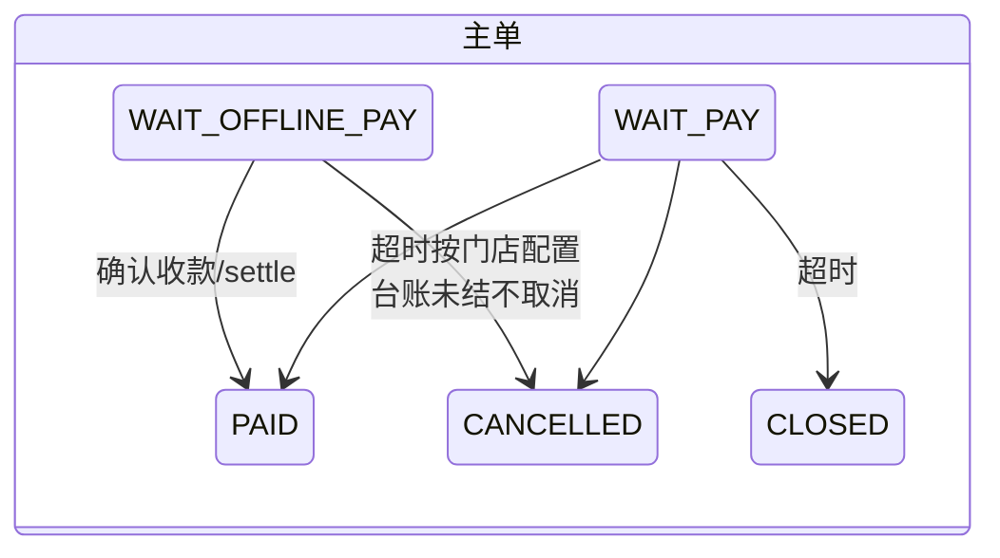
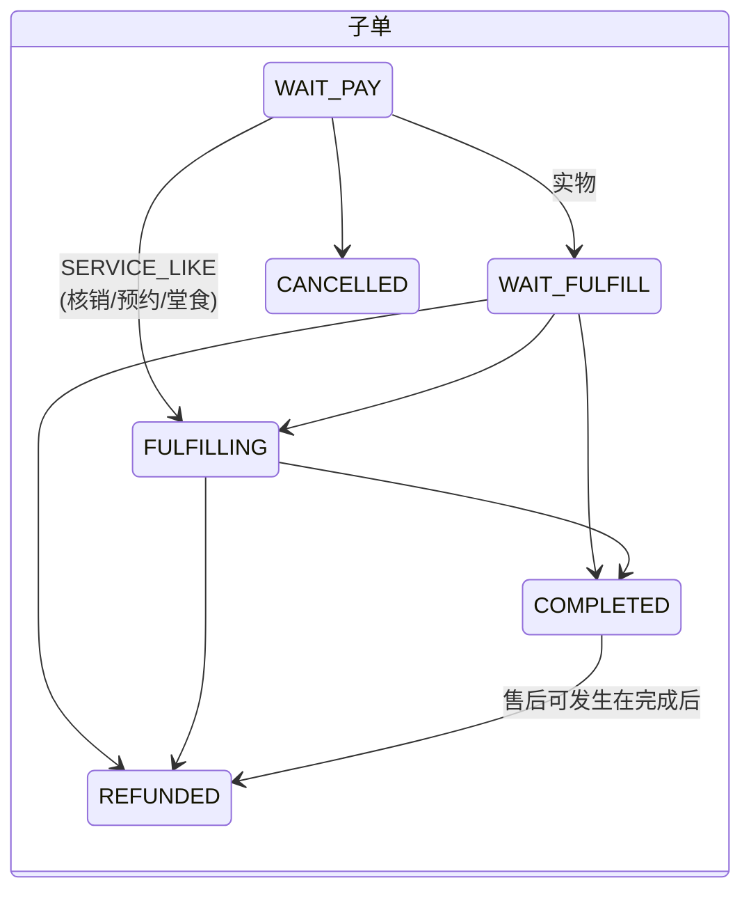
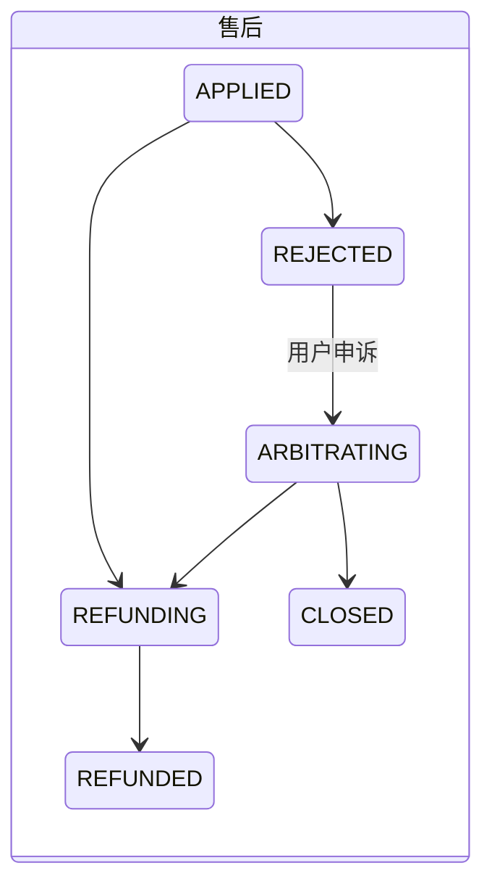

# 订单域 V2.0 · 设计规格书

状态：**草稿 · 待确认** · 创建 2026-08-28
定位：**目标态完整设计规格** —— 全部表的终版结构、状态机、领域对象、Service、API、行业数据对标。
决策依据在 [TDD-订单域-多行业完整方案](./TDD-订单域-多行业完整方案.md)（12 条决策，本册不重复论证）；
与 [商品域V2-设计规格书](./商品域V2-设计规格书.md) 成对 —— 订单行承接商品域的 Modifier / METERED / 售后策略三项裁决。

---

# 一 · 总览

```
主单  ord_order          支付边界：一次付款一张主单（跨商家混合购物车在此聚合）
子单  ord_sub_order      商家×履约边界：按 entity 拆分，结算/履约/售后的宿主
行    ord_item           商品快照 + 行类别 + 计量调整
行明细 ord_item_modifier  选配快照（做法/加料/指定技师）
收款  ord_payment        收款流水（V2 新增，上收自行业）
留痕  ord_status_log     状态迁移日志
售后  ord_after_sale     独立状态机（申请/退款/驳回/仲裁）
```

| 表 | V2 动作 |
|---|---|
| `ord_order` | 沿用（目标态全列见 §2.1） |
| `ord_sub_order` | 加列 `asset_deduct_minor` |
| `ord_item` | 加列 `line_kind` `modifier_total_minor`；`is_gift` 迁入 GIFT 后只读兼容 |
| `ord_item_modifier` | **新建** |
| `ord_payment` | **新建** |
| `ord_status_log` / `ord_after_sale` / `ord_invoice_request` | 沿用（售后增策略分流逻辑，不改表） |

约定同商品域规格书：`id` 物理主键不对外、审计四列 + 乐观锁 + 软删 + `tenant_no` 不再重复；金额一律分。

---

# 二 · 表结构（终版完整 DDL）

## 2.1 主单

```sql
CREATE TABLE ord_order (
  order_no        VARCHAR(32) NOT NULL COMMENT '业务键',
  user_no         VARCHAR(32) NOT NULL,
  community_no    VARCHAR(32) NULL COMMENT '下单时归属社区（平台形态）',
  -- 金额（主单 = 各子单之和，唯一真源在行，此处为聚合快照）
  goods_amount    BIGINT NOT NULL,
  freight_amount  BIGINT NOT NULL DEFAULT 0,
  discount_amount BIGINT NOT NULL DEFAULT 0,
  pay_amount      BIGINT NOT NULL,
  currency        VARCHAR(3) NOT NULL DEFAULT 'CNY',
  -- 状态与支付
  status          VARCHAR(20) NOT NULL COMMENT 'WAIT_PAY/WAIT_OFFLINE_PAY/PAID/CANCELLED/CLOSED（图见 §三）',
  pay_channel     VARCHAR(24) NULL COMMENT '→ sys_pay_channel；混合收款=MIXED，明细在 ord_payment',
  pay_trade_no    VARCHAR(64) NULL COMMENT '通道流水；MIXED 时=收款批次引用（check_no/CASHIER 批次）',
  pay_scene       VARCHAR(16) NULL COMMENT 'MP_WECHAT/IOS/… 取值域 PayScenes',
  paid_at         BIGINT NULL,
  pay_deadline_at BIGINT NULL COMMENT '线上单超时关单；WAIT_OFFLINE_PAY 的时长按门店配置，台账未结不自动取消',
  cancel_reason   VARCHAR(128) NULL,
  offline_confirmed_by VARCHAR(64) NULL COMMENT '线下确认收款人',
  offline_confirmed_at BIGINT NULL,
  UNIQUE KEY uk_order (order_no),
  KEY idx_order_user (user_no, status), KEY idx_order_deadline (status, pay_deadline_at)
) COMMENT='主单=支付边界。行业台账/工单经自身表持 order_no 反向引用，本表零行业列';
```

## 2.2 子单

```sql
CREATE TABLE ord_sub_order (
  sub_order_no VARCHAR(32) NOT NULL,
  order_no     VARCHAR(32) NOT NULL,
  user_no      VARCHAR(32) NOT NULL,
  entity_no    VARCHAR(32) NOT NULL COMMENT '商家主体（历史快照语义）',
  store_no     VARCHAR(32) NOT NULL,
  entity_name  VARCHAR(64) NULL COMMENT '快照',
  -- 履约
  fulfillment  VARCHAR(24) NOT NULL COMMENT '取值域 Fulfillments（含 DINE_IN）',
  pickup_no VARCHAR(32) NULL, pickup_name VARCHAR(64) NULL, community_no VARCHAR(32) NULL,
  address_id VARCHAR(32) NULL,
  receiver_name VARCHAR(32) NULL, receiver_phone VARCHAR(32) NULL, receiver_address VARCHAR(255) NULL,
  express_no VARCHAR(64) NULL,
  verify_code VARCHAR(32) NULL COMMENT '到店核销码（STORE_VERIFY/DINE_IN 自取）',
  appointment_at BIGINT NULL COMMENT '由时段推出，不信端上（防 9 点档写 15 点）',
  appointment_slot_no VARCHAR(32) NULL,
  appointment_released_at BIGINT NULL COMMENT '先打标记后释放 → 释放幂等',
  require_buyer_confirm TINYINT NULL,
  -- 金额
  goods_amount BIGINT NOT NULL, freight_amount BIGINT NOT NULL DEFAULT 0,
  discount_amount BIGINT NOT NULL DEFAULT 0,
  discount_platform BIGINT NOT NULL DEFAULT 0 COMMENT '平台补贴（结算向平台收）',
  discount_merchant BIGINT NOT NULL DEFAULT 0 COMMENT '商家让利',
  points_deduct INT NULL, points_deduct_minor BIGINT NULL,
  asset_deduct_minor BIGINT NULL COMMENT 'V2 新增：储值/次卡抵扣。既非平台补贴也非商家让利，是预收款核销',
  weigh_adjust_minor BIGINT NULL COMMENT '计量调整合计（V2 语义扩：WEIGHT 今、TIME/DISTANCE 后）',
  pay_amount BIGINT NOT NULL COMMENT '= goods+freight − discount − points − asset ± weigh（不变量 O5）',
  -- 结算快照
  merchant_recv_minor BIGINT NULL, channel_fee_minor BIGINT NULL,
  commission_minor BIGINT NULL, service_fee_minor BIGINT NULL,
  -- 状态与杂项
  status VARCHAR(20) NOT NULL COMMENT 'WAIT_PAY/WAIT_FULFILL/FULFILLING/COMPLETED/CANCELLED/REFUNDED',
  traffic_source VARCHAR(24) NULL, group_no VARCHAR(32) NULL,
  buyer_nickname VARCHAR(64) NULL, reviewed TINYINT NULL, remark VARCHAR(255) NULL,
  UNIQUE KEY uk_sub_order (sub_order_no),
  KEY idx_sub_order (order_no), KEY idx_sub_entity (entity_no, status), KEY idx_sub_store (store_no, status)
) COMMENT='子单=商家×履约边界。SERVICE_LIKE（核销/预约/堂食）付款后直落 FULFILLING';
```

## 2.3 行与行明细

```sql
CREATE TABLE ord_item (
  id BIGINT AUTO_INCREMENT PRIMARY KEY,
  sub_order_no VARCHAR(32) NOT NULL, order_no VARCHAR(32) NOT NULL,
  goods_no VARCHAR(32) NULL COMMENT 'FEE 行为空', sku_no VARCHAR(32) NULL,
  line_kind VARCHAR(12) NOT NULL DEFAULT 'PRODUCT' COMMENT 'PRODUCT/FEE(附加费,无SKU不锁库存)/GIFT(金额0,退款不退钱)',
  -- 快照（历史凭证，不引用当前商品）
  title VARCHAR(128) NOT NULL, cover VARCHAR(255) NULL,
  spec VARCHAR(128) NULL COMMENT '展示文案快照（含做法拼接）；结构化明细在 ord_item_modifier',
  category_type VARCHAR(16) NULL, category_no VARCHAR(32) NULL COMMENT '积分口径快照',
  price BIGINT NOT NULL COMMENT '成交单价快照 = resolve 结果',
  price_hit VARCHAR(64) NULL COMMENT 'V2 新增：解析命中（entryNo+specificity）——事后可复现为什么是这个价（O8）',
  qty INT NOT NULL,
  modifier_total_minor BIGINT NOT NULL DEFAULT 0 COMMENT '行内选配合计（冗余校验，恒等于明细求和 O2）',
  amount BIGINT NOT NULL COMMENT '= price×qty + modifier_total + weigh_adjust，≥0（O1）',
  -- 计量（METERED）
  nominal_gram INT NULL COMMENT '（列名历史遗留）标称量：克/分钟/米，维度看商品 trait',
  weighed TINYINT NULL COMMENT '已实测与否；未测差价恒 0',
  weigh_adjust_minor BIGINT NULL COMMENT '本行计量差价：正补款负退款',
  is_gift TINYINT NULL COMMENT '@deprecated → line_kind=GIFT，只读兼容一期',
  KEY idx_item_sub (sub_order_no), KEY idx_item_order (order_no)
) COMMENT='行=快照。行业附属（桌号轮次/技师/制作状态）在行业 ext 表持 id 引用，本表零行业列';

CREATE TABLE ord_item_modifier (
  id BIGINT AUTO_INCREMENT PRIMARY KEY,
  order_item_id BIGINT NOT NULL, order_no VARCHAR(32) NOT NULL,
  group_no VARCHAR(32) NOT NULL, group_name VARCHAR(32) NOT NULL COMMENT '快照「辣度」「加料」「指定技师」',
  modifier_no VARCHAR(32) NOT NULL, modifier_name VARCHAR(32) NOT NULL COMMENT '快照「免辣」「加珍珠」「总监」',
  price_delta BIGINT NOT NULL DEFAULT 0 COMMENT '定额快照（比例已折算），可负；行合计≥0',
  ref_no VARCHAR(32) NULL COMMENT 'RESOURCE 源快照（技师 resource_no）——提成归属/派工读它',
  KEY idx_oim_item (order_item_id), KEY idx_oim_order (order_no)
) COMMENT='做法(0元)与加料(加价)同构。厨房票/按行退款/结算/提成都读这里；不再有「加料行」';
```

## 2.4 收款流水（V2 新增，上收自行业）

```sql
CREATE TABLE ord_payment (
  payment_no VARCHAR(32) NOT NULL,
  entity_no VARCHAR(32) NOT NULL, store_no VARCHAR(32) NULL,
  ref_type VARCHAR(16) NOT NULL COMMENT 'ORDER/CHECK(餐饮台账)/WORK_ORDER(美业)/CASHIER(收银批次)',
  ref_no   VARCHAR(32) NOT NULL,
  order_no VARCHAR(32) NULL COMMENT '定向单笔订单（按单拆结）时填；对台账收款为空',
  pay_channel VARCHAR(24) NOT NULL COMMENT '→ sys_pay_channel（CASH/WECHAT/OFFLINE/TIMES_CARD/STORED_VALUE…）；是否现金由通道表开关判',
  amount BIGINT NOT NULL COMMENT '资产通道=名义抵扣额',
  trade_no VARCHAR(64) NULL,
  status VARCHAR(16) NOT NULL COMMENT 'PENDING→SUCCESS/FAILED；SUCCESS→REVERSED（一次，O7）',
  operator VARCHAR(64) NOT NULL,
  idem_key VARCHAR(64) NOT NULL COMMENT '幂等键必填——重复提交只产生一笔',
  UNIQUE KEY uk_payment (payment_no), UNIQUE KEY uk_payment_idem (idem_key),
  KEY idx_payment_ref (ref_type, ref_no, status), KEY idx_payment_order (order_no)
) COMMENT='收款流水（基座）。行业结账=多行；markPaid(MIXED, ref_no) 的明细就是它；交班/对账按 store+时间扫';
```

---

# 三 · 状态机（终版，全部零新增）





收款：`PENDING → SUCCESS | FAILED`；`SUCCESS → REVERSED`（仅一次）。
**行业台账（OPEN/SETTLING/CLOSED）、工单（CREATED/SERVING/…）、制作行（QUEUED/…）永不进上面任何一张图。**

---

# 四 · 领域对象（完整）

```java
// ── 聚合根 Order（主单，边界内含子单与行）────────────
class Order {
    OrderNo no; UserNo user; Money payAmount; OrderStatus status;
    PayInfo pay;                        // channel/tradeNo/scene/paidAt —— MIXED 时 tradeNo=批次引用
    Deadline payDeadline;               // 线上固定 / 线下按门店配置
    List<SubOrder> subOrders;
    void markPaid(PayChannel ch, String tradeNo);   // 幂等；状态机唯一入口
    void cancel(Reason r);  void close();
}
class SubOrder {
    SubOrderNo no; EntityNo entity; StoreNo store;
    Fulfillment fulfillment; AppointmentRef appointment;   // slotNo/at/releasedAt
    AmountBreakdown amounts;            // goods/freight/discountP/discountM/points/asset/weigh → payAmount(O5)
    SettleSnapshot settle; SubStatus status;
    List<OrderLine> lines;
    void fulfillOnPaid();               // SERVICE_LIKE → FULFILLING，实物 → WAIT_FULFILL
}
class OrderLine {
    long id; LineKind kind;             // PRODUCT/FEE/GIFT
    Snapshot snapshot;                  // goods/sku/title/spec/category/price + priceHit
    int qty; List<LineModifier> modifiers; MeteredAdjust metered;
    Money amount();                     // price×qty + Σdelta + adjust，≥0（O1/O2）
    Money refundable();                 // GIFT=0；含 modifiers（决策 11）
}
record LineModifier(GroupNo g, String gName, ModifierNo m, String mName,
                    long delta, Optional<RefNo> ref) {}

// ── 聚合根 PaymentSet（一次收款上下文）────────────────
class PaymentSet {
    PaymentRef ref;                     // (refType, refNo)
    List<Payment> payments;
    Money successSum();
    boolean covers(Money due);          // 足额判定给调用方用；基座校验非负与超收上限（O6）
}
class Payment { PaymentNo no; PayChannel ch; Money amount; PayStatus status; IdemKey idem;
                void reverse(Reason r); /* 仅 SUCCESS→REVERSED 一次（O7） */ }

// ── 领域服务 ─────────────────────────────────────────
class PlacementPipeline {               // 下单五步（决策 9，顺序固定）
    // 1 resolve 价(hit 落快照) → 2 modifier 约束校验 → 3 tryConsumeQuota
    // → 4 锁库存 → 5 落快照；任一步失败按逆序回滚
}
class OrderInvariants { /* O1–O8 集中于此 */ }
```

---

# 五 · Service 层（完整签名）

```java
public interface OrderService {                       // 既有，增量标注
    PlaceResult place(PlaceCmd cmd);                  // cmd.lines[].modifiers[]；五步编排
    void markPaid(String orderNo, String payChannel, String tradeNo);   // 签名永不扩（决策 7）
    void confirmOfflinePaid(String orderNo, String payChannel, String batchNo, String operator);
    void cancel(String orderNo, String reason);
    void applyMeteredAdjust(long orderItemId, int actualQty, String operator);  // 称重/计时回写
    OrderVO detail(String orderNo);                   // 行含 modifiers 与 priceHit
}
public interface PaymentRecordService {               // 新
    PaymentVO record(RecordCmd cmd);                  // 幂等键必填
    void reverse(String paymentNo, String reason, String operator);
    Money successSum(String refType, String refNo);
    SettleResult settle(SettleCmd cmd);               // 足额校验(O6)→逐单 confirmOfflinePaid(MIXED, refNo)
    PageData<PaymentVO> page(PaymentQuery q);         // 交班/对账
}
public interface CashierService {                     // 新：零售收银台（基座）
    String openTicket(String storeNo, List<TicketLine> lines);   // → WAIT_OFFLINE_PAY 订单
    PaymentVO pay(String ticketNo, PayCmd cmd);
    void close(String ticketNo, String operator);     // settle 委托
}
public interface AfterSaleService {                   // 既有，增策略分流
    AfterSaleVO apply(ApplyCmd cmd);                  // 受理按 goods.after_sale_policy：
                                                      //   STANDARD 常规 / NO_RETURN 拒 / BY_CANCEL_RULE 按取消规则计费
    void refundLine(long orderItemId, String reason); // 含 modifier 金额；GIFT 不退钱
}
```

**跨域契约**（方向不变）：行业经 `CoreOrderApi`（place/confirmOfflinePaid）与
`PaymentRecordService` 进来，**不再自建收款表**；商品域出 `resolve/tryConsumeQuota/METERED.settle`；
结算读快照 + `ord_payment`；预约域写 `appointment_*` 三列；基座对行业只发事件。

---

# 六 · API（终版增量）

```
# 下单（既有端点，报文增段）
POST /mp/order · POST /mp/x/food/place …
  lines[]: { skuNo, qty, modifiers: [{groupNo, modifierNos[]}] }   // 服务端展开快照
  ← 行含 modifiers 明细、priceHit、amount 分解

# 收款（新，biz）
POST /biz/payments                 { refType, refNo, orderNo?, channel, amount, idemKey }
POST /biz/payments/{no}:reverse    { reason }
POST /biz/payments:settle          { refType, refNo, orderNos[] }   // 足额→逐单确认
GET  /biz/payments?storeNo=&from=&to=&refType=                       // 交班/对账

# 收银台（新，biz）
POST /biz/cashier/tickets          { storeNo, lines[] } → { orderNo }
POST /biz/cashier/tickets/{no}:pay|:close

# 计量回写（新，biz；称重/计时共用）
POST /biz/order-items/{id}:metered { actualQty }        // 差价落行，超允差要求确认

# C 端
GET /mp/order/{no}                 行含 modifiers（详情与厨房进度同源）
```

报文示例 —— **餐饮结账 settle**：
```jsonc
POST /biz/payments:settle
{ "refType": "CHECK", "refNo": "CHK-20260828-A3", "orderNos": ["O-1","O-2","O-3"] }
→ { "due": 10100, "paid": 10100, "settled": ["O-1","O-2","O-3"],   // 每单 markPaid(MIXED, CHK-…)
    "payments": [{"channel":"WECHAT","amount":4000},{"channel":"WECHAT","amount":4000},
                 {"channel":"CASH","amount":2100}] }
```

---

# 七 · 行业数据对标（四张单，全表展开）

**① 零售 · 跨商家混合购物车（平台核心形态，三层结构的存在理由）**
```
ord_order       O-9 payAmount=8600 WAIT_PAY→PAID(WECHAT)
ord_sub_order   ×2: 张记粮油(EXPRESS, 5600) / 老王生鲜(STORE_PICKUP, 3000)
ord_item        大米(PRODUCT) / 三文鱼(PRODUCT, nominal=1500g weighed=0)
→ 三文鱼到店实称 1650g：applyMeteredAdjust → weigh_adjust=+620，子单金额随行更新
```

**② 零售 · 收银台混合收款**
```
CashierService.openTicket → ord_order WAIT_OFFLINE_PAY
ord_payment  CASH 3000 + WECHAT 4600 (ref=CASHIER/T-88)
close → settle → markPaid(MIXED, T-88)
```

**③ 餐饮 · 先吃后付三轮 + 结账**
```
fnb_check(行业)      CHK-A3，三轮各一张订单（fnb_order_ext 持 order_no）
ord_item             牛肉面 1800×2(PRODUCT) · 餐盒费 200(FEE，外带轮) 
ord_item_modifier    免辣(Δ0) · 加面(Δ300)          ← 厨房票唯一来源
ord_order ×3         WAIT_OFFLINE_PAY（超时按门店配置，台账未结不取消）
ord_payment ×3       (ref=CHECK/CHK-A3) → settle 足额 → 三单 markPaid(MIXED, CHK-A3)
```

**④ 美业 · 卡客耗卡 + 指定总监**
```
ord_item             深层护理 28800（原价快照=提成基数）priceHit=base
ord_item_modifier    指定总监 Δ5000 ref=RES-07        ← 提成归属
ord_sub_order        asset_deduct=33800, payAmount=0, fulfillment=STORE_VERIFY→FULFILLING
ord_payment          TIMES_CARD 33800 (ref=WORK_ORDER/WO-5)（通道表判非现金）
markPaid(TIMES_CARD) —— 收入不重复计（钱在卖卡单）
售后若退：refundLine 含 Δ5000；资产冲正先于退款存在性检查（O7 顺序）
```

---

# 八 · 取值域常量（订单域新增）

| 常量类 | 取值 |
|---|---|
| `LineKinds` | `PRODUCT` `FEE` `GIFT` |
| `PaymentRefTypes` | `ORDER` `CHECK` `WORK_ORDER` `CASHIER` |
| `PaymentStatus` | `PENDING` `SUCCESS` `FAILED` `REVERSED` |
| `AfterSalePolicies`（商品域定义，订单域消费） | `STANDARD` `NO_RETURN` `BY_CANCEL_RULE` |
| `sys_pay_channel` 加行（数据） | `MIXED` `CASH` `TIMES_CARD` `STORED_VALUE`（三开关按性质配） |

---

# 九 · 与总入口的分工

| 内容 | 在哪 |
|---|---|
| 12 条决策、判定总表、测试与闸门、待确认 | [TDD-订单域-多行业完整方案](./TDD-订单域-多行业完整方案.md) |
| **表结构终版 / 状态机图 / 领域对象 / Service 签名 / API 报文 / 行业对标四张单** | **本册** |
