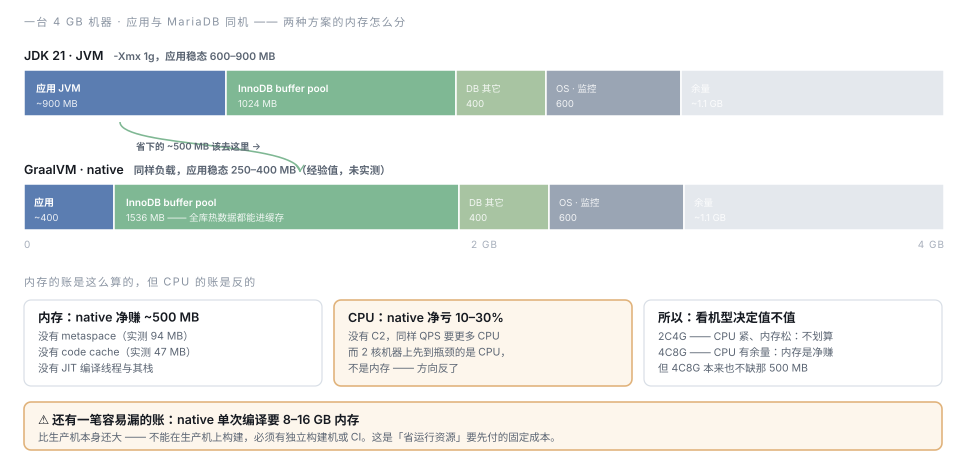

# 资源需求评估 · JDK 21 与 native，含 MariaDB 同机

状态：草稿（基线已实测，生产数按实测外推）
关联：[TDD-GraalVM与资源占用优化](TDD-GraalVM与资源占用优化.md) ·
[小程序上线指南](小程序上线指南.md) §部署机型
实测日期：2026-08-14

---

## L1 · 一句话结论

**内存不是瓶颈，CPU 才是。** 实测下来单个 JVM 稳态约 400 MB，
一台 4 GB 的机器装得下「应用 + MariaDB + 系统」还剩一半余量；
而 native 恰恰是**省内存、费 CPU** 的方案 —— 在 CPU 紧的小机型上，它拿紧缺资源换宽裕资源，方向是反的。

三个可直接用的数：

| 形态 | 机型 | 说明 |
|---|---|---|
| 内测 / 种子用户 | **2C4G**（应用 + MariaDB 同机） | 内存宽裕，CPU 是先到的瓶颈 |
| 正式运营 | **4C8G**（应用 + MariaDB 同机） | CPU 有余量后，才轮得到内存做文章 |
| native 版 | 同机型，**省下的 ~500 MB 拨给 InnoDB buffer pool** | 不是「少买一台机器」，见 §L2 |

**前端不占服务器多少资源**：C/B 两端只出小程序与 App（微信后台与应用商店托管），
需要服务器托管的只有 ops-web（3.9 MB 静态）和将来的官网，两者都交给 nginx。
nginx 自身 30–50 MB，可忽略；它换来的 TLS 终结与 `/ops` 内网隔离才是真收益 —— 见 §L3-7。
**唯一要先定的是官网走静态还是 SSR**：SSR 要多一个常驻 Node 进程（+200–400 MB、+1 核），
2C4G 那一档会因此不够。

---

## L2 · 结构



图上看不出来的三件事：

**第一，省下的内存最该给数据库，不该理解成「少买一台机器」。**
应用是无状态的、内存需求是**平的**（进程内没有随业务量增长的缓存）；
MariaDB 的内存需求随数据量涨，而 buffer pool 命中率的边际收益远高于「应用进程少占 500 MB」。

**第二，两条内存条的「余量」几乎一样宽 —— 这就是结论本身。**
native 换来的不是「机器能小一号」，是「同一台机器上数据库能缓存更多」。
如果目标是省机器钱，这张图说明 **native 省不出一台机器**。

**第三，CPU 的账没画在图上，因为它是反的。** 见 §L3-4。

---

## L3 · 详情

### 1. 实测基线（2026-08-14）

在本机跑着的两个真实实例上量的，**不是估算**。
环境：macOS · 16 GB / 10 核 · JDK 21（Homebrew openjdk@21）· 空闲开发流量 · api 面已跑 8 小时。

| 指标 | api 面实例 | ops 面实例 | 备注 |
|---|--:|--:|---|
| 堆上限 `MaxHeapSize` | **4 GB** | 4 GB | `MaxRAMPercentage=25`，即 16 GB × 25% |
| 堆 committed | 208 MB | 150 MB | G1 |
| 堆 used | 104 MB | 106 MB | 空闲流量下 |
| Metaspace committed | **93.6 MB** | 79.8 MB | 类元数据，native 下这一项归零 |
| Code cache committed | **~47 MB** | —— | JIT 产物，native 下这一项归零 |
| 线程数 | 52 | 50 | 生产会涨到 ~200（Tomcat 默认 max-threads） |
| **进程内存合计（估）** | **~400–450 MB** | ~350–400 MB | 堆 + 元空间 + code cache + 线程栈 + JVM 内部 |

#### 第二组：完整实例、真库（2026-08-14 补测）

上面那组是开发工作区里只装 api 面的实例、H2 空转。这一组是**跑真 MariaDB 的完整 ops 实例**
（Flyway 迁移全跑过、种子灌过、连着运营端点过一轮真实操作），已连续运行 76 分钟：

| 指标 | 值 | 与第一组对照 |
|---|--:|---|
| 堆上限 `MaxHeapSize` | **4 GB**（`MaxRAMPercentage=25`） | 一致 |
| 堆 committed | **156 MB** | 208 MB → 更低 |
| 堆 used | 114 MB | 104 MB → 相当 |
| Metaspace committed | **87 MB** | 93.6 MB → 相当 |
| Code cache committed | ~22 MB | 47 MB → 更低（这实例只装 ops 面） |
| 线程数 | 51 | 52 → 一致 |

**两组独立测量指向同一个结论**：committed 堆在 150–210 MB 之间，而上限是 4 GB ——
**26 倍余量**。跑真库、跑过迁移与真实请求之后仍然如此。

**一处必须修正之前的说法**：常见的担心是「G1 不把内存还给操作系统，RSS 会一直涨到堆上限」。
本项目实测**不成立** —— 堆上限 4 GB，committed 只有 208 MB，G1 归还得很干净。
所以收紧 `-Xmx` 的价值是**可预测性**（容器 limit 下不会突然膨胀、OOM Killer 不会误伤），
**不是立刻省下几百 MB**。[TDD-GraalVM](TDD-GraalVM与资源占用优化.md) 里「阶段 ① 省 30–50%」的估算据此下调。

MariaDB 侧同样实测：

| 指标 | 值 | 备注 |
|---|--:|---|
| 版本 | 12.2.2-MariaDB | |
| `innodb_buffer_pool_size` | **128 MB** | **默认值，生产必须调大** |
| `innodb_log_file_size` | 96 MB | |
| `max_connections` | 151 | 默认；本项目单实例用不到这么多 |
| `ai_shop` 表数 | **108 张** | 与 105 个 `@TableName` 实体对得上 |
| `ai_shop` 数据量 | 18.69 MB | 开发种子数据，生产按 §L3-3 外推 |

### 2. 生产内存预算：应用侧

从实测外推到「单进程装 api + ops + worker 三个面 + 真实流量」：

| 组成 | 实测（单面·空闲） | 生产估算 | 为什么变 |
|---|--:|--:|---|
| 堆 | 208 MB committed | **300–500 MB** | 三个面的 Bean 都在 + 并发请求的临时对象 + 17 个定时任务的批量数据 |
| Metaspace | 94 MB | **120–150 MB** | 三个面全装，Controller 与配置类更多 |
| Code cache | 47 MB | **60–90 MB** | 真实流量下 C2 编译的方法更多 |
| 线程栈 | 52 线程 | **40–80 MB** | Tomcat 200 线程 + 定时任务 + 连接池，按实际触页算 |
| JVM 内部 / direct buffer | —— | **80–150 MB** | GC 结构、JNI、NIO 直接内存 |
| **合计** | ~400–450 MB | **600–900 MB** | |

推荐起手参数（数值可按上线后实测再收）：

```
-Xmx1g -Xms512m -XX:MaxMetaspaceSize=256m -XX:ReservedCodeCacheSize=128m
```

**保持 G1，不要换 SerialGC** —— 17 个 `@Scheduled` 与 HTTP 请求在同一个进程里，
SerialGC 的 STW 会直接打到接口响应上（理由见 [TDD-GraalVM](TDD-GraalVM与资源占用优化.md) §L3-5）。

### 3. 生产内存预算：MariaDB 侧

108 张表、开发数据 18.69 MB。按业务体量外推的**数据总量**（含索引）：

| 阶段 | 订单量级 | 数据总量（估） | buffer pool 建议 |
|---|---|--:|--:|
| 内测 / 种子用户 | 千级 | < 200 MB | **512 MB** |
| 早期运营 | 十万级 | 1–3 GB | **1 GB** |
| 稳定运营 | 百万级 | 5–15 GB | **2 GB+**，或该拆 RDS 了 |

buffer pool 之外，MariaDB 还要：日志缓冲 + 表缓存 + 每连接缓冲（连接数 × 1–4 MB 峰值）
+ 临时表 ≈ **300–500 MB**。所以 **MariaDB 进程内存 ≈ buffer pool + 400 MB**。

**`innodb_buffer_pool_size` 现在是默认的 128 MB，这是上线前必须改的一项** ——
它比应用侧任何调优都更直接影响体感。数据量还小的时候，把 buffer pool 设成「略大于全库」，
等于整个库常驻内存。

### 4. CPU：先到的瓶颈，而且 native 让它更紧

| 场景 | JDK 21 · JVM | GraalVM · native |
|---|---|---|
| 启动 | JIT 预热吃满可用核，持续数秒 | 无 JIT，启动 CPU 尖峰消失 |
| 稳态吞吐 | C2 优化后的基准 | **同 QPS 下 CPU 高 10–30%**（无 C2，经验区间，须压测确认） |
| 定时任务 | 批量任务耗时主要在 SQL 上，CPU 影响有限 | 同左 |

**关键点**：2 核机器上，MariaDB 的 InnoDB 后台线程、JVM 的 GC 线程、Tomcat 工作线程本来就在抢核。
native 把 CPU 需求再抬高 10–30%，而它省下的内存在这个机型上**本来就不缺**（见 §L2 那两条余量）。

> **所以：2C4G 上不要做 native；4C8G 上 CPU 有余量，但那时也不缺那 500 MB。**
> 这就是 [TDD-GraalVM](TDD-GraalVM与资源占用优化.md) 建议停在阶段 ② 的资源侧证据。

CPU 的核数建议：

| 形态 | 核数 | 理由 |
|---|--:|---|
| 内测 | 2 | 够用，但发版时 JIT 预热与 Flyway 迁移会明显占满 |
| 正式运营 | 4 | 应用 2 核 + MariaDB 1.5 核 + 系统 0.5 核，留出定时任务与请求叠加的峰值 |
| 拆库之后 | 应用 2 核即可 | MariaDB 挪走后 CPU 压力主要看 QPS |

### 5. JDK 21 上一个几乎免费的选项：虚拟线程

本项目锁 JDK 21，而虚拟线程在 21 是 GA 的。开启后 Tomcat 不再为每个请求占一个平台线程：

```yaml
spring:
  threads:
    virtual:
      enabled: true
```

收益：省掉 200 个平台线程的栈与调度开销（**40–80 MB 量级**），高并发下的内存曲线更平。
成本：一行配置，可随时关掉。

⚠️ **但要先验 pinning**：JDK 21 上虚拟线程遇到 `synchronized` 会钉住载体线程（JDK 24 才修）。
HikariCP 与 MyBatis 内部都有 `synchronized` 路径，**必须压测确认没有钉死**，
用 `-Djdk.tracePinnedThreads=full` 观察。

**这件事的性价比比 native 高一个数量级** —— 一行配置 vs 三到四周，都在解「线程栈与并发开销」这同一块。
建议放进阶段 ①，与堆上限一起做。

### 6. 汇总：三档机型的资源账

| | 内测 · 2C4G | 正式运营 · 4C8G | 4C8G + native |
|---|--:|--:|--:|
| 应用 JVM | 600–900 MB | 600–900 MB | **250–400 MB** |
| MariaDB buffer pool | 512 MB | 2 GB | **2.5 GB** |
| MariaDB 其它 | 400 MB | 500 MB | 500 MB |
| **nginx** | 50 MB | 50 MB | 50 MB |
| 官网（若走静态站） | ~0 | ~0 | ~0 |
| OS · 监控 · 备份 | 500 MB | 800 MB | 800 MB |
| **合计** | **~2.1–2.4 GB** | **~3.9–4.3 GB** | **~4.1–4.3 GB** |
| **余量** | ~1.6 GB | ~3.7 GB | ~3.7 GB |
| CPU 余量 | **紧**（但 nginx 接走了 TLS） | 宽裕 | 比左列**更紧** 10–30% |

**两档都不缺内存。** 这就是为什么本文的结论是「CPU 才是要看的那一栏」。

两项不在表内：

- **Redis** —— 单实例形态用 `ehcache` 存会话，不需要
  （见 [TDD-GraalVM](TDD-GraalVM与资源占用优化.md) §L4-1）。扩到多副本时加 512 MB–1 GB。
- **官网若走 SSR** —— 要多一个常驻 Node 进程，**+200–400 MB、+1 核**。
  加上去之后 2C4G 那一档的余量掉到 1.2 GB 以下、CPU 只剩不到半核，**那档就不够了**（见 §L3-7）。

---

### 7. 前端交付形态与静态托管

前提（2026-08-14 确认，**推翻本节上一版**）：
**C/B 两端只出小程序与 App，不出 H5；服务器上会有 nginx；将来加一个官网。**

于是「把 c / b / p 打进一个 jar」这个问题不再成立 —— 需要服务器托管的东西只剩两样：

| 端 | 生产交付形态 | 谁托管 | 占服务器静态资源？ |
|---|---|---|:--:|
| `c-app` C 端 | 微信小程序包 + App 安装包 | 微信后台 / 应用商店 | **否** |
| `b-app` B 端 | 同上（实测 `mp-weixin` **724 KB**、App 资源 **1.2 MB**） | 同上 | **否** |
| `ops-web` 平台端 | Next.js 静态导出 **3.9 MB / 167 文件** | **nginx** | 是 |
| 官网（将来） | 待定，见下 | **nginx** | 是 |

小程序包 724 KB 离微信主包 2 MB 的限制还很远，这条不构成约束。

`dist/web/c`、`dist/web/b` 那两份 H5 产物是**开发预览用**，不是生产交付物 ——
[`scripts/build-web.mjs`](../../../scripts/build-web.mjs) 文件头「两个域名各自部署」那段是按 H5 上线写的，
与现在的形态已经不一致，值得回头改一句说明。

**有 nginx 就用 nginx。** sendfile + `gzip_static` 直接发预压缩文件，
比 JVM 从 jar 里 inflate 再实时 gzip 便宜一个数量级；
而上一版列的三条代价（同源串号、运营端资源公网可下载、发版耦合）**全部消失**。

#### nginx 自身的开销可以忽略，但它换来的三件事都很值

| 项 | 值 |
|---|---|
| 内存 | 2 个 worker × ~15 MB ≈ **30–50 MB** |
| CPU | 静态走 sendfile，几乎不耗；TLS 见下 |
| 磁盘 | ops-web 3.9 MB + 官网（待定） |

1. **TLS 终结从 JVM 挪到 nginx。** 小程序和 App 的每一次 API 调用都是 HTTPS，
   而 2 核机器上 TLS 握手是可观的 CPU 开销 —— nginx 做这件事比 JVM 便宜。
   **没有 H5 之后，这是 nginx 最大的一笔收益：省的不是静态托管，是握手。**
2. **`/ops` 的公网暴露有了干净解法。** 单实例装三个面导致运营端接口跟 C/B 端一起暴露
   （见 [TDD-GraalVM](TDD-GraalVM与资源占用优化.md) §L4-4），
   有 nginx 之后不必拆进程：`server_name` 分开 + `allow`/`deny` 限内网，
   把 `/ops/**` 与 ops-web 站点一起关进内网 server 块。**比拆部署便宜得多。**
3. **origin 隔离不再是问题。** C/B 走小程序与 App，各自有独立的存储沙箱，
   `build-web.mjs` 记的那个「同源串号」坑在当前形态下不存在。

#### 官网是唯一需要先定的分叉

| 形态 | 内存 | CPU | 说明 |
|---|--:|--:|---|
| **静态站**（Astro / Hugo / Next `output: export`） | **~0** | ~0 | 几 MB 文件交给 nginx，与 ops-web 同一个模式 |
| SSR（Next.js server / Nuxt） | **+200–400 MB** | **+1 核** | 要多一个常驻 Node 进程 |

**推荐静态站**：官网是市场页，SEO 靠构建期预渲染就够，没必要为它引入第二个运行时。
若确实要 SSR，§L3-6 的 2C4G 一档就不够了 —— 那 400 MB 和 1 个核正好是那档最紧的两样东西。

#### 真正的带宽与 CPU 大头不是前端资源，是图片

小程序与 App 拉的商品图现在由 `UploadResourceConfig` 从本地磁盘 serve，**走 JVM 的线程池**。
量级比三个前端的静态资源大一到两个数量级，而且随商品数线性涨。
那个类的注释里已经写了「换对象存储时这个类整个删掉」——
**在没有 H5 之后，这件事的优先级应该排在所有前端托管讨论之前。**

过渡期至少让 nginx 直接 serve 那个上传目录（`location /uploads/` → `alias`），别经过 JVM ——
一行 nginx 配置，省掉的是 JVM 线程池里最长的那类占用。

---

### 8. 图片存储：本地磁盘 vs 腾讯云 COS

**结论：用 COS + CDN。** 不是「以后优化」级别的事，四条理由，第一条是硬顶。

#### 一、带宽是先到的瓶颈，比 CPU 还早

腾讯云 CVM 按**固定带宽**计费，2C4G / 4C8G 常见配 3–5 Mbps：

| 一张商品图 | 5 Mbps 满速传输 | C 端首页 20 张图 |
|---|--:|--:|
| 压到 200 KB | 0.32 秒 | **6.4 秒**（还没算 API） |

**十来个人同时刷首页就把带宽打满了。** 这条与 §L3-4 的 CPU 结论无关 ——
它比 CPU 更早到顶，是整份评估里最紧的一个数。COS / CDN 按流量计费，没有带宽天花板。

#### 二、证件影像现在和商品图混在同一个公开目录（已核实）

| 事实 | 位置 |
|---|---|
| 只有一个上传端点，商品图与资质件都走它 | `BizUploadController` → `POST /biz/upload/image` |
| 落点是同一个 `shop.upload.dir`，URL 前缀同为 `/uploads/` | 同上，第 86 行 |
| `/uploads/**` 整条链 `permitAll` | `SecurityConfig` 第 151–153 行 |
| 证件影像存的就是这个 URL | `MchQualification.imageUrl` · `image_url VARCHAR(512) COMMENT '证件影像'` |

`SecurityConfig` 的注释写的是「图本身不是秘密（它就是要给买家看的）」——
**这句话对商品图成立，对营业执照不成立**。UUID 文件名给的是「不可枚举」，不是访问控制：
URL 一旦出现在数据库导出、运营端截图或日志里，谁都能拉到证件原件。

COS 按前缀分权限（商品图公开读 / 证件私有读 + 预签名 URL）是现成能力，本地磁盘要自己再造一层。
**这条是合规问题，不是资源问题**，已单独记录。

#### 三、内容审核

商家上传的商品图是 UGC。腾讯云 COS 可直接接**数据万象**做机审（涉黄涉政涉恐），
本地磁盘方案要自己接一套。对电商平台这是上线门槛，不是加分项。

#### 四、单实例下磁盘与应用绑死

换机器要迁数据；备份体积从「几十 MB 的库」涨成「几十 GB 的图」；应用故障时图片一起不可用。

#### 成本对比（估算，以比例为准，价格以腾讯云官网为准）

| 项 | 量 | 月费（估） |
|---|---|--:|
| COS 标准存储 | 1 万商品 × 5 张 × 200 KB ≈ 10 GB | ~1 元 |
| CDN 流量 | 1000 DAU × 30 张/天 × 200 KB ≈ 180 GB/月 | ~30–45 元 |
| **合计** | | **~35–50 元/月** |
| 对照：CVM 固定带宽 5 → 20 Mbps | 为扛同样峰值 | **远不止这个数，而且仍有天花板** |

#### 好消息：现在的设计已经为迁移留好了路

`BizUploadController` 返回的是 `/uploads/{merchantNo}/{uuid}.ext` —— **相对路径，不含域名**，
而数据库里 `cover` / `images` / `logo` / `avatar` / `image_url` 存的都是它。迁移动作因此很轻：

1. `data/uploads` 整个 sync 到 COS，前缀保持 `{merchantNo}/`（目录结构本来就一致）
2. 端上的图片域名改成 CDN 域名
3. 删掉 `UploadResourceConfig`（那个类的注释自己就是这么写的）
4. 上传改直传：后端签发 STS 临时密钥，字节不再经过 JVM

**数据库一行都不用改。**

> ⚠️ **第 2 步有个前提要先核实**：`b-app/src/pages/goods-edit/index.vue:457` 是
> `<image :src="cover">` 直接用，没找到拼绝对 URL 的地方。
> 相对路径在 H5 里能按 origin 解析，**小程序和 App 里不行 —— 必须是完整 https**。
> 既然现在没有 H5，这可能已经是个隐患。先确认端上在哪里拼图片域名，迁移的第 2 步才有落点。

#### 腾讯云上的具体形态

| 组件 | 用途 | 注意 |
|---|---|---|
| COS bucket | 一个桶，前缀 `{merchantNo}/` 与现有目录一致 | **商品图公开读 / 证件私有读**，按前缀分策略 |
| CDN + 自定义域名 | 回源 COS | **域名要备案**；小程序要求 HTTPS |
| 数据万象 CI | 图片审核 + 缩略图 / WebP | `?imageMogr2/format/webp` 能把首屏流量再砍一半以上 |
| STS 临时密钥 | 端上直传 | 后端只发密钥，不过字节 |

#### 分阶段

- **内测期**（图片几百张、并发个位数）：本地磁盘 + nginx `alias` 直发撑得住 ——
  **但第二条（证件影像公开可读）不能等**，要么单独放一个不公开的目录，要么这一步就上 COS
- **上线前**：迁 COS + CDN + 直传 + 审核
- 判据不是「什么时候有空」，是**「第一次有真实用户刷首页」**

---

## L4 · 边界

### 1. 这些数的可信度分级

| 数据 | 可信度 | 来源 |
|---|---|---|
| JVM 堆 / 元空间 / code cache / 线程数 | **实测** | 本机运行中的两个实例，`jcmd` |
| MariaDB 配置与当前库大小 | **实测** | `information_schema` |
| 生产内存外推（600–900 MB） | 中 | 由实测 + 三面装载与流量系数外推，**上线后必须复测** |
| native 内存（250–400 MB） | 低 | 行业经验区间，本项目**没有 native 产物可测** |
| native CPU 损耗（10–30%） | 低 | 行业经验区间，**必须压测** |
| 数据量外推 | 低 | 按订单量级估，与实际品类数、图片是否入库强相关 |

**最不可信的两行恰好都在 native 那一侧** —— 这本身就是「先别投入三四周」的一个理由。

### 2. 测量环境与生产的差异

实测在 macOS 上做的，生产大概率是 Linux + 容器：

- **`MaxRAMPercentage` 在容器里按 cgroup limit 算**，不是宿主机内存。4 GB limit → 堆上限 1 GB。
- macOS 的 `ps` RSS 因内存压缩而**偏低**（实测显示 50 MB，明显低于 JVM 内部统计的 400 MB+），
  所以本文一律用 `jcmd` 的 JVM 内部数，不用 `ps`。Linux 上要重新用 RSS 校准一次。
- 容器里还要留 **OOM Killer 的安全边界**：堆上限 + 元空间 + code cache 之和应低于 limit 的 70%。

### 3. 没有评估的部分

- **磁盘与 IOPS**：MariaDB 的写入放大、Flyway 迁移期间的锁表时间、`ehcache` 会话目录的磁盘占用（配置上限 64 MB）
- **网络带宽**：商品图片是否走对象存储直传，会决定应用带宽是几 Mbps 还是几十
- **备份窗口**：`mysqldump` 期间的内存与 CPU 尖峰 —— 单机全栈形态下这会和业务抢资源

### 未定项

| # | 待决 | 说明 |
|---|---|---|
| Q1 | 生产是容器还是裸机 | 决定 `MaxRAMPercentage` 与 OOM 边界怎么设 |
| Q2 | MariaDB 是否长期与应用同机 | 同机则 §L3-6 成立；拆 RDS 后应用侧 2C4G 绰绰有余 |
| Q3 | 商品图片是否入库 | 直接决定 §L3-3 的数据量外推能不能用 |

---

## 下一步

1. 把 `innodb_buffer_pool_size` 从默认 128 MB 调到 512 MB（内测）或 1–2 GB（运营）—— **最直接的一项**
2. 应用侧设 `-Xmx1g -Xms512m`，理由是可预测性而非省内存
3. 试 `spring.threads.virtual.enabled=true`，用 `-Djdk.tracePinnedThreads=full` 验 pinning
4. 上线后在 Linux 上复测一次 §L3-1 的全部指标，把本文的「估算」列换成实测
5. nginx 上线时一并把三件事配掉（§L3-7）：TLS 终结、`/ops` 与 ops-web 限内网、
   `location /uploads/` 直接 `alias` 到上传目录不经过 JVM
6. **定官网走静态站还是 SSR** —— 这是本文唯一会改变机型结论的未定项
7. 把上传媒体迁到对象存储，`UploadResourceConfig` 随之删除 ——
   它的量级比所有前端静态资源加起来还大
