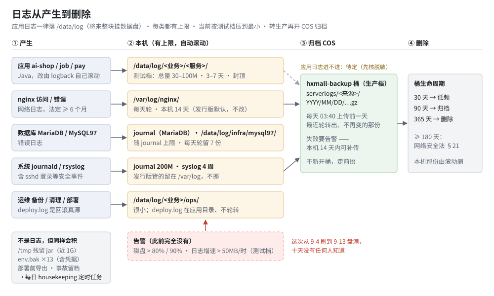

# 运维 · 服务器目录与日志方案

> 状态：**M0–M5 已实施 · 清理（只列清单）与巡检已装 · 复核后已修三处（§11）· 切库后已复核并补 binlog（§12）**
> **· 未完：告警推送 · SSH 口令登录 · 清理开删除 · 兼容软链** —— 执行计划见 [§13](#13-执行计划2026-09-16)
> · 创建 2026-09-14 · 复核 2026-09-14 · 切库后复核 2026-09-16
> 第二版按反馈改了三处：**应用与日志搬到 `/data`**（将来挂数据盘只需一个挂载点）；
> **按业务分目录**（将来别的业务并列）；**当前是测试环境，日志空间压到最小**（「测试档」，转生产再切「生产档」）。
> 实施与方案不一致的地方见 [§10 实施记录与偏差](#10-实施记录与偏差)。
> 档位：1 —— 动了 systemd 单元、各服务环境变量、部署脚本与 nginx 配置里的路径；无端点、库表变更。本文即 TDD
> 关联：[后端部署-流程与约定](./后端部署-流程与约定.md) ·
> [COS 桶规划](../../../deploy/tencent/cos-buckets.md) ·
> [部署交接文档](../../../deploy/tencent/README.md) ·
> 事故留档：服务器 `/data/log/ai-shop/incident/2026-09-14/`

---

## L1 定位

服务器上**我们自己的东西**——应用、日志、本机备份、数据库数据、构建工作区——全部收进 `/data`，
按「**类型 / 业务 / 服务**」三级组织。日志每一类都有上限和保留期；失控能在小时级被发现。

- 将来挂数据盘：`/data` 整块挂上去即可，一个挂载点
- 将来加业务：在每个类型目录下并列一个业务目录，规则不变
- 现在是测试环境：日志按「测试档」压到约 0.5G；转生产时只改配置切到「生产档」

起因：2026-09-14 根分区被一个从未轮转过的 `app.log` 写满（41.6G），线上 DOWN 约 23 小时；
它从 9-4 就开始被刷，十天没有任何人知道。止血时顺带发现，我们的东西散在
`/opt`、`/var/www`、`/var/lib`、`/var/backups`、`/var/log` 五处，而机器只有一块和系统同盘的 60G。

---

## L2 结构

### 目录树

```
/data                                  将来整块挂数据盘；现在是系统盘上的目录
├── app/                               应用：程序、配置、运行时状态
│   └── ai-shop/                       业务（将来别的业务与它并列）
│       ├── shop-app/                  服务 → systemd: ai-shop
│       │   ├── shop-app-<时间>-<SHA>.jar …   最近 5 个 + 当前（部署脚本已在管）
│       │   ├── shop-app.jar           → 当前版本（软链，unit 指向它）
│       │   ├── shop-app.env           600，含凭据
│       │   ├── env-backup/            env 历史副本，最新 5 份
│       │   ├── certs/                 微信支付等证书，700
│       │   ├── state/                 SHOP_SESSION_DIR；会话实际存库（SHOP_TOKEN_STORE=db），8-28 起不写
│       │   └── deploy.log             回滚真源，不轮转
│       ├── shop-job/                  服务 → ai-shop-job
│       ├── pay-svc/                   服务 → ai-shop-pay
│       ├── web/                       前端静态：site  b-app  c-app  ops-web  dl（nginx 读）
│       └── ops/                       运维脚本：backup-to-cos.sh  cos_put.py（实施时加的，见 §10）
├── log/                               日志：将来也可以单独挂一块盘
│   ├── ai-shop/
│   │   ├── shop-app/                  shop-app.log   shop-app.log.2026-09-14.0.gz …
│   │   ├── shop-job/
│   │   ├── pay-svc/
│   │   ├── ops/                       backup.log  housekeeping.log  logwatch.log
│   │   └── incident/2026-09-14/       事故留档
│   └── infra/                         不属于任何业务的基础设施
│       └── mysql97/                   error.log
├── backup/                            本机短留；真正的备份在 COS
│   └── ai-shop/
│       ├── db/                        每日导出（3 天）
│       ├── predeploy/                 迁移前导出（30 天）
│       └── legacy/                    版本化部署之前手工留的 jar 备份（1.4G，待清）
├── db/                                数据库数据目录
│   └── mysql97/                       待机实例；MariaDB 不搬（它会被替换掉）
└── build/                             服务器上的构建工作区
    ├── ai-shop/
    │   ├── src/                       源码快照（服务器已不再构建，见 §10）
    │   └── mp-upload/                 小程序上传工作区
    └── ai-neargo/
        └── src/                       地基 commons 源码
```

### 日志从产生到删除



图上看不出来的：

- **最要紧的是告警那条线**。上限只保证日志写不满盘，挡不住别的东西写满盘；
  这次真正的失败是「十天没人知道」。
- 应用日志的上限是 logback 的**总量封顶** —— 真上限；其余是 logrotate 的
  「单文件 × 份数」，只是间接上限。
- 发行版自己管的日志（nginx、journal、syslog、auth.log）**留在 `/var/log` 不挪**：
  挪了之后包升级会和它打架。「应用日志不放 `/var`」管的是我们自己的程序。
- `deploy.log` 长得像日志，其实是回滚的真源（`--rollback` 读它的倒数第二行），
  所以它跟着应用目录走、不进日志目录、任何轮转都不碰它。

### 总表：两档

| 类 | 位置 | **测试档（现在）** | 生产档（转生产时切） | 依据 |
|---|---|---|---|---|
| 应用 shop-app | `/data/log/ai-shop/shop-app/` | 单文件 20M · **14 天** · **总量 100M** | 100M · 14 天 · 1G；另存 ERROR 30 天 200M | 复核实测约 0.5MB/天（第一版写「约 20MB/天」，差约 40 倍，见 §11） |
| 定时任务 shop-job | `…/shop-job/` | 10M · **14 天** · **30M** | 200M + ERROR 50M | 现 job.log 仅 323K |
| 支付 pay-svc | `…/pay-svc/` | 10M · **30 天** · **50M** | 300M + ERROR 150M · 30 天 | 资金问题回溯周期长 |
| 运维 ops | `…/ops/` | 7 份 | 90 天 | 很小 |
| MySQL 9.7 错误 | `/data/log/infra/mysql97/` | 7 份 | 14 份 | **09-16 起是主库**（原「待机实例」）；轮转已验：`error.log.1` 在 |
| **MySQL binlog** | **`/data/db/mysql97/mysql-bin.*`** | **7 天过期 · 单文件 100M**；现 3 个共 **266M** | 同左（按时间点恢复靠它） | **切库新增（09-16）**。⚠️ **它在 `/data/db` 不在 `/data/log`** —— 见 §12 的巡检盲区 |
| ~~MariaDB 错误~~ | ~~journal~~ | — | — | **09-16 起 MariaDB 已停**；数据目录 `/var/lib/mysql` 530M 是回滚退路，观察期后清（§12） |
| journald | `/var/log/journal/` | **200M** | 500M | 发行版位置 |
| nginx 访问 / 错误 | `/var/log/nginx/` | 发行版默认 14 天 | 14 天 + **COS 365 天** | **网络安全法 §21：≥ 6 个月** |
| auth.log 等 | `/var/log/` | 发行版默认 4 周 | 4 周 + **COS 365 天** | sshd 登录属网络安全事件 |
| **本机合计（最坏）** | | **≈ 0.5G + binlog** | ≈ 3G | binlog 现 266M 是**迁移那一次大事务撑的**（`mysql-bin.000001` 单个 173M，超过 100M 上限——上限只在语句边界生效），7 天后自然过期；日常流量下很小 |

「总量」数的是**压缩后的归档**，不含正在写的那个文件；清理在滚动时异步执行，会超出一截。
本地灌日志实测：封顶 500KB，归档停在 624KB —— **超出约 25%**。
所以一个服务在盘上的最坏占用 ≈ 总量 × 1.25 + 单文件上限（shop-app：100M × 1.25 + 20M ≈ 145M）。
合计按这个口径算。

测试档的代价说在明处：遇到 9-14 那种刷法（每小时 0.65G 原文），
按同一次实测的压缩比（原文 5203KB → 归档 624KB，约 8:1），100M 归档装得下约 0.8G 原文 ——
**能留住最后一个多小时**。（一次短跑测到过 13:1，取保守的那个。）
第一版这里写的是「十来分钟」，那是把压缩后的上限当成了原文的量，说错了。
对测试环境够用 —— 最近的上下文还在，告警会响。

---

## L3 详情

### 1. 搬家前的现状（2026-09-14 实测）

> 本节保留搬家前的样子作对照，里面的旧路径是有意留着的。现在的位置见 L2 目录树。

**部署在哪**：

| 部分 | 现在的位置 |
|---|---|
| 后端 ai-shop | `/opt/ai-shop`（jar 软链、`shop-app.env`、`deploy.log`、证书） |
| 定时任务 ai-shop-job | `/opt/ai-shop-job` |
| 支付 ai-shop-pay | `/opt/ai-shop-pay` |
| 前端静态 | `/var/www/ai-shop/{site,b-app,c-app,ops-web,dl}` |
| 会话 | `/var/lib/ai-shop/sessions` |
| 数据库每日备份 | `/var/backups/ai-shop` |
| 构建工作区 | `/opt/build/{ai-shop,ai-neargo}` |
| 日志 | `/var/log/ai-shop/{app,job,backup}.log`；pay 进 journal |
| MariaDB 数据 | `/var/lib/mysql` |
| MySQL 9.7 | 程序 `/opt/mysql`，数据 `/var/lib/mysql97`，日志 `/var/log/mysql97` |

磁盘只有一块 60G 系统盘（`vda`），没有闲置的数据盘；`/data` 已存在、是空的（系统镜像建的）。

**问题**：

| 问题 | 实测 | 后果 |
|---|---|---|
| 三个 Java 服务**都没有日志配置** | 仓库里没有 `logback-spring.xml`；全用 Spring Boot 默认，只打控制台 | 应用自己**没有任何上限**，全靠外部 |
| 日志落点三种写法 | shop-app、shop-job：systemd `append:` 写文件；pay：进 journal | 排障去三处找；`append:` 让 systemd 握着句柄，只能 copytruncate |
| 堆栈无节制 | outbox 一次失败 140 多行，同一条重试 16 万次 | 41.6G 的直接来源 |
| **没有任何告警** | 无磁盘、无增速告警 | 十天无人知道 |
| 我们的东西散在五处 | 见上表 | 将来挂数据盘要搬五处；加业务没有落点规则 |
| 非日志累积物没人清 | `/tmp` 5 个残留 jar 近 1G（部署中途退出不清）；`shop-app.env.bak*` 13 份含凭据 | 另一种写满盘的方式 |

**路径写死在仓库的哪里**（搬家的真实改动量；`.md` 文档不计，**代码注释计入** —— 注释里的旧路径不改，会误导下一个照着做的人）：

| 旧路径 | 处数 | 文件 |
|---|---|---|
| `/opt/ai-shop` | 12 | `backend/deploy/tencent/deploy-backend.sh` · `scripts/deploy-pay-certs.sh` · `scripts/backfill-std-cover.py` · `c-app/scripts/release-mp.sh` · `deploy/tencent/backup-to-cos.sh` · `TokenStoreSelectionEnvTest.java`（注释） |
| `/opt/ai-shop-job` | 4 | `backend/deploy/tencent/ai-shop-job.service` · `deploy-job.sh` |
| `/opt/ai-shop-pay` | 1 | `scripts/deploy-backend.sh` |
| `/var/www/ai-shop` | 13 | `deploy/tencent/nginx/www.hxmall.top.conf` · `scripts/deploy-frontend.sh` · `scripts/release-bapp-apk.sh` · `site/lib/site.config.ts`（注释） |
| `/var/log/ai-shop` | 10 | `ai-shop-job.service` · `backend/deploy/tencent/deploy-backend.sh` · `deploy-job.sh` · `deploy/tencent/logrotate/ai-shop` |
| `/var/backups/ai-shop` | 1 | `deploy/tencent/backup-to-cos.sh` |

另有**只在服务器上**的：三个 systemd 单元；`shop-app.env` 里三个值带路径的键
（`SHOP_SESSION_DIR`、`WX_PRIVATE_KEY_PATH`、`WX_PLATFORM_PUBLIC_KEY_PATH`）——
**漏改这三个，服务照样起得来，但会话和支付证书读不到**；`/etc/cron.d/ai-shop-backup`。

### 2. 目录规划

#### 2.1 命名

| 层 | 规则 | 例 |
|---|---|---|
| 类型 | `app` · `log` · `backup` · `db` · `build`，固定这五个 | `/data/log` |
| 业务 | 小写、短横线；与 systemd 单元前缀一致 | `ai-shop` |
| 服务 | 与 jar 的名字一致 | `shop-app`、`shop-job`、`pay-svc` |
| 日志文件 | `<服务>.log`；滚动后缀由 logback 生成 | `shop-app.log.2026-09-14.0.gz` |
| systemd 单元 | 维持现名（`ai-shop`、`ai-shop-job`、`ai-shop-pay`）；新业务按 `<业务>-<服务>` | 改名要连带改一堆，不值 |
| 基础设施 | 不属于任何业务的，业务位写 `infra` | `/data/log/infra/mysql97/` |

**类型在前、业务在后**（`/data/log/ai-shop`，而不是 `/data/ai-shop/log`）：
这样「日志单独挂一块盘」只是 `/data/log` 一个挂载点；业务在前的话，每个业务都要挂一次。

#### 2.2 权限

| 路径 | 属主 | 权限 | 为什么 |
|---|---|---|---|
| `/data` 及五个类型目录 | root:root | 755 | |
| `/data/app/ai-shop` | root:root | 755 | nginx（www-data）要能穿过去读 `web/` |
| `/data/app/ai-shop/<服务>` | deploy:deploy | 750 | 里面有 env 和证书 |
| `…/<服务>.env`、`env-backup/*` | deploy:deploy | 600 | 凭据 |
| `…/<服务>/certs` | deploy:deploy | 700 | **搬完要以 deploy 身份实测可读**（9-4 支付上线因此停过 4 分钟） |
| `/data/app/ai-shop/web` | deploy:deploy | 755 | nginx 只读 |
| `/data/log/ai-shop/<服务>` | deploy:deploy | 750 | 服务以 deploy 运行，自己写、自己滚 |
| `/data/backup/ai-shop` | root:root | 700 | 数据库导出是全量数据 |
| `/data/db/mysql97` | mysql:mysql | 750 | |

#### 2.3 留在 `/data` 之外的（及理由）

| 东西 | 位置 | 理由 |
|---|---|---|
| 第三方程序 | `/opt/mysql` | `/opt` 放软件本身，不放业务数据；它不会长大 |
| 系统配置 | `/etc`（systemd 单元、nginx、logrotate、`/etc/mysql97`） | 配置归 `/etc` 是惯例；源文件都在仓库 `deploy/tencent/` 下 |
| 发行版管的日志 | `/var/log/{nginx,journal,syslog,auth.log}` | 挪了包升级会打架 |
| MariaDB 数据 | `/var/lib/mysql` | 它会被 MySQL 9.7 替换；现在搬要停库，还要改 AppArmor，不值 |

#### 2.4 加一个业务

1. 在 `app/ log/ backup/ build/` 下各建 `<业务>/`，权限照 2.2
2. 每个服务：`/data/app/<业务>/<服务>/`、`/data/log/<业务>/<服务>/`，单元命名 `<业务>-<服务>`
3. 在总表里给它一行预算
4. logrotate 是按 `/data/log/*/ops/` 通配的，**不用改**；清理与巡检（§4、§6）也是按通配写的，同样不用改

### 3. 日志大小

#### 3.1 应用层：Spring Boot 自带的滚动，只加环境变量

**不写代码、不发版**，改完 `daemon-reload` 再重启各服务。

**这组变量写在 systemd 单元的 `Environment=` 里，不在 env 文件里**
（仓库 `deploy/tencent/systemd/ai-shop.service` 等三份，就是唯一真源；env 文件只放凭据）。
第一版本节写的是 `shop-app.env`，而实施时落在了单元里 —— 2026-09-14 复核时发现。
两处不能都写：`EnvironmentFile=` 的优先级**高于** `Environment=`，照着旧写法往 env 文件里
加一份，新值会静默生效，从此两处各有一份、改一处不知道另一处。

```ini
# /etc/systemd/system/ai-shop.service（源：仓库 deploy/tencent/systemd/ai-shop.service）—— 测试档
Environment=LOGGING_FILE_NAME=/data/log/ai-shop/shop-app/shop-app.log
Environment=LOGGING_LOGBACK_ROLLINGPOLICY_MAX_FILE_SIZE=20MB
Environment=LOGGING_LOGBACK_ROLLINGPOLICY_MAX_HISTORY=14
Environment=LOGGING_LOGBACK_ROLLINGPOLICY_TOTAL_SIZE_CAP=100MB
Environment=LOGGING_THRESHOLD_CONSOLE=ERROR
Environment=LOGGING_EXCEPTION_CONVERSION_WORD=%%wEx{30}
```

`%%` 不是笔误：systemd 会把单元里的 `%` 当占位符展开，进程拿到的是 `%wEx{30}`（§10.3 读 `/proc/<pid>/environ` 核过）。

shop-job、pay-svc 同理，数值按总表。滚动文件默认就是 `.%d{yyyy-MM-dd}.%i.gz`（自带压缩）。

⚠️ **上线前必须先在本地用这组变量起一次**：`%wEx{30}` 这个写法要实测被不被接受；
写错了 logback 可能退回默认配置、也可能根本不写文件 —— 两种都不报错。
本地验：文件落在指定位置、超 20M 会滚、堆栈被截到 30 帧。

systemd 单元随之把 `StandardOutput=append:…` 改为 `StandardOutput=journal`：
应用自己写文件、自己滚；journal 里只剩 ERROR 和 logback 起来之前的 JVM 输出（启动即崩时看得见）。

**生产档**另要一个 `logback-spring.xml` 把 ERROR 另存一份（30 天）——
那是代码改动、要发版，所以只在转生产时做。三个服务各一份、内容相同，由测试守着一致
（pay 正在和主工程解耦，不能指望它依赖共享模块）。

#### 3.2 系统层：兜底

| 对象 | 测试档 | 说明 |
|---|---|---|
| journald | `SystemMaxUse=200M`（9-14 加的是 500M，调低） | 发行版位置，不挪 |
| logrotate | `/etc/logrotate.d/ai-shop` 只管 `/data/log/*/ops/*.log`（7 份）；MySQL 9.7 仍由它自己的 `/etc/logrotate.d/mysql97` 管（M4 改路径） | 应用日志**撤出** —— logback 与 logrotate 轮同一个文件会打架 |
| logrotate.timer | 每小时（9-14 已改） | |
| nginx、rsyslog | **不改发行版配置** | 改了 conffile，自动更新会跳过它们的安全补丁 |

### 4. 定期删除

一条规则只有一个执行者：

| 对象 | 谁删 | 测试档 |
|---|---|---|
| 应用滚动日志 | logback | 3–7 天 + 总量封顶 |
| `ops/*.log`、`infra/*/*.log` | logrotate | 7 份 |
| nginx、syslog | 发行版 logrotate | 14 天 / 4 周 |
| journal | journald | 200M |
| 本机数据库导出 | 备份脚本（已有） | 3 天 |
| COS 归档 | 桶生命周期 | 生产档才开 |

**非日志累积物**：每日 [`housekeeping.sh`](../../../deploy/tencent/housekeeping.sh)（04:10，
`/etc/cron.d/ai-shop-housekeeping`），先 **dry-run 一周**只列清单，对过再在 cron 里加 `APPLY=1` 开删除。
清单在 `/data/log/ai-shop/ops/housekeeping.log`。只删自己的脚本按固定格式生成的东西，名字对不上格式的一律只报：

| 对象 | 规则 | 2026-09-14 搬完后实测 |
|---|---|---|
| `/tmp/shop-app-*.jar`、`/tmp/pay-svc-*.jar` | 超过 1 天就删；部署脚本已加退出时清理（治本，见 §10） | 9 个、约 740M，最新的是 9-05 |
| `/tmp` 里其他 `*.jar`（`candidate.jar`、`core.jar`、`sm.jar`） | **只报不删** —— 名字看不出是谁的、干什么的 | 3 个、约 98M |
| `env-backup/*` | 名字只有时间戳的，每个服务留最新 5 份；**带标签的（`bak-appid-*`、`bak-otp-*` 这类）只报不删** —— 文档把它们当回滚依据引用（如[小程序账号与切换](./小程序账号与切换.md)） | shop-app 14 份，其中带标签 6 份 |
| `/data/app/ai-shop/web/<站点>.bak*` | 每个站点留最新 3 份（前端部署脚本每次留一份，从没人清） | **22 份** |
| `/data/backup/ai-shop/predeploy/*` | 30 天 | 8.5M |
| `/data/backup/ai-shop/legacy/` | **只报不删**，人看过再删 | 1.4G：22 项 —— 17 个 8-24/8-25 的 `shop-app.jar.bak-*`、1 个 `v214-pending`、2 个回滚标记文件、2 个悬空软链 |
| `/data/log/ai-shop/incident/*` | 90 天 | |
| 旧 jar | **只核对不删**（超过 6 个报一行）—— 部署脚本已在管 | shop-app 6 · pay-svc 6 · shop-job 5 |

### 5. 归档到 COS（生产档）

测试档不开。转生产时：nginx 访问 / 错误日志与 auth.log 每天传到
`hxmall-backup-1301656997` 的 `serverlogs/<业务或 infra>/<来源>/<YYYY>/<MM>/<DD>/`，
桶生命周期 30 天转低频、90 天转归档、365 天删除 —— 满足法定 ≥ 6 个月。
归档只传不删，本机文件照原规则到期；上传失败由告警兜住。开之前先核：
访问日志的 URL 里有没有令牌、手机号；应用日志里有没有个人信息（决定它进不进 COS）。

**2026-09-14 核过一次**（只数键、值打码，扫了 nginx 全部 15 份访问日志与三个服务的当前日志）：

| 看到的 | 行数 | 是什么 | 处理 |
|---|---|---|---|
| `/biz/inventory/items/by-barcode?code=` | 28 | 条码，不是凭据 | 无 |
| `/mp/wx/callback?…&openid=` | 3 | 微信服务器回调，openid 放在 URL 里是微信协议定的 | **开 COS 归档前**在 nginx 的 `log_format` 里把这个位置的查询串打码 —— openid 能关联到人 |
| `/?username=&password=`、`/?…&token=`、`/expr?auth=&code=` | 6 | 扫描器打在根路径上的探测，值是对方编的 | 无 |
| 应用日志里的手机号样式 / `Bearer` | 0 / 0 | | 无 |

结论：我们自己的接口没有把口令、令牌放进 URL。

### 6. 告警

| 告警 | 阈值 | 由谁发 |
|---|---|---|
| 根分区 / 将来的 `/data` 使用率 | > 80% 警告，> 90% 严重 | 腾讯云云监控（控制台配策略，**机器死了也能响**）+ 本机巡检（每小时） |
| `/data/log` 总量 | 测试档 > 1G | 本机巡检（每小时） |
| 日志增速 | 任一服务目录 1 小时 > 50MB（测试档） | 本机巡检 |
| outbox 死信新增 | FAILED 行数 > 基线（现 20） | 本机巡检（2026-09-14 复核时加，见 §11） |
| **binlog 总量** | **> 1G** | 本机巡检（2026-09-16 补，见 §12）—— 补的是 `/data/log` 那条看不见的那一块 |

本机巡检是 [`logwatch.sh`](../../../deploy/tencent/logwatch.sh)（每小时第 7 分，`/etc/cron.d/ai-shop-logwatch`），
结果在 `/data/log/ai-shop/ops/logwatch.log`，越限的同时写进 journal（`journalctl -t logwatch`）。

**增速量的是「写了多少原文」，不是「目录涨了多少」**：应用日志有总量封顶，洪水里目录很快停在上限，
新写多少就删多少，按目录涨幅量读数是 0 —— 最需要它的时候它不响。
所以取「这段时间新滚出的归档的原文大小（`gzip -l`）+ 当前文件的增量」。
装之前在假目录上验过：一小时写 61M、目录只长 1M 的场景判 WARN；10M/h 判 OK。

主动推送：`/data/app/ai-shop/ops/logwatch.env` 里配 `WEBHOOK_URL`（企业微信群机器人格式），
同一项 6 小时内只推一次，推失败下一轮重试。**通道没定之前没配** → 见 L4。

### 7. 应用日志内容规范

同一个异常反复发生只在第一次打完整堆栈（outbox 已做：投满 10 次转 FAILED、堆栈只打首尾两次，`6a375ac5`）·
**同一个持续状况按状态变化报、不按轮次报**（见 7.3）· 每个异常最多 30 帧 ·
Tomcat / Hikari / MyBatis 降到 WARN · 不得出现手机号明文、证件号、密钥、令牌 ·
生产用 INFO，DEBUG 只能临时开且写明到期时间。

#### 7.1 对着代码逐条核过（2026-09-16，`bb30207a`）

扫描面：`backend/*/src/main/java` 全部 `log.*` 调用 + 三个服务的 `application.yml` + 线上 `shop-app.log` 一次 524 行取样。

| 规范 | 核的结果 |
|---|---|
| ① 同一异常只首次打堆栈 | outbox 已做（`6a375ac5`）。**但只覆盖"异常"，不覆盖"同一状况反复告警"** → 见 7.2 |
| ② 每个异常最多 30 帧 | ✅ 线上进程 environ 有 `LOGGING_EXCEPTION_CONVERSION_WORD=%wEx{30}` |
| ③ Tomcat/Hikari/MyBatis 降 WARN | ❌→✅ **原本三个服务一处都没配**，而 shop-app（写出 41.6G 的那个）连 `logging` 节都没有。已补。logger 名取自线上实际打印的行（Hikari 80 / MyBatis 8 / Tomcat 内部 0）。消融：去掉配置 7 行框架日志、加上 1 行。**`org.springframework.boot.tomcat` 有意不动** —— 「Tomcat started on port」是启动地标 |
| ④ 不得出现手机号/证件/密钥/令牌 | 生产**未被违反**（四个桩线上都是 false）。但代码里两处一开桩就会打，已改：`StubSmsGateway` 打全手机号+验证码（debug）→ 手机号打码、**验证码照打**（打了码桩就废了）；`StubWxSubscribeGateway` 打 openId（**info**，一开桩就进日志）→ 打码 |
| ⑤ 生产 INFO | ✅ 线上 0 条 DEBUG；代码里 13 处 `log.debug`、0 处 `trace`，不算违反（规范管的是"别在生产开 DEBUG"） |

#### 7.2 扫出来但规范目前管不到的两件

**（a）WARN 通道被「同一持续状况每轮原样重打」淹掉 —— 值得把规范①扩一条。**
线上 524 行里 90 行 WARN，其中：

| logger | 次数 | 占 WARN |
|---|---|---|
| `PaymentReconReconciler`「WECHAT 这一轮 21 笔全部判不了」 | **47** | **52%** |
| `FundInvariantJob`「I1–I3 一行都没扫到」 | 8 | 9% |

两条都是**定时任务撞上同一个持续状况，每轮原样打一遍**。后果不是占盘（有封顶），
而是**看的人分不出「这是新出的，还是坏了好几天」** —— 与 §11.2 里「ERROR 通道被
`AuthorizationDenied` 占满」是同一个形状，只是换到了 WARN。
规范①现在的文字只管"异常/堆栈"，管不到这种没有堆栈的重复告警。
**→ 已做**（`cabd807d` + `51a6a5c1`），规范①已就此扩了一条，写法见 7.3。

#### 7.3 「同一持续状况」怎么报（2026-09-16，`cabd807d` `51a6a5c1`）

规范①原来的文字只管**异常与堆栈**，管不到没有堆栈的重复告警 —— 而 7.2（a）量出来，
后者才是 WARN 通道的主要占用者。扩的这一条管的是**巡检型任务**：
每轮扫一遍、发现问题就报，而问题往往一连几天都不好。

**三个时刻说三种话，一条都不能少：**

| 时刻 | 怎么报 | 为什么 |
|---|---|---|
| 刚进入 | **原级别、原速、完整告警**，一刻不推迟 | 节流的是重复，不是第一次。推迟第一条等于把告警变慢 |
| 持续中 | 隔一个间隔重述一次，**且带上已持续多少轮 / 多少分钟 / 自何时起** | 一条「持续 142 轮、自 09-15 09:40 起」比 142 条一模一样的更有信息量 |
| 恢复了 | 打一条 INFO，带上刚才坏了多久 | **此前完全没有这一条**。好了没人知道，只能靠「WARN 不再出现」反推 —— 而那与「任务挂了、压根没跑」长得一模一样 |

**间隔按轴的周期定，不是定值。** 一个统一的「1 小时」对 8 分钟一轮的任务是 7 倍抑制，
对 1 小时一轮的任务等于没有抑制：

| 轴 | 周期 | 间隔 | 改前 / 改后（一天） |
|---|---|---|---|
| `recon-scan` | 8~9 分钟（实测 24 小时 142 轮） | 1 小时 | ~167 条 → ~24 条 |
| `fund-invariant` | 1 小时 | 6 小时 | 24 条 → 4 条 |

`fund-invariant` 取 6 小时的理由是**一个工作日之内至少重述一次** ——
不至于早上来看不到任何还在坏着的迹象。

**刻意不做的：不降级、不静音。** 7.2（a）里那条 WARN 同时是真问题的信号
（写这段时线上 WECHAT 已连续多轮 21 笔查不通）。改的只是「同一件事说几遍」，
不是「还说不说」。**修日志噪音时把问题一起消音，是比噪音更坏的结果。**

实现是一个器件 `StuckStateLog`（`shop-app/.../paybridge/`），两个调用点共用 ——
「什么时候该开口」只有一处实现，话术各自组织。再有第三条轴要用，直接 new 一个。

验证：器件本身 6 条 + 两个调用点各 6 / 5 条，全绿。两次消融都在该红的地方红了 ——
把间隔设成 0（等价旧行为）→「期望 1 条实际 6 条」；把判据从「上次开口」改回「首次发现」
→ 第二个窗口起退化回每轮都打。

**（b）~~`org.ehcache` 40 行不在 §7 的名单里~~ —— 查下来这条结论两半都是错的（2026-09-16 核）。**

原话是「它是框架噪音里第二大的一块，而生产 `SHOP_TOKEN_STORE=db`、本不该走 ehcache」。核的结果：

| 原判断 | 核下来 |
|---|---|
| 「不该初始化」 | ❌ **ehcache 有两处与会话存储无关的正当用途**：`AuthCache`（三个域各一对 session/identity 缓存，挡在 `DbTokenStore` 前面）与 `CacheConfig`（平台类目树 + 类目形态）。`token-store=db` 只是让 `TokenStoreConfig` 那三个 `@ConditionalOnProperty` 都不匹配，与这两处无关 |
| 「框架噪音里第二大的一块」 | ❌ **这是拿两个粒度的数在比**。40 行 = 32 条 `Cache 'X' created`（**4 次启动 × 8 个 cache**）+ 8 条 `removed`；除这两种之外 **0 条**。它是每次启动一次性的 8 行，**稳态下一行都不打** —— 那次 524 行取样恰好跨了 4 次重启 |

**所以不加进规范③的名单。** 理由与 `org.springframework.boot.tomcat` 同：
这 8 行说的是「哪几个域的会话缓存装起来了」，在分批切 db 会话的当口正是启动地标。

**顺带查掉的一件**：4 次启动只有 1 次走了关停钩子（`removed` 只有 8 条 = 1×8）。
查了两处 ehcache **都只有 heap 一层**（各自注释里写明「出现 `.disk(...)` 就是 bug」），
所以非正常关停不丢任何东西，进程一死堆外账本跟着回收。`EhcacheTokenStore` 那条
「不正常关闭会丢弃整个持久化目录」的风险**在现在的形态下够不着**（那条路要 `token-store=ehcache`）。

#### 7.4 改前基线与可证伪的预期（2026-09-16）

10 小时 550 行、含 4 次重启（`/data/log/ai-shop/shop-app/shop-app.log`）：

| 级别 | 行数 |
|---|---|
| INFO | 338 |
| WARN | **104** |
| ERROR | 0 |

WARN 104 行的构成 —— **7.3 修的那两处占 69 行 = 66%**：

| logger | 行数 | 性质 |
|---|---|---|
| `PaymentReconReconciler` | **59** | 同一持续状况每轮重打 → 7.3 已修 |
| `DefaultHandlerExceptionResolver` | 13 | 对 POST 端点发 GET，探测流量，不是我们的 bug |
| `FundInvariantJob` | **10** | 同上 → 7.3 已修 |
| Flyway `Database` | 8 | 「MySQL 9.7 比 Flyway 验证过的 8.1 新」，切库后预期内，每次启动 2 条 |
| `UserDetailsServiceAutoConfiguration` | 4 | 每次启动 1 条横幅 |
| `MybatisSqlSessionFactoryBean` | 4 | 每次启动 1 条 |
| `WxSubscribeGateway` | 4 | 每次启动 1 条：未配 `WX_TPL_REFUNDED`，有意关闭 |
| `InventoryBackfillServiceImpl` | 2 | — |

**预期**：WARN 从 104 降到约 35–45 行，且**剩下的几乎全是「每次启动一条」的横幅** ——
也就是说稳态下出现一条 WARN 就真的意味着出事了。

#### 7.5 线上回读：行为已验（2026-09-16 10:50）

`shop-app-20260916-1032-76d260f9.jar` 部署后，同一个持续状况连着两轮：

| 时刻 | 这一轮扫到什么 | 打了什么 |
|---|---|---|
| 10:40:04 | `自查 21 笔：补回 0 · 关单 0 · 留待下轮 21` | **完整 WARN** —— 重启后内存状态归零，这是「首次进入」，本就该原速打 |
| 10:50:03 | `自查 21 笔：补回 0 · 关单 0 · **留待下轮 21**` —— 逐字一样 | **一条都没打** |

**这次沉默不是假阴性。** 判据是第三个数：这两轮之间「恢复了」的 INFO 是 **0 条** ——
说明微信通道**并没有好**，状况仍在持续，所以沉默只能是抑制生效。
（若它是因为问题消失而沉默，按 §7.3 的设计必然会留下一条「恢复了」的 INFO；
那条 INFO 存在的全部意义，正是让「好了」与「哑了」区分得开。）

改前这两轮会是两条一模一样的 WARN。

**总量那条还没验完**：104 行是 10 小时、含 4 次重启的口径，
要拿同样长的窗口才能比。**待 9-17 上午按同口径复量一次**，降不到 35–45 就是估错了。

早期迹象（不是结论，19 分钟没有可比性）：部署后 10:38–10:57、2 轮 recon，
WARN 合计 **6** 条，其中 5 条是启动横幅、recon 只占 1 条，ERROR 0。

**复量就跑这一条**（口径要与 §7.4 那张表逐字一致：整份当天日志、级别构成 + WARN 按 logger 归并）：

```bash
ssh soukmind-tx "sudo bash -c '
L=/data/log/ai-shop/shop-app/shop-app.log
echo \"窗口: \$(head -1 \$L | cut -c1-19) ~ \$(tail -1 \$L | cut -c1-19) · 总行数 \$(wc -l < \$L)\"
echo -n \"启动次数: \"; grep -c \"profiles are active\" \$L
awk \"{for(i=1;i<=4;i++) if(\\\$i==\\\"INFO\\\"||\\\$i==\\\"WARN\\\"||\\\$i==\\\"ERROR\\\"){print \\\$i; break}}\" \$L | sort | uniq -c | sort -rn
grep \" WARN \" \$L | sed \"s/.*--- \[[^]]*\] \[[^]]*\] *//\" | awk \"{print \\\$1}\" | sort | uniq -c | sort -rn
'"
```

判据：WARN 落在 **35–45**，且 `PaymentReconReconciler` 从 59 降到 **~24**
（一天 1 条首发 + 23 条每小时重述）、`FundInvariantJob` 从 10 降到 **~4**（6 小时一次）。
**降不到就是我估错了，那也要写在这里。**


### 8. 迁移步骤

测试环境，按服务逐个做，每个服务停机约 1 分钟。**每一步都留兼容软链**
（旧路径 → 新路径），漏改的引用在过渡期照样能用；一个完整部署周期之后再删软链。

| 步 | 做什么 | 停机 | 验收（都要能证伪） | 回退 |
|---|---|---|---|---|
| **M0** 准备 | 建 `/data` 目录与权限；仓库里一次改完：三个单元、两份部署脚本、job 部署脚本、nginx、前端部署与 APK 发布脚本、备份脚本、logrotate、journald；**本地用 3.1 那组变量起一次** | 无 | 本地：日志落在指定路径、超限会滚、堆栈 ≤ 30 帧 | 仓库 revert |
| **M1** 日志 | 三个服务 env 加 `LOGGING_*`、单元改 journal、logrotate 撤出应用日志、journald 调到 200M | 每服务一次重启 | `/data/log/ai-shop/<服务>/` 有文件在长；`/var/log/ai-shop/` 不再长；往里灌一段日志到超总量，目录停在上限附近 | 恢复 env 与单元 |
| **M2** 应用目录 | 逐个服务：停 → `mv /opt/ai-shop /data/app/ai-shop/shop-app` → 软链 `/opt/ai-shop` → 新址 → 改单元、改 env 里三个带路径的值 → 起 | 每服务约 1 分钟 | health UP；**以 deploy 身份读得到证书**；会话还在（登录态不掉）；支付回调能验签 | 停 → mv 回去 → 起 |
| **M3** 前端 | `mv /var/www/ai-shop /data/app/ai-shop/web` → 软链 → nginx 改路径 → `nginx -t` → reload | 无（reload 不断连） | 五个站点逐个 200；`/dl/` 下载链接可用 | 软链指回、nginx 回滚 |
| **M4** 其余 | 备份目录、构建目录、MySQL 9.7 的数据与日志目录；改备份脚本与 `/etc/mysql97/my.cnf` | MySQL 9.7 停一次（待机，无流量） | 次日 03:20 备份落在新位置且传上 COS；MySQL 9.7 起来、库还在 | mv 回去 |
| **M5** 收尾 | 三个部署脚本各跑一次（走新路径）；`--rollback` 能读到新位置的 `deploy.log`；服务器上 grep crontab / env / 脚本里还有没有旧路径；过一个周期后删兼容软链 | 无 | 删软链前 grep 为 0 | 软链重建 |

**顺序**：先日志（你的第一条要求，且只改输出去向，风险最低），再应用目录。
M1 与 M2 互不依赖 —— M1 之后日志已经在 `/data/log`，应用还在 `/opt` 也没关系。

### 9. 将来挂数据盘

腾讯云 CBS 数据盘挂上之后：格式化 → 临时挂到 `/mnt/newdata` → 停服务 → `rsync -aHAX /data/ /mnt/newdata/`
→ 按 UUID 写进 fstab 挂到 `/data` → 起服务。**因为我们的东西全在 `/data`，这就是全部动作。**
只想先分日志的话，同样的做法挂到 `/data/log`。

### 10. 实施记录与偏差

2026-09-14 下午做完 M0–M5。仓库改动在 `b1e1377aa`（18 个文件）；
两份 systemd 单元与 cron 文件是新加进仓库的（此前只在服务器上），**它们落在了 `176205fd`** ——
那是同一时段另一个会话的提交（主题是重生成 API 文档），把我暂存着的这三个文件一起带走了。
内容与我写的逐字一致，所以没有改写历史；查这三个文件的来历时看这里。

#### 10.1 设计 → 实现对账

§1「路径写死在哪」列的 6 类旧路径、14 个文件，全部在 `b1e1377aa` 里改到；另有 M4 的
`mysql97/{my.cnf,install.sh,logrotate}` 与 `journald/00-size.conf`。**没有出现方案外的文件**。
方案外多出来的只有上面那三个「从服务器收回仓库」的配置 —— 方案 §1 把它们记作「只在服务器上」，
收回仓库之后重建服务器不再靠记忆。

#### 10.2 与方案不一致的地方

| 方案 | 实际 | 为什么 |
|---|---|---|
| M1（日志）与 M2（应用目录）分两步 | **按服务合并成一步**：停 → 搬目录 → 换单元（新路径 + 日志变量一起）→ 起 | 分开做每个服务要停两次；合并后每个服务只停一次 |
| 备份脚本留在 shop-app 目录 | 新建 `/data/app/ai-shop/ops/`，放 `backup-to-cos.sh`、`cos_put.py` | 它们是运维脚本，不属于哪个服务 |
| `build/ai-shop/` 一层 | 分出 `src/`（源码快照）与 `mp-upload/`（小程序上传，原在 `/opt/ai-shop/mp-upload`） | 两者生命周期不同：一个是可丢的快照，一个是上传工作区 |
| 没规划旧 jar 备份 | 新增 `/data/backup/ai-shop/legacy/`（1.4G） | `/opt/ai-shop` 里有 17 个版本化部署之前手工留的 `shop-app.jar.bak-*`（及几个回滚标记与已悬空的软链）；搬出服务目录、集中放，只报不删 |
| M2 验收「会话还在（登录态不掉）」 | 改成核 `SHOP_TOKEN_STORE=db` | 会话早已存库，`state/sessions` 自 8-28 起没写过；看目录证明不了任何事 |
| 测试档「只能留住十来分钟」 | 约一个多小时 | 见 L2 总表下方：把压缩后的上限当成原文算了 |
| 部署脚本不改逻辑 | `scripts/deploy-backend.sh` 加了退出时清远端 `/tmp` 的包 | 清点出残留包近 1G；DRY 模式每跑一次就留一个 86MB |

#### 10.3 验证（每条都是能失败的比对）

| 对象 | 看了什么 | 结果 |
|---|---|---|
| shop-app | health、启动耗时、新日志里的 ERROR 数、env 里三个带路径的键、以 deploy 身份读证书 | UP · 18.9 秒 · 0 · 三个都指 `/data` · 读得到 |
| pay-svc | 它没有 `/actuator/health`（404 是常态），改看启动行与端口 | `Started PayApplication` 6.8 秒 · 8083 在听 · ERROR 0 |
| shop-job | 新日志里的启动标记 | 「定时任务调度器已启动」出现在 `/data/log/ai-shop/shop-job/shop-job.log` |
| `%wEx{30}` | systemd 会把 `%` 当占位符展开，单元里写 `%%wEx{30}`；读 `/proc/<pid>/environ` | 进程拿到的是 `%wEx{30}` |
| 前端 | 五个入口各一个页面 + 一个 CSS，搬前、搬中、搬后各测一轮 | 三轮全 200 |
| 备份 | 手动跑一次备份脚本 | 本机落在新位置，COS 返回 200，8.2M |
| MySQL 9.7 | 停 → 搬数据目录 → 起；库是否还在；MariaDB 有没有被碰到 | 4 个库都在 · MariaDB 进程号前后一致 |
| 旧路径 | 服务器上所有生效的配置（单元、nginx、cron、env、脚本）里 grep 旧路径 | 0 处（13 份不生效的 nginx `.bak` 未动） |
| 部署脚本 | `DRY=1 scripts/deploy-backend.sh` | 走通，远端 `/tmp` 的包被退出清理删掉 |
| 堆栈截断（复核补） | 当天 `shop-app.log` 里最长一段连续 `\tat` 帧 | **正好 30** —— 上面那行只证明进程拿到了变量值，这一行才证明截断真的生效 |
| 依赖夹带（复核补） | shop-app 与 pay-svc 的 jar 顶层和 151 个依赖里有没有 `logback*.xml` | 0 个 —— 有的话整组 `LOGGING_*` 会被静默绕过 |

迁移窗口里（15:09）有人发了一次官网（`0d71d7ca`），落在了新位置，`web/deploy.log` 也记在新位置 ——
兼容软链在做它该做的事。

**没验到的**，说在明处：

- 日志总量封顶只在本地灌过（§L2），服务器上没有灌到上限。复核时（21:10）三个服务**连一次按天滚动都还没发生**：文件 15 点才建，第一次滚动在当晚 0 点
- 支付回调验签：没有真实回调可用，只核了证书以 deploy 身份可读、pay 启动无 ERROR
- `deploy-frontend.sh`、`deploy-job.sh` 与 `--rollback` 没有在新路径上跑过 —— 等下一次真实部署时验，
  这也是兼容软链要留一个周期的原因

#### 10.4 兼容软链（删之前服务器上 grep 旧路径必须为 0）

```
/opt/ai-shop          → /data/app/ai-shop/shop-app
/opt/ai-shop-job      → /data/app/ai-shop/shop-job
/opt/ai-shop-pay      → /data/app/ai-shop/pay-svc
/var/www/ai-shop      → /data/app/ai-shop/web
/opt/build/ai-shop    → /data/build/ai-shop/src
/opt/build/ai-neargo  → /data/build/ai-neargo/src
```

`/var/log/ai-shop` 没留软链：已经没有东西往那里写，留着反而会让写错路径的程序悄悄成功。

**2026-09-16 10:36 全部删除。** 删前门槛（这次问的是**生效配置**，不是文件名）：

| 尺子 | 旧路径 | 对照量 |
|---|---|---|
| `nginx -T`（真正加载的那三个 server） | **0** | 9 行提到 `/data/app` |
| `systemctl cat` 三个单元 | **0** | 5 / 5 / 4 行提到 `/data` |
| 三个单元实际读的 `EnvironmentFile` | **0** | shop-app.env 3 行；另两个本就不含路径（11 行 / 5 行，非空） |
| systemd + cron + nginx + 脚本全扫 | 3 个文件 | 都是历史产物（一份回滚记录 `.rollback-pay`、两份 env 备份），无生效配置 |

验收：`nginx -t` 通过 · 三个服务各重启一轮后 `is-active` 全 active、health 200 ·
页面回读 `www.hxmall.top` 的 `/` `/b/` `/c/` `/c/index.html` 全 200，
对照 `/zzz-not-here/` = 404（证明 200 不是恒真）。

**⚠️ 一个作废的证据**：本想用 atime 判「最近有没有人走过旧路」，但**扫描时 `readlink` 把六个的 atime 全读脏了**
（全变成扫描那一刻）。这条证据作废，结论只靠上表那几把正交的尺。

回滚（删错了照抄这六行）：

```bash
sudo ln -sfn /data/app/ai-shop/shop-app /opt/ai-shop
sudo ln -sfn /data/app/ai-shop/shop-job /opt/ai-shop-job
sudo ln -sfn /data/app/ai-shop/pay-svc  /opt/ai-shop-pay
sudo ln -sfn /data/app/ai-shop/web      /var/www/ai-shop
sudo ln -sfn /data/build/ai-shop/src    /opt/build/ai-shop
sudo ln -sfn /data/build/ai-neargo/src  /opt/build/ai-neargo
```

#### 10.5 历史不规范的日志（2026-09-14 清点）

全盘按日志类文件名扫了一遍（排除发行版目录、`/data/soukmind`、腾讯云代理），属于本业务、又不在
`/data/log/<业务>/<服务>/` 规范位置的有 16 个，都没有进程开着：

| 位置 | 文件 | 是什么 | 处理 |
|---|---|---|---|
| `/home/deploy/` | `inv-worker{,-real,-repair,-name}.log`、`inv-worker.out` | 8-27/28 手工起库存 worker 的输出（`-name` 那份 1.1M） | 删 |
| `/tmp/` | `test8092.log`、`cand.log`、`cand2.log` | 8-19/25 手工起的测试实例 | 删 |
| `/tmp/` | `create-goods.log`、`off_cover.log`、`backfill2.log` | 一次性造数、封面回填脚本的输出 | 删 |
| `/tmp/` | `up.log`、`mp-up7.log`、`mp-up.log` | 小程序上传输出 | 删 |
| `shop-job/` | `legacy-job.log-before-20260914.gz` | 搬家前的 job.log（8-27 起） | 删 |
| `shop-app/` | `legacy-app.log-before-20260914.gz` | 截断之后到搬家之前（9-14 13:17–15:08）的应用日志，**事故结论的原始依据** | **不删**：挪进 `incident/2026-09-14/`，随留档 90 天 —— 事故结论的原始依据（那 20 条已定**不重投**：全是一个没投影的联调测试商品、对应的单都已关闭） |

**2026-09-16 10:35 已处理（14 个）。** 不直接 `rm` —— 先打包成
`/data/log/ai-shop/ops/legacy-stray-logs-before-20260916.tar.gz`（64KB，
名字按 `legacy-*.gz` 起，90 天后由 housekeeping 自动清），
**解出来逐字节与原件比过（14/14 一致，对照：两个不同文件确实被判为不同）**，再删原件。

回读：14 个路径 `find` 全为 0；归档 64467 字节仍在（证明这把尺不是恒为 0）。
宽口径复扫，规范位置之外只剩腾讯云主机初始化的那些（`nv_driver_install`、`setRps`、
`net_affinity`、`virtio_blk_affinity` 等），属下面「不动的」。

**一个假读数的教训**：9-16 上午我先按**记忆里的文件名**去 `test -e`，得出「清单已清空」——
名字不对自然全不命中。按本表逐条回读才发现 14 个一个没少。**范围就是结论的边界。**

不动的，及理由：`/tmp` 下 root 的十几个（`cvm_init.log`、`sgdaemon.log` 等，腾讯云主机初始化与安全代理，
`sgdaemon.log` 还开着）；`/home/deploy/.npm/_logs/`（npm 自己只留 10 份）；`/var/log/mysql/`（MariaDB 包建的空目录）；
各服务目录里的 `deploy.log`（回滚读它，见 L2）。

顺带发现的不是存放问题而是安全问题：`auth.log` 一周 7.3M、`btmp` 11M，来自 SSH 暴力尝试 ——
上周 7217 次口令失败、540 个来源 IP，其中 6937 次针对 root。服务器**开着口令登录且允许 root 登录**；
约 4 周的 auth.log 里没有一次口令登录成功（对照：公钥登录的同一匹配数出 31 次），所有真实登录都走公钥。
处理见 [部署交接文档 §8 第 4 条](../../../deploy/tencent/README.md#8-遗留--待办)。

#### 10.6 还没做的

1. ~~§4 清理脚本与 §6 本机巡检~~ **已装（同日 15:44）**。清理在只列清单模式：首轮清单「将删 12 项 740MB」
   （全是 `/tmp` 里 8-29 到 9-05 的部署残留包 + 3 份最旧的 env 副本），只报 6 项。
   装之前在假目录树上用 `APPLY=1` 真删过一遍：删掉的恰好是预期的 8 项，软链、一天内的部署包、
   带标签的 env 副本、手工备份都还在
2. 一周后（约 2026-09-21）对过清单，在 cron 里加 `APPLY=1`
3. 巡检的推送通道（L4 第 1 条）；腾讯云云监控的磁盘告警策略（控制台操作） —— 具体步骤见 §11.3
4. 一个完整部署周期后删兼容软链

---

### 11. 复核与执行（2026-09-14 晚）

实施当天晚上对着服务器逐条核了一遍「已实施」。骨架成立；以下是核出来的问题与处理。

#### 11.1 核过、成立的

变量到了三个进程里（读 `/proc/<pid>/environ`）· jar 与依赖里没有夹带 `logback*.xml` ·
堆栈在服务器上被截到正好 30 帧 · journald 占 11.5M / 上限 200M · logrotate 干跑能正常轮转（没有因为目录权限被跳过）·
cron 三条都在 · 巡检每小时在跑，**而且它自己也查 df**（本节之前的 §6 表只写了云监控）· `/tmp` 最新的残留包是 9-05 的（部署脚本的退出清理起效了）。

#### 11.2 发现的问题与处理

| 问题 | 证据 | 处理 | 验收 |
|---|---|---|---|
| **巡检写给了没人看的地方** | 结果只进 `logwatch.log` 与 journal；没有推送、没有云监控 —— 9-14 缺的正是这一环 | 两条通道都开，见 11.3（人工） | 群里真收到一条 |
| **outbox 死信没人数** | `6a375ac5` 让投满转 FAILED，把「刷满盘」换成了「悄悄进死信」；§6 那行标「已开任务」但没人在做 | 巡检第 4 节数两张表的 FAILED，判据是**多于基线**（现 20，是 9-14 那批已定不重投的；写成 > 0 会上线即响、永远响）。`69dd1e38` | 线上四向消融：等于基线 OK · 少一 WARN · 不设基线 WARN 并给出该设的值 · 库连不上 WARN 且脚本走到底 |
| **ERROR 通道被结构性噪音占满** | 当天 10 条 ERROR 全是 `AuthorizationDeniedException`，占日志字节 46%；每 30 分钟恰好 2 条，对应 `/ops/stream` 的 SSE 到点重连 | 两条要登录的链放行 ASYNC / ERROR 分派。机理：令牌过滤器继承 `OncePerRequestFilter`、默认跳过异步分派，身份又没存进请求属性。`5b82bbc7` | 用例在未修代码上复现出同一个异常；修后绿；只撤运营端那一行重新变红。线上见下 |
| **保留天数压错了维度** | 实测约 0.5MB/天，预算依据写的 20MB/天差约 40 倍；起约束的是 3 天而不是 100M，平时只留约 1.5MB | 天数 14 / 14 / 30，封顶不动。`5b82bbc7` | 三个进程的 environ 读到新值 |
| 文档与实现对不上 | §3.1 写 env 文件而实际在单元里；取舍记录、§2.4、§6、§7、§10.5 各有一句过期 | 本次一并改掉 | — |
| **SSH 口令登录与 root 登录仍开着** | `sshd -T`：`passwordauthentication yes`、`permitrootlogin yes`（§10.5 查出后推给了待办） | 见 11.3（人工） | — |

**SSE 那条的线上验收**：服务 21:59 重启，运营端的连接约 22:29 第一次到点 —— 验收窗口必须跨过那一刻，
而且要先证明那一刻**真的发生过**断开重连，否则「0 条」什么也不说明。结果（22:33 查）：

- `/ops/stream` 在 **22:29:44** 有一次重连 —— 恰好是 21:59:32 那条连接的 30 分钟后，**到点断开确实发生了**
- 21:59:21 之后 `shop-app.log` 里 `AuthorizationDeniedException`：**0**（修之前每次到点 2 条）
- 同一时段 journal 里 ai-shop 的 ERROR：**0** —— 「控制台只留 ERROR」那条通道从此是干净的

#### 11.3 SSH 加固（2026-09-16 11:40 **已执行**）与告警通道

**关 SSH 口令登录 —— 已做。** 线上生效值：`passwordauthentication no` ·
`permitrootlogin prohibit-password` · `kbdinteractiveauthentication no` · `pubkeyauthentication yes`。
配置在 `deploy/tencent/ssh/10-hardening.conf`（含安装、验证、回滚的完整 runbook）。

**执行时做对的两件事，记下来给下次：**

1. **先装自动回滚再动配置。** `systemd-run --unit=ssh-autorevert --on-active=10min`
   到点自己 `rm` 加固文件并 reload —— 不指望「另开一个终端别关」这种运气。
   三条判据都过了才撤，撤完回读 `list-timers` 计数为 0（不回读就可能在 10 分钟后被悄悄还原）。
2. **验的是三条，不是一条。** `sshd -T` 只说明**配置**对了，说明不了**新连接**进得来：
   ① 两个入口全新连接公钥都进得去（`OK-deploy` / `OK-root`）；
   ② 消融：`-o PubkeyAuthentication=no` → `Permission denied (publickey).`；
   ③ 服务端提供的认证方式从 `publickey,password` 变成只剩 `publickey`。

下面是原始步骤，保留备查。⚠️ 陷阱：`sshd_config` 第 12 行先 Include 了 `sshd_config.d/50-cloud-init.conf`，
那里写着 `PasswordAuthentication yes`；sshd 以**先读到的值**为准，**只改主配置第 123 行什么也不会变**。

1. 留一个 root 会话一直开着（退路）；另开终端确认 `ssh soukmind-tx-root true` 与 `ssh soukmind-tx true` 都能进
2. 新建 `/etc/ssh/sshd_config.d/10-hardening.conf`（文件名要排在 `50-` 前面）：
   `PasswordAuthentication no`、`PermitRootLogin prohibit-password`（root 仍可公钥登录）
3. `sshd -t`；`sshd -T | grep -E 'passwordauth|permitroot'` 应为 `no` / `prohibit-password`；`systemctl reload ssh`
4. 新开终端：公钥能进；`ssh -o PubkeyAuthentication=no root@<IP>` 应被拒
5. 回退：删掉该文件再 reload；最坏用腾讯云控制台 VNC

**关之前要确认「这一刀切不到任何人」—— 2026-09-16 重新量过（auth.log 覆盖 9-06 ~ 9-16）：**

| 只认 `sshd[...]` 自己写的行 | 次数 |
|---|---|
| `Accepted password for` | **0** |
| `Accepted publickey for` | 137 |
| `Failed password for` | **11988** |

正交判据：把所有 `Accepted` 行按方式归类，**137 条清一色 `publickey`**，没有第二种。
`deploy` 与 `root` 各有 1 把公钥在 `authorized_keys` 里。

**⚠️ 这里差点得出一个假结论。** 先用 `grep -c 'Accepted password'` 数，得到 **6** ——
与「一次都没有」矛盾。查下来那 6 条是 `sudo` 的审计行，
`COMMAND=/usr/bin/grep -E 'Accepted password' ...` 记的正是**我自己之前查这件事的命令**。
日志记下了我的搜索，我的搜索又搜到了自己。**查 auth.log 必须把模式锚到 `sshd\[[0-9]+\]:`**，
否则 sudo 的审计行会把你自己的查询算成命中。

**告警通道，两条都开 —— 兜的是不同的失败：**

| | 兜什么 | 怎么做 |
|---|---|---|
| 腾讯云云监控 | 机器死了、cron 停了也照样响 | 告警策略 → 云服务器 → 磁盘使用率 > 80% 持续 5 分钟 → 主账号联系人（短信 + 邮件） |
| 企业微信群机器人 | 云监控看不见的：写入速率、outbox 死信 | 建群加机器人，把 webhook **自己**写进 `/data/app/ai-shop/ops/logwatch.env` 的 `WEBHOOK_URL=`（600 root）。那个 URL 就是发消息的凭据，不经过会话 |

配好后用临时调低的阈值手动跑一轮巡检，群里收到消息才算通。

#### 11.4 待验

- ~~**第一次按天滚动**（当晚 0 点）~~ ✅ **已验**（见 §12.4）
- 9-21 对过清理清单后加 `APPLY=1`；一个部署周期后删兼容软链（原计划不变）

### 12. 切到 MySQL 之后的日志变化（2026-09-16 复核）

09-16 07:33–07:41 三个库从 MariaDB 切到了 MySQL 9.7（见[切库方案](./运维-MariaDB切MySQL方案.md)）。
换引擎顺带换掉了「数据库这一类日志」的全部前提 —— 本节是切完之后对着服务器重新量的。

#### 12.1 新增的一类：binlog —— 而且正好在巡检的盲区里

- 实测：`/data/db/mysql97/mysql-bin.*` **3 个文件共 266M**；`binlog_expire_logs_seconds=604800`（7 天）、`max_binlog_size=100M`。
- **有上限，这点是对的** —— 按时间点恢复靠它，L4 待决「binlog 开了之后的磁盘」到此有了实数。
- `mysql-bin.000001` 单个 **173M**、超过 100M 上限：上限只在**语句边界**生效，而迁移那一次把 319M 灌进去是一个大事务，切不开。一次性的，7 天后过期。
- ⚠️ **盲区**：巡检量的是 `/data/log` 总量与各服务目录增速，而 **binlog 在 `/data/db`**。
  换库带来的最大新增日志类消费者，恰好落在量具的扫描面之外 —— **量具的扫描面就是结论的覆盖面**。
  **已补**：巡检加一条 binlog 总量（见 §6 表）。

#### 12.2 数据库日志的其余变化

| 变了什么 | 现状 |
|---|---|
| MySQL 错误日志从「待机」变「主库」 | 轮转已验证：`error.log.1` 在（09-15 00:00 那次） |
| MariaDB 停了（未卸） | journal 里不再有它；`/var/lib/mysql` **530M** 成了死重 —— 那是观察期的回滚退路，**观察期过再清**（切库方案 M5） |
| `/data/db` 从 165M 涨到 **1.1G** | MySQL 数据约 800M + binlog 266M。根分区 33%（19G / 59G） |

#### 12.3 切库当天断掉的两处运维链 —— 都只在日志里报

共同的病根是**运维脚本里写死了数据库客户端**，这是换存储时最容易漏的一条隐藏耦合：

| 哪里 | 坏成什么样 | 已修与实测 |
|---|---|---|
| `logwatch.sh` 查 outbox 用裸 `mysql` | 那是 **MariaDB 客户端**；切后每轮报「查不了 outbox」—— 死信有没有新增从此没人知道 | 改用 mysql97 客户端。切后实测恢复：`20 条（基线 20 · sys 20 · inv 0）` |
| `backup-to-cos.sh` 用 `mariadb-dump` | 切后每天 03:20 直接失败，表现是「备份一直在跑、其实一份都没有」 | 改 `mysqldump --defaults-file`（**不能加 `--protocol=TCP`**：root 走 auth_socket，TCP 报 1045）。切后实测：09-16 备份 8.5M、COS 200 |

**这两处的形状与 9-14 那次盘满一模一样：失败只写进日志、没有任何人被惊动。**
所以换存储的检查清单里必须有一项：**把日志/备份/巡检脚本里写死的数据库客户端与连接方式逐个过一遍。**

#### 12.4 这次一并核过、可以结案的

- **按天滚动**（§11.4 待验 #1）：✅ `shop-app.log.2026-09-14.0.gz`、`…2026-09-15.0.gz` 都在，当前文件从 0 点重新写。
- 巡检每小时在跑（最近 07:07），四类检查都有输出；outbox 死信那条切库后仍准。
- 备份链切库后正常；本机留 4 份（`KEEP_DAYS=3`）。

### 13. 执行计划（2026-09-16）

**一句话现状（9-16 中午更新）：「写不满盘」做完了；「别让人进来」做完了；「有人知道」仍然缺着。**
上限（logback 封顶、journald 200M、binlog 7 天、logrotate）全部到位并验过；
SSH 口令与 root 口令登录已关（§11.3）；日志内容也对上了规范并在线上验过行为（§7.5）。

**唯一还缺的是推送。** 链路本身 9-16 端到端验过（§13.2），但企业微信那条**按决定暂不接**，
于是所有巡检结果仍然只进 `logwatch.log` 与 `journalctl -t logwatch` ——
**等于仍然要有人主动去看**，而 9-14 那次事故缺的正是这一环。
这不是遗漏，是一个明确的取舍；写在这里是为了它别被当成「已经做完了」。

| # | 做什么 | 谁 | 为什么这个顺序 | 判据（能失败的） |
|---|---|---|---|---|
| ✅ | 关 SSH 口令登录 + root 口令登录 | 我（9-16 经你授权） | 公网每天上千次爆破 | **已做**（9-16 11:40）：`passwordauthentication no` · `permitrootlogin prohibit-password` · `kbdinteractiveauthentication no`。三条判据全过（见 §11.3）。配置已收进 `deploy/tencent/ssh/` |
| **2** | 开告警通道 | **人** | 它是整份方案的目的本身；不开，上限出事时仍然没人知道 | **企业微信那条按你的决定暂不接**（2026-09-16）——推送链路已验可用（§13.2），要接时只差 `logwatch.env` 里 `WEBHOOK_URL=` 一行。**在它接上之前，告警只到 `logwatch.log` 与 `journalctl -t logwatch`，仍然要靠人主动去看。** 云监控磁盘那条仍待人在控制台开，它兜的是另一半（机器死了、cron 停了也照样响） |
| ✅ | 删历史不规范日志（§10.5 清单，实为 **14** 个） | 我 | 删完 `/data/log` 与 `/home/deploy`、`/tmp` 就只剩规范位置 | **已做**（9-16 10:35）：先打包验解压逐字节一致再删；14 个路径回读为 0，归档仍在。详见 §10.5 |
| **4** | 清理开删除（cron 加 `APPLY=1`） | 人开关，我可改配置 | 原计划 9-21。清单已连跑两天且内容干净可核（9-16 那轮：**将删 12 项 740MB**，全是 08-29/09-02/09-05 的过期部署包 + 3 份无标签 env 副本；认不出归属的三个 jar 只报不删）。`/tmp` 已从 838M 涨到 **982M**。**建议仍照原计划 9-21** —— 「先跑一周对清单」是自己定的闸，提前开等于这道闸从没起过作用 | 开后次日 04:10 看 housekeeping.log：那 12 项真被删、三个认不出的 jar 仍在。**开关就这一行**：`sudo sed -i 's\|^10 4 \* \* \* root \|10 4 * * * root APPLY=1 \|' /etc/cron.d/ai-shop-housekeeping`，改完 `cat` 回读一次 |
| ✅ | 删兼容软链（6 个） | 我 | 门槛见 §10.4（这次问的是 `nginx -T` 与 `systemctl cat` 这类**生效配置**，不是文件名；atime 那条证据已作废，说明同上） | **已做**（9-16 10:36）：`nginx -t` 通过 · 三服务各重启一轮 health 200 · `/` `/b/` `/c/` 全 200（对照 `/zzz-not-here/` 404）。回滚命令见 §10.4 |
| **6** | 清 MariaDB 死重（`/var/lib/mysql` 530M） | 人 | **观察期结束再做** —— 它现在是切库的回滚退路（切库方案 M5） | 观察期结论「不回滚」之后再删；删前确认 MySQL 备份链连着 |
| ✅ | binlog 进巡检 | 我 | 切库新增 266M 日志类消费者，原本在量具的扫描面外 | 已做：线上一轮出 `binlog 254.1M / 3 个`；消融（上限压到 100M）变 WARN、放宽回 OK |
| ✅ | 代码日志对上 §7 规范 | 我 | 上限管住了「写多少」，管不住「写的是不是人看得懂的东西」 | 已做（`bb30207a` 框架噪音降 WARN + 两处桩打码 · `cabd807d` `51a6a5c1` 同一持续状况按状态变化报 · `413e06e7` 规范①扩一条 · `20d78766` 据实推翻自己的（b））。17 条新测试 + 两次消融都在该红的地方红了 |
| ◐ | 把这批改动部署上去，再按同口径回量一次 | 我 | 提交不等于生效 | **已部署**（9-16 10:32，health 200、0 ERROR），**行为已验**（§7.5：同一状况连两轮，第二轮零 WARN，且「恢复了」为 0 证明状况仍在）。**总量待 9-17 上午按同口径复量**（104 → 35–45） |
| **8** | **shop-job 也要重新部署，`logging` 配置才在它那儿生效** | 人（这是发版决定，不是日志清理） | `bb30207a` 三个服务都加了配置，但 shop-job 跑的还是 **8-28** 的包 —— 它 835 行日志里 70 行 Hikari。**但 8-28 至今 backend 有 344 个提交**（shop-core 116 · shop-base 77），重新部署等于把三周的改动一次推上去 | 部署后 `shop-job.log` 里 Hikari 行数归零；且那三周的改动要另行过一遍发版检查。`pay-svc` 是 9-2 的包且本就 0 行 Hikari，不急 |

**部署那一行**是这批代码改动的闭环：提交不等于生效。jar 已在 9-16 10:32 换上，但回量还没做。

#### 13.1 三项有意按住不动（2026-09-16 决定）

不是忘了，是判断过之后决定等。写在这里，免得下一个人（或下一次的我）当成欠账顺手做掉：

| # | 按住什么 | 到什么时候 / 什么条件才动 | 为什么现在不动 |
|---|---|---|---|
| 4 | housekeeping 仍只列清单 | **9-21**（原计划的一周） | 「先跑一周对清单」是这份方案自己定的闸。提前开，等于这道闸从来没起过作用。盘还有 39G，不急 |
| 6 | MariaDB 的 `/var/lib/mysql`（542M）仍留着，服务仍 active | 观察期得出「不回滚」之后 | 切库就是 9-16 当天的事，它现在是唯一的回滚退路（切库方案 M5）。拿退路换 542M 不划算 |
| 8 | shop-job 不随这次一起发 | 另行按发版流程走 | 它跑的是 8-28 的包，而 8-28 至今 backend 有 **344 个提交**。重新部署它是一次**发版**，不是日志清理 —— 把三周的改动裹在「补个 logging 配置」里推上去，是把风险藏进一个看起来无害的动作 |

#### 13.2 告警链路端到端验过了（2026-09-16 10:34）

`logwatch.sh` 的推送代码**本来就是完整的** —— 分级、6 小时去重、`logger -p user.crit` 进 journal、
企业微信 JSON 组装、失败下一轮重试。缺的从来只是一个 URL。为了证明「粘上去就会响」而不是嘴上说通，
用一个**本机临时接收端**顶替企业微信跑了一轮真巡检：

| 步骤 | 结果 |
|---|---|
| 压低阈值（`DISK_WARN=1`）跑一轮 | 脚本报 `WARN disk / 34%`，并打印「已推送 2 条」 |
| 接收端收到什么 | 企业微信 text 格式 JSON，`{"msgtype":"text","text":{"content":"【<主机名> 巡检】\nWARN disk ...\nWARN outbox-failed ..."}}` |
| 消融①：同条件再跑一轮 | **没有推送行** —— 6 小时去重挡住了 |
| 消融②：阈值调回 80/90 | **无 WARN、无推送** —— 不是「只要跑就推」 |
| 收尾 | 接收端已停、9999 无监听、临时文件与临时状态目录已清 |

**测试用的是临时状态目录，不是真的那个。** 否则这次测试会把「已推送」记进真实去重状态，
让接下来 6 小时内的**真告警被静默吞掉** —— 那是比没测更坏的结果。

**人要做的只剩一行**（URL 是凭据，不入库、不进文档、不由 Claude 代填）：

```bash
# 企业微信群机器人：群设置 → 群机器人 → 添加 → 复制 Webhook 地址
echo 'WEBHOOK_URL=<粘这里>' | sudo tee -a /data/app/ai-shop/ops/logwatch.env
sudo chmod 600 /data/app/ai-shop/ops/logwatch.env
# 验一次（临时压低阈值，用临时状态目录，别污染真实去重状态）：
sudo env STATE=/tmp/lwtest DISK_WARN=1 /data/app/ai-shop/ops/logwatch.sh | tail -3
sudo rm -rf /tmp/lwtest
```

判据：群里**真收到一条**，内容含主机名与 `WARN disk`。收不到就看那一行是不是打印了「推送失败」。

**顺带核掉一件**：`OUTBOX_FAILED_BASELINE` 早在 9-14 21:38 就已经是 `20`（文件 26 字节、单行、至今未改动）。
我 9-16 上午一度报告它是空的 —— 那是因为我用了 `grep -o '^[A-Z_]*='`，**它只打印键名、把值截掉了**，
我把截出来的空当成了值为空。查 env 的现状要用「键名 + 值是否为空」的判法，不要用会截断的 `-o`。


**1 与 2 是同一件事的两半**：一个是「别让人进来」，一个是「出事有人知道」。
其余四条都是**有界的**（要么已封顶、要么只是占着盘），可以按期做；这两条不是。

**我不做 1/2/3 的原因**：改 SSH 安全设置、删文件、把告警凭据写进服务器，
都要由你亲手执行 —— 命令我备好，点一下就行（见 §11.3 的步骤与那个 `50-cloud-init` 的陷阱）。

---

## L4 边界

### 待决

已定（2026-09-14「按照建议执行」）：前端一起搬 · MySQL 9.7 数据现在就搬 · 每服务停机约 1 分钟。

1. ~~**告警通知给谁、走什么通道**~~ **已定（2026-09-14 晚）**：云监控（磁盘）+ 企业微信群机器人（巡检推送）两条都开，兜的是不同的失败。**配置要人来做**（webhook 就是凭据，不经过会话），步骤见 §11.3；配好之前仍然只有日志与 journal。
2. **什么时候切生产档**：切的时候要做三件事 —— 数值改成生产档、加 ERROR 另存（发版）、开 COS 归档（法定 6 个月）。
3. **MariaDB binlog 关着** → 没有按时间点恢复，最坏丢一天。相关但不在本方案，建议单独立项。
4. **`/data` 下有两套约定**：另一个项目 `soukmind` 同一天部署到了 `/data/soukmind/{releases,shared,tools}`
   （业务在前、capistrano 式），与本文的「类型在前」不同。它不归本业务管，本文不改它；
   将来挂数据盘时它会跟着 `/data` 一起走，不影响「一个挂载点」；但「日志单独挂一块盘」对它不成立。

### 取舍记录

| 选了 | 没选 | 为什么 |
|---|---|---|
| 类型在前 `/data/log/<业务>` | 业务在前 `/data/<业务>/log` | 日志单独挂盘只要一个挂载点 |
| systemd 单元不改名 | 统一成 `<业务>-<服务>` | 改名要连带改部署脚本、文档、习惯；新业务按新规则即可 |
| jar 仍平铺在服务目录 | 挪进 `releases/` 子目录 | 部署脚本的「5 + 当前」保留逻辑按目录里的 jar 算，挪了要连带改它 |
| 兼容软链过渡 | 一次性切干净 | 12 + 13 + 10 处引用，漏一处就是一次故障；软链让漏改的照样能用，grep 为 0 再删 |
| logback 自己滚动、总量封顶 | 继续 systemd `append:` + logrotate | logrotate 给不出总量上限；copytruncate 有丢行窗口 |
| 测试档总量压到 100M | 与生产同额度 | 按你的要求；代价是遇到洪水只留最后一个多小时（第一版写「十来分钟」，算错了，见 L2） |
| 发行版日志留在 `/var/log` | 一并搬进 `/data/log` | 挪了包升级会打架；它们也不会长大（journald 已封顶） |
| 不改 nginx / rsyslog 的 logrotate | 改 rotate、加 maxsize | dpkg conffile，改了自动更新会跳过它们的安全补丁；长留交给 COS |
| MariaDB 不搬 | 一并搬进 `/data/db` | 会被替换掉；搬要停库、改 AppArmor |
| 不上 ELK / Loki | 集中式日志平台 | 单机、日志每天几十 MB；多一套常驻服务比日志本身还占资源 |
| `deploy.log` 跟应用目录走、不轮转 | 放进日志目录一并轮转 | 回滚真源；一年不到 100K |
