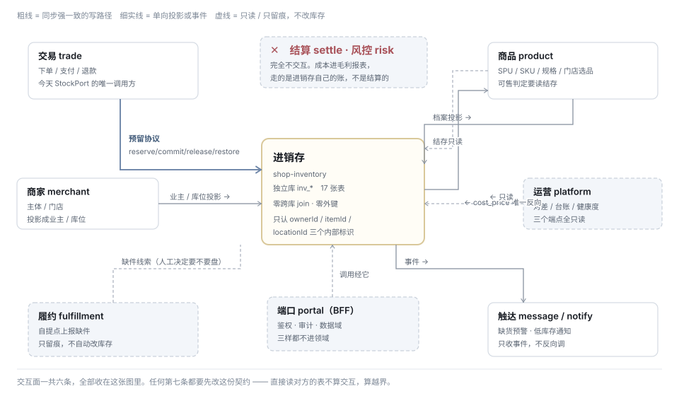

# 进销存 · 与其他模块的交互契约

> 状态：**草稿 · 待确认（本文是要被"确认"的那一份）** · 2026-08-26
> 回答三件：**接口**（谁调谁、同步还是异步、失败怎么办）· **数据库**（跨库的红线与归属）·
> **商品与库存的流程**（建品到下架的每一步，库存那边发生什么）
> 上游：[代码结构与现状对齐](./进销存-代码结构与现状对齐.md) · [API 与四层对齐](./进销存-API与四层对齐.md) ·
> [数据库表结构](./进销存-数据库表结构.md)

---

## 一、一句话

**交互面一共六条，且只有一条是写路径。**

任何第七条都要先改这份契约 —— **直接读对方的表不算交互，算越界**。

> 一条对现状有利的事实：`StockPort` 今天**全仓只有一个调用方**（`OrderServiceImpl`）。
> 交互面本来就小，这份契约是把它固定下来，不是去收拾一堆已有的连线。

---

## 二、六条交互契约

| # | 对方 | 方向 | 协议 | 同步性 | 幂等键 | 失败怎么办 |
|---|---|---|---|---|---|---|
| **1** | 交易 `trade` | 调 → 进销存 | **预留协议** `reserve/commit/release/restore` | **同步强一致** | `externalRef`（订单号 / 售后单号） | **拒单**，不放行（§六） |
| 2 | 商品 `product` | 商品 → 进销存 | 档案投影：`Item` `ItemRef` | 异步 + 补偿 | `(owner, AISHOP, skuNo)` | 建品照常成功，标记待投影，补偿任务重试 |
| 3 | 商品 `product` | **进销存 → 商品** | `cost_price` 回写（**唯一反向**） | 异步 | `itemId` | 重试；失败只影响毛利估算 |
| 4 | 商品 `product` | 商品 → 进销存 | `InventoryQueryPort` 读结存（可售判定） | 同步只读 | — | **按售罄处理**（§六） |
| 5 | 商家 `merchant` | 商家 → 进销存 | 投影：`Owner` `Location` | 异步 + 补偿 | `external_ref` | 同 2 |
| 6 | 触达 `message` | 进销存 → 触达 | 领域事件（`inv_outbox`） | 异步 | `event_no` | 重试队列，堆积可见 |

**只有第 1 条是写路径。** 2/3/5 是主数据同步，4/6 是读与通知。

### 2.1 预留协议的四个动作

| 动作 | 何时 | 对余额 | 产生什么 |
|---|---|---|---|
| `reserve(externalRef, lines, ttl)` | 下单 | `reserved +=` | 预留单 |
| `commit(externalRef)` | 支付成功 | `reserved -=`、`on_hand -=` | **一张 `SALE` 出库单 + 流水** |
| `release(externalRef)` | 取消 / 超时 | `reserved -=` | 无 |
| `restore(afterSaleNo, lines)` | **退货类售后完成** | `on_hand +=` | 一张 `RETURN` 入库单 + 流水 |

`restore` 是新增的 —— 它正是[全链路 §四 J4](./进销存-销售-财务-全链路与产品矩阵.md) 记下的缺口：
事件发了但 product 域没有消费者，退货退款后库存从不回补。

**`restore` 的触发判据是 `ord_after_sale.type`，不是「退款成功」**：
`REFUND_ONLY` 不回补（货没回来）、`RETURN_REFUND` 回补、`EXCHANGE` 一出一入。

### 2.2 旧签名怎么办

`StockPort` 的 `lock/release/confirm` **保留为默认方法转发**到新方法，
`SkuQty` 的形状不动 —— **交易域一行不改**，改的是实现在哪。

---

## 三、数据库：三条红线 + 归属变化

### 3.1 三条红线

| # | 红线 | 守卫 |
|---|---|---|
| 1 | **零跨库 join、零外键**。谁也不许直接读对方的表 | 写权守卫 + `invDataSource` 隔离 |
| 2 | **`inv_*` 只有 `shop-inventory` 能写** | 写权守卫（拦提交） |
| 3 | **进销存不认识平台的任何列名**：领域里不出现 `sku_no` / `entity_no` / `store_no` | 只在防腐层出现，评审看 |

### 3.2 平台侧列的归属变化

| 列 | 今天 | D2 之后 | 说明 |
|---|---|---|---|
| `prd_sku.stock` / `locked_stock` | 真源 | **只读缓存** | 真源移到 `inv_stock_balance`；保留是为了可售判定不必每次跨库 |
| `prd_sku.cost_price` | 无人维护 | **写权归进销存** | 由进货单驱动，平台侧无写入口 |
| `prd_sku.presale_quota` / `sold_count` | 真源 | **留平台**（待确认 ①） | 预售是销售策略，不是货 |
| `prd_store_stock` 整张表 | 真源 | **退役** | 店级 = 一个 `location`，不再有两套路径 |
| `prd_stock_lock` 整张表 | 真源 | **退役** | 由 `inv_reservation` 取代 |
| `mch_store.store_type` | —— | **不加** | 仓是 `inv_location.kind`，平台不需要知道哪个门店是仓 |

### 3.3 投影是投影，不是同步双写

| | 投影（我们做的） | 双写（不做） |
|---|---|---|
| 方向 | 单向，平台 → 进销存 | 双向 |
| 冲突 | 不存在（只有一个真源） | **静默覆盖，两边都不知道** |
| 失败 | 补偿重试，可对差 | 两边各自成功一半 |

**唯一的反向是 `cost_price`**，且它在平台侧**没有写入口** —— 反向只有一条且不可逆写，就不构成第二个真源。

---

## 四、商品与库存的流程

### 4.1 生命周期逐步

| # | 商品那边 | 库存这边 | 判据 |
|---|---|---|---|
| 1 | 建 SPU | 无 | SPU 不计数 |
| 2 | 生成 SKU 矩阵 | **每个 SKU 投影一个 `Item`，余额起始 0** | 保存即投影（已定） |
| 3 | 填条码 / 货号 / 单位 | 写 `inv_item_ref`；`sale_unit` → `base_uom` | 一个 SKU 可多条码 |
| 4 | 商品提交审核 | **无动作** | 审核是能不能卖，不是有没有货 |
| 5 | 门店选品上架 | **无动作** | 选品是可售，不是有货 |
| 6 | —— | 录入库单 → 过账 | **先入库再上架**，反过来买家只能看到售罄 |
| 7 | 下单 | `reserve` | 预留不进流水 |
| 8 | 支付 | `commit` → `SALE` 出库单 | —— |
| 9 | 退货类售后 | `restore` → `RETURN` 入库单 | 按 `type` 分三种 |
| 10 | 商品下架 | **无动作** | 下架不等于没货 |
| 11 | 商品删除 / 归档 | `Item` 归档，**流水保留** | 历史账要能查 |

### 4.2 改规格的六种情况

| 动作 | 库存这边 | 规则 |
|---|---|---|
| 加一档 | 新建 `Item`，余额 0 | 允许 |
| 改本店叫法 | **无影响** | `value_no` 不变 |
| **删一档** | `Item` 上可能还有余额 | **有余额则拦**，并告诉他还剩多少、在哪个库位 |
| 换主维度 | 大量归档 + 大量新建 | 要求先清零，或走「新建商品」 |
| 改计量单位 | `base_uom` | **有流水后不可改** |
| 调整档位顺序 | 无影响 | 允许 |

### 4.3 门店与库位

| 商家那边 | 库存这边 |
|---|---|
| 新开门店 | 建 `Location(kind=STORE)`，各 `Item` 余额 0 |
| 门店停用 | `Location` 置 `DISABLED`，**余额还在且可查** —— 货没消失 |
| 门店删除 | 与「删一档」同规矩：**有余额则拦** |
| 建仓 | 建 `Location(kind=WAREHOUSE)`，不对 C 端露出 |
| 设发货源 | `source_location_id`，**不允许链式** |

### 4.4 三条禁止

| 禁止 | 为什么 |
|---|---|
| **改 `sku_no`** | 它是身份。改了之后历史订单行、流水、外部引用全部指向一个不存在的东西 |
| **合并两个 SKU** | 同上。要合并只能新建一个 + 两边各出库 |
| **建品时顺手写库存** | 建品是主数据，入库是业务动作。合在一起之后「这 100 件是哪天进的」永远答不出 |

---

## 五、履约那条：只留痕，不自动改库存

自提点上报缺件（`ful_shortage_report`）**不触发任何库存变动**，与它现有的口径一致
（类注释原话：「只留痕，不改状态、不退款」—— 责任在供货方还是承接方尚未定）。

**但它是盘点的线索**：D3 在盘点页给一个「按缺件上报建盘点单」的入口，
由人决定要不要盘。自动生成盘亏的话，责任判定就被系统替商家做了。

---

## 六、失败与降级（交互方案必须回答的那一半）

| 场景 | 处置 | 为什么 |
|---|---|---|
| **`reserve` 超时 / 进销存挂了** | **拒单**，不放行 | 放行就是超卖。而下不了单**今天进程内挂了也一样** —— 不是新增的失败模式 |
| `commit` 失败 | 停在已支付未出库，**由补偿任务重试**；不回滚支付 | 钱已经收了，回滚支付比重试出库贵得多 |
| `release` 失败 | 不管 —— **`expires_at` 会兜底回收** | 跨进程之后兜底必须在本领域内 |
| `restore` 失败 | 重试；连续失败进运营的异常单 | 少补一件货比重复补一件安全 |
| **可售判定读不到结存** | **按售罄处理** | 「少卖是可恢复的，超卖不是」—— 这句话是 `StockPortImpl.hasStoreStock` 的注释原话，同一个判据 |
| 档案投影失败 | **建品照常成功**，标记待投影 + 补偿重试 | 建品不该被库存挡住 |
| `cost_price` 回写失败 | 重试；失败只影响毛利估算 | 不影响任何交易 |
| 报表 / 台账查不到 | 空页 + 明确提示 | 不要显示 0，0 与「查不到」是两件事 |

**熔断的方向是拒绝，不是放行。** 这一条要写进代码注释 ——
默认「失败即放行」是限流/熔断库的常见默认值，而它在库存上就是超卖。

---

## 七、不交互的模块（明说，免得有人去连）

| 模块 | 为什么不 |
|---|---|
| **结算 `settle`** | 结算算的是钱，进销存算的是货。成本进的是**进销存自己的毛利报表**，不是结算单 |
| **风控 `risk`** | 库存不是风控信号 |
| **营销 `marketing`** | 拼团、活动都经**订单**走预留，不直接调进销存 |
| **通道 `channel`** | 无关 |

---

## 八、待确认（这份契约要"确认"的就是这几条）

> ⚠️ **取值已定**，见[决策记录](./进销存-决策记录.md)（2026-08-26「一切都先按照建议执行」）。
> 本节原文保留 —— 它记录的是当时的权衡，不是当前取值。

| # | 决策 | 影响 |
|---|---|---|
| ① | **预售额度留平台还是进进销存** | 我倾向留平台：它是销售策略不是货。进来的话，`available` 就要多一个口径 |
| ② | `prd_sku.stock` 作为只读缓存**保不保** | 保：可售判定不跨库，但要防漂（对差看板长期保留）。不保：每次可售判定跨库读 |
| ③ | 缺件上报要不要自动建盘点草稿 | 我倾向只给入口不自动建 —— 自动生成盘亏等于系统替商家判了责任 |
| ④ | `commit` 失败时的补偿窗口多长 | 影响运营端异常单的口径 |
| ⑤ | 投影延迟的可接受上限（建品后多久必须能入库） | 我倾向 **同步投影 + 失败降级为异步**，这样常态下建完就能入库 |

---

确认记录：待用户确认
