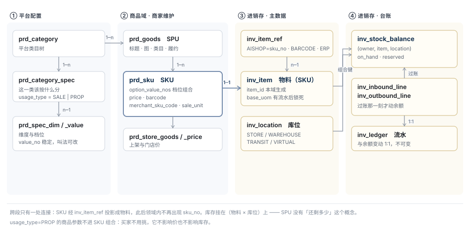
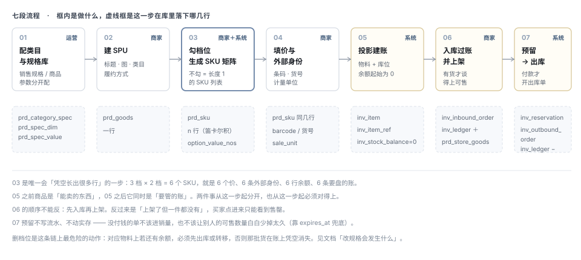

# 从建品到出入库 · 流程与对象关联

> 状态：**草稿 · 待评审** · 2026-08-26
> 把商品 · 规格 · SPU · SKU · 入库 · 出库 串成一条链，并说清每一环怎么关联到下一环。
> 上游：[TDD-规格与SKU模型](./TDD-规格与SKU模型.md)（规格库四层）·
> [进销存-领域对象详解](./进销存-领域对象详解.md)（字段级）· [TDD-进销存领域模型](./TDD-进销存领域模型.md)（聚合根）
> 可视化版：[从建品到出入库](https://claude.ai/code/artifact/17d24225-f068-4ec4-96ec-7cb77f0ddd76)
> ⚠️ **2026-08-28 核实：第三节的 05 与 07 两段今天在线上是断的**，
> 本文其余部分（对象关联、基数、关联键）逐条核过，与代码和库一致。
> 断点与界面表现见 [商品到库存的流转](https://claude.ai/code/artifact/722b10d1-0209-49ac-b6dc-bb9bf2725cea)，
> 结论见下方「§三 补注」。

---

## 一、一句话

**建品是把「能卖的东西」定义出来，建账是把「要管的账」立起来 —— 两件事在 SKU 这一点交汇，此后必须永远对得上。**

链上一共七段，跨域的连接**只有一处**：SKU 经外部引用投影成物料。

---

## 二、对象关联



| 从 | 到 | 基数 | 关联键 | 说明 |
|---|---|---|---|---|
| `prd_category` | `prd_category_spec` | 1─n | `category_no` | 这一类该按什么分 |
| `prd_category_spec` | `prd_spec_dim` | n─1 | `dim_code` | 维度是全平台共用的 |
| `prd_spec_dim` | `prd_spec_value` | 1─n | `dim_code` | 档位，`value_no` 稳定 |
| `prd_category` | `prd_goods` | 1─n | `category_no` | 商品归类，决定能配哪些规格 |
| `prd_goods` | `prd_sku` | 1─n | `goods_no` | **单规格也是 n=1，不是另一条路径** |
| `prd_sku` | `prd_spec_value` | n─n | `option_value_nos` | 档位组合，存的是编号不是叫法 |
| `prd_sku` | `inv_item_ref` | 1─1 | `sku_no` → `system='AISHOP'` | **跨域唯一的连接点** |
| `inv_item_ref` | `inv_item` | n─1 | `item_id` | 一个物料可有多条引用（平台 / ERP / 条码） |
| `inv_item` ＋ `inv_location` | `inv_stock_balance` | 1─1 | 组合键 | **库存挂物料 × 库位** |
| `inv_inbound_line` / `inv_outbound_line` | `inv_stock_balance` | n─1 | 过账时作用 | 单据行改余额 |
| `inv_stock_balance` | `inv_ledger` | 1─n | 每次变动一行 | 变动与流水 1:1 |

---

## 三、七段流程



| # | 谁 | 做什么 | 落下什么 |
|---|---|---|---|
| 01 | 运营 | 配类目，给类目绑销售规格与商品参数 | `prd_category_spec` · `prd_spec_dim/_value` |
| 02 | 商家 | 建 SPU：标题、图、类目、履约方式 | `prd_goods` 一行 |
| 03 | 商家＋系统 | 勾档位 → **笛卡尔积生成 SKU 矩阵** | `prd_sku` n 行 |
| 04 | 商家 | 逐 SKU 填价、条码、货号、计量单位 | 同样几行，补 `barcode` / `merchant_sku_code` / `sale_unit` |
| 05 | 系统 | **投影建账**：物料 + 库位 + 余额 0 | `inv_item` · `inv_item_ref` · `inv_stock_balance(0)` |
| 06 | 商家 | 录入库单 → 过账 → **再上架** | `inv_inbound_order(_line)` · `inv_ledger`＋ · `prd_store_goods` |
| 07 | 系统 | 下单预留 → 支付 → 自动开出库单 | `inv_reservation` → `inv_outbound_order` · `inv_ledger`− |

> ### 补注（2026-08-28 核实）
>
> **05「系统投影建账」不是一条活的路径。**
> `InventoryAclService.upsertItem()` 在生产代码里**只有一个调用点** ——
> `InventoryBackfillServiceImpl:271`，也就是搬运跑批；
> 商品域（`shop-core/product`）对进销存 ACL 的引用数是 **0**。
> 也就是说建 SKU 不会建账，只有跑批跑过的那一刻才建。
>
> 今天还没出事：线上 208 个未删 SKU / 207 件物料，账外 0 个 ——
> 因为最后一个 SKU 建于 08-23，早于 08-28 16:03 那次搬运。
> **下一个商家建品时才会**：那个 SKU 不出现在库存里，看不到、盘不着、进不了货，
> 而任何地方都不会报错。
>
> 两条路：① 建 SKU 时发事件，进销存侧消费后建账（保持两个模块互不认识）；
> ② 把跑批挂成常驻调度，接受最长一个周期的延迟。
>
> **07「下单预留 → 支付 → 自动开出库单」只在 `stock-authority=DUAL` 时接通。**
> 线上是 `PLATFORM`，镜像事件一条都不发，所以进销存这本账**只进不出**：
> 报表上「销」恒为 0，而「账对得上」仍然是绿的 ——
> 那个绿是真的（等式在这本账里成立），它对不上的是另一本账，而那一屏看不到那一本。

**三段值得单独说：**

- **03 是唯一会「凭空长出很多行」的一步。** 3 档 × 2 档 = 6 个 SKU，
  就是 6 个价、6 条外部身份、6 行余额、**6 条要盘的账**。
  建品页在加维度时必须当场显示这个数 —— 商家点之前应该知道代价。
- **05 是分水岭。** 之前商品是「能卖的东西」，之后它同时是「要管的账」。
  两件事从这一步起分开，也**从这一步起必须对得上**。
- **06 的顺序不能反：先入库，再上架。** 反过来是「上架了但一件都没有」，
  买家点进来只能看到售罄 —— 而那次点击是花钱买来的。

---

## 四、八条关联规则

| # | 规则 | 防住什么 |
|---|---|---|
| 1 | **库存挂 SKU，不挂 SPU** | SPU 没有「还剩多少」这个概念。挂上去之后，「大米还有 80」到底是哪个规格没人答得出 |
| 2 | **单规格 = 长度 1 的 SKU 列表** | 分叉之后，订单、库存、对账全链路都要判两次「这是单品还是多规格」 |
| 3 | **SKU 的身份是 `sku_no`，不是档位组合**；改规格时**只有组合精确命中才复用 `sku_no`** | 前缀或单行回落继承的是价与库存（可重填），而 `sku_no` 是身份：两行拿同一编号，历史订单与库存流水就指向了错的规格 |
| 4 | **档位存编号（`value_no`）不存叫法** | 商家把「大份」改叫「家庭装」，跨店比价、报表归并、ERP 对接一个都不该受影响 |
| 5 | **商品参数（`usage_type=PROP`）不进笛卡尔积** | 产地、保质期不影响价也不影响库存。进了组合，每加一个产地 SKU 数就翻一倍 |
| 6 | **SKU ↔ 物料 1:1，靠 `inv_item_ref`** | 领域内不出现 `sku_no`；出现一次，独立交付就少一分 |
| 7 | **入库/出库作用在（物料 × 库位），不是 SKU** | 同一个 SKU 在三个库位有三行余额。写成「给这个 SKU 入 100」，第二家店开门即无货 |
| 8 | **`sale_unit` → `base_uom` 有流水后锁死** | 从「件」改成「斤」，历史数字一个不变而含义全变，**且没有任何地方会报错** |

---

## 五、改规格会发生什么

**这是整条链上最容易出事的一步**，因为它同时动商品域与进销存域，而两边的约束不同。

| 动作 | 商品域 | 进销存域 | 规则 |
|---|---|---|---|
| **加一档** | 新增若干 `prd_sku` 行 | 新建物料，余额起始 0 | 直接允许 |
| **改本店叫法** | `label_override` | **无影响** | `value_no` 不变，这正是编号存在的理由 |
| **删一档** | 对应 SKU 行删除 | 物料上**可能还有余额** | ★ **有余额不允许删** |
| **换主维度** | 组合全变，等同重建 | 大量物料要归档、大量新建 | 要求先清零，或走「新建商品」 |
| **改计量单位** | `sale_unit` | `base_uom` | **有流水后不可改** |
| **调整档位顺序** | 排序列 | 无影响 | 直接允许 |

### 「有余额不允许删」这条要展开

删掉「5 斤装」这一档，平台侧只是少了几行 SKU；
但进销存侧那个物料上可能还压着 40 袋货。三条路，**只有前两条可选**：

| 处置 | 结果 |
|---|---|
| ① 先出库（报损 / 领用 / 调拨走） | 账上说得清：这 40 袋去哪了 |
| ② 转移到保留的档位（一次调整单） | 账上说得清：并到「10 斤装」了 |
| ~~③ 直接删~~ | **那 40 袋在账上凭空消失**，且没有任何一行记录能解释 |

所以界面上的规则是：**删档位前先查余额，有余额就拦住并告诉他还剩多少、在哪个库位。**
拦住的成本是他多点两下；不拦的成本是这家店的账从此对不上，而且**没人知道是从哪一天开始的**。

---

## 六、可售 ≠ 有库存

「能不能卖」是五个条件的与，库存只回答其中一个：

```
可售 =  商品审核通过        prd_goods.audit_status = PASS
     ∧ SPU 已上架          prd_goods.on_sale = 1
     ∧ 本店已选品上架       prd_store_goods.on_sale = 1
     ∧ 端与类目允许         sys_channel_category_rule ／ sellable_override
     ∧ ( available > 0                          ← 库存只管这一项
        ∨ 预售额度未用完 ∧ 未过截单 )
```

| 约束 | 防住什么 |
|---|---|
| 「可售」**不存进库存余额** | 可售是销售策略（预售、限购、渠道），会因促销规则而变。存进库存域之后，改一次促销要改库存 |
| 判定顺序固定：先审核与上架，后库存 | 未上架的商品不该因为「有货」而出现在任何列表里 |
| 预售是**库存之外的额度**，不是负库存 | 见 `presale_quota` / `sold_count`。做成允许负库存的话，「还能卖多少」全链路失去意义 |

---

## 七、待确认

> ⚠️ **取值已定**，见[决策记录](./进销存-决策记录.md)（2026-08-26「一切都先按照建议执行」）。
> 本节原文保留 —— 它记录的是当时的权衡，不是当前取值。


| # | 决策 | 挡住谁 |
|---|---|---|
| ① | 删档位时余额不为零：**拦住** 还是 **允许并强制生成一张报损单** | 建品页交互。倾向拦住 —— 自动报损会让账上多出商家没想过的损失 |
| ② | 05 投影的触发时机：建品保存即投影，还是首次入库时才投影 | 会不会产生大量「零余额零动过」的物料。倾向**保存即投影**，让"有没有这件货"只有一个答案 |
| ③ | 商家删商品（整个 SPU）时，物料是归档还是保留 | 倾向归档但**不删流水** —— 历史账要能查 |

---

确认记录：待用户确认
