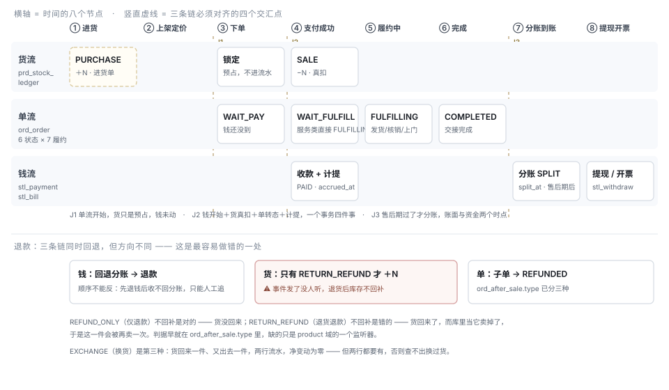

# 进销存 · 电商销售 · 财务报表 —— 全链路与产品矩阵

> 状态：**草稿 · 待评审** · 2026-08-26
> 性质：**合成文档**。三条链各自都有设计文档，缺的是它们怎么咬合、在哪咬不上
> 上游：[TDD-进销存与经营报表](./TDD-进销存与经营报表.md)（货账详细设计）·
> [收款与分账-总体逻辑](./收款与分账-总体逻辑.md)（钱账）·
> [订单状态-统一整理](../reference/订单状态-统一整理.md)（单流）·
> [TDD-资金到账可见性与四轴对账](../TDD-资金到账可见性与四轴对账.md)（对账）

---

## 一、一句话

**三条链（货 / 单 / 钱），四个交汇点，四张账。**

「财务报表」不是多做几张表，是**让四张账之间的六个等式能被验证**。
等式对不上的时候，能立刻指出是哪一条断了、断在哪一段 —— 这才是报表的用处。

---

## 二、总览

图上看不出来的四件事：

1. **三条链的起点不同**。货流从进货就开始了（商家自己花的钱），
   单流从下单开始，钱流从支付成功才开始 —— **下单不是钱流的起点**，
   这就是为什么"待付款订单"不能进任何一张财务报表。
2. **J2（支付成功）是一个事务里的四件事**：收款落账、库存真扣、订单转态、计提。
   四件里少任何一件，四张账当场对不上，且事后无法回补。
3. **计提（`accrued_at`）与分账（`split_at`）是两个时点**。
   账面上商家那一刻就赚到了，钱要等售后期过。**财务报表必须说清自己站在哪个时点上** ——
   这是商家问「我明明卖了 1 万，怎么只能提 6 千」的全部答案。
4. **退款时三条链的回退方向不同**，见 §四 J4 —— 那里现在有一个真实缺口。

---

## 三、三条链

### 3.1 货流 —— 「这批货在哪、还剩多少」

| 段 | 触发 | 落表 | 凭证 | 现状 |
|---|---|---|---|---|
| 进货 | 商家录进货单 | `prd_purchase_note/_item` + 一行 `PURCHASE` 流水 | 进货单 | ❌ P2 |
| 在库 | —— | `prd_sku.stock` / `prd_store_stock` | —— | ✅ |
| 预占 | 下单 | `prd_stock_lock`（**不进流水**） | —— | ✅ |
| 出库 | 支付成功 `confirm` | `stock` 真扣 + 一行 `SALE` | 订单 | ⚠️ 扣减有，流水无 |
| 退回 | 售后 `RETURN_REFUND` | 一行 `REFUND` | 售后单 | ❌ 见 §四 J4 |
| 盘点 / 报损 | 商家 | 一行 `ADJUST` / `SCRAP` | 盘点原因枚举 | ❌ P1 |
| 调拨 | 商家 | 两行 `TRANSFER_OUT/IN` | 调拨单 | ❌ P3 |

**真源**：`prd_sku.stock` / `prd_store_stock`（结存）+ `prd_stock_ledger`（证据，P1 新增）。

### 3.2 单流 —— 「这单走到哪了」

6 个抽象状态 × 7 种履约方式，**状态集合封闭，履约集合开放**。

`WAIT_PAY → WAIT_FULFILL`（实物）/ `FULFILLING`（服务）/ `COMPLETED`（虚拟即时）
`→ FULFILLING → COMPLETED`；旁支 `CANCELLED`（未付款终止）/ `REFUNDED`（付款后退回）。

**真源**：`ord_order` / `ord_sub_order`（子单是结算与售后的粒度）/ `ord_status_log`。

> 子单是关键：**结算、售后、分账都按子单走**，不是按订单。
> 一笔跨商家的订单拆成多个子单，各自的履约门店、结算主体、售后期都不同。

### 3.3 钱流 —— 「钱到哪了、能不能提」

| 段 | 时点 | 落表 | 现状 |
|---|---|---|---|
| 收款 | 支付成功 | `stl_payment`（PAID） | ✅ |
| **计提** | 同上，`accrued_at` | `stl_bill`（PENDING，含费率快照） | ✅ |
| 分账 | **售后期后**，`split_at` | `stl_split_log` + `stl_bill.SPLIT` | ✅ |
| 到账 | 通道回执 | 「发出」与「到账」已拆开 | ⚠️ 见四轴对账 TDD |
| 退款回退 | 售后同意 | 先 `reverseSplit` 再 `refund`，顺序不能反 | ✅ |
| 提现 | 商家申请 → 运营审批 | `stl_withdraw` | ✅ |
| 费率 | —— | `stl_fee_rule` + `stl_bill` 快照 | ✅ |
| 对账 | 每 10 分钟 | `ReconScanJob` → `stl_recon_diff` | ✅ |
| 平台自营应付 | `business_mode=SELF_OPERATED` | `stl_bill` 另一条状态机 + `stl_purchase_invoice` | ✅ |

**真源**：`stl_payment`（收）/ `stl_bill`（算）/ `stl_split_log`（分）/ `stl_withdraw`（提）。

> **两个"进货"不是一回事，不能合并**：
> 平台自营向供应商采购走**钱账**（要出票、要付款、进应付账款）；
> 商家自己的进货走**货账**（只影响他的成本估算，平台不出一分钱）。
> 合并的话，商家录一张进货单会在平台的应付账款里凭空长出一笔。

---

## 四、四个交汇点

| 点 | 三条链各做什么 | 必须同时成立 | 现状 |
|---|---|---|---|
| **J1 下单** | 单：`WAIT_PAY` · 货：**预占** · 钱：不动 | 预占不是变动，不能进流水也不能进报表 | ✅ |
| **J2 支付成功** | 单：转态 · 货：真扣 + `SALE` · 钱：`stl_payment` + `stl_bill` 计提 | **一个事务四件事**，少一件四张账当场不平 | ⚠️ 缺 `SALE` 流水（P1 补） |
| **J3 售后期后** | 单：已 `COMPLETED` · 货：无动作 · 钱：分账 `split_at` | 账面（计提）与资金（分账）是两个时点，报表要说清站在哪个上 | ✅ |
| **J4 退款** | 单：`REFUNDED` · 钱：回退分账 → 退款 · 货：**按售后类型决定** | 三条链方向不同，见下 | ❌ 货流这一半没接 |

### J4 的缺口 —— 退货退款后库存不回补

`AfterSaleServiceImpl.doRefund` 的注释写着「③ 子单转 REFUNDED，发事件（下游据此回补库存、调整评分）」，
事件 `OrderEvents.AfterSaleRefunded` 也确实发了 —— **但 product 域没有任何消费者**
（全仓引用只在 trade 自己和一个测试里）。

后果按售后类型分三种，而 `ord_after_sale.type` 早就把它们分开了：

| 类型 | 货回来了吗 | 该不该 `+N` | 现状 | 后果 |
|---|---|---|---|---|
| `REFUND_ONLY` 仅退款 | 否 | **不该** | 不回补 | ✅ 对 |
| `RETURN_REFUND` 退货退款 | 是 | **该** | 不回补 | ❌ **库里当它卖掉了，这一件会被再卖一次** |
| `EXCHANGE` 换货 | 回一件、出一件 | 两行，净变动零 | 不回补 | ❌ 查不出换过货 |

**判据在库里，缺的只是 product 域的一个监听器**。这条与 P1 同期做 ——
它正好是流水的第一个真实消费者：没有流水，「换货」这种净变动为零的事根本无处记录。

---

## 五、四张账与六个等式

### 5.1 四张账

| 账 | 回答什么 | 真源 | 谁看 |
|---|---|---|---|
| **货账** | 进了多少、卖了多少、还剩多少、损了多少 | `prd_stock_ledger` + 结存 | 商家 |
| **销账** | 卖了多少钱、多少单、客单价、毛利 | `ord_order` + `rpt_daily_*` | 商家 · 平台 |
| **钱账** | 收了多少、扣了什么、到账多少、能提多少 | `stl_payment` / `stl_bill` / `stl_split_log` | 商家 · 平台财务 |
| **税账** | 开了多少票、进项多少 | `ord_invoice_request` / `stl_settle_invoice` / `stl_purchase_invoice` | 平台财务 |

**四张账不是四个报表页，是四种口径。** 同一个「卖了多少」，
在销账里是订单金额，在钱账里是收款金额，在税账里是开票金额 —— 三个数天生不同，
**报表必须标明自己是哪一张账**，否则商家会拿两个口径的数互相对，然后来问客服。

### 5.2 六个等式 —— 报表的验收标准

| # | 等式 | 断了说明什么 | 现在能验吗 |
|---|---|---|---|
| **E1** | 货账 `SALE` 数量 == 销账已支付订单行数量（同店同期） | J2 的事务漏了一件；或有人绕过流水改库存 | ❌ 缺流水 |
| **E2** | 期初 + 进 − 销 − 损 ± 调 == 期末结存 | 流水与结存脱节（`stock_after` 自校验） | ❌ 缺流水 |
| **E3** | 销账 GMV == 钱账 Σ`gross_minor`（同期，已支付口径） | 有订单收到钱没落账，或反之 | ⚠️ 两边各写 SQL，没人对过 |
| **E4** | `net` == `gross` − 佣金 − 服务费 − 通道费 − 积分费 | 费率快照被改、或算式重算过 | ✅ 字段齐，缺一张对账页 |
| **E5** | 可提现 == Σ分账成功 − Σ已提现 − 冻结 | 提现超额，或分账"发出≠到账" | ⚠️ 四轴对账 TDD 正在做 |
| **E6** | 开票额 ≤ 销账 GMV；进项票 ≤ 采购额 | 虚开或漏票 | ⚠️ 数据齐，无校验 |

> **E3 是最容易被忽略、也最容易出事的一条。** 现在
> `BizDashboardController.stats` 与 `stl_bill` 各写各的 SQL，
> 谁都没有义务和对方一致 —— 商家看到经营数据 1 万、结算单 9 千 8 时，
> **平台内部也没有一个地方能说出这 200 块差在哪**。
> 修法不是加一张对账页，是让两边共用一个口径方法（[TDD-进销存与经营报表 §5.4](./TDD-进销存与经营报表.md)）。

### 5.3 财务报表清单

| 端 | 报表 | 口径（哪张账） | 现状 |
|---|---|---|---|
| B | 我的收入 / 结算单 / 对账单 | 钱账 | ✅ `/biz/settle/{income,bills,statement}` |
| B | 经营日报（订单/GMV/客单价） | 销账 | ⚠️ 实时有，无历史与趋势 |
| B | 毛利表（估算） | 销账 × 货账 | ❌ P2，依赖进货单 |
| B | 进销存月报（进/销/存/损） | 货账 | ❌ P2 |
| Ops | 平台收入（佣金 + 服务费） | 钱账 | ✅ 看板 + 下钻 |
| Ops | 应付商家 / 积分池负债 / 通道费成本 | 钱账 | ✅ `/finance` 各 tab |
| Ops | 自营应付账款 + 进项票 | 钱账 × 税账 | ✅ `OpsPayableController` |
| Ops | 四轴对账差异 | 钱账 | ⚠️ TDD 待确认 |
| Ops | 库存健康度（负库存 / 零库存在架 / 90 天未动销） | 货账 | ❌ P2 |

---

## 六、产品矩阵

**图例**：✅ 已实现 · ⚠️ 部分（备注说明差在哪）· ❌ 缺 · — 不适用
**档位**：`FREE` / `PRO` / `CHAIN`（见 [TDD-进销存与经营报表 §六](./TDD-进销存与经营报表.md)）

> ⚠️ 运营端一列的口径：`ops-web` 有页面 ≠ 后端有端点。
> ops-web 默认走 mock 且**从未上线**，本表的 ✅ 以**后端 Controller 存在**为准。

### 6.1 进（采购与成本）

| 功能点 | C | B | Ops | 现状 | 期 | 档 |
|---|---|---|---|---|---|---|
| 商家进货单 | — | ✅ | — | ❌ | P2 | PRO |
| SKU 成本价 | — | ✅ | — | ⚠️ 列有（`cost_price`），**无任何入口在维护** | P2 | PRO |
| 平台自营采购 / 应付账款 | — | — | ✅ | ✅ `OpsPayableController`（只登记不划转） | —— | — |
| 进项票核验 | — | — | ✅ | ✅ `stl_purchase_invoice` | —— | — |
| 供应商档案 / 账期 | — | — | — | **不做**（§七） | —— | — |

### 6.2 存（库存与仓）

| 功能点 | C | B | Ops | 现状 | 期 | 档 |
|---|---|---|---|---|---|---|
| 主体库存 · 扣减防超卖 | 只读 | ✅ | ✅ | ✅ | —— | FREE |
| 门店级库存（覆盖层） | 只读 | ✅ | ✅ | ✅ V13 | —— | FREE |
| 预售额度与截单 | ✅ | ✅ | ✅ | ✅ V100 | —— | FREE |
| 锁定 / 释放 / 确认 | — | — | — | ✅ 三段幂等 | —— | — |
| **库存流水** | — | ✅ | ✅ | ❌ **地基** | **P1** | FREE |
| 盘点 / 调整 / 报损 | — | ✅ | — | ❌ | **P1** | FREE |
| 退货回补库存 | — | ✅ | — | ❌ 事件无消费者（§四 J4） | **P1** | FREE |
| 批量盘点单 | — | ✅ | — | ❌ | P3 | PRO |
| 仓（`store_type`）与调拨 | — | ✅ | ✅ | ❌ | P3 | CHAIN |
| 缺货 / 滞销预警 | — | ✅ | — | ❌ | P2 | PRO |
| 库存健康度治理 | — | — | ✅ | ❌ | P2 | — |
| 批次与效期 | — | — | — | **不做**（模型级分叉，单独立项） | —— | — |

### 6.3 商品（SPU / SKU）

| 功能点 | C | B | Ops | 现状 | 期 | 档 |
|---|---|---|---|---|---|---|
| SPU / SKU（单规格 = 长度 1） | ✅ | ✅ | ✅ | ✅ | —— | FREE |
| 规格库四层 + 归一量 | ✅ | ✅ | ✅ | ✅ V195/V213 | —— | FREE |
| SKU 外部身份（条码/货号/单位） | — | ✅ | ✅ | ✅ V252 | —— | FREE |
| 商品参数（`usage_type=PROP`） | ✅ | ✅ | ✅ | ❌ 平台配了，商家端**没有容器** | 规格 TDD P3 | FREE |
| 标准品库引用建品 | — | ✅ | ✅ | ⚠️ TDD 待确认 | —— | FREE |
| 门店选品 / 门店价 | ✅ | ✅ | ✅ | ✅ | —— | PRO |
| 商品审核与强制下架 | — | — | ✅ | ✅ | —— | — |

### 6.4 销（交易）

| 功能点 | C | B | Ops | 现状 | 期 | 档 |
|---|---|---|---|---|---|---|
| 购物车 / 下单 / 6 状态 | ✅ | ✅ | ✅ | ✅ | —— | FREE |
| 子单拆分（跨商家） | ✅ | ✅ | ✅ | ✅ 结算与售后的粒度 | —— | — |
| 拼团 / 求团报价 | ✅ | ✅ | ✅ | ✅ | —— | FREE |
| 优惠券 / 活动 / 会员 | ✅ | ✅ | ✅ | ✅ | —— | PRO |
| 积分抵扣 | ✅ | ✅ | ✅ | ⚠️ **开关关着**（跨商家清算未定，ADR-006） | —— | — |
| 代客下单 / 取消 | — | — | ✅ | ✅ | —— | — |
| 自动关单 | — | — | ✅ | ✅ `OrderAutoCloseJob` | —— | — |

### 6.5 履约

| 功能点 | C | B | Ops | 现状 | 期 | 档 |
|---|---|---|---|---|---|---|
| 自提 / 自送 / 快递 / 核销 / 上门 | ✅ | ✅ | ✅ | ✅ 7 种 | —— | FREE |
| 分拣单 / 到货批次 / 配车 | — | ✅ | ✅ | ✅ | —— | FREE |
| 运费模板 / 超区 | ✅ | ✅ | ✅ | ✅ | —— | FREE |
| 缺货报备 | — | ✅ | ✅ | ✅ `ful_shortage_report` | —— | FREE |
| 快递轨迹 / 三方运力 | ✅ | ✅ | ✅ | ✅ | —— | PRO |

### 6.6 售后

| 功能点 | C | B | Ops | 现状 | 期 | 档 |
|---|---|---|---|---|---|---|
| 仅退款 / 退货退款 / 换货 | ✅ | ✅ | ✅ | ⚠️ **类型齐，货流那一半没接** | P1 | FREE |
| 平台介入裁决 | ✅ | — | ✅ | ✅ | —— | — |
| 退款回退分账 | — | — | ✅ | ✅ 顺序不能反 | —— | — |
| 极速退阈值 | — | — | ✅ | ✅ | —— | — |

### 6.7 收款与结算

| 功能点 | C | B | Ops | 现状 | 期 | 档 |
|---|---|---|---|---|---|---|
| 微信支付 / 线下 / COD | ✅ | ✅ | ✅ | ✅ | —— | FREE |
| 收款商户号（门店级） | — | ✅ | ✅ | ✅ | —— | PRO |
| 计提 → 分账 → 到账 | — | ✅ | ✅ | ✅ 两个时点已分开 | —— | — |
| 分档费率与服务费 | — | ✅ 只读 | ✅ | ✅ `stl_fee_rule` + 快照 | —— | — |
| 提现申请与审批 | — | ✅ | ✅ | ✅ `stl_withdraw` | —— | — |
| 对账自查 / 掉单补偿 | — | — | ✅ | ✅ `ReconScanJob` | —— | — |
| 四轴对账（收/分/出/积分池） | — | — | ✅ | ⚠️ TDD 待确认 | —— | — |
| 自营 vs 第三方双轨 | — | — | ✅ | ✅ `business_mode` | —— | — |

### 6.8 票据与税

| 功能点 | C | B | Ops | 现状 | 期 | 档 |
|---|---|---|---|---|---|---|
| 买家开票申请 | ✅ | — | ✅ | ✅ `ord_invoice_request` | —— | — |
| 结算发票（平台↔商家） | — | ✅ | ✅ | ✅ `stl_settle_invoice` | —— | — |
| 进项票（自营采购） | — | — | ✅ | ✅ `stl_purchase_invoice` | —— | — |

### 6.9 报表与统计

| 功能点 | C | B | Ops | 现状 | 期 | 档 |
|---|---|---|---|---|---|---|
| 经营数据（今日/本月） | — | ✅ | — | ⚠️ 实时，无历史 | P2 | FREE |
| 日快照 `rpt_daily_*` | — | ✅ | ✅ | ❌ | P2 | FREE |
| 动销 / 滞销 / 毛利榜 | — | ✅ | — | ❌ | P2 | PRO |
| 进销存月报 | — | ✅ | — | ❌ | P2 | PRO |
| 跨店总览与对比 | — | ✅ | — | ✅ `cross_store_stats` | —— | CHAIN |
| 平台看板与下钻 | — | — | ✅ | ✅ | —— | — |
| CSV 导出（订单/商品/流水/日报） | — | ✅ | ✅ | ❌ | P4 | PRO |

### 6.10 对接

| 功能点 | C | B | Ops | 现状 | 期 | 档 |
|---|---|---|---|---|---|---|
| Open API（商品/订单/流水/库存同步） | — | ✅ | ✅ | ❌ **需先拍板** | P5 | CHAIN |
| `stock_authority`（真相源归属） | — | ✅ | ✅ | ❌ | P5 | CHAIN |

---

## 七、单据矩阵

**一条通则**：**单据可以作废，不可以修改；流水只能追加，不能撤销。**
改单据等于改历史，而历史正是这些表存在的理由。

| 单据 | 谁开 | 改动什么 | 作废方式 | 幂等键 |
|---|---|---|---|---|
| 订单 / 子单 | 买家 | 单流状态 | 取消（未付）/ 退款（已付） | 订单号 |
| 售后单 | 买家 | 单流 + 钱流 + 货流 | 撤销申请 | 售后单号 + `refund_payment_no` |
| 进货单（P2） | 商家 | 货流 `+N`、`cost_price` | **反向进货单**，不删原单 | 进货单号 |
| 盘点（P1） | 商家 | 货流 `±N` | 再盘一次 | `(ADJUST, 盘点单号, sku, store)` |
| 调拨单（P3） | 商家 | 货流两行 | 反向调拨 | 调拨单号 |
| 结算单 `stl_bill` | 系统 | 钱流计提 | 回退分账 | `uk_sub_order` |
| 分账流水 | 系统 | 钱流实际划转 | `reverseSplit` | 子单号 |
| 提现单 | 商家 → 运营 | 钱流出金 | 审批驳回 | 提现单号 |
| 发票（买家/结算/进项） | 三方各一 | 税账 | 红冲 | 各自单号 |

---

## 八、不做什么

| 不做 | 为什么 |
|---|---|
| 把商家进货并进平台应付账款 | 两个"进"在不同的账上（§3.3）。合并会让商家录一张单在平台应付里长出一笔 |
| 供应商档案 / 账期 / 对账单 | 小店的供应商是微信里那个人 |
| 批次与效期 | 库存从"一个数"变成"一组批次"，扣减要选批次 —— 模型级分叉，单独立项 |
| 总账 / 凭证 / 科目表 | 那是会计系统。我们出的是**业务口径报表**，不是记账凭证 |
| 让业务系统划转对公账户 | 自营应付只登记不划转 —— 任何一家公司的财务都不会同意 |
| 把四张账合成一张"财务总表" | 四个口径天生不同（§5.1）。合成一张的代价是每个数都要加脚注，而没人读脚注 |
| 用订单反推库存 | 退货、盘亏、报损、调拨、进货都不在订单里，反推必然对不上 |

---

## 九、待确认

> ⚠️ **取值已定**，见[决策记录](./进销存-决策记录.md)（2026-08-26「一切都先按照建议执行」）。
> 本节原文保留 —— 它记录的是当时的权衡，不是当前取值。

| # | 决策 | 挡住谁 |
|---|---|---|
| ① | `EXCHANGE`（换货）落两行流水还是不落 | P1 的监听器。倾向落两行：净变动为零但要查得出换过货 |
| ② | E3（销账 == 钱账）以谁为准 | P2 的口径统一。倾向以**钱账**为准 —— 钱是外部事实，销账是我们自己的记录 |
| ③ | 商家侧报表默认站在哪个时点：计提还是分账 | P2 的界面。倾向**两个都给**并分别命名（「已赚到」/「可提现」） |
| ④ | 进货与毛利放 `PRO` 还是 `FREE` | 见 TDD-进销存与经营报表 §十③ |
| ⑤ | Open API 是否解禁 | P5，见 TDD-进销存与经营报表 §十① |

---

## 十、开工顺序

**P1 一次做完货流的三个缺口**，它们互为前提：

- [ ] `prd_stock_ledger` + 回填 + `StockPortImpl` 写入点收口
- [ ] **退货回补库存监听器**（按 `ord_after_sale.type` 分三种）—— 流水的第一个真实消费者
- [ ] 盘点 / 调整入口（B 端，权限 `biz:stock`）
- [ ] E1 / E2 两条等式做成守卫，撤掉修复必须变红且点名

**P2 补上「进」与「账」**：进货单 → `cost_price` → 毛利 → 日快照 → 榜单 → E3 口径统一。

**P3 之后**：仓与调拨 → 导出 → Open API（待 ⑤）。

---

确认记录：待用户确认
