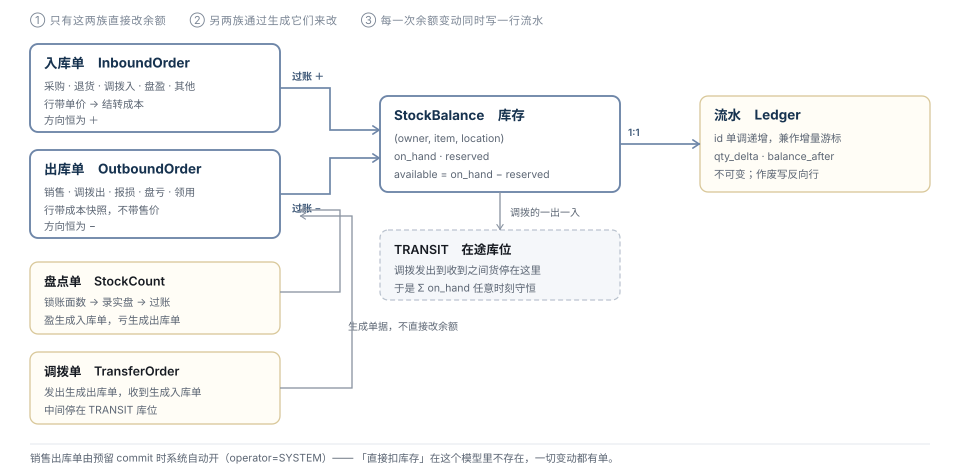

# 进销存 · 领域对象详解（字段级）

> 状态：**草稿 · 待评审** · 2026-08-26
> 这是 [TDD-进销存领域模型](./TDD-进销存领域模型.md) 的 L3：**逐个对象的字段、类型、约束、状态机**。
> 那份定的是聚合根与不变式（为什么这么切），这份定的是**每一列到底是什么**。
> **一处修正**：入库单与出库单在上一版被压成了一张 `Document` + `doc_type`，那是压过头了 —— 见 §1.2。

---

## 1. 总览

### 1.1 对象一览

| # | 对象 | 类型 | 身份 | 表 | 可变性 |
|---|---|---|---|---|---|
| 1 | Owner 业主 | 聚合根 | `owner_id` | `inv_owner` | 可变 |
| 2 | **SKU（Item 物料）** | **聚合根** | `item_id` | `inv_item` | 可变，**部分列锁死** |
| 3 | 外部引用 | 实体 | `(owner, system, ref)` | `inv_item_ref` | 可变 |
| 4 | SPU 商品 | 值对象（分组） | `spu_id` | `inv_item.spu_id` 一列 | 可变 |
| 5 | UoM 计量单位 | 值对象 | `uom_code` | 枚举 + `inv_uom_conv` | 只增 |
| 6 | Location 库位 | 聚合根 | `location_id` | `inv_location` | 可变 |
| 7 | **StockBalance 库存** | **★ 核心聚合根** | `(owner, item, location)` | `inv_stock_balance` | **并发可变** |
| 8 | Reservation 预留 | 聚合根 | `reservation_id` | `inv_reservation(_line)` | 状态机 |
| 9 | **InboundOrder 入库单** | **聚合根** | `inbound_no` | `inv_inbound_order(_line)` | 状态机，过账后锁 |
| 10 | **OutboundOrder 出库单** | **聚合根** | `outbound_no` | `inv_outbound_order(_line)` | 状态机，过账后锁 |
| 11 | StockCount 盘点单 | 聚合根 | `count_no` | `inv_stock_count(_line)` | 状态机 |
| 12 | TransferOrder 调拨单 | 聚合根（编排） | `transfer_no` | `inv_transfer_order` | 状态机 |
| 13 | StockLedgerEntry 流水 | 不可变实体 | `id` | `inv_ledger` | **只追加** |



### 1.2 修正：入库单与出库单要分开

上一版用「一张单据表 + `doc_type`，否则汇总要 union 六次」论证合并。
**那个论据是错的** —— 汇总本来就该查流水，不查单据。流水才是汇总的真源。

论据去掉之后，合并只剩坏处：两者**字段与状态机都不同**。

| | 入库单 | 出库单 |
|---|---|---|
| 方向 | 恒 ＋ | 恒 − |
| 行上有 | **进货单价**（结转成本的来源） | **成本快照**（由计价规则算出），**没有售价** |
| 特有字段 | 供应商、到货数 vs 实收数 | 去向、收货方、拣货信息 |
| 将来的中间态 | 待收货 / 部分收货 / 质检 | 待拣货 / 已拣 / 已发 |
| 谁开 | 人（采购）或系统（退货/盘盈/调拨入） | **系统（销售）** 或人（报损/调拨出） |

压成一张表之后，一半的列对另一半永远是 `NULL`，
而「这一列什么时候该有值」变成没人答得清的问题。

**保留的是那条通则**：无论几族单据，**改变余额的动作只有一个 —— 过账（`POST`）**。

---

## 2. SKU（Item 物料）

> 领域内叫 `Item`（原料、包材、五金件也要计数），零售形态下它**就是 SKU**。
> 下文一律写 SKU。

### 2.1 `inv_item`

```sql
CREATE TABLE inv_item (
    id                  BIGINT       NOT NULL AUTO_INCREMENT,
    item_id             VARCHAR(32)  NOT NULL COMMENT '本域业务键，自己生成。**不复用平台 sku_no**',
    owner_id            VARCHAR(32)  NOT NULL,
    item_code           VARCHAR(64)  DEFAULT NULL COMMENT '业主自己的货号，给人看的。可空',
    name                VARCHAR(128) NOT NULL COMMENT '品名',
    spec_text           VARCHAR(128) DEFAULT NULL COMMENT '规格描述「5斤装·精选」，展示用，不参与计算',
    spu_id              VARCHAR(32)  DEFAULT NULL COMMENT '同款分组，仅用于报表归类',
    category_code       VARCHAR(64)  DEFAULT NULL COMMENT '报表分组',
    base_uom            VARCHAR(16)  NOT NULL COMMENT '基本计量单位。★ 一旦有流水不可改',
    weighed             TINYINT      NOT NULL DEFAULT 0 COMMENT '1=称重品',
    track_batch         TINYINT      NOT NULL DEFAULT 0 COMMENT '留位，一期恒 0',
    shelf_life_days     INT          DEFAULT NULL COMMENT '留位',
    safety_stock        INT          NOT NULL DEFAULT 0 COMMENT '安全库存默认阈值，0=不预警',
    cost_method         VARCHAR(16)  NOT NULL DEFAULT 'LATEST' COMMENT 'LATEST 最新进价 / MANUAL 手工价（留位 MOVING_AVG/FIFO）',
    default_cost_minor  BIGINT       DEFAULT NULL COMMENT '当前成本，最小币种单位',
    source              VARCHAR(16)  NOT NULL DEFAULT 'SYNCED' COMMENT 'OWN 自有主数据 / SYNCED 从外部投影',
    status              VARCHAR(16)  NOT NULL DEFAULT 'ACTIVE' COMMENT 'ACTIVE / ARCHIVED',
    ...审计列...,
    UNIQUE KEY uk_item (owner_id, item_id),
    UNIQUE KEY uk_item_code (owner_id, item_code),
    KEY idx_spu (owner_id, spu_id)
);
```

| 列 | 约束 | 防住什么 |
|---|---|---|
| `item_id` | 本域生成，**不复用 `sku_no`** | 交付给没有 `sku_no` 的客户时，主键要重设计 —— 那是模型级返工 |
| `base_uom` | **有流水之后不可改** | 从「件」改成「斤」，历史那些数字一个不变而含义全变了，且**没有任何地方会报错** |
| `item_code` | `(owner, item_code)` 唯一，**允许多行 NULL** | 没填货号的 SKU 有的是；做成 NOT NULL 会逼人编一个 |
| `spu_id` | **只是一列，不是一张表** | 进销存不计数 SPU。做成实体会诱使人给 SPU 也算库存，而那个数没有意义 |
| `safety_stock` | 默认在 SKU 上，可被库位覆盖（§7） | 城西店和仓库的安全线不可能一样 |
| `source` | `OWN` / `SYNCED` | 两种交付形态的唯一分叉点（见上一篇 §三） |

### 2.2 `inv_item_ref` —— 外部引用

```sql
CREATE TABLE inv_item_ref (
    owner_id  VARCHAR(32) NOT NULL,
    system    VARCHAR(16) NOT NULL COMMENT 'AISHOP 平台 / ERP 商家自有 / BARCODE 条码 / POS 收银',
    ref       VARCHAR(64) NOT NULL,
    item_id   VARCHAR(32) NOT NULL,
    UNIQUE KEY uk_ref (owner_id, system, ref),
    KEY idx_item (owner_id, item_id)
);
```

- **一个 SKU 多条引用**：平台叫 `SKU123`、商家 ERP 叫 `LM-05`、条码 `690…`，三者都要能查到。
- `BARCODE` 允许**一个 SKU 多个条码**（换包装但还是同一件货），
  但**不允许一个条码指向两个 SKU** —— 唯一键管的就是这一条：扫一次出来两件货，收银台当场卡住。
- 平台侧的 `sku_no` 走 `system='AISHOP'` 进来，**领域里再没有第二处出现它**。

### 2.3 UoM 与换算

一期只做 `base_uom` 单一单位，`inv_uom_conv`（`item_id, from_uom, to_uom, factor`）**留位**。

> **为什么不一期就做多单位**：多单位一旦开启，库存的每个数都要问"这是几箱还是几瓶"，
> 而换算率一改，历史流水的含义又会跟着变。留位的成本是一张空表，做早的成本是全链路都要带单位。

---

## 3. 库存 StockBalance

### 3.1 `inv_stock_balance`

```sql
CREATE TABLE inv_stock_balance (
    id             BIGINT      NOT NULL AUTO_INCREMENT,
    owner_id       VARCHAR(32) NOT NULL,
    item_id        VARCHAR(32) NOT NULL,
    location_id    VARCHAR(32) NOT NULL COMMENT '★ 不可空。主体级库存 = 一个默认库位',
    on_hand        INT         NOT NULL DEFAULT 0 COMMENT '实存：这个库位上现在真有多少',
    reserved       INT         NOT NULL DEFAULT 0 COMMENT '已预留未出库',
    safety_stock   INT         DEFAULT NULL COMMENT '本库位阈值覆盖；空 = 用 inv_item.safety_stock',
    last_moved_at  DATETIME    DEFAULT NULL COMMENT '最近一次变动。滞销判定直接读它，不用扫流水',
    version        BIGINT      NOT NULL DEFAULT 0,
    ...审计列...,
    UNIQUE KEY uk_balance (owner_id, item_id, location_id),
    KEY idx_loc (owner_id, location_id)
);
```

**`available = on_hand − reserved`，派生不落库。**

| 约束 | 防住什么 |
|---|---|
| 三元组**无可空项** | 平台今天靠 `store_no` 可空表达「主体级」，那是覆盖层包袱。这里主体级就是一个 `kind=WAREHOUSE` 的默认库位 —— **一种表达而不是两种**，扣减不必先判走哪条路 |
| `available` 不落库 | 落库就有第三个数要维护，而三个数里错一个不会报警 |
| `on_hand` **允许为负吗：不允许** | 负库存会让"还能卖多少"全链路失去意义。出库超过实存直接拒，让人去补一张入库单 —— **让错误停在录入处，而不是流进报表** |
| 不存"可售" | 可售是销售策略（预售、限购、渠道），属于调用方 |
| 在途**不设列** | 在途 = `TRANSIT` 库位上的余额。设列的话「总量守恒」要跨列写，而列是可以忘了减的 |

### 3.2 三个数的关系

```
on_hand        实存        ← 只有单据过账能改
reserved       预留        ← 只有 Reservation 能改
available      可用        = on_hand − reserved      不允许为负（不变式 I1）
在途           in-transit  = TRANSIT 库位上的 on_hand  不是本行的列
```

---

## 4. 入库单 InboundOrder

### 4.1 `inv_inbound_order`

```sql
CREATE TABLE inv_inbound_order (
    inbound_no       VARCHAR(32)  NOT NULL COMMENT '业务键',
    owner_id         VARCHAR(32)  NOT NULL,
    location_id      VARCHAR(32)  NOT NULL COMMENT '入到哪个库位',
    source_type      VARCHAR(16)  NOT NULL COMMENT 'PURCHASE 采购 / RETURN 退货 / TRANSFER_IN 调拨入 / COUNT_GAIN 盘盈 / OTHER',
    source_ref       VARCHAR(64)  DEFAULT NULL COMMENT '来源单号：退货=售后单 / 调拨=调拨单 / 盘盈=盘点单；采购为空',
    supplier_name    VARCHAR(64)  DEFAULT NULL COMMENT '仅 PURCHASE。自由文本，不建供应商档案',
    status           VARCHAR(16)  NOT NULL DEFAULT 'DRAFT' COMMENT 'DRAFT / POSTED / VOIDED',
    total_qty        INT          NOT NULL DEFAULT 0,
    total_cost_minor BIGINT       NOT NULL DEFAULT 0 COMMENT '仅 PURCHASE 有意义',
    occurred_at      DATETIME     NOT NULL COMMENT '★ 实际入库时间，可回填，与 created_at 分开',
    posted_at        DATETIME     DEFAULT NULL,
    operator         VARCHAR(64)  DEFAULT NULL,
    remark           VARCHAR(255) DEFAULT NULL,
    ...审计列...,
    UNIQUE KEY uk_inbound (owner_id, inbound_no),
    KEY idx_src (owner_id, source_type, source_ref)
);

CREATE TABLE inv_inbound_line (
    inbound_no       VARCHAR(32) NOT NULL,
    line_no          INT         NOT NULL,
    item_id          VARCHAR(32) NOT NULL,
    qty              INT         NOT NULL COMMENT '实收数量',
    uom              VARCHAR(16) NOT NULL COMMENT '快照。base_uom 将来改了，历史行仍可解释',
    unit_cost_minor  BIGINT      DEFAULT NULL COMMENT '进货单价。PURCHASE 必填，其余可空',
    batch_no         VARCHAR(32) DEFAULT NULL COMMENT '留位',
    expire_at        DATE        DEFAULT NULL COMMENT '留位',
    UNIQUE KEY uk_line (inbound_no, line_no)
);
```

### 4.2 五种来源，谁开单

| `source_type` | 谁开 | `unit_cost` | 说明 |
|---|---|---|---|
| `PURCHASE` 采购 | **人** | **必填** | 没有单价，成本与毛利都算不出来 |
| `RETURN` 退货 | 系统（售后触发） | 用出库时的成本快照 | **只有退货类售后才开**，仅退款不开 |
| `TRANSFER_IN` 调拨入 | 系统（调拨单收货） | 结转自出库行 | 从 `TRANSIT` 入到目标库位 |
| `COUNT_GAIN` 盘盈 | 系统（盘点过账） | 用当前成本 | 盘盈不是"白得的货"，成本要有个口径 |
| `OTHER` | 人 | 可空 | 期初建账、赠品入库 |

### 4.3 状态机

```
DRAFT ──post──> POSTED ──void──> VOIDED
  └──delete──> （物理删除，仅 DRAFT 可删）
```

| 规则 | 防住什么 |
|---|---|
| **只有 `POST` 改余额**，`DRAFT` 一分不动 | 录一半的单不该影响可售数量 |
| `POSTED` 之后**行不可改**，只能整单作废重录 | 改单据 = 改历史。而历史正是这张表存在的理由 |
| 作废 = **写反向流水**，不删原流水、不改原单 | 见不变式 I3 |
| `occurred_at` 与 `created_at` 分开 | 商家周一补录上周五的进货。按录入时间算，上周的货会算进本周的报表 |
| 采购单价必填 | 允许空的话，`cost_method=LATEST` 会读到 NULL，毛利静默变成"等于售价" |

> **一期不做「部分收货」**（到货 100 收 98）。
> 但 `status` 与行上的 `qty` 已经为它留好：将来加 `expected_qty` 与 `PARTIAL` 态，
> **`POSTED` 仍然是唯一改余额的那一刻**，前面加多少中间态都不影响余额的正确性。

---

## 5. 出库单 OutboundOrder

### 5.1 `inv_outbound_order`

```sql
CREATE TABLE inv_outbound_order (
    outbound_no      VARCHAR(32)  NOT NULL,
    owner_id         VARCHAR(32)  NOT NULL,
    location_id      VARCHAR(32)  NOT NULL COMMENT '从哪个库位出',
    purpose          VARCHAR(16)  NOT NULL COMMENT 'SALE 销售 / TRANSFER_OUT 调拨出 / SCRAP 报损 / COUNT_LOSS 盘亏 / INTERNAL 领用 / OTHER',
    source_ref       VARCHAR(64)  DEFAULT NULL COMMENT 'SALE=订单号 / TRANSFER=调拨单 / COUNT_LOSS=盘点单',
    reservation_id   VARCHAR(32)  DEFAULT NULL COMMENT 'SALE 时来自哪张预留',
    reason_code      VARCHAR(16)  DEFAULT NULL COMMENT 'SCRAP 必填：BROKEN 损坏 / EXPIRED 过期 / GIFT 赠送 / OTHER',
    status           VARCHAR(16)  NOT NULL DEFAULT 'DRAFT',
    total_qty        INT          NOT NULL DEFAULT 0,
    total_cost_minor BIGINT       NOT NULL DEFAULT 0 COMMENT '结转出去的成本合计',
    occurred_at      DATETIME     NOT NULL,
    posted_at        DATETIME     DEFAULT NULL,
    operator         VARCHAR(64)  DEFAULT NULL COMMENT '销售出库为 SYSTEM',
    remark           VARCHAR(255) DEFAULT NULL,
    UNIQUE KEY uk_outbound (owner_id, outbound_no),
    KEY idx_src (owner_id, purpose, source_ref)
);

CREATE TABLE inv_outbound_line (
    outbound_no      VARCHAR(32) NOT NULL,
    line_no          INT         NOT NULL,
    item_id          VARCHAR(32) NOT NULL,
    qty              INT         NOT NULL,
    uom              VARCHAR(16) NOT NULL,
    unit_cost_minor  BIGINT      DEFAULT NULL COMMENT '★ 出库时结转的成本快照，不是售价',
    batch_no         VARCHAR(32) DEFAULT NULL COMMENT '留位',
    UNIQUE KEY uk_line (outbound_no, line_no)
);
```

### 5.2 三条关键约束

| 约束 | 防住什么 |
|---|---|
| **出库单不带售价** | 售价是销售域的事，且同一件货在不同渠道售价不同。存进来就有了第二个销售真源，而两个数不一样时没人知道该信谁 |
| **销售出库由系统开**，`operator=SYSTEM`、`source_ref=订单号`、`reservation_id` 必填 | 「直接扣库存」在这个模型里不存在。客户的会计问「这 200 斤米怎么少的」，要能拿出一张单 |
| `unit_cost_minor` 是**过账那一刻的快照** | 成本会变。历史出库单的成本跟着现价变，等于历史毛利每天都在动 |

### 5.3 五种去向

| `purpose` | 谁开 | 对应入库 |
|---|---|---|
| `SALE` 销售 | **系统**（预留 `commit`） | 退货时开 `RETURN` 入库单 |
| `TRANSFER_OUT` 调拨出 | 系统（调拨单发出） | 出到 `TRANSIT`，收货时再入 |
| `SCRAP` 报损 | 人 | 无 |
| `COUNT_LOSS` 盘亏 | 系统（盘点过账） | 无 |
| `INTERNAL` 领用 | 人 | 无 |

状态机与入库单同构（`DRAFT → POSTED → VOIDED`），
将来的 `PICKING / PICKED / SHIPPED` 都插在 `POSTED` 之前。

---

## 6. 盘点单与调拨单

### 6.1 `inv_stock_count` 盘点单

```
count_no / owner_id / location_id / scope (ALL | CATEGORY | SELECTED)
status  DRAFT → COUNTING → POSTED / VOIDED
started_at / posted_at / operator

inv_stock_count_line
  count_no / line_no / item_id
  book_qty      ★ 开始盘点那一刻的账面数，**快照**
  counted_qty   实盘数
  diff_qty      = counted_qty − book_qty （派生，落库便于导出）
  reason_code   差异原因（可空）
```

| 约束 | 防住什么 |
|---|---|
| **`book_qty` 必须在开始盘点时快照** | 从开始盘到过账之间店里还在卖。不快照的话，差异 = 实盘 − 过账时的账面，把这中间正常卖掉的量算成了盘亏 |
| 过账时：`diff > 0` → 生成 `COUNT_GAIN` 入库单；`diff < 0` → 生成 `COUNT_LOSS` 出库单 | 盘点自己不改余额，走统一的过账口 —— 少一条改余额的路径就少一处要证明的正确性 |
| `diff = 0` 的行不生成任何单据 | 否则一次全店盘点会产生几百行"变动 0"的流水 |

### 6.2 `inv_transfer_order` 调拨单

```
transfer_no / owner_id / from_location_id / to_location_id
status  DRAFT → SHIPPED → RECEIVED / VOIDED
shipped_at / received_at / operator
outbound_no / inbound_no   ← 它生成的两张单
```

```
SHIPPED  → 生成出库单（from_location → TRANSIT）
RECEIVED → 生成入库单（TRANSIT → to_location）
```

| 约束 | 防住什么 |
|---|---|
| **一定生成两张单，即使同城当场送到** | 一期允许"发出即收到"（两步连着走），但**两张单都要落**。省掉一张的话，将来加在途要改历史数据 |
| 中间停在 `TRANSIT` | 不变式 I4：`Σ on_hand` 任意时刻守恒，**包括货在路上的那几天** |
| `from ≠ to`，且两者同 `owner` | 跨业主的移动不是调拨，是买卖 |

---

## 7. 库位 Location

```
location_id / owner_id / name
kind             STORE 门店 / WAREHOUSE 仓 / TRANSIT 在途 / VIRTUAL 虚拟（报废区、样品、借出）
external_ref     平台 store_no（嵌入形态）
source_location  这个点从哪里发货；空 = 发自己的
is_default       ★ 一业主恰好一个。存量「主体级库存」迁到它名下
allow_negative   恒 0（留位）
status           ACTIVE / DISABLED
```

| 约束 | 防住什么 |
|---|---|
| `TRANSIT` 每个业主**自动建一个**，不可删、不可直接出入库 | 它只能被调拨单写。人能直接往在途库位录单的话，守恒就断了 |
| `source_location` **不允许链式**（A→B→C） | 第一个后果是环，第二个是没人说得清货从哪出 |
| `is_default` 一业主恰好一个，删不掉 | 它是单库位业主的全部，也是存量迁移的落点 |

---

## 8. 预留 Reservation

```
reservation_id / owner_id
external_ref   调用方订单号，(owner, external_ref) 唯一 —— 重试幂等靠它
status         HELD → COMMITTED / RELEASED / EXPIRED
expires_at     ★ 到期自动回收
committed_at / released_at

inv_reservation_line
  reservation_id / line_no / item_id / location_id / qty
```

| 动作 | 对余额的影响 | 产生单据 |
|---|---|---|
| `hold` | `reserved += qty`（`on_hand` 不动） | 无 |
| `commit` | `reserved -= qty`，`on_hand -= qty` | **一张 `SALE` 出库单** |
| `release` / `expire` | `reserved -= qty` | 无 |

> **预留不产生流水**（不变式 I5）：它没改 `on_hand`。
> 只有 `commit` 产生的那张出库单才写流水。
> 少了这一条，没付钱的单会进销量榜。

---

## 9. 流水 StockLedgerEntry

```sql
CREATE TABLE inv_ledger (
    id              BIGINT      NOT NULL AUTO_INCREMENT COMMENT '★ 单调递增，兼作外部增量游标',
    owner_id        VARCHAR(32) NOT NULL,
    item_id         VARCHAR(32) NOT NULL,
    location_id     VARCHAR(32) NOT NULL,
    doc_kind        VARCHAR(8)  NOT NULL COMMENT 'IN / OUT',
    doc_no          VARCHAR(32) NOT NULL,
    line_no         INT         NOT NULL,
    reason_code     VARCHAR(16) NOT NULL COMMENT '单据 source_type/purpose 的快照。报表按它分组，免 join',
    qty_delta       INT         NOT NULL COMMENT '带符号',
    balance_after   INT         NOT NULL COMMENT '这一行之后的 on_hand',
    unit_cost_minor BIGINT      DEFAULT NULL,
    occurred_at     DATETIME    NOT NULL COMMENT '业务发生时间，跟单据走',
    created_at      DATETIME    NOT NULL COMMENT '落库时间。排序用 id，不用它',
    operator        VARCHAR(64) DEFAULT NULL,
    PRIMARY KEY (id),
    UNIQUE KEY uk_doc_line (doc_no, line_no),
    KEY idx_item_seq (owner_id, item_id, location_id, id),
    KEY idx_cursor (owner_id, id)
);
```

| 约束 | 防住什么 |
|---|---|
| 无 `deleted` 列、无 UPDATE 路径 | 留下擦除入口 = 这张表的全部价值归零 |
| `uk_doc_line` 幂等 | 过账重放不会写两行 |
| `reason_code` 是**快照冗余** | 「这个月报损多少」免 join 单据。它不是真源 —— 单据才是；两者不一致以单据为准 |
| 排序用 `id` 不用时间 | 时钟回拨会让游标漏行；`occurred_at` 还可以被回填 |
| `balance_after` 冗余 | 自校验：`prev.balance_after + qty_delta == balance_after`。断了说明有人绕过领域改了余额 |

---

## 10. 一次完整走查

一件商品「5 斤装大米」，看每一步落下哪几行。**这是模型是否闭合的验收**。

| # | 业务动作 | 单据 | 余额 | 流水 | 预留 |
|---|---|---|---|---|---|
| 1 | 进 100 袋，12 元/袋 | `IN-001` `PURCHASE` POSTED | `on_hand 0→100` | ＋100，after=100 | — |
| 2 | 顾客下单 2 袋 | — | `reserved 0→2`（`available 98`） | **无** | `HELD` |
| 3 | 支付成功 | `OUT-001` `SALE`（系统开） | `reserved 2→0`，`on_hand 100→98` | −2，after=98 | `COMMITTED` |
| 4 | 另一单下了没付，超时 | — | `reserved -1` | 无 | `EXPIRED` |
| 5 | 顾客退货退款 1 袋 | `IN-002` `RETURN` | `on_hand 98→99` | ＋1，after=99 | — |
| 6 | 发现 2 袋破损 | `OUT-002` `SCRAP` `reason=BROKEN` | `on_hand 99→97` | −2，after=97 | — |
| 7 | 盘点：实盘 95 | `CNT-001`，`book_qty=97`，`diff=−2` → `OUT-003` `COUNT_LOSS` | `on_hand 97→95` | −2，after=95 | — |
| 8 | 调 20 袋去二店（发出） | `TRF-001` SHIPPED → `OUT-004` `TRANSFER_OUT` | 本店 `95→75`；`TRANSIT 0→20` | −20 / ＋20 | — |
| 9 | 二店收到 | `TRF-001` RECEIVED → `IN-003` `TRANSFER_IN` | `TRANSIT 20→0`；二店 `0→20` | −20 / ＋20 | — |
| 10 | 录错了，作废 `IN-002` | `IN-002` → VOIDED | `on_hand −1` | **反向行** −1 | — |

**第 8–9 步之间**（货在路上）：`75 + 20 + 0 = 95`，与第 7 步之后逐字相同 —— **不变式 I4 成立**。
**第 2 步**：可用降到 98 但流水一行没有 —— **不变式 I5 成立**。

---

## 11. 与平台的字段映射（防腐层，仅嵌入形态）

| 领域字段 | 平台来源 | 同步方向 | 备注 |
|---|---|---|---|
| `Item.item_id` | 本域生成 | — | 平台不认识它 |
| `inv_item_ref(AISHOP)` | `prd_sku.sku_no` | 平台 → 领域 | **唯一的钩子** |
| `inv_item_ref(BARCODE)` | `prd_sku.barcode` | 平台 → 领域 | 允许多条 |
| `inv_item_ref(ERP)` | `prd_sku.merchant_sku_code` | 平台 → 领域 | |
| `Item.name / spec_text` | `prd_goods.title` / `prd_sku.spec` | 平台 → 领域 | 投影，不回写 |
| `Item.base_uom` | `prd_sku.sale_unit` | 平台 → 领域 | 空则默认「件」 |
| `Item.default_cost_minor` | `prd_sku.cost_price` | **领域 → 平台**（唯一反向） | 进货单驱动，平台只读 |
| `Owner.owner_id` | `mch_entity.entity_no` | 平台 → 领域 | 1:1（待确认 ③） |
| `Location.external_ref` | `mch_store.store_no` | 平台 → 领域 | `kind` 由 `store_type` 决定 |
| 默认库位 | **迁移生成** | — | 存量 `prd_sku.stock` 的落点 |

> `default_cost` 是唯一的反向同步，而它**不是双向**：平台侧只读、无写入口。
> 双向的那一刻就有两个真相源。

---

## 12. 待确认

> ⚠️ **取值已定**，见[决策记录](./进销存-决策记录.md)（2026-08-26「一切都先按照建议执行」）。
> 本节原文保留 —— 它记录的是当时的权衡，不是当前取值。


| # | 决策 | 挡住谁 |
|---|---|---|
| ① | `on_hand` 绝不允许为负 —— 确认这条不会挡住现有业务（如生鲜先卖后称） | D0 的领域规则 |
| ② | 一期是否要「部分收货」（到货 100 收 98） | 入库单状态机。倾向不做，已留位 |
| ③ | 盘点是否需要「盘点中冻结该库位出库」 | 盘点单。倾向不冻结，靠 `book_qty` 快照解决 |
| ④ | `reason_code` 冗余到流水上是否认可（免 join，但有两处口径） | 流水表结构 |
| ⑤ | 批次/效期：确认一期只留位（`batch_no` / `expire_at` 三处空列） | D0。**现在留位便宜，做完再加要动余额的身份** |

---

确认记录：待用户确认
