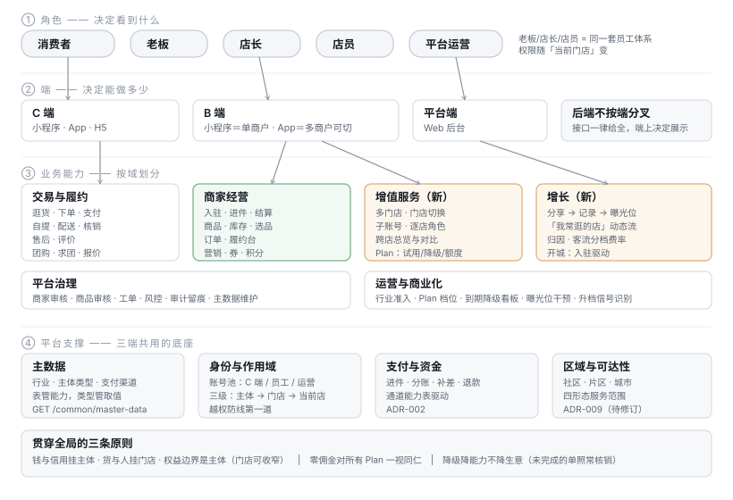
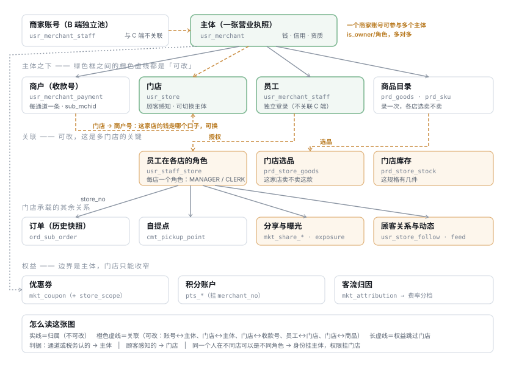

# 产品架构与实体关系

> 2026-08-09 · **本文是这一轮设计的唯一入口**，把散在五份文档里的结论收拢成一份。
> 数据库真源：[数据库 ER 图](./数据库-ER图.md)（由 `npm run gen:erd` 从 Flyway 迁移生成）
> 细节展开：[Plan 体系](../design/增值服务-多门店与子账号-方案.md) · [跨店权益](../design/跨店权益-积分与优惠券-方案.md) · [分享激励](../design/分享激励与首页曝光-方案.md) · [数据库整理](../design/数据库整理-多门店与增长.md)
> 决策：ADR-002（分账）· ADR-004（增长）· ADR-006（积分）· ADR-009（经营范围）· ADR-010（主数据）· ADR-011（主体与门店）

---

## 一、产品架构



四层，每一层回答一个不同的问题：

| 层 | 回答什么 | 关键点 |
|---|---|---|
| **角色** | 谁在用 | 老板/店长/店员是**同一套员工体系**，权限随「当前门店」变 |
| **端** | 能做多少 | B 端小程序＝单商户，App＝多商户可切。**后端不按端分叉** |
| **业务能力** | 做什么 | 交易履约 / 商家经营 / **增值服务（新）** / **增长（新）** / 平台治理 |
| **平台支撑** | 靠什么撑 | 主数据 · 身份作用域 · 支付资金 · 区域可达性 |

### 1.1 后端为什么不按端分叉

小程序的「单商户」不是一条规则，是**没得选**——微信生态里只有一个进件。
接口一律返回全部，端上决定展示几个。

分叉的代价是：「同一个人在小程序看到 1 家、App 看到 3 家」会变成两条独立演化的代码路径，
而它们对同一份数据的理解迟早不一致。

### 1.2 贯穿全局的三条原则

| 原则 | 展开 |
|---|---|
| **钱与信用挂主体，货与人挂门店** | 通道与税务认的是主体；顾客感知的是门店 |
| **零佣金对所有 Plan 一视同仁** | 把费率做成档位差异，就是换个名字的抽佣（ADR-004） |
| **降级降能力，不降生意** | 欠费时超额门店只读，但**未完成的单照常核销**——受损的不该是买家 |

---

## 二、实体关系



### 2.0 账号在哪一层

**两套独立账号池，互不关联**：消费者账号（`usr_user`）管逛买评，
商家账号（`usr_merchant_staff`，手机号注册）管经营 ——
买东西的老王和开店的老王在系统里是两个互不知晓的身份。

```
商家账号（注册一次）──成员──→ usr_merchant A（个体户执照）─→ 微信收款号 / 支付宝收款号
                  └─成员──→ usr_merchant B（公司执照）  ─→ ……
```

一个商家账号持有多张执照；各池内的多端登录靠各自的身份绑定表。
详见[全域对象关系](./全域对象关系-App与小程序.md)。

### 2.1 四个核心实体

| 实体 | 是什么 | 表 |
|---|---|---|
| **主体** | 经营者 —— 谁在做这门生意 | `usr_merchant` |
| **商户** | **收款商户号**（进件产生的 `sub_mchid`），每通道一条 | `usr_merchant_payment` |
| **门店** | 物理经营场所 | `usr_store` |
| **员工** | 在这个主体下干活的人 | `usr_merchant_staff` |

> ⚠️ **「商户」这个词有两个意思**：支付语境里是收款商户号，工商语境里是经营实体。
> 本仓库一律取**支付语境**。我在设计过程中读错过一次，据此提了一套多余的三层重构。

### 2.2 归属 vs 关联：差别在于能不能改

| 关系 | 类型 | 改了会怎样 |
|---|---|---|
| 账号 → 主体 | **关联**（多对多） | 一个账号持有多张营业执照 |
| **门店 → 主体** | **关联，可切换** | 个体户升级公司时，店照常开（[定稿](../design/账号主体门店-关系定稿.md) §3） |
| 主体 → 收款商户号 | **归属** | 进件是这张执照的资质，换不了 |
| **门店 → 收款商户号** | **关联，可换** | 换个口子收款，店照常开 |
| 主体 → 员工 / 商品目录 | **归属** | —— |
| **员工 → 门店** | **关联，逐店角色** | 同一个人可以 A 店店长、B 店店员 |
| **门店 × 商品 → 选品** | **关联** | 这家店卖不卖这款 |

三条可变关联正是多门店的全部关键：

**① 门店可以换主体，也可以换收款商户号**。个体户升级为公司、执照注销、业务重组 ——
这三种情况都要把门店转到另一张执照下。如果门店归属主体不可改，它们就只能**关店重开**：
评价清零、老客断链、库存与选品重录。而它本质上只是换了一张执照。

**② 员工身份挂主体，权限挂门店**。如果员工归属门店，
「他同时管两家店」就要建两条员工记录，而两条记录意味着两次登录——
等于把多门店要解决的问题又还回去了。

**③ 选品显式化**。目录挂主体（连锁店上新米不必录三遍），
卖不卖挂门店（多业态商家的五金和青菜不会混在一个列表里）。

### 2.3 三种状态要分得开

```
prd_goods（五常大米）── 挂主体，录一次
     ├─ 没有 prd_store_goods 行     = 这家店**不卖**这款
     ├─ 有行但 on_sale=0            = 卖，但**暂时下架**
     └─ 在架但 prd_store_stock=0    = 卖，但**卖完了**
```

对顾客是三句不同的话，混成一种就没法好好解释。

### 2.4 权益为什么跳过门店

| 边界 | 选它会怎样 |
|---|---|
| 账号 | ❌ 两个主体两本账，B 收的钱去抵 A 发的券，结算对不上 |
| **主体** ✅ | 同一结算方；三家分店是一个口袋左手倒右手，**不需要清算** |
| 门店 | ❌ 顾客认的是招牌，不是门牌号 |

门店只能**收窄**（`mkt_coupon.store_scope`，用于新店开业活动），默认通用。

### 2.5 订单为什么同时记两个键

`ord_sub_order` 同时记 `merchant_no`（结算键）与 `store_no`（履约键）。

**这是历史快照，不是冗余。** 门店可以切换主体 ——
它今天挂在主体 B 下，但三个月前的订单是主体 A 收的款、A 开的票、A 报的税。
用今天的归属去推历史订单的结算方，会把**已完成的资金流算到另一张执照头上**，
那是税务问题不是数据问题。所以 `merchant_no` 推不出来，必须存。

- 结算/分账/积分/对账**一行不改** → 多门店可以分阶段发布
- 换收款商户号之后，「这家店历史卖了多少」仍然可查，
  而 `merchant_no` 忠实记录当时钱走的哪个口子

---

## 三、数据库 ER 图

**结构图一律从真源生成**，不手画（[文档规范](../../文档规范.md) §二）：

```bash
npm run gen:erd     # 从 Flyway 迁移生成，58 张表 · 108 条关系 · 12 个域 · 15 张 SVG
```

产物：[数据库 ER 图](./数据库-ER图.md) —— 总览 + 按域展开 + 逐表字段与引用关系。

**本文的两张图与它的分工**：

| 图 | 表达什么 | 怎么来 |
|---|---|---|
| 产品架构（本文 §一） | 角色/端/能力的**意图** | 手写 SVG —— 没有可生成的真源 |
| 实体关系（本文 §二） | **归属 vs 关联**的语义 | 手写 SVG —— 库里只有外键，看不出哪条可改 |
| 数据库 ER 图 | 真实的表与字段 | **生成** —— 手画的必然漂移 |

> 「哪条关系可以改」是**产品决策**，库里表达不了：
> `usr_store.payment_no` 和 `usr_store.merchant_no` 在 schema 里长得一模一样，
> 而一个可换、一个不可换。这就是这两张手写图存在的理由。

---

## 四、落地进度

| 期 | 内容 | 状态 |
|---|---|---|
| M1 | 门店实体化 + 子账号建表 + 身份来源改为成员表 | ✅ V44 |
| M2 | 订单加 `store_no`（`merchant_no` 是历史快照） | ✅ V45 |
| M1.5 | 门店 → 收款商户号关联 · 员工独立登录身份 | ✅ V46 |
| M1.3 | 换商户号接口 + 四条硬约束 + 审计留痕 | ⬜ |
| M3 | `prd_store_goods` / `prd_store_stock` + 可见性双跑比对 | ⬜ |
| M-Auth | `usr_user_identity` 身份绑定表 + 支付宝登录 | ⬜ |
| M4 | Plan 档位与实例 + 额度校验 + GRACE/降级 | ⬜ 待定价确认 |
| M5 | 服务范围下沉 + `cmt_region` + 删主体上的旧列 | ⬜ 待 ADR-009 修订 |
| M6 | 放开建店 + 跨店总览与对比 | ⬜ |
| M7 | 分享/曝光/留存五表 + 券门店收窄 + `MERCHANT_EARNED` | ⬜ |

**M1–M2、M1.5 全部对商家零感知** —— 模型改造与产品发布刻意解耦。

---

## 五、还需要拍板的

| # | 事项 | 阻塞 | 我的建议 |
|---|---|---|---|
| 1 | Plan 三档额度与**数据留存分档** | M4 | 留存分档是唯一一项"免费档比现在差"的设计，需要你确认 |
| 2 | ADR-009 是否正式改为**四形态**（加 `GEO`） | M5 | 改。「我送方圆两公里」是小店最自然的表达 |
| 3 | 开城是否**自动触发**（首个商家入驻即开该社区） | M5 | 自动。手工点意味着「商家入驻了但顾客还看不到他」 |
| 4 | 曝光位分配策略 | M7 | 权重轮播，不是 Top-K —— 按分排序两周后只剩头部在玩 |
| 5 | `MERCHANT_EARNED` 费率口径 | M7 | 等同自带客流，否则商家越分享费率越高 |

> 🔴 **另有一条不用等拍板、建议立刻修的**：`activate` 的幂等判据是「这个人是不是已有商家」，
> 于是**申请第二张营业执照通过时会去改第一个主体而不是新建**，且没有任何报错。
> 详见[账号与多执照 §2.1](../design/账号与多执照-设计.md)。

---

## 六、文档地图

| 想知道 | 看哪份 |
|---|---|
| 整体架构与实体关系 | **本文** |
| 真实的表与字段 | [数据库 ER 图](./数据库-ER图.md)（生成） |
| Plan 怎么卖、怎么降级 | [增值服务方案](../design/增值服务-多门店与子账号-方案.md) |
| 券与积分跨不跨店 | [跨店权益方案](../design/跨店权益-积分与优惠券-方案.md) |
| 分享怎么换曝光 | [分享激励与首页曝光](../design/分享激励与首页曝光-方案.md) |
| 每一期改哪些表 | [数据库整理](../design/数据库整理-多门店与增长.md) |
| **十个对象的精确定义、App×小程序差异、细节对象编目** | [全域对象关系](./全域对象关系-App与小程序.md) |
| **中/英/表名命名基准（不考虑兼容的理想命名）** | [全域命名基准](./全域命名基准.md) |
| 消费者池的多端打通（微信/支付宝/Apple） | [账号与多执照](../design/账号与多执照-设计.md) |
| **账号/主体/门店三者到底谁关联谁** | [关系定稿](../design/账号主体门店-关系定稿.md) |
| 需求与验收 | [增值服务与分享激励-需求](../../requirements/多门店与分享激励-需求.md) |
