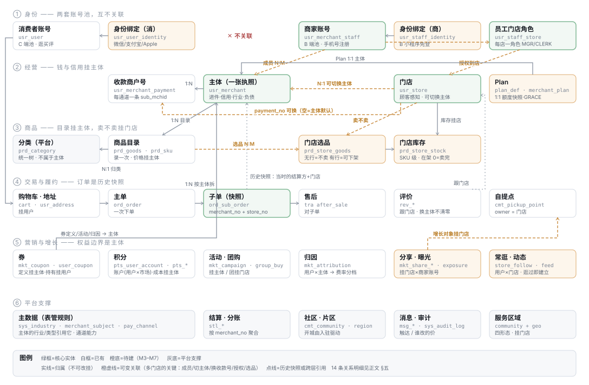

# 全域对象关系：App 场景 × 小程序场景

> 2026-08-09 · 十个对象一次梳理：注册账号 · 主体 · 商户（收款号）· 账户信息 · 门店 · 用户 · 权益 · 积分 · 分类 · 商品
> 定稿依据：[关系定稿](../design/账号主体门店-关系定稿.md) · [账号与多执照](../design/账号与多执照-设计.md) · [产品架构](./产品架构与实体关系.md)

---

## 一、领域对象定义

每个对象四要素：**定义**（一句话）· **边界**（是什么/不是什么）· **标识与生命周期** · **表**。

### 1. 账号 —— **两套独立的池，互不关联**

> **消费者账号与商家账号是两套账号体系。同一个手机号可以在两边各注册一个，
> 系统不做任何关联** —— 买东西的老王和开店的老王，在系统里是两个互不知晓的身份。

#### 1a. 消费者账号（Consumer Account）

- **定义**：在 C 端逛、买、评价的登录身份
- **标识**：`user_no`；三方绑定（微信/支付宝/Apple）经身份表落到它
- **表**：`usr_user` + `usr_user_identity`（待建）

#### 1b. 商家账号（Merchant Account）

- **定义**：在 B 端经营的登录身份 —— 老板和店员都用它，**与消费者账号无关**
- **是**：手机号注册（App）；可绑微信 openid 供 B 端小程序免登（绑的是**商家账号自己的**身份表，不是 C 端账号）
- **不是**：不需要先是消费者；不与 `usr_user` 有任何外键
- **标识**：`merchant_staff_no`。一个商家账号经成员关系参与多个主体
- **表**：`usr_merchant_staff`（`login_phone` 即注册身份；`user_no` 列**废弃**）

**为什么不关联**：关联的唯一收益是"小程序免登"，而它带来的成本是两套身份的
生命周期互相纠缠（注销消费者账号影响上班、合并账号影响经营归属）。
免登可以由商家账号**自己绑微信**解决，不需要借道 C 端。

### 2. 主体（Merchant Entity）

> **一张营业执照对应的经营实体 —— 工商与税务认的那个"谁在做生意"。**

- **是**：进件资质、费率与信用、积分负债、权益边界的**唯一**挂靠点
- **不是**：不是账号（一个账号可持多张执照）；不是收款商户号（那是它的进件产物）；不是门店（那是它的经营场所）
- **标识**：`merchant_no`。生命周期：入驻审核通过即生（`activate`）；SUSPENDED/BANNED 是经营状态不是删除
- **表**：`usr_merchant`

### 3. 商户 / 收款商户号（Payment Merchant）

> **主体在某个支付通道进件后获得的收款身份（`sub_mchid`），每通道一条。**

- **是**：钱的入口。分账接收方、支付方式、限额都定义在它上面
- **不是**：不是主体本身 —— 一个主体可以同时有微信号和支付宝号；**本仓库说「商户」一律指它，说经营实体用「主体」**（这个词的歧义已经造成过一次误设计）
- **标识**：`(merchant_no, pay_channel)` 唯一。生命周期：进件申请 → ACTIVE → 可停用；**不可转让给别的主体**
- **表**：`usr_merchant_payment`

### 4. 账户信息（Account Profile）

> **不是一个对象，是四类信息的统称** —— 拆开挂、拆开授权（详见 §二）。

登录账户（挂账号）· 消费者资料（挂用户面）· 经营资料（挂主体）· 资金账户（挂主体，仅 OWNER 可见）。

### 5. 门店（Store）

> **一个物理经营场所 —— 顾客说「楼下那家」指的就是它。**

- **是**：地址/营业时间/公告、库存与选品、评价、履约、员工授权、顾客关系的挂靠点
- **不是**：不归属主体（是**关联，可切换** —— 换执照店照开）；不是自提点（一家店可以兼作自提点，但那是另一张表的角色）
- **标识**：`store_no`。生命周期：随主体激活自动建默认店；可停用；**默认店删不掉**；READONLY 是 Plan 降级态
- **表**：`usr_store`（`merchant_no` 可变、`payment_no` 可变）

### 6. 用户（Consumer）

> **消费者账号本身 —— 逛、买、评价的那个身份。**

- **是**：归属社区、收货地址、券包、积分、常逛的店的持有者
- **不是**：与商家账号**没有任何关系** —— 店主想买东西就用他自己的消费者账号，两个身份互不知晓
- **标识**：`user_no`（`usr_user`）

### 7. 权益 / 券（Coupon）

> **主体对顾客的一份成本承诺 —— 谁发的，就从谁的结算里扣。**

- **是**：定义挂主体（`mkt_coupon.merchant_no`），持有挂用户（`mkt_user_coupon`）；同主体多门店**天然通用**，`store_scope` 只能**收窄**（新店开业）
- **不是**：不跨主体（哪怕同一个老板的两张执照）；不是平台补贴（平台券 `merchant_no` 为空，另一种东西）
- **生命周期**：发行 → 领取 → 核销/过期；门店换主体后旧主体的券**在该店不再可用**

### 8. 积分（Points）

> **用户的资产，成本由发放的主体承担（ADR-006）—— 抵扣金额在该主体结算时扣除。**

- **是**：**账户按 `(user_no, market)` 建**（一个市场一个余额）；成本挂主体（谁发的谁买单，结算时扣）
- **不是**：不按门店拆（同主体的店是一个口袋）；**跨主体怎么算尚未定** —— ADR-006 §2 的 A（全平台通用+清算）/ B（主体专属）待选，一期积分不上线正是因为这个地基没定
- **标识**：`pts_user_account(user_no, market)`；账务流水（`pts_*`）按发放/消耗主体记，带 `store_no` 归因
- **展示**：若走 B 方案则按主体分组、不合并总数；走 A 方案则单一余额
- ⚠️ 我在上一版把账户写成了 `(user_no, merchant_no)` —— **那是 B 方案的形态，不是现状**。现状的账户是市场级的，主体维度在账务流水里

### 9. 分类（Category）

> **平台统一维护的商品类目树 —— 十个对象里唯一不属于任何主体的。**

- **是**：一件商品属于哪一类（`prd_goods.category_no`）；C 端分类页的骨架
- **不是**：不是行业（行业挂**主体**，决定通道准入 —— 一家便利店横跨多个类目，行业只有一个）；不是商家自建的分组（没有这种东西，避免每家店一套树）
- **标识**：`category_no`，树形。生命周期：平台增删，停用不删（历史商品还挂着）
- **表**：`prd_category`

### 10. 商品（Goods）

> **主体的商品定义（SPU/SKU），加上「哪家店卖、有几件」两层门店关系。**

- **是**：目录挂主体（录一次）；选品挂门店（卖不卖）；库存挂门店（有几件）
- **不是**：不挂收款商户号（商品与钱的入口无关）；目录**不跟门店换主体走**（目录是旧主体的资产，实物库存才跟店）
- **标识**：`goods_no` / `sku_no`；价格唯一权威 `(merchant_no, sku_no, market)`
- **三种状态要分开**：没有选品行=不卖 · 有行但下架=暂时不卖 · 在架库存 0=卖完了
- **表**：`prd_goods` / `prd_sku` + `prd_store_goods` / `prd_store_stock`（M3）

---

## 一之二、十个对象，各就各位（速查表）

| # | 对象 | 是什么 | 表 | 挂在谁下面 |
|---|---|---|---|---|
| 1 | **注册账号** | 登录凭据的持有者，一个人一个 | `usr_user`（+ `usr_user_identity` 待建） | —— 顶层 |
| 2 | **主体** | 一张营业执照的经营实体（＝工商语境的"商户"） | `usr_merchant` | 账号（多对多，可持多张执照） |
| 3 | **商户（收款号）** | 进件产物 `sub_mchid`，每通道一条 | `usr_merchant_payment` | 主体（归属，进件是执照的资质） |
| 4 | **账户信息** | 见 §二 —— 它不是一张表，是四类东西 | 分散 | 各归各 |
| 5 | **门店** | 物理经营场所 | `usr_store` | 主体（**关联，可切换**） |
| 6 | **用户** | 消费者身份（逛、买、评价） | `usr_user` 本身 + 归属社区 | 账号（同一张表的另一面） |
| 7 | **权益（券）** | 优惠券 | `mkt_coupon` / `mkt_user_coupon` | 定义挂主体；持有挂用户 |
| 8 | **积分** | 用户资产，成本由发放主体承担 | `pts_user_account` / `pts_*` | 账户挂(用户×市场)；成本挂主体；跨主体口径待定（ADR-006 §2） |
| 9 | **分类** | 平台统一类目树（一件商品属于哪类） | `prd_category` | **平台** —— 不属于任何主体 |
| 10 | **商品** | SPU/SKU 目录 + 门店销售关系 | `prd_goods` / `prd_sku` + `prd_store_goods/_stock` | 目录挂主体；卖不卖挂门店 |

### 一张总图



图上看不出来的两件事：**橙色虚线是这张图的全部重点**（五条可变关联——成员、切主体、
换收款号、员工授权、选品——多门店的能力全部由它们承载）；
以及**「✕ 不关联」不是没画完**——两套账号池刻意无任何连线。

文本版（终端里看）：

```
                        平台
                          │ 维护
                          ▼
                    分类 prd_category（统一类目树，不属于任何主体）
                          ▲ 归类
                          │
 商家账号 merchant_staff        消费者账号 usr_user（两套池，互不关联）
    │                                        │
    │ 成员(多对多,老板/店员)                    │ 持有
    ▼                                        ▼
  主体 usr_merchant（一张执照）           券 mkt_user_coupon
    │归属          ▲关联,可切换           积分 pts_user_account(用户×市场)
    ▼              │                         ▲
 收款号 payment   门店 usr_store ──关联──收款号 │
    (每通道一条)      │                        │
                    │ 选品/库存/员工角色        │ 定义与负债
                    ▼                        │
              商品目录 prd_goods ──归属──→ 主体┘
```

---

## 二、「账户信息」拆开说 —— 它是四类东西，不是一张表

| 类 | 内容 | 挂哪 | 谁能看 |
|---|---|---|---|
| **登录账户** | 手机号、三方绑定（微信/支付宝/Apple） | 注册账号 | 本人 |
| **消费者资料** | 昵称、头像、收货地址、归属社区 | 用户面 | 本人 |
| **经营资料** | 执照信息、行业、主体类型、简介 | 主体 | 老板 + 平台 |
| **资金账户** | 收款号、结算账户、分账记录、账单 | 主体（经收款号） | **仅 OWNER** + 平台 |

**为什么必须拆开**：四类的可见性与生命周期完全不同 ——
换头像是本人的事，换结算账户是要走进件的事。混在一个"账户中心"里，
权限就没法按块收紧（店长能看到结算账户就是事故）。

---

## 三、App 场景：全能力形态

**App 是给「有能力的商家」的**（成长期/成熟期），一个账号管得了全部：

```
老王的账号（手机号注册一次）
  │
  ├─【经营面】可切换主体
  │    ├─ 主体A 个体户执照 ── 微信收款号 ── 门店1（文三路店）
  │    │                                 └ 门店2（文二路店）
  │    └─ 主体B 公司执照  ── 微信+支付宝收款号 ── 门店3（餐饮店）
  │         └ 每个主体：自己的商品目录 / 券 / 积分负债 / 员工
  │
  └─【消费面】他自己也是买家：地址、券包、积分、常逛的店
```

| 能力 | App 上怎么表现 |
|---|---|
| 多主体 | 顶部第一级切换：主体 A ↔ 主体 B。**切主体 = 换一套目录/员工/资金视图** |
| 多门店 | 第二级切换：主体内切门店（受 Plan 额度） |
| 门店换主体 | 可操作（六条硬约束 + 平台审核，[定稿 §3.4](../design/账号主体门店-关系定稿.md)） |
| 收款号 | 主体下可有多个（微信+支付宝）；门店挑一个（`payment_no`） |
| 老板与员工 | 都用**商家账号**（手机号+验证码）；老板给员工配「哪家店什么角色」 |
| 店主想买东西 | 用他自己的**消费者账号** —— 两套身份互不知晓，不提供互切 |

**登录**：商家账号手机号 + 验证码；可绑微信/Apple 供免登（绑在商家账号自己的身份表上）。

---

## 四、小程序场景：受生态收窄的形态

**小程序的限制来自生态，不是我们的规则**：

| 收窄 | 原因 |
|---|---|
| 单主体（不能切） | 展示**默认主体**（`is_primary`）。后端返回全部，端上只展示一个 —— 不分叉 |
| 收款只有微信 | 支付宝进不了微信小程序，`payment_no` 无意义 |
| 门店不能换主体 | 操作影响纳税主体，收在 App/平台侧；小程序只读展示 |
| B 端免登 | 商家账号**自己绑微信 openid**（商家账号的身份表），不借道 C 端账号 |

| 对象 | 小程序（C 端） | 小程序（B 端） |
|---|---|---|
| 注册账号 | 微信授权静默注册（`WECHAT_MP` openid） | 同一账号 |
| 用户面 | 全功能：逛/买/券/积分/常逛的店 | —— |
| 主体 | 无感知 | 默认主体，单个 |
| 门店 | 逛具体门店（扫码/分享直达） | 管默认主体下的门店（切门店可以，切主体不行） |
| 商品/分类 | 按门店选品 × 服务区域可见 | 管目录与选品 |
| 权益/积分 | 券包、积分按主体分组展示 | 发券（限本主体） |

**同一个人跨端**：微信小程序 ↔ App 靠 `unionid` 打通；
微信 ↔ 支付宝**只能靠已验证的手机号**，且不静默合并（合并不可逆）。

---

## 五、逐对关系：谁连谁，什么性质

**十个对象间真正存在的 14 条关系**（❋ 标注可变关联，其余为归属/事实）：

| # | 关系 | 性质 | 键 |
|---|---|---|---|
| 1 | **商家账号** ↔ 主体 | ❋ 关联，多对多（老板/店员都是成员） | `usr_merchant_staff(login_phone, merchant_no)`；`user_no` 废弃 |
| 2 | 主体 → 收款号 | 归属，每通道一条 | `usr_merchant_payment.merchant_no` |
| 3 | 门店 → 主体 | ❋ **关联，可切换**（换执照，店照开） | `usr_store.merchant_no` |
| 4 | 门店 → 收款号 | ❋ 关联，可换（空=主体默认） | `usr_store.payment_no` |
| 5 | 员工 → 门店 | ❋ 关联，**每店一个角色** | `usr_staff_store(merchant_staff_no, store_no, role)` |
| 6 | 商品目录 → 主体 | 归属（录一次） | `prd_goods.merchant_no` |
| 7 | 门店 × 商品 → 选品 | ❋ 关联（卖不卖/上下架） | `prd_store_goods`（M3） |
| 8 | 门店 × SKU → 库存 | 事实（有几件） | `prd_store_stock`（M3） |
| 9 | 商品 → 分类 | 归类，平台树 | `prd_goods.category_no` |
| 10 | 券定义 → 主体 | 归属（权益边界；门店可收窄） | `mkt_coupon.merchant_no + store_scope` |
| 11 | 用户 × 券 → 持有 | 事实 | `mkt_user_coupon` |
| 12 | 用户 → 积分账户 | 事实（账户按市场；成本按主体记在流水） | `pts_user_account(user_no, market)` |
| 13 | 订单 → 主体 + 门店 | **历史快照**（当时谁收款、哪家店卖） | `ord_sub_order.merchant_no + store_no` |
| 14 | 用户 ↔ 门店 → 常逛 | 事实（逛过即建立） | `usr_store_follow`（M7） |

### 5.1 门店换主体时，这 14 条各自怎么办

这是全模型最微妙的一处，逐条过：

| 数据 | 处置 | 理由 |
|---|---|---|
| 历史订单（#13） | **不动** | 那是当时的纳税事实 |
| 积分账务（#12） | 历史流水**留在旧主体** —— 成本已在它的结算里扣过 | 账户余额是市场级的不受影响；**跨主体可用性等 ADR-006 §2 拍板** |
| 旧主体的券（#10/11） | 本店**不再可用**（仍可在旧主体其他店用） | 券是旧主体的成本承诺 |
| 商品目录（#6） | **不跟店走** —— 目录是旧主体的 | 新主体下要重建选品，或从旧主体复制（需两边同意） |
| 选品/库存（#7/8） | 库存实物跟店；**选品要重挂**到新主体的目录 | 货在店里，但"卖什么"的定义换了归属 |
| 员工授权（#5） | **失效，重新授权** | 他是旧主体的员工；静默保留=前雇员操作新主体的店 |
| 常逛关系（#14）、评价 | **跟门店，不断** | 顾客认的是这家店 |

> **商品目录不跟店走**是这里最容易有争议的一条：直觉上"店里的货当然跟店"。
> 但目录挂主体（#6 归属），跟店走等于把旧主体的资产划给新主体。
> 实物库存跟店（它就在店里），**定义**要在新主体下重建或复制 ——
> 这也是换主体需要平台审核的原因之一。

---

## 五之二、多业态：一个主体还是两个？（含小程序结论）

**先澄清一个词**：「商品分类」如果指**平台类目树**（`prd_category`），它不绑任何主体 ——
全平台一棵树，谁也改不了。绑在主体上的是**商品目录**（`prd_goods`）。
下面按"目录绑主体"来回答。

### 1. 非连锁（多业态）下，目录绑主体行不行？

**行，但要说清楚哪层在兜底。** 菜摊 + 五金店挂同一个主体时：

| 层 | 会不会混 | 靠什么 |
|---|---|---|
| B 端商品列表 | 不混 | 按**当前门店**过滤（选品关系）—— 切到菜摊看不见五金件 |
| C 端顾客视角 | 不混 | 顾客逛的是**门店**，每家店只展示自己的选品 |
| 「全部门店」总览 | **会混** | 这是它该有的样子 —— 总览本来就是跨店的 |
| 主体级统计（goods_count 等） | 会混 | 跨店对比按 `store_no` 拆即可 |

**真正的摩擦不在目录，在两个主体级的字段**：

| 字段 | 粒度 | 多业态下的问题 | 结论 |
|---|---|---|---|
| `industry`（行业） | 主体一个值 | 菜摊是零售、餐饮店是餐饮，只能填一个 | 填**主行业**。它只影响小微准入的白名单判定（提交时查一次），不影响日常经营 |
| 类目授权（auth codes） | 主体，**可多个** | 无问题 —— 审核时把两类都授了即可 | 已支持 |

### 2. 一个账号开不同业态的门店，要不要用两个主体？

**不必须。判据只有两条，都与业态无关**：

| 判据 | 一个主体（推荐默认） | 两个主体 |
|---|---|---|
| **执照的经营范围**盖不盖得住两个业态 | 盖得住 → 一个 | 盖不住 → 必须两个（这是工商问题，不是我们的模型问题） |
| 想不想**分开报税/独立核算** | 不想 → 一个 | 想 → 两个（钱与税跟主体走） |

一个主体的好处：一次进件、一份结算、权益通用（券与积分同一口袋）、小程序完整可用（见下）。
两个主体的代价：两次进件、两本账、权益互不通用 —— 这些都是**分开报税换来的**，不是白付。

### 3. 小程序行得通吗？

| 形态 | 小程序 B 端 | 结论 |
|---|---|---|
| **一个主体 + 多门店**（含多业态） | ✅ 切门店完整支持 | **行得通，这是推荐路径** |
| 两个主体 | 现设计只展示**默认主体** | 管另一个主体要去 App |

**要点：小程序的"单主体"是产品收窄，不是生态限制。**
支付走服务商模式，同一个小程序里多个主体各自的收款号都能收款；
后端本来就返回全部主体（不分叉）。所以如果"两个主体"成为真实高频场景，
**放开小程序切主体的成本很低**（加一个低频切换入口即可）——
现在不放开只是因为孵化期商家不需要，先不给他一个用不上的开关。

### 4. 执照允许时，小程序能否多主体、各用各的结算账号？

**能，而且 C 端已经就是这样。** 关键在支付模式（ADR-002 收付通/服务商）：

| 层 | 怎么支持 |
|---|---|
| **收款** | 平台是服务商，支付时按**子单**指定 `sub_mchid` —— 一个小程序里，钱天然路由到各主体自己的收款号。跨主体购物车拆子单后合单支付 |
| **结算** | 每个主体各自的结算账户（进件时定的 `settle_account`），互不掺和 —— 模型本来如此 |
| **进件** | 每个主体**各自进件一次** —— 这是通道要求，不是我们的限制 |
| **B 端管理** | 技术上无障碍（后端返回全部主体）；现收窄为默认主体，是产品选择，放开成本低（加一个低频切换入口） |

一句话：**支付与结算层面小程序对多主体没有任何障碍**；
唯一的"单主体"在 B 端管理界面上，且随时可放开。

### 5. 分类挂哪？—— 拆成三层就清楚了

「分类」在系统里其实是三个东西：

| 层 | 是什么 | 挂哪 | 落点 |
|---|---|---|---|
| **平台类目树** | 全平台一棵（生鲜/日用/…），管授权与 C 端分类页 | **平台** | `prd_category`，谁也不挂 |
| **商品的归类** | 一件商品属于哪个类目 | 跟**商品目录** = 主体级定义 | `prd_goods.category_no` |
| **门店展示分类** | 顾客进店看到的分组导航 | **门店 —— 但不落新表** | 由该店**选品的类目派生**：店里卖了哪些类，就展示哪些组 |

第三层是关键：菜摊页面只会出现生鲜类分组、五金店只出现五金分组 ——
**不需要商家配置**，选品定了它就定了。将来若要"店主自定义分组"（如「今日特价」），
那才建门店级对象，挂门店。

### 6. 商品挂哪？—— 定稿不变

**定义（含价格）挂主体，卖不卖 + 库存挂门店。**

| | 挂主体 | 挂门店 |
|---|---|---|
| SPU/SKU 定义、价格 | ✅ 录一次，连锁不用录三遍 | |
| 选品（卖不卖/上下架） | | ✅ `prd_store_goods`，多业态天然隔离 |
| 库存 | | ✅ `prd_store_stock`，邻里店不互相调货 |

### 7. 一句话回答

> 多业态优先**一个主体多门店**；执照盖不住或要分开报税才拆两个主体 ——
> 而**即使两个主体，小程序的收款与结算也完全支持**（服务商模式按子单路由），
> 只有管理界面暂收窄到默认主体。分类三层各归其位：树归平台、归类跟商品、
> 门店分组由选品派生。

## 六、积分与券在两个场景下的展示规则

| 规则 | 为什么 |
|---|---|
| C 端积分**按主体分组**，不合并总数 | 显示"共 1200 分"结账却只能用 300，是最糟的体验 |
| 券卡片标**主体名 + 可用门店数** | 「张记粮油 · 3 家店可用」；收窄过的标具体店 |
| 同一账号的 A、B 主体权益**互不通用** | 两张执照两本账（即使同一个老板）|
| C 端**不提示**"这两家店是同一个老板" | 主体间关联是商家的私事，提示了反而让顾客期待权益互通 |

---

## 七、细节对象补全 —— 核心十对象之外的全域编目

按域分组。每条：定义 · 挂靠 · 键。（✅=已有表 · ⬜=待建）

### 7.1 身份与授权域

| 对象 | 定义 | 挂靠 | 键 | |
|---|---|---|---|---|
| 员工门店角色 | 一个商家账号在某门店的角色（MANAGER/CLERK） | 商家账号 × 门店 | `usr_staff_store` | ✅ |
| 商家账号身份绑定 | 商家账号的微信 openid 等三方（免登用） | 商家账号 | `usr_staff_identity`(provider, external_id) | ⬜ |
| 消费者身份绑定 | 消费者账号的三方登录 | 消费者账号 | `usr_user_identity` | ⬜ |
| 操作日志 | 谁在哪家店做了什么（改价/退款/换收款号） | 商家账号 × 门店 | `sys_audit_log`（B 端沿用） | ✅ |

### 7.2 经营域

| 对象 | 定义 | 挂靠 | 键 | |
|---|---|---|---|---|
| 入驻申请 | 一次开执照的申请（内容+进度一体） | **商家账号** | `usr_merchant_apply` | ✅ 发起方要改 |
| Plan 档位定义 | FREE/PRO/CHAIN 的额度与能力位 | 平台 | `sys_merchant_plan_def` | ⬜ M4 |
| Plan 实例 | 某主体当前的档位、额度快照、有效期 | 主体 | `usr_merchant_plan` | ⬜ M4 |
| 覆盖社区 | 门店服务哪些小区（COMMUNITY 形态） | 门店 | `usr_merchant_community`→挂 store_no | 🚧 M5 |
| 服务地图区域 | 半径/多边形（GEO 形态） | 门店 | `usr_store.service_geo` | ⬜ M5 |
| 规格模板 | 平台预置 + 商家自存的规格建议 | 平台 / 主体 | `prd_spec_template` | ✅ |

### 7.3 交易与履约域

| 对象 | 定义 | 挂靠 | 键 | |
|---|---|---|---|---|
| 购物车 | 消费者待结算的选择 | 用户 | `mp cart`（现走缓存/表） | ✅ |
| 收货地址 | 消费者的配送地址簿 | 用户 | `usr_address` | ✅ |
| 主单/子单 | 一次下单 / 按主体拆分的结算履约单元 | 用户；子单带主体+门店**历史快照** | `ord_order` / `ord_sub_order` | ✅ |
| 售后单 | 对某子单的退款退货申请 | 子单 | `ord_after_sale`（tra 域） | ✅ |
| 评价 | 对商品与门店的评分 | 用户 × 门店（**跟门店**，换主体不清零） | `rev_*` | ✅ |
| 自提点 | 常驻取货网点；门店可兼作 | 社区；owner=门店 | `cmt_pickup_point` | ✅ owner 改指 store |
| 社区/片区 | 平台开城的最小/上级单元 | 平台 | `cmt_community` / `cmt_region`(⬜M5) | 🚧 |
| 库存锁 | 下单未支付期间的占用 | SKU × 门店（M3 后） | `prd_stock_lock` | ✅ 待挂门店 |

### 7.4 营销与增长域

| 对象 | 定义 | 挂靠 | 键 | |
|---|---|---|---|---|
| 营销活动 | 满减/特价/买赠统一模型 | 主体（`store_scope` 可收窄，同券） | `mkt_campaign` | ✅ |
| 团购 | 商家开团或用户发起的拼团 | 门店（货从这家店出） | `mkt_group_buy` | ✅ 待挂门店 |
| 求团/报价 | 用户求团、商家应价（ADR-003） | 社区 × 主体 | `mkt_request` / `mkt_quote` | ✅ |
| 归因 | 这个用户算谁带来的（30 天窗口）→ 费率分档 | 用户 × 主体 | `mkt_attribution` | ✅ |
| 分享链接 | 一次分享一条码（谁·哪店·哪货） | 门店 × 商家账号 | `mkt_share_link` | ⬜ M7 |
| 分享点击 | 有效/无效都记，无效记原因 | 分享链接 × 用户 | `mkt_share_click` | ⬜ M7 |
| 曝光池 | 首页「邻里在逛」的预计算条目 | 门店 × 商品 | `mkt_exposure_pool` | ⬜ M7 |
| 常逛关系 | 逛过即建立，不要求关注 | 用户 × 门店 | `usr_store_follow` | ⬜ M7 |
| 门店动态 | 新品/优惠/开团/公告自动产生 | 门店 | `mkt_store_feed` | ⬜ M7 |

### 7.5 平台支撑域

| 对象 | 定义 | 挂靠 | 键 | |
|---|---|---|---|---|
| 行业 | 主体的业态，决定通道准入（能否小微） | 平台注册表 | `sys_industry` | ✅ |
| 主体类型 | 小微/个体户/企业：要不要执照、钱打到哪 | 平台注册表 | `sys_merchant_subject` | ✅ |
| 支付渠道 | 通道能力：分账/补差/限额 | 平台注册表 | `sys_pay_channel` | ✅ |
| 结算账单/分账 | 主体维度的钱：按 `merchant_no` 聚合 | 主体（经收款号） | `stl_*` | ✅ 不动 |
| 消息 | 订单/履约/审核的触达 | 用户 或 商家账号 | `msg_*` | ✅ |

---

## 八、账号独立后的连锁改动（要改清单增补）

「商家和消费者不用关联」落到代码上，有四处要改：

| # | 现状 | 改为 | 严重度 |
|---|---|---|---|
| 1 | **入驻从 C 端发起**（用消费者 token 调 `/mp/merchant/apply`） | 入驻由**商家账号**发起：B 端先注册商家账号 → 提交申请。C 端入驻入口只做引导跳转 | 🔴 链路重定向 |
| 2 | `activate` 用 `owner_user_no` 建成员行 | 用申请单上的**商家账号**建；`owner_user_no` 彻底退役 | 🔴 与幂等缺陷一起修 |
| 3 | `BizIdentityResolver` 认两条路径（user_no / 员工号） | **只认员工号** —— user_no 路径删除 | 🟡 |
| 4 | V46 的 `linked_user_no`（原 user_no 列） | **废弃**。B 端小程序免登改为商家账号绑 openid（`usr_staff_identity`） | 🟡 |

> V44/V46 的表结构**不用回退**：`user_no` 列停用即可，身份表是新增。
> 真正的改动在入驻链路——它现在假设"申请人先是消费者"，而这个假设被移除了。

---

## 九、待办回执（本次梳理不改代码，只定关系）

| 已在清单上 | 出处 |
|---|---|
| `activate` 幂等判据改按申请单（多主体阻塞，静默缺陷） | [定稿 §四](../design/账号主体门店-关系定稿.md) |
| 门店换主体接口 + 六条约束 + 数据处置 | [定稿 §3.4](../design/账号主体门店-关系定稿.md) + 本文 §5.1 |
| `usr_user_identity` 身份表（支付宝/多端） | [账号与多执照 §3](../design/账号与多执照-设计.md) |
| M3 选品与库存两表 | [数据库整理](../design/数据库整理-多门店与增长.md) |

**本次新增的定案**：§5.1 的 14 条处置表（尤其是"商品目录不跟店走"）——
实现门店换主体时照它执行。
