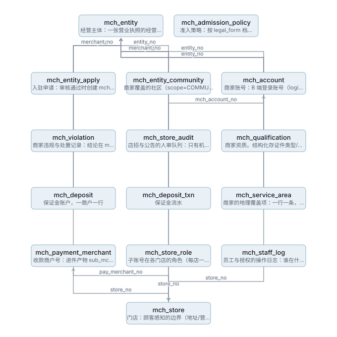
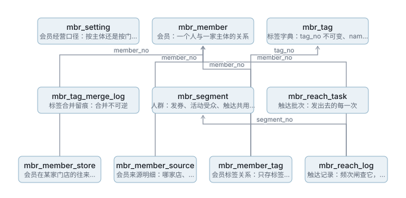
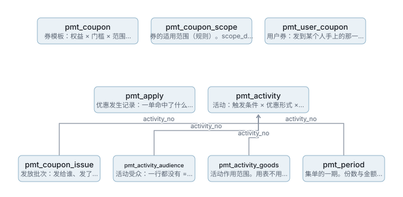

# 数据库 ER 图

> 由 `npm run gen:erd` 从 Flyway 迁移生成，**请勿手改**。
> 图为 SVG，任何环境都能打开；改表后重跑即可，不会漂移。

## 一、总览

全库 **145** 张表、**211** 条引用关系，分 **15** 个域。
按「被引用次数」分三条带 —— **不是有向无环图**：域之间存在环
（`cmt → mkt → usr → cmt`），强行分层会画错。

| 域 | 前缀 | 表数 | 被几个域引用 |
|---|---|---:|---:|
| 消费者账号 | `usr_*` | 6 | 11 |
| 商家主体与门店 | `mch_*` | 21 | 11 |
| 社区与自提点 | `cmt_*` | 3 | 8 |
| 商品与类目 | `prd_*` | 19 | 7 |
| 购物车 | `trd_*` | 1 | 0 |
| 交易 | `ord_*` | 6 | 7 |
| 履约 | `ful_*` | 8 | 0 |
| 营销与团购 | `mkt_*` | 15 | 4 |
| 积分 | `pts_*` | 2 | 0 |
| 结算 | `stl_*` | 9 | 0 |
| 评价 | `rvw_*` | 3 | 0 |
| 内容 | `cnt_*` | 4 | 0 |
| 会员 | `mbr_*` | 8 | 0 |
| 券与活动 | `pmt_*` | 5 | 0 |
| 系统 | `sys_*` | 21 | 0 |

> `usr` 被 11 个域引用 —— 它是全库的锚点。改它的主键或语义，影响面是全局的。

## 二、分域

### 消费者账号 `usr_*`（6 张）

| 表 | 说明 |
|---|---|
| `usr_address` | 地址簿 |
| `usr_store_favorite` | 收藏的店 |
| `usr_account` | 消费者账号：与商家账号 mch_account 彻底独立，不关联 |
| `usr_identity` | 用户登录凭证。一个人多条，新增来源只是多一行，不再改表 |
| `usr_person` | 平台人档：这个自然人，以已验证的手机号为准 |
| `usr_person_merge_log` | 人档合并留痕：合并不可逆 |

**跨域引用**：`usr_store_favorite.entity_no` → `mch_entity`、`usr_account.community_no` → `cmt_community`、`usr_account.pickup_no` → `cmt_pickup_point`、`usr_account.entity_no` → `mch_entity`

### 商家主体与门店 `mch_*`（21 张）

| 表 | 说明 |
|---|---|
| `mch_entity` | 经营主体：一张营业执照的经营实体。收款商户号在 mch_payment_merchant，门店经 mch_store.entity_no 关联（可切换执照） |
| `mch_entity_apply` | 入驻申请：审核通过时创建 mch_entity 并回填 entity_no（幂等判据应按本表，不按人） |
| `mch_entity_community` | 商家覆盖的社区（scope=COMMUNITY 时生效） |
| `mch_payment_merchant` | 收款商户号：进件产物 sub_mchid，每主体×每通道一条。全库唯一合法的 merchant 用法 |
| `mch_account` | 商家账号：B 端登录账号（login_phone 注册，与消费者账号彻底独立）。当前一行同时承载对主体的成员关系，门店角色见 mch_store_role |
| `mch_store_role` | 子账号在各门店的角色（每店一个角色） |
| `mch_store` | 门店：顾客感知的边界（地址/营业时间/库存/评价/履约）。关联主体可切换（换执照店照开）；每主体恰好一个默认店 |
| `mch_violation` | 商家违规与处置记录：结论在 mch_entity.breach_count，事实在这里 |
| `mch_store_audit` | 店招与公告的人审队列：只有机审命中的才进来 |
| `mch_qualification` | 商家资质。结构化存证件类型/编号/有效期，供到期扫描与上架校验 |
| `mch_admission_policy` | 准入策略：按 legal_form 档位配置，不按商户配置 |
| `mch_deposit` | 保证金账户，一商户一行 |
| `mch_deposit_txn` | 保证金流水 |
| `mch_service_area` | 商家的地理覆盖项：一行一条，可跨粒度组合 |
| `mch_staff_log` | 员工与授权的操作日志：谁在什么时候把谁的角色改成了什么 |
| `mch_role` | 商家角色：6 个平台预置（只读）+ 商家自定义 |
| `mch_entity_plan` | 主体的增值包订阅 |
| `mch_store_category` | 门店经营类目：这家店打算卖哪几类 |
| `mch_fulfillment_channel` | 门店送货方式：每店每路一行的开关与配置 |
| `mch_channel_pickup` | 自提路×取货点（P1 启用）。本店地址刻意不落行：门店地址天然是取货地址，存两份是漂移的起点 |
| `mch_channel_area` | SUBSET 收窄：某店某路只适用哪些范围项（P2 启用） |

**跨域引用**：`mch_entity_apply.user_no` → `usr_account`、`mch_entity_community.community_no` → `cmt_community`、`mch_account.user_no` → `usr_account`、`mch_store_category.category_no` → `prd_category`、`mch_channel_pickup.pickup_no` → `cmt_pickup_point`

### 社区与自提点 `cmt_*`（3 张）

| 表 | 说明 |
|---|---|
| `cmt_community` | 社区 |
| `cmt_pickup_point` | 自提点（ADR-005） |
| `cmt_community_apply` | 商家提报的新社区，审过才进 cmt_community |

**跨域引用**：`cmt_pickup_point.group_no` → `mkt_group_buy`、`cmt_community_apply.entity_no` → `mch_entity`

### 商品与类目 `prd_*`（19 张）

| 表 | 说明 |
|---|---|
| `prd_category` | 三级类目树 |
| `prd_community_pool` | 社区商品池：只决定可见性，不存价 |
| `prd_goods` | 商品 SPU（价格不在这张表） |
| `prd_sku` | SKU 与价格 |
| `prd_spec_template` | 规格模板（平台维护 + 商家自存） |
| `prd_stock_lock` | 库存锁定明细：释放与确认据此幂等 |
| `prd_store_stock` | 门店级库存：有行则按店算，一条都没有则回退主体总量 |
| `prd_store_goods` | 门店级上架关系：有行则按店算，一条都没有则回退主体级 on_sale |
| `prd_spu_std` | 平台标准品：商家引用建品的模子，无价无库存 |
| `prd_store_price` | 门店级售价：有行按店算，无行回退主体价（与库存相反，视为 0 就是白送） |
| `prd_topic` | 主题分类（陈列）。与类目正交，与活动分开：摆到一起 ≠ 降价 |
| `prd_topic_goods` | 主题 × 商品，多对多。与类目正交：一件豆浆既是预包装食品，也是早餐必备 |
| `prd_spec_dim` | 规格项：一个维度一行，通用维度全站只有这一份 |
| `prd_spec_value` | 规格值：值有身份，才谈得上聚合、排序与比价 |
| `prd_category_spec` | 类目 × 规格项：这一类目用哪些维度、谁是主维度 |
| `prd_category_spec_value` | 类目下的取值子集：没有行 = 该维度全部值都能选 |
| `prd_merchant_spec` | 商家常用维度：引用，不是副本 |
| `prd_merchant_spec_value` | 商家常用取值：他上次挑过的那几档，下次建品排在前面 |
| `prd_merchant_spec_override` | 商家对平台规格的覆盖（用哪几个/什么顺序/叫什么） |

**跨域引用**：`prd_community_pool.community_no` → `cmt_community`、`prd_community_pool.entity_no` → `mch_entity`、`prd_goods.entity_no` → `mch_entity`、`prd_sku.entity_no` → `mch_entity`、`prd_spec_template.entity_no` → `mch_entity`、`prd_stock_lock.store_no` → `mch_store`、`prd_store_stock.store_no` → `mch_store`、`prd_store_stock.entity_no` → `mch_entity`、`prd_store_goods.store_no` → `mch_store`、`prd_store_goods.entity_no` → `mch_entity`、`prd_store_price.store_no` → `mch_store`、`prd_store_price.entity_no` → `mch_entity`、`prd_topic_goods.entity_no` → `mch_entity`、`prd_spec_dim.entity_no` → `mch_entity`、`prd_spec_value.entity_no` → `mch_entity`、`prd_merchant_spec.entity_no` → `mch_entity`、`prd_merchant_spec_value.entity_no` → `mch_entity`、`prd_merchant_spec_override.merchant_no` → `mch_entity`

### 购物车 `trd_*`（1 张）

| 表 | 说明 |
|---|---|
| `trd_cart_item` | 购物车（不存价，读时实时算） |

**跨域引用**：`trd_cart_item.user_no` → `usr_account`、`trd_cart_item.goods_no` → `prd_goods`、`trd_cart_item.sku_no` → `prd_sku`

### 交易 `ord_*`（6 张）

| 表 | 说明 |
|---|---|
| `ord_after_sale` | 售后单（子单粒度） |
| `ord_item` | 订单行（商品快照） |
| `ord_order` | 主订单：用户视角，一次支付 |
| `ord_status_log` | 订单状态时间线（append-only） |
| `ord_sub_order` | 子订单：商家视角，一次分账一条履约链 |
| `ord_invoice_request` | 开票申请（平台开给消费者，ADR-017 §3.4 条件 2） |

**跨域引用**：`ord_after_sale.user_no` → `usr_account`、`ord_after_sale.entity_no` → `mch_entity`、`ord_item.goods_no` → `prd_goods`、`ord_item.sku_no` → `prd_sku`、`ord_order.user_no` → `usr_account`、`ord_order.community_no` → `cmt_community`、`ord_sub_order.user_no` → `usr_account`、`ord_sub_order.entity_no` → `mch_entity`、`ord_sub_order.pickup_no` → `cmt_pickup_point`、`ord_sub_order.group_no` → `mkt_group_buy`、`ord_sub_order.store_no` → `mch_store`、`ord_sub_order.community_no` → `cmt_community`、`ord_invoice_request.user_no` → `usr_account`

### 履约 `ful_*`（8 张）

| 表 | 说明 |
|---|---|
| `ful_batch` | 到货批次 |
| `ful_group_pickup` | 邻里自提点（团粒度临时点，随团生灭，零报酬） |
| `ful_verify_log` | 核销日志（append-only） |
| `ful_shortage_report` | 自提点缺件上报（append-only，只留痕不改状态） |
| `ful_shipment` | 快递运单记录（平台侧） |
| `ful_shipment_trace` | 快递轨迹节点（append-only） |
| `ful_freight_template` | 平台运费模板与超区规则 |
| `ful_carrier` | 第三方运力接入配置（一期只存不接） |

**跨域引用**：`ful_batch.pickup_no` → `cmt_pickup_point`、`ful_batch.community_no` → `cmt_community`、`ful_group_pickup.pickup_no` → `cmt_pickup_point`、`ful_group_pickup.group_no` → `mkt_group_buy`、`ful_group_pickup.user_no` → `usr_account`、`ful_verify_log.sub_order_no` → `ord_sub_order`、`ful_verify_log.pickup_no` → `cmt_pickup_point`、`ful_shortage_report.sub_order_no` → `ord_sub_order`、`ful_shortage_report.pickup_no` → `cmt_pickup_point`、`ful_shortage_report.sku_no` → `prd_sku`、`ful_shipment.sub_order_no` → `ord_sub_order`

### 营销与团购 `mkt_*`（15 张）

| 表 | 说明 |
|---|---|
| `mkt_attribution` | 归因关系（当前） |
| `mkt_attribution_log` | 归因判定留痕（append-only，可回放） |
| `mkt_campaign` | 商家营销活动（券/满减/限时特价/买赠统一模型） |
| `mkt_coupon` | 优惠券模板 |
| `mkt_group_buy` | 商家团 |
| `mkt_group_member` | 参团成员 |
| `mkt_quote` | 商家报价 |
| `mkt_quote_revision` | 报价改价留痕（C 端公示用） |
| `mkt_request` | 邻里求团需求单 |
| `mkt_request_interest` | 求团 +1（意向） |
| `mkt_user_coupon` | 用户券 |
| `mkt_coupon_issue` | 券的主动发放留痕（P-7.1.2） |
| `mkt_attribution_rule` | 归因规则（单行配置，驱动归因引擎） |
| `mkt_fission_campaign` | 裂变活动（邀请有礼 / 老带新） |
| `mkt_fission_invite` | 裂变邀请台账（新客判定 + 发奖幂等 + 真计数） |

**跨域引用**：`mkt_attribution.user_no` → `usr_account`、`mkt_attribution.entity_no` → `mch_entity`、`mkt_attribution.inviter_no` → `usr_account`、`mkt_attribution_log.user_no` → `usr_account`、`mkt_attribution_log.entity_no` → `mch_entity`、`mkt_attribution_log.inviter_no` → `usr_account`、`mkt_attribution_log.order_no` → `ord_order`、`mkt_campaign.entity_no` → `mch_entity`、`mkt_campaign.store_no` → `mch_store`、`mkt_coupon.entity_no` → `mch_entity`、`mkt_group_buy.goods_no` → `prd_goods`、`mkt_group_buy.sku_no` → `prd_sku`、`mkt_group_buy.entity_no` → `mch_entity`、`mkt_group_buy.pickup_no` → `cmt_pickup_point`、`mkt_group_member.user_no` → `usr_account`、`mkt_quote.entity_no` → `mch_entity`、`mkt_quote_revision.entity_no` → `mch_entity`、`mkt_request.pickup_no` → `cmt_pickup_point`、`mkt_request_interest.user_no` → `usr_account`、`mkt_user_coupon.user_no` → `usr_account`、`mkt_user_coupon.order_no` → `ord_order`、`mkt_coupon_issue.user_no` → `usr_account`、`mkt_fission_invite.inviter_no` → `usr_account`、`mkt_fission_invite.order_no` → `ord_order`

### 积分 `pts_*`（2 张）

| 表 | 说明 |
|---|---|
| `pts_user_account` | 用户积分账户（锁行 + 派生余额） |
| `pts_user_ledger` | 用户积分流水（真源）。EARN/USE/REFUND/EXPIRE/REVOKE 五种行，**没有批次概念**（V30 起按账户滚动到期） |

**跨域引用**：`pts_user_account.user_no` → `usr_account`、`pts_user_ledger.user_no` → `usr_account`、`pts_user_ledger.issuer_merchant_no` → `mch_entity`、`pts_user_ledger.sub_order_no` → `ord_sub_order`

### 结算 `stl_*`（9 张）

| 表 | 说明 |
|---|---|
| `stl_bill` | 结算单（按子单） |
| `stl_payment` | 资金流水（append 为主，带通道回执与对账状态）：收款 / 退款 / 补差 / 补差回退 / 打款 |
| `stl_points_pool` | 平台积分营销资金账户流水。**平台自己的钱**，用于兑现平台发出的积分（同平台优惠券补差） |
| `stl_split_log` | 分账指令与回执（append-only） |
| `stl_purchase_invoice` | 采购进项票登记（自营）。供应商开给平台，平台据此列支成本 |
| `stl_fee_rule` | 费率规则：经营模式 × 流量来源，按生效时间分版本 |
| `stl_recon_diff` | 对账差异：平台侧自查与渠道账单比对的产出，逐条人工裁决 |
| `stl_withdraw` | 商家提现单（P-12.2.1，只记账不打款） |
| `stl_settle_invoice` | 商家结算发票申请（P-12.2.4） |

**跨域引用**：`stl_bill.sub_order_no` → `ord_sub_order`、`stl_bill.order_no` → `ord_order`、`stl_bill.entity_no` → `mch_entity`、`stl_bill.store_no` → `mch_store`、`stl_bill.pay_merchant_no` → `mch_payment_merchant`、`stl_payment.order_no` → `ord_order`、`stl_payment.sub_order_no` → `ord_sub_order`、`stl_payment.after_sale_no` → `ord_after_sale`、`stl_payment.user_no` → `usr_account`、`stl_payment.entity_no` → `mch_entity`、`stl_points_pool.entity_no` → `mch_entity`、`stl_split_log.sub_order_no` → `ord_sub_order`、`stl_purchase_invoice.entity_no` → `mch_entity`、`stl_recon_diff.order_no` → `ord_order`、`stl_withdraw.entity_no` → `mch_entity`、`stl_settle_invoice.entity_no` → `mch_entity`

### 评价 `rvw_*`（3 张）

| 表 | 说明 |
|---|---|
| `rvw_appeal` | 商家对差评的申诉（P-13.1.3 裁决入口） |
| `rvw_review` | 商品评价（含三维分） |
| `rvw_review_like` | 评价点赞明细（likeCount 的真源） |

**跨域引用**：`rvw_appeal.entity_no` → `mch_entity`、`rvw_review.sub_order_no` → `ord_sub_order`、`rvw_review.order_no` → `ord_order`、`rvw_review.goods_no` → `prd_goods`、`rvw_review.sku_no` → `prd_sku`、`rvw_review.entity_no` → `mch_entity`、`rvw_review.user_no` → `usr_account`、`rvw_review.store_no` → `mch_store`、`rvw_review_like.user_no` → `usr_account`

### 内容 `cnt_*`（4 张）

| 表 | 说明 |
|---|---|
| `cnt_post` | 种草内容与审核结果 |
| `cnt_question` | 商品问答 |
| `cnt_ranking` | 榜单配置 |
| `cnt_material` | 运营素材 |

**跨域引用**：`cnt_post.community_no` → `cmt_community`、`cnt_post.sku_no` → `prd_sku`、`cnt_question.sku_no` → `prd_sku`

### 会员 `mbr_*`（8 张）

| 表 | 说明 |
|---|---|
| `mbr_setting` | 会员经营口径：按主体还是按门店 |
| `mbr_member` | 会员：一个人与一家主体的关系 |
| `mbr_member_store` | 会员在某家门店的往来与分层。单店主体不写这张表 |
| `mbr_member_source` | 会员来源明细：哪家店、哪条链接、谁发的、谁录的、因哪场活动 |
| `mbr_tag` | 标签字典：tag_no 不可变、name 可改。不存人数，要用时 COUNT |
| `mbr_member_tag` | 会员标签关系：只存标签号，文本在字典里 |
| `mbr_tag_merge_log` | 标签合并留痕：合并不可逆 |
| `mbr_segment` | 人群：发券、活动受众、触达共用同一份条件 |

**跨域引用**：`mbr_setting.entity_no` → `mch_entity`、`mbr_member.entity_no` → `mch_entity`、`mbr_member_store.entity_no` → `mch_entity`、`mbr_member_store.store_no` → `mch_store`、`mbr_member_source.entity_no` → `mch_entity`、`mbr_member_source.store_no` → `mch_store`、`mbr_tag.entity_no` → `mch_entity`、`mbr_member_tag.entity_no` → `mch_entity`、`mbr_tag_merge_log.entity_no` → `mch_entity`、`mbr_segment.entity_no` → `mch_entity`

### 券与活动 `pmt_*`（5 张）

| 表 | 说明 |
|---|---|
| `pmt_coupon` | 券模板：权益 × 门槛 × 范围 × 有效期 × 发放 × 核销 × 次数 |
| `pmt_coupon_scope` | 券的适用范围（规则）。scope_desc 只是文案 |
| `pmt_user_coupon` | 用户券：发到某个人手上的那一张，有自己的有效期 |
| `pmt_coupon_issue` | 发放批次：发给谁、发了多少、跳过多少、谁发的 |
| `pmt_apply` | 优惠发生记录：一单命中了什么、一张券被用了几次，线上线下同一张表 |

**跨域引用**：`pmt_coupon.coupon_no` → `mkt_coupon`、`pmt_coupon.entity_no` → `mch_entity`、`pmt_coupon_scope.coupon_no` → `mkt_coupon`、`pmt_user_coupon.coupon_no` → `mkt_coupon`、`pmt_user_coupon.user_no` → `usr_account`、`pmt_user_coupon.entity_no` → `mch_entity`、`pmt_user_coupon.order_no` → `ord_order`、`pmt_coupon_issue.coupon_no` → `mkt_coupon`、`pmt_coupon_issue.entity_no` → `mch_entity`、`pmt_apply.user_no` → `usr_account`、`pmt_apply.entity_no` → `mch_entity`、`pmt_apply.store_no` → `mch_store`、`pmt_apply.order_no` → `ord_order`、`pmt_apply.sub_order_no` → `ord_sub_order`

### 系统 `sys_*`（21 张）

| 表 | 说明 |
|---|---|
| `sys_audit_log` | 操作审计（append-only） |
| `sys_channel_category_rule` | 端 × 品类 可售规则（iOS IAP 约束等） |
| `sys_idempotent` | 幂等记录：下单/支付/退款/核销必接 |
| `sys_industry` | 行业注册表：商家的基础属性，平台维护。通道准入（能否小微）按它判 |
| `sys_legal_form` | 法律形态注册表（小微/个体户/企业）：表管通道映射与资质要求，类型管取值 |
| `sys_outbox` | 事务性发件箱：业务与事件同事务落库 |
| `sys_pay_channel` | 支付通道注册表：取值域与能力位。积分抵扣是否可用由 supports_subsidy 决定 |
| `sys_ops_staff` | 平台运营账号（与商家账号 mch_account 是两套人，键 staff_no 从此只有一个含义） |
| `sys_auth_code` | 类目授权码：按码授权，不按类目节点 |
| `sys_setting` | 平台可调参数：一行一组，值为 JSON |
| `sys_region` | 行政区划：省/市/区县/街道四级，国家统计局口径 |
| `sys_function` | 功能（菜单分区） |
| `sys_function_point` | 功能点（菜单叶子 / 可授权的最小动作） |
| `sys_role` | 角色 |
| `sys_role_point` | 角色 × 功能点。**后端未实现的功能点照样建关联** —— 补齐那天翻个状态就能用，不用重配角色 |
| `sys_role_member` | 人员 × 角色。**唯一键含 role_code —— 这就是「一人多角色」的落点**。B 端真源仍是 mch_store_role（V18 已为多角色放宽唯一键），这里只装运营端 |
| `sys_notify_log` | 短信/邮件发送记录 |
| `sys_job_run` | 定时任务运行记录（一个任务一行） |
| `sys_merchant_plan_def` | 增值包档位定义 |
| `sys_media_asset` | 图片资产记账：空间统计与回收清单的唯一依据 |
| `sys_media_purge_batch` | 图片回收批次：一次人工确认对应一行 |

**跨域引用**：`sys_idempotent.user_no` → `usr_account`、`sys_ops_staff.merchant_no` → `mch_entity`、`sys_ops_staff.community_no` → `cmt_community`、`sys_ops_staff.pickup_no` → `cmt_pickup_point`、`sys_role.entity_no` → `mch_entity`、`sys_role_point.entity_no` → `mch_entity`、`sys_media_asset.entity_no` → `mch_entity`、`sys_media_asset.store_no` → `mch_store`

## 三、逐表详情

见网页版 [数据库-ER图.html](./数据库-ER图.html) —— 54 张表的字段、类型、索引、关联。
Markdown 里铺开会有近两千行，那不是给人读的。

## 四、不可按名字连线的列

以下列名出现在多张表里但**语义不同**，图中刻意不连：

| 列 | 为什么 |
|---|---|
| `request_no` | `mkt_request` 是求团需求单号；`stl_split_log` 是分账幂等号 |
| `express_no` | `ord_sub_order` 是发货单号；`ord_after_sale` 是退货单号，**方向相反** |
| `operator_no` | 各表各自记录操作人，不是外键 |
