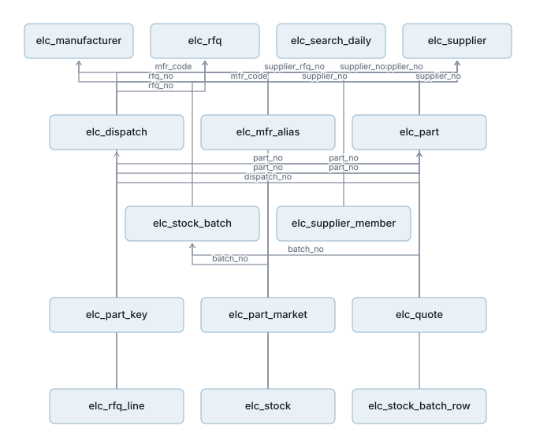

# 数据库 · 元器件（ai_shop_elec）

> 由 `node scripts/gen-elec-erd.mjs` 从 `backend/elec/elec-core/src/main/resources/db/elec/V*.sql` 生成，**请勿手改**。
> 设计与取舍见 [TDD-元器件-独立服务与第一步](../TDD-元器件-独立服务与第一步.md)。

**另一个库**，与 `ai_shop` 零共享表、零跨库 join：15 张表、17 条引用关系，跑在独立进程 elec-svc 里。
搬走那天库原样带走 —— 这正是「第一刀切在数据」的意思。

## 表

| 表 | 列 | 做什么 |
|---|---|---|
| `elc_dispatch` | 15 | 派单：**供应商能看到求购的唯一通道**。他拿到的是 dispatch_no，与买家的 rfq_no 对不上 |
| `elc_manufacturer` | 10 | 厂牌。种子写、代码只读 |
| `elc_mfr_alias` | 6 | 厂牌别名：TI / Texas Instruments / 德州仪器 指同一家。**搜索命中率靠它** |
| `elc_part` | 15 | 料号。平台的资产，不属于任何供应商；第一步由上传长出来 |
| `elc_part_key` | 6 | 料号分段键：在字母/数字交界处切开，让「F103C8」这种中段也能按前缀搜到 |
| `elc_part_market` | 16 | **买家面的库存投影**：数量与家数只存档位，没有供应商列 |
| `elc_quote` | 23 | 供应商报价（他填的原样）。买家看到的是加价并换成代号之后的 |
| `elc_rfq` | 31 | 询价单（买家发的求购）+ 平台自己报的那一份 |
| `elc_rfq_line` | 19 | 询价行 + 平台对这一行的报价。quote_e6 为空 = 平台没报（供应商可能报了，在 elc_quote） |
| `elc_search_daily` | 10 | 搜索需求日聚合：搜了什么、几次没结果。**不记是谁搜的** |
| `elc_stock` | 30 | 供应商库存行。**精确数量与批号只在这张表**，买家读不到 |
| `elc_stock_batch` | 23 | 一次上传：列映射、预演出来的四个数（新增/更新/下架/未变） |
| `elc_stock_batch_row` | 6 | 上传原样的每一行。只追加 —— 换列映射时按它重算，不用再传一次文件 |
| `elc_supplier` | 16 | 供应商主体。点一下就成为供应商，公司名等之后补 |
| `elc_supplier_member` | 9 | 谁能代表这家供应商。account_ref = 主系统的用户号 |

## 引用关系

本库**没有外键**（与进销存同一条通则：完整性由聚合根 + 唯一键兜底），下面是靠业务键推出来的：

| 从 | 列 | 指向 |
|---|---|---|
| `elc_mfr_alias` | `mfr_code` | `elc_manufacturer` |
| `elc_part` | `mfr_code` | `elc_manufacturer` |
| `elc_part_key` | `part_no` | `elc_part` |
| `elc_supplier_member` | `supplier_no` | `elc_supplier` |
| `elc_stock_batch` | `supplier_no` | `elc_supplier` |
| `elc_stock_batch_row` | `batch_no` | `elc_stock_batch` |
| `elc_stock` | `supplier_no` | `elc_supplier` |
| `elc_stock` | `part_no` | `elc_part` |
| `elc_stock` | `batch_no` | `elc_stock_batch` |
| `elc_part_market` | `part_no` | `elc_part` |
| `elc_rfq_line` | `rfq_no` | `elc_rfq` |
| `elc_rfq_line` | `part_no` | `elc_part` |
| `elc_dispatch` | `rfq_no` | `elc_rfq` |
| `elc_dispatch` | `supplier_no` | `elc_supplier` |
| `elc_quote` | `dispatch_no` | `elc_dispatch` |
| `elc_quote` | `rfq_no` | `elc_rfq` |
| `elc_quote` | `supplier_no` | `elc_supplier` |

> `buyer_ref` / `account_ref` 指向**主系统**的用户号，本库里没有那张表，所以图上没有这两条线。
> 跨库只存外部键 —— 元器件独立出去时，换的是这两列的取值，不是结构。
