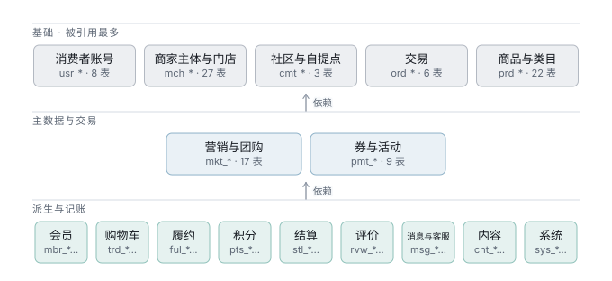
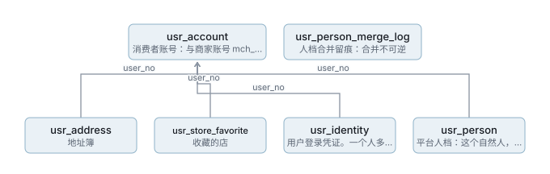
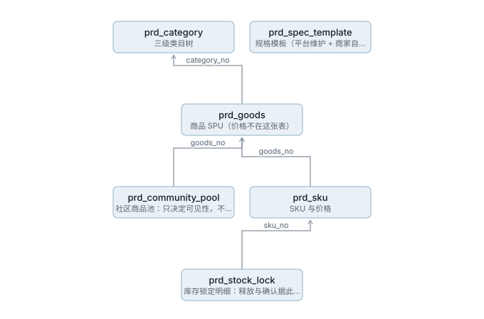
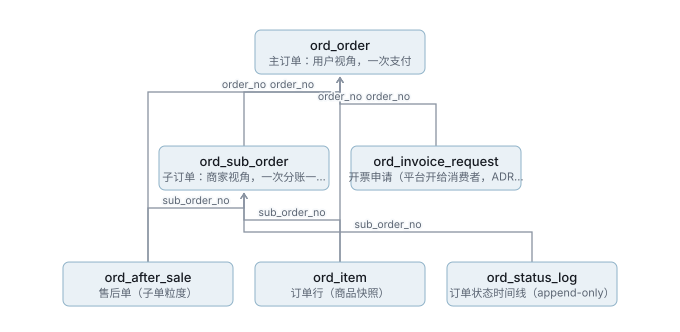
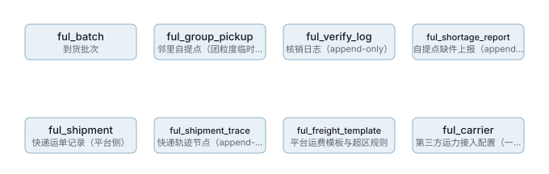
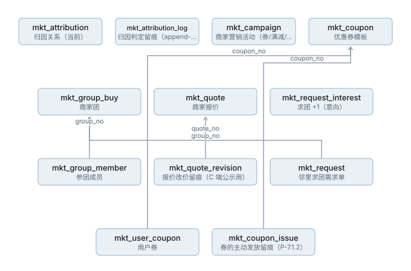
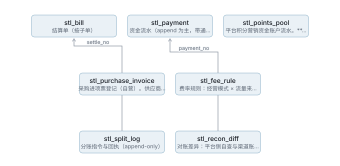
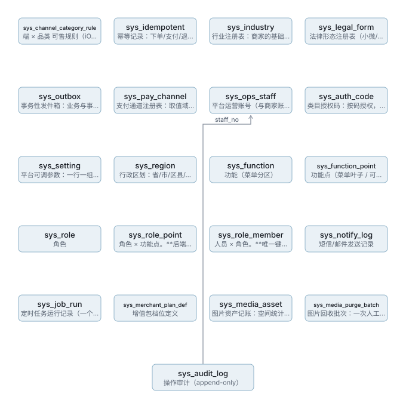

# 数据库 ER 图

> 由 `npm run gen:erd` 从 Flyway 迁移生成，**请勿手改**。
> 图为 SVG，任何环境都能打开；改表后重跑即可，不会漂移。

## 一、总览

全库 **63** 张表、**111** 条引用关系，分 **12** 个域。
按「被引用次数」分三条带 —— **不是有向无环图**：域之间存在环
（`cmt → mkt → usr → cmt`），强行分层会画错。

| 域 | 前缀 | 表数 | 被几个域引用 |
|---|---|---:|---:|
| 用户与商家 | `usr_*` | 4 | 10 |
| 社区与自提点 | `cmt_*` | 2 | 6 |
| 商品与类目 | `prd_*` | 6 | 4 |
| 购物车 | `trd_*` | 1 | 0 |
| 交易 | `ord_*` | 5 | 6 |
| 履约 | `ful_*` | 3 | 0 |
| 营销与团购 | `mkt_*` | 11 | 3 |
| 积分 | `pts_*` | 2 | 0 |
| 结算 | `stl_*` | 4 | 0 |
| 评价 | `rvw_*` | 3 | 0 |
| 消息与客服 | `msg_*` | 3 | 0 |
| 系统 | `sys_*` | 10 | 0 |

> `usr` 被 10 个域引用 —— 它是全库的锚点。改它的主键或语义，影响面是全局的。

## 二、分域

### 用户与商家 `usr_*`（4 张）

| 表 | 说明 |
|---|---|
| `usr_address` | 地址簿 |
| `usr_store_favorite` | 收藏的店 |
| `usr_account` | 消费者账号：与商家账号 mch_account 彻底独立，不关联 |
| `usr_identity` | 用户登录凭证。一个人多条，新增来源只是多一行，不再改表 |

**跨域引用**：`usr_store_favorite.entity_no` → `mch_entity`、`usr_account.community_no` → `cmt_community`、`usr_account.pickup_no` → `cmt_pickup_point`、`usr_account.entity_no` → `mch_entity`

### 社区与自提点 `cmt_*`（2 张）

| 表 | 说明 |
|---|---|
| `cmt_community` | 社区 |
| `cmt_pickup_point` | 自提点（ADR-005） |

**跨域引用**：`cmt_pickup_point.group_no` → `mkt_group_buy`

### 商品与类目 `prd_*`（6 张）

| 表 | 说明 |
|---|---|
| `prd_category` | 三级类目树 |
| `prd_community_pool` | 社区商品池：只决定可见性，不存价 |
| `prd_goods` | 商品 SPU（价格不在这张表） |
| `prd_sku` | SKU 与价格 |
| `prd_spec_template` | 规格模板（平台维护 + 商家自存） |
| `prd_stock_lock` | 库存锁定明细：释放与确认据此幂等 |

**跨域引用**：`prd_community_pool.community_no` → `cmt_community`、`prd_community_pool.entity_no` → `mch_entity`、`prd_goods.entity_no` → `mch_entity`、`prd_sku.entity_no` → `mch_entity`、`prd_spec_template.entity_no` → `mch_entity`

### 购物车 `trd_*`（1 张）

| 表 | 说明 |
|---|---|
| `trd_cart_item` | 购物车（不存价，读时实时算） |

**跨域引用**：`trd_cart_item.user_no` → `usr_account`、`trd_cart_item.goods_no` → `prd_goods`、`trd_cart_item.sku_no` → `prd_sku`

### 交易 `ord_*`（5 张）

| 表 | 说明 |
|---|---|
| `ord_after_sale` | 售后单（子单粒度） |
| `ord_item` | 订单行（商品快照） |
| `ord_order` | 主订单：用户视角，一次支付 |
| `ord_status_log` | 订单状态时间线（append-only） |
| `ord_sub_order` | 子订单：商家视角，一次分账一条履约链 |

**跨域引用**：`ord_after_sale.user_no` → `usr_account`、`ord_after_sale.entity_no` → `mch_entity`、`ord_item.goods_no` → `prd_goods`、`ord_item.sku_no` → `prd_sku`、`ord_order.user_no` → `usr_account`、`ord_order.community_no` → `cmt_community`、`ord_sub_order.user_no` → `usr_account`、`ord_sub_order.entity_no` → `mch_entity`、`ord_sub_order.pickup_no` → `cmt_pickup_point`、`ord_sub_order.group_no` → `mkt_group_buy`、`ord_sub_order.store_no` → `mch_store`

### 履约 `ful_*`（3 张）

| 表 | 说明 |
|---|---|
| `ful_batch` | 到货批次 |
| `ful_group_pickup` | 邻里自提点（团粒度临时点，随团生灭，零报酬） |
| `ful_verify_log` | 核销日志（append-only） |

**跨域引用**：`ful_batch.pickup_no` → `cmt_pickup_point`、`ful_group_pickup.pickup_no` → `cmt_pickup_point`、`ful_group_pickup.group_no` → `mkt_group_buy`、`ful_group_pickup.user_no` → `usr_account`、`ful_verify_log.sub_order_no` → `ord_sub_order`、`ful_verify_log.pickup_no` → `cmt_pickup_point`

### 营销与团购 `mkt_*`（11 张）

| 表 | 说明 |
|---|---|
| `mkt_attribution` | 归因关系（当前） |
| `mkt_attribution_log` | 归因判定留痕（append-only，可回放） |
| `mkt_campaign` | 商家营销活动（券/满减/限时特价/买赠统一模型） |
| `mkt_coupon` | 优惠券模板 |
| `mkt_group_buy` | 商家团 |
| `mkt_group_member` | 参团成员 |
| `mkt_quote` | 商家报价 |
| `mkt_quote_revision` | 报价改价留痕（C 端公示用） |
| `mkt_request` | 邻里求团需求单 |
| `mkt_request_interest` | 求团 +1（意向） |
| `mkt_user_coupon` | 用户券 |

**跨域引用**：`mkt_attribution.user_no` → `usr_account`、`mkt_attribution.entity_no` → `mch_entity`、`mkt_attribution.inviter_no` → `usr_account`、`mkt_attribution_log.user_no` → `usr_account`、`mkt_attribution_log.entity_no` → `mch_entity`、`mkt_attribution_log.inviter_no` → `usr_account`、`mkt_campaign.entity_no` → `mch_entity`、`mkt_coupon.entity_no` → `mch_entity`、`mkt_group_buy.goods_no` → `prd_goods`、`mkt_group_buy.sku_no` → `prd_sku`、`mkt_group_buy.entity_no` → `mch_entity`、`mkt_group_buy.pickup_no` → `cmt_pickup_point`、`mkt_group_member.user_no` → `usr_account`、`mkt_quote.entity_no` → `mch_entity`、`mkt_quote_revision.entity_no` → `mch_entity`、`mkt_request.pickup_no` → `cmt_pickup_point`、`mkt_request_interest.user_no` → `usr_account`、`mkt_user_coupon.user_no` → `usr_account`、`mkt_user_coupon.order_no` → `ord_order`

### 积分 `pts_*`（2 张）

| 表 | 说明 |
|---|---|
| `pts_user_account` | 用户积分账户（锁行 + 派生余额） |
| `pts_user_ledger` | 用户积分流水（真源）。EARN/USE/REFUND/EXPIRE/REVOKE 五种行，**没有批次概念**（V30 起按账户滚动到期） |

**跨域引用**：`pts_user_account.user_no` → `usr_account`、`pts_user_ledger.user_no` → `usr_account`、`pts_user_ledger.issuer_merchant_no` → `mch_entity`、`pts_user_ledger.sub_order_no` → `ord_sub_order`

### 结算 `stl_*`（4 张）

| 表 | 说明 |
|---|---|
| `stl_bill` | 结算单（按子单） |
| `stl_payment` | 资金流水（append 为主，带通道回执与对账状态）：收款 / 退款 / 补差 / 补差回退 / 打款 |
| `stl_points_pool` | 平台积分营销资金账户流水。**平台自己的钱**，用于兑现平台发出的积分（同平台优惠券补差） |
| `stl_split_log` | 分账指令与回执（append-only） |

**跨域引用**：`stl_bill.sub_order_no` → `ord_sub_order`、`stl_bill.order_no` → `ord_order`、`stl_bill.entity_no` → `mch_entity`、`stl_payment.order_no` → `ord_order`、`stl_payment.sub_order_no` → `ord_sub_order`、`stl_payment.after_sale_no` → `ord_after_sale`、`stl_payment.user_no` → `usr_account`、`stl_payment.entity_no` → `mch_entity`、`stl_points_pool.entity_no` → `mch_entity`、`stl_split_log.sub_order_no` → `ord_sub_order`

### 评价 `rvw_*`（3 张）

| 表 | 说明 |
|---|---|
| `rvw_appeal` | 商家对差评的申诉（P-13.1.3 裁决入口） |
| `rvw_review` | 商品评价（含三维分） |
| `rvw_review_like` | 评价点赞明细（likeCount 的真源） |

**跨域引用**：`rvw_appeal.entity_no` → `mch_entity`、`rvw_review.sub_order_no` → `ord_sub_order`、`rvw_review.order_no` → `ord_order`、`rvw_review.goods_no` → `prd_goods`、`rvw_review.sku_no` → `prd_sku`、`rvw_review.entity_no` → `mch_entity`、`rvw_review.user_no` → `usr_account`、`rvw_review_like.user_no` → `usr_account`

### 消息与客服 `msg_*`（3 张）

| 表 | 说明 |
|---|---|
| `msg_message` | 站内消息 |
| `msg_subscribe` | 订阅消息授权 |
| `msg_ticket` | 客服工单 |

**跨域引用**：`msg_message.user_no` → `usr_account`、`msg_subscribe.user_no` → `usr_account`、`msg_ticket.user_no` → `usr_account`、`msg_ticket.order_no` → `ord_order`

### 系统 `sys_*`（10 张）

| 表 | 说明 |
|---|---|
| `sys_audit_log` | 操作审计（append-only） |
| `sys_channel_category_rule` | 端 × 品类 可售规则（iOS IAP 约束等） |
| `sys_idempotent` | 幂等记录：下单/支付/退款/核销必接 |
| `sys_industry` | 行业注册表：商家的基础属性，平台维护。通道准入（能否小微）按它判 |
| `sys_legal_form` | 法律形态注册表（小微/个体户/企业）：表管通道映射与资质要求，类型管取值 |
| `sys_outbox` | 事务性发件箱：业务与事件同事务落库 |
| `sys_pay_channel` | 支付通道注册表：取值域与能力位。积分抵扣是否可用由 supports_subsidy 决定 |
| `sys_ops_staff` | 平台运营账号（与商家账号 mch_account 是两套人，键 staff_no 从此只有一个含义） |
| `sys_auth_code` | 类目授权码：按码授权，不按类目节点 |
| `sys_setting` | 平台可调参数：一行一组，值为 JSON |

**跨域引用**：`sys_idempotent.user_no` → `usr_account`

## 三、逐表详情

见网页版 [数据库-ER图.html](./数据库-ER图.html) —— 54 张表的字段、类型、索引、关联。
Markdown 里铺开会有近两千行，那不是给人读的。

## 四、不可按名字连线的列

以下列名出现在多张表里但**语义不同**，图中刻意不连：

| 列 | 为什么 |
|---|---|
| `request_no` | `mkt_request` 是求团需求单号；`stl_split_log` 是分账幂等号 |
| `express_no` | `ord_sub_order` 是发货单号；`ord_after_sale` 是退货单号，**方向相反** |
| `operator_no` | 各表各自记录操作人，不是外键 |
