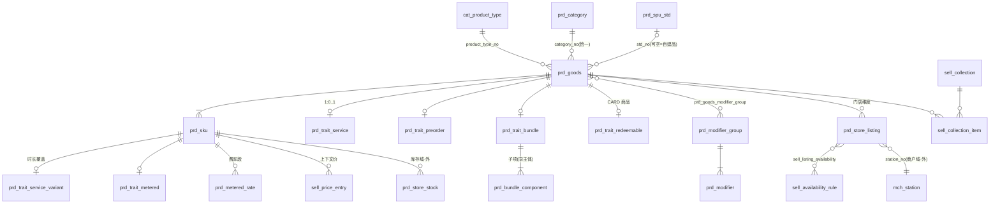
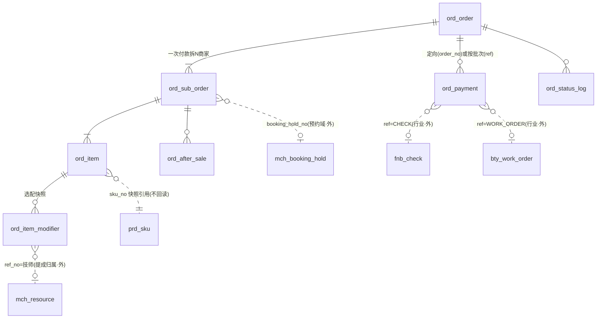

# 15 · 商品域 + 订单域 · 数据表总册（V2.0 全量）

状态：**数据字典 · 与规格书同批维护** · 创建 2026-08-29
定位：四行业（零售/餐饮/美业/电子元器件）落定后，商品与订单两域的**干净全量视图**：
表清单 → 表关联 → 逐表细节。**SQL 级 DDL 以两本规格书为准**
（[商品域](../technical/design/商品域V2-设计规格书.md) · [订单域](../technical/design/订单域V2-设计规格书.md)，含元器件回填），
本册是列级数据字典；表名漂移由 [V2 文档守卫](../../scripts/check-v2-docs.mjs)盯。

**通用列（每表都有，下文不再重复）**：`id` 自增物理主键（不对外、不进 URL）· `tenant_no`（恒 MAIN 留位）·
审计四列（`created_at/by` `updated_at/by`）· `version` 乐观锁 · `deleted` 软删。金额一律分（BIGINT），绝不浮点。

---

# 一 · 表清单

## 1.1 商品域（26 张 = 新建/改造 21 + 沿用 5）

| # | 表 | 层 | 状态 | 一句话 |
|---|---|---|---|---|
| G01 | `cat_product_type` | 治理 | 新建 | 产品类型 = Trait 组合（**数据**，新行业=加行） |
| G02 | `prd_category` | 治理 | 沿用+1列 | 后台类目（资质/税务）；加 `default_type_no` |
| G03 | `prd_goods` | 目录 | 目标态 | SPU：内容 + 售卖语义 + 审核；**不再新增行为列** |
| G04 | `prd_sku` | 目录 | 沿用 | SKU：基线价/条码/计量；stock 物理驻留、库存域所辖 |
| G05 | `prd_trait_service` | Trait | 新建 | 服务行为：时长/缓冲/资源需求（SPU 级） |
| G06 | `prd_trait_service_variant` | Trait | 新建 | 60/90 分钟档按 SKU 覆盖时长 |
| G07 | `prd_trait_metered` | Trait | 新建 | 按实计量：WEIGHT 今、TIME/DISTANCE 留位 |
| G08 | `prd_metered_rate` | Trait | 新建 | 计量费率表（独立成对象——改形状比加形态贵） |
| G09 | `prd_trait_preorder` | Trait | 新建 | 预售截单/到货 |
| G10 | `prd_trait_bundle` | Trait | 新建 | 组合头：FIXED/CHOICE/SERIES |
| G11 | `prd_bundle_component` | Trait | 新建 | 组合明细（套餐≡疗程≡礼盒） |
| G12 | `prd_trait_redeemable` | Trait | 新建* | 卡定义（VALUE/TIMES/PERIOD）——*DDL 在会员资产规格书，物理属商品侧 |
| G13 | `prd_modifier_group` | 选配 | 新建 | 选配组：必选/上下限/来源（含 RESOURCE:STAFF） |
| G14 | `prd_modifier` | 选配 | 新建 | 选配项：定额/比例/可负加价，不建 Variant |
| G15 | `prd_goods_modifier_group` | 选配 | 新建 | 商品↔组（组可复用） |
| G16 | `prd_store_listing` | 售卖 | 改名+扩列 | 门店报价（原 `prd_store_goods`）：上下架/工位/限量/**SPQ·倍数** |
| G17 | `sell_price_entry` | 售卖 | 新建 | 价格条目：渠道×客群×**数量档**×有效期，运行时 resolve |
| G18 | `sell_availability_rule` | 售卖 | 新建 | 可售时段规则（门店级） |
| G19 | `sell_listing_availability` | 售卖 | 新建 | listing↔规则（零行=全时段；**挂 listing 不挂 goods**） |
| G20 | `sell_collection` | 售卖 | 新建 | 前台陈列（菜单分类/项目分组/本店推荐；PLATFORM/STORE） |
| G21 | `sell_collection_item` | 售卖 | 新建 | 陈列内商品与排序/置顶 |
| G22 | `prd_spu_std` | 沿用 | 沿用 | 平台标准品（跨店可比；元器件 MPN×厂商落这里） |
| G23 | 规格四层（`prd_spec_dim` 等 4 张） | 沿用 | 沿用 | V195 规格库，**不重建**；Option 是领域视图 |
| G24 | `prd_topic` | 沿用 | 沿用 | 平台陈列专题（与门店 Collection 正交） |
| G25 | `prd_store_stock` | 沿用 | 沿用 | 门店库存（库存域边界内；沽清不碰它） |
| G26 | `prd_store_price` | 过渡 | **迁移后退役** | M12：存量迁入 G17 后下线，双源有死期 |

## 1.2 订单域（8 张 = 新建 2 + 加列 2 + 沿用 4）

| # | 表 | 状态 | 一句话 |
|---|---|---|---|
| O01 | `ord_order` | 沿用 | 主单 = 支付边界（五态；MIXED 是数据不是列） |
| O02 | `ord_sub_order` | +2 列 | 子单 = 商家×履约边界；+`asset_deduct_minor` `booking_hold_no` |
| O03 | `ord_item` | +4 列 | 行 = 快照；+`line_kind` `modifier_total_minor` `price_hit` `shipped_qty` |
| O04 | `ord_item_modifier` | **新建** | 行选配明细（做法/加料/指定技师快照） |
| O05 | `ord_payment` | **新建** | 收款流水（上收自行业；MIXED 明细/收银台/交班对账） |
| O06 | `ord_status_log` | 沿用 | 状态迁移留痕 |
| O07 | `ord_after_sale` | 沿用 | 售后独立状态机（受商品 `after_sale_policy` 分流） |
| O08 | `ord_invoice_request` | 沿用 | 发票申请 |

---

# 二 · 表关联

## 2.1 商品域

## 2.2 订单域（含跨域引用，虚线=快照/外域）

**三条关联纪律**（图上看不出来但最重要）：
① 订单侧全部是**快照引用** —— 下单后商品怎么改都与历史订单无关；
② 行业表（`fnb_/bty_/elc_`）持 `order_no` **反向引用**订单，订单表零行业列；
③ 跨域只经业务键，永不外键级联 —— 删商品不许波及订单（本来也删不了，软删）。

---

# 三 · 商品域逐表细节

### G01 `cat_product_type` —— 产品类型（行为画像）
| 列 | 说明 |
|---|---|
| `type_no` | 业务键，唯一 |
| `name` | 「日用百货」「鲜活海产」「美容项目」「电子元器件」 |
| `legacy_type` | → `prd_goods.type` 缓存映射（NORMAL/FRESH/SERVICE/VIRTUAL/CARD） |
| `traits` JSON | 取值域=代码 `Trait` 枚举，**启动时校验**；如 `["METERED","DAILY_PRICED"]` |
| `attribute_sets` JSON | 挂载的描述属性集 |
| `status` | ACTIVE/ARCHIVED |

要点：**新行业=配行零发版**；改 `traits` 是危险动作（存量商品 Trait 数据要迁移，走审批）。

### G02 `prd_category`（沿用+1）
既有类目树（资质文案 `qualification_required`、判据码 `required_code`、五品类 `template`）。
V2 加 `default_type_no`：建品时默认带出的产品类型，可改。

### G03 `prd_goods` —— SPU（目标态）
| 组 | 列 | 说明 |
|---|---|---|
| 身份 | `goods_no` `entity_no` | 业务键、归属主体 |
| 分类 | `product_type_no` · `type`(缓存) · `category_no` · `std_no` | type 由 type_no 派生仅供查询；std 有值⇒类目/optionCode 以标准品为准 |
| 内容 | `title(+i18n)` `subtitle(+i18n)` `cover` `images` `detail` `detail_images` | 轮播与长图分开存；detail 纯文本 |
| 属性 | `params` JSON | **给买家看**（Schema 校验、可筛选）；**系统逻辑禁读**（ArchUnit） |
| 提示 | `caution` | 禁忌/注意事项：**交易前置弹出**，不是详情段落 |
| 售卖 | `fulfillments` `pay_modes` | 取值域常量类约束（含 DINE_IN） |
| 策略 | `after_sale_policy` | STANDARD/NO_RETURN/BY_CANCEL_RULE —— 售后受理按它分流 |
| | `lifecycle` | ACTIVE/NRND/EOL/OBSOLETE（元器件回填；NULL=不适用） |
| | `limit_per_user` · 拼团两列 · `points_config` · `sellable_override` | 既有语义不变 |
| 状态 | `audit_state` `on_sale` `pending_on_sale` | 重审期间记住上架意向 |

要点：**行为字段一律在 Trait 表，此表不再新增行为列**（STI 纪律）。

### G04 `prd_sku` —— SKU
| 列 | 说明 |
|---|---|
| `sku_no` `goods_no` `entity_no` `market` | 唯一键 `(goods_no, market, option_values)` |
| `option_values(+nos)` `spec` | 规格取值（序对齐 spec_groups）与展示文案 |
| `barcode` `merchant_sku_code` | ERP/收银秤/供应商通用键；收银台扫码索引 `(entity_no, barcode)` |
| `sale_unit` | 份/例/斤/次/位/晚/只 |
| `price` `currency` `origin_price` `cost_price` | **基线价**；上下文价在 G17 |
| `stock` `locked_stock` `presale_*` | **库存域所辖**，商品域只读不写 |

### G05–G06 服务 Trait
`prd_trait_service`（goods_no PK）：`duration_min` · `buffer_before/after_min`（路途/清洁）·
`resource_type`（STAFF/SEAT/ROOM，与资源域同源）· `resource_count`（双人=2）。
`prd_trait_service_variant`（sku_no PK）：`duration_min` 覆盖 —— 60/90 档是 Option 产生两个 SKU，各自覆盖时长。
要点：占位格数 `ceil((duration+buffers)/粒度)×count` **算法在预约域**，本表只供数。

### G07–G08 计量 Trait
`prd_trait_metered`（sku_no PK）：`dimension`（WEIGHT 今／TIME/DISTANCE 写入拒绝）· `nominal_qty` `unit` · `tolerance_pct`（超允差须人工确认）。
`prd_metered_rate`：`seq`（起步/续步段）· `from_qty` · `step_qty`（NULL=单价×量）· `step_price` · `time_band`（分时费率留位）。
要点：挂 **SKU 级**（整鱼/切段标称重不同）；费率段连续无重叠（不变量）；差额进订单行 `weigh_adjust_minor`。

### G09 `prd_trait_preorder`
`cutoff_time`（每日截单点）· `lead_days` · `arrival_desc`。改截单**不触发重审**（/presale 旁路语义并入）。

### G10–G11 组合 Trait
头表 `kind`：FIXED 固定｜CHOICE 可选组｜SERIES 次数（疗程）。
明细：`group_name`+`choose_count`（CHOICE「主食三选一」）· `sku_no`（**必须同主体**）· `qty` · `times`（SERIES）。

### G12 `prd_trait_redeemable` —— 卡定义（CARD 商品）
`card_kind`（VALUE/TIMES/PERIOD-记账）· `face_value`+`bonus_value`（充100送20）· `total_times` ·
`valid_days` · `scope_type/refs`（ALL/CATEGORY/GOODS 白名单）· `store_scope`（ENTITY/STORE）· `transferable`（恒0留位）。
要点：**卖卡=普通订单，发卡=履约**（onPaid 幂等）；余额余次在会员资产域，本表只是定义。

### G13–G15 选配
`prd_modifier_group`：`entity_no`（商家级复用，门店经 listing 禁用）· `selection`（SINGLE/MULTI）·
`required`+`min/max_pick`（必选组不选不让下单）· `source`（MANUAL｜RESOURCE:STAFF——选项由资源域同步只读）· `visible_to_buyer`。
`prd_modifier`：`price_delta`（可负：自带工具−10）**或** `price_delta_pct`（加急+50%）二选一 · `ref_no`（技师 resource_no）· `is_default` `sort`。
关系表：`(goods_no, group_no)`+sort —— 一个「辣度」给 30 道菜复用。
要点：**不建 Variant、不追库存**（珍珠库存是进销存 BOM 的事）；选中即快照进 O04。

### G16 `prd_store_listing` —— 门店报价（Offer）
| 列 | 说明 |
|---|---|
| `listing_no` `store_no` `goods_no` `entity_no` | 唯一 `(store_no, goods_no)` |
| `state` | ON/OFF/**PLATFORM_SUSPENDED**（平台挂起商家不可自行解除） |
| `channels` JSON | 可售渠道；NULL=全部（SalesChannels 五值） |
| `station_no` | 出品工位（商户域）→ 厨打/拣货路由按它 JOIN |
| `course_no` | 上菜道次（**待观察字段**） |
| `daily_quota` `quota_used` `quota_reset` | 每日限量：沽清=置0、条件 UPDATE 扣、营业日归零；**与库存无关（流量 vs 存量）** |
| `moq` · `spq` · `order_multiple` | 起订量 · 标准包装量 · 订购倍数（后两列元器件回填；下单校验 `qty%multiple==0`） |
| `disabled_modifier_groups` JSON | 门店禁用总部选配组 |

### G17 `sell_price_entry` —— 价格条目
| 列 | 说明 |
|---|---|
| `sku_no` | 定价对象 |
| `store_no?` `channel?` `tier?` | NULL=不限定该维；specific 优先 |
| `min_qty` | **数量档**（元器件回填；1/100/1000）；零售满量优惠共享 |
| `price` `currency` | |
| `valid_from/to` | 每日定价（时价菜/生鲜时价）= 圈住当天 |

解析（唯一判定处 `PricingService.resolve`）：时间窗内候选 → **最具体者胜（store>channel>tier）×
满足数量的最高档** → 全无则回落 `prd_sku.price`；命中信息落订单快照 `price_hit`（O8：无命中拒单）。

### G18–G19 可售时段
规则：`days_mask`(1111100) · `start/end_min`（跨夜拆两条）· `channels`。
关系挂 **listing**（零行=全时段）—— 同一商品 A 店午市卖、B 店全天卖，挂 goods 表达不了（反模式清单在案）。

### G20–G21 陈列
`owner_type`（PLATFORM/STORE）· `kind`（MANUAL/SMART+rule，Job 物化）· item 带 `sort` `pinned`。
行业叫法（菜单分类/项目分组/商品分组）是**词条不是分支**。

### G22–G26 沿用组
`prd_spu_std` 标准品（元器件 MPN×厂商）｜规格四层不重建（Option 是领域视图）｜
`prd_topic` 平台专题｜`prd_store_stock` 库存域边界｜`prd_store_price` **M12 迁入 G17 后退役（双源死期一个版本）**。

---

# 四 · 订单域逐表细节

### O01 `ord_order` —— 主单（支付边界）
| 组 | 列 | 说明 |
|---|---|---|
| 身份 | `order_no` `user_no` `community_no` | |
| 金额 | `goods/freight/discount/pay_amount` `currency` | 聚合快照；真源在行 |
| 状态 | `status` | WAIT_PAY / **WAIT_OFFLINE_PAY**（先吃后付≡账期赊销，超时按门店配置且台账未结不取消）/ PAID / CANCELLED / CLOSED |
| 支付 | `pay_channel` `pay_trade_no` `pay_scene` `paid_at` `pay_deadline_at` | MIXED=通道表加行；trade_no=收款批次引用 |
| 线下 | `offline_confirmed_by/at` | 确认收款留痕 |

### O02 `ord_sub_order` —— 子单（商家×履约）
| 组 | 列 | 说明 |
|---|---|---|
| 归属 | `sub_order_no` `order_no` `user_no` `entity_no` `store_no` `entity_name` | entity 历史快照语义 |
| 履约 | `fulfillment` · pickup 三列 · receiver 三列 · `express_no` · `verify_code` | 含 DINE_IN；SERVICE_LIKE 付款直落 FULFILLING |
| 预约 | `appointment_at/slot_no/released_at` · **`booking_hold_no`** | at 由时段推出不信端上；released 先标记后释放；hold 为 V2 多格占位（旧单格路径保留） |
| 金额 | goods/freight · `discount_platform/merchant` · points 两列 · **`asset_deduct_minor`** · `weigh_adjust_minor` → `pay_amount` | O5：payAmount=各项分解且非负；asset=预收款核销（非补贴非让利） |
| 结算 | `merchant_recv/channel_fee/commission/service_fee` | 快照 |
| 其它 | `status` `traffic_source` `group_no` `reviewed` `remark` … | 六态子单图 |

### O03 `ord_item` —— 行（快照）
| 列 | 说明 |
|---|---|
| `sub_order_no` `order_no` `goods_no?` `sku_no?` | FEE 行两键为空 |
| **`line_kind`** | PRODUCT / FEE（附加费：无 SKU 不锁库存不称重）/ GIFT（金额恒 0 **退款不退钱**）；`is_gift` 只读兼容一期 |
| 快照 | `title` `cover` `spec` `category_type/no` | 历史凭证，不回读商品 |
| `price` · **`price_hit`** | 成交单价=resolve 结果；命中(entryNo+specificity 或 QUOTE:<no>:v<n>)——事后可复现（O8） |
| `qty` · **`shipped_qty`** | 分批交货（元器件回填）：=qty 行闭合，全行闭合子单才 COMPLETED（O9） |
| **`modifier_total_minor`** | 行内选配合计，恒等于 O04 求和（O2 冗余校验） |
| `amount` | = price×qty + modifier_total + weigh_adjust，≥0（O1） |
| 计量 | `nominal_gram` `weighed` `weigh_adjust_minor` | 语义扩为通用计量（维度看商品 trait） |

### O04 `ord_item_modifier` —— 行选配明细（新）
`order_item_id` · `group_no/name` `modifier_no/name`（**全快照**）· `price_delta`（比例已折算，可负；行合计≥0）·
`ref_no`（RESOURCE 源快照=技师 resource_no —— **提成归属/派工读它**）。
要点：做法(Δ0)与加料(Δ>0)同构；**厨房票/按行退款/结算/提成都读这里，不再有「加料行」**。

### O05 `ord_payment` —— 收款流水（新，上收自行业）
| 列 | 说明 |
|---|---|
| `payment_no` `entity_no` `store_no?` | |
| `ref_type` `ref_no` | ORDER / CHECK(餐饮台账) / WORK_ORDER(美业) / CASHIER(收银批次)——行业结账=多行 |
| `order_no?` | 定向单笔（按单拆结）；对台账收款为空 |
| `pay_channel` `amount` `trade_no` | 通道表判现金与否；资产通道=名义抵扣额 |
| `status` | PENDING→SUCCESS/FAILED；SUCCESS→REVERSED **仅一次**（O7，冲正先于退款存在性检查） |
| `idem_key` 唯一 | 重复提交只产生一笔 |
| `operator` | 交班/对账按 store+时间扫 |

要点：settle 足额（Σ SUCCESS ≥ 应收）才逐单 `markPaid(MIXED, ref_no)`（O6，足额判定归调用方，基座验非负与超收上限=抹零决议 C1）。

### O06–O08 沿用组
`ord_status_log` 状态留痕｜`ord_after_sale` 六态售后（受 G03.`after_sale_policy` 分流；退行含 O04 金额、GIFT 不退）｜`ord_invoice_request` 发票。

---

# 五 · 四行业覆盖自检（每行业点一个最刁的需求）

| 行业 | 最刁需求 | 用到的表 |
|---|---|---|
| 零售 | 称重生鲜先售后称补差 | G07 + O03 计量三列 |
| 餐饮 | 一桌三轮加菜混合收款 AA | O01×3 + O05(ref=CHECK)×n + settle |
| 美业 | 耗卡实收 0 但提成按原价、指定总监归属 | O02.asset_deduct + O03.price 快照 + O04.ref_no |
| 元器件 | 报价锁价转单 + 1–99/100+/1000+ 三档价 + 分批发货 | O03.price_hit=QUOTE + G17.min_qty + O03.shipped_qty |

**两域合计 34 张表（商品 26 + 订单 8），四行业零行业列。**
